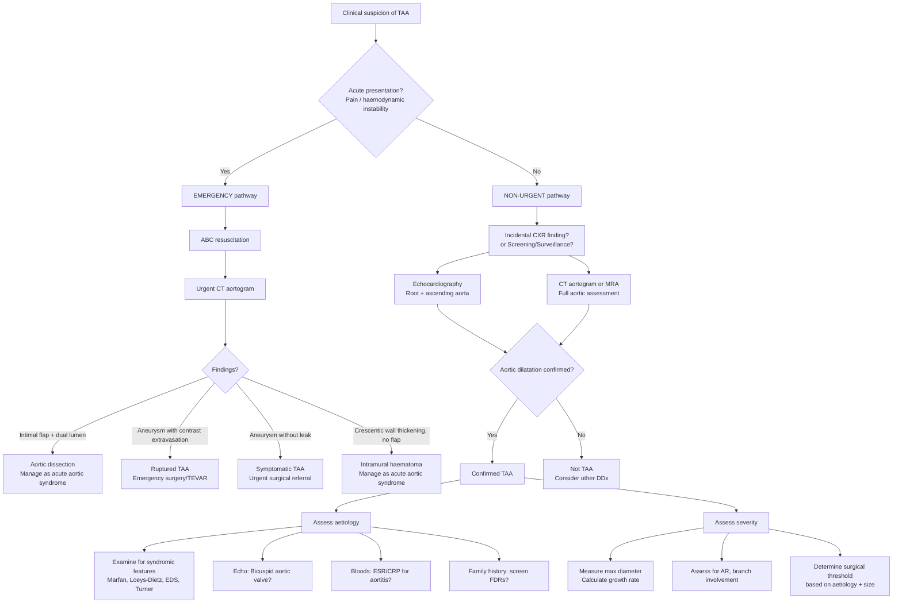

## Diagnostic Criteria, Diagnostic Algorithm, and Investigation Modalities for Thoracic Aortic Aneurysm

---

### Diagnostic Criteria — "How Do We Define and Confirm TAA?"

Unlike conditions such as rheumatic fever or SLE, there are no formal "classification criteria" with point scores for TAA. The diagnosis is fundamentally an **imaging diagnosis** — you measure the aorta and determine whether it meets the size threshold. However, the clinical reasoning process involves several steps.

#### Step 1: Define the Aneurysm

Recall the definition from first principles:

- ***Aneurysm = permanent, localized dilatation of an artery by ≥50% of its normal diameter*** [1][2]
- The normal thoracic aortic diameter varies by **segment**, **age**, **sex**, and **body surface area (BSA)**:

| Segment | Approximate Normal Diameter | TAA Threshold (≥50% dilatation) |
|---|---|---|
| Aortic root (sinuses of Valsalva) | 3.0–3.5 cm | ≥4.5 cm (varies by BSA/sex) |
| Ascending aorta | 3.0–3.5 cm | ≥4.5 cm |
| Aortic arch | 2.5–3.0 cm | ≥3.5–4.0 cm |
| Descending thoracic aorta | 2.0–2.5 cm | ≥3.5 cm |

**Why does BSA matter?** Because a 190 cm tall man naturally has a larger aorta than a 150 cm tall woman. Using an absolute cut-off alone could over-diagnose petite patients and under-diagnose tall patients. The **aortic size index (ASI)** = aortic diameter / BSA (cm/m²) is used especially in connective tissue diseases and Turner syndrome. An ASI > 2.75 cm/m² is considered aneurysmal for the ascending aorta.

<Callout title="Aortic Ectasia vs. Aneurysm">
If the dilatation is < 50% of normal (e.g., a 3.8 cm ascending aorta in a large man), this is termed **aortic ectasia** — not yet an aneurysm, but it needs surveillance because it may progress [2].
</Callout>

#### Step 2: Confirm by Imaging

The diagnosis requires **cross-sectional imaging** demonstrating the dilated aortic segment:
- **CT aortogram** (CTA) — the workhorse investigation (see below)
- **Echocardiography** (TTE/TEE) — especially for aortic root and ascending aorta
- **MR angiography** (MRA) — radiation-free alternative, excellent for surveillance

#### Step 3: Determine the Aetiology

Once TAA is confirmed, you must investigate the **underlying cause** — this directly impacts management thresholds and family screening:
- Syndromic features → genetic testing (Marfan, Loeys-Dietz, EDS IV)
- Bicuspid aortic valve → echocardiography
- Inflammatory markers → aortitis (GCA, Takayasu)
- Infection → blood cultures, PET-CT
- Family history → screening first-degree relatives

#### Step 4: Assess Complications

- Aortic regurgitation → echocardiography
- Branch vessel involvement → CTA
- Signs of impending rupture (rapid growth, pain) → urgent intervention

---

### Diagnostic Algorithm

The approach differs depending on whether the patient presents **acutely** (with pain/haemodynamic instability — suspect rupture or dissection) or **chronically** (incidental finding or surveillance).

---

### Investigation Modalities — Detailed

Let me walk you through each investigation modality systematically — what it shows, why we do it, and how to interpret the findings.

---

#### 1. Chest X-Ray (CXR)

**Role**: Often the **first clue** — TAA is frequently discovered incidentally on CXR done for other reasons.

**Why it works**: The thoracic aorta is a mediastinal structure. When it dilates, it changes the mediastinal contour.

| CXR Finding | What It Means | Pathophysiological Explanation |
|---|---|---|
| ***Widened mediastinum*** | Dilatation of the aorta pushes mediastinal borders outward | The mediastinum contains the aorta; enlargement widens the mediastinal silhouette [3][11] |
| **Abnormal aortic knuckle** (prominent or enlarged) | Dilatation of the aortic arch | The "aortic knuckle" is the normal shadow of the aortic arch on PA CXR; aneurysmal dilatation makes it more prominent or irregular |
| ***Loss of aortic knuckle*** | Suggests acute pathology (dissection, ATAI) rather than chronic TAA | Loss of the normal contour implies disruption of the wall, not just dilatation [6] |
| **Tracheal deviation** (to the right) | Mass effect from a left-sided arch/descending aneurysm | The trachea is pushed away from the expanding aneurysm |
| **Calcification of aortic wall** | Outlines the aneurysm wall | Chronic atherosclerotic or syphilitic aneurysms develop wall calcification — helps estimate the true outer diameter [1] |
| **Left pleural effusion** | May indicate contained rupture or inflammatory process | Blood leaks into left pleural space from descending TAA (the descending aorta abuts the left pleura) |
| **Displaced oesophagus** (deviation of nasogastric tube) | Oesophagus pushed by aneurysm | The oesophagus lies posterior to the aorta; large aneurysms displace it [6] |

<Callout title="CXR Limitations" type="error">
CXR has **low sensitivity** for TAA — a normal CXR does NOT exclude TAA. Many aneurysms, especially of the ascending aorta, may not cause visible mediastinal widening. CXR also **cannot measure the aorta accurately** and cannot distinguish TAA from dissection. Always proceed to cross-sectional imaging if clinical suspicion exists.
</Callout>

---

#### 2. CT Aortogram (CTA) — The Workhorse

**Role**: ***The primary diagnostic and pre-operative planning investigation for TAA*** [2][6][11].

"CT aortogram" = CT with IV contrast, timed to the arterial phase, from the aortic arch to the bifurcation (or from thoracic inlet to pelvis for full assessment). It is essentially a **CT angiography** focused on the aorta [11].

**Why it's first-line**:
- Widely available, fast ( < 10 minutes), non-operator-dependent
- Exquisite anatomical detail — can measure diameter to the nearest millimetre
- Shows the entire aorta in one study (unlike echo which only sees parts)
- Can identify complications (rupture, dissection, branch involvement)
- Essential for **pre-operative planning** — determines whether open repair or endovascular repair (TEVAR) is feasible [1]

| CT Aortogram Finding | Interpretation | Clinical Significance |
|---|---|---|
| **Dilated aortic segment ≥50% of normal** | Confirms TAA | Diagnostic |
| **Maximum diameter measurement** | Determines surgical threshold and surveillance interval | The single most important measurement — dictates management |
| **Mural thrombus** | Layered thrombus within the aneurysm sac | Common in large TAA; reduces effective lumen but does NOT reduce rupture risk (wall stress is determined by outer diameter, not lumen size — Laplace's law applies to the outer wall) |
| **Wall calcification** | Chronic degenerative or atherosclerotic aneurysm | Helps distinguish from acute pathology; also helps identify the outer wall boundary |
| ***Contrast extravasation*** | ***Active rupture*** | ***Surgical emergency*** — blood is leaking outside the aorta |
| **Periaortic haematoma / mediastinal haematoma** | Contained rupture or recent leak | Urgent intervention needed [6] |
| ***Intimal flap with true and false lumen*** | ***Aortic dissection*** (may coexist with TAA) | ***True lumen is compressed by false lumen; true lumen is more hyperdense (new contrast-filled blood), false lumen is more hypodense (older stagnant blood)*** [3] |
| **Crescentic high-attenuation wall thickening (non-contrast)** | Intramural haematoma | Acute aortic syndrome variant — manage as dissection [3] |
| **Focal ulcer-like projection with subadventitial haematoma** | Penetrating atherosclerotic ulcer | Another acute aortic syndrome variant [3] |
| **Relationship to branch vessels** | Involvement of coronary ostia, great vessels, intercostal arteries, visceral arteries | Critical for surgical planning — determines need for bypass/reimplantation |
| **Neck anatomy** (for descending TAA) | Length, angulation, diameter of proximal and distal landing zones | Determines suitability for TEVAR (similar concept to EVAR for AAA) |

> **Important**: ***Conventional angiography (DSA) should NOT be used to assess aneurysm size*** because aneurysms are often lined with circumferential thrombus, giving a **falsely narrowed appearance** of the lumen that does not reflect the true outer diameter [2]. CT measures the entire wall, including thrombus.

**How to measure**: Always measure the **maximum external diameter** perpendicular to the long axis of the aorta (i.e., the true short-axis diameter). Oblique cuts on axial images can overestimate diameter — use multiplanar reformats (MPR) or centreline reconstructions.

---

#### 3. Echocardiography (TTE and TEE)

**Role**: Best for the **aortic root and proximal ascending aorta**; also assesses aortic valve function.

| Modality | What It Sees | Strengths | Limitations |
|---|---|---|---|
| **Transthoracic Echo (TTE)** | Aortic root, sinuses of Valsalva, proximal ascending aorta (~first 3–4 cm), aortic valve | Non-invasive, bedside, no radiation, repeatable. Excellent for root measurements and AR assessment | ***Cannot visualize the distal ascending aorta, arch, or descending thoracic aorta*** [12]. Operator-dependent. Limited by body habitus |
| ***Transoesophageal Echo (TEE)*** | Aortic root, ascending aorta, arch (partial — "blind spot" at distal ascending/proximal arch due to tracheal air), descending thoracic aorta | ***More sensitive than TTE*** for aortic pathology [3]. Excellent for dissection (intimal flap), pericardial effusion, AR | Semi-invasive (requires sedation). Cannot see entire arch. ***Preferred over TTE for acute aortic syndrome*** [3][12] |

**Key Echo Findings in TAA**:

| Finding | Significance |
|---|---|
| **Dilated aortic root / ascending aorta** | Confirms aneurysm; measure at standard levels: sinuses of Valsalva, sinotubular junction, mid-ascending aorta |
| **Aortic regurgitation** (AR) | Indicates annular dilatation from root aneurysm → central AR jet (vs. eccentric in leaflet disease). Quantify severity (mild/moderate/severe) — determines urgency of surgery |
| **LV dilatation, ↓LVEF** | Chronic AR → LV volume overload → eventually decompensation. Triggers earlier surgical intervention |
| ***Pericardial effusion*** | May indicate rupture of ascending TAA into pericardium → ***tamponade*** [3] |
| **Bicuspid aortic valve** | Identifies the underlying aetiology; BAV patients have intrinsic ascending aortopathy |
| ***Intimal flap*** | ***Aortic dissection*** — TEE can visualise the flap oscillating in the lumen [3] |
| ***RWMA*** (regional wall motion abnormalities) | May indicate coronary ostial involvement (dissection extending to coronaries → secondary MI) [3] |

---

#### 4. MR Angiography (MRA)

**Role**: Gold-standard for **surveillance imaging** (no radiation, no iodinated contrast needed for some sequences).

| Feature | Detail |
|---|---|
| **Strengths** | No radiation (ideal for young patients requiring lifelong surveillance, e.g., Marfan). No iodinated contrast needed (gadolinium-enhanced or non-contrast techniques available). Excellent soft tissue contrast. Can assess flow dynamics. Highly reproducible for serial measurements |
| **Limitations** | Slower than CT (20–45 min vs. < 10 min). Contraindicated with certain metallic implants (pacemakers, some mechanical valves). Not suitable for haemodynamically unstable patients (too slow, monitoring equipment incompatible). Less spatial resolution for small branch vessels than CT [12] |
| **Key findings** | Same as CTA — measures diameter, identifies thrombus, assesses branch involvement. Can also assess aortic wall inflammation with late gadolinium enhancement (useful for aortitis) |

> ***MRI is unsuitable for pacing wiring and life support equipment*** — this is why CTA is preferred in acute situations [12].

<Callout title="Surveillance Protocol" type="idea">
For stable, asymptomatic TAA below surgical threshold, current guidelines (2022 ACC/AHA) recommend:
- **First follow-up**: Repeat imaging at **6 months** after initial diagnosis to assess growth rate.
- **If stable**: Annual imaging (CTA or MRA) thereafter.
- **If growing > 0.5 cm/year**: More frequent imaging (every 3–6 months) and consider intervention.
- **Preferred modality for long-term surveillance**: MRA (avoids cumulative radiation and contrast nephrotoxicity).
- ***Serial imaging at 3, 6, 12 months*** is recommended after aortic dissection repair to detect recurrence, aneurysm formation, or endoleak [2].
</Callout>

---

#### 5. Digital Subtraction Angiography (DSA)

**Role**: Historically the **gold standard** for vascular imaging, now largely replaced by CTA/MRA for diagnosis [6][1].

| Feature | Detail |
|---|---|
| **Technique** | Catheter inserted (usually via femoral artery) → radiopaque contrast injected → images digitally subtracted to show vessels only [1] |
| **Strengths** | Highest spatial resolution. Can be combined with intervention (e.g., TEVAR deployment) — i.e., diagnostic and therapeutic in one procedure |
| **Limitations** | Invasive (arterial access). Risks: arterial injury (dissection, pseudoaneurysm), thromboembolism, contrast nephropathy, radiation. ***Should NOT be used to assess aneurysm size*** (intramural thrombus → false lumen narrowing → underestimates true diameter) [2]. ***Almost never done for diagnosis alone*** — reserved for endovascular intervention [6] |

---

#### 6. Blood Tests

Blood tests do not diagnose TAA per se, but they are essential for **aetiological workup**, **pre-operative assessment**, and **ruling out differentials/complications**.

| Blood Test | Purpose | Key Findings / Interpretation |
|---|---|---|
| **CBC** | Baseline; identify anaemia (chronic blood loss if fistula), leucocytosis (infection/inflammation) | Normochromic normocytic anaemia (NcNc) in GCA [5]; leucocytosis in mycotic aneurysm |
| **ESR / CRP** | Screen for inflammatory aortitis | ***Very high ESR (often > 100 mm/h) + ↑CRP*** in GCA [5]; ↑ESR/CRP in Takayasu arteritis [5]. Normal inflammatory markers make aortitis unlikely but do not exclude it |
| ***Troponin*** | ***Rule out MI*** (especially if chest pain — dissection from TAA can involve coronary ostia) [3] | Elevated in myocardial ischaemia/infarction |
| ***Lactate*** | ***Elevated in ischaemic gut / shock*** [3] | Suggests visceral malperfusion (if dissection involves mesenteric arteries) or haemodynamic shock from rupture |
| **Renal function (Cr/eGFR)** | Baseline for contrast use; assess for renal involvement | Elevated if renal artery involved by dissection or pre-existing CKD (affects contrast decisions) |
| **Liver function** | Pre-operative baseline | Deranged if hepatic congestion from tamponade or shock |
| **Coagulation (PT/INR, aPTT)** | Pre-operative baseline; assess for DIC in massive haemorrhage | Deranged in DIC (ruptured TAA with massive bleeding) |
| **Blood group + crossmatch** | Pre-operative | Always crossmatch if surgical intervention anticipated |
| **Syphilis serology (RPR/VDRL, TPHA/FTA-ABS)** | Screen for syphilitic aortitis if ascending aorta/arch aneurysm in relevant demographic | Positive in tertiary syphilis |
| **Blood cultures** | If mycotic aneurysm suspected (fever + saccular aneurysm) | Positive for causative organism (Salmonella, S. aureus, Streptococcus) |
| **Genetic testing** | If syndromic cause suspected | FBN1 (Marfan), TGFBR1/2 (Loeys-Dietz), COL3A1 (EDS IV), ACTA2/MYH11 (familial TAAD) |

---

#### 7. ECG

**Role**: Not diagnostic for TAA, but essential in the **acute setting** to rule out differentials and identify complications.

| ECG Finding | Significance |
|---|---|
| **Normal** | Does not exclude TAA or dissection |
| **ST elevation / depression** | May indicate ACS (differential) OR secondary MI from dissection involving coronary ostia. If inferior ST elevation + aortic pathology → think right coronary artery involvement from Type A dissection |
| **Low voltage** | May suggest pericardial effusion (from ascending TAA rupture into pericardium) |
| **LVH** | Chronic hypertension (risk factor for TAA) or chronic AR causing LV hypertrophy |
| **Arrhythmia** | Non-specific but may occur with haemodynamic compromise |

---

#### 8. PET-CT (18F-FDG PET/CT)

**Role**: Increasingly used to assess **aortic wall inflammation** — especially in suspected **aortitis** or **mycotic aneurysm**.

| Feature | Detail |
|---|---|
| **Principle** | 18F-fluorodeoxyglucose (FDG) is taken up by metabolically active cells, including activated inflammatory cells (macrophages, lymphocytes). Increased FDG uptake in the aortic wall indicates active inflammation |
| **Indications** | Suspected GCA with large vessel involvement; Takayasu arteritis (assess disease activity); suspected mycotic aneurysm; fever of unknown origin with aortic pathology |
| **Limitations** | Cannot distinguish between infection and sterile inflammation. Normal atherosclerotic plaque can show mild FDG uptake. Not widely available for this indication |

---

#### 9. Aortography (Conventional)

This term refers to contrast injection into the aorta under fluoroscopy — essentially DSA of the aorta. As discussed, this is **rarely done for diagnosis alone** but may be performed intraoperatively to guide endovascular repair [6].

---

### Pre-Operative Assessment (if surgery planned)

***The major operative mortality for aortic surgery is myocardial infarction*** [7]. Therefore, pre-operative cardiac assessment is critical.

| Assessment | Why |
|---|---|
| ***Blood tests, ECG, CXR*** [7] | Baseline investigations |
| ***Cardiac assessment / intervention*** [7] | Evaluate coronary artery disease (stress test, coronary angiography ± PCI before elective aortic repair if significant CAD found) |
| **Pulmonary function tests** | Thoracotomy/sternotomy → significant impact on respiratory function. Identify patients who may not tolerate open repair |
| **Renal function** | Baseline; plan for renal protection during cross-clamping |
| ***Monitors, blood*** [7] | Ensure adequate crossmatched blood available; plan for invasive monitoring (arterial line, central line, PA catheter) |

<Callout title="Suprarenal / Thoracoabdominal Aneurysm — Special Considerations" type="error">
***Suprarenal and thoracoabdominal aneurysms*** involve complex surgical challenges not present in infrarenal AAA repair [7]:
- ***High aortic clamp*** → severe proximal hypertension (the heart pumps against a clamped aorta)
- ***Critical ischaemic time*** for visceral/renal organs and spinal cord
- Need to ***bypass and reimplant visceral arteries*** (coeliac, SMA, renal)
- ***Spinal ischaemia*** risk → paraplegia (from loss of the artery of Adamkiewicz)
These considerations make TEVAR or hybrid approaches increasingly preferred where anatomically feasible.
</Callout>

---

### Summary Table: Investigation Modalities Compared

| Modality | Sensitivity for TAA | Measures Size Accurately? | Shows Complications? | Radiation | Contrast | Best For |
|---|---|---|---|---|---|---|
| **CXR** | Low (screening only) | No | Widened mediastinum, effusion | Minimal | No | First clue, triage |
| ***CT aortogram*** | ***Very high*** | ***Yes*** | ***Rupture, dissection, thrombus, branch involvement*** | Yes | IV iodinated | ***Primary diagnostic + pre-op planning*** [2][6][11] |
| **TTE** | Moderate (root/ascending only) | Yes (for root) | AR, tamponade | None | None | Root/ascending assessment, AR quantification |
| ***TEE*** | High (except blind spot at distal ascending) | Yes | ***Dissection flap, AR, tamponade*** | None | None | ***Acute aortic syndrome, intraoperative*** [3][12] |
| **MRA** | Very high | Yes | Thrombus, branch involvement, wall inflammation | None | ± Gadolinium | Long-term surveillance (no radiation) |
| **DSA** | High | ***No*** (thrombus → false narrowing) | Branch involvement | Yes | Arterial iodinated | ***Intraoperative/interventional only*** [2][6] |
| **PET-CT** | N/A (assesses inflammation, not size) | No | Aortitis activity | Yes | FDG | Inflammatory aortitis, mycotic aneurysm |

---

> **Key Diagnostic Principles to Remember**:
> 1. TAA is an **imaging diagnosis** — no blood test or clinical sign alone confirms it.
> 2. ***CT aortogram is the primary investigation*** for diagnosis, acute assessment, and pre-operative planning.
> 3. ***TTE for root/ascending; TEE for acute aortic syndrome*** — echo is complementary, not sufficient alone for full aortic assessment.
> 4. ***MRA is preferred for long-term surveillance*** in young patients (no radiation).
> 5. ***DSA should NOT be used to measure aneurysm size*** (intramural thrombus causes underestimation).
> 6. Always measure the **maximum external diameter perpendicular to the long axis**.
> 7. Determine the **aetiology** — this changes surgical thresholds (e.g., 4.5 cm in Marfan vs. 5.5 cm in degenerative).
> 8. Pre-operative cardiac assessment is critical — ***MI is the leading cause of operative mortality*** [7].

<Callout title="High Yield Summary">

1. **TAA diagnosis = imaging diagnosis**: ≥50% dilatation of normal aortic diameter, confirmed on CT aortogram, echo, or MRA [1][2].
2. **CXR clues**: widened mediastinum, abnormal aortic knuckle, tracheal deviation, wall calcification — but low sensitivity; always confirm with cross-sectional imaging.
3. ***CT aortogram***: First-line for diagnosis and pre-op planning. Shows diameter, thrombus, rupture (contrast extravasation), dissection (intimal flap + true/false lumen) [2][6][11].
4. ***TTE***: Best for aortic root, proximal ascending, and aortic valve — cannot see distal ascending, arch, or descending [12].
5. ***TEE***: More sensitive than TTE; preferred for acute aortic syndrome — can see intimal flap, pericardial effusion, AR [3][12]. Has a "blind spot" at distal ascending/proximal arch.
6. **MRA**: No radiation, ideal for lifelong surveillance in young patients (Marfan, BAV). Less suitable in acute emergencies (slower, equipment incompatibility) [12].
7. ***DSA***: NOT for diagnosis (thrombus → false narrowing). Used only intraoperatively for endovascular intervention [2][6].
8. **Bloods**: Troponin (rule out MI), lactate (ischaemia/shock), ESR/CRP (aortitis), blood cultures (mycotic), syphilis serology, genetic testing as indicated [3][5].
9. ***Pre-op essentials***: Bloods, ECG, CXR, cardiac assessment — MI is the leading cause of operative mortality [7].
10. ***Surveillance protocol***: Imaging at 6 months after diagnosis → annually if stable → more frequent if growth > 0.5 cm/year. Serial imaging at 3, 6, 12 months post-dissection repair [2].

</Callout>

<ActiveRecallQuiz
  title="Active Recall - Diagnosis of Thoracic Aortic Aneurysm"
  items={[
    {
      question: "What is the definition of a thoracic aortic aneurysm in terms of diameter, and why should you use the aortic size index in certain patients?",
      markscheme: "TAA = permanent, localized dilatation of the thoracic aorta by at least 50% of its normal diameter. Aortic size index (diameter/BSA) should be used in patients with extreme body habitus (very tall or small), connective tissue diseases (Marfan), and Turner syndrome because absolute cut-offs may under- or over-diagnose. ASI greater than 2.75 cm per m-squared is considered aneurysmal for the ascending aorta."
    },
    {
      question: "Why should conventional angiography (DSA) NOT be used to assess the size of an aortic aneurysm?",
      markscheme: "DSA images the contrast-filled lumen only. Aneurysms are often lined with circumferential mural thrombus, which narrows the visible lumen. This gives a falsely narrowed appearance that underestimates the true outer diameter. Rupture risk is determined by the outer wall diameter (Laplace law), not the residual lumen. CT aortogram measures the full external diameter including thrombus."
    },
    {
      question: "A patient presents with acute tearing chest pain radiating to the back. What key CT aortogram findings differentiate aortic dissection from a simple thoracic aortic aneurysm?",
      markscheme: "Aortic dissection: intimal flap separating true and false lumens; true lumen is compressed by false lumen; true lumen is more hyperdense (filled with new contrast), false lumen is more hypodense (stagnant older blood). Simple TAA: dilated aorta without intimal flap or dual lumens, may have mural thrombus, and no intimal flap."
    },
    {
      question: "Why is TEE preferred over TTE in the assessment of acute aortic syndrome, and what is the key limitation of TEE?",
      markscheme: "TEE is preferred because TTE can only visualize the first 3-4 cm of the ascending aorta and cannot see the distal ascending, arch, or descending thoracic aorta. TEE provides much better views of the aortic root, ascending aorta, and descending aorta and can identify intimal flaps, pericardial effusion, and AR. Key limitation: TEE has a 'blind spot' at the distal ascending/proximal arch due to interposition of tracheal air between the oesophagus and this segment."
    },
    {
      question: "What is the recommended surveillance imaging protocol for an asymptomatic thoracic aortic aneurysm below the surgical threshold?",
      markscheme: "Repeat imaging at 6 months after initial diagnosis to establish growth rate. If stable, annual imaging (CTA or preferably MRA for young patients to avoid radiation). If growing more than 0.5 cm per year, image every 3-6 months and consider intervention. After aortic dissection repair, serial imaging at 3, 6, and 12 months to detect recurrence, aneurysm, or endoleak."
    },
    {
      question: "What is the leading cause of operative mortality in elective thoracic aortic aneurysm repair, and what pre-operative investigations should be done to mitigate this?",
      markscheme: "Myocardial infarction is the leading cause of operative mortality. Pre-operative assessment: blood tests, ECG, CXR; formal cardiac assessment including stress testing and/or coronary angiography; coronary revascularisation (PCI) if significant coronary artery disease is found before elective aortic repair."
    }
  ]}
/>

## References

[1] Senior notes: Maksim Surgery Notes.pdf (Ch 7.1, Aneurysm / AAA)
[2] Senior notes: Ryan Ho Cardiology.pdf (Section 4.5.2, Aortic Aneurysms)
[3] Senior notes: Maksim Medicine Notes.pdf (Section 1.4, Aortic dissection; Section 1.2, Investigations)
[5] Senior notes: Ryan Ho Rheumatology.pdf (Section 3.6.1, GCA and PMR; Section 3.6.2, Takayasu Arteritis)
[6] Senior notes: Ryan Ho Radiology.pdf (Acute Traumatic Aortic Injury)
[7] Lecture slides: GC 199. Pulsating abdominal mass aortic aneurysm.pdf (p10, p17, p29)
[11] Senior notes: Ryan Ho Diagnostic Radiology.pdf (CT Angiography, p43)
[12] Senior notes: Ryan Ho Cardiology.pdf (Section 4.5.1, Aortic Dissection — footnotes 201, 202 on TEE vs TTE and CTA vs MRI)
