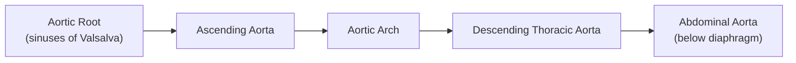

# Thoracic Aortic Aneurysm (TAA)

## Definition

An **aneurysm** is a pathological, localized, and permanent dilatation of a blood vessel by ≥50% of its normal diameter [1][2]. Let's break that definition down:

- **Pathological**: This isn't a normal variant — it represents disease.
- **Localized**: It affects a segment, not the entire vessel.
- **Permanent**: It doesn't go away on its own (unlike vasospasm-related transient dilatation).
- **≥50% of normal diameter**: The normal thoracic aorta varies by segment (see Anatomy below), but as a rough guide the ascending aorta is ~3.0–3.5 cm and the descending thoracic aorta is ~2.0–2.5 cm. So a **thoracic aortic aneurysm (TAA)** is generally defined as dilatation of **any segment of the thoracic aorta to >50% above its expected normal diameter** — typically **>4.5 cm for the ascending aorta** or **>3.5 cm for the descending thoracic aorta**, though sex- and body-size-adjusted nomograms are increasingly used [3].

An **aortic ectasia** refers to dilatation of < 50% of normal diameter — i.e., the aorta is a bit bigger than it should be, but doesn't meet the threshold for aneurysm [2].

### True vs. False (Pseudo-) Aneurysm

| Feature | True Aneurysm | False (Pseudo-) Aneurysm |
|---|---|---|
| **Wall composition** | All 3 layers intact (intima, media, adventitia) — though attenuated | Wall formed by extravascular connective tissue only (essentially a contained rupture / pulsating haematoma) |
| **Common causes** | Degenerative, connective tissue disease, atherosclerotic | Post-traumatic (e.g., deceleration injury at isthmus), post-surgical (anastomotic), mycotic |
| **Rupture risk** | Related to size (Laplace's law) | Generally higher for equivalent size (thinner wall) |

[2]

### Morphological Classification

- ***Fusiform***: Circumferential, symmetrical dilatation — **the more common form** in degenerative TAA [2].
- ***Saccular***: Only part of the circumference is involved, producing an asymmetric outpouching — classically associated with **mycotic (infectious) aneurysms**, penetrating atherosclerotic ulcers, or post-traumatic pseudoaneurysms.
- **(Dissecting)**: Historically used but now better classified under **acute aortic syndrome** (see below) — blood enters a false lumen within the media [2].

<Callout title="Distinction from Acute Aortic Syndrome">
TAA is a **chronic structural disease** — the aorta is too big. **Acute aortic syndrome** (aortic dissection, intramural haematoma, penetrating atherosclerotic ulcer) is a different entity where there is an **acute event within the aortic wall**. However, TAA is a **risk factor for** acute aortic syndrome, and acute aortic syndrome can lead to subsequent aneurysm formation. They are intimately related but distinct diagnoses [1][4].
</Callout>

---

## Epidemiology

### Incidence and Prevalence
- TAA is less common than AAA but carries **significant mortality** if untreated.
- Incidence: approximately **6–10 per 100,000 person-years** in Western populations. Autopsy studies suggest prevalence of ~1–3%.
- The incidence is **rising** — partly due to better detection (increased use of cross-sectional imaging, CT, echocardiography) and partly due to an ageing population.

### Demographics
- **Age**: Predominantly affects those **>60 years**; mean age at diagnosis is ~65–70 years.
- **Sex**: Overall **male predominance** (M:F ≈ 2–3:1), but the ratio varies by segment:
  - Ascending aorta aneurysms: more equal sex distribution (bicuspid aortic valve and connective tissue disease affect both sexes).
  - Descending thoracic aorta aneurysms: stronger male predominance (more atherosclerotic, similar risk profile to AAA).

### Distribution by Segment
- **Ascending aorta** (including aortic root): **~60%** of all TAAs — the most common site.
- **Descending thoracic aorta**: **~35%**.
- **Aortic arch**: **~10%** (often in combination with ascending or descending involvement).
- **Thoracoabdominal**: **~10%** (crossing the diaphragm).

> Note: Percentages overlap because many aneurysms involve more than one segment.

### Hong Kong Context
- Exact local epidemiological data on TAA specifically is limited, but:
  - Hypertension prevalence is high (~28% in adults), driving degenerative aortopathy.
  - Bicuspid aortic valve prevalence is similar to global (~1–2% of population).
  - Connective tissue diseases (Marfan syndrome, etc.) prevalence is similar to Western populations.
  - Giant cell arteritis and Takayasu arteritis — both causes of aortitis leading to TAA — are seen in Hong Kong, with Takayasu arteritis being more common in Asian populations [5].
  - Syphilitic aortitis is now rare but should still be considered in the differential.

---

## Risk Factors

Understanding risk factors requires understanding **why** the thoracic aortic wall fails. The aorta's structural integrity depends on:
1. **Elastin** fibres (provide compliance/recoil)
2. **Collagen** fibres (provide tensile strength)
3. **Smooth muscle cells** (maintain wall tone and secrete matrix)
4. **Extracellular matrix (ECM)** homeostasis (balance of synthesis vs. degradation)

Anything that disrupts these components → wall weakening → aneurysm.

### Non-modifiable Risk Factors

| Risk Factor | Mechanism |
|---|---|
| **Age** | Progressive elastin fragmentation and collagen cross-linking with age → "cystic medial degeneration" |
| **Male sex** | Androgens may promote MMP activity; oestrogen may be protective (pre-menopausal) |
| ***Genetic / Connective tissue diseases*** | Defective structural proteins (see below) |
| **Bicuspid aortic valve (BAV)** | Intrinsic aortopathy (not just haemodynamic — the ascending aorta wall is structurally abnormal in BAV even without valve dysfunction) — present in ~1–2% of the population but accounts for a disproportionate number of ascending TAAs |
| **Family history** | ~20% of TAA patients have a first-degree relative with aortic aneurysm/dissection — suggests heritable component even without identified syndromic cause |

### Modifiable Risk Factors

| Risk Factor | Mechanism |
|---|---|
| ***Hypertension*** | ↑wall stress (Laplace's law: Wall tension = Pressure × Radius / Wall thickness) → accelerates medial degeneration; present in ~75% of TAA patients |
| **Smoking** | Promotes MMP activity, ↑oxidative stress, direct toxic effect on elastin and smooth muscle cells |
| **Dyslipidaemia** | Promotes atherosclerosis of vasa vasorum → ischaemic medial degeneration (more relevant for descending aorta) |
| **Cocaine / Amphetamine use** | Acute ↑BP → ↑wall stress; also direct vasotoxic effects |

<Callout title="DM is NOT a risk factor" type="idea">
Interestingly, **diabetes mellitus is NOT a risk factor** for aortic aneurysm (both AAA and TAA) — and may even be protective. The mechanism is unknown but may relate to increased collagen cross-linking from advanced glycation end-products (AGEs), which paradoxically strengthens the aortic wall [1].
</Callout>

### Genetic / Syndromic Causes (especially important for ascending TAA)

These are ***critical*** because they affect **young patients** and have specific surgical thresholds:

| Condition | Gene / Defect | Key Features |
|---|---|---|
| ***Marfan syndrome*** | *FBN1* (fibrillin-1) → defective microfibril scaffold for elastin + dysregulated TGF-β signalling | Tall, arachnodactyly, ectopia lentis, mitral valve prolapse, **aortic root dilatation** → dissection; AD inheritance |
| ***Ehlers-Danlos syndrome type IV (vascular type)*** | *COL3A1* (type III collagen) → structurally defective collagen in vessel walls | Thin translucent skin, easy bruising, organ/arterial rupture; AD; **highest vascular risk** of all EDS types [2][4] |
| ***Loeys-Dietz syndrome*** | *TGFBR1/TGFBR2* (TGF-β receptor mutations) → dysregulated TGF-β signalling | Hypertelorism, bifid uvula, arterial tortuosity, aggressive aneurysm formation at **smaller diameters** than Marfan; AD [4] |
| **Turner syndrome** (45,X) | Haploinsufficiency of X-linked genes → aortic wall defect | Short stature, webbed neck, BAV (30%), CoA, **aortic dissection** risk (even with relatively small aorta — use aortic size index) |
| **Familial thoracic aortic aneurysm and dissection (FTAAD)** | Multiple genes: *ACTA2*, *MYH11*, *SMAD3*, *TGFB2*, *PRKG1*, etc. | Non-syndromic — isolated aortic disease without the body habitus features; AD; accounts for ~20% of TAA |

### Other Aetiological Causes

| Cause | Mechanism |
|---|---|
| ***Aortitis*** | Inflammation weakens the aortic wall → aneurysm. Causes: **Giant cell arteritis** [5], **Takayasu arteritis** [5], IgG4-related disease, syphilitic aortitis (now rare — affects ascending aorta/arch, obliterative endarteritis of vasa vasorum → "tree-bark" calcification) |
| ***Mycotic (infectious) aneurysm*** | Infection of aortic wall (haematogenous seeding or contiguous spread) → focal destruction → typically **saccular** pseudoaneurysm. Common organisms: ***non-typhoid Salmonella*** (especially in Hong Kong/Asia), ***Staphylococcus aureus***, ***Streptococcus***, historically syphilis [1] |
| **Post-stenotic dilatation** | Turbulent flow distal to aortic stenosis (especially BAV) → ↑wall stress → ascending aorta dilatation |
| **Chronic aortic dissection** | False lumen progressively dilates → aneurysm of the dissected segment |
| ***Post-traumatic*** | Deceleration injury → intimal tear at **aortic isthmus** (where mobile arch meets fixed descending aorta) → pseudoaneurysm if patient survives [6] |

---

## Anatomy and Function of the Thoracic Aorta

Understanding TAA requires solid knowledge of thoracic aortic anatomy, because the **segment involved** determines clinical features, complications, and surgical approach.

### Segments of the Thoracic Aorta

#### 1. Aortic Root (Sinuses of Valsalva)
- Contains the **aortic valve** and the **coronary ostia** (left and right coronary arteries arise from the left and right sinuses of Valsalva respectively).
- Normal diameter: ~3.0–3.5 cm.
- Composed largely of **elastic tissue** — allows the "Windkessel" function (stores energy during systole, releases during diastole to maintain diastolic perfusion, especially of the coronary arteries).
- **Clinical relevance**: Root dilatation (as in Marfan) → **aortic regurgitation** (annular dilatation prevents leaflet coaptation) and risk of **coronary ostial involvement** if dissection occurs.

#### 2. Ascending Aorta
- Extends from the sinotubular junction to the origin of the brachiocephalic (innominate) artery.
- Normal diameter: ~3.0–3.5 cm.
- **Intrapericardial** — this is crucial: rupture here → **haemopericardium → cardiac tamponade** (rapidly fatal).
- **Clinical relevance**: Aneurysm here may cause **aortic regurgitation** and is the most dangerous site for dissection (Stanford Type A).

#### 3. Aortic Arch
- Gives rise to three great vessels (from proximal to distal):
  1. **Brachiocephalic (innominate) artery** → right subclavian + right common carotid
  2. **Left common carotid artery**
  3. **Left subclavian artery**
- Crosses over the **left main bronchus** and lies adjacent to the **oesophagus**, **left recurrent laryngeal nerve (RLN)**, **vagus nerve**, and **phrenic nerve**.
- **Clinical relevance**: Arch aneurysm → compression of these structures → hoarseness (RLN), dysphagia, stridor.

#### 4. Descending Thoracic Aorta
- Begins distal to the left subclavian artery at the **aortic isthmus** (the "ligamentum arteriosum" landmark).
- Runs through the posterior mediastinum along the left side of the vertebral column.
- Gives off **intercostal arteries** (supply spinal cord via the **artery of Adamkiewicz**, typically arising at T9–T12), **bronchial arteries**, and **oesophageal arteries**.
- **Clinical relevance**: 
  - The isthmus is where **traumatic aortic injury** occurs (junction of mobile arch and fixed descending aorta) [6].
  - Surgery or stenting of the descending aorta risks **spinal cord ischaemia** (paraplegia) if the artery of Adamkiewicz is compromised.
  - Erosion into the oesophagus → **aorto-oesophageal fistula** (massive haematemesis).
  - Erosion into the left lung → **aorto-bronchial fistula** (massive haemoptysis).

### Histology of the Aortic Wall

| Layer | Composition | Function | Relevance to TAA |
|---|---|---|---|
| **Tunica intima** | Endothelium + subendothelial connective tissue | Barrier, regulates vascular tone (NO) | Intimal tear → dissection entry point |
| **Tunica media** | Elastic lamellae (60–70 layers in thoracic aorta), smooth muscle cells, collagen, proteoglycans | Provides elasticity (Windkessel) and structural strength | **Primary site of disease** in TAA — "cystic medial degeneration" = loss of elastic fibres + smooth muscle cell dropout + mucoid degeneration |
| **Tunica adventitia** | Collagen, vasa vasorum, nervi vasorum | Provides outer structural support; vasa vasorum supply outer 2/3 of media | Ischaemia of vasa vasorum → medial degeneration; last barrier before rupture |

### The Vasa Vasorum
- These are "vessels of the vessel" — small arteries that supply the outer layers of the aortic wall.
- In the **ascending aorta and arch**, vasa vasorum are abundant (the wall is thick and cannot be nourished by luminal diffusion alone).
- **Atherosclerosis of vasa vasorum** → ischaemic medial degeneration → aneurysm (more relevant for descending aorta).
- **Rupture of vasa vasorum** into the media → intramural haematoma (part of acute aortic syndrome) [4].

### Laplace's Law — Why Aneurysms Keep Growing

$$\text{Wall Tension} = \frac{\text{Pressure} \times \text{Radius}}{2 \times \text{Wall Thickness}}$$

- As the aorta dilates → **radius increases** → **wall tension increases** → further dilatation → vicious cycle.
- Simultaneously, as the wall stretches → **wall thickness decreases** → wall tension increases even more.
- This is why **larger aneurysms grow faster and rupture more readily** — the physics demands it.
- Hypertension worsens this by increasing the "Pressure" term.

<Callout title="Laplace's Law is the Key to Understanding TAA">
Everything about TAA — why it grows, why it ruptures, why we control blood pressure, why surgical thresholds exist — comes back to Laplace's law. If you understand this one equation, you understand the disease.
</Callout>

---

## Aetiology and Pathophysiology

### Overview of Pathogenesis

***The fundamental problem in TAA is a weakened aortic media*** [7]. The pathological hallmark is **cystic medial degeneration** (also called "cystic medial necrosis" or "medial degeneration"), characterised by:

1. ***Loss of elastin and smooth muscle cells*** [7]
2. ***Disruption of extracellular matrix*** [7]
3. ***Deposition of adventitial collagen*** (attempted repair) [7]
4. ***Wall thickening*** (paradoxically, from fibrosis, not from healthy tissue) [7]
5. ***Inflammatory infiltrate*** (variable — more prominent in aortitis-related TAA) [7]

This weakens the wall → the aorta dilates under haemodynamic stress (Laplace's law) → progressive aneurysm formation.

### Pathophysiology by Aetiology

#### 1. Degenerative / Age-related (Most Common — especially descending TAA)
- With ageing, there is progressive **fragmentation of elastic lamellae** and **loss of smooth muscle cells** in the media.
- ***Enhanced proteolytic activity***: **Matrix metalloproteinases (MMPs)** — especially MMP-2 and MMP-9 — are upregulated [7]. These are zinc-dependent endopeptidases that degrade elastin and collagen in the ECM. When MMP activity exceeds that of their inhibitors (TIMPs — tissue inhibitors of metalloproteinases), net ECM degradation occurs.
- Atherosclerosis of vasa vasorum → medial ischaemia → accelerates degeneration.
- **Hypertension** and **smoking** are the key modifiable accelerators.

#### 2. Genetic / Connective Tissue Disease (Most Common cause of ascending TAA in younger patients)

- **Marfan syndrome**: Fibrillin-1 deficiency → defective elastic fibre assembly + uncontrolled TGF-β activation (fibrillin-1 normally sequesters latent TGF-β) → excessive MMP activation, smooth muscle cell apoptosis, ECM degradation → **aortic root dilatation** (the root is especially elastin-rich).
- **Loeys-Dietz syndrome**: TGF-β receptor mutations → paradoxical **increased** TGF-β signalling (despite loss-of-function mutations, there is compensatory overactivation of alternative pathways) → aggressive medial degeneration at **smaller diameters** than Marfan.
- **Ehlers-Danlos type IV**: Defective type III collagen → the vessel wall simply cannot hold together → rupture risk is extreme, often without preceding significant dilatation.
- ***Bicuspid aortic valve (BAV)***: The aortopathy is **intrinsic** — BAV patients have fewer elastic fibres, more smooth muscle cell apoptosis, and increased MMP expression in their ascending aorta **regardless of valve haemodynamics**. This is thought to be due to shared embryological origin of the aortic valve and ascending aortic wall (neural crest cell defect). There may also be a **haemodynamic component** — the asymmetric jet from a bicuspid valve generates eccentric wall stress.

#### 3. Inflammatory / Aortitis

- ***Giant cell arteritis (GCA)***: Granulomatous inflammation of the aorta and its branches → destruction of the media → aneurysm formation [5]. GCA affects the **thoracic aorta** preferentially (compared to abdominal aorta). Patients with GCA have a **17-fold increased risk** of thoracic aortic aneurysm. The aneurysm may present **years after** the initial GCA diagnosis, even after treatment.
- ***Takayasu arteritis***: Granulomatous inflammation of the aorta and its major branches → stenosis, occlusion, or aneurysm formation [5]. More common in **young Asian women**. The thoracic aorta (especially the arch) is characteristically involved.
- **IgG4-related aortitis**: Dense lymphoplasmacytic infiltrate with IgG4-positive plasma cells → inflammatory aneurysm.
- **Syphilitic aortitis**: *Treponema pallidum* causes obliterative endarteritis of the vasa vasorum → medial ischaemia and necrosis → aneurysm (classically **ascending aorta and arch**, with "tree-bark" calcification on imaging). This is tertiary syphilis and now very rare with antibiotic treatment.

#### 4. Infectious (Mycotic) Aneurysm

- "Mycotic" is a misnomer — it doesn't mean fungal. The term was coined by Osler (1885) because the infected aneurysm resembled a fungal growth.
- **Mechanism**: Bacteria seed the aortic wall (haematogenous spread, contiguous infection, or direct inoculation during procedures) → focal aortitis → wall destruction → rapidly expanding **saccular** pseudoaneurysm.
- **Key organisms** (especially relevant in Hong Kong):
  - ***Non-typhoid Salmonella***: The classic organism in **Asian populations** — has tropism for diseased/atherosclerotic aortic wall. Think of this in any elderly patient with fever + back pain + known aortic disease [1].
  - ***Staphylococcus aureus***: Acute, aggressive.
  - ***Streptococcus*** spp.
  - *Mycobacterium tuberculosis*: Rare but important in endemic areas (contiguous spread from vertebral TB — Pott's disease).

#### 5. Post-traumatic (Pseudoaneurysm)

- ***High-speed deceleration injury*** → intimal tear at the **aortic isthmus** (junction of mobile arch and fixed descending aorta, at the ligamentum arteriosum) [6].
- **80–90% die at the scene** [6]. Those who survive do so because the **adventitia and mediastinal haematoma contain the rupture** → pseudoaneurysm.
- If untreated, 30% die within 6 hours, 40–50% within 24 hours, and 90% within 4 months [6].

#### 6. Chronic Aortic Dissection

- After an acute aortic dissection, the **false lumen** may remain patent and progressively dilate under systemic pressure → **post-dissection aneurysm**. This is a common long-term complication and the reason for lifelong surveillance imaging after dissection [4].

---

## Classification

### By Segment Involved

The **Crawford classification** (originally for thoracoabdominal aneurysms) and general anatomical classification:

| Type | Segment | Common Aetiology | Key Considerations |
|---|---|---|---|
| **Aortic root** | Sinuses of Valsalva | Marfan, BAV, annuloaortic ectasia | Aortic regurgitation, Bentall procedure |
| **Ascending aorta** | Sinotubular junction to innominate artery | Marfan, BAV, degenerative, GCA | Intrapericardial → tamponade risk; Stanford Type A dissection territory |
| **Aortic arch** | Between innominate and left subclavian | Degenerative, Takayasu, atherosclerotic | Complex surgery — involves great vessels, cerebral perfusion |
| **Descending thoracic** | Distal to left subclavian to diaphragm | Degenerative, atherosclerotic, post-traumatic, chronic dissection | Spinal cord ischaemia risk; TEVAR preferred |
| **Thoracoabdominal** | Crosses diaphragm, involves both thoracic and abdominal aorta | Chronic dissection, degenerative | Crawford classification (Types I–IV); most complex surgery |

### Crawford Classification of Thoracoabdominal Aortic Aneurysms (TAAA)

| Type | Extent |
|---|---|
| **I** | Distal to left subclavian → above renal arteries |
| **II** | Distal to left subclavian → below renal arteries (most extensive) |
| **III** | From mid-descending aorta → below renal arteries |
| **IV** | Below diaphragm → below renal arteries (essentially a large AAA extending proximally) |

### By Morphology
- **Fusiform** (more common) vs. **Saccular** [2]

### By Wall Structure
- **True** (all 3 layers) vs. **False/Pseudo** (connective tissue only) [2]

---

## Clinical Features

<Callout title="Most TAAs are Asymptomatic">
The majority of thoracic aortic aneurysms are **asymptomatic** and discovered incidentally on imaging (CXR, CT, echocardiography) performed for other indications. Symptoms, when they occur, usually indicate **a large or rapidly expanding aneurysm** — and should raise concern for impending rupture or dissection [2].
</Callout>

### Symptoms

#### A. Symptoms Related to the Aneurysm Itself (Compression / Mass Effect)

The thoracic aorta sits in a crowded neighbourhood. As the aneurysm enlarges, it compresses adjacent structures. The specific symptoms depend on which **segment** is involved:

| Symptom | Structure Compressed / Mechanism | Segment Most Commonly Involved | Pathophysiological Explanation |
|---|---|---|---|
| **Chest pain / back pain** | Stretching of the aortic wall (medial stretching activates nociceptive nerve endings in the adventitia/periaortic tissue) | Any segment | Dull, deep, often poorly localised. **Acute onset or worsening pain = red flag for impending rupture or dissection** |
| ***Hoarseness of voice*** | ***Left recurrent laryngeal nerve (RLN) compression*** — the left RLN loops under the aortic arch and is vulnerable to compression by arch/proximal descending aneurysms | Aortic arch / proximal descending | This is called **Ortner syndrome** (cardiovocal syndrome). The RLN innervates all intrinsic laryngeal muscles except cricothyroid → compression → left vocal cord paralysis → hoarseness |
| **Dysphagia** | Oesophageal compression (the oesophagus lies directly posterior to the aortic arch and descending aorta) | Arch / descending | Called **dysphagia aortica**. Progressive difficulty swallowing, initially to solids |
| **Stridor / cough / dyspnoea** | Tracheal or left main bronchus compression | Arch / ascending | The trachea and left main bronchus lie anterior and inferior to the arch respectively. Compression → airway narrowing → stridor (if extrathoracic/upper), wheezing, cough, or dyspnoea |
| **Superior vena cava (SVC) syndrome** | SVC compression by ascending aortic or arch aneurysm | Ascending / arch | Facial plethora, distended neck veins, upper limb oedema — rare with TAA, more common with malignancy |
| **Chest wall pain / erosion** | Direct erosion into sternum, ribs, or vertebral bodies by a large aneurysm | Ascending (anterior erosion) / Descending (vertebral erosion) | Chronic pulsatile erosion → bone destruction → visible pulsatile mass on chest wall (very rare, very dramatic) |

#### B. Symptoms Related to Aortic Valve Involvement

| Symptom | Mechanism |
|---|---|
| **Dyspnoea on exertion, orthopnoea, PND** | Aortic root / ascending aorta dilatation → **aortic regurgitation** (annular dilatation prevents leaflet coaptation) → LV volume overload → LV failure → pulmonary oedema [8] |
| **Palpitations / awareness of heartbeat** | Increased stroke volume from AR → hyperdynamic circulation |
| **Angina** | ↓Diastolic BP from AR → ↓coronary perfusion pressure + ↑LV wall stress from dilatation → supply-demand mismatch |

#### C. Symptoms Related to Thromboembolism

- Mural thrombus forms within the aneurysm sac (sluggish flow, turbulence) → embolisation to:
  - **Cerebral circulation** (from ascending/arch aneurysm) → **stroke / TIA**
  - **Upper limbs** (from arch aneurysm) → acute limb ischaemia
  - **Visceral / lower limbs** (from descending aorta) → mesenteric ischaemia, renal infarction, blue toe syndrome

#### D. Symptoms of Rupture (Emergency)

| Symptom | Explanation |
|---|---|
| **Sudden, severe chest or back pain** | Acute transmural tear → blood escapes into mediastinum / pleural space / pericardium |
| **Haemodynamic collapse / shock** | Massive haemorrhage |
| **Massive haematemesis** | ***Aorto-oesophageal fistula*** — aneurysm erodes into oesophagus. **Chiari tr
