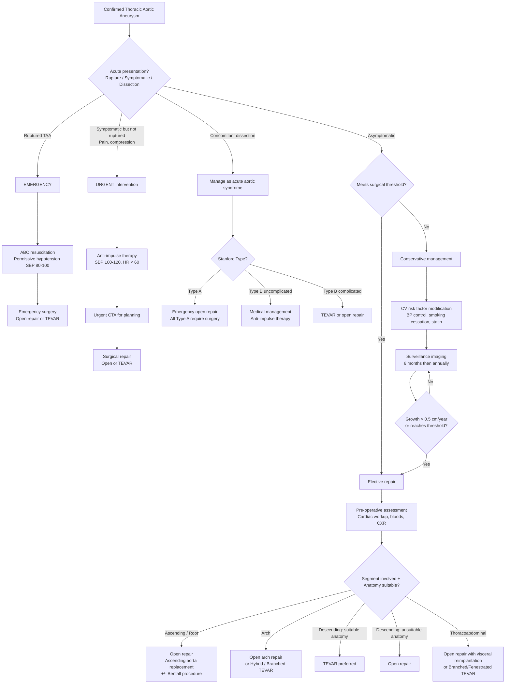

## Management of Thoracic Aortic Aneurysm

The management of TAA follows a logical framework: you must decide **when** to intervene and **how** to intervene, based on the balance between the **risk of rupture** (which is fatal) and the **risk of the operation** (which is significant). This is the same first-principles reasoning used for AAA, just with different thresholds and surgical techniques because of the unique anatomy of the thoracic aorta.

Let me walk you through this systematically.

---

### Fundamental Principle: Risk of Rupture vs. Risk of Operation

***The core decision in TAA management is balancing the risk of rupture against the risk of operation*** [7].

| Scenario | Mortality |
|---|---|
| ***Intact TAA elective repair*** | ***~3–5% (open), ~2–3% (TEVAR)*** |
| ***Ruptured TAA repair*** | ***> 50%*** |
| ***Unoperated rupture*** | ***~100%*** [7] |

Therefore, the logic is:
- If the aneurysm is **small** and the annual rupture risk is low → the risk of surgery outweighs the benefit → **conservative management with surveillance**.
- If the aneurysm is **large** or **growing rapidly** → the annual rupture risk exceeds the operative risk → **surgical intervention is indicated**.
- If the patient is **symptomatic** (pain, compression) → symptoms indicate **impending rupture** or complication → **urgent intervention** regardless of size.
- If the aneurysm has **ruptured** → **emergency intervention** is mandatory.

<Callout title="Why Laplace's Law Drives Management Decisions">
Recall: Wall Tension = (Pressure × Radius) / (2 × Wall Thickness). As the aorta dilates, wall tension increases exponentially — meaning **larger aneurysms grow faster and rupture more readily**. This is why there is a **size threshold** above which intervention is recommended: the natural history curve "crosses over" the surgical risk curve at that point.
</Callout>

---

### Management Algorithm

---

### A. Conservative Management — Medical Therapy and Surveillance

This applies to **asymptomatic TAA below surgical threshold**. The goals are to **slow aneurysm growth** and **reduce rupture risk** by modifying the factors in Laplace's law — specifically, reducing **pressure** (blood pressure) and **dP/dt** (rate of pressure rise, i.e., the force of cardiac contraction).

#### 1. Blood Pressure Control

| Agent | Rationale | Target |
|---|---|---|
| ***β-Blockers*** (e.g., ***labetalol***, atenolol, metoprolol, bisoprolol) | ↓HR → ↓dP/dt (the force and rate of aortic wall stress per cardiac cycle). Also ↓BP → ↓Pressure term in Laplace's law. **First-line antihypertensive in TAA** | ***SBP < 120 mmHg, HR < 60–70 bpm*** [3][2] |
| **ARBs** (e.g., losartan, irbesartan) | Specific benefit in **Marfan syndrome** — losartan inhibits TGF-β signalling (the pathological driver in Marfan aortopathy). May be added to β-blockers. 2022 ACC/AHA guidelines recommend losartan in Marfan patients | Additive BP reduction; TGF-β inhibition |
| **ACE inhibitors** | Alternative if ARB not tolerated. Also reduces wall stress | BP control |
| ***Non-dihydropyridine CCBs*** (***diltiazem, verapamil***) | If β-blockers are contraindicated (e.g., severe asthma). ↓HR + ↓contractility similar to β-blockers [3] | Rate + BP control |

<Callout title="Why β-Blockers Are First-Line" type="idea">
β-blockers don't just lower blood pressure — they specifically **reduce the rate of pressure rise (dP/dt)** in the aorta during systole. This is the "aortic impulse" — the shearing force that drives aneurysm expansion and precipitates dissection. This is why they are superior to pure vasodilators (which lower BP but may cause reflex tachycardia, paradoxically increasing dP/dt). ***Hydralazine is contraindicated*** in aortic disease because it causes reflex tachycardia and increases aortic wall shear stress [3].
</Callout>

#### 2. Cardiovascular Risk Factor Modification

| Intervention | Why |
|---|---|
| **Smoking cessation** | Smoking accelerates MMP activity, elastin degradation, and aortic wall weakening. Smoking cessation is the single most impactful modifiable risk factor |
| **Statin therapy** | Reduces atherosclerotic progression (relevant for descending TAA). May also have anti-inflammatory and MMP-inhibitory effects (pleiotropic benefits). Used regardless of lipid levels for overall cardiovascular protection [1] |
| **Moderate exercise** | Encouraged, but avoid **heavy isometric exercise** (weightlifting, straining) — Valsalva manoeuvre causes acute spikes in aortic pressure → ↑rupture/dissection risk. Aerobic exercise at moderate intensity is safe and beneficial |
| **Avoid stimulants** | Cocaine, amphetamines → acute ↑BP → ↑wall stress → dissection risk [3] |

#### 3. Surveillance Imaging

The purpose is to **track aneurysm growth** and identify when the surgical threshold is reached.

| Protocol | Details |
|---|---|
| **Initial diagnosis** | CT aortogram or echo (for root/ascending) to establish baseline diameter |
| **First follow-up** | **6 months** after diagnosis — to calculate initial growth rate |
| **Stable, small aneurysm** | **Annually** (CTA or MRA). MRA preferred for young patients to minimise radiation |
| **Larger aneurysm approaching threshold** | Every **6 months** |
| ***Rapid growth (> 0.5 cm/year)*** | ***Indication for surgery*** regardless of absolute size [1] |
| **Post-operative** | ***Serial imaging at 3, 6, 12 months*** then annually — to detect endoleak, recurrence, pseudoaneurysm [2] |

---

### B. Surgical Indications — When to Operate

This is **critical exam material**. The thresholds differ by aetiology because the underlying wall pathology varies.

#### Size Thresholds for Elective Repair (2022 ACC/AHA Guidelines)

| Condition | Ascending Aorta Threshold | Descending Aorta Threshold |
|---|---|---|
| ***Degenerative (no genetic/syndromic cause)*** | ***≥5.5 cm*** | ***≥5.5–6.0 cm*** |
| ***Bicuspid aortic valve*** | ***≥5.0–5.5 cm*** (lower if additional risk factors: family history of dissection, rapid growth, coarctation) | N/A (ascending disease predominates) |
| ***Marfan syndrome*** | ***≥5.0 cm*** (or ≥4.5 cm if family history of dissection or rapid growth > 0.5 cm/year) | ≥5.0–5.5 cm |
| ***Loeys-Dietz syndrome*** | ***≥4.0–4.2 cm by TEE*** (or ≥4.4–4.6 cm by CTA — there is a slight overestimation by CT) | Earlier threshold due to aggressive course |
| ***Ehlers-Danlos type IV*** | **Individual assessment** — surgery itself carries higher risk due to tissue fragility; often manage conservatively unless imminent rupture | Individual assessment |
| ***Turner syndrome*** | **Aortic size index (ASI) > 2.5 cm/m²** — use BSA-indexed diameter because these patients are small | — |
| **Any aetiology** | If undergoing cardiac surgery for another reason (e.g., AVR for BAV) → lower threshold ≥4.5 cm (opportunistic repair) | — |

#### Other Indications for Surgery (Regardless of Size)

| Indication | Reasoning |
|---|---|
| ***Symptomatic TAA*** (pain, compression) | ***Any symptom indicates impending rupture*** — urgent surgery [7][2] |
| ***Rapidly expanding*** (***> 0.5 cm/year*** or > 1 cm/year) | Growth rate exceeds the expected natural history → wall is failing faster than expected [1] |
| ***Associated with significant aortic regurgitation*** | AR causes LV volume overload → progressive LV dysfunction → irreversible if delayed. Combined aortic root replacement + valve repair/replacement indicated |
| ***Ruptured TAA*** | ***Emergency — surgical emergency*** [7] |
| ***Concomitant aortic dissection*** | ***Type A: ALL require emergency surgery. Type B: surgery if complicated*** [2][3] |
| **Mycotic aneurysm** | Infection-driven → rapid expansion and high rupture risk. Requires resection + extra-anatomical bypass + prolonged antibiotics |

<Callout title="Exam Tip: Surgical Indications Summary">
The indications for surgical repair of TAA follow the same principles as AAA but with different size thresholds:
1. ***Size ≥5.5 cm*** for degenerative ascending TAA (lower for genetic causes)
2. ***Rapidly expanding > 0.5 cm/year***
3. ***Symptomatic (any symptom = urgent)***
4. ***Ruptured = emergency***
5. **Significant AR** with root aneurysm
6. **Opportunistic** if undergoing cardiac surgery for other reason (threshold ≥4.5 cm)
</Callout>

---

### C. Surgical Modalities — How to Operate

The choice depends on the **segment involved** and the patient's **anatomy and fitness**.

#### 1. Open Surgical Repair

Open repair remains the gold standard for the **ascending aorta and aortic arch**, where endovascular options are limited or technically demanding.

##### a. Ascending Aorta Replacement

| Feature | Detail |
|---|---|
| **Approach** | Median sternotomy. Requires **cardiopulmonary bypass (CPB)** with aortic cross-clamping |
| **Procedure** | Excise the aneurysmal segment → replace with a **synthetic interposition graft** (Dacron or PTFE tube graft) → suture proximal and distal anastomoses |
| **Aortic valve involvement** | If the aortic valve is competent and the root is not dilated → simple supracoronary ascending replacement (spare the valve) |
| | If aortic root dilated with AR → need a **composite graft** procedure (see below) |

##### b. Bentall Procedure (Composite Valve-Graft Replacement)

***The Bentall procedure is the classic operation for aortic root aneurysm with aortic regurgitation*** [2].

| Feature | Detail |
|---|---|
| **What it replaces** | ***Aortic valve, aortic root (sinuses of Valsalva), and ascending aorta*** — all replaced as a single unit [2] |
| **Technique** | A **composite graft** = mechanical (or bioprosthetic) aortic valve pre-sewn into the proximal end of a Dacron tube graft. The coronary ostia are **reimplanted** into the side of the graft (button technique — Cabrol modification) |
| **Indications** | Marfan syndrome with root dilatation, annuloaortic ectasia, degenerative root aneurysm with AR, Type A dissection with root involvement [2] |
| **Key consideration** | Mechanical valve → lifelong anticoagulation (warfarin). Bioprosthetic valve → avoids anticoagulation but limited durability (10–20 years) |

##### c. Valve-Sparing Root Replacement (David or Yacoub Procedure)

| Feature | Detail |
|---|---|
| **Concept** | Replace the root and ascending aorta but **preserve the native aortic valve** by reimplanting or remodelling it inside the graft |
| **David procedure** (reimplantation) | Native valve resuspended inside the graft — better long-term valve competence |
| **Yacoub procedure** (remodelling) | Sinus segments replaced, valve left in situ with neo-sinuses created |
| **Advantage** | Avoids anticoagulation (no prosthetic valve), preserves native valve function |
| **Indication** | Young patients (Marfan, BAV) with good native valve leaflets but dilated root |

##### d. Aortic Arch Repair

This is the **most technically challenging** thoracic aortic operation.

| Feature | Detail |
|---|---|
| **Challenge** | The arch supplies the **brain** via the great vessels → must maintain cerebral perfusion during surgery |
| **Technique** | Requires **deep hypothermic circulatory arrest (DHCA)** — patient cooled to 18–20°C, circulation stopped, arch replaced with a graft, and great vessels reimplanted (as "island" or individual buttons). Brain protected by antegrade or retrograde cerebral perfusion |
| **Complications** | Stroke (5–10%), prolonged ICU stay, coagulopathy from hypothermia |

##### e. Descending Thoracic Aorta Open Repair

| Feature | Detail |
|---|---|
| **Approach** | Left posterolateral thoracotomy |
| **Technique** | Aortic cross-clamping above and below the aneurysm → excise and replace with interposition graft. May use **left heart bypass** (femoral vein → centrifugal pump → femoral artery) to maintain distal perfusion during clamping |
| **Key risk** | ***Spinal cord ischaemia*** → paraplegia. The **artery of Adamkiewicz** (major radiculomedullary artery, usually T9–T12) supplies the anterior spinal artery. Cross-clamping above its origin → spinal cord infarction [1][7] |
| **Mitigation** | CSF drainage (↓CSF pressure → ↑spinal perfusion pressure), reimplantation of intercostal arteries, distal aortic perfusion, hypothermia, neuromonitoring (somatosensory/motor evoked potentials) |

##### f. Thoracoabdominal Aortic Aneurysm (TAAA) Open Repair

***This is the most complex aortic operation*** [7].

| Feature | Detail |
|---|---|
| ***Challenges*** | ***High aortic clamp → proximal hypertension***; ***critical ischaemic time for visceral/renal organs***; ***spinal ischaemia risk*** [7] |
| **Technique** | Thoracoabdominal incision. Sequential clamping. Graft replacement. ***Bypass and reimplant visceral arteries*** (coeliac trunk, SMA, renal arteries) as buttons or individual grafts [7] |
| **Mortality** | 5–15% depending on extent (Crawford Type II has the highest risk) |

#### 2. Endovascular Repair — TEVAR (Thoracic Endovascular Aortic Repair)

***TEVAR*** = "Thoracic Endovascular Aortic Repair" — the thoracic equivalent of EVAR for AAA [7][13].

| Feature | Detail |
|---|---|
| **Concept** | A **covered stent graft** is deployed via the femoral artery, navigated under fluoroscopic guidance to the thoracic aorta, and expanded to **line the aneurysm from within** — excluding it from the circulation |
| **Best suited for** | ***Descending thoracic aorta aneurysms*** [7] — this is where TEVAR excels because the anatomy is relatively straightforward (a tube) |
| **Advantages over open** | ***Lower perioperative morbidity and mortality*** (~2–3% vs. 5–10% for open). No thoracotomy → less pain, shorter ICU stay, faster recovery. ↓Risk of bleeding, tissue damage (***no need to clamp aorta***) [13]. Avoids general anaesthesia in some cases (can be done under regional/local) |
| **Disadvantages** | Requires **suitable landing zone anatomy** (adequate length of normal aorta proximal and distal to the aneurysm). Long-term durability uncertain (endoleak, stent migration). Lifelong surveillance required. Cannot address the aortic root or ascending aorta (currently) |
| **Contraindications** | Ascending aortic aneurysm (no landing zone — would occlude coronaries or great vessels). Inadequate landing zones. Severe iliac/femoral disease preventing access. Connective tissue diseases (relative — tissue fragility may compromise seal) |

##### TEVAR Landing Zone Requirements (analogous to EVAR)

| Requirement | Why |
|---|---|
| **Proximal landing zone ≥2 cm** of normal aorta | Ensures adequate seal to prevent Type I endoleak |
| **Distal landing zone ≥2 cm** of normal aorta | Same principle |
| **Access vessels (iliac/femoral) ≥7 mm** | Stent graft delivery system must pass through |
| **Minimal tortuosity and calcification** | Prevents graft malposition and poor seal |

##### Endoleak After TEVAR

The same endoleak classification used for EVAR applies to TEVAR [1]:

| Type | Description | Clinical Significance | Management |
|---|---|---|---|
| **I** | ***Seal failure at proximal (Ia) or distal (Ib) end*** | ***Direct flow into aneurysm sac → requires re-intervention*** | Repeat endovascular intervention, extension cuff, or open conversion |
| **II** | ***Backflow from side branches*** (intercostal arteries, bronchial arteries) — ***most common type*** | Usually benign. Monitor for sac expansion | Close observation → embolisation if sac expanding |
| **III** | ***Graft defect*** (fabric tear, modular disconnection) | ***Direct flow → requires re-intervention*** | Repair defect / bridge across |
| **IV** | Graft porosity | Self-limiting | Observe |
| **V** | Endotension (sac expansion without visible leak) | Uncertain significance | Observe or consider re-intervention |

> ***Types I and III have continuous direct flow into the aneurysm sac → require re-operation!*** [1]

##### Hybrid / Branched / Fenestrated TEVAR

For aneurysms involving the **aortic arch** or **thoracoabdominal aorta**, standard TEVAR alone is insufficient because deploying a stent across great vessels or visceral arteries would occlude them. Solutions include:

| Technique | Concept |
|---|---|
| **Hybrid repair** | Open surgical debranching of arch vessels (bypass from ascending aorta to brachiocephalic + left carotid + left subclavian) followed by TEVAR of the arch. Avoids DHCA |
| ***Branched stent grafts*** | Custom-made stent graft with side branches that extend into great vessels or visceral arteries [7] |
| ***Fenestrated grafts*** | Stent graft with holes (fenestrations) aligned with branch vessel ostia, allowing continued perfusion [7] |
| **Chimney / snorkel grafts** | Parallel stents placed in branch vessels alongside the main graft to maintain branch perfusion |

---

### D. Management of Specific Scenarios

#### 1. Ruptured TAA — Emergency

| Step | Detail |
|---|---|
| **ABC resuscitation** | High-flow O2, two large-bore IV access, urgent crossmatch (≥6 units packed RBCs) |
| **Permissive hypotension** | ***SBP target 80–100 mmHg*** — higher pressures worsen bleeding through the rupture site [1] |
| **Massive transfusion protocol** | ***Packed cells : FFP : platelets = 1:1:1*** (e.g., 6 units each) [1] |
| **Immediate surgery** | If haemodynamically unstable → **operating theatre immediately** without CTA (no time). If briefly stabilisable → rapid CTA to assess TEVAR suitability |
| **Surgical options** | Open repair or emergency TEVAR (if descending TAA with suitable anatomy and available expertise) |
| **Prognosis** | ***Operative mortality > 50%. Unoperated mortality ~100%*** [7] |

#### 2. TAA with Concomitant Aortic Dissection

This is managed as **acute aortic syndrome** — the dissection takes priority:

| Type | Management |
|---|---|
| ***Type A dissection (involves ascending aorta)*** | ***ALL require emergency open repair*** — ***excise intimal tear, obliterate entry site, place interposition synthetic aortic graft ± repair/replacement of aortic valve*** → ***Bentall procedure if AV, root, ascending aorta all involved*** [2][3] |
| ***Type B uncomplicated*** | ***Medical management: anti-impulse therapy*** — ***SBP 100–120 mmHg, HR < 60 bpm*** [2][3]. ***1st line: β-blocker (labetalol, esmolol) or non-dihydropyridine CCB (diltiazem, verapamil)*** [3]. ***2nd line: add sodium nitroprusside (only with β-blocker pre-treatment to prevent reflex tachycardia)*** [3] |
| ***Type B complicated*** (malperfusion, rupture, rapid expansion, retrograde dissection, Marfan) | ***TEVAR (endovascular stent-grafting) preferred; open repair if anatomy complex*** [2] |
| **Post-dissection follow-up** | ***Lifelong antihypertensive therapy to target BP < 120/80 mmHg*** [2]. ***Serial imaging (MRA/CTA at 3, 6, 12 months)*** to detect recurrence, aneurysm formation, or endoleak [2] |

> ***Emergency pericardiocentesis if cardiac tamponade*** (from Type A dissection rupturing into pericardium) [2]

<Callout title="Anti-Impulse Therapy — Explained from First Principles" type="idea">
"Anti-impulse" therapy means reducing the **aortic wall stress per heartbeat (dP/dt)** — the "impulse" the blood exerts on the aortic wall with each systolic contraction. This requires:
1. **↓HR** (fewer impulses per minute) — β-blocker
2. **↓Contractility** (less forceful impulse) — β-blocker
3. **↓BP** (lower pressure term) — β-blocker + vasodilator if needed

***Labetalol*** is ideal because it is both an ***α1-blocker*** (vasodilation → ↓BP) and a ***non-selective β-blocker*** (↓HR + ↓contractility) [3]. ***Hydralazine is contraindicated*** because it causes reflex tachycardia (increases dP/dt — exactly what you don't want) [3].
</Callout>

#### 3. Mycotic TAA

| Step | Detail |
|---|---|
| **Antibiotics** | Prolonged IV antibiotics (≥6 weeks) targeting the causative organism — empiric coverage for Salmonella + S. aureus until cultures return |
| **Surgery** | Resection of infected aortic segment + **extra-anatomical bypass** (route the bypass graft away from the infected field). In situ graft with rifampicin-soaked Dacron or cryopreserved homograft is an alternative |
| **Prognosis** | Poor — high operative mortality and risk of recurrent infection |

#### 4. Aortitis-Related TAA (GCA, Takayasu)

| Step | Detail |
|---|---|
| **Medical** | Immunosuppression to control the underlying aortitis — prevents further wall destruction |
| | ***GCA: urgent high-dose systemic corticosteroids (prednisolone 1–2 mg/kg/day) → slow taper over 1–2 years. Steroid-sparing: tocilizumab (anti-IL-6), methotrexate*** [5] |
| | **Takayasu: high-dose corticosteroids 1 mg/kg/day → taper. Steroid-sparing: methotrexate or azathioprine** [5] |
| **Surgical** | If aneurysm reaches surgical threshold → repair as per standard TAA. Ideally operate when aortitis is in **remission** (quiescent phase) — operating during active inflammation → higher risk of anastomotic pseudoaneurysm |

---

### E. Pre-Operative Preparation for Elective TAA Repair

***The major operative mortality in aortic surgery is myocardial infarction*** [7] — because these patients almost always have coexisting coronary artery disease, and the surgery involves major haemodynamic stress.

| Step | Detail |
|---|---|
| ***General: blood tests, ECG, CXR*** [7] | Baseline assessment |
| ***Cardiac assessment / intervention*** [7] | Stress testing (exercise or pharmacological). Coronary angiography if positive. PCI/CABG if significant CAD → then proceed with aortic repair |
| ***Preparation: monitors, blood*** [7] | Arterial line, central venous access, PA catheter (if needed). ***Type and screen, crossmatch ≥6 units*** packed RBCs [2] |
| **Pulmonary function tests** | Thoracotomy significantly impairs respiratory function post-op; identify high-risk patients |
| **Renal function** | Baseline Cr/eGFR; plan renal protection during cross-clamping |
| **Thromboprophylaxis** | IV heparin during surgery (prevent graft thrombosis and distal embolisation) |

---

### F. Post-Operative Management and Long-Term Follow-Up

| Aspect | Detail |
|---|---|
| **ICU care** | Haemodynamic monitoring (arterial line, CVP), chest drain management, ventilator weaning, urine output monitoring |
| **BP control** | ***Lifelong antihypertensive therapy targeting BP < 120/80 mmHg*** — reduces stress on graft anastomoses and remaining native aorta [2] |
| **Surveillance imaging** | ***CTA or MRA at 3, 6, 12 months post-op, then annually*** [2]. After TEVAR: lifelong surveillance for endoleak, stent migration, sac expansion |
| **Antiplatelet** | Aspirin for secondary prevention of cardiovascular events [1] |
| **Anticoagulation** | Required if mechanical aortic valve (Bentall with mechanical valve) — warfarin, target INR 2.0–3.0 |
| **Genetic counselling** | If genetic/syndromic cause identified → screen first-degree relatives (echo/CTA). Genetic testing for at-risk family members |
| **Activity** | Avoid heavy isometric exercise, competitive contact sports. Moderate aerobic exercise encouraged |

---

### G. Management Summary by Segment

| Segment | Preferred Surgical Approach | Why |
|---|---|---|
| **Aortic root** | ***Open: Bentall procedure*** (composite valve-graft) or valve-sparing root replacement [2] | TEVAR cannot access the root without occluding coronaries. Root pathology almost always involves the valve |
| **Ascending aorta** | ***Open: ascending aorta replacement*** ± Bentall [2] | TEVAR not feasible — no proximal landing zone without occluding coronaries/great vessels |
| **Aortic arch** | ***Open: total arch replacement with DHCA*** or **hybrid debranching + TEVAR** or ***branched TEVAR*** [7] | Most complex segment; involves cerebral perfusion. Hybrid approaches increasingly used to avoid DHCA |
| **Descending thoracic aorta** | ***TEVAR preferred*** if anatomy suitable [7][13] | Lower morbidity/mortality than open thoracotomy. ***First-line in many Western centres*** [13] |
| **Thoracoabdominal** | ***Open repair with visceral reimplantation*** or ***branched/fenestrated TEVAR*** [7] | Must maintain visceral/renal perfusion. ***High aortic clamp, critical ischaemic time, spinal ischaemia risk*** [7] |

---

> **High-Yield Comparison: Open Repair vs. TEVAR for Descending TAA**

| Feature | Open Repair | TEVAR |
|---|---|---|
| **30-day mortality** | 5–10% | 2–3% |
| **Approach** | Left thoracotomy, aortic cross-clamp | Femoral arteriotomy, fluoroscopic guidance |
| **Anaesthesia** | General (often with one-lung ventilation) | General or regional |
| **Spinal cord ischaemia** | 5–10% | 3–5% (still a risk — stent covers intercostals) |
| **Long-term durability** | Excellent — graft lasts a lifetime | Uncertain — endoleak, migration, re-intervention needed |
| **Surveillance** | Minimal | ***Lifelong*** (CT at 1, 6, 12 months then annually) |
| **Re-intervention rate** | Low | Higher (endoleak, graft-related complications) |
| **Overall long-term mortality** | Similar | Similar |
| **Best for** | Young, fit patients with long life expectancy; complex anatomy not suitable for TEVAR | Older patients, comorbid patients, favourable anatomy |

<Callout title="High Yield Summary">

1. **Fundamental principle**: Balance ***risk of rupture vs. risk of operation*** [7]. Intact TAA repair mortality 3–5%; ruptured TAA repair mortality > 50%; unoperated rupture ~100%.
2. **Conservative management**: ***β-blockers first-line*** (↓dP/dt + ↓BP). ***Hydralazine contraindicated*** (reflex tachycardia). CV risk factor modification. Surveillance imaging 6-monthly → annually.
3. **Surgical thresholds**: ≥5.5 cm for degenerative ascending TAA; ≥5.0 cm for Marfan; ≥4.0–4.2 cm for Loeys-Dietz. Also operate for: ***any symptoms*** (impending rupture), ***rapid growth > 0.5 cm/year***, ***rupture***, ***significant AR***, ***opportunistic if undergoing cardiac surgery***.
4. **Ascending aorta / root**: ***Open repair only*** — Bentall procedure (composite valve-graft) or valve-sparing root replacement [2]. TEVAR not feasible here.
5. **Descending thoracic aorta**: ***TEVAR preferred*** if suitable anatomy [7][13]. Lower morbidity but requires lifelong surveillance for endoleak.
6. **Aortic arch**: Most complex — open arch repair (DHCA) or hybrid debranching + TEVAR or branched TEVAR [7].
7. ***Thoracoabdominal***: ***High aortic clamp, proximal hypertension, critical ischaemic time, spinal ischaemia risk. Bypass and reimplant visceral arteries*** [7].
8. ***Type A dissection***: ALL require emergency open repair. ***Type B uncomplicated***: anti-impulse therapy. ***Type B complicated***: TEVAR [2][3].
9. ***Anti-impulse therapy***: ***Labetalol*** (α1 + non-selective β-blocker). Target ***SBP 100–120, HR < 60***. ***Never use hydralazine*** [3].
10. ***Pre-op***: ***Blood tests, ECG, CXR. Cardiac assessment/intervention. Monitors, blood. Major operative mortality = myocardial infarction*** [7].
11. ***Endoleak Types I and III have direct flow into the aneurysm sac → require re-operation!*** [1]
12. Post-op: ***Lifelong BP control < 120/80. Serial imaging at 3, 6, 12 months then annually*** [2].

</Callout>

<ActiveRecallQuiz
  title="Active Recall - Management of Thoracic Aortic Aneurysm"
  items={[
    {
      question: "A 68-year-old man with degenerative ascending aortic aneurysm measuring 5.6 cm and moderate aortic regurgitation is planned for elective repair. What operation is indicated, and what does it involve?",
      markscheme: "Bentall procedure (composite valve-graft replacement). Involves replacing the aortic valve, aortic root (sinuses of Valsalva), and ascending aorta as a single unit with a composite graft (prosthetic valve pre-sewn into Dacron tube). Coronary ostia reimplanted into the graft. Mechanical valve requires lifelong warfarin."
    },
    {
      question: "Why is labetalol first-line in acute aortic syndrome and why is hydralazine contraindicated?",
      markscheme: "Labetalol is an alpha-1 blocker plus non-selective beta-blocker. It reduces both blood pressure (alpha-1 blockade causes vasodilation) and dP/dt, the rate of aortic wall stress per heartbeat (beta-blockade reduces heart rate and contractility). Hydralazine is contraindicated because it is a pure vasodilator that causes reflex tachycardia, which increases dP/dt and worsens aortic wall shear stress, potentially propagating dissection."
    },
    {
      question: "List the size thresholds for elective repair of ascending TAA in: degenerative disease, Marfan syndrome, and Loeys-Dietz syndrome. Why do genetic conditions have lower thresholds?",
      markscheme: "Degenerative: 5.5 cm. Marfan: 5.0 cm (4.5 cm with family history of dissection or rapid growth). Loeys-Dietz: 4.0-4.2 cm. Genetic conditions have lower thresholds because the aortic wall is intrinsically defective (structural protein mutations) leading to higher rupture/dissection risk at smaller diameters compared to degenerative disease."
    },
    {
      question: "What are the three unique challenges of thoracoabdominal aortic aneurysm repair compared to isolated descending TAA repair?",
      markscheme: "1. High aortic cross-clamp leads to severe proximal hypertension. 2. Critical ischaemic time for visceral and renal organs — must bypass and reimplant visceral arteries (coeliac, SMA, renal). 3. Spinal cord ischaemia risk from compromising the artery of Adamkiewicz and intercostal arteries."
    },
    {
      question: "After TEVAR for a descending thoracic aortic aneurysm, CT surveillance shows contrast filling the aneurysm sac from a patent intercostal artery. What type of endoleak is this, and what is the initial management?",
      markscheme: "Type II endoleak — backflow from side branch (intercostal artery). This is the most common type. Initial management is close observation with serial imaging for sac expansion. If sac is expanding, perform embolisation of the feeding vessel. Types I and III (seal failure, graft defect) require re-intervention because they have continuous direct flow into the sac."
    },
    {
      question: "State the management principles for Type A vs uncomplicated Type B vs complicated Type B aortic dissection.",
      markscheme: "Type A: ALL require emergency open surgical repair (excise intimal tear, interposition graft, +/- Bentall). Uncomplicated Type B: medical management with anti-impulse therapy (SBP 100-120, HR less than 60; first-line beta-blocker or non-DHP CCB). Complicated Type B (malperfusion, rupture, rapid expansion, retrograde dissection, Marfan): TEVAR preferred, open if anatomy complex. All patients require lifelong antihypertensive therapy and serial imaging."
    }
  ]}
/>

## References

[1] Senior notes: Maksim Surgery Notes.pdf (Ch 7.1, Aneurysm / AAA — management, endoleak classification)
[2] Senior notes: Ryan Ho Cardiology.pdf (Section 4.5.1, Aortic Dissection — management; Section 4.5.2, Aortic Aneurysms — surgical management)
[3] Senior notes: Maksim Medicine Notes.pdf (Section 1.4, Aortic dissection — anti-impulse therapy, labetalol MOA, hydralazine CI)
[5] Senior notes: Ryan Ho Rheumatology.pdf (Section 3.6.1, GCA treatment; Section 3.6.2, Takayasu treatment)
[6] Senior notes: Ryan Ho Radiology.pdf (Acute Traumatic Aortic Injury — TEVAR, DSA)
[7] Lecture slides: GC 199. Pulsating abdominal mass aortic aneurysm.pdf (p10 — operative mortality, pre-op; p17 — thoracoabdominal challenges; p29 — endovascular repair thoracic aneurysms)
[13] Senior notes: Ryan Ho Diagnostic Radiology.pdf (p85, Stent graft for aortic aneurysms — first-line in many Western countries, advantages over open)
