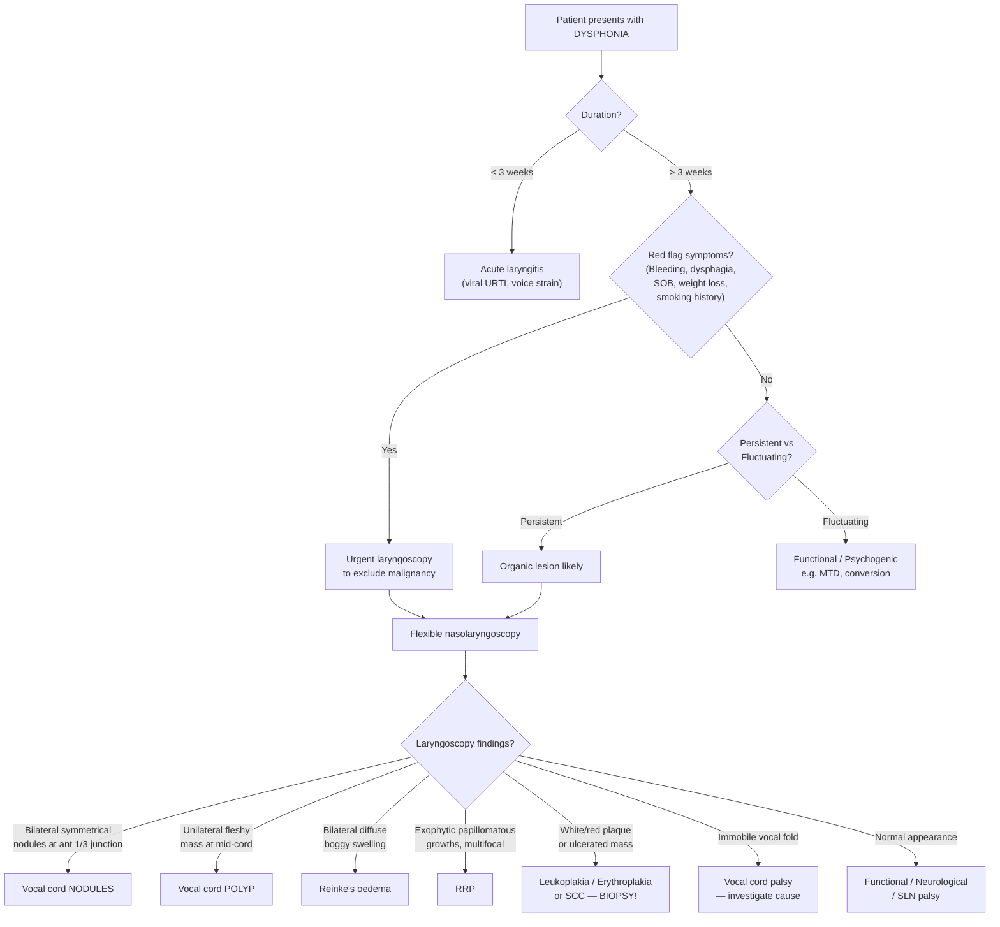

## Differential Diagnosis of Benign Lesions of the Vocal Cord

When a patient presents with **dysphonia** (voice change), the clinical challenge is not just recognising a benign vocal cord lesion — it is **distinguishing one benign lesion from another**, and crucially, **ruling out malignancy and neurological causes**. The differential diagnosis therefore operates on two levels:

1. **Among the benign lesions themselves** (nodule vs polyp vs Reinke's oedema vs RRP vs others)
2. **Against the broader etiologies of voice disorders** (malignant, neurological, functional, psychogenic)

---

### 1. The Overarching Framework: Etiologies of Voice Disorders

This is taken directly from the lecture classification and should be your mental scaffold whenever you see a patient with hoarseness [1]:

> ***Etiologies of Voice Disorders*** [1]:
>
> **1. Organic**
> - ***Local vocal cord pathologies***
>   - ***Benign***: Acute laryngitis, Vocal cord nodules, Vocal cord polyp, Reinke's oedema, Recurrent respiratory papillomatosis
>   - ***Malignant***: Squamous cell carcinoma
> - ***Neurological***
>   - ***Central***: e.g. Parkinsonism, vocal tremor, spasmodic dysphonia
>   - ***Peripheral***: e.g. Recurrent laryngeal nerve palsy, superior laryngeal nerve palsy
> - ***Poor breath support***: e.g. Asthma, COPD
>
> **2. Functional**: e.g. muscle tension dysphonia
>
> **3. Psychogenic**: e.g. conversion disorder

This means that for **any** patient with hoarseness, you must systematically consider all three categories. Let me explain why each category matters.

---

### 2. Differential Diagnosis Flowchart

The clinical approach to differentiating these conditions starts with **history** (acute vs chronic, persistent vs fluctuating, risk factors, red flags) and is confirmed by **laryngoscopy** (the single most important investigation).

<Callout title="Key History Points from Lecture Slides">

***Salient history*** to elicit [1]:
- ***Smoking*** — risk factor for polyps, Reinke's oedema, leukoplakia, and SCC
- ***Occupation, voice demand*** — risk factor for nodules (teachers, singers)
- ***Details of hoarseness***:
  - ***Acute vs chronic***
  - ***Progression***
  - ***Persistent (organic lesion) vs fluctuating (functional)*** — this is a critical distinction!
- ***Associated "red flag" symptoms for malignancy*** [1]:
  - ***Bleeding***
  - ***Shortness of breath***
  - ***Dysphagia***

</Callout>

---

### 3. Differentiating Among Benign Lesions

This is the most commonly tested scenario: "How do you tell these apart?"

#### 3.1 Vocal Cord Nodules vs Vocal Cord Polyps

This is the **highest yield** comparison. Both present with hoarseness, both arise from phonotrauma, but they differ fundamentally:

| Feature | Nodules | Polyps |
|:--------|:--------|:-------|
| **Mechanism** | ***Chronic*** voice abuse → oedema → fibrosis [1] | ***Acute*** vocal trauma → vessel bleeding → organised haematoma [1] |
| **Laterality** | ***Bilateral, always symmetrical*** [1] | ***Unilateral*** [1] (± contralateral contact lesion [2]) |
| **Location** | ***Junction of anterior and middle 1/3*** [1] | Mid-cord [2] |
| **Layer** | Epithelial layer [2] | Superficial lamina propria [2] |
| **Diplophonia** | Rare (symmetric mass → symmetric vibration) | Present (asymmetric mass → two frequencies) [2] |
| **Classic patient** | ***Singers, teachers*** [1]; females, children [2] | Adult males, smokers; rarely children [2] |
| **Management** | ***Speech therapy, vocal hygiene*** [1] | ***Microlaryngoscopy + excision*** [1] |

> **Why the different locations?** Nodules form at the **point of maximal vibration amplitude** — the junction of the anterior 1/3 and middle 1/3 — because this is where the two folds slam against each other hardest during normal phonation [1][2]. Polyps form wherever the vascular event happens, which is typically mid-cord where the mucosal vasculature is most exposed to trauma.

> **Why different management?** Nodules are a **behavioural disease** — caused by how you use your voice. Change the behaviour (speech therapy) → the early oedematous nodule can regress. Polyps are a **structural lesion** (organised haematoma) — they won't reabsorb with therapy alone → they need excision [1].

#### 3.2 Vocal Cord Polyp vs Reinke's Oedema

Both affect **Reinke's space** (superficial lamina propria), but they differ in distribution and mechanism:

| Feature | Polyp | Reinke's Oedema |
|:--------|:------|:-----------------|
| **Distribution** | Focal, unilateral [1] | Diffuse, bilateral [2] |
| **Cause** | Acute trauma → focal haemorrhage [1] | Chronic irritation (smoking) → diffuse capillary damage [2] |
| **Appearance** | Discrete pedunculated/sessile mass | "Water balloon" / "sausage-like" floppy swelling |
| **Voice** | Hoarse, diplophonia [2] | ***Low-pitched, husky ("sounding like a man")*** [2] |
| **Smoking history** | Variable | Almost always present [2] |

> **Why is Reinke's oedema bilateral but polyps unilateral?** Reinke's oedema is driven by a **diffuse irritant** (smoke, refluxate) that bathes both vocal folds equally → bilateral capillary damage → bilateral fluid extravasation. A polyp is a **focal vascular accident** → one vessel, one side.

#### 3.3 Vocal Cord Nodules/Polyps vs RRP

| Feature | Nodules / Polyps | RRP |
|:--------|:-----------------|:----|
| **Age** | Adults (nodules also children) | ***Children 2–5*** (juvenile) or adults 30–40s [2] |
| **Appearance** | Smooth, well-defined | Exophytic, papillomatous ("raspberry/cauliflower") |
| **Aetiology** | Phonotrauma [1] | HPV 6, 11 [2] |
| **Recurrence** | Not intrinsically recurrent (cured if behaviour changes/excised) | ***Inevitable recurrence; no cure*** [2] |
| **Respiratory distress** | Rare | Common in children (small airway) [2] |

#### 3.4 Acute Laryngitis vs Benign Structural Lesions

Acute laryngitis is the most common cause of **short-duration** hoarseness (< 3 weeks). It is self-limiting and caused by viral URTI, voice strain, or irritant exposure. Key differentiators:

- Duration < 3 weeks (vs benign structural lesions: > 3 weeks)
- Associated URTI symptoms (rhinorrhoea, sore throat, cough, fever)
- Laryngoscopy: diffuse vocal fold oedema and erythema, **no discrete mass**
- Resolves with conservative management (voice rest, hydration)

> **Why mention it?** Because it is listed as a ***benign local vocal cord pathology*** in the lecture aetiologies [1], and because failure of acute laryngitis to resolve in 3 weeks should prompt laryngoscopy to exclude an underlying structural or malignant lesion.

---

### 4. Differentiating Benign from Malignant Lesions

This is the **most critical** differential — missing a laryngeal carcinoma is a serious error.

#### 4.1 Laryngeal Squamous Cell Carcinoma (SCC)

***Risk factors: smoking*** [1]. ***Commonest pathology: squamous cell carcinoma*** [1].

***Clinical features*** of laryngeal SCC [1]:
- ***Hoarseness*** — just like benign lesions (this is why you can't rely on symptoms alone)
- ***Airway obstruction*** — progressive, unlike the stable obstruction of benign lesions
- ***Cervical lymph node metastasis*** — **this is the key discriminator**: benign lesions do NOT cause lymphadenopathy

| Feature | Benign Lesion | Malignant Lesion (SCC) |
|:--------|:-------------|:----------------------|
| **Hoarseness** | Present | Present |
| **Duration** | May be chronic but often stable | ***Progressive*** |
| **Red flags** | Absent | ***Bleeding, dysphagia, SOB*** [1] |
| **Smoking** | May or may not be present | ***Strong association*** [1] |
| **Lymphadenopathy** | **Absent** | ***Present*** (cervical LN metastasis) [1] |
| **Laryngoscopy** | Smooth, well-defined mass; mucosal wave preserved | Irregular, ulcerated/exophytic mass; ***mucosal wave ABSENT*** |
| **Stroboscopy** | Mucosal wave present (altered but not abolished) | ***Mucosal wave abolished*** (tumour infiltrates SLP) |
| **Weight loss** | No | Common (constitutional symptoms) |

#### 4.2 Leukoplakia and Erythroplakia — The Premalignant "Mimics"

These are crucial to recognise on laryngoscopy because they look deceptively innocent:

> ***Leukoplakia — whitish plaque*** [1]
> ***Erythroplakia — reddish plaque*** [1]
>
> These may represent:
> - ***Premalignant (Dysplasia)*** [1]
> - ***Malignant (SCC)*** [1]
>
> ***Biopsy !!!*** — ***Microlaryngoscopy + biopsy*** [1]

**Why is erythroplakia more concerning than leukoplakia?** Erythroplakia indicates **increased vascularity** and **thinned/atrophic epithelium** — it carries a higher rate of dysplasia/carcinoma in situ (up to 50%) compared to leukoplakia (~5–20%). The red colour comes from the underlying vasculature being visible through the abnormal, thinned mucosa.

<Callout title="Golden Rule" type="error">
***Any vocal fold lesion in a smoker that does not clearly look like a classic benign lesion MUST be biopsied.*** You cannot reliably distinguish premalignant/malignant lesions from benign ones by appearance alone. When in doubt, ***biopsy*** [1].
</Callout>

---

### 5. Differentiating Benign Lesions from Neurological Causes

#### 5.1 Recurrent Laryngeal Nerve (RLN) Palsy

This is the other major differential for unilateral vocal cord pathology. A patient with a ***unilateral vocal cord polyp*** may have similar symptoms to one with ***RLN palsy*** — both cause hoarseness and breathiness.

| Feature | Unilateral Polyp | Unilateral RLN Palsy |
|:--------|:-----------------|:---------------------|
| **Laryngoscopy** | Visible mass on mobile cord | **Immobile cord** in paramedian/lateral position, no mass |
| **Cause** | Phonotrauma [1] | Malignancy (thyroid CA, lung CA, oesophageal CA), iatrogenic (post-thyroidectomy), idiopathic [2] |
| **Aspiration** | Rare | **Common** (glottic incompetence → thin liquids aspirated) [2] |
| **Laterality of palsy** | N/A | **Left > Right** (left RLN loops under the aortic arch → longer course → more vulnerable) [2] |

> **Why does left RLN palsy matter clinically?** The left RLN descends into the thorax and loops under the aortic arch before ascending to the larynx. Any pathology along this course — ***CA lung (especially left apical/Pancoast), CA oesophagus, mediastinal lymphadenopathy, aortic aneurysm*** — can compress the nerve [2][3]. A new left vocal cord palsy mandates a **CT chest** to exclude intrathoracic pathology.

***Etiologies of unilateral vocal cord palsy*** [2]:
- ***Malignancy***: CA thyroid, CA lung, CA oesophagus
- ***Degenerative***: Stroke, myasthenia gravis, poliomyelitis, ALS
- ***Trauma***: Neck/chest/laryngeal trauma
- ***Iatrogenic***: Thyroid/parathyroid surgery, cardiothoracic surgery, carotid endarterectomy, anterior cervical spine surgery, endotracheal intubation, post-chemoradiation
- ***Idiopathic***

#### 5.2 Central Neurological Causes

***Central causes*** include ***Parkinsonism, vocal tremor, spasmodic dysphonia*** [1]:

- **Parkinsonism**: Hypophonia (soft, monotone voice) due to rigidity and bradykinesia of laryngeal muscles. Vocal folds move but with reduced amplitude. Patient also has other Parkinsonian features (tremor, rigidity, shuffling gait)
- **Spasmodic dysphonia**: Involuntary laryngeal muscle spasms causing strained, strangled voice breaks. The voice has a characteristic "squeezed" quality unlike the hoarseness of structural lesions
- **Vocal tremor**: Rhythmic oscillation of the voice, often associated with essential tremor

These are differentiated from benign structural lesions because the **vocal folds appear structurally normal** on laryngoscopy — the abnormality is in their **movement pattern**.

#### 5.3 Superior Laryngeal Nerve (SLN) Palsy

Often overlooked. The external branch of the SLN innervates the **cricothyroid muscle** (the tensor of the vocal fold that controls pitch). Palsy causes:

- Difficulty hitting high notes
- Voice fatigue
- **Normal-appearing vocal folds on laryngoscopy** — the abnormality is subtle (slight asymmetry of vocal fold tension, bowing of the affected side)

This mimics early nodules or functional dysphonia. It is typically iatrogenic (thyroid surgery injuring the external branch of the SLN in the cricothyroid space).

---

### 6. Functional and Psychogenic Causes

#### 6.1 Muscle Tension Dysphonia (MTD)

***Functional dysphonia*** [1] — the vocal folds are structurally normal but the patient uses **excessive or abnormal muscular effort** during phonation. Features:

- Voice is strained, effortful, sometimes with pitch breaks
- Often related to stress, anxiety, or compensatory patterns after a resolved laryngitis
- Laryngoscopy: **normal vocal folds** but with supraglottic hyperfunction (false folds may be seen adducting during phonation)
- Management: speech therapy

> MTD is a diagnosis of exclusion — you must rule out organic pathology first.

#### 6.2 Conversion Disorder (Psychogenic Dysphonia)

***Psychogenic*** [1] — complete aphonia or whispered voice in a patient under psychological stress. Key features:

- Often sudden onset
- Patient can **cough normally** (coughing requires vocal fold adduction → proves the folds can move)
- Laryngoscopy: normal vocal folds with paradoxical movement (folds adduct on cough but not on phonation)
- Young females predominately
- Treatment: speech therapy, psychological support

---

### 7. Other Benign Differentials (Less Common but Examinable)

| Condition | Key Features | How to Differentiate |
|:----------|:-------------|:---------------------|
| **Vocal fold cyst** (epidermoid or mucous retention) | Unilateral, submucosal smooth swelling; similar to polyp but deeper, beneath intact mucosa | Stroboscopy: reduced mucosal wave over the cyst; does not respond to voice therapy; requires marsupialization |
| **Granuloma** (contact/intubation) | Posterior glottis (vocal process of arytenoid); associated with intubation, LPR | Location is diagnostic — posterior, not mid-cord or anterior 1/3 junction |
| **Laryngocele** | Air-filled dilation of the laryngeal ventricle (saccule); presents as neck swelling that expands with Valsalva | CT shows air-filled cyst; can be internal, external, or combined |
| **Vocal fold scar/sulcus vocalis** | Groove or depression along the vocal fold edge from prior injury, surgery, or congenital; stiff SLP | Stroboscopy: markedly reduced mucosal wave along the scar; diagnosis often made during microlaryngoscopy |
| **Haemangioma** (subglottic, infantile) | Presents with biphasic stridor in infants; 50% have cutaneous haemangiomas | Location (subglottic), age (< 6 months), and associated skin lesions differentiate from RRP |

---

### 8. Approach to Investigations for Differentiation

***Investigations*** mentioned in lecture [1]:

1. ***Flexible laryngoscopy to assess extent*** [1] — the first-line investigation for any patient with hoarseness > 3 weeks
2. ***Stroboscopy*** — ***detect subtle vocal cord lesions*** [1]; crucial for mucosal wave assessment (benign vs malignant)
3. ***Biopsy to obtain histological diagnosis*** [1] — mandatory when malignancy suspected
4. ***Panendoscopy to look for synchronous lesion in upper aerodigestive tract*** [1] — because smoking and alcohol predispose to **field cancerisation** (multiple primary tumours)
5. ***Ultrasound neck to assess nodal metastasis ± fine needle aspiration*** [1]
6. ***Contrast CT neck to assess extent*** [1]

<Callout title="When to Investigate Beyond Laryngoscopy">

Investigations 3–6 above are for **suspected malignancy**, not for classic benign lesions. If the laryngoscopy clearly shows bilateral symmetrical nodules in a teacher → no biopsy needed; proceed with speech therapy. But if there is **any doubt**, particularly in a smoker with a unilateral, irregular, or ulcerated lesion → ***biopsy is mandatory*** [1].

</Callout>

---

### 9. Summary Differential Diagnosis Table

| Diagnosis | Onset | Voice Change | Laryngoscopy | Key Discriminator |
|:----------|:------|:-------------|:-------------|:------------------|
| **Nodules** | Chronic/gradual | Husky, breathy | Bilateral symmetrical, ant 1/3 junction | Voice abuse history; bilateral; speech therapy responsive |
| **Polyp** | Acute or subacute | Hoarse, diplophonia | Unilateral, mid-cord | Acute trauma history; unilateral; needs excision |
| **Reinke's oedema** | Chronic/gradual | Low-pitched, "like a man" | Bilateral diffuse boggy | Heavy smoker; diffuse (not focal) |
| **RRP** | Gradual (child) | Hoarse, stridor | Papillomatous, multifocal | Child; recurrent; HPV |
| **Acute laryngitis** | Acute (< 3 wks) | Hoarse | Diffuse oedema, no mass | URTI symptoms; self-limiting |
| ***SCC*** | Chronic/progressive | Hoarse, progressive | Irregular mass, absent mucosal wave | ***Smoking; red flags; lymphadenopathy*** [1] |
| ***Leukoplakia/Erythroplakia*** | Chronic | Hoarse | ***White/red plaque*** | ***Must biopsy*** [1] |
| ***RLN palsy*** | Variable | Breathy, weak, aspiration | Immobile vocal fold | ***Look for cause*** (malignancy, iatrogenic) [2] |
| ***MTD*** | Variable | Strained, effortful | Normal folds, supraglottic hyperfunction | ***Fluctuating; diagnosis of exclusion*** [1] |
| ***Psychogenic*** | Sudden | Aphonia/whisper | Normal folds, paradoxical movement | ***Can cough normally*** [1] |

---

<Callout title="High Yield Summary">

**Differential diagnosis of benign vocal cord lesions — the big picture:**

1. First classify by the lecture framework: ***Organic (benign vs malignant), Neurological (central vs peripheral), Functional, Psychogenic*** [1].

2. Among benign lesions, differentiate by: **laterality** (bilateral = nodules/Reinke's; unilateral = polyp), **location** (ant 1/3 junction = nodules; mid-cord = polyp; diffuse = Reinke's), **appearance** (papillomatous = RRP), and **patient demographics**.

3. The most critical differential is **benign vs malignant**: ***Persistent hoarseness in a smoker with red flags (bleeding, dysphagia, SOB) → must exclude SCC*** [1]. Absent mucosal wave on stroboscopy = malignancy until proven otherwise.

4. ***Leukoplakia and erythroplakia require biopsy — they may be premalignant or malignant*** [1].

5. ***Immobile vocal fold = RLN palsy, not a structural lesion*** — investigate for cause (CT chest for left-sided palsy) [2].

6. ***Fluctuating dysphonia with normal-looking vocal folds = functional (MTD) or psychogenic*** [1].

</Callout>

---

<ActiveRecallQuiz
  title="Active Recall - Differential Diagnosis of Benign Vocal Cord Lesions"
  items={[
    {
      question: "A 55-year-old male heavy smoker presents with progressive hoarseness for 2 months. Laryngoscopy shows an irregular, ulcerated mass on the right vocal fold with absent mucosal wave on stroboscopy. What is the most likely diagnosis and what investigations are needed?",
      markscheme: "Most likely diagnosis: laryngeal squamous cell carcinoma. Investigations: microlaryngoscopy with biopsy for histological diagnosis, panendoscopy to look for synchronous lesions, ultrasound neck for nodal metastasis with FNAC, contrast CT neck for extent assessment. Absent mucosal wave is the key stroboscopic finding distinguishing malignancy from benign lesions."
    },
    {
      question: "How do you differentiate a vocal cord polyp from a unilateral recurrent laryngeal nerve palsy? Both cause unilateral hoarseness.",
      markscheme: "Polyp: visible unilateral mass at mid-cord on laryngoscopy, vocal fold is mobile. RLN palsy: no mass seen, vocal fold is immobile (fixed in paramedian position). RLN palsy also causes aspiration risk (especially thin liquids) and requires investigation for underlying cause (CT chest for left-sided palsy to rule out lung CA, thyroid CA, oesophageal CA). Laryngeal EMG can confirm palsy vs mechanical fixation."
    },
    {
      question: "A patient presents with hoarseness that fluctuates in severity, worsens with stress, and laryngoscopy shows structurally normal vocal folds with supraglottic hyperfunction. What is the diagnosis and its classification according to the lecture framework?",
      markscheme: "Diagnosis: Muscle tension dysphonia (MTD). Classification: Functional voice disorder (Category 2 in the lecture framework). Key distinguishing features: fluctuating nature (vs persistent in organic lesions), normal vocal fold structure, supraglottic hyperfunction. It is a diagnosis of exclusion after organic pathology is ruled out. Management: speech therapy."
    },
    {
      question: "On laryngoscopy, you see a whitish plaque on the vocal fold of a smoker. What are the two possible pathological diagnoses and what must you do?",
      markscheme: "The whitish plaque is leukoplakia, which may represent: (1) premalignant dysplasia, or (2) malignant SCC. Must perform microlaryngoscopy and biopsy for histological diagnosis. Erythroplakia (reddish plaque) carries even higher risk of malignancy. You cannot distinguish benign from malignant by appearance alone."
    },
    {
      question: "List three red flag symptoms that should prompt urgent investigation for laryngeal malignancy in a patient with hoarseness.",
      markscheme: "From the lecture slides: (1) Bleeding, (2) Shortness of breath (airway obstruction), (3) Dysphagia. Additional red flags include: cervical lymphadenopathy, progressive nature of hoarseness, weight loss, smoking history, and otalgia (referred pain via CN X)."
    }
  ]}
/>

## References

[1] Lecture slides: GC 216. Dysphonia Laryngitis, voice abuse, tumour and laryngeal cancer.pdf (p4, p7, p11, p14, p17–19, p22)
[2] Senior notes: felixlai.md (sections on Vocal cord palsy, Benign conditions of larynx, pp. 315–319)
[3] Senior notes: maxim.md (section on oesophageal carcinoma — hoarseness as sign of locally advanced disease)
