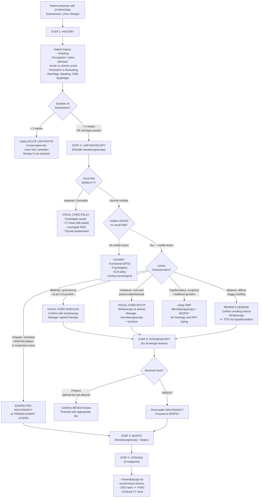

## Diagnosis of Benign Lesions of the Vocal Cord

### 1. Diagnostic Principles — Why Is There No "Criteria" Like for Rheumatic Fever?

Benign vocal cord lesions do **not** have formal diagnostic criteria in the way that systemic diseases do (e.g., Jones criteria, ACR criteria). Instead, diagnosis relies on a **pattern recognition approach** combining:

1. **Clinical history** — the story (onset, duration, voice demands, smoking, red flags)
2. **Laryngoscopic appearance** — the definitive diagnostic step
3. **Stroboscopy** — for subtle lesions and to differentiate benign from malignant
4. **Histopathology** — only when malignancy cannot be excluded

The diagnosis of a specific benign lesion is essentially a **clinical-endoscopic diagnosis** — you see the characteristic lesion on laryngoscopy in the right clinical context, and that is your diagnosis. Biopsy is reserved for uncertainty.

> Think of it like this: you don't need a biopsy to diagnose a vocal cord nodule in a teacher with bilateral symmetrical lesions at the anterior 1/3 junction — the diagnosis is staring at you through the scope. But you absolutely need a biopsy for an irregular unilateral mass in a smoker.

---

### 2. Diagnostic Criteria (Pattern-Based)

While not "formal criteria," each benign lesion has a **diagnostic pattern** — a combination of history + laryngoscopy findings that, taken together, clinch the diagnosis:

#### 2.1 Vocal Cord Nodules

| Domain | Diagnostic Pattern |
|:-------|:-------------------|
| **History** | ***Chronic voice abuse*** (***singer, teacher***) [1]; gradual onset of hoarseness; voice worsens with use, improves with rest |
| **Demographics** | Female > male; children and young adults [2] |
| **Laryngoscopy** | ***Bilateral and (always) symmetrical nodules at the junction of anterior and middle 1/3 of vocal folds*** [1] |
| **Stroboscopy** | Hourglass glottic closure pattern; reduced mucosal wave at nodule site; phase symmetry preserved (both folds affected equally) |
| **Response to therapy** | Improvement with voice therapy confirms the diagnosis retrospectively (a "therapeutic diagnosis") |

<Callout title="Diagnostic Pearl — Nodules">
If it's bilateral, symmetrical, at the anterior 1/3 junction, in a voice abuser → it's nodules. You don't need a biopsy. If it looks atypical (asymmetric, unilateral, irregular surface) → it's NOT a nodule, and you must reconsider your diagnosis.
</Callout>

#### 2.2 Vocal Cord Polyp

| Domain | Diagnostic Pattern |
|:-------|:-------------------|
| **History** | ***Acute vocal trauma*** [1] (e.g., shouting episode); may have sudden onset of hoarseness; smoking, GERD as cofactors [2] |
| **Demographics** | Adults, more common in males; rare in children [2] |
| **Laryngoscopy** | ***Unilateral vocal cord lesion*** [1] at mid-cord [2]; pedunculated (stalked) or sessile; may be translucent, haemorrhagic, or pale; ± contralateral "contact lesion" [2] |
| **Stroboscopy** | Asymmetric vibration; aperiodic motion; reduced mucosal wave over the polyp; phase asymmetry (one fold vibrates differently from the other) |

#### 2.3 Polypoid Corditis (Reinke's Oedema)

| Domain | Diagnostic Pattern |
|:-------|:-------------------|
| **History** | Heavy **smoking** [2]; gradual deepening of voice; middle-aged female complaining of ***"sounding like a man"*** [2] |
| **Associated conditions** | Laryngopharyngeal reflux, hypothyroidism [2] |
| **Laryngoscopy** | Bilateral, diffuse, boggy/gelatinous swelling of the entire vocal fold; ***vocal folds appear swollen and floppy*** [2]; "water balloon" or "sausage-like" appearance |
| **Stroboscopy** | Exaggerated, floppy mucosal wave (the fluid-filled SLP is hypercompliant); sluggish vibration due to increased mass |

#### 2.4 Recurrent Respiratory Papillomatosis (RRP)

| Domain | Diagnostic Pattern |
|:-------|:-------------------|
| **History** | Child aged 2–5 with progressive hoarseness → stridor → respiratory distress [2]; or adult 30–40s with hoarseness |
| **Risk factors** | Born via vaginal delivery to mother with HPV/condylomata [2] |
| **Laryngoscopy** | Multiple exophytic, papillomatous (raspberry/cauliflower) growths; multifocal; commonly on vocal folds, ventricles, subglottis [2] |
| **Histopathology** | **Required for confirmation**: squamous papilloma with fibrovascular cores; HPV typing (subtypes 6 and 11) by PCR or in situ hybridisation [2] |
| **Recurrence** | ***No cure; eventual recurrence*** after excision is part of the diagnostic natural history [2] |

<Callout title="When Is Biopsy Mandatory?" type="error">

Biopsy is **NOT** routinely needed for classic vocal cord nodules (bilateral, symmetrical, voice abuser) or classic Reinke's oedema (bilateral, smoker, floppy folds).

Biopsy **IS** mandatory when:
- The lesion is **atypical** in appearance (irregular, ulcerated, exophytic but not clearly papillomatous)
- There is ***leukoplakia or erythroplakia*** — ***Biopsy !!!*** [1]
- Malignancy cannot be excluded on clinical-endoscopic grounds
- RRP is suspected (to confirm HPV and exclude malignant transformation)
- Unilateral lesion in a smoker with red flags

</Callout>

---

### 3. Diagnostic Algorithm

The following algorithm represents the clinical approach to a patient presenting with **dysphonia**, systematically leading to the diagnosis of benign vocal cord lesions while appropriately excluding malignancy and neurological causes.

---

### 4. Investigation Modalities — Detailed Breakdown

#### 4.1 History and Voice Assessment

Before any instrument touches the patient, the history does most of the diagnostic work:

***Salient history*** [1]:
- ***Smoking*** — risk factor for polyps, Reinke's oedema, leukoplakia, SCC
- ***Occupation, voice demand*** — risk factor for nodules (teachers, singers, call-centre workers)
- ***Details of hoarseness*** [1]:
  - ***Acute vs chronic*** — acute (< 3 weeks) suggests laryngitis; chronic suggests structural lesion
  - ***Progression*** — progressive worsening raises concern for malignancy
  - ***Persistent (organic lesion) vs fluctuating (functional)*** — this is one of the most powerful discriminators
- ***Associated "red flag" symptoms for malignancy*** [1]:
  - ***Bleeding*** — suggests mucosal ulceration/tumour erosion
  - ***Shortness of breath*** — airway obstruction by tumour bulk
  - ***Dysphagia*** — extension to hypopharynx/oesophageal inlet

**Perceptual Voice Assessment** — the GRBAS Scale:

This is a standardised, subjective assessment tool used by speech therapists and ENT clinicians:

| Parameter | What It Assesses | Scale |
|:----------|:-----------------|:------|
| **G** — Grade | Overall severity of voice abnormality | 0 (normal) to 3 (severe) |
| **R** — Roughness | Irregularity of vibration (suggests mass lesion or stiffness) | 0–3 |
| **B** — Breathiness | Air leak through incomplete glottic closure | 0–3 |
| **A** — Asthenia | Weakness of voice (suggests neurological cause or poor breath support) | 0–3 |
| **S** — Strain | Hyperfunctional effort (suggests MTD or compensatory behaviour) | 0–3 |

> **Why use GRBAS?** It gives you a quick, reproducible snapshot of the voice quality that helps differentiate benign lesions (R and B dominant) from neurological causes (A dominant) from functional causes (S dominant). It also serves as a **baseline** to monitor response to therapy.

---

#### 4.2 Flexible Nasolaryngoscopy (FNL)

> ***Flexible laryngoscopy to assess extent*** [1]

This is the **first-line investigation** for any patient with hoarseness > 3 weeks (or with red flags regardless of duration).

**How it works**: A thin, flexible fibreoptic endoscope is passed through the nose → nasopharynx → oropharynx → hypopharynx, giving a direct view of the larynx from above. Performed **awake** in clinic, no anaesthesia needed beyond topical nasal decongestant/anaesthetic.

**What to assess systematically**:

| Structure | What to Look For | Relevance |
|:----------|:-----------------|:----------|
| **Supraglottis** (epiglottis, aryepiglottic folds, false vocal folds) | Mass, oedema, asymmetry | Supraglottic tumours, laryngocele |
| **True vocal folds** | Mass (laterality, location, surface character), colour, oedema | The key structures for benign lesion diagnosis |
| **Vocal fold MOBILITY** | Symmetric adduction/abduction during phonation and respiration | **Immobile fold = palsy** — this is the single most important observation to make [2] |
| **Anterior commissure** | Lesion crossing midline | Malignancy (T1b glottic SCC) |
| **Subglottis** | Visible below the free edge of the fold | Subglottic extension of tumour; subglottic haemangioma in infants |
| **Glottic closure pattern** | Complete vs incomplete; hourglass vs posterior gap | Hourglass = nodules; posterior gap = palsy; anterior gap = presbylaryngis |

**Key findings by diagnosis**:

| Diagnosis | FNL Appearance |
|:----------|:---------------|
| **Nodules** | ***Bilateral, symmetrical*** small elevations at ***junction of anterior and middle 1/3*** [1] |
| **Polyp** | ***Unilateral*** pedunculated/sessile mass at mid-cord [1] |
| **Reinke's oedema** | Bilateral, diffuse, ***swollen and floppy*** folds [2] |
| **RRP** | Multiple papillomatous growths, multifocal [2] |
| **SCC** | Irregular, ulcerated or exophytic mass; may see ***leukoplakia (whitish plaque)*** or ***erythroplakia (reddish plaque)*** [1] |
| **RLN palsy** | Immobile vocal fold in paramedian position [2] |
| **MTD/Psychogenic** | Normal-appearing folds; supraglottic hyperfunction; paradoxical movement on cough |

---

#### 4.3 Videostroboscopy

> ***Stroboscopy*** [1]:
> - ***Voice of patient picked up by microphone***
> - ***Light source emitting at or near fundamental frequency of voice***
> - ***Illusion of slow motion of vocal cord vibration***
> - ***Detect subtle vocal cord lesions*** [1]

**Principle from first principles**: The vocal folds vibrate at ~100–250 Hz during phonation — far too fast for the naked eye to resolve. Stroboscopy exploits the **stroboscopic effect**: a flashing light is synchronised to the voice frequency (picked up by a microphone attached to the patient's neck). By flashing at a rate *slightly different* from the vibration frequency, consecutive flashes capture the vocal fold at slightly different phases of its cycle, creating an ***illusion of slow motion*** [1].

**What stroboscopy uniquely reveals**:

| Parameter | What It Tells You | Clinical Application |
|:----------|:------------------|:---------------------|
| **Mucosal wave** | Whether the cover (epithelium + SLP) slides freely over the body | **Present but altered** = benign; **ABSENT** = malignancy (tumour infiltrates SLP, stiffening it) |
| **Amplitude** | How far the fold moves laterally during each vibration cycle | Reduced amplitude over a stiff lesion (fibrotic nodule, scar, carcinoma) |
| **Phase symmetry** | Whether both folds vibrate in sync | Asymmetric = unilateral lesion (polyp) or palsy |
| **Periodicity** | Whether vibration is regular or chaotic | Aperiodic = mass lesion disrupting regular vibration |
| **Glottic closure** | Pattern of closure during the closed phase | Hourglass = nodules; spindle-shaped = atrophy/palsy; complete = normal |

**Stroboscopy findings by diagnosis**:

| Diagnosis | Mucosal Wave | Amplitude | Closure Pattern | Symmetry |
|:----------|:-------------|:----------|:----------------|:---------|
| **Nodules** | Reduced at nodule site | Reduced at nodule | **Hourglass** (folds touch only at nodule points) | Symmetric |
| **Polyp** | Reduced over polyp | Asymmetric (affected side reduced) | Irregular gap | **Asymmetric** |
| **Reinke's oedema** | **Exaggerated**, floppy | Increased (hypermobile) | Irregular/incomplete | Symmetric |
| **Cyst** (submucosal) | Markedly reduced/absent over cyst | Reduced | Asymmetric gap | Asymmetric |
| **SCC** | **ABSENT** | Absent/markedly reduced | Incomplete | Asymmetric |
| **Scar / Sulcus** | Absent along the scar | Reduced | Spindle-shaped gap | Variable |

<Callout title="The Mucosal Wave — Your Best Friend in DDx" type="idea">
If you remember one thing about stroboscopy: **the mucosal wave differentiates benign from malignant**. A present (even if altered) mucosal wave is reassuring. An absent mucosal wave is alarming and demands biopsy. Why? Because malignant infiltration stiffens the superficial lamina propria — the very layer that generates the wave.
</Callout>

---

#### 4.4 Microlaryngoscopy (Direct Laryngoscopy Under GA)

This is the **gold standard** for detailed assessment and intervention. It is performed in the operating theatre under general anaesthesia with a rigid laryngoscope that provides magnified, binocular vision of the vocal folds.

**When is it indicated?**:
- When **biopsy** is needed (suspected malignancy, leukoplakia/erythroplakia, RRP confirmation) — ***Biopsy to obtain histological diagnosis*** [1]
- When **surgical excision** is planned (polyp removal, RRP debulking)
- When FNL findings are inconclusive and detailed examination is needed
- When RRP lesion mapping is required before ablation

**What it adds over FNL**:
- **Magnification** (using operating microscope or 0°/70° telescopes)
- **Bimanual instrumentation** — the surgeon can palpate the lesion, assess its mobility, and excise it
- **Biopsy capability** — ***microlaryngoscopy + biopsy*** [1]
- Assessment of submucosal extent (especially for cysts vs polyps)

**Instruments used** [2]:
- ***Cold steel excision (instruments like forceps, scissors)*** — standard for polyps and nodules
- ***CO2 laser*** — ***less bleeding but more time-consuming, reserved for complicated cases*** [2]; also used for RRP ablation
- Pulsed KTP (potassium titanyl phosphate) laser — increasingly used for vascular lesions and RRP (angiolytic laser that targets haemoglobin in feeding vessels)

---

#### 4.5 Histopathology

**When obtained** (via microlaryngoscopy biopsy):

| Diagnosis | Histological Findings |
|:----------|:----------------------|
| **Nodules** | Thickened epithelium; basement membrane thickening; subepithelial fibrosis; no atypia |
| **Polyp** | Oedematous stroma (myxoid polyp) OR organised haematoma with haemosiderin deposits and fibrin; dilated blood vessels; lined by normal or mildly keratinised epithelium; no atypia |
| **Reinke's oedema** | Oedematous, pale, amorphous material (Reinke's space fluid); dilated subepithelial vessels; stromal oedema; epithelium usually normal or mildly thickened |
| **RRP** | **Squamous papilloma** — finger-like projections of stratified squamous epithelium with fibrovascular cores; koilocytes (HPV-infected cells with perinuclear halo and nuclear wrinkling); HPV subtypes 6/11 on PCR [2] |
| **Leukoplakia** | Hyperkeratosis ± dysplasia (graded mild/moderate/severe) ± carcinoma in situ ± invasive SCC |
| **SCC** | Nests/sheets of atypical squamous cells with keratinisation, mitoses, stromal invasion |

> **Why do we biopsy RRP but not classic nodules?** RRP requires histological confirmation because (a) you need to confirm it's not a verrucous carcinoma (which can look papillomatous), (b) HPV typing has prognostic implications (HPV 11 = more aggressive), and (c) longstanding RRP has a small risk of malignant transformation. Nodules have a pathognomonic appearance on laryngoscopy and carry zero malignant potential.

---

#### 4.6 Panendoscopy

> ***Panendoscopy to look for synchronous lesion in upper aerodigestive tract*** [1]

**What is it?** A combined procedure under GA consisting of ***direct laryngoscopy + bronchoscopy + OGD (oesophagogastroduodenoscopy)*** [2].

**Why do we do it?** The concept of **field cancerisation** (also called "field change" or "condemned mucosa"): in patients exposed to carcinogens like tobacco and alcohol, the **entire mucosal lining** of the upper aerodigestive tract has been exposed → there is a risk of **synchronous second primary tumours** (reported in 5–15% of H&N SCC patients).

**When is it indicated?**:
- **Confirmed or suspected laryngeal malignancy** — to look for synchronous lesions in the oropharynx, hypopharynx, oesophagus, and tracheobronchial tree [1]
- **NOT routinely indicated for benign lesions** — unless there is diagnostic uncertainty

---

#### 4.7 Imaging

##### Ultrasound Neck ± FNAC

> ***Ultrasound neck to assess nodal metastasis +/- fine needle aspiration*** [1]

- **When**: When malignancy is suspected or confirmed
- **Purpose**: Assess cervical lymph nodes for metastatic involvement
- **FNAC**: If a suspicious node is identified (hypoechoic, > 1cm, rounded, loss of hilum), USG-guided FNAC provides cytological confirmation
- **NOT needed for benign vocal cord lesions** — but important in the differential if malignancy is a concern

##### Contrast CT Neck

> ***Contrast CT neck to assess extent*** [1]

- **When**: Confirmed or suspected laryngeal malignancy
- **Purpose**: Evaluate tumour extent, extra-laryngeal spread, cartilage invasion (thyroid/cricoid), pre-epiglottic and paraglottic space involvement, and lymph node status [2]
- **NOT needed for benign vocal cord lesions** unless:
  - Vocal cord palsy is found → CT chest (to assess RLN course from skull base to mediastinum)
  - Subglottic extension of RRP needs assessment
  - Severe Reinke's oedema with airway compromise needing pre-operative assessment

##### Other Imaging

| Investigation | Indication |
|:-------------|:-----------|
| **CT chest** | Unilateral vocal cord palsy (especially left) → rule out lung CA, mediastinal mass, aortic aneurysm [2] |
| **MRI neck** | Better soft-tissue resolution than CT; useful for delineating tumour extent in H&N cancer |
| **CXR** | Baseline in smokers; pre-operative assessment |

---

#### 4.8 Adjunctive Investigations

| Investigation | When & Why |
|:-------------|:-----------|
| **Thyroid function tests (TFTs)** | Reinke's oedema — to exclude hypothyroidism as a contributing cause [2] |
| **pH monitoring / impedance testing** | If laryngopharyngeal reflux (LPR) is suspected as a contributing factor for nodules, polyps, or Reinke's oedema |
| **Laryngeal EMG** | Vocal cord palsy — to ***distinguish vocal cord paralysis from mechanical fixation secondary to scar tissue or cricoarytenoid joint fixation*** [2] |
| **HPV testing** (PCR, in situ hybridisation) | RRP — confirms aetiology and identifies HPV subtype (prognostic value: HPV 11 more aggressive) |
| **Pulmonary function tests** | Severe Reinke's oedema or RRP with airway compromise — quantify degree of obstruction |

---

#### 4.9 Summary: Which Investigations for Which Lesion?

| Investigation | Nodules | Polyp | Reinke's Oedema | RRP | Suspected Malignancy |
|:-------------|:--------|:------|:-----------------|:----|:---------------------|
| **History + GRBAS** | ✅ | ✅ | ✅ | ✅ | ✅ |
| **FNL** | ✅ (diagnostic) | ✅ (diagnostic) | ✅ (diagnostic) | ✅ (suggestive) | ✅ (suggestive) |
| **Stroboscopy** | ✅ (confirms) | ✅ (confirms) | ✅ (confirms) | Optional | ✅ (absent wave → alarm) |
| **Microlaryngoscopy** | Only if surgery needed | ✅ (therapeutic) | Only if surgery needed | ✅ (therapeutic + biopsy) | ✅ (***biopsy***) [1] |
| **Histopathology** | Not routine | Not routine | Not routine | ✅ (mandatory) | ✅ (***mandatory***) [1] |
| **Panendoscopy** | ❌ | ❌ | ❌ | ❌ | ✅ [1] |
| **USG neck ± FNAC** | ❌ | ❌ | ❌ | ❌ | ✅ [1] |
| **CT/MRI neck** | ❌ | ❌ | ❌ | If subglottic extension | ✅ [1] |
| **TFTs** | ❌ | ❌ | ✅ (exclude hypothyroidism) | ❌ | ❌ |
| **Laryngeal EMG** | ❌ | ❌ | ❌ | ❌ | If palsy found [2] |

---

### 5. Interpretation Framework — Putting It All Together

When you perform laryngoscopy and stroboscopy on a patient with hoarseness, here is the structured interpretation:

1. **Is the fold mobile?** → If no: vocal cord palsy → investigate cause
2. **Is there a visible lesion?** → If no: functional/neurological/psychogenic → speech therapy assessment
3. **What does the lesion look like?**
   - Bilateral, symmetrical, ant 1/3 junction → **Nodules**
   - Unilateral, mid-cord, pedunculated → **Polyp**
   - Bilateral, diffuse, floppy → **Reinke's oedema**
   - Papillomatous, multifocal → **RRP** → biopsy
   - Irregular, ulcerated, white/red plaque → **Suspect malignancy** → ***biopsy !!!*** [1]
4. **What does the mucosal wave show?**
   - Present (altered) → confirms benign
   - Absent → suspect malignancy → biopsy
5. **Are there red flags?** (***Bleeding, SOB, dysphagia*** [1], lymphadenopathy, weight loss)
   - If yes → full malignancy workup (panendoscopy, USG neck ± FNAC, CT neck) [1]

---

<Callout title="High Yield Summary">

**Diagnosis of Benign Vocal Cord Lesions — Key Points:**

1. Diagnosis is **clinical-endoscopic** — based on history + characteristic laryngoscopic appearance. No formal "diagnostic criteria" exist.

2. ***Flexible laryngoscopy*** is the **first-line investigation** for hoarseness > 3 weeks [1]. Assess: vocal fold mobility, lesion characteristics, glottic closure.

3. ***Stroboscopy*** creates an ***illusion of slow motion of vocal cord vibration*** [1] and is crucial for:
   - ***Detecting subtle vocal cord lesions*** [1]
   - Differentiating benign (mucosal wave present) from malignant (mucosal wave absent)

4. ***Biopsy*** (via ***microlaryngoscopy***) is mandatory for: suspected malignancy, ***leukoplakia/erythroplakia*** [1], RRP confirmation, and any atypical lesion.

5. ***Panendoscopy*** is for malignancy only — to look for ***synchronous lesions in the upper aerodigestive tract*** [1].

6. ***USG neck ± FNAC*** and ***contrast CT neck*** are staging investigations for malignancy [1], not for benign lesions.

7. Adjunctive tests: TFTs for Reinke's oedema (hypothyroidism); laryngeal EMG for vocal cord palsy (to distinguish paralysis from mechanical fixation) [2].

</Callout>

---

<ActiveRecallQuiz
  title="Active Recall - Diagnosis of Benign Vocal Cord Lesions"
  items={[
    {
      question: "Explain the principle of stroboscopy. Why does it create the illusion of slow motion, and what is its key diagnostic value in differentiating benign from malignant vocal cord lesions?",
      markscheme: "Stroboscopy uses a light source flashing at or near the fundamental frequency of the patient's voice (picked up by a microphone). By flashing at a rate slightly different from the vibration frequency, consecutive flashes capture the vocal fold at slightly different phases, creating an illusion of slow motion. Key diagnostic value: benign lesions have a PRESENT (though altered) mucosal wave; malignant lesions have an ABSENT mucosal wave because tumour infiltrates and stiffens the superficial lamina propria."
    },
    {
      question: "A 45-year-old smoker has hoarseness for 8 weeks. Flexible laryngoscopy shows a whitish plaque on the left vocal fold with reduced mucosal wave on stroboscopy. What are the next steps and why?",
      markscheme: "The whitish plaque is leukoplakia, which may represent premalignant dysplasia or SCC. The reduced mucosal wave is concerning for possible malignant infiltration. Next steps: (1) Microlaryngoscopy + biopsy for histological diagnosis (mandatory - cannot distinguish benign from malignant by appearance alone), (2) If malignancy confirmed: panendoscopy for synchronous lesions, USG neck +/- FNAC for nodal metastasis, contrast CT neck for extent assessment."
    },
    {
      question: "For which benign vocal cord lesions is histopathological confirmation (biopsy) routinely required, and for which is it NOT? Explain the reasoning.",
      markscheme: "Biopsy routinely required: RRP (to confirm diagnosis, exclude verrucous carcinoma, HPV type for prognosis, monitor for malignant transformation). Biopsy NOT routinely required: Nodules (pathognomonic bilateral symmetrical appearance at ant 1/3 junction in voice abuser; zero malignant potential), Polyps (typical unilateral mid-cord appearance; though histology may be obtained at excision), Reinke's oedema (classic bilateral floppy appearance in smoker). Biopsy always required if lesion appearance is atypical or if leukoplakia/erythroplakia is present."
    },
    {
      question: "What is panendoscopy? What does it consist of, and when is it indicated in the workup of vocal cord lesions?",
      markscheme: "Panendoscopy = direct laryngoscopy + bronchoscopy + OGD (oesophagogastroduodenoscopy), performed under GA. It is indicated when laryngeal malignancy is confirmed or suspected, to look for synchronous second primary tumours in the upper aerodigestive tract (due to field cancerisation from shared carcinogen exposure - smoking and alcohol). It is NOT indicated for confirmed benign vocal cord lesions."
    },
    {
      question: "A patient with hoarseness is found to have an immobile left vocal fold on flexible laryngoscopy with no visible mass. What investigation must be ordered and why?",
      markscheme: "CT chest (and CT from skull base to mediastinum) must be ordered. An immobile left vocal fold without a visible mass indicates left RLN palsy. The left RLN has a long intrathoracic course, looping under the aortic arch, making it vulnerable to compression by lung carcinoma (especially left apical), oesophageal carcinoma, mediastinal lymphadenopathy, or aortic aneurysm. CT chest is mandatory to exclude these causes. Laryngeal EMG can also distinguish true paralysis from cricoarytenoid joint fixation."
    }
  ]}
/>

## References

[1] Lecture slides: GC 216. Dysphonia Laryngitis, voice abuse, tumour and laryngeal cancer.pdf (p4, p7, p11, p13–14, p18, p22)
[2] Senior notes: felixlai.md (sections on Benign conditions of larynx pp. 315–316, 319; Vocal cord palsy pp. 317; Laryngeal carcinoma pp. 382)
