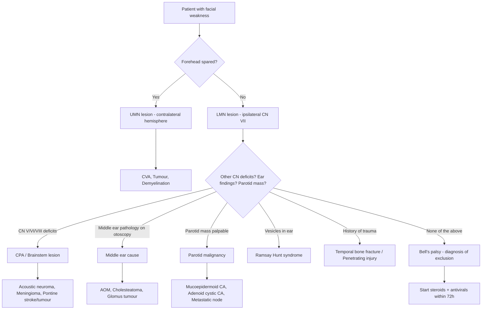

## Differential Diagnosis of Facial Nerve Palsy

The differential diagnosis of facial nerve palsy is one of those clinical exercises where anatomy is your best friend. The approach is straightforward: **trace the nerve from cortex to face**, and at each anatomical level, list what could go wrong. Then separately consider systemic and bilateral causes. The whole point of the differential is to **avoid slapping the label "Bell's palsy" on something sinister** — remember, ***Bell's palsy is a diagnosis by exclusion*** [1].

---

### Conceptual Framework: How to Think About the DDx

Before diving into lists, let's establish the thinking process. When a patient walks in with facial weakness, you need to answer **three questions in sequence**:

1. **Is it UMN or LMN?** → Forehead sparing (UMN) vs. forehead involved (LMN)
2. **If LMN, where along the nerve is the lesion?** → Use associated features (lacrimation, taste, hyperacusis, other CNs) to localise
3. **What is the cause at that anatomical level?** → Tumour, infection, trauma, inflammatory, idiopathic?

---

### DDx Organised by Anatomical Level

This is the approach emphasised in the lecture [1] and senior notes [2].

#### I. Intracerebral / Supranuclear (UMN Lesion)

These cause **contralateral lower face weakness with forehead sparing**.

| Cause | Why it causes facial weakness | Distinguishing features |
|---|---|---|
| ***CVA (stroke)*** — ***commonest cause of UMN facial palsy*** [1] | Ischaemia/haemorrhage of the motor cortex or corticobulbar tract → loss of contralateral input to the lower facial nucleus (upper face nucleus is spared because it gets bilateral cortical input) | Acute onset, associated hemiparesis/hemiplegia, hemisensory loss, speech/language deficits, stroke risk factors. UMN signs (hyperreflexia, upgoing plantars). |
| ***Tumour*** [1] | Mass effect compresses or infiltrates corticobulbar fibres | Subacute/progressive onset, headache, seizures, other focal neurological deficits. Raised ICP signs. |
| ***Demyelinating disease (e.g. MS)*** [1] | Demyelinating plaques in the cerebral white matter disrupt corticobulbar conduction | Relapsing-remitting course, young female, optic neuritis, Lhermitte's sign, other white matter lesion symptoms |
| Vascular malformations | AVM or aneurysm compresses cortical motor areas | May present with haemorrhage, seizures |

<Callout title="Key Point">
The moment you see **forehead sparing**, you should be thinking "UMN" and the differential immediately shifts to stroke, tumour, and demyelination — NOT Bell's palsy. The single most common cause is CVA.
</Callout>

#### II. Brainstem / Facial Nucleus in the Pons (LMN pattern, but "central")

This is the exception that catches students out — the lesion is in the brainstem (central), but produces an **LMN pattern** because it destroys the **facial nucleus itself or its fascicles** (the final common pathway starts here) [2].

| Cause | Why it causes facial weakness | Distinguishing features |
|---|---|---|
| Brainstem stroke | Infarction of the lateral pons destroys the facial nucleus/fascicles | **Millard-Gubler syndrome**: ipsilateral CN VI + CN VII palsy + contralateral hemiplegia (lesion damages facial nucleus, abducens nucleus, and corticospinal tract in the pons). **Foville syndrome**: adds conjugate gaze palsy. |
| ***Tumour (pontine glioma)*** [1] | Infiltrative growth destroys the facial nucleus | Progressive course, other brainstem signs (long tract signs, other CN palsies), common in children |
| ***Demyelinating disease (MS)*** [1] | Demyelinating plaque in the pons affects facial nucleus or fascicles | Relapsing course, young patient, MRI shows periventricular/pontine plaques |
| Syringobulbia | Extension of a syrinx cavity into the lower pons/medulla damages the facial nucleus | Associated lower CN palsies, dissociated sensory loss, often with syringomyelia history |

> **Why does a pontine lesion give LMN facial palsy?** Because the **lower motor neuron** for CN VII starts at the facial nucleus in the pons. Destroying the nucleus itself is identical in effect to cutting the peripheral nerve — all ipsilateral facial muscles are affected. The distinction from peripheral causes is the presence of **associated brainstem signs**: long tract signs (contralateral hemiplegia, hemisensory loss), other CN palsies (especially CN VI which is right next door), and cerebellar signs.

#### III. Cerebellopontine Angle / Internal Acoustic Meatus [1]

| Cause | Why it causes facial weakness | Distinguishing features |
|---|---|---|
| ***Acoustic neuroma (vestibular schwannoma)*** [1] | Schwannoma arising from CN VIII in the IAM expands and compresses CN VII (which runs alongside in the anterosuperior compartment) | **Gradual unilateral SNHL** (the earliest and most common symptom), tinnitus, unsteadiness. Facial weakness is actually a late finding — by the time facial palsy appears, the tumour is usually large. ***Asymmetrical sensorineural hearing loss of gradual onset*** [3]. Also: CN V numbness (large tumour compresses trigeminal), cerebellar signs. |
| ***Meningioma*** [1] | CPA meningioma compresses CN VII and CN VIII at the CPA | Similar presentation to acoustic neuroma but may involve CN V earlier; typically enhances homogeneously on MRI with dural tail |
| Epidermoid cyst | Congenital inclusion cyst at CPA compresses CNs | Recurrent aseptic meningitis, CN palsies, DWI restriction on MRI |
| Metastasis (leptomeningeal) | Malignant cells seed the meninges around the CPA | Known primary malignancy, multiple CN palsies, headache |

#### IV. Temporal Bone [1]

| Cause | Why it causes facial weakness | Distinguishing features |
|---|---|---|
| ***Temporal bone fracture*** [1][3] | Direct injury to the facial nerve within the bony canal. **Transverse fractures** (perpendicular to petrous ridge) are more likely to damage the nerve (labyrinthine segment/geniculate ganglion) — 50% incidence of facial palsy. **Longitudinal fractures** (parallel to petrous ridge) — ~20% incidence, usually in the tympanic/mastoid segment. | History of head trauma, ***facial nerve function — immediate vs. delayed onset*** [3]. Immediate = probable nerve transection → needs exploration. Delayed = oedema/haematoma → may observe. Haemotympanum, CSF otorrhoea, hearing loss. |
| ***Facial nerve schwannoma*** [1] | Primary schwannoma arising from the nerve itself (can occur anywhere along its course but especially geniculate ganglion and tympanic segment) | Very slow progression of facial weakness (months–years), may have conductive or sensorineural hearing loss depending on location, middle ear mass on otoscopy |

#### V. Middle Ear [1]

| Cause | Why it causes facial weakness | Distinguishing features |
|---|---|---|
| ***Acute otitis media (AOM)*** [1] | The bony wall of the facial canal in the tympanic segment is very thin (< 0.1 mm) and **dehiscent in ~50% of people** — bacterial infection and inflammation in the middle ear can directly inflame or compress the exposed nerve | Ear pain, fever, conductive hearing loss, bulging erythematous TM on otoscopy. Facial palsy develops during active infection. |
| ***Chronic otitis media — cholesteatoma*** [1][3] | Cholesteatoma (aberrant keratinising squamous epithelium in the middle ear) progressively erodes bone, including the bony facial canal → direct compression and invasion of the nerve. ***Extracranial complication of CSOM: facial nerve paralysis*** [3]. | Chronic foul-smelling otorrhoea, conductive hearing loss, retraction pocket or attic crust on otoscopy, ***management of "unsafe" CSOM: mastoidectomy*** [3] |
| ***Herpes zoster oticus — Ramsay Hunt syndrome*** [1] | VZV reactivation in the geniculate ganglion → intense inflammation and neural destruction. The nerve is damaged at its most vulnerable narrow segment. | **Classic triad: ipsilateral facial paralysis + otalgia + vesicles in the auditory canal/auricle** [2]. Often more severe than Bell's palsy with poorer recovery (~50–70% vs > 90%). May also have CN VIII involvement (SNHL, vertigo). |
| ***Tumour in middle ear — glomus tumour, carcinoma*** [1][3] | Glomus tympanicum or glomus jugulare: highly vascular paraganglioma that erodes into the facial canal. Middle ear carcinoma (SCC) can also invade the nerve. ***Glomus tumour middle ear*** [3]. | Pulsatile tinnitus (the classic symptom of glomus tumours), conductive hearing loss, red pulsatile mass behind the TM ("rising sun" sign), may have other lower CN palsies (IX, X, XI for glomus jugulare) |
| ***Bell's palsy — nerve swollen in the facial canal*** [1] | ***Idiopathic facial nerve palsy. ? Herpes reactivation neuritis*** [1]. HSV-1 reactivation → inflammation → oedema of the nerve within the rigid labyrinthine segment → ***neuropraxia*** [1]. The labyrinthine segment is the narrowest part (~0.68 mm), so even mild oedema causes a compartment-syndrome-like compression. | ***Commonest cause of facial nerve palsy*** [1]. Acute onset 1–2 days. ***Diagnosis by exclusion*** [1]. ***Physical exam to rule out other causes like CVA, parotid tumour, middle ear infection etc.*** [1]. ***> 90% good recovery*** [1]. ***May progress in the first 3 weeks*** [1]. ***Consider imaging if no improvement or deterioration after 6 weeks*** [1]. |

<Callout title="Bell's Palsy is a Diagnosis of Exclusion" type="error">
You must **actively rule out** other causes before labelling a patient as Bell's palsy. The lecture explicitly states: ***"Physical exam to rule out other causes like CVA, parotid tumour, middle ear infection etc."*** [1]. A progressive facial palsy beyond 3 weeks, bilateral palsy, parotid mass, or associated CN deficits should make you reconsider the diagnosis. ***"Consider other causes of facial nerve palsy if no improvement after 6 weeks"*** [1].
</Callout>

#### VI. Beyond Stylomastoid Foramen [1]

| Cause | Why it causes facial weakness | Distinguishing features |
|---|---|---|
| ***Facial trauma — blunt or penetrating*** [1] | Direct injury to the extratemporal nerve or its branches after they exit the skull. Because the nerve has already divided into branches at this level, ***may only affect a single branch*** [1] (e.g. isolated marginal mandibular palsy from a knife wound or mandible fracture). | History of trauma, laceration or fracture in the parotid/mandibular region, may see isolated branch deficit |
| ***Malignant tumour in parotid gland*** [1] | CN VII runs **through** the parotid gland (dividing it into superficial and deep lobes). Malignant parotid tumours (mucoepidermoid carcinoma, adenoid cystic carcinoma) can directly invade the nerve. ***Facial weakness = high suspicion of malignant involvement of parotid gland*** [2]. | Parotid mass + facial weakness = **malignant until proven otherwise**. May be painless initially. ***Parotid tumour must be distinguished from Bell's palsy*** [2]. Progressive course. Firm, fixed mass. |
| ***Metastatic intraparotid lymph node*** [1] | The parotid contains lymph nodes (the only salivary gland that does, because the lymph nodes were encapsulated within the gland during embryonic development). Metastatic disease (e.g. cutaneous SCC of scalp/ear, melanoma) can invade the nerve. | Known primary (usually skin cancer of scalp/ear), firm node in parotid region, may have other cervical lymphadenopathy |
| ***Surgical injury — common*** [1] | Iatrogenic injury during parotidectomy, mastoidectomy, facelift surgery, TMJ surgery, or neck dissection. The marginal mandibular branch is at particular risk during submandibular gland excision (runs superficial to the facial artery). | Onset temporally related to surgery. May be immediate (nerve cut/cauterised) or delayed (oedema, traction injury). |

---

### Systemic / Bilateral Causes

These are critical because **bilateral facial palsy** is a red flag — it should NEVER be labelled as bilateral Bell's palsy without thorough investigation.

| Cause | Key features | Why it causes facial palsy |
|---|---|---|
| ***Guillain-Barré syndrome (GBS)*** [2] | ***Occurs in > 50% of GBS patients. Typically bilateral and symmetrical involvement*** [2]. Ascending weakness, areflexia, albuminocytologic dissociation in CSF (raised protein, normal cell count). | Autoimmune demyelinating polyradiculoneuropathy → immune attack on myelin of peripheral nerves including CN VII. Often post-infectious (Campylobacter, CMV). The facial nerve is a peripheral nerve, so it is affected like any other. |
| ***Sarcoidosis*** [2] | ***Cranial neuropathy including peripheral facial nerve palsy is a frequent manifestation of neurosarcoidosis*** [2]. **Heerfordt syndrome** (uveoparotid fever): bilateral parotid swelling + uveitis + facial palsy + fever. ACE ↑, bilateral hilar lymphadenopathy on CXR, non-caseating granulomas on biopsy. | Granulomatous inflammation infiltrates and compresses the facial nerve, either at the skull base or within the parotid gland. Sarcoidosis has a predilection for cranial nerves (CN VII is the most commonly affected). |
| ***Lyme disease*** [2] | ***Tick-borne illness caused by Borrelia spirochaete. Facial nerve palsy is the most common cranial neuropathy associated with Lyme disease*** [2]. Can be bilateral (25% of Lyme-associated facial palsy). Erythema migrans, arthritis, cardiac conduction abnormalities. | Direct spirochaetal invasion and immune-mediated inflammation of the nerve. Less relevant in Hong Kong (Lyme is endemic in North America and Europe) but important for the differential, especially if travel history present. |
| **Diabetes mellitus** | Increased risk of Bell's palsy. More likely to have recurrent episodes and incomplete recovery. | Microvascular disease (diabetic microangiopathy) affecting the vasa nervorum → ischaemic neuropathy of CN VII, similar mechanism to diabetic mononeuropathy of CN III. |
| **Pregnancy** | Third trimester/immediate postpartum. 3× higher incidence than age-matched non-pregnant women. | Fluid retention → oedema within the rigid facial canal → compression. Also possible immune modulation. |
| **HIV/AIDS** | Facial palsy can occur at seroconversion or with advanced disease. | Direct viral neurotropism, immune-mediated demyelination, or opportunistic infections (VZV, CMV). |
| **Melkersson-Rosenthal syndrome** | Rare. Triad: recurrent facial palsy + facial oedema (especially lip swelling) + fissured tongue (lingua plicata). | Unknown; thought to be a granulomatous inflammatory condition affecting the facial nerve. |
| **Acute/chronic otitis media** as bilateral | Rare but possible, especially in children | Bilateral middle ear infection → bilateral nerve inflammation |
| **Leukaemia/lymphoma** | Leukaemic or lymphomatous infiltration of CN VII | Malignant cells infiltrate the nerve directly (neuroleukaemia) |
| **Möbius syndrome** | Congenital bilateral CN VI + CN VII palsy. Child cannot smile or abduct the eyes. | Developmental failure/aplasia of CN VI and CN VII nuclei in the brainstem. |

---

### DDx by Clinical Presentation Pattern

Sometimes it's more practical to think about the DDx based on the pattern of presentation:

| Pattern | Think of... |
|---|---|
| **Acute onset (hours), LMN, no other features** | Bell's palsy (most likely), Ramsay Hunt (check ear for vesicles) |
| **Acute onset, LMN, vesicles in ear** | Ramsay Hunt syndrome |
| **Acute onset, UMN, other neurological deficits** | Stroke (CVA) |
| **Acute onset after head trauma** | Temporal bone fracture |
| **Progressive (weeks–months), LMN** | **Tumour until proven otherwise** — parotid malignancy, acoustic neuroma, facial nerve schwannoma, cholesteatoma, NPC with skull base extension |
| **Bilateral facial palsy** | GBS, sarcoidosis, Lyme disease, bilateral Bell's (rare — diagnosis of exclusion), leukaemia, HIV |
| **Recurrent ipsilateral facial palsy** | Facial nerve schwannoma, Melkersson-Rosenthal syndrome, recurrent Bell's (uncommon), tumour |
| **Facial palsy + parotid mass** | ***Malignant parotid tumour*** [1] — must be investigated |
| **Facial palsy + foul ear discharge** | Cholesteatoma (unsafe CSOM) [3] |
| **Facial palsy + pulsatile tinnitus** | Glomus tumour (paraganglioma) [1][3] |
| **Facial palsy + unilateral SNHL** | CPA lesion — acoustic neuroma, meningioma [1] |
| **Facial palsy + CN VI palsy** | Pontine lesion (Millard-Gubler), CPA tumour, raised ICP with CN VI false localising sign |

---

### Hong Kong–Specific Considerations

- **Nasopharyngeal carcinoma (NPC)**: Endemic in southern China/Hong Kong. Arises most commonly in the ***fossa of Rosenmüller*** [4]. Advanced NPC can spread to the skull base and involve multiple cranial nerves, including CN VII. More commonly affects CN V (facial numbness) and CN VI (diplopia) first, but CN VII can be involved with extensive disease. Always check post-nasal space in any unexplained cranial neuropathy in a Hong Kong patient.
- **Cholesteatoma**: Relatively common in Hong Kong ENT practice. Any patient with chronic ear discharge and facial weakness should have urgent CT temporal bone and surgical management (mastoidectomy) [3].
- **Parotid malignancy**: Mucoepidermoid carcinoma is the most common malignant parotid tumour; adenoid cystic carcinoma is notorious for **perineural invasion** and distant metastasis [2]. In Hong Kong, cutaneous SCC metastatic to intraparotid nodes is also seen, particularly from scalp/ear primaries in elderly patients.

---

### Summary: The "Must-Not-Miss" Differentials

<Callout title="Red Flags That Should Make You Reconsider Bell's Palsy">

1. **Progressive weakness > 3 weeks** → Tumour (parotid, CPA, facial nerve schwannoma, NPC)
2. **No improvement after 6 weeks** → ***Consider imaging*** [1]
3. **Bilateral palsy** → GBS, sarcoidosis, Lyme, leukaemia
4. **Parotid mass** → Malignant parotid tumour
5. **Other CN deficits** → CPA tumour, brainstem lesion, skull base pathology
6. **Vesicles in ear** → Ramsay Hunt (not Bell's)
7. **History of head trauma** → Temporal bone fracture
8. **Chronic ear discharge** → Cholesteatoma
9. **Recurrent episodes** → Facial nerve schwannoma, Melkersson-Rosenthal, recurrent Bell's (rare)
10. **History of malignancy** → Metastasis (leptomeningeal, intraparotid LN)

</Callout>

---

<ActiveRecallQuiz
  title="Active Recall - DDx of Facial Nerve Palsy"
  items={[
    {
      question: "A patient presents with progressive unilateral facial weakness over 2 months with no recovery. What is the most important diagnosis to exclude and why?",
      markscheme: "Must exclude tumour - especially malignant parotid tumour, acoustic neuroma, facial nerve schwannoma, cholesteatoma, or NPC with skull base extension. Bell's palsy reaches maximal weakness within 3 weeks and shows some recovery by 6 months. Progressive weakness beyond 3 weeks is a red flag for neoplasm."
    },
    {
      question: "Name 3 causes of bilateral facial nerve palsy and explain the mechanism for each.",
      markscheme: "(1) Guillain-Barre syndrome - autoimmune demyelinating polyradiculoneuropathy attacking peripheral nerves including CN VII bilaterally. (2) Sarcoidosis - granulomatous inflammation infiltrating and compressing CN VII bilaterally, especially in Heerfordt syndrome. (3) Lyme disease - Borrelia spirochaete causes direct invasion and immune-mediated inflammation of CN VII. Others acceptable: HIV, leukaemia, Mobius syndrome."
    },
    {
      question: "A patient has ipsilateral facial palsy, CN VI palsy, and contralateral hemiplegia. Where is the lesion? Name the syndrome.",
      markscheme: "Lesion is in the ventral pons (ipsilateral). This is Millard-Gubler syndrome. The pons contains the facial nucleus, the abducens nucleus (CN VI), and the corticospinal tract passes through it. A single pontine lesion can damage all three structures, producing ipsilateral CN VII palsy (LMN pattern), ipsilateral CN VI palsy, and contralateral hemiplegia."
    },
    {
      question: "Why is facial nerve palsy in the presence of a parotid mass considered malignant until proven otherwise?",
      markscheme: "The facial nerve runs through the parotid gland, dividing it into superficial and deep lobes. Benign parotid tumours (e.g. pleomorphic adenoma) displace the nerve but do not invade it. Malignant tumours (mucoepidermoid CA, adenoid cystic CA) can directly invade the nerve causing palsy. Therefore, facial weakness with a parotid mass indicates nerve invasion, which is a feature of malignancy."
    },
    {
      question: "How do you differentiate Ramsay Hunt syndrome from Bell's palsy clinically?",
      markscheme: "Ramsay Hunt has the classic triad: ipsilateral facial paralysis + severe otalgia + vesicles in the auditory canal or auricle (herpes zoster oticus). Bell's palsy has NO vesicles and is a diagnosis of exclusion. Ramsay Hunt is caused by VZV reactivation in the geniculate ganglion. It typically has a worse prognosis (50-70% recovery vs >90% for Bell's). Note: vesicles in herpes may not show up in the first 2 days, so re-examine the ear."
    },
    {
      question: "A Hong Kong patient presents with unilateral facial weakness, ipsilateral hearing loss, and facial numbness. What diagnoses should you consider and what investigation would you order?",
      markscheme: "Consider CPA lesion (acoustic neuroma or meningioma) - CN VII palsy, CN VIII (hearing loss), CN V (facial numbness). Also consider NPC with skull base extension (endemic in HK, commonly causes CN V and VI palsies, and can involve CN VII). Investigations: MRI brain with contrast (for CPA lesion), nasopharyngoscopy and MRI nasopharynx (for NPC), EBV serology and FNA of any neck mass if NPC suspected."
    }
  ]}
/>

---

## References

[1] Lecture slides: GC 217. Facial nerve palsy and salivary gland diseases.pdf (p4–p7, p8, p9, p11, p17, p18, p19)
[2] Senior notes: felixlai.md (sections on Facial nerve palsy etiology pp. 210–212, clinical manifestation, salivary gland tumours pp. 231–232)
[3] Lecture slides: GC 214. Common ear diseases and hearing loss (1).pdf (p12, p14)
[4] Lecture slides: GC 215. Common nasal conditions and nasopharyngeal carcinoma (1).pdf (p51)
