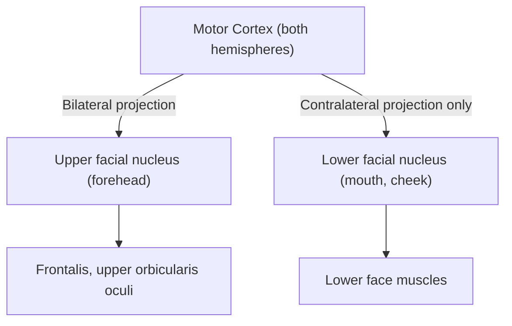

## 1. Definition

**Facial nerve palsy** (FNP) — also called "facial paralysis" — is weakness or complete paralysis of the muscles innervated by **cranial nerve VII (CN VII, the facial nerve)**. The name itself is descriptive: "facial" = face, "nerve" = CN VII, "palsy" = weakness/paralysis. It can be **upper motor neuron (UMN)** or **lower motor neuron (LMN)** in origin, and the distinction between the two is one of the most important clinical exercises in neurology and ENT [1][2].

> About **half of all cases** of facial palsy are diagnosed as **Bell's palsy** — an acute, idiopathic, peripheral (LMN) facial nerve palsy [2]. The other half are secondary to identifiable causes (tumour, infection, trauma, etc.), so the clinical priority is always to **rule out a sinister cause before labelling someone as Bell's palsy**.

---

## 2. Epidemiology

| Parameter | Detail |
|---|---|
| Overall incidence | ~20–30 per 100,000 per year (most studies) |
| Bell's palsy incidence | ~15–30 per 100,000 per year — the **single commonest cause** of facial palsy [1] |
| Age | Can occur at any age; peak 15–45 years |
| Sex | Slight female predominance; increased risk in pregnancy (especially third trimester, thought related to fluid retention compressing the nerve in its bony canal) |
| Laterality | Unilateral in the vast majority; **bilateral facial palsy** is uncommon and should immediately prompt consideration of **Guillain-Barré syndrome**, sarcoidosis, Lyme disease, or bilateral skull-base pathology [2] |
| Recurrence (Bell's) | ~7–12% lifetime recurrence |
| Prognosis (Bell's) | ***> 90% good recovery*** [1] |

### Risk Factors

- **Diabetes mellitus** — thought to predispose to microvascular ischaemia of the vasa nervorum
- **Pregnancy** — especially third trimester/immediate postpartum (fluid retention → nerve oedema within the rigid bony facial canal)
- **Hypertension** — microvascular disease
- **Upper respiratory tract infection** — may trigger viral reactivation (HSV-1)
- **Immunosuppression** — increased risk of herpes zoster reactivation (Ramsay Hunt syndrome)
- **Family history** — occasional familial Bell's palsy (? anatomically narrower facial canal)

---

## 3. Anatomy and Function of CN VII

Understanding the anatomy is **the** key to localising the lesion and predicting clinical features. The facial nerve has one of the most complex courses of any cranial nerve.

### 3.1 Overview

***The facial nerve has a very complex course and an intimate relationship to the middle ear and parotid gland. It travels in a bony canal for a long distance.*** [1]

The nerve is a **mixed nerve** containing [2]:
- **Motor (branchial efferent)** — muscles of facial expression, stapedius, stylohyoid, posterior belly of digastric
- **Sensory (special afferent)** — taste from anterior 2/3 of tongue (via chorda tympani → lingual nerve)
- **Parasympathetic (general visceral efferent)** — secretomotor to submandibular gland, sublingual gland (via chorda tympani → submandibular ganglion) and lacrimal gland + palatine glands (via greater petrosal nerve → pterygopalatine ganglion)
- **General somatic afferent** — small cutaneous sensory area around the ear (Ramsay Hunt zone / Hitselberger sign area)

### 3.2 Course of CN VII — ***Divided into 3 parts*** [1]

***The course is divided into: pre-temporal bone, intra-temporal bone, and post-temporal bone.*** [1]

#### A. Pre-temporal bone

| Segment | Course |
|---|---|
| Brainstem | Motor nucleus lies in the **caudal pons**. Fibres loop around the **abducens (CN VI) nucleus** (the "internal genu") before exiting. This is why a pontine lesion can give combined CN VI + CN VII palsy (e.g. Millard-Gubler syndrome). |
| Cerebellopontine angle (CPA) | ***CN VII arises at the junction between pons and medulla oblongata → courses laterally through the CPA*** [2], in close company with **CN VIII (vestibulocochlear)** and the **nervus intermedius** (sensory + parasympathetic root of VII). |
| Internal acoustic meatus (IAM) | ***Enters the temporal bone via the IAM accompanied by CN VIII*** [2]. Here it lies in the **anterosuperior** compartment. This is the site compressed by **acoustic neuromas** (vestibular schwannomas) and meningiomas. |

#### B. Intra-temporal bone (within the **facial canal**)

This is the longest bony canal that any nerve traverses in the body — about **30 mm** — and is the segment most vulnerable to compression from oedema (Bell's palsy) or fracture.

| Segment | Description | Key branches given off |
|---|---|---|
| **Labyrinthine segment** | From fundus of IAM to geniculate ganglion. **Narrowest part** of the facial canal (~0.68 mm). Most common site of compression in Bell's palsy. | — |
| **Geniculate ganglion** | Sharp bend (external genu) where the nerve turns posteriorly. Cell bodies for taste and somatic sensation. | ***Greater petrosal nerve*** → enters foramen lacerum → pterygopalatine ganglion → **lacrimal gland, palatine glands** [2] |
| **Tympanic segment** | Runs along the **medial wall of the middle ear** (above the oval window, below the lateral semicircular canal). Can be dehiscent in ~50% of individuals, making it vulnerable in middle ear surgery or infection. | — |
| **Mastoid (vertical) segment** | Descends in the posterior wall of the middle ear cavity toward the stylomastoid foramen. | ***Nerve to stapedius*** → stapedius muscle (dampens sound) [2]; ***Chorda tympani*** → crosses middle ear → exits through petrotympanic fissure → joins lingual nerve → taste anterior 2/3 tongue + secretomotor to submandibular & sublingual glands [2] |

<Callout title="Clinical Pearl: Localisation by Branch">
If the lesion is **proximal to the geniculate ganglion** → loss of lacrimation (greater petrosal nerve), taste, salivation, hyperacusis, AND motor function.

If the lesion is **between the geniculate ganglion and the departure of the nerve to stapedius** → taste loss, hyperacusis, motor weakness, BUT lacrimation preserved.

If the lesion is **between the nerve to stapedius and chorda tympani** → taste loss, motor weakness, BUT no hyperacusis, lacrimation normal.

If the lesion is **beyond the stylomastoid foramen** → ***only facial movements affected, normal stapedial reflex*** [1]. Taste and lacrimation are both normal.
</Callout>

#### C. Post-temporal bone

***The nerve emerges from the stylomastoid foramen*** [1][2] and gives:
- **Posterior auricular nerve** — supplies occipitalis and posterior auricular muscle
- **Branches to stylohyoid and posterior belly of digastric**

It then ***pierces the parotid gland*** [1] — does NOT innervate the parotid (that's CN IX via lesser petrosal nerve → otic ganglion → auriculotemporal nerve) — and divides into ***5 terminal branches*** [1]:

| Branch | Muscles supplied | Clinical test |
|---|---|---|
| ***Temporal (frontal)*** | Frontalis, upper orbicularis oculi, corrugator supercilii | "Raise your eyebrows" |
| ***Zygomatic*** | Lower orbicularis oculi | "Close your eyes tightly" |
| ***Buccal*** | Buccinator, zygomaticus major/minor, levator labii superioris, nasalis, orbicularis oris (upper) | "Puff out your cheeks", "Show your teeth" |
| ***Marginal mandibular*** | Depressor anguli oris, depressor labii inferioris, mentalis | "Show your bottom teeth" |
| ***Cervical*** | Platysma | "Tense your neck" |

> **Mnemonic for the 5 branches:** ***T***o ***Z***anzibar ***B***y ***M***otor ***C***ar (Temporal, Zygomatic, Buccal, Marginal mandibular, Cervical) — tracing from superior to inferior.

<Callout title="High Yield" type="idea">
The **marginal mandibular branch** is the most surgically important branch because (a) it runs superficially near the angle of the mandible and is at risk during neck dissection, submandibular gland excision, or parotidectomy; and (b) it has the fewest anastomoses with other branches, so damage is least likely to recover.
</Callout>

---

## 4. Aetiology

The approach to aetiology is anatomical — trace the course of CN VII from the brain to the face and list causes at each level. This is exactly how the lecture organises it [1].

### 4.1 Classification by Location

#### **I. Intracerebral (Supranuclear / UMN Lesion)** [1]

| Cause | Notes |
|---|---|
| ***CVA (stroke)*** | ***Commonest cause of UMN facial palsy*** [1]. Upper face (frontalis) is **spared** because the upper facial nucleus receives **bilateral** cortical input. |
| Tumour | Cerebral metastases, glioma, etc. |
| Demyelinating disease | Multiple sclerosis |
| Vascular malformations | AVMs, aneurysms |

#### **II. Facial Nucleus / Pons (LMN)** [1]

| Cause | Notes |
|---|---|
| Brainstem stroke | Lateral pontine stroke → may combine with CN VI palsy (Millard-Gubler) |
| ***Tumour, demyelinating disease*** [1] | Pontine glioma, MS plaques |
| Syringobulbia | Extension of syrinx into the medulla/pons |

#### **III. CPA / Internal Acoustic Meatus** [1]

| Cause | Notes |
|---|---|
| ***Acoustic neuroma (vestibular schwannoma)*** [1] | Most common CPA tumour. Compresses CN VII and CN VIII → gradual unilateral SNHL + facial weakness |
| ***Meningioma*** [1] | Second most common CPA lesion |

#### **IV. Temporal Bone** [1]

| Cause | Notes |
|---|---|
| ***Temporal bone fracture*** [1] | Transverse fractures (perpendicular to petrous ridge) → damage labyrinthine segment/geniculate ganglion. Longitudinal fractures can also damage the tympanic/mastoid segments. |
| ***Facial nerve schwannoma*** [1] | Primary tumour of the facial nerve itself. Can occur anywhere along its course. |

#### **V. Middle Ear** [1]

| Cause | Notes |
|---|---|
| ***Acute otitis media*** [1] | Infection may erode the thin bony canal (especially where dehiscent) and inflame the nerve |
| ***Chronic otitis media — cholesteatoma*** [1] | Erosion of bony facial canal by keratin squamous epithelium → direct compression/invasion |
| ***Herpes zoster oticus — Ramsay Hunt syndrome*** [1] | VZV reactivation in the geniculate ganglion. Classic triad: **ipsilateral facial paralysis + otalgia + vesicles in the auditory canal/auricle** [2]. Poorer prognosis than Bell's palsy. |
| ***Tumour in middle ear — glomus tumour, carcinoma*** [1] | Glomus tympanicum/jugulare can invade facial canal |
| ***Bell's palsy*** [1] | ***Nerve swollen in the facial nerve canal causing neuropraxia*** [1] — see detailed section below |

#### **VI. Beyond Stylomastoid Foramen** [1]

| Cause | Notes |
|---|---|
| ***Facial trauma — blunt or penetrating*** [1] | ***May only affect a single branch*** [1] — e.g. isolated marginal mandibular branch injury from a knife wound |
| ***Malignant tumour in parotid gland*** [1] | Facial nerve runs through the parotid. Malignant parotid tumours (e.g. mucoepidermoid carcinoma, adenoid cystic carcinoma) can invade the nerve. A parotid mass with facial weakness = **malignant until proven otherwise** |
| ***Metastatic intraparotid lymph node*** [1] | E.g. cutaneous SCC of scalp/ear metastatic to parotid nodes |
| ***Surgical injury — common*** [1] | Parotidectomy, mastoidectomy, otological surgery |

### 4.2 Other Systemic / Bilateral Causes [2]

| Cause | Key features |
|---|---|
| **Guillain-Barré syndrome** | Bilateral facial palsy in > 50% of GBS; ascending weakness, areflexia, albuminocytologic dissociation in CSF |
| **Sarcoidosis** | Heerfordt syndrome (uveoparotid fever): bilateral parotid enlargement, uveitis, facial palsy, fever. ACE ↑, non-caseating granulomas on biopsy |
| **Lyme disease** | Tick-borne *Borrelia* spirochaete. Facial palsy is the most common cranial neuropathy. Can be bilateral. Erythema migrans + arthralgia. (Less relevant in Hong Kong but important for differential) |

### 4.3 Bell's Palsy — The Most Common Cause

***Bell's palsy is an idiopathic facial nerve palsy and the commonest cause of facial nerve palsy.*** [1]

Key points:
- ***? Herpes reactivation neuritis*** [1] — HSV-1 reactivation is the most likely aetiology; labelled "idiopathic" because there is **no established clinical method to confirm HSV** in routine practice [2]
- Pathophysiology: viral reactivation → inflammation and oedema of the nerve within the rigid **labyrinthine segment** (narrowest part of the facial canal) → compression → ***neuropraxia*** (conduction block without axonal disruption in mild cases; axonotmesis in severe cases) [1]
- ***Nerve swollen in the facial nerve canal causing neuropraxia*** [1]
- ***> 90% good recovery*** [1]

---

## 5. Pathophysiology

### 5.1 Why the Facial Canal Matters

The facial nerve travels through a **rigid bony canal** in the temporal bone for ~30 mm. The **labyrinthine segment** is the narrowest (~0.68 mm diameter). Any process causing nerve oedema (inflammation, viral reactivation, vascular congestion) within this non-expansile tube leads to a compartment-syndrome-like situation:

> Oedema → compression of nerve against bone → ischaemia of vasa nervorum → further oedema → more compression (vicious cycle) → conduction block (**neuropraxia**) or, if severe, axonal degeneration (**axonotmesis/neurotmesis**).

This explains:
- Why Bell's palsy recovers well (most are neuropraxia → remyelination within weeks)
- Why temporal bone fractures can cause immediate or delayed palsy (direct axonal injury vs. post-traumatic oedema)
- Why cholesteatoma/tumour causes slowly progressive palsy (gradual erosion + compression)

### 5.2 UMN vs LMN — The Forehead Paradox

This is one of the **most tested** concepts in clinical medicine.

- The **upper face** (frontalis, upper orbicularis oculi) receives corticobulbar input from **both** hemispheres → a unilateral UMN lesion (e.g. stroke) leaves upper face relatively spared because the intact contralateral hemisphere compensates.
- The **lower face** receives corticobulbar input from the **contralateral** hemisphere only → a UMN lesion causes contralateral lower face weakness.
- A **LMN lesion** (anywhere from the facial nucleus onwards) affects **all ipsilateral** facial muscles — both upper and lower face — because the final common pathway is destroyed.

***UMN lesion → frontalis spared (bilateral innervation)*** [1]

<Callout title="Important Exception" type="error">
A **partial lesion at the pes anserinus** (the point of bifurcation of the facial nerve between the deep and superficial lobes of the parotid) may spare the temporal branch → mimicking UMN palsy. Always correlate with other UMN signs (hyperreflexia, Babinski, spasticity) or look for a parotid mass [2].

Conversely, a **brainstem lesion** affecting the facial nucleus or fascicles will produce an LMN pattern (all facial muscles affected) despite being a "central" lesion — because the damage is at the LMN level [2].
</Callout>

### 5.3 Localisation by Associated Features

***The location of the lesion determines which functions are lost*** [1]:

| Lesion site | Motor | Taste (anterior 2/3) | Lacrimation | Stapedial reflex / Hyperacusis | Salivation |
|---|---|---|---|---|---|
| ***Proximal to geniculate ganglion*** | ✗ All ipsilateral | ✗ Lost | ***✗ Decreased*** [1] | ✗ Absent / Hyperacusis present | ✗ Decreased |
| ***Between geniculate ganglion and stylomastoid foramen*** | ✗ All ipsilateral | ***✗ Affected*** [1] | ***✓ Normal*** [1] | ***✗ Hyperacusis present, stapedial reflex affected*** [1] | ✗ Decreased (if proximal to chorda tympani takeoff) |
| ***Beyond stylomastoid foramen*** | ✗ All ipsilateral (or single branch if distal) | ***✓ Normal*** | ***✓ Normal*** | ***✓ Normal stapedial reflex*** [1] | ✓ Normal |

Why each feature:
- **Lacrimation lost** = greater petrosal nerve (parasympathetic to lacrimal gland) is damaged → lesion proximal to geniculate ganglion
- **Hyperacusis** = nerve to stapedius damaged → stapedius cannot dampen ossicular vibration → sounds perceived as abnormally loud. Lesion proximal to departure of nerve to stapedius (mastoid segment)
- **Taste lost (anterior 2/3)** = chorda tympani damaged → lesion proximal to chorda tympani departure (middle of mastoid segment)
- **Only motor** = lesion beyond stylomastoid foramen (all sensory and parasympathetic branches have already departed)

---

## 6. Classification

### 6.1 By Type of Neuron

| Type | Upper Motor Neuron (UMN) | Lower Motor Neuron (LMN) |
|---|---|---|
| Lesion site | Cortex → facial nucleus | Facial nucleus → face |
| Forehead | **Spared** | **Involved** |
| Lower face | Contralateral weakness | Ipsilateral weakness |
| Associated signs | Hyperreflexia, spasticity, Babinski | Hyporeflexia, atrophy, fasciculations |
| Common causes | Stroke, tumour, MS | Bell's palsy, Ramsay Hunt, CPA tumour, trauma |

### 6.2 By Onset

| Onset | Causes |
|---|---|
| **Acute** (hours–days) | Bell's palsy, Ramsay Hunt, stroke, trauma |
| **Subacute** (days–weeks) | Otitis media, Lyme, GBS |
| **Chronic/Progressive** (weeks–months) | Tumour (parotid, CPA, cholesteatoma, facial nerve schwannoma) — **any progressive facial palsy must be investigated for malignancy** |

### 6.3 House-Brackmann Grading System [2]

This is the **standard clinical grading** of facial nerve function:

| Grade | Description | Gross | At rest | Motion |
|---|---|---|---|---|
| **I** | Normal | Normal function in all areas | Normal symmetry | Normal |
| **II** | Mild dysfunction | Slight weakness noticeable on close inspection | Normal symmetry and tone | Forehead: moderate-good; Eye: complete closure with effort; Mouth: slight asymmetry |
| **III** | Moderate dysfunction | Obvious but not disfiguring difference; synkinesis may be present | Normal symmetry and tone | Forehead: slight-moderate; Eye: complete closure with effort; Mouth: slightly weak with maximum effort |
| **IV** | Moderately severe | Obvious weakness and/or disfiguring asymmetry | Normal symmetry and tone | Forehead: none; Eye: incomplete closure; Mouth: asymmetric with maximum effort |
| **V** | Severe dysfunction | Only barely perceptible motion | Asymmetry | Forehead: none; Eye: incomplete closure; Mouth: slight movement |
| **VI** | ***Total paralysis*** [2] | ***NO movement*** | Asymmetry | None |

---

## 7. Clinical Features

### 7.1 Symptoms

| Symptom | Pathophysiological Basis |
|---|---|
| **Facial weakness / asymmetry** | Loss of motor innervation to ipsilateral facial muscles. The patient notices difficulty smiling, eating (food collects in the buccal sulcus), drinking (fluid dribbles from the corner of the mouth), or closing the eye. |
| **Inability to close the eye** | Weakness of orbicularis oculi → failure of lid closure → exposure keratitis risk. The eye may water paradoxically (reflex tearing from corneal exposure, despite reduced basal lacrimation in proximal lesions). |
| **Drooping of the mouth** | Weakness of the lower facial muscles (orbicularis oris, depressor anguli oris) → the mouth is pulled to the **opposite** (normal) side due to unopposed contraction. |
| **Drooling** | Loss of orbicularis oris tone → incompetent oral sphincter → saliva leaks from the affected side. |
| **Difficulty speaking / pronouncing labials** | Orbicularis oris and buccinator weakness → difficulty with bilabial consonants (b, p, m) and plosives. |
| ***Dry eye*** | Lesion proximal to geniculate ganglion → loss of greater petrosal nerve → reduced parasympathetic stimulation of lacrimal gland → ***decreased tearing*** [2] |
| ***Dry mouth*** | Loss of chorda tympani → reduced parasympathetic stimulation of submandibular and sublingual glands → ***decreased salivary secretion*** [2] |
| ***Hyperacusis*** [2] | Loss of nerve to stapedius → stapedius muscle paralysis → cannot dampen oscillation of stapes → sounds perceived as painfully loud on ipsilateral side |
| ***Loss of taste on anterior 2/3 of tongue*** [2] | Loss of chorda tympani → loss of special sensory (gustatory) fibres from fungiform papillae on the anterior tongue |
| **Ear pain (otalgia)** | Common in Bell's palsy and especially prominent in **Ramsay Hunt syndrome** (VZV geniculate ganglionitis → severe deep ear pain). Also occurs because CN VII has a small somatic sensory territory around the ear. |
| **Post-auricular pain** | Thought to be related to inflammation around the stylomastoid foramen — present in ~50% of Bell's palsy patients |
| **Numbness around the ear** | Involvement of the small somatic sensory component of CN VII (Hitselberger sign in acoustic neuroma) |

### 7.2 Signs

***Clinical assessment: usually test motor function only. Test all 5 branches in a systematic manner. Examine other CNs. Examine the external ear and middle ear. Palpate the parotids and the neck.*** [1]

| Sign | How to elicit | Pathophysiological Basis |
|---|---|---|
| **Eyebrow sagging / loss of forehead wrinkles** | "Raise your eyebrows" (tests frontalis → temporal branch) | Loss of temporal branch innervation. **If preserved** → UMN lesion (bilateral cortical input to upper face nucleus). **If lost** → LMN lesion. |
| **Inability to close eye / incomplete eye closure** | "Close your eyes tightly; I'll try to open them" (tests orbicularis oculi → zygomatic branch) | Loss of zygomatic branch → orbicularis oculi weakness. Graded by whether examiner can overcome closure. |
| **Bell's phenomenon** | When patient attempts to close the eye, the eyeball **rolls upward and outward**, exposing the sclera. This is a normal synkinetic reflex, but it becomes **visible** only when orbicularis oculi is too weak to close the lid. | Normal brainstem reflex (superior rectus + inferior oblique co-contraction during lid closure) that is masked by normal lid closure but unmasked by facial weakness. Protective mechanism — cornea rotates away from exposure. |
| **Disappearance of nasolabial fold** | Observe at rest and during smiling | Loss of tone in zygomaticus, levator labii superioris, orbicularis oris → the fold on the affected side is flattened |
| **Drooping of corner of mouth** | "Show me your teeth" / "Smile widely" (tests buccal, marginal mandibular branches) | Lower facial muscle weakness → mouth deviates **towards the normal side** on smiling (normal side pulls) |
| **Unable to puff cheeks / whistle** | "Puff out your cheeks" (tests buccinator → buccal branch) | Buccinator weakness → air escapes from the affected side |
| **Platysma weakness** | "Tense your neck" (tests cervical branch) | Cervical branch weakness |
| **Vesicles on ear / auditory canal** | Inspect the pinna and EAC with an otoscope | Pathognomonic for **Ramsay Hunt syndrome** — VZV reactivation in the geniculate ganglion with cutaneous eruption in CN VII dermatome |
| **Parotid mass** | Palpate both parotid glands and neck | A parotid mass with associated facial weakness = **malignant parotid tumour until proven otherwise** |
| **Other CN deficits** (especially CN V, VI, VIII) | Full cranial nerve examination | CPA lesions compress multiple nerves (V → facial numbness, VI → diplopia, VIII → hearing loss, tinnitus, vertigo). Pontine lesions → CN VI palsy. |
| **Ear examination: middle ear pathology** | Otoscopy | Cholesteatoma (retraction pocket with squamous debris), acute otitis media (bulging red TM), or glomus tumour (pulsatile red mass behind TM) |

<Callout title="Bell's Phenomenon vs Bell's Palsy" type="error">
Don't confuse these! **Bell's phenomenon** is the upward rolling of the eye on attempted eye closure — it is a **normal** reflex present in ~75% of the population, but only visible when orbicularis oculi is weak. **Bell's palsy** is the idiopathic LMN facial palsy. They are named after the same Sir Charles Bell but are different concepts.
</Callout>

### 7.3 Clinical Course (Bell's Palsy)

***Acute onset over 1–2 days → progressive course reaching maximal clinical weakness within 3 weeks → recovery of some degree of function within 6 months*** [2].

- If weakness is **still progressing after 3 weeks**, reconsider the diagnosis — may be a tumour
- Incomplete palsy (House-Brackmann II–IV) → > 95% full recovery
- Complete palsy (House-Brackmann VI) → ~60–70% achieve satisfactory recovery; 30% may have residual synkinesis or weakness
- ***> 90% good recovery*** [1]

### 7.4 Late Sequelae (from aberrant regeneration / synkinesis)

If axonal degeneration occurs and regeneration is aberrant:
- **Synkinesis** — involuntary movement of one facial muscle group when another is activated (e.g. mouth twitches when closing eye) → misdirected axonal regrowth
- **Crocodile tears** (gustatory lacrimation) — tearing while eating → regenerating fibres originally destined for the submandibular gland reach the lacrimal gland instead (via greater petrosal nerve pathway)
- **Contracture** — chronic increased tone in facial muscles

---

## 8. Special Considerations for Hong Kong Practice

- **Nasopharyngeal carcinoma (NPC)** is endemic in Southern China/Hong Kong. Skull base extension or perineural spread of NPC can involve CN VII (and commonly CN V, VI). Always check post-nasal space in any unexplained cranial neuropathy in a Hong Kong patient.
- **Ramsay Hunt syndrome** is not uncommon — always inspect the ear for vesicles in any patient presenting with facial palsy + severe ear pain.
- **Parotid malignancy** — any parotid mass + facial weakness = high suspicion for malignancy. In Hong Kong, mucoepidermoid carcinoma and adenoid cystic carcinoma are the most important differentials.

---

<Callout title="High Yield Summary">

1. **Facial nerve (CN VII)** is a mixed nerve (motor, sensory/taste, parasympathetic, somatic sensory) with a very complex course through the temporal bone.
2. **LMN palsy** → entire ipsilateral face weak (forehead included). **UMN palsy** → forehead spared (bilateral cortical innervation to upper face nucleus).
3. **Bell's palsy** is the commonest cause (~50%), is idiopathic (? HSV reactivation), and > 90% recover well. It is a **diagnosis of exclusion**.
4. **Localise the lesion** using associated features: lacrimation (greater petrosal nerve), stapedial reflex/hyperacusis (nerve to stapedius), taste (chorda tympani).
5. **Red flags** requiring urgent investigation: progressive palsy > 3 weeks, bilateral palsy, associated CN deficits, parotid mass, history of malignancy, no recovery by 6 weeks.
6. **Ramsay Hunt syndrome** = VZV reactivation in geniculate ganglion → triad of facial palsy + otalgia + vesicles in ear.
7. **House-Brackmann scale** grades I (normal) to VI (total paralysis).
8. **Management of Bell's palsy**: prednisolone 1mg/kg/day for 5 days then taper + acyclovir/famciclovir for 5 days + eye protection + facial physiotherapy. Reconsider diagnosis if no improvement after 6 weeks.

</Callout>

---

<ActiveRecallQuiz
  title="Active Recall - Facial Nerve Palsy"
  items={[
    {
      question: "A patient presents with right-sided facial weakness sparing the forehead. Where is the lesion and what is the most common cause?",
      markscheme: "Upper motor neuron lesion (supranuclear) on the LEFT side. Most common cause is CVA (stroke). Forehead spared due to bilateral cortical innervation of the upper facial nucleus."
    },
    {
      question: "Name the 5 terminal branches of the facial nerve after it exits the stylomastoid foramen, from superior to inferior.",
      markscheme: "Temporal, Zygomatic, Buccal, Marginal mandibular, Cervical. Mnemonic: To Zanzibar By Motor Car."
    },
    {
      question: "A patient with facial palsy has hyperacusis but normal lacrimation. Where is the lesion?",
      markscheme: "Between the geniculate ganglion and the stylomastoid foramen, specifically proximal to the nerve to stapedius but distal to the greater petrosal nerve. Hyperacusis indicates nerve to stapedius involvement. Normal lacrimation means greater petrosal nerve is intact, so lesion is distal to geniculate ganglion."
    },
    {
      question: "What is the triad of Ramsay Hunt syndrome and what virus causes it?",
      markscheme: "Triad: (1) ipsilateral facial nerve paralysis, (2) otalgia, (3) vesicles in the auditory canal and/or auricle. Caused by varicella-zoster virus (VZV) reactivation in the geniculate ganglion."
    },
    {
      question: "Outline the management of Bell's palsy as per current guidelines.",
      markscheme: "Prednisolone 1mg/kg/day for 5 days then taper. Acyclovir or famciclovir for 5 days (vesicles may not show up in first 2 days). Eye protection with lubricating drops and taping at night. Facial nerve physiotherapy. Reconsider diagnosis if no improvement after 6 weeks."
    },
    {
      question: "Why is the labyrinthine segment of the facial canal the most vulnerable site in Bell's palsy?",
      markscheme: "It is the narrowest part of the bony facial canal (approximately 0.68 mm diameter). Oedema from viral inflammation within this rigid non-expansile canal causes a compartment-syndrome-like effect: compression of the nerve against bone, ischaemia of vasa nervorum, further oedema, and a vicious cycle leading to neuropraxia or axonotmesis."
    }
  ]}
/>

---

## References

[1] Lecture slides: GC 217. Facial nerve palsy and salivary gland diseases.pdf (p1–p9, p17, p19, p81)
[2] Senior notes: felixlai.md (sections on Facial nerve palsy, pp. 206–212, 220)
