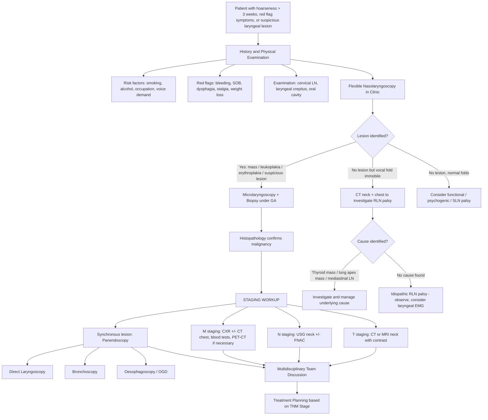
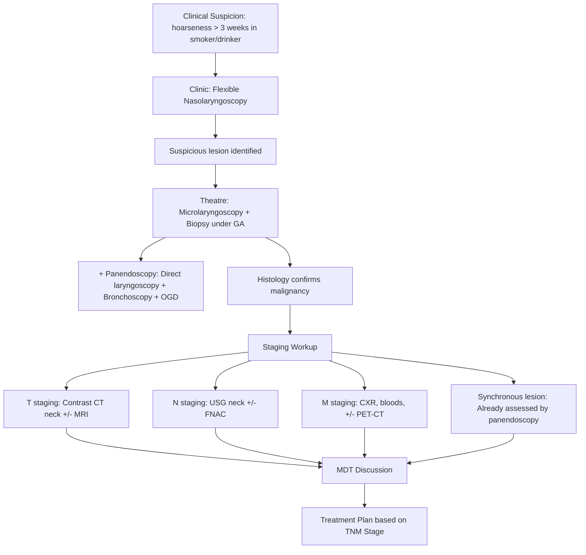

## Diagnosis of Laryngeal Carcinoma

### Overview — The Diagnostic Objectives

When we approach the diagnosis of laryngeal carcinoma, we have **three simultaneous objectives**, as outlined in the lecture slides [9]:

> ***Principle of investigation in H&N cancers*** [9]:
> 1. **Determine tumour staging** — ***T = Local tumour stage (Endoscopy, CT/MRI); N = Regional lymph node (USG neck + FNA); M = Distant metastasis (CXR, Blood test, PET)*** [9]
> 2. **Detect synchronous lesion** — ***Risk of synchronous cancer: 8–10% due to field change effect from carcinogen exposure → Panendoscopy (bronchoscopy + oesophagoscopy)*** [9]

There is no single "diagnostic criterion" like the Jones criteria for rheumatic fever. Instead, the diagnosis of laryngeal carcinoma is confirmed by **histopathological examination of biopsied tissue**. Everything else — history, examination, endoscopy, imaging — serves to (a) raise clinical suspicion, (b) obtain tissue, and (c) stage the disease.

---

### 1. Diagnostic Criteria

Laryngeal carcinoma is fundamentally a **histopathological diagnosis**. The diagnostic "criteria" are:

| Step | Requirement |
|---|---|
| **1. Clinical suspicion** | Hoarseness > 3 weeks in a smoker/drinker; red flag symptoms (bleeding, dyspnoea, dysphagia); visible lesion on laryngoscopy |
| **2. Tissue diagnosis** | ***Biopsy to obtain histological diagnosis*** [1] — this is the gold standard and definitive step |
| **3. Staging** | TNM staging via endoscopy + imaging (CT/MRI) + nodal assessment (USG ± FNA) + distant metastasis workup (CXR/CT chest, PET-CT) |

<Callout title="No Biopsy = No Diagnosis" type="error">
You cannot diagnose laryngeal carcinoma on clinical or radiological grounds alone. ***Biopsy!!!*** [5] — a tissue specimen showing invasive squamous cell carcinoma (or other malignant histology) with breach of the basement membrane is the definitive diagnostic criterion. Imaging and endoscopy guide you to the lesion and stage it, but the pathologist makes the diagnosis.
</Callout>

#### What the Pathologist Reports

The biopsy specimen (usually obtained via microlaryngoscopy) is assessed for:

1. **Histological type**: SCC (conventional, verrucous, basaloid, spindle cell), adenocarcinoma, neuroendocrine, etc.
2. **Grade of differentiation**: Well / moderately / poorly differentiated SCC
3. **Depth of invasion**: Superficial (carcinoma in situ / microinvasive) vs deeply invasive
4. **Margins**: If excisional biopsy — clear vs involved
5. **Lymphovascular invasion (LVI)** and **perineural invasion (PNI)**: Adverse prognostic features
6. **p16 immunohistochemistry** (surrogate marker for HPV): Particularly relevant for oropharyngeal SCC; less established for laryngeal SCC but increasingly reported

---

### 2. Diagnostic Algorithm

The following algorithm integrates the clinical approach from both lecture slides [1][9][10] and senior notes [2]:

---

### 3. Investigation Modalities — Detailed Breakdown

Let me walk through each investigation, explaining **why** we do it, **what** we look for, and **how to interpret** the findings.

#### 3.1 History and Physical Examination

Before any investigation, a thorough history and examination directs the workup.

**History** — from lecture slides [1][4]:
- ***Smoking*** [1][3] — quantify in pack-years; the single most important risk factor
- ***Occupation, voice demand*** [1] — professional voice users (teachers, singers) are more likely to have benign voice pathology; but smoking history overrides this
- ***Details of hoarseness*** [1]:
  - ***Acute vs chronic*** [1] — acute suggests infection; chronic ( > 3 weeks) demands investigation
  - ***Progression*** [1] — progressive worsening suggests growing malignancy
  - ***Persistent (organic lesion) vs fluctuating (functional)*** [1] — this is a critical distinction. A carcinoma causes **persistent** hoarseness that does not improve day-to-day. Functional dysphonia fluctuates
- ***Associated "red flag" symptoms for malignancy*** [1]:
  - ***Bleeding*** [1]
  - ***Shortness of breath*** [1]
  - ***Dysphagia*** [1]
- ***Sore throat, globus → dysphagia, otalgia*** [4] — classic progression for pharyngolaryngeal malignancy
- ***Risk factors: alcohol, smoking*** [4]
- Alcohol consumption (units/week) — synergistic with smoking

**Physical Examination** [2][4]:
- **Cervical lymphadenopathy** [2]: Systematic palpation of all cervical lymph node levels (I–VI). Note size, consistency (hard = malignancy), fixation, tenderness
- ***30% LN metastases*** [4] — a significant proportion present with palpable nodes (especially supraglottic and hypopharyngeal tumours)
- ***Loss of laryngeal crepitus*** [4] — gently rock the larynx against the vertebral column. Loss of the normal side-to-side grating sensation suggests a tumour mass interposed between the larynx and the prevertebral fascia (postcricoid/hypopharyngeal tumour) or direct fixation
- ***Paterson-Brown-Kelly syndrome*** [4] — look for signs of iron deficiency anaemia (pallor, koilonychia, angular stomatitis, glossitis) in patients with postcricoid symptoms
- Oral cavity and oropharynx examination with tongue depressor and headlight
- General examination: cachexia, hepatomegaly, supraclavicular nodes (distant metastasis)

<Callout title="When to Refer Urgently" type="idea">
***EARLY REFERRAL to ENT Surgeons when suspecting malignancy*** [10]:
- ***Persistent 2–4 weeks after conservative/empirical treatment*** [10]
- ***Clinically suspicious: irregular, induration, > 2 cm, associated cervical LN enlargement*** [10]

This is a key take-home message from the lecture slides. Do not wait months to refer a hoarse smoker — 2–4 weeks of persistent symptoms is enough to trigger urgent ENT referral.
</Callout>

---

#### 3.2 ***Flexible Nasolaryngoscopy*** [1][2]

| Parameter | Detail |
|---|---|
| **What it is** | A thin, flexible fibreoptic scope passed through the nose to directly visualise the larynx. Can also use a rigid 70° or 90° laryngoscope transorally |
| **Setting** | Outpatient clinic; no general anaesthesia required |
| **Why we do it** | ***Flexible laryngoscopy to assess extent*** [1] — first-line investigation for any patient with hoarseness > 3 weeks; allows real-time assessment of vocal fold mobility, mucosal lesions, and airway |
| **What to look for** | See table below |

**Key findings on flexible laryngoscopy** [2]:

| Finding | Interpretation | Staging Implication |
|---|---|---|
| Discrete mass on one vocal fold | Likely glottic carcinoma (or polyp — needs biopsy) | T1a if limited to one fold, mobile |
| Mass involving both vocal folds | Bilateral glottic involvement | T1b if both mobile |
| Mass extending to supraglottis/subglottis | Transglottic tumour | At least T2 |
| **Impaired vocal fold mobility** | Tumour infiltration of vocalis muscle, paraglottic space, or cricoarytenoid joint beginning | T2 (impaired mobility) |
| **Fixed vocal fold (immobile)** | Full invasion of thyroarytenoid muscle, cricoarytenoid joint ankylosis, or RLN invasion | ***T3*** |
| Leukoplakia / erythroplakia | Premalignant or malignant — ***Biopsy!!!*** [5] | — |
| Pooling of saliva in pyriform sinus | Suggests hypopharyngeal/supraglottic obstruction | — |
| Epiglottic mass | Supraglottic carcinoma | T staging depends on extent |

**Key areas to note for tumour extension** [2]:
- ***Supraglottic tumour***: Vallecula / base of tongue / ventricle / arytenoid / anterior commissure [2]
- ***Glottic tumours***: False cord / arytenoid / anterior commissure / subglottic extension [2]

---

#### 3.3 ***Microlaryngoscopy + Biopsy (under General Anaesthesia)*** [1][5]

| Parameter | Detail |
|---|---|
| **What it is** | Direct laryngoscopy using a rigid laryngoscope with the patient under GA, combined with an operating microscope for magnified visualisation and tissue biopsy |
| **Why we do it** | ***Biopsy to obtain histological diagnosis*** [1] — the gold standard for definitive tissue diagnosis. Also allows detailed assessment of tumour extent that may not be possible with flexible scope alone |
| **What to look for** | Precise tumour extent (anterior commissure involvement, subglottic extension, arytenoid involvement); biopsy of the lesion for histopathology |
| **Interpretation** | Histology confirms SCC (or other malignancy) and provides grade of differentiation, presence of LVI/PNI |

> This is typically combined with **panendoscopy** (see below) in a single GA session — efficient use of theatre time.

---

#### 3.4 ***Panendoscopy (Direct Laryngoscopy + Bronchoscopy + OGD)*** [1][2][9][10]

| Parameter | Detail |
|---|---|
| **What it is** | A "triple endoscopy" performed under GA to examine the entire upper aerodigestive tract |
| **Components** | ***Direct laryngoscopy + Bronchoscopy + Oesophagoscopy (OGD)*** [2][9] |
| **Why we do it** | ***10% risk of synchronous/metachronous tumour (field cancerisation)*** [9][10]. The same carcinogens (tobacco + alcohol) affect the entire mucosal field |
| **What to look for** | Synchronous primary tumours in: bronchial tree (especially in laryngeal cancer patients — ***laryngeal cancer → second primary in lung*** [2]), oesophagus, or other pharyngeal subsites |
| **Interpretation** | Any suspicious lesion identified during panendoscopy is biopsied. A positive finding means the patient has two primary cancers requiring coordinated management |

<Callout title="Why Panendoscopy is Non-Negotiable">
***Staging examination is recommended at the initial evaluation of ALL patients with primary cancers of the upper aerodigestive tract*** [2]. Missing a synchronous primary can lead to inadequate treatment and worse survival. The 8–10% risk is too high to ignore.
</Callout>

---

#### 3.5 ***Ultrasound Neck ± Fine Needle Aspiration Cytology (FNAC)*** [1][9][10]

| Parameter | Detail |
|---|---|
| **What it is** | High-frequency ultrasound probe applied to the neck to assess cervical lymph nodes, followed by FNA of suspicious nodes under USG guidance |
| **Why we do it** | ***N staging: USG neck + FNA*** [9]; ***Ultrasound neck +/- FNAC*** [1][10] — the primary modality for assessing regional lymph node metastasis |
| **What to look for** | See table below |

**USG features of a suspicious (malignant) lymph node:**

| Feature | Benign (Reactive) Node | Malignant (Metastatic) Node |
|---|---|---|
| Shape | Oval (L:S ratio > 2) | Round (L:S ratio < 2) |
| Hilum | Preserved, echogenic | Absent or eccentric |
| Cortex | Thin, uniform | Thickened, eccentric, or replaced |
| Echogenicity | Hypoechoic, homogeneous | Heterogeneous, may have cystic/necrotic areas |
| Border | Well-defined, smooth | Irregular, may show extranodal extension |
| Vascularity | Hilar flow pattern | Peripheral or mixed flow pattern |
| Size | < 1 cm (generally) | > 1 cm; but size alone is unreliable |

**FNA interpretation:**
- **Positive for SCC**: Confirms nodal metastasis → at least N1 disease
- **Negative/non-diagnostic**: Does not exclude metastasis (false negative rate ~5–10%); may need repeat FNA or core needle biopsy
- ***FNA of a suspected LN in the setting of an established primary tumour may provide relevant information when clinical and imaging evaluation of neck LNs is equivocal and a positive or negative finding will change the treatment approach*** [2]

<Callout title="FNA vs Excisional Biopsy of Neck Nodes" type="error">
***Never do an excisional biopsy of a cervical lymph node suspected to be metastatic SCC as the first step*** — this can cause field contamination, disrupt tissue planes, and compromise subsequent neck dissection. Always use FNA first. Excisional biopsy is reserved for suspected lymphoma (where architecture is needed for subtyping) [2].
</Callout>

---

#### 3.6 ***Contrast CT Neck*** [1][2][9]

| Parameter | Detail |
|---|---|
| **What it is** | Computed tomography of the neck with intravenous contrast |
| **Why we do it** | ***Contrast CT neck to assess extent*** [1]; ***T staging: Local tumour stage (CT/MRI)*** [9]; evaluates local tumour invasion and nodal disease |
| **What to look for** | See table below |

**Key CT findings and their interpretation:**

| CT Finding | Interpretation | Staging Relevance |
|---|---|---|
| Enhancing mucosal mass | Primary tumour | Determines T stage based on extent |
| ***Pre-epiglottic space invasion*** | Fat stranding/obliteration in the pre-epiglottic space | ***T3 for supraglottic tumours*** [2] |
| ***Paraglottic space invasion*** | Fat stranding lateral to the ventricle/vocal fold | ***T3*** [2] |
| ***Cartilage erosion/invasion*** | Sclerosis, lysis, or frank destruction of thyroid/cricoid cartilage | ***Inner cortex = T3; through-and-through = T4a*** [2] |
| Extralaryngeal spread | Tumour extending beyond the laryngeal framework into strap muscles, thyroid gland, trachea, oesophagus | ***T4a*** |
| Prevertebral fascia involvement | Obliteration of the fat plane between larynx and prevertebral muscles | ***T4b (unresectable)*** |
| Carotid artery encasement | Tumour surrounding > 270° of the carotid artery circumference | ***T4b (unresectable)*** |
| Enlarged cervical lymph nodes | Size > 1 cm, central necrosis, heterogeneous enhancement, irregular border | N staging; central necrosis is highly specific for metastatic SCC |
| Contralateral nodes | Bilateral lymphadenopathy | N2c or higher |

**Why CT over MRI for initial assessment?**
- CT is faster, more widely available, cheaper, and better at detecting **cartilage invasion** (sclerosis and erosion patterns)
- CT also provides good assessment of airway patency (critical in patients with stridor)
- CT chest can be done in the same session for distant metastasis workup

---

#### 3.7 MRI Neck

| Parameter | Detail |
|---|---|
| **What it is** | Magnetic resonance imaging of the neck |
| **Why we do it** | ***Provides important staging information and is crucial for identifying cartilage erosion or invasion and extension into pre-epiglottic or paraglottic spaces*** [2]; ***MRI provides optimal visualisation of soft-tissue infiltration*** [2] |
| **When to use** | Complements CT; particularly useful for: (1) assessing soft-tissue extent (pre-epiglottic/paraglottic space invasion), (2) differentiating tumour from post-treatment fibrosis, (3) patients with contrast allergy or renal impairment (gadolinium vs iodinated contrast) |

**Key MRI sequences and findings:**

| Sequence | What It Shows |
|---|---|
| T1-weighted | Anatomical detail; tumour appears isointense to muscle; fat (pre-epiglottic, paraglottic) is bright — loss of bright signal = tumour invasion |
| T2-weighted | Tumour appears hyperintense (bright); good for delineating tumour extent from surrounding tissues |
| T1 post-gadolinium (with fat suppression) | Enhancing tumour within pre-epiglottic/paraglottic fat; helps define tumour margins |
| DWI (Diffusion-weighted imaging) | Restricted diffusion in malignant tissue (high cellularity) — useful for differentiating recurrent tumour from post-treatment changes |

**CT vs MRI — when to use which:**

| Feature | CT | MRI |
|---|---|---|
| Cartilage invasion | ✅ Superior (sclerosis, erosion) | Moderate |
| Pre-epiglottic/paraglottic space | Good | ✅ Superior (fat signal loss on T1) |
| Soft-tissue detail | Good | ✅ Superior |
| Nodal assessment | ✅ Good | ✅ Good |
| Speed | ✅ Fast (seconds) | Slow (20–40 min) |
| Motion artefact | Less affected | More affected (swallowing, breathing) |
| Post-treatment surveillance | Moderate | ✅ Superior (DWI for recurrence) |
| Availability | ✅ Widely available | Less available |

---

#### 3.8 ***Chest X-Ray (CXR)*** [9][10]

| Parameter | Detail |
|---|---|
| **What it is** | Plain radiograph of the chest |
| **Why we do it** | ***M staging: Distant metastasis (CXR, blood test, PET)*** [9]; ***CXR*** [10] — baseline screening for pulmonary metastasis and synchronous lung primary |
| **What to look for** | Pulmonary nodules (metastasis); hilar/mediastinal lymphadenopathy; lung mass (synchronous primary — remember field cancerisation: ***laryngeal cancer → second primary in lung*** [2]) |
| **Interpretation** | Any suspicious finding warrants CT chest for further characterisation |

---

#### 3.9 ***PET-CT*** [9][10]

| Parameter | Detail |
|---|---|
| **What it is** | 18F-FDG PET combined with CT; FDG (fluoro-deoxyglucose) is a glucose analogue taken up avidly by metabolically active (i.e., malignant) cells |
| **Why we do it** | ***PET scan if necessary*** [10]; ***M staging: Distant metastasis (PET)*** [9]; used for: (1) detecting distant metastasis, (2) identifying the unknown primary in patients presenting with cervical metastatic SCC of unknown primary, (3) assessing treatment response |
| **What to look for** | Focal areas of increased FDG uptake (SUVmax) in the larynx (primary), neck nodes (N staging), and distant sites (lung, liver, bone) |
| **When to use** | Not routine for all laryngeal carcinomas. Indicated for: advanced disease (stage III/IV), suspected distant metastasis, unknown primary, post-treatment surveillance with equivocal CT/MRI |
| **Limitations** | False positives: inflammation, infection, recent biopsy. False negatives: small tumours ( < 1 cm), low-grade tumours. Not good for brain metastasis (high background brain FDG uptake) |

---

#### 3.10 Blood Tests

| Test | Purpose |
|---|---|
| **Full blood count (FBC)** | Baseline; assess for anaemia (iron deficiency in Paterson-Brown-Kelly syndrome; anaemia of chronic disease in malignancy) |
| **Liver function tests (LFTs)** | Baseline hepatic function; elevated ALP/GGT may suggest liver metastasis; also relevant as many patients have alcohol-related liver disease |
| **Renal function (U&E, creatinine)** | Baseline before CT contrast; before chemotherapy (cisplatin is nephrotoxic) |
| **Calcium** | Hypercalcaemia of malignancy (PTHrP-mediated) in advanced disease |
| **Thyroid function tests (TFTs)** | If thyroid pathology suspected; also baseline before potential radiation to neck (which can cause hypothyroidism) |
| **Coagulation screen** | Pre-operative assessment |
| **Nutritional markers (albumin, pre-albumin)** | Assess nutritional status — many H&N cancer patients are malnourished |
| **EBV serology** | If nasopharyngeal carcinoma is in the differential (endemic in Hong Kong) [2] |
| **HPV/p16 testing** | Primarily for oropharyngeal SCC; increasingly performed on laryngeal specimens though clinical significance is less established |

---

#### 3.11 Stroboscopy (Video Laryngostroboscopy)

| Parameter | Detail |
|---|---|
| **What it is** | Laryngoscopy combined with a strobe light synchronised to the vocal fold vibration frequency, allowing visualisation of the mucosal wave in "slow motion" |
| **Why we do it** | Assesses mucosal wave propagation. In early glottic carcinoma, the mucosal wave is absent or reduced over the mass (tumour stiffens the vocal fold cover). Helps differentiate neoplastic from functional lesions |
| **Interpretation** | Absent mucosal wave over a discrete lesion = high suspicion for malignancy (tumour infiltrates the superficial lamina propria/Reinke's space). Normal mucosal wave over a lesion suggests a superficial/benign process |

---

### 4. Staging-Specific Investigations — Putting It All Together

| Staging Component | Investigation | What It Determines |
|---|---|---|
| ***T — Local tumour stage*** [9] | ***Endoscopy (flexible + microlaryngoscopy)*** [9] | Mucosal extent, vocal fold mobility, subsite involvement |
| | ***CT/MRI neck*** [9] | Deep invasion: pre-epiglottic space, paraglottic space, cartilage, extralaryngeal spread |
| ***N — Regional lymph nodes*** [9] | ***USG neck + FNA*** [9] | Size, morphology, and cytology of cervical nodes |
| | CT/MRI neck | Nodal size, necrosis, extranodal extension |
| ***M — Distant metastasis*** [9] | ***CXR*** [9][10] | Pulmonary metastasis/synchronous lung primary |
| | ***Blood tests*** [9] | LFTs (liver mets), calcium (hypercalcaemia) |
| | ***PET-CT*** [9][10] | Distant metastatic disease; unknown primary |
| **Synchronous primary** | ***Panendoscopy*** [9][10] | Synchronous tumour in bronchial tree, oesophagus, or other pharyngeal subsite |

---

### 5. Special Diagnostic Scenarios

#### 5.1 Patient Presenting with Cervical Lymph Node Metastasis (Unknown Primary)

Sometimes the first presentation is a **neck lump** (metastatic cervical LN) without an obvious primary tumour.

Approach:
1. ***USG-guided FNAC*** [10] — confirms SCC (or other histology)
2. Flexible nasolaryngoscopy — look for primary in larynx, pharynx
3. ***CT/MRI neck*** [9] — identify primary and assess nodes
4. ***PET-CT*** [9][10] — highly sensitive for identifying occult primary
5. ***Panendoscopy + directed biopsies*** [9] — bilateral tonsillectomy, base of tongue biopsies, nasopharyngeal biopsies
6. If still no primary found → classified as "carcinoma of unknown primary" (CUP) and managed accordingly

#### 5.2 Patient with Stridor (Airway Emergency)

- ***ALWAYS protect the airway*** [2]
- Secure airway first (awake fibreoptic intubation or emergency tracheostomy) before any diagnostic workup
- Do NOT attempt to pass a rigid laryngoscope in an awake patient with stridor — risk of complete obstruction
- Once airway is secured → proceed with staging investigations

#### 5.3 Differentiating Recurrence from Post-Treatment Changes

- MRI with DWI is superior to CT
- PET-CT useful — FDG uptake in recurrent tumour but not in fibrosis/scar
- EUA + biopsy remains definitive

---

### 6. Summary of Investigation Sequence

---

<Callout title="High Yield Summary — Diagnosis of Laryngeal Carcinoma">

1. **Diagnosis is histopathological** — ***Biopsy to obtain histological diagnosis*** [1] via ***microlaryngoscopy + biopsy*** [5] is the gold standard.

2. **First-line investigation**: ***Flexible laryngoscopy to assess extent*** [1] — done in clinic; assesses mucosal disease and vocal fold mobility.

3. **Staging workup** follows the TNM framework [9]:
   - ***T: Endoscopy + CT/MRI*** — assesses local tumour extent, cartilage invasion, pre-epiglottic/paraglottic space invasion [2]
   - ***N: USG neck + FNA*** — assesses regional lymph node metastasis [9]
   - ***M: CXR, blood tests, PET-CT if necessary*** [9][10]

4. **Synchronous tumour detection**: ***Panendoscopy (direct laryngoscopy + bronchoscopy + OGD)*** [2][9] — mandatory; ***8–10% risk of synchronous cancer*** [9].

5. **CT is superior for cartilage invasion**; **MRI is superior for soft-tissue extent** (pre-epiglottic/paraglottic spaces) and post-treatment surveillance.

6. **Urgent referral criteria**: ***Persistent 2–4 weeks after conservative treatment; clinically suspicious: irregular, induration, > 2 cm, associated cervical LN enlargement*** [10].

7. **USG features of malignant node**: Round shape, absent hilum, heterogeneous, central necrosis, peripheral vascularity. ***Never do excisional biopsy of suspected metastatic SCC node — use FNA first*** [2].

</Callout>

---

<ActiveRecallQuiz
  title="Active Recall - Diagnosis of Laryngeal Carcinoma"
  items={[
    {
      question: "What are the two main objectives of investigation in a patient with newly diagnosed laryngeal carcinoma?",
      markscheme: "1. Determine TNM tumour staging (T = endoscopy + CT/MRI; N = USG neck + FNA; M = CXR, bloods, PET-CT). 2. Detect synchronous lesions via panendoscopy (direct laryngoscopy + bronchoscopy + OGD) due to 8-10% risk from field cancerisation."
    },
    {
      question: "What investigation is the gold standard for definitive diagnosis of laryngeal carcinoma, and why can you not rely on imaging alone?",
      markscheme: "Microlaryngoscopy + biopsy under GA is the gold standard. Diagnosis requires histopathological confirmation of invasive SCC (or other malignancy) with basement membrane breach. Imaging cannot reliably distinguish benign from malignant lesions or determine histological type/grade."
    },
    {
      question: "On CT neck, what findings would indicate T3 vs T4a staging in laryngeal carcinoma?",
      markscheme: "T3: Vocal fold fixation, invasion of pre-epiglottic space, paraglottic space, or inner cortex of thyroid cartilage. T4a: Tumour invades through thyroid cartilage (through-and-through) or extends beyond the larynx into trachea, soft tissues of neck, strap muscles, thyroid gland, or oesophagus."
    },
    {
      question: "List the components of panendoscopy and explain why it is mandatory in laryngeal carcinoma.",
      markscheme: "Components: Direct laryngoscopy + bronchoscopy + oesophagoscopy (OGD). Mandatory because of field cancerisation — 8-10% risk of synchronous cancer. Patients with laryngeal cancer are particularly at risk for synchronous lung primary. Chronic carcinogen exposure affects the entire aerodigestive tract mucosa."
    },
    {
      question: "A patient presents with a hard, 3cm left level II cervical lymph node. USG shows a round, hypoechoic node with central necrosis and absent hilum. What is the most likely diagnosis, what USG features support malignancy, and what is the next investigation?",
      markscheme: "Most likely metastatic SCC in a cervical lymph node. Malignant USG features: round shape (L:S ratio less than 2), central necrosis, absent hilum, heterogeneous echotexture. Next step: USG-guided FNAC for cytology — NOT excisional biopsy (risk of field contamination and compromising future neck dissection)."
    },
    {
      question: "When should PET-CT be used in the workup of laryngeal carcinoma? Give three indications.",
      markscheme: "1. Advanced disease (stage III/IV) to detect distant metastasis. 2. Cervical metastatic SCC of unknown primary — to identify the occult primary. 3. Post-treatment surveillance with equivocal CT/MRI findings (differentiating recurrence from fibrosis). Also used when distant metastasis is suspected clinically."
    }
  ]}
/>

## References

[1] Lecture slides: GC 216. Dysphonia Laryngitis, voice abuse, tumour and laryngeal cancer.pdf (p7 — Salient history; p19 — Cancer of Larynx; p22 — Investigations)
[2] Senior notes: felixlai.md (sections on Laryngeal carcinoma diagnosis, Head and neck cancer overview, field cancerisation, TNM staging, oropharyngeal diagnosis)
[3] Lecture slides: GC 219. Infections and tumours in pharynx and oral cavity.pdf (p41 — Etiology)
[4] Lecture slides: GC 219. Infections and tumours in pharynx and oral cavity.pdf (p39 — History and Examination)
[5] Lecture slides: GC 216. Dysphonia Laryngitis, voice abuse, tumour and laryngeal cancer.pdf (p18 — Leukoplakia, erythroplakia — Biopsy!!!)
[9] Lecture slides: GC 216. Dysphonia Laryngitis, voice abuse, tumour and laryngeal cancer.pdf (p20 — Principle of investigation in HN cancers)
[10] Lecture slides: GC 219. Infections and tumours in pharynx and oral cavity.pdf (p42 — Workup and Investigation; p48 — Take Home Message)
