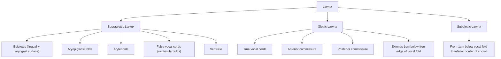

# Laryngeal Carcinoma

## 1. Definition

Laryngeal carcinoma ("larynx" = Greek for "upper windpipe"; "carcinoma" = Greek *karkinos* = crab, referring to a malignant epithelial tumour) is a primary malignant neoplasm arising from the mucosal lining of the larynx.

- ***Squamous cell carcinoma (SCC) is the MOST common malignancy of the larynx*** [1], accounting for approximately 95% of all laryngeal malignancies.
- Benign tumours of the larynx are extremely rare [2].
- The larynx is part of the upper aerodigestive tract, and laryngeal carcinoma is therefore a subtype of **head and neck squamous cell carcinoma (HNSCC)**.

<Callout title="Why 'squamous'?">
The entire mucosal surface of the larynx (except the true vocal folds, which are stratified squamous from the start) is lined by respiratory (pseudostratified ciliated columnar) epithelium. Chronic irritation by tobacco smoke and alcohol causes **squamous metaplasia** → dysplasia → carcinoma in situ → invasive SCC. This is the classic metaplasia-dysplasia-carcinoma sequence.
</Callout>

---

## 2. Epidemiology

### 2.1 Global & Hong Kong Perspective

| Parameter | Detail |
|---|---|
| ***Male predominance*** | M:F ≈ 5–10:1 (reflects higher prevalence of smoking and alcohol use in males) [1][2] |
| Age | ***Predominantly a disease of the elderly (age > 60)*** [2]; peak incidence 55–70 years |
| Incidence trend | Declining in many Western countries due to falling smoking rates; in Hong Kong, laryngeal carcinoma accounts for ~1–2% of all new cancers, with a similar declining trend |
| Subsite | ***Glottic carcinoma is the MOST common form of laryngeal cancer*** [2], especially in Western and East Asian populations |
| Global incidence | ~180,000 new cases/year worldwide (GLOBOCAN 2022) |

### 2.2 Subsite-Specific Epidemiology

| Subsite | Relative Frequency | Key Epidemiological Feature |
|---|---|---|
| **Glottic** | ~60–65% | Earlier presentation (hoarseness); better prognosis |
| **Supraglottic** | ~30–35% | Late presentation; more aggressive; higher nodal metastasis |
| **Subglottic** | ~2–5% | Rarest; late presentation; poorest prognosis |

> In countries with higher alcohol consumption (e.g., Southern Europe, parts of South America), the proportion of supraglottic tumours is relatively higher because alcohol appears to have a predilection for supraglottic mucosa.

---

## 3. Anatomy and Function of the Larynx

Understanding the anatomy is absolutely critical for understanding the clinical behaviour, lymphatic drainage, staging, and management of laryngeal carcinoma. Let's build it from first principles.

### 3.1 Structural Overview

The larynx extends from the **tip of the epiglottis superiorly** to the **inferior border of the cricoid cartilage** inferiorly [2]. It is divided into **three anatomical regions**:

#### Supraglottic Larynx
- From the tip of the epiglottis to the laryngeal ventricle (not including the ventricle floor, i.e., the true vocal cord)
- Structures: epiglottis (both lingual and laryngeal surfaces), aryepiglottic folds, arytenoid cartilages, false vocal cords (ventricular bands), and the ventricle
- Embryologically derived from **buccopharyngeal anlage** (branchial arches 3 and 4)
- Key clinical relevance: **Rich lymphatic network** → drains bilaterally → higher incidence of lymph node metastasis (30–50%) [2]

#### Glottic Larynx
- The true vocal cords, anterior commissure, posterior commissure, and the region extending ~1 cm below the free edge of the vocal fold
- Embryologically derived from **tracheobronchial anlage** (branchial arch 6)
- Key clinical relevance: **Very sparse lymphatic drainage** (the true vocal fold is nearly devoid of lymphatics) → limited glottic cancers typically do NOT spread to regional lymph nodes [2]
- This is also why early glottic tumours present with hoarseness — any mass on the vocal fold immediately affects vibration

#### Subglottic Larynx
- From 1 cm below the free edge of the vocal fold to the inferior border of the cricoid cartilage
- Key clinical relevance: relatively poor lymphatic drainage but propensity for **local extension** (especially circumferentially and into the trachea); lymphatic drainage ~40% at presentation [2]

<Callout title="Why does the glottis have sparse lymphatics?">
The true vocal folds are essentially a muscle (thyroarytenoid/vocalis) covered by a thin mucosa with a unique layered microstructure (epithelium → superficial lamina propria [Reinke's space] → intermediate and deep lamina propria → vocalis muscle). Reinke's space is a potential space with very few lymphatic vessels and blood vessels — this is great for voice quality (allows mucosal wave propagation) but also means early glottic cancers are "trapped" locally and have less access to lymphatics.
</Callout>

### 3.2 Lymphatic Drainage

| Subsite | Drainage Pathway | First Echelon Nodes |
|---|---|---|
| **Supraglottic** | Pierce **thyrohyoid membrane** alongside the superior laryngeal artery, vein, and nerve [2] | Subdigastric (Level II) and superior jugular nodes |
| **Glottic** | Very sparse; exit via cricothyroid ligament | Prelaryngeal node (***Delphian node***), paratracheal nodes, deep cervical nodes along inferior thyroid artery [2] |
| **Subglottic** | Exit via cricothyroid ligament | Prelaryngeal (Delphian) node, paratracheal nodes, deep cervical nodes along inferior thyroid artery [2] |

> The **Delphian node** (named after the Oracle of Delphi — it "predicts" or portends the presence of cancer) is a prelaryngeal lymph node located anterior to the cricothyroid membrane. Its involvement is a sign of subglottic or transglottic extension.

### 3.3 Functions of the Larynx

Understanding the functions explains why laryngeal cancer causes the symptoms it does:

1. ***Phonation*** [2]
   - Production of a primary vocal tone at the level of the vocal folds
   - The vocal folds adduct (come together) and the subglottic air pressure builds up until it blows them apart → the Bernoulli effect pulls them back together → this cycle repeats rapidly (100–250 Hz in normal speech) = **mucosal wave**
   - The fundamental tone then **resonates in the pharynx and nose**, adding harmonics and timbre
   - Fine motor control of the tongue, palate, and lips provides **articulation**
   - *Why does a tumour on the vocal fold cause hoarseness?* → The mass disrupts the mucosal wave and prevents complete glottic closure → irregular vibration → rough, breathy voice

2. ***Airway patency and protection during swallowing*** [2]
   - During swallowing: laryngeal elevation, posterior deflection of the epiglottis, inhibition of respiration, and closure of the vocal folds → prevents aspiration
   - *Why does advanced laryngeal cancer cause aspiration?* → Tumour bulk prevents complete glottic closure; destruction of sensory innervation (superior laryngeal nerve) impairs the cough reflex

3. ***Valsalva manoeuvre*** [2]
   - Generation of increased intrathoracic pressure against a closed glottis
   - Enables coughing, throat clearing, straining, and defecation
   - *Why do patients with laryngeal cancer have a weak cough?* → Incomplete glottic closure means they cannot generate sufficient intrathoracic pressure

### 3.4 Nerve Supply (Clinically Relevant)

| Nerve | Origin | Motor Function | Sensory Function |
|---|---|---|---|
| **Superior laryngeal nerve (SLN)** — external branch | Vagus (CN X) | Cricothyroid muscle (tensor of vocal fold) | — |
| **SLN** — internal branch | Vagus (CN X) | — | Supraglottic larynx (above vocal folds) |
| **Recurrent laryngeal nerve (RLN)** | Vagus (CN X) | All intrinsic muscles EXCEPT cricothyroid | Glottic and subglottic larynx |

- **Vocal fold fixation** in laryngeal carcinoma can be caused by:
  - Tumour infiltration of the **thyroarytenoid muscle** (vocalis)
  - Tumour infiltration of the **cricoarytenoid joint**
  - Invasion of the **recurrent laryngeal nerve**
  - Any of these → immobile vocal fold → T3 staging (see later)

### 3.5 Cartilage Framework

| Cartilage | Type | Clinical Relevance |
|---|---|---|
| Thyroid | Hyaline | Tumour invasion through thyroid cartilage → T4a; ossification occurs with age making invasion easier through non-ossified areas |
| Cricoid | Hyaline | Complete ring; subglottic extension may invade cricoid |
| Epiglottis | Elastic | Perforated (contains small fenestrations) → supraglottic tumours can penetrate through to pre-epiglottic fat space |
| Arytenoid | Hyaline | Tumour involvement → vocal fold fixation |

<Callout title="Pre-epiglottic and Paraglottic Spaces" type="idea">
These are two important "deep" spaces in the larynx filled with fat:
- **Pre-epiglottic space**: Between epiglottis posteriorly, thyrohyoid membrane/hyoid anteriorly, and hyoepiglottic ligament superiorly. Supraglottic tumours can invade this space (especially through the fenestrated epiglottic cartilage).
- **Paraglottic space**: Lateral to the ventricle and vocal fold, medial to the thyroid cartilage. Acts as a "highway" for tumour spread from supraglottis to glottis (transglottic spread).

Involvement of these spaces is a key feature on imaging and upstages tumours.
</Callout>

---

## 4. Aetiology and Risk Factors

### 4.1 Primary Risk Factors

***Smoking is the primary risk factor*** [1][3]. Let me emphasise this:

> ***Smoking, Smoking, Smoking*** [3] — this is repeated three times in the lecture slides for emphasis. It is the single most important modifiable risk factor.

| Risk Factor | Mechanism / Explanation |
|---|---|
| ***Smoking*** [1][2][3] | Tobacco smoke contains >70 known carcinogens (polycyclic aromatic hydrocarbons, nitrosamines, benzene). These cause direct DNA damage (adduct formation), oxidative stress, and chronic mucosal inflammation → squamous metaplasia → dysplasia → carcinoma. *Tumours in smokers present more frequently in the floor of the mouth, hypopharynx, and larynx* [2]. Dose-response relationship: risk increases with pack-years. |
| ***Alcohol — synergistic effect with smoking*** [3][4] | Alcohol itself is metabolised to acetaldehyde (a Group 1 carcinogen). Alcohol also acts as a solvent for tobacco carcinogens, increasing mucosal penetration. The synergistic (multiplicative, not just additive) effect of smoking + alcohol is well established for HNSCC [2][4]. Particularly associated with ***hypopharyngeal carcinoma*** [3]. |
| ***Previous irradiation / malignancy*** [3] | Prior radiotherapy to the head and neck region increases the risk of second primary malignancy in the radiation field, including laryngeal carcinoma, due to radiation-induced DNA damage. |
| **GERD / Laryngopharyngeal reflux (LPR)** [2] | Chronic acid and pepsin exposure to the posterior larynx causes chronic inflammation (posterior laryngitis) → metaplasia → potential dysplasia. The posterior glottis and interarytenoid area are most affected. |
| **Chronic laryngitis** [2] | Chronic inflammation from any cause (infection, irritants, reflux) provides a chronic proliferative stimulus to the mucosal epithelium. |
| ***Immunocompromised*** [3] | Impaired immune surveillance allows escape of dysplastic/neoplastic cells. |
| ***Poor oral hygiene with chronic infection*** [3] | Chronic bacterial/fungal infection creates a pro-inflammatory microenvironment with cytokine release and reactive oxygen species. |
| **Family history of CA larynx** [2] | Genetic susceptibility (polymorphisms in carcinogen-metabolising enzymes such as CYP1A1, GSTM1, and others). |
| **Irradiation** [2][3] | As above — radiation is both a treatment for and a cause of laryngeal cancer (field cancerisation effect). |

### 4.2 Concept of Field Cancerisation

***Diffuse and chronic exposure of the mucosa of the upper aerodigestive tract to carcinogenic substances (especially tobacco and alcohol) leads to widespread changes in the mucosal epithelium*** [2].

- This leads to an increased risk of ***synchronous or metachronous tumours*** [2]:
  - **Synchronous** = second primary tumour detected ***within 6 months*** [2]
  - **Metachronous** = second primary tumour detected ***> 6 months*** [2]
- ***Patients who develop tumours in the larynx are more likely to develop a second primary tumour in the lung*** [2] (same carcinogen exposure — inhaled tobacco smoke affects both larynx and lung)
- ***Panendoscopy is ALWAYS recommended*** [2]: includes ***direct laryngoscopy, bronchoscopy, and OGD*** — to look for synchronous primaries in the upper aerodigestive tract

<Callout title="Field Cancerisation — Clinical Implication" type="error">
A common exam pitfall: When you find a laryngeal SCC, you must search for synchronous primaries. The entire aerodigestive tract mucosa has been "primed" by the same carcinogens. This is why panendoscopy (triple endoscopy) is standard of care at initial evaluation.
</Callout>

### 4.3 HPV and Laryngeal Carcinoma

While ***HPV (types 16 and 18) is primarily associated with oropharyngeal carcinoma (especially tonsils and base of tongue)*** [3], its role in laryngeal SCC is less well-established and controversial:

- HPV has been detected in a subset of laryngeal SCCs, but the aetiological role is not as clear-cut as in the oropharynx.
- ***HPV-associated H&N cancers*** [2][3]:
  - More common in younger male patients with higher lifetime number of sexual partners and oral sex
  - HPV oncoproteins **E6 and E7** inactivate tumour suppressors **p53 and Rb** respectively → loss of cell cycle control → tumour promotion
  - Define a distinct subset with: ***frequent LN metastasis, higher response to induction chemotherapy, better prognosis, and deintensification of treatment can be considered*** [2][3]
- For **laryngeal carcinoma specifically**, smoking and alcohol remain far more important than HPV

### 4.4 The "5 S's" Mnemonic for H&N Cancer Risk Factors

***5Ss: Smoking + Spirits + Sharp teeth + Sex (male/oral) + Spicy food*** [2]

---

## 5. Pathophysiology

### 5.1 Molecular Pathogenesis (Metaplasia-Dysplasia-Carcinoma Sequence)

Key molecular events:
- **TP53 mutation** (~50–70% of laryngeal SCCs): Loss of the "guardian of the genome" → failure of apoptosis and cell cycle arrest
- **CDKN2A (p16) loss**: Inactivation of another tumour suppressor → unchecked CDK4/6 activity → uncontrolled cell proliferation
- **EGFR overexpression** (~80–90%): Epidermal growth factor receptor drives proliferation via RAS-MAPK and PI3K-AKT pathways (therapeutic target for cetuximab)
- **Cyclin D1 amplification**: Drives G1→S transition
- **NOTCH1 mutations**: Loss of differentiation signals

### 5.2 Patterns of Local Spread (Subsite-Dependent)

Understanding local spread patterns is critical for staging and surgical planning:

#### Glottic Carcinoma
- Usually arises on the **free edge of the true vocal fold** (anterior two-thirds)
- Tends to remain localised initially (sparse lymphatics, cartilage framework acts as barrier)
- Can spread:
  - **Anteriorly** → anterior commissure → contralateral vocal fold (anterior commissure has no cartilage, only Broyles' ligament, which is a weak point)
  - **Superiorly** → ventricle → false cord (transglottic)
  - **Inferiorly** → subglottis
  - **Laterally** → paraglottic space → through thyroid cartilage (T4a)
  - **Posteriorly** → arytenoid → cricoarytenoid joint fixation (T3)

#### Supraglottic Carcinoma
- Often arises on the **epiglottis** (most common) or the **aryepiglottic folds**
- Can spread:
  - Through **epiglottic fenestrations** → pre-epiglottic space
  - Laterally → paraglottic space
  - Inferiorly → glottis (transglottic spread)
  - Superiorly → base of tongue / vallecula
  - **Bilateral lymph node metastasis** is common (midline structures drain bilaterally)

#### Subglottic Carcinoma
- Rare but aggressive
- Spread:
  - **Circumferential** submucosal spread
  - Inferiorly → trachea
  - Through cricothyroid membrane → extralaryngeal
  - Paratracheal lymph nodes

### 5.3 Patterns of Lymph Node Metastasis

| Subsite | Rate of Nodal Metastasis at Presentation | Key Nodal Levels |
|---|---|---|
| ***Supraglottic*** | ***30–50%*** [2] | Level II (subdigastric), Level III; bilateral drainage common |
| ***Glottic (limited)*** | ***< 5%*** (early); up to 20–30% if transglottic [2] | Level III, VI (Delphian) |
| ***Subglottic*** | ***~40%*** [2] | Level VI (paratracheal, Delphian), Level IV |

### 5.4 Distant Metastasis
- Overall uncommon at presentation (~5–10% of all laryngeal cancers)
- More common in advanced disease (T3/T4, N2/N3)
- Most common sites: **Lung** (most common), bone, liver
- The lung is the most common site because of haematogenous spread via pulmonary capillary bed and shared carcinogen exposure (field cancerisation)

---

## 6. Classification

### 6.1 Histological Classification

| Type | Frequency | Notes |
|---|---|---|
| **Squamous Cell Carcinoma** | ~95% | Conventional, verrucous, basaloid, spindle cell variants |
| Verrucous carcinoma | ~1–3% | Well-differentiated, warty, locally aggressive but rarely metastasises ("Ackerman's tumour") |
| Minor salivary gland tumours | Rare | Adenoid cystic carcinoma, mucoepidermoid carcinoma |
| Neuroendocrine tumours | Very rare | Small cell carcinoma, typical/atypical carcinoid |
| Sarcoma | Very rare | Chondrosarcoma (arises from cricoid cartilage) |
| Lymphoma | Very rare | |

### 6.2 Anatomical Classification (Subsite)

As detailed above:
1. **Supraglottic** — from tip of epiglottis to floor of ventricle (not including true vocal fold)
2. **Glottic** — true vocal folds, anterior and posterior commissures, extending 1 cm below the free edge
3. **Subglottic** — from 1 cm below vocal fold free edge to inferior border of cricoid cartilage
4. **Transglottic** — tumour crosses from one subsite to another (e.g., supraglottis to glottis); this is a clinical descriptor rather than a formal anatomical subsite but has important staging and prognostic implications

### 6.3 TNM Staging (AJCC 8th Edition, 2017)

#### T Staging — Supraglottic

| Stage | Definition |
|---|---|
| T1 | Tumour limited to ONE subsite of supraglottis with normal vocal fold mobility |
| T2 | Tumour invades mucosa of more than one adjacent subsite of supraglottis or glottis or region outside the supraglottis (e.g., base of tongue mucosa, vallecula, medial wall of pyriform sinus) WITHOUT fixation of the larynx |
| T3 | Tumour limited to larynx with vocal fold fixation AND/OR invasion of postcricoid area, pre-epiglottic space, paraglottic space, AND/OR inner cortex of thyroid cartilage |
| T4a | Moderately advanced: tumour invades through thyroid cartilage AND/OR invades tissues beyond the larynx (e.g., trachea, soft tissues of neck including deep extrinsic muscles of tongue, strap muscles, thyroid, oesophagus) |
| T4b | Very advanced: tumour invades prevertebral space, encases carotid artery, or invades mediastinal structures |

#### T Staging — Glottic

| Stage | Definition |
|---|---|
| T1a | Tumour limited to ONE vocal fold (may involve anterior or posterior commissure) with normal mobility |
| T1b | Tumour involves BOTH vocal folds with normal mobility |
| T2 | Tumour extends to supraglottis and/or subglottis AND/OR impaired vocal fold mobility |
| T3 | Tumour limited to larynx with vocal fold fixation AND/OR invasion of paraglottic space AND/OR inner cortex of thyroid cartilage |
| T4a | As above (through thyroid cartilage or beyond larynx) |
| T4b | As above (prevertebral space, carotid encasement, mediastinum) |

#### T Staging — Subglottic

| Stage | Definition |
|---|---|
| T1 | Tumour limited to subglottis |
| T2 | Tumour extends to vocal fold(s) with normal or impaired mobility |
| T3 | Tumour limited to larynx with vocal fold fixation |
| T4a/T4b | As above |

#### N Staging (Uniform for all H&N except NPC — AJCC 8th Edition)

| Stage | Definition |
|---|---|
| N0 | No regional LN metastasis |
| ***N1*** | ***Metastasis in single ipsilateral LN ≤ 3 cm and ENE (−)*** [2] |
| ***N2a*** | ***Single ipsilateral LN ≤ 3 cm with ENE (+), OR single ipsilateral LN > 3 cm but ≤ 6 cm and ENE (−)*** [2] |
| ***N2b*** | ***Multiple ipsilateral LN, all ≤ 6 cm and ENE (−)*** [2] |
| ***N2c*** | ***Bilateral or contralateral LN, all ≤ 6 cm and ENE (−)*** [2] |
| ***N3a*** | ***LN > 6 cm and ENE (−)*** [2] |
| ***N3b*** | ***Any node(s) with ENE (+) [clinically overt, > 2mm on pathology]*** [2] |

> **ENE** = Extranodal extension (previously called extracapsular spread). Its presence is a major adverse prognostic factor and upstages the N category in AJCC 8th edition. This is a key change from previous editions.

#### M Staging

| Stage | Definition |
|---|---|
| M0 | No distant metastasis |
| M1 | Distant metastasis present |

#### Stage Grouping

| Stage | T | N | M |
|---|---|---|---|
| I | T1 | N0 | M0 |
| II | T2 | N0 | M0 |
| III | T3 | N0 | M0; or T1-T3, N1, M0 |
| IVA | T4a, N0-N2; or T1-T4a, N2, M0 | | |
| IVB | T4b, any N; or any T, N3, M0 | | |
| IVC | Any T, any N, M1 | | |

---

## 7. Clinical Features

### 7.1 Symptoms

The symptoms depend heavily on the **subsite** of the tumour.

#### A. ***Hoarseness*** [1]

- **The earliest and most common symptom of glottic carcinoma**
- **Pathophysiological basis**: Any mass on the true vocal fold disrupts the mucosal wave and prevents complete glottic closure → irregular vibration → dysphonia (hoarse, rough, breathy voice)
- Even a tiny (T1a) glottic tumour causes hoarseness because the vocal fold edge is exquisitely sensitive to any mass effect
- ***Any hoarseness persisting > 3 weeks in a smoker warrants urgent laryngoscopy*** — this is a clinical pearl
- In **supraglottic** carcinoma, hoarseness is a **late** symptom because the tumour must extend inferiorly to involve the true vocal folds or paraglottic space (causing fixation) before voice changes occur
- In **subglottic** carcinoma, hoarseness is also **late** for the same reason

#### B. ***Airway Obstruction*** [1]

- **Stridor** (inspiratory or biphasic): indicates significant narrowing of the laryngeal airway
- **Pathophysiological basis**: Tumour bulk physically narrows the glottic or subglottic lumen; additionally, vocal fold fixation (from tumour invasion of the cricoarytenoid joint or recurrent laryngeal nerve) prevents abduction of the cord during inspiration
- **Dyspnoea on exertion** progressing to dyspnoea at rest
- More common in **subglottic** and **transglottic** tumours (the subglottis is the narrowest part of the adult airway within the larynx, and any circumferential growth rapidly compromises the lumen)
- This is a **late** symptom — the laryngeal airway must be reduced to < 4–5 mm before stridor becomes clinically apparent at rest

<Callout title="ALWAYS protect the airway" type="error">
***ALWAYS protect the airway for all H&N cancer*** [2]. Airway compromise is the most immediately life-threatening presentation of laryngeal carcinoma. If a patient presents with stridor, urgent assessment and potential tracheostomy/intubation are required before any further workup.
</Callout>

#### C. Dysphagia and Odynophagia

- **Pathophysiological basis**: 
  - Supraglottic tumours (especially those involving the epiglottis or aryepiglottic folds) directly obstruct the hypopharyngeal inlet or fix the laryngeal framework, preventing normal laryngeal elevation during swallowing
  - Pain from tumour invasion of the pharyngeal mucosa or deep muscle → odynophagia
- More common in **supraglottic** carcinoma and tumours with **hypopharyngeal extension**
- ***Globus sensation progressing to dysphagia*** [4] — the sequence described in the lecture slides for hypopharyngeal/pharyngeal carcinoma applies here too for supraglottic tumours extending to the pharynx

#### D. ***Otalgia (Referred Ear Pain)*** [4]

- **Pathophysiological basis**: The internal branch of the **superior laryngeal nerve** (from vagus, CN X) provides sensory innervation to the supraglottic larynx. The **auricular branch of the vagus (Arnold's nerve)** supplies the ear (external auditory canal, tympanic membrane). Tumour invasion of supraglottic mucosa causes pain signals that travel via the vagus nerve → referred pain is perceived in the ear (this is **referred otalgia via CN X**)
- This is a **classic** clinical feature of supraglottic and pyriform sinus tumours
- An adult with unexplained unilateral otalgia and a normal ear examination should have their larynx and pharynx examined

#### E. ***Sore Throat*** [4]

- Persistent unilateral sore throat, especially in a smoker/drinker, should raise suspicion for malignancy
- **Pathophysiological basis**: Direct mucosal involvement by tumour → inflammation, ulceration, secondary infection

#### F. Haemoptysis

- Coughing up blood-streaked sputum
- **Pathophysiological basis**: Tumour neovascularisation is fragile; the friable tumour surface ulcerates and bleeds, especially during coughing

#### G. Aspiration and Chronic Cough

- **Pathophysiological basis**: Loss of laryngeal protective function — the tumour prevents complete glottic closure during swallowing → aspiration of food/saliva into the trachea → chronic cough, recurrent aspiration pneumonia
- More common in advanced disease with vocal fold fixation

#### H. Weight Loss

- A feature of advanced disease
- **Pathophysiological basis**: Combination of dysphagia (reduced oral intake), cancer cachexia (cytokine-mediated [TNF-α, IL-6] → hypermetabolic state with muscle wasting), and pain

#### I. Neck Lump

- Patient may present with a ***cervical lymph node metastasis*** [1] as the first noticeable symptom, especially for supraglottic tumours (30–50% nodal rate at presentation)
- Less likely in early glottic tumours

### 7.2 Symptom Patterns by Subsite

| Symptom | Supraglottic | Glottic | Subglottic |
|---|---|---|---|
| Hoarseness | Late | ***Early (cardinal symptom)*** | Late |
| Dysphagia/odynophagia | Early-moderate | Late | Late |
| Referred otalgia | Common | Uncommon | Uncommon |
| Stridor/dyspnoea | Late | Late (unless bilateral fixation) | Relatively earlier (narrow lumen) |
| Neck lump | Early-moderate | Late | Late |
| Sore throat | Common | Uncommon | Uncommon |

<Callout title="Why supraglottic and subglottic cancers present late" type="idea">
***Supraglottic cancer presents as advanced disease due to paucity of symptoms*** [2]. The supraglottic larynx is a spacious region — a tumour can grow to significant size before impinging on the vocal folds (causing hoarseness) or the airway (causing stridor). Similarly, ***subglottic cancer presents as advanced disease due to paucity of symptoms*** [2]. It often grows circumferentially and submucosally before becoming clinically apparent.
</Callout>

### 7.3 Signs

#### A. ***Cervical Lymph Node Metastasis*** [1]

- **Palpable neck nodes**: Hard, non-tender, fixed or mobile depending on extent
- **Level II (subdigastric)** most common for supraglottic tumours
- **Level VI (central compartment/paratracheal)** for subglottic/glottic tumours
- Bilateral nodes suggest midline tumour or supraglottic primary

#### B. ***Loss of Laryngeal Crepitus*** [4]

- **Normal finding**: The larynx can be rocked gently from side to side over the cervical vertebral column, producing a palpable (and sometimes audible) crepitus
- **Abnormal (loss of crepitus)**: Indicates one of the following:
  - **Postcricoid/hypopharyngeal tumour** interposed between the larynx and the vertebral column
  - **Tumour fixation of the larynx** to the prevertebral fascia (T4b disease)
- This is a **classic clinical sign** in pharyngolaryngeal malignancy

#### C. Laryngoscopic Findings (on Flexible Nasolaryngoscopy or Mirror Laryngoscopy)

- **Exophytic/ulcerative/infiltrative mass** on the vocal fold, supraglottic structures, or subglottis
- **Leukoplakia** (white patch) or **erythroplakia** (red patch) — premalignant lesions
- **Vocal fold immobility** (fixation): the affected cord does not abduct during inspiration or adduct during phonation
  - **Pathophysiological basis**: Tumour invasion of the thyroarytenoid muscle, cricoarytenoid joint, or recurrent laryngeal nerve
  - Fixed vocal fold = **at least T3** disease
- **Pooling of saliva** in the pyriform sinus on the affected side — suggests hypopharyngeal or supraglottic tumour causing obstruction

#### D. ***Paterson-Brown-Kelly Syndrome*** [4]

- Also known as **Plummer-Vinson syndrome**
- Triad of: **iron deficiency anaemia + postcricoid dysphagia + upper oesophageal/postcricoid web**
- Associated with increased risk of **postcricoid carcinoma** and **hypopharyngeal carcinoma**
- **Pathophysiological basis**: Chronic iron deficiency leads to mucosal atrophy and web formation in the postcricoid region → chronic mucosal irritation → increased risk of malignant transformation
- More common in middle-aged women
- Relevant because postcricoid carcinoma can present similarly to subglottic laryngeal carcinoma (location is adjacent)

#### E. Stridor

- **Inspiratory stridor** suggests **supraglottic** obstruction
- **Biphasic stridor** suggests **glottic or subglottic** obstruction
- Indicates advanced/bulky disease

#### F. Voice Quality Assessment

- Hoarseness, breathiness, roughness
- "Hot potato voice" (muffled voice) — suggests supraglottic mass (particularly base of tongue or epiglottic tumour)
- Complete aphonia — suggests bilateral vocal fold fixation or very large tumour

#### G. General Examination Findings in Advanced Disease

- **Cachexia**: Muscle wasting, temporal wasting
- **Supraclavicular lymphadenopathy** (Virchow's node / left supraclavicular = Troisier's sign) — may indicate distant metastatic spread
- **Hepatomegaly**: Liver metastases (less common)

---

## 8. Key Concepts — Subsite-Specific Behaviour Summary

| Feature | Supraglottic | Glottic | Subglottic |
|---|---|---|---|
| ***Frequency*** | 30–35% | ***Most common (60–65%)*** [2] | 2–5% |
| ***Presentation*** | ***Advanced (late)*** [2] | ***Early (hoarseness)*** [2] | ***Advanced (late)*** [2] |
| ***Aggressiveness*** | ***More aggressive*** [2] | Less aggressive (early stage) | Aggressive |
| ***Lymphatics*** | ***Rich → higher LN metastasis (30–50%)*** [2] | ***Sparse → limited LN metastasis*** [2] | Moderate (~40%) [2] |
| ***Local extension*** | Pre-epiglottic/paraglottic space, base of tongue | Anterior commissure, contralateral cord, subglottis | ***Propensity for local extension*** [2], circumferential |
| ***Recurrence*** | Moderate | Lower (early stage) | ***Higher rates of local recurrence*** [2] |
| ***Survival*** | Moderate | Best (early stage ≈ 90% 5-year) | ***Poorer survival rates*** [2] |

---

<Callout title="High Yield Summary">

1. **Definition**: Laryngeal carcinoma = malignant epithelial neoplasm of the larynx; ***~95% are SCC*** [1].

2. **Epidemiology**: ***Male predominance; predominantly elderly > 60*** [2]; ***glottic carcinoma is the most common subsite*** [2].

3. **Anatomy**: The larynx is divided into **supraglottic, glottic, and subglottic** regions. The glottis has **sparse lymphatics** (early tumours rarely metastasise to nodes), while the supraglottis has **rich lymphatics** (30–50% nodal disease at presentation) [2].

4. **Risk factors**: ***Smoking is THE primary risk factor*** [1][3]. ***Alcohol has a synergistic effect*** [3]. Other: GERD/LPR, prior radiation, immunosuppression, chronic laryngitis, family history.

5. **Field cancerisation**: The entire upper aerodigestive tract mucosa is at risk → ***panendoscopy (direct laryngoscopy + bronchoscopy + OGD) is mandatory*** [2].

6. **Clinical features**:
   - ***Glottic → early hoarseness (cardinal symptom)*** [1]
   - ***Supraglottic → late symptoms; sore throat, dysphagia, referred otalgia, neck lump*** [4]
   - ***Subglottic → late symptoms; stridor***
   - ***Cervical lymph node metastasis*** [1] — especially supraglottic
   - ***Loss of laryngeal crepitus*** [4] — suggests tumour between larynx and vertebral column
   - ***Airway obstruction*** [1] — always protect the airway

7. **TNM staging**: Key points — vocal fold fixation = T3; cartilage invasion = T4a; ENE is now incorporated into N staging (AJCC 8th edition) [2].

8. **Paterson-Brown-Kelly syndrome** [4] = iron deficiency anaemia + postcricoid web + dysphagia → risk of postcricoid/hypopharyngeal carcinoma.

</Callout>

---

<ActiveRecallQuiz
  title="Active Recall - Laryngeal Carcinoma (Definition to Clinical Features)"
  items={[
    {
      question: "What is the most common histological type of laryngeal carcinoma, and what percentage does it account for?",
      markscheme: "Squamous cell carcinoma (SCC), approximately 95% of all laryngeal malignancies."
    },
    {
      question: "Why does glottic carcinoma present early with hoarseness while supraglottic carcinoma presents late?",
      markscheme: "Glottic: any mass on the true vocal fold immediately disrupts the mucosal wave causing hoarseness. Supraglottic: the region is spacious and tumour must extend to the vocal folds or airway before causing noticeable symptoms. Paucity of early symptoms."
    },
    {
      question: "Explain why limited glottic cancers have a low rate of lymph node metastasis compared to supraglottic cancers.",
      markscheme: "True vocal folds have very sparse lymphatic drainage (Reinke's space has minimal lymphatics), so tumour cells have limited access to lymphatic channels. Supraglottic region has rich bilateral lymphatics draining through the thyrohyoid membrane."
    },
    {
      question: "What is referred otalgia in the context of supraglottic laryngeal carcinoma, and what is the neural pathway?",
      markscheme: "Pain from supraglottic tumour travels via the internal branch of the superior laryngeal nerve (vagus, CN X). The auricular branch of the vagus (Arnold's nerve) supplies the ear. Convergence of these vagal afferents leads to referred pain perceived in the ipsilateral ear."
    },
    {
      question: "What is the concept of field cancerisation, and what investigation does it mandate for all new H&N cancers?",
      markscheme: "Chronic carcinogen exposure causes widespread mucosal changes across the entire upper aerodigestive tract, increasing risk of synchronous or metachronous second primaries. Mandates panendoscopy (direct laryngoscopy + bronchoscopy + OGD) at initial evaluation."
    },
    {
      question: "What is the Paterson-Brown-Kelly (Plummer-Vinson) syndrome and which malignancy is it associated with?",
      markscheme: "Triad of iron deficiency anaemia, postcricoid dysphagia, and upper oesophageal/postcricoid web. Associated with increased risk of postcricoid carcinoma and hypopharyngeal carcinoma."
    }
  ]}
/>

---

## References

[1] Lecture slides: GC 216. Dysphonia Laryngitis, voice abuse, tumour and laryngeal cancer.pdf (p19)
[2] Senior notes: felixlai.md (sections on Laryngeal carcinoma, Head and neck cancer overview, field cancerisation, anatomy, TNM staging)
[3] Lecture slides: GC 219. Infections and tumours in pharynx and oral cavity.pdf (p41 — Etiology)
[4] Lecture slides: GC 219. Infections and tumours in pharynx and oral cavity.pdf (p39 — History and Examination of pharyngeal/hypopharyngeal carcinoma)
