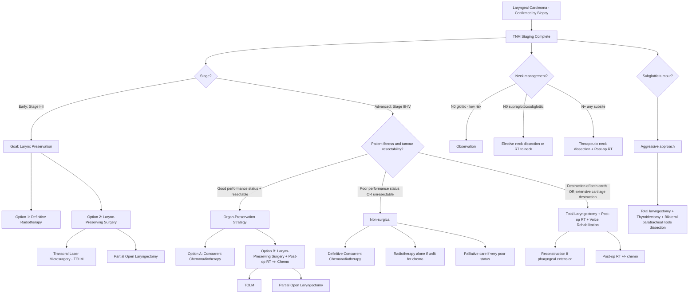

## Management of Laryngeal Carcinoma

### Overview — Guiding Principles

Before diving into specific treatment modalities, let's establish the **philosophy** of managing laryngeal carcinoma. The lecture slides lay out a clear framework [11][12]:

> ***Management Framework — General Principle*** [12]:
> - ***Tumour clearance with long-term survival benefit***
> - ***Organ and function preservation***
> - ***When surgery is indicated → Resection with adequate margins → Reconstruction for Form and Function → Rehabilitation always — swallowing, voice, and hearing***

The larynx is not just a tube — it is the organ of voice, airway protection, and swallowing. Removing it (total laryngectomy) permanently disconnects the upper airway from the digestive tract and eliminates normal speech. Therefore, the overarching goal in modern laryngeal cancer management is **larynx preservation whenever oncologically safe**, meaning we try to cure the cancer while keeping the larynx functioning.

---

### 1. Management Framework — Stage-Based Approach

***Based on TNM staging*** [11]:

| Stage | Approach | Rationale |
|---|---|---|
| ***Early stage (I, II)*** | ***Single modality of treatment — Surgery or radiotherapy alone*** [11] | Small tumours can be cured with one treatment; adding a second modality increases toxicity without survival benefit |
| ***Late stage (III, IV)*** | ***Combined modality of treatment — Concurrent chemo-irradiation OR Surgery with adjuvant radiotherapy ± chemotherapy*** [11] | Advanced tumours have higher risk of local recurrence and distant metastasis; combined modalities improve locoregional control and survival |

***General rule*** [11]:
- ***Early stage: Radiotherapy or minimally invasive surgery (laser/robotic)*** [11]
- ***Late stage: Surgery with adjuvant treatment*** [11]

***BUT — Site-specific exceptions*** [11]:
- ***Oral cavity and thyroid: Surgery in early stage*** [11] (because oral cavity tumours don't respond as well to RT as laryngeal tumours do, and thyroid cancers require surgical excision)
- ***NPC: Chemo-irradiation in late stage*** [11] (NPC is exquisitely radiosensitive due to its undifferentiated histology and EBV association)

For **laryngeal carcinoma specifically**, the approach differs from oral cavity in that **radiotherapy is a very effective single modality for early-stage glottic cancer** and is often preferred over surgery for voice preservation [2].

---

### 2. Management Algorithm

---

### 3. Treatment of Early-Stage Disease (Stage I and II)

#### 3.1 General Approach

***Patients with early cancer should be treated with the intent to preserve the larynx*** [2].

The two main options are:
1. **Definitive radiotherapy**
2. **Larynx-preserving surgery** (TOLM or partial open laryngectomy)

Both achieve excellent oncological outcomes (~90–95% local control for T1 glottic, ~80–85% for T2 glottic). The choice depends on tumour-specific factors, patient preference, institutional expertise, and functional considerations.

#### 3.2 ***Definitive Radiotherapy*** [2]

| Parameter | Detail |
|---|---|
| **What it is** | External beam radiation therapy (EBRT) delivered to the primary tumour ± elective nodal irradiation |
| **Typical regimen** | Conventional fractionation: 66–70 Gy in 33–35 fractions over 6.5–7 weeks; or hypofractionated regimens for T1 glottic (e.g., 63 Gy in 28 fractions) |
| **When to use** | ***Radiotherapy is often preferred because of better functional outcomes, particularly voice quality, while avoiding GA and other risks associated with surgery*** [2]; ***Radiation therapy is equally as effective as surgery in controlling disease for early-stage cancers of the glottis*** [2] |

**Why RT is preferred for early glottic cancer:**
- The vocal fold is an ideal RT target: small volume, well-defined boundaries, and laryngeal cartilage acts as a natural border
- RT treats the entire mucosal surface (important for field change) while preserving the layered microstructure of the vocal fold → better voice quality than excisional surgery
- No GA required for each fraction (daily outpatient visits)
- Salvage surgery (total laryngectomy) remains an option if RT fails

**When RT is NOT preferred:**
- Anterior commissure involvement with cartilage abutment (higher local failure rates with RT alone)
- Very superficial T1a lesions that can be easily excised by TOLM with excellent voice outcomes
- Patient unable to comply with a 6–7 week daily RT course
- Prior head and neck irradiation (re-irradiation carries significant toxicity)

***Complications of RT*** [2]:
- ***Radiation dermatitis*** — erythema, desquamation of neck skin (direct radiation effect on rapidly dividing basal keratinocytes)
- ***Hoarseness*** — radiation-induced oedema and fibrosis of the vocal fold
- ***Dysphagia / Odynophagia*** — radiation mucositis of the pharyngeal and laryngeal mucosa (inflammation of rapidly dividing mucosal epithelium); usually peaks at weeks 3–4 and resolves 2–4 weeks after completing RT
- **Xerostomia** — if salivary glands are in the field (less of an issue with modern IMRT techniques that spare parotids)
- **Laryngeal oedema** — can persist for weeks to months; may require short-course corticosteroids
- **Laryngeal/pharyngeal stenosis** — late complication from fibrosis
- **Hypothyroidism** — thyroid gland often receives incidental radiation; TSH monitoring required
- **Osteoradionecrosis** — of the mandible (if included in field) or hyoid
- **Radiation-induced second malignancy** — very late risk ( > 10 years)

<Callout title="Why not chemotherapy alone for early-stage laryngeal cancer?" type="error">
***Chemotherapy alone does NOT have a role in the treatment of early-stage cancer*** [2]. Chemotherapy is a systemic treatment designed to address micrometastatic disease or radiosensitise tumours; it cannot achieve the local tumour control needed for cure when used alone. It is only added to radiotherapy in selected early T2 cancers or advanced disease.
</Callout>

#### 3.3 ***Larynx-Preserving Surgery*** [2]

##### A. ***Transoral Laser Microsurgery (TOLM)*** [2]

| Parameter | Detail |
|---|---|
| **What it is** | Endoscopic excision of the tumour through the mouth using a ***CO2 laser*** under general anaesthesia with operating microscope magnification |
| **Why CO2 laser?** | ***CO2 laser is used because its frequency of light is absorbed by water, thus minimising tissue damage*** [2] — the laser energy is absorbed by intracellular water, causing precise vaporisation with minimal thermal spread to adjacent tissue |
| **When to use** | Early-stage glottic and supraglottic tumours (T1–selected T2); surgeon must be confident of achieving clear margins |
| **Key principle** | ***All larynx-preserving surgery should be undertaken only when the surgeon is confident that tumour-free margins can be obtained because post-operative RT may compromise functional outcomes, particularly after open surgical procedures*** [2] |
| **Prerequisite** | ***At least one functional arytenoid complex must be preserved so that function of the larynx is maintained*** [2] — if both arytenoids are destroyed, the patient cannot protect their airway during swallowing |

***Advantages of TOLM over partial open laryngectomy*** [2]:
- ***Decreased morbidity such as need for tracheostomy and nasogastric feeding*** [2]
- ***Improved preservation of laryngeal function*** [2]
- ***Lower cost*** [2]
- ***Shorter hospital stay*** [2]

**Limitations of TOLM:**
- Requires adequate endoscopic exposure (limited by anatomy — narrow mouth opening, prominent teeth, stiff neck, bulky tongue)
- Not suitable for tumours with extensive subglottic extension, cartilage invasion, or extralaryngeal spread
- Requires highly specialised surgical expertise

##### B. ***Partial Open Laryngectomy*** [2]

| Parameter | Detail |
|---|---|
| **What it is** | Open surgical procedures that remove the tumour-bearing portion of the larynx while preserving the remaining functional larynx |
| **Types** | Vertical partial laryngectomy (laryngofissure + cordectomy) for glottic tumours; Supraglottic laryngectomy (horizontal partial) for supraglottic tumours; Supracricoid partial laryngectomy (SCPL) for selected transglottic tumours |

**When to use:**
- Early-stage tumours not amenable to TOLM (e.g., poor endoscopic exposure)
- Selected T2–T3 tumours where the surgeon can preserve at least one cricoarytenoid unit

***Complications of partial open laryngectomy*** [2]:
- ***Laryngocutaneous fistula*** — abnormal communication between the neopharynx and the neck skin; occurs when the mucosal closure breaks down
- ***Aspiration pneumonia*** — the most dangerous complication; partial laryngectomy removes part of the sphincteric mechanism, and patients need to "re-learn" swallowing
- ***Swallowing difficulties*** — due to altered anatomy
- ***Bleeding and infection*** — standard surgical complications

#### 3.4 Post-operative RT for Early-Stage Cancer

***Post-operative RT is only indicated in selected patients with resected early-stage cancer*** [2]:
- ***Compromised resection margins*** (close < 2mm or positive)
- ***Lymphovascular or perineural invasion***
- ***Upstaging to Stage III or IV cancer*** (pathological stage higher than clinical stage)

---

### 4. Treatment of Advanced-Stage Disease (Stage III and IV)

#### 4.1 General Approach

The goals here are balancing **cure vs function**. There are two main strategies [2]:

**Strategy 1: Functional Organ-Preservation (Preferred for most)** [2]
- ***Patients with good performance status should be treated with a functional organ-preservation strategy including chemoradiotherapy or larynx-preserving surgery with post-operative RT*** [2]

**Strategy 2: Total Laryngectomy (When organ preservation is not feasible)** [2]
- ***Patients who are not candidates for functional organ-preservation strategy should be treated with total laryngectomy with post-operative RT and voice rehabilitation*** [2]
- This includes:
  - ***Elderly patients or patients with poor functional status that cannot tolerate the associated toxicities of chemoradiotherapy*** [2]
  - ***Patients with resectable tumours with destruction of both vocal cords or extensive cartilage destruction such that vocal or airway protective function cannot be recovered*** [2]

<Callout title="When to Abandon Organ Preservation">
Organ preservation is NOT appropriate when the organ has already been destroyed by the tumour. If the larynx is non-functional (both cords destroyed, extensive cartilage destruction, aspiration), preserving it serves no purpose — it's a functionless, cancer-harbouring structure. These patients are better served by total laryngectomy, which actually *protects* them from aspiration [2].
</Callout>

#### 4.2 ***Concurrent Chemoradiotherapy (CRT)*** [2][11]

| Parameter | Detail |
|---|---|
| **What it is** | Radiotherapy (70 Gy in 35 fractions / 7 weeks) delivered concurrently with radiosensitising chemotherapy |
| **Standard chemotherapy** | **Cisplatin** 100 mg/m² IV on days 1, 22, and 43 of RT (every 3 weeks × 3 cycles) — this is the most evidence-based regimen (VA Larynx Trial, RTOG 91-11) |
| **Alternative** | Weekly cisplatin 40 mg/m² (less emetogenic, easier to administer but less robust evidence); cetuximab (anti-EGFR monoclonal antibody) for patients unfit for cisplatin |
| **When to use** | ***Concurrent chemo-irradiation*** [11] — for advanced-stage laryngeal cancer in patients with good performance status who are candidates for organ preservation |

**Why add chemotherapy to RT?**
- Cisplatin is a **radiosensitiser** — it inhibits DNA repair mechanisms (cross-links DNA strands), making tumour cells more susceptible to radiation-induced DNA damage
- Concurrent CRT improves **locoregional control** and **larynx preservation rates** compared to RT alone (RTOG 91-11 trial: 88% larynx preservation with concurrent CRT vs 75% with induction chemo then RT vs 70% with RT alone)
- Does NOT improve overall survival significantly vs total laryngectomy + post-op RT, but achieves comparable survival with organ preservation

**Cisplatin** ("cis" = same side; "platin" = platinum) — a platinum-based alkylating agent:
- Mechanism: Forms intrastrand and interstrand DNA cross-links → prevents DNA replication and transcription → apoptosis
- Major toxicities: **Nephrotoxicity** (requires aggressive hydration), **ototoxicity** (sensorineural hearing loss), **nausea/vomiting** (highly emetogenic), **myelosuppression**, peripheral neuropathy

**Cetuximab** ("ce" = chimeric; "tu" = tumour; "ximab" = chimeric monoclonal antibody):
- Mechanism: Monoclonal antibody targeting **EGFR** (which is overexpressed in ~80–90% of laryngeal SCCs) → blocks ligand binding → inhibits downstream RAS-MAPK and PI3K-AKT signalling → reduces proliferation
- Used when cisplatin is contraindicated (renal impairment, hearing loss, poor performance status)
- BONNER trial showed cetuximab + RT improves locoregional control vs RT alone, but is generally considered inferior to cisplatin-based CRT

#### 4.3 Other Chemotherapy Strategies [2]

| Strategy | Description |
|---|---|
| ***Induction chemotherapy followed by radiotherapy alone*** [2] | Chemotherapy given first (usually TPF: docetaxel + cisplatin + 5-FU × 3 cycles) to shrink the tumour, followed by RT. Responders proceed with RT (organ preservation); non-responders undergo total laryngectomy |
| ***Sequential therapy: Induction chemotherapy followed by concurrent CRT*** [2] | Induction chemo (TPF) → then concurrent CRT for responders. More intensive; higher toxicity |

> The induction approach allows an "in vivo chemosensitivity test" — if the tumour responds to chemotherapy, it is likely to also respond to RT, and organ preservation is pursued. If not, surgery is performed.

#### 4.4 ***Surgery + Post-operative RT ± Chemotherapy*** [2][11]

***Surgery with adjuvant radiotherapy ± chemotherapy*** [11]:

| Component | Detail |
|---|---|
| **Surgery** | Larynx-preserving surgery (TOLM/partial) for selected T3 or total laryngectomy for T4a/non-organ-preservation candidates |
| **Post-operative RT** | ***Post-operative RT is generally recommended for all patients with resected advanced-stage cancer following larynx-preservation surgery or total laryngectomy*** [2] |
| **Post-operative concurrent chemo-RT** | Added when high-risk pathological features are present: positive/close margins, extranodal extension (ENE), lymphovascular invasion, perineural invasion, pT3/T4 |

**Indications for post-operative RT** (applicable to both early and advanced resected disease) [2][11]:
- Compromised resection margins
- Lymphovascular or perineural invasion
- pT3/T4 disease
- Nodal metastasis (especially multiple nodes or ENE)
- Subglottic extension

---

### 5. Surgical Procedures — Detailed

#### 5.1 ***Total Laryngectomy*** [2]

This is the most radical surgical option and is reserved for when organ preservation is not feasible.

***Procedure*** [2]:
- ***Remaining trachea is brought out onto the lower neck as a permanent tracheal stoma after the larynx is removed*** [2]
- ***Hypopharynx, which is opened at the time of operation, is subsequently closed to restore continuity for swallowing*** [2]
- ***Upper aero-tract and digestive tract are permanently disconnected*** [2]
- ***Part or all of the thyroid gland and associated parathyroid glands may also be removed depending on the extent of disease*** [2]

**What this means for the patient:**
- Breathing: Through the **permanent tracheal stoma** — no air passes through the nose/mouth
- Swallowing: Via the reconstructed neopharynx → oesophagus (swallowing is preserved, though stricture can occur)
- Speech: **Normal speech is impossible** (no air passes through the vocal folds). Voice rehabilitation is critical (see below)
- Smell: Significantly reduced (air no longer passes through the nose during normal breathing — anosmia/hyposmia)

***Advantages*** [2]:
- ***Protection from aspiration pneumonia*** [2] — the airway is completely separated from the digestive tract. This is actually an advantage for patients whose larynx was non-functional (e.g., bilateral cord fixation with chronic aspiration)

***Disadvantages*** [2]:
- ***Stigmatisation with the presence of permanent tracheostomy*** [2] — psychosocial impact is significant

***Complications*** [2]:
- ***Loss of ability to speak*** [2]
- ***Loss of coughing effort*** [2] — because the patient cannot build up intrathoracic pressure against a closed glottis (there is no glottis)
- ***Swallowing dysfunction*** [2]: ***Stricture of neopharynx or anastomosis / Regurgitation*** [2]
- ***Endocrine dysfunction*** [2]: ***Hypothyroidism / Hypoparathyroidism*** [2] — because the thyroid and parathyroid glands may be partially or completely removed
- **Pharyngocutaneous fistula** — the most common early post-operative complication (~15–25%); communication between the neopharynx and the neck skin
- **Stomal recurrence** — tumour recurrence at the tracheostomy site
- **Wound infection, haematoma**
- **Carotid blow-out** — rare but catastrophic; erosion of the carotid artery, usually related to pharyngocutaneous fistula + radiation + wound breakdown

***Reconstruction for pharyngeal extension*** [2]:
- ***Reconstruction by means of a pectoralis major flap or free flap reconstruction is required for lesions with pharyngeal extension*** [2]
- Pectoralis major myocutaneous flap: pedicled flap based on the thoracoacromial artery; used to reconstruct pharyngeal defects
- Free flaps: radial forearm free flap (fasciotcutaneous) or anterolateral thigh (ALT) flap; for larger defects
- Free jejunal flap: for circumferential pharyngeal defects (replaces the entire pharynx with a segment of jejunum)

#### 5.2 Voice Rehabilitation After Total Laryngectomy

Since the patient has lost their vocal folds, alternative methods of voice production are essential:

| Method | How It Works | Pros | Cons |
|---|---|---|---|
| **Tracheoesophageal puncture (TEP) with voice prosthesis** | A one-way valve is placed through a surgically created fistula between the trachea and the oesophagus. The patient occludes the stoma with a finger → air is diverted through the valve into the oesophagus → vibration of the pharyngo-oesophageal segment → voice | Best voice quality; most commonly used; ~80–90% success | Requires maintenance (valve needs replacement every few months); risk of aspiration through the valve; candida colonisation |
| **Oesophageal speech** | Patient swallows air into the oesophagus and releases it, causing the pharyngo-oesophageal segment to vibrate | No device needed; hands-free | Difficult to learn (~30% mastery); low volume; short phrases |
| **Electrolarynx** | External vibrating device held against the neck or cheek; transmits vibration through tissue | Easy to use immediately post-op | Robotic quality; requires hand to hold device; socially conspicuous |

#### 5.3 Neck Dissection

Management of the neck is integral to laryngeal cancer treatment:

| Clinical Scenario | Neck Management |
|---|---|
| **N0 glottic (T1–T2)** | Observation — very low risk of occult nodal metastasis ( < 5%) |
| **N0 supraglottic** | Elective neck dissection (selective: levels II–IV) or elective RT to neck — because of 20–40% risk of occult nodal disease |
| **N0 subglottic** | Bilateral paratracheal (level VI) dissection + ipsilateral lateral neck dissection |
| **N+ (any subsite)** | Therapeutic neck dissection: modified radical or radical neck dissection + post-operative RT to neck |

**Types of neck dissection** [2]:

| Type | What Is Removed | When Used |
|---|---|---|
| **Selective neck dissection** | Only the levels at highest risk of metastasis (e.g., levels II–IV for supraglottic) | Elective (N0 but high risk of occult disease) |
| **Modified radical neck dissection** | Levels I–V LN; preserves one or more of: internal jugular vein, spinal accessory nerve, sternocleidomastoid | Therapeutic (N+); organ preservation when possible |
| **Radical neck dissection** | Levels I–V LN + internal jugular vein + spinal accessory nerve + SCM | Bulky N2/N3 disease with gross involvement of these structures |

---

### 6. Treatment of Subglottic Carcinoma

***Subglottic tumours are the least common and are commonly asymptomatic until locally advanced*** [2].

***Higher rates of local recurrence and poor survival when compared with lesions involving the supraglottis or glottis*** [2].

***Treatment is aggressive with initial surgical treatment consisting of either total laryngectomy or partial laryngectomy in very selected cases*** [2]:
- ***Thyroidectomy and bilateral paratracheal node dissection are usually performed*** [2] — because subglottic tumours drain to paratracheal nodes (level VI) and can directly invade the thyroid gland through the cricothyroid membrane

---

### 7. Non-Pharmacological Management

#### 7.1 ***Lifestyle Modification*** [2]

- **Smoking cessation** — mandatory; continued smoking increases the risk of treatment failure, second primary cancers, and complications of RT (impaired wound healing, increased mucositis)
- **Alcohol cessation** — reduces the synergistic carcinogenic effect and improves nutritional status
- These are not optional "lifestyle suggestions" — they are critical components of cancer treatment

#### 7.2 Nutritional Support

- Many patients with laryngeal cancer are malnourished at presentation (dysphagia, cancer cachexia, alcohol-related malnutrition)
- Pre-treatment nutritional assessment and supplementation improve treatment tolerance
- **Prophylactic percutaneous endoscopic gastrostomy (PEG)** or nasogastric tube may be placed before CRT to maintain nutrition during treatment-induced mucositis
- Dietitian involvement from the start

#### 7.3 ***Swallowing Rehabilitation*** [2][12]

- ***Rehabilitation always — swallowing, voice, and hearing*** [12]
- Speech and language therapist (SLT) assessment pre- and post-treatment
- ***Swallowing assessment to evaluate swallowing techniques and evaluate for the appropriate diet consistency*** [2]
- ***Allows initiation of oral intake of nutrition while minimising the risk of aspiration*** [2]
- Fibreoptic endoscopic evaluation of swallowing (FEES) or videofluoroscopy to objectively assess swallowing function

#### 7.4 Psychosocial Support

- The diagnosis of laryngeal cancer and its treatment (especially total laryngectomy) profoundly impacts quality of life, self-image, social interaction, and mental health
- Psychological counselling, support groups (laryngectomy support groups), and occupational therapy are essential

---

### 8. Palliative Management

For patients with:
- **Stage IVC** (distant metastasis)
- **Unresectable T4b** disease (carotid encasement, prevertebral invasion)
- **Poor performance status** precluding curative treatment

Options include:
- **Palliative radiotherapy**: Symptom relief (pain, bleeding, airway obstruction)
- **Palliative chemotherapy**: Cisplatin + 5-FU, or pembrolizumab/nivolumab (immune checkpoint inhibitors targeting PD-1; approved for recurrent/metastatic HNSCC)
- **Immunotherapy**: Pembrolizumab ("pem" = programmed; "brolizumab" = humanised monoclonal antibody) — anti-PD-1; now first-line for recurrent/metastatic HNSCC with PD-L1 CPS ≥ 1 (KEYNOTE-048 trial)
- **Tracheostomy**: For airway obstruction
- **PEG tube**: For nutrition if swallowing is impossible
- **Best supportive care**: Pain management, psychological support, end-of-life care

---

### 9. Immunotherapy in HNSCC — Emerging Role

While not a primary focus of the undergraduate curriculum, it is worth noting:

| Agent | Target | Indication |
|---|---|---|
| **Pembrolizumab** | PD-1 | First-line for recurrent/metastatic HNSCC with PD-L1 CPS ≥ 1; or second-line after platinum failure |
| **Nivolumab** | PD-1 | Second-line for recurrent/metastatic HNSCC after platinum-based chemotherapy (CheckMate 141 trial) |

These work by blocking the PD-1/PD-L1 checkpoint, which tumour cells exploit to evade immune surveillance. By blocking this interaction, T cells are "unleashed" to attack the tumour.

---

### 10. Follow-Up and Surveillance

Post-treatment follow-up is essential because of:
1. **Local recurrence** risk
2. **Metachronous second primary** risk (field cancerisation)
3. **Treatment-related complications** (hypothyroidism, dysphagia, osteoradionecrosis)

| Time Post-Treatment | Frequency | Investigations |
|---|---|---|
| Year 1–2 | Every 1–3 months | Clinical examination, flexible laryngoscopy, TSH (if neck RT) |
| Year 3–5 | Every 3–6 months | As above + annual CXR or CT chest (lung surveillance) |
| Year 5+ | Every 6–12 months | As above; lifelong follow-up recommended |

---

### 11. Management Summary Table by Stage and Subsite

| Scenario | Primary Treatment | Neck Management | Adjuvant Treatment |
|---|---|---|---|
| **T1a N0 glottic** | RT (preferred) or TOLM | Observation | None (unless adverse pathology) |
| **T1b N0 glottic** | RT or TOLM | Observation | None |
| **T2 N0 glottic** | RT (preferred) or TOLM/partial laryngectomy | Observation or elective RT to neck | RT if adverse pathology; selected T2 may get CRT [2] |
| **T1–T2 N0 supraglottic** | RT or supraglottic laryngectomy (TOLM or open) | Elective bilateral neck dissection or RT to neck | None (unless adverse pathology) |
| **T3 N0/N1 any subsite** | CRT (organ preservation) or larynx-preserving surgery + post-op RT | Included in CRT field or neck dissection | Post-op RT ± chemo if surgical route |
| **T4a N0–N2** | Total laryngectomy + post-op RT ± chemo (organ preservation less feasible) | Neck dissection | Post-op CRT if ENE, positive margins |
| **T4b or N3** | Definitive CRT (unresectable) or palliative | Included in CRT field | — |
| **Subglottic** | Total laryngectomy + thyroidectomy + bilateral paratracheal dissection | As above | Post-op RT |
| **Recurrent/metastatic** | Salvage surgery (if feasible) or immunotherapy (pembrolizumab/nivolumab) ± chemo | — | Palliative RT |

---

<Callout title="High Yield Summary — Management of Laryngeal Carcinoma">

1. ***Management is based on TNM staging*** [11]: ***Early stage (I, II) = single modality (RT or surgery); Late stage (III, IV) = combined modality (CRT or surgery + adjuvant RT ± chemo)*** [11].

2. ***General principles*** [12]: ***Tumour clearance + organ/function preservation. When surgery is indicated → resection with adequate margins → reconstruction → rehabilitation (swallowing, voice, hearing)*** [12].

3. **Early glottic cancer**: ***RT is equally effective as surgery and is preferred for voice preservation*** [2]. ***TOLM is an alternative with advantages of less morbidity, shorter hospital stay, and better function preservation*** [2].

4. **Advanced disease**: ***Organ preservation with CRT*** is the standard for patients with good performance status [2]. ***Total laryngectomy*** is reserved for those with ***destruction of both vocal cords, extensive cartilage destruction, or poor performance status*** [2].

5. ***Total laryngectomy*** permanently disconnects the airway from the digestive tract → permanent tracheostomy, voice rehabilitation (TEP, oesophageal speech, electrolarynx) [2]. Complications include loss of speech, loss of cough effort, swallowing dysfunction, hypothyroidism, and hypoparathyroidism [2].

6. **Subglottic tumours**: ***Aggressive treatment — total laryngectomy + thyroidectomy + bilateral paratracheal node dissection*** [2].

7. ***Chemotherapy alone has NO role in early-stage cancer*** [2]. Cisplatin-based CRT is the backbone of organ-preservation protocols.

8. **Neck management**: N0 glottic = observe; N0 supraglottic = elective dissection/RT; N+ = therapeutic neck dissection.

9. **Immunotherapy** (pembrolizumab, nivolumab) is now first/second-line for recurrent/metastatic HNSCC.

</Callout>

---

<ActiveRecallQuiz
  title="Active Recall - Management of Laryngeal Carcinoma"
  items={[
    {
      question: "What is the management framework for early-stage (I-II) vs late-stage (III-IV) H&N cancers, as stated in the lecture slides?",
      markscheme: "Early stage: Single modality — surgery or radiotherapy alone. Late stage: Combined modality — concurrent chemo-irradiation OR surgery with adjuvant radiotherapy +/- chemotherapy. General rule: Early stage = RT or minimally invasive surgery (laser/robotic); Late stage = surgery with adjuvant treatment."
    },
    {
      question: "Why is radiotherapy often preferred over surgery for early-stage glottic carcinoma?",
      markscheme: "RT offers better functional outcomes, particularly voice quality, while avoiding GA and surgical risks. RT is equally effective as surgery for disease control in early glottic cancer. RT treats the mucosal surface while preserving the layered vocal fold microstructure. Salvage surgery (total laryngectomy) remains an option if RT fails."
    },
    {
      question: "List three advantages of Transoral Laser Microsurgery (TOLM) over partial open laryngectomy.",
      markscheme: "1. Decreased morbidity (less need for tracheostomy and NG feeding). 2. Improved preservation of laryngeal function. 3. Lower cost and shorter hospital stay. Also: CO2 laser frequency is absorbed by water, minimising tissue damage."
    },
    {
      question: "When should total laryngectomy be chosen over an organ-preservation strategy in advanced laryngeal cancer?",
      markscheme: "1. Patients with poor performance status who cannot tolerate chemoradiotherapy toxicity. 2. Patients with resectable tumours with destruction of both vocal cords or extensive cartilage destruction such that vocal or airway protective function cannot be recovered. 3. Elderly/frail patients. These patients are better served by total laryngectomy + post-op RT + voice rehabilitation."
    },
    {
      question: "What structures are routinely removed in the surgical treatment of subglottic carcinoma and why?",
      markscheme: "Total laryngectomy + thyroidectomy + bilateral paratracheal node dissection. Why: Subglottic tumours drain to paratracheal nodes (level VI) and can directly invade the thyroid gland through the cricothyroid membrane. Aggressive approach needed because of high recurrence rates and poor survival."
    },
    {
      question: "Name three methods of voice rehabilitation after total laryngectomy and briefly describe the mechanism of each.",
      markscheme: "1. Tracheoesophageal puncture (TEP) with voice prosthesis: one-way valve between trachea and oesophagus; air diverted to vibrate pharyngo-oesophageal segment. 2. Oesophageal speech: air swallowed into oesophagus and released to vibrate PE segment. 3. Electrolarynx: external vibrating device held against neck; transmits vibration through tissue."
    }
  ]}
/>

## References

[2] Senior notes: felixlai.md (sections on Laryngeal carcinoma treatment — general approach, treatment modalities, surgical treatment, non-pharmacological treatment, medical treatment, complications of total laryngectomy, neck dissection types)
[11] Lecture slides: GC 219. Infections and tumours in pharynx and oral cavity.pdf (p43 — Management Framework: staging-based approach, general rule, site-specific exceptions)
[12] Lecture slides: GC 219. Infections and tumours in pharynx and oral cavity.pdf (p44 — Management Framework: general principles — tumour clearance, organ preservation, reconstruction, rehabilitation)
