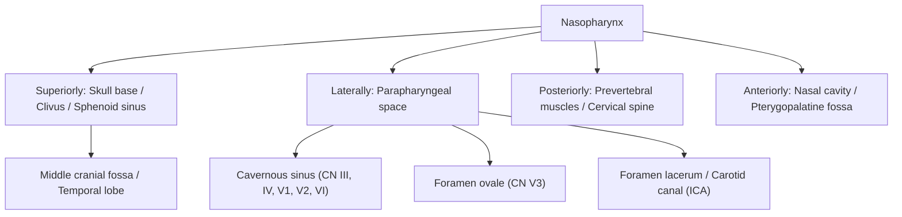

# Nasopharyngeal Carcinoma (NPC)

## 1. Definition

Nasopharyngeal carcinoma (NPC) is a malignant epithelial neoplasm arising from the mucosal lining of the nasopharynx — the uppermost part of the pharynx, situated directly behind the nasal cavity and above the soft palate. The term breaks down as: "naso" = nose, "pharyngeal" = relating to the pharynx (throat), "carcinoma" = epithelial-origin cancer.

NPC is biologically and epidemiologically distinct from other head and neck squamous cell carcinomas (HNSCCs). Unlike most HNSCCs that are driven primarily by tobacco/alcohol, ***NPC is uniquely associated with Epstein-Barr virus (EBV) infection*** [1][2], has a striking geographic predilection for Southern China (including Hong Kong), and is exquisitely radiosensitive — meaning radiation therapy (RT), not surgery, is the primary treatment modality.

<Callout title="Why is NPC different from other H&N cancers?">
NPC stands apart because of: (1) its unique viral etiology (EBV, not HPV), (2) its geographic/ethnic clustering, (3) the nasopharynx's deep anatomical location making surgical access extremely difficult, (4) its remarkable radiosensitivity, and (5) its distinct N staging system (different from all other H&N cancers) [3].
</Callout>

---

## 2. Epidemiology

### 2.1 Global Epidemiology

- ***> 70% of new NPC cases occur in East and Southeast Asia*** [1]
- ***China alone accounts for ~47.7% of global cases*** (60,558 out of ~127,000 cases globally per GLOBOCAN 2018 data) [1]
- Other high-burden countries: ***Indonesia (14.2%), Vietnam (4.9%), India (4.0%), Mediterranean countries (2.9%), Philippines (2.3%), Thailand (1.7%), USA (1.7%)*** [1]
- Endemic regions form a characteristic belt: Southern China > Southeast Asia > North Africa/Mediterranean > Arctic (Inuit populations)
- ***Global gradual decline in incidence*** — attributed to changes in dietary habits, improved socioeconomic conditions, and reduced consumption of preserved foods [1]

### 2.2 Hong Kong Epidemiology

- ***NPC is the 10th most common cancer in Hong Kong*** (both sexes combined) [1][2]
- **6th most common cancer in males** in Hong Kong [2]
- ***Male-to-female ratio = 2.5:1*** [1] (some sources cite 2–3:1 [2])
- Peak incidence: bimodal — small peak at age 15–25 years, major peak at age 40–60 years
- Cantonese-speaking populations in Guangdong province and Hong Kong have the highest incidence worldwide (age-standardised rate ~20–30 per 100,000 in males)
- Even when Southern Chinese emigrate to lower-risk areas, first-generation migrants retain elevated risk, which gradually declines in subsequent generations — supporting both genetic susceptibility and environmental/dietary factors

> **High Yield**: NPC is endemic in Southern China. In Hong Kong, it is the **10th most common cancer overall** and **6th in males**. The male predominance is approximately **2.5:1**. Always think NPC when a young-to-middle-aged Cantonese male presents with a neck mass or nasal symptoms.

---

## 3. Anatomy and Function of the Nasopharynx

Understanding the anatomy is absolutely critical because the pattern of local invasion, cranial nerve involvement, and lymphatic drainage dictates the clinical presentation.

### 3.1 Boundaries of the Nasopharynx

| Boundary | Structure |
|----------|-----------|
| Superior (roof) | Body of sphenoid bone, basilar part of occipital bone (clivus) |
| Posterior wall | C1–C2 vertebral bodies, prevertebral fascia |
| Lateral walls | Pharyngeal recesses (fossae of Rosenmüller), Eustachian tube openings |
| Inferior | Superior surface of soft palate (nasopharynx communicates with oropharynx at the level of the soft palate) |
| Anterior | Posterior choanae (openings into nasal cavity) |

<DiagramCard src="/diagrams/nasopharynx.png" alt="Nasopharynx anatomy and key adjacent landmarks relevant to nasopharyngeal carcinoma" caption="Nasopharynx anatomy [6]" />

### 3.2 Key Anatomical Landmarks

- ***Pharyngeal recess (Fossa of Rosenmüller)***: A lateral mucosal recess just behind the torus tubarius (the cartilaginous elevation around the Eustachian tube opening). **This is the most common site of origin of NPC** [2]. Why here? The fossa has abundant lymphoid tissue and is a transitional zone between respiratory and squamous epithelium — transition zones are generally vulnerable to malignant transformation (similar concept to the squamocolumnar junction in cervical cancer).

- **Eustachian tube opening (torus tubarius)**: Located on the lateral wall. Tumour infiltration here causes Eustachian tube dysfunction → middle ear effusion → conductive hearing loss. This is one of the earliest symptoms.

- **Levator veli palatini and tensor veli palatini**: Muscles that open the Eustachian tube. Tumour invasion of these muscles also contributes to tubal dysfunction.

### 3.3 Critical Adjacent Structures (Routes of Spread)

The nasopharynx sits in a "crossroads" position at the skull base, surrounded by vital neurovascular structures:

#### Routes of Local Spread

| Route | Structures Involved | Clinical Consequence |
|-------|---------------------|---------------------|
| **Lateral** → Parapharyngeal space | Fat, internal carotid artery (ICA), CN IX–XII | Cranial nerve palsies (IX–XII), carotid encasement |
| **Superolateral** → Foramen ovale | CN V3 (mandibular branch of trigeminal) | Facial numbness (V3 distribution), masticator muscle weakness |
| **Superior** → Foramen lacerum → Cavernous sinus | CN III, IV, V1, V2, VI; ICA; pituitary | Diplopia, ptosis, facial numbness (V1/V2), ophthalmoplegia |
| **Superior** → Clivus / Sphenoid sinus | Bone erosion | Headache, CSF leak (rare) |
| **Anterior** → Nasal cavity, pterygopalatine fossa, orbit | Nasal obstruction, orbital extension | Epistaxis, nasal obstruction, proptosis |
| **Posterior** → Prevertebral muscles, cervical spine | Retropharyngeal nodes, vertebral destruction | Neck stiffness, retropharyngeal mass |

### 3.4 Lymphatic Drainage

The nasopharynx has an extremely rich lymphatic network, which is why **lymph node metastasis is present at diagnosis in up to 75–90% of patients** [2]:

- **Retropharyngeal lymph nodes (nodes of Rouvière)**: First echelon drainage — these are the most commonly involved nodes and are clinically occult (cannot be palpated; only detected on imaging)
- **Level II (upper deep cervical / jugulodigastric)**: Most common clinically palpable nodal station
- **Level III, IV, V**: Progressive drainage
- **Bilateral nodal involvement** is common because the nasopharynx is a midline structure with bilateral lymphatic drainage

<Callout title="Clinical Pearl – Why does NPC present late?" type="idea">
The nasopharynx is a ***clinically occult site*** [2] — you cannot see it without a mirror or endoscope. The fossa of Rosenmüller is hidden behind the torus tubarius. Additionally, the earliest lymph nodes involved (retropharyngeal) are deep and impalpable. By the time the patient notices a neck lump (level II node) or develops cranial nerve symptoms (skull base invasion), the disease is already locally or regionally advanced.
</Callout>

---

## 4. Etiology and Risk Factors

NPC has a multifactorial etiology involving the classic triad: **viral (EBV) + genetic susceptibility + environmental factors**.

### 4.1 Epstein-Barr Virus (EBV) Infection

***EBV infection is the primary etiological agent in the pathogenesis of NPC*** [1][2]

- EBV (Human Herpesvirus 4) is a ubiquitous gamma-herpesvirus that infects > 90% of the world's adult population. Most people harbour latent EBV asymptomatically. So why does NPC develop in only a tiny fraction?
  - The answer lies in the interplay between EBV latent gene expression, host genetic susceptibility, and environmental co-carcinogens
- **Mechanism of EBV-driven carcinogenesis**:
  1. EBV infects nasopharyngeal epithelial cells (likely via cell-to-cell contact with EBV-infected B lymphocytes in the subepithelial lymphoid tissue)
  2. The virus establishes **latent infection** (Latency Type II pattern) expressing:
     - **LMP1** (Latent Membrane Protein 1): Mimics constitutively active CD40 receptor → activates NF-κB, MAPK, PI3K/Akt pathways → promotes cell survival, proliferation, and anti-apoptosis
     - **LMP2A**: Mimics B-cell receptor signalling → promotes survival
     - **EBNA1** (EBV Nuclear Antigen 1): Required for episomal maintenance and replication of EBV genome
     - **EBERs** (EBV-encoded small RNAs): Most abundantly expressed; used for diagnosis via **in situ hybridization (EBER-ISH)** — the gold standard for confirming EBV in tumour tissue
     - **BARTs** (BamHI-A Rightward Transcripts): Encode miRNAs that promote immune evasion
  3. These viral oncoproteins cooperate with pre-existing genetic/epigenetic alterations (e.g., loss of p16/CDKN2A, chromosome 3p deletions) to drive malignant transformation

- **Serological evidence** [2]:
  - ***IgA antibodies against EBV viral capsid antigen (EBV VCA-IgA)*** — elevated in NPC patients; used as a serological screening marker
  - IgA against EBV Early Antigen (EA-IgA) — also elevated
  - These are IgA (not IgG) because the nasopharynx is a mucosal surface → local mucosal immune response produces IgA

- ***Detection of EBV DNA and EBV gene expression in precursor lesions and tumour cells*** [2] — confirms that EBV is not a bystander but causally involved

- **Plasma EBV DNA** (cell-free EBV DNA): A critically important biomarker:
  - Used for screening (Hong Kong population screening studies by Prof Dennis Lo's group)
  - Used for staging (levels correlate with tumour burden)
  - Used for monitoring treatment response and detecting relapse
  - Derived from tumour cell apoptosis/necrosis releasing EBV DNA fragments into blood

> **High Yield**: EBV is detected in virtually 100% of non-keratinizing NPC in endemic areas. The key serological markers are **VCA-IgA** and **EA-IgA**. **Plasma EBV DNA** is now used for population screening, prognostication, and surveillance.

### 4.2 Host Genetics

***Family history of NPC*** is a significant risk factor [1][2]:
- First-degree relatives of NPC patients have a 4–10x increased risk
- ***Associated with certain human leukocyte antigen (HLA) haplotypes*** [2]:
  - HLA-A2, HLA-B46, HLA-B58 — associated with increased risk in Southern Chinese
  - HLA-A11 — may be protective
  - HLA molecules determine which EBV peptides are presented to cytotoxic T-cells; certain haplotypes may impair immune surveillance against EBV-infected cells
- ***Associated with genetic polymorphisms such as CYP2A6*** [2]:
  - ***CYP2A6 is a polymorphism of the nitrosamine-metabolizing gene*** — certain variants may reduce the ability to detoxify dietary nitrosamines, increasing mucosal exposure to carcinogens
- GWAS studies have identified susceptibility loci on chromosomes 6p21 (HLA region), 3p21, 9p21 (CDKN2A/p16 locus)

### 4.3 Environmental Factors

***Environmental factors include*** [1][2]:

#### ***Dietary Habits***
- ***Salted fish*** (Cantonese-style salted fish, in particular) [2]
  - Classified as a **Group 1 carcinogen** by IARC
  - ***Contains high levels of nitrosamines, bacterial mutagens, direct genotoxins, and EBV-reactivating substances*** [2]
  - Why salted fish specifically? The traditional Cantonese salt-curing process (partial drying at moderate temperature) promotes bacterial fermentation → generates volatile N-nitrosamines (e.g., N-nitrosodimethylamine, NDMA)
  - ***Cooking of salt-cured food releases volatile nitrosamines which are carried by steam and distributed over the nasopharyngeal mucosa*** [2]
  - Early childhood exposure appears particularly important (developing nasopharyngeal mucosa may be more susceptible)
- ***Preserved or fermented foods*** [1][2] — preserved vegetables, fermented bean paste, etc.

#### ***Tobacco Smoking***
- ***Active and passive tobacco smoking*** [1] is a risk factor
- **Smoking is the primary risk factor for most H&N cancers** [4], but for NPC specifically, it acts as a co-carcinogen alongside EBV
- Tobacco smoke contains nitrosamines and polycyclic aromatic hydrocarbons that can directly damage nasopharyngeal mucosa and reactivate latent EBV
- ***Synergism between smoking and alcohol*** in HNSCC development is well established [4]

#### ***Alcohol***
- ***Alcohol*** [1] — a classical risk factor for H&N cancer
- Ethanol is metabolized to acetaldehyde (a Group 1 carcinogen) by alcohol dehydrogenase
- East Asian populations frequently carry the ALDH2*2 polymorphism ("Asian flush") → impaired acetaldehyde metabolism → prolonged exposure to this carcinogen

#### ***Other Environmental Factors***
- ***Oral hygiene*** [1] — poor oral hygiene with chronic mucosal inflammation may act as a co-carcinogen
- Occupational exposures: wood dust, formaldehyde (less well-established for NPC compared to sinonasal cancers)
- ***Previous irradiation*** [4] — prior radiotherapy to H&N region increases risk of subsequent malignancy

<Callout title="Risk Factors Mnemonic for NPC" type="idea">
Think **"EBV-GPS"**:
- **E** = EBV infection (primary agent)
- **B** = Brine (salted fish, preserved foods)
- **V** = Vulnerability genes (HLA haplotypes, CYP2A6, family history)
- **G** = Geography (Southern China, Cantonese)
- **P** = Passive/active smoking
- **S** = Spirits (alcohol)
</Callout>

---

## 5. Pathophysiology

### 5.1 Molecular Pathogenesis — A Multi-Step Model

NPC does not arise de novo. It follows a stepwise progression, with EBV infection being a relatively late but essential event:

Key molecular events:
1. **Early events** (pre-EBV): Loss of chromosome 3p (contains tumour suppressor genes), inactivation of p16/CDKN2A (cell cycle regulator) by promoter hypermethylation
2. **EBV infection**: EBV preferentially infects pre-malignant epithelium that has already lost key tumour suppressor functions
3. **Late events** (post-EBV): LMP1-driven NF-κB activation, telomerase activation, further genomic instability, immune evasion via PD-L1 upregulation

### 5.2 Why the Nasopharynx?

This is a commonly asked conceptual question. Several reasons:
- The nasopharynx is rich in **lymphoid tissue** (pharyngeal tonsil/adenoid) → abundant EBV-infected B lymphocytes in close proximity to epithelial cells → facilitates cell-to-cell EBV transmission to epithelial cells
- The **fossa of Rosenmüller** represents a transitional epithelial zone (respiratory → squamous) — transition zones are inherently more vulnerable to neoplastic transformation
- Direct exposure to inhaled/ingested carcinogens (nitrosamines from salted fish cooking steam) contacts the nasopharyngeal mucosa first

### 5.3 Immune Microenvironment

NPC (particularly the undifferentiated subtype) is characterized by a dense lymphoid infiltrate — historically called "lymphoepithelioma" because the tumour cells are intimately admixed with non-neoplastic lymphocytes. This is important because:
- The lymphocytic infiltrate represents an **anti-tumour immune response** (mostly CD8+ T cells)
- NPC tumour cells evade this response by upregulating **PD-L1** (programmed death-ligand 1) → binds PD-1 on T cells → immune checkpoint inhibition → T cell exhaustion
- This is the rationale for **immune checkpoint inhibitors** (anti-PD-1: pembrolizumab, nivolumab, camrelizumab) in the treatment of advanced/recurrent NPC

---

## 6. Classification

### 6.1 WHO Histopathological Classification (2017/2022)

***The WHO classification divides NPC into three types*** [1][2]:

| WHO Type | Description | Key Features |
|----------|-------------|--------------|
| ***Non-keratinizing*** | ***Undifferentiated*** | ***Most common endemic form of NPC (Hong Kong)*** [1][2]. Poorly differentiated, syncytial growth pattern. ***Strongly associated with EBV infection*** [1][2]. Dense lymphocytic infiltrate ("lymphoepithelioma"). ***Possesses a more favourable prognosis than other types*** [2] — highly radiosensitive |
| ***Non-keratinizing*** | ***Differentiated*** | Shows evidence of squamous maturation but no overt keratin. Also EBV-associated. Intermediate behaviour |
| ***Keratinizing squamous cell carcinoma*** | | ***Most common sporadic form of NPC*** [2]. ***Resembles cell of origin (squamous cell carcinoma)*** [2]. Produces keratin. More common in non-endemic areas. Less strongly associated with EBV. Worse prognosis than non-keratinizing |
| ***Basaloid squamous cell carcinoma*** | | Rare. ***Aggressive clinical course. Poor survival and prognosis*** [2] |

- ***> 95% of cases in endemic areas are non-keratinizing*** [1] (vast majority undifferentiated)
- ***Epstein-Barr virus infection*** is found in virtually all non-keratinizing NPC in endemic areas [1]

<Callout title="Exam Pearl – WHO Classification" type="error">
Students often confuse the old WHO classification (Type I/II/III) with the current system. The old Type III ("undifferentiated") is now called **non-keratinizing undifferentiated**. The current WHO classification (2017) dropped the numeric system. Use the descriptive terms: non-keratinizing (differentiated/undifferentiated), keratinizing SCC, and basaloid SCC.
</Callout>

### 6.2 TNM Staging (AJCC/UICC 8th Edition, 2017)

***TNM staging for NPC is distinct from other H&N cancers*** [3], particularly the N staging.

#### T Stage (Primary Tumour)

| T Stage | Description |
|---------|-------------|
| Tis | Carcinoma in situ |
| T1 | Tumour confined to nasopharynx, OR extends to oropharynx and/or nasal cavity WITHOUT parapharyngeal involvement |
| T2 | Tumour with extension to parapharyngeal space, AND/OR adjacent soft tissue involvement (medial pterygoid, lateral pterygoid, prevertebral muscles) |
| T3 | Tumour involves bony structures of skull base, cervical vertebrae, pterygoid structures, AND/OR paranasal sinuses |
| T4 | Tumour with intracranial extension, involvement of cranial nerves, hypopharynx, orbit, parotid gland, AND/OR extensive soft tissue infiltration beyond the lateral surface of the lateral pterygoid muscle |

#### N Stage — Unique to NPC

***N staging for NPC is different from all other H&N cancers*** [3]. It does NOT use the ENE (extranodal extension) criteria used for other H&N sites. Instead, it uses size and laterality as well as anatomic location:

| N Stage | Description |
|---------|-------------|
| NX | Regional lymph nodes cannot be assessed |
| N0 | No regional lymph node metastasis |
| N1 | Unilateral cervical and/or uni/bilateral retropharyngeal lymph node(s), ≤ 6 cm above the caudal border of the cricoid cartilage |
| N2 | Bilateral cervical lymph node(s), ≤ 6 cm above the caudal border of the cricoid cartilage |
| N3 | Lymph node(s) > 6 cm AND/OR extension below the caudal border of the cricoid cartilage |

> **Important**: For NPC, N staging is based on (1) unilateral vs bilateral, (2) size (≤ 6 cm vs > 6 cm), and (3) position relative to the caudal border of the cricoid cartilage (supraclavicular involvement). This is completely different from the uniform N staging used for other H&N cancers [3].

#### M Stage

| M Stage | Description |
|---------|-------------|
| M0 | No distant metastasis |
| M1 | Distant metastasis present |

#### Stage Grouping

| Stage | T | N | M |
|-------|---|---|---|
| I | T1 | N0 | M0 |
| II | T1 N1, T2 N0-1 | | M0 |
| III | T1-2 N2, T3 N0-2 | | M0 |
| IVA | T4 or N3 | | M0 |
| IVB | Any T | Any N | M1 |

### 6.3 Sites of Distant Metastasis

***Common sites of distant metastasis*** [2]:
- ***Bone (most common, ~75%)*** — Why? NPC has a tropism for bone marrow, possibly related to CXCR4/CXCL12 chemokine axis
- ***Liver***
- ***Lung***
- ***Distant lymph nodes***
- Less commonly: brain, skin, adrenal

---

## 7. Clinical Features

### 7.1 General Presentation

***NPC remains asymptomatic for a long period due to its presence in a clinically occult site*** [2]. The patient typically ***presents with locally or regionally advanced disease due to the prolonged asymptomatic period or due to missed diagnosis*** [2].

The clinical features can be organized by the direction of tumour spread:

### 7.2 Symptoms

#### A. Nasal Symptoms (Anterior Extension → Nasal Cavity)

| Symptom | Pathophysiological Basis |
|---------|------------------------|
| **Epistaxis** (blood-stained nasal discharge / post-nasal drip) | Tumour neovasculature is friable → bleeds easily. Tumour extends anteriorly into the nasal cavity or erodes mucosal blood vessels. Often blood-stained post-nasal drip rather than frank anterior epistaxis |
| **Nasal obstruction** (unilateral initially, may become bilateral) | Physical mass effect of tumour obstructing the posterior choana. May also extend anteriorly into the nasal cavity |
| **Rhinorrhoea** | Mucosal irritation and secondary infection/inflammation around the tumour |

#### B. Otological Symptoms (Lateral Extension → Eustachian Tube)

| Symptom | Pathophysiological Basis |
|---------|------------------------|
| ***Unilateral serous otitis media (middle ear effusion)*** | Tumour infiltrates or compresses the Eustachian tube opening (torus tubarius) or its associated muscles (levator/tensor veli palatini) → loss of Eustachian tube function → failure to equalize middle ear pressure → transudation of fluid into middle ear. **This is one of the earliest symptoms and is a critical diagnostic clue** |
| **Conductive hearing loss** (unilateral) | Middle ear effusion dampens tympanic membrane vibration and ossicular chain transmission. Any adult with unexplained unilateral middle ear effusion must have the nasopharynx examined to exclude NPC |
| **Tinnitus** (usually low-pitched) | Fluid in the middle ear alters resonance characteristics |
| **Ear fullness / aural blockage** | Negative middle ear pressure from Eustachian tube dysfunction |

<Callout title="Critical Rule" type="error">
***Any adult in an NPC-endemic area presenting with unilateral serous otitis media (middle ear effusion) MUST have the nasopharynx examined (by nasopharyngoscopy) to exclude NPC.*** In children, serous otitis media is common and usually due to adenoid hypertrophy. In adults, it is uncommon and NPC must be ruled out.
</Callout>

#### C. Neurological Symptoms (Superior/Lateral Extension → Skull Base and Cranial Nerves)

Cranial nerve (CN) involvement occurs via two main routes:

1. **Through the foramen lacerum → cavernous sinus** (CN III, IV, V1, V2, VI)
2. **Through the parapharyngeal space** (CN IX, X, XI, XII)
3. **Through the foramen ovale** (CN V3)

| Symptom | Cranial Nerve | Pathophysiological Basis |
|---------|---------------|------------------------|
| **Diplopia** | CN VI (abducens) — most commonly affected CN in NPC | CN VI has the longest intracranial course and passes through the cavernous sinus → vulnerable to compression. Lateral rectus palsy → inability to abduct the ipsilateral eye → horizontal diplopia |
| **Diplopia with ptosis** | CN III (oculomotor) | Passes through the cavernous sinus. Innervates superior/inferior/medial rectus, inferior oblique, levator palpebrae superioris, and parasympathetics to pupil. Compression → ptosis + "down and out" eye + mydriasis |
| **Facial numbness / pain** | CN V (trigeminal) — V2 and V3 most commonly | V2 passes through foramen rotundum into the cavernous sinus → cheek/upper lip numbness. V3 passes through foramen ovale → lower face/jaw numbness. Perineural spread along V is also possible |
| **Headache** | CN V (V1/V2) + Dural invasion | Dural stretch/invasion at the skull base → referred pain. V1 innervates the tentorium; frontal headache suggests V1 involvement |
| **Trismus** (difficulty opening mouth) | CN V3 motor branch / Direct invasion of pterygoid muscles | Motor V3 innervates muscles of mastication (masseter, temporalis, medial/lateral pterygoids). Invasion or compression → weakness. Direct tumour invasion of pterygoid muscles also causes mechanical restriction |
| **Hoarseness** | CN X (vagus) | Recurrent laryngeal nerve branch of vagus innervates all intrinsic laryngeal muscles except cricothyroid. Vagal palsy → vocal cord paralysis → breathy hoarse voice |
| **Dysphagia** | CN IX (glossopharyngeal), CN X | Pharyngeal motor innervation disrupted → pharyngeal weakness → difficulty swallowing |
| **Shoulder weakness / trapezius wasting** | CN XI (accessory) | Innervates sternocleidomastoid and trapezius. Parapharyngeal space invasion → shoulder drop |
| **Tongue deviation** | CN XII (hypoglossal) | Innervates all intrinsic and extrinsic tongue muscles except palatoglossus. Unilateral palsy → tongue deviates toward the affected side (the functional side pushes the tongue over) |

> **Teaching Pearl**: The most commonly affected cranial nerve in NPC is **CN V** (trigeminal) followed by **CN VI** (abducens). When **CN III, IV, V1, V2, and VI** are involved together, this suggests **cavernous sinus syndrome**. When **CN IX, X, XI, XII** are involved, this points to **parapharyngeal space / jugular foramen syndrome (Vernet syndrome)**.

#### D. Neck Mass (Regional Spread → Cervical Lymph Nodes)

| Symptom | Pathophysiological Basis |
|---------|------------------------|
| ***Painless neck mass*** — often the **presenting complaint** | Metastasis to cervical lymph nodes, most commonly **level II (upper jugular / jugulodigastric)**. ***Lymph node metastases are usually present at diagnosis and commonly bilateral*** [2] because of the midline position of the nasopharynx with bilateral lymphatic drainage. The mass is typically firm, non-tender, and may be fixed to underlying structures in advanced cases |

<Callout title="Presenting Complaint Statistics">
In endemic areas, the most common **presenting symptom** of NPC is a **neck mass** (up to 40-70% of patients), followed by nasal symptoms (epistaxis, obstruction) and otological symptoms (hearing loss, ear fullness). Cranial nerve symptoms indicate advanced local disease (T3-T4).
</Callout>

#### E. Systemic Symptoms (Distant Metastasis)

| Symptom | Pathophysiological Basis |
|---------|------------------------|
| **Bone pain** (back, pelvis, ribs) | Bone is the most common distant metastatic site. Tumour cells in bone marrow stimulate osteoclast activity → bone destruction → pathological fractures → pain |
| **Hepatomegaly / right upper quadrant pain** | Liver metastasis → capsular stretch |
| **Cough / haemoptysis** | Lung metastasis |
| **Constitutional symptoms** (weight loss, fatigue, anorexia) | Tumour-related cachexia mediated by cytokines (TNF-α, IL-6) |

### 7.3 Signs

#### A. ENT Examination Findings

| Sign | Basis |
|------|-------|
| **Nasopharyngeal mass** on posterior rhinoscopy / nasopharyngoscopy | Direct visualization of the primary tumour, most commonly at the fossa of Rosenmüller. May appear as an exophytic mass, mucosal irregularity, or submucosal bulge |
| **Blood-stained mucus in post-nasal space** | Tumour surface ulceration/friable vasculature |
| **Dull tympanic membrane / middle ear effusion** (on otoscopy) | Eustachian tube obstruction → serous otitis media. Tympanometry shows Type B (flat) curve |
| **Conductive hearing loss** (on tuning fork / audiometry) | Weber lateralizes to the affected ear; Rinne negative on affected side |

#### B. Neck Examination

| Sign | Basis |
|------|-------|
| ***Cervical lymphadenopathy*** (firm, non-tender, may be bilateral) | ***Lymph node metastasis are usually present at diagnosis and commonly bilateral*** [2]. Most commonly at level II (jugulodigastric). Can be massive (> 6 cm). Fixed nodes suggest extracapsular spread |
| **Posterior triangle lymphadenopathy** (Level V) | Less common but important — NPC is one of the few H&N cancers that commonly metastasizes to level V |

#### C. Cranial Nerve Examination Findings

| Sign | CN Involved | Examination Finding |
|------|-------------|-------------------|
| **Lateral rectus palsy** | CN VI | Failure of abduction of the ipsilateral eye; convergent strabismus |
| **Complete ophthalmoplegia with ptosis** | CN III, IV, VI (cavernous sinus syndrome) | Eye "frozen" in position, ptosis, dilated pupil |
| **Facial sensory loss** | CN V (V1, V2, V3) | Absent corneal reflex (V1), reduced sensation over cheek (V2) or jaw (V3) |
| **Horner syndrome** | Sympathetic chain in parapharyngeal space | Miosis, ptosis, anhidrosis — indicates parapharyngeal invasion involving the cervical sympathetic chain |
| **Palatal deviation** | CN X (vagus) | Uvula deviates to the normal side; palate fails to elevate on the affected side |
| **Vocal cord paralysis** (on laryngoscopy) | CN X | Immobile vocal cord on affected side |
| **Tongue deviation and wasting** | CN XII | Tongue deviates to the affected side; ipsilateral atrophy and fasciculations |
| **Trapezius weakness** | CN XI | Shoulder drop, inability to shrug shoulder against resistance |

#### D. Eye Examination

| Sign | Basis |
|------|-------|
| **Proptosis** | Direct orbital invasion (rare, advanced T4 disease) |
| **Visual field defect** (bitemporal hemianopia) | Extension to optic chiasm via cavernous sinus (very rare) |

#### E. Paraneoplastic Signs (Rare)

- **Dermatomyositis**: NPC is one of the malignancies associated with paraneoplastic dermatomyositis, particularly in Chinese populations
- **Hypertrophic pulmonary osteoarthropathy**: Rare

### 7.4 Clinical Features Organized by Route of Spread — Summary Table

| Direction of Spread | Structures Involved | Symptoms & Signs |
|--------------------|--------------------|-----------------|
| **Anteriorly** | Nasal cavity, posterior choanae | Epistaxis, nasal obstruction |
| **Laterally** | Eustachian tube | Serous otitis media, conductive hearing loss, tinnitus |
| **Laterally (deep)** | Parapharyngeal space, CN IX-XII, sympathetic chain | Lower CN palsies, Horner syndrome |
| **Superiorly** | Skull base, cavernous sinus, CN III-VI | Headache, diplopia, facial numbness, ophthalmoplegia |
| **Posteriorly** | Retropharyngeal nodes, prevertebral muscles | Retropharyngeal mass, neck stiffness |
| **Regionally** | Cervical lymph nodes (bilateral) | Painless neck mass |
| **Distantly** | Bone, liver, lung | Bone pain, hepatomegaly, cough, weight loss |

---

## 8. Important Associations and Concepts

### 8.1 ***Concept of Field Cancerization*** [2][3]

While this concept is more relevant to smoking/alcohol-driven H&N cancers than to EBV-driven NPC, it is still worth noting:
- ***Diffuse and chronic exposure of mucosa of the upper aerodigestive tract to carcinogenic substances leads to widespread changes in mucosal epithelium*** [3]
- ***Leads to development of separate tumours at different anatomical sites*** [3]
- ***Synchronous tumour = second primary tumour detected within 6 months*** [3]
- ***Metachronous tumour = second primary tumour detected > 6 months*** [3]
- ***Panendoscopy is always recommended*** [3] — includes direct laryngoscopy, bronchoscopy, and OGD

### 8.2 ***The Airway — Always Protect the Airway*** [3]

- ***"ALWAYS protect the airway for all H&N cancer"*** [3] — tumour growth, post-treatment oedema, or haemorrhage can compromise the airway
- NPC rarely causes acute airway obstruction (unlike laryngeal or hypopharyngeal cancers), but post-radiation oedema or bulky retropharyngeal disease can contribute

### 8.3 ***Head and Neck Cancer: Function and Shape*** [5]

- ***H&N cancer treatment affects critical functions***: ***swallowing, speech, breathing, and appearance*** [5]
- This is especially relevant for NPC because radiation to the nasopharynx inevitably irradiates surrounding structures (salivary glands, temporomandibular joints, cranial nerves, brain)
- Long-term sequelae include xerostomia, osteoradionecrosis, trismus, dysphagia, cranial neuropathy, and temporal lobe necrosis

---

<Callout title="High Yield Summary">

**Definition**: Malignant epithelial neoplasm of the nasopharynx, most commonly arising from the **fossa of Rosenmüller**.

**Epidemiology**: Endemic in **Southern China/Hong Kong**. **10th most common cancer in HK**, **6th in males**. **M:F = 2.5:1**. > 70% of global cases in East/Southeast Asia.

**Etiology triad**: **(1) EBV** (primary agent; detected in nearly 100% of non-keratinizing NPC; key markers: VCA-IgA, plasma EBV DNA), **(2) Genetics** (HLA haplotypes, CYP2A6, family history), **(3) Environmental** (salted fish/preserved foods with nitrosamines, smoking, alcohol).

**Pathology**: > 95% non-keratinizing in endemic areas (undifferentiated most common — best prognosis, most radiosensitive). Keratinizing = sporadic form. Basaloid = worst prognosis.

**Key anatomy**: Nasopharynx → fossa of Rosenmüller (commonest origin). Lateral spread → Eustachian tube (effusion), parapharyngeal space (CN IX-XII, Horner). Superior spread → skull base, cavernous sinus (CN III-VI). Rich lymphatic drainage → early bilateral LN metastasis.

**Clinical features**:
- **Neck mass** (most common presenting complaint) — bilateral cervical LN, especially level II
- **Nasal**: epistaxis, obstruction
- **Otological**: unilateral serous otitis media (critical clue in adults), conductive hearing loss
- **Neurological**: CN VI palsy (most common CN), CN V numbness, cavernous sinus syndrome
- **Distant metastasis**: bone (75%) > liver > lung

**Red flag**: Any adult with **unilateral middle ear effusion** in an NPC-endemic region → must scope the nasopharynx.

**N staging is unique to NPC** — based on laterality, size, and position relative to cricoid (not ENE like other H&N cancers).

</Callout>

---

<ActiveRecallQuiz
  title="Active Recall - Nasopharyngeal Carcinoma (Definition to Clinical Features)"
  items={[
    {
      question: "What is the most common site of origin of NPC within the nasopharynx, and why is this site particularly vulnerable?",
      markscheme: "Fossa of Rosenmuller (pharyngeal recess). Vulnerable because: (1) transitional epithelial zone (respiratory to squamous), (2) abundant lymphoid tissue with EBV-infected B cells facilitating cell-to-cell viral transmission to epithelial cells."
    },
    {
      question: "What are the key serological and molecular biomarkers used in NPC diagnosis and surveillance?",
      markscheme: "Serological: EBV VCA-IgA and EA-IgA (elevated in NPC). Molecular: Plasma EBV DNA (cell-free DNA from tumour apoptosis/necrosis) used for screening, staging, monitoring treatment response, and detecting relapse. Tissue: EBER in situ hybridization (gold standard for confirming EBV in tumour)."
    },
    {
      question: "An adult Cantonese male presents with unilateral middle ear effusion. What is the critical next step and why?",
      markscheme: "Must perform nasopharyngoscopy to examine the nasopharynx and exclude NPC. Reason: NPC can obstruct the ipsilateral Eustachian tube causing serous otitis media. In adults in endemic areas, unilateral middle ear effusion is NPC until proven otherwise."
    },
    {
      question: "How does the N staging of NPC differ from other head and neck cancers?",
      markscheme: "NPC N staging is unique: based on (1) unilateral vs bilateral nodal involvement, (2) size relative to 6 cm, and (3) position relative to caudal border of cricoid cartilage. Does NOT use extranodal extension (ENE) criteria. Other H&N cancers use the uniform N staging system based on number, size, laterality, and ENE status."
    },
    {
      question: "What is the WHO histopathological classification of NPC and which type is most common in Hong Kong?",
      markscheme: "Three types: (1) Non-keratinizing (differentiated and undifferentiated) - >95% in endemic areas, strongly EBV-associated, best prognosis; (2) Keratinizing squamous cell carcinoma - most common sporadic form; (3) Basaloid squamous cell carcinoma - worst prognosis. Undifferentiated non-keratinizing is most common in HK."
    },
    {
      question: "Why does NPC have a tendency for early and bilateral lymph node metastasis?",
      markscheme: "The nasopharynx has an extremely rich submucosal lymphatic plexus. It is a midline structure with bilateral lymphatic drainage. First echelon drainage is to retropharyngeal nodes (clinically occult), then to level II and beyond. Bilateral drainage means both sides are at risk even with a unilateral primary tumour. Up to 75-90% have nodal metastasis at diagnosis."
    }
  ]}
/>

---

## References

[1] Lecture slides: GC 215. Common nasal conditions and nasopharyngeal carcinoma (1).pdf (p47–50)
[2] Senior notes: felixlai.md (felix:357–358) — Nasopharyngeal cancer (NPC)
[3] Senior notes: felixlai.md (felix:342, 345) — Head and neck cancer overview, TNM staging
[4] Lecture slides: GC 219. Infections and tumours in pharynx and oral cavity.pdf (p41) — Etiology of pharyngeal/oral cavity cancers
[5] Lecture slides: GC 187. Head and neck cancer problems Function and shape.pdf
[6] Image credit: Netter's (nasopharynx anatomy image)
