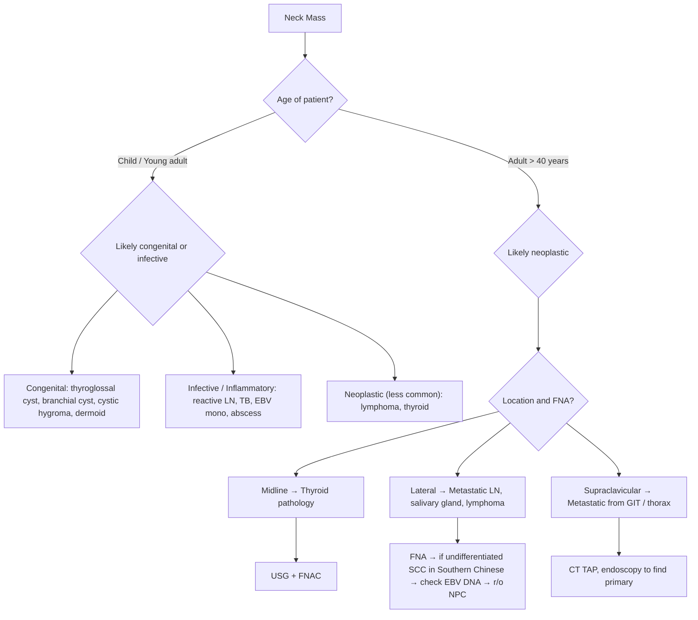

## Differential Diagnosis of Neck Mass

The differential diagnosis of a neck mass is broad, but it becomes manageable once you anchor your thinking to three axes: **age**, **location**, and **clinical behaviour** (rate of growth, consistency, mobility, etc.). This section lays out a systematic framework.

### Overarching Principle

***Swellings in the neck may be benign or malignant and in the latter case, primary or secondary.*** [1]

The first-pass clinical triage:

> ***"The age of the patient and status of the mass since it has been noticed are the two important clues towards the determination of the nature of the mass. Lesions occurring in young patients are probably congenital while those in old patients are likely to be malignant. Benign lesions grow slowly while malignant lesions increase in size rapidly."*** [1]

---

### 1. Differential Diagnosis by Broad Category

***The neck mass is classified as Benign (1. Congenital, 2. Infective) or Malignant (1. Primary, 2. Secondary).*** [8]

| Category | Subcategory | Specific Conditions | Key Distinguishing Features |
|---|---|---|---|
| **Congenital** | Midline | ***Thyroglossal duct cyst*** | Midline, at/below hyoid level. Moves with swallowing AND tongue protrusion. Classically presents when previously unrecognised cyst becomes infected during URTI [2]. Mx: ***Sistrunk procedure*** (cyst + central hyoid body + tract to foramen cecum) [2][5] |
| | | **Dermoid cyst** | Midline, submental. Does NOT move with tongue protrusion. Result of entrapment of epithelium in deep tissue — developmental abnormality or post-trauma [2] |
| | | **Thymic cyst** | Midline or anywhere between angle of mandible and midline — result of implantation of thymic tissue during embryological descent [2] |
| | Lateral | ***Branchial cleft cyst*** | ***Accounts for 20% of paediatric neck mass*** [2]. Presents in late childhood/early adulthood when cyst becomes infected. **2nd branchial cleft cyst is most common** — presents inferior to angle of mandible and anterior to SCM; sinus tract opens into tonsillar fossa [2]. 1st cleft cyst passes through parotid gland near facial nerve [2]. 3rd cleft cyst presents lower in neck, ends at pyriform sinus [2] |
| | | ***Cystic hygroma (lymphatic malformation)*** | Macrocystic lymphatic malformation. ***Transilluminates brilliantly*** [1]. Posterior triangle, usually infancy. Associated with Turner syndrome, Down syndrome [2] |
| | | **Vascular anomalies (haemangioma)** | Endothelial neoplasm with increased cellular proliferation → rapid growth then slow regression. Compressible red/bluish soft mass, bruit on auscultation. Usually resolves spontaneously [2] |
| | | **Laryngocele** | Herniation of saccule of larynx through thyrohyoid membrane — air-filled cyst, increases with Valsalva. Hoarseness, cough, foreign body sensation [2] |
| | | **Ranula** | Mucocele from obstruction of sublingual gland. "Plunging ranula" extends through mylohyoid into submandibular space [2] |
| **Infective / Inflammatory** | Bacterial | **Suppurative lymphadenopathy** | *S. aureus, Strep. pyogenes, M. tuberculosis, Brucellosis, Actinomycosis* [2]. Tender, warm, fluctuant if abscess |
| | Viral | **Reactive viral lymphadenopathy** | URTI (adenovirus, rhinovirus, enterovirus), EBV/CMV mononucleosis, HIV [2]. ***Reassuring features: LN < 1 cm (or < 1.5 cm in upper jugulodigastric chain), oblong shape, preserved vascular hilum, no central hypodensity.*** ***Alarming features: fixed and firm LN, LN > 1 cm persisting > 2 weeks after resolution of viral symptoms*** [2] |
| | Parasitic | **Toxoplasmosis** | *T. gondii* — typically acquired through inadequately cooked meat or cat faeces [2] |
| | Mycobacterial | **TB lymphadenitis (scrofula)** | ***Tuberculous infection should be suspected in those patients with poor nutritional status*** [1]. Non-tender, matted nodes, cold abscess, caseous discharging sinus. Very important DDx in Hong Kong |
| | Non-infectious inflammatory | ***Kimura's disease*** | Angiolymphoid hyperplasia with eosinophilia. ***Asian males with eosinophilia and raised IgE***. Painless cervical LN or subcutaneous mass without constitutional symptoms [2] |
| | | ***Kikuchi's disease*** | Histiocytic necrotizing lymphadenitis. ***Self-limiting, young Asian females***. Fever, headache, neutropenia, rash, tender lymphadenopathy [2] |
| | | ***Castleman's disease*** | Angiofollicular LN hyperplasia. Associated with HHV-8 and POEMS syndrome. **Unicentric** (usually asymptomatic) → surgical removal. **Multicentric** (usually symptomatic) → chemotherapy [2] |
| | | ***Rosai-Dorfman disease*** | Benign inflammatory. Lymphadenopathy + subcutaneous skin lesions/nodules [2] |
| **Neoplastic — Benign** | Thyroid | **Thyroid nodule / MNG** | ***Around 10-15% of nodules are malignant*** [5]. DDx of solitary nodule: dominant nodule in MNG, cyst, adenoma, ***toxic adenoma***, carcinoma. DDx of multiple nodules: MNG, ***toxic MNG***. Diffuse: Graves', Hashimoto's, De Quervain's [5] |
| | Salivary | ***Pleomorphic adenoma*** | ***80% of salivary tumours arise in parotid gland. Parotid tumours are usually benign (80%). Submandibular gland tumours are usually malignant (50%)*** [2]. Firm, lobulated, mobile. Risk of malignant transformation if left untreated |
| | | **Warthin's tumour** | 2nd most common parotid tumour. Bilateral 10%, males, smokers. "Hot" on Tc-99m scan |
| | Vascular | ***Carotid body tumour (paraganglioma/chemodectoma)*** | ***Pulsatile, bruit on auscultation. Mobile side-to-side but not up-and-down (Fontaine's sign)*** [2]. At carotid bifurcation. Highly vascular, typically benign [2] |
| | | **Jugulotympanic paraganglioma (glomus jugulare)** | May arise following a carotid body tumour [2] |
| | Neural | ***Schwannoma*** | Arises from Schwann cells of any peripheral nerve — commonly ***vagus nerve or superior cervical sympathetic chain*** in the neck. Vagal schwannoma → hoarseness/aspiration. Sympathetic chain → ***Horner's syndrome*** [2] |
| | Soft tissue | **Lipoma** | Soft, ill-defined, slowly enlarging mass in any location [2]. Also epidermoid inclusion cyst, dermoid, pilomatrixoma [2] |
| **Neoplastic — Malignant (Primary)** | H&N SCC | ***Metastatic H&N carcinoma*** | ***Predominantly metastatic SCC arising from the aerodigestive tract***. Masses usually asymptomatic but symptoms related to primary site can be elicited [2]. ***In southern Chinese, when FNA showed undifferentiated SCC, one of the DDx is LN metastasis from NPC. EBV DNA in blood should be checked. If elevated, endoscopic examination and random biopsies of the nasopharynx are indicated.*** [1] |
| | | ***Oropharyngeal SCC*** | ***We are seeing an increasing number of patients with carcinoma of tonsil and tongue base presenting with metastatic neck lymph node.*** [1] ***Risk factors: smoking, alcohol, oral sex (HPV related)*** [3]. ***50% cervical LN*** at presentation [3] |
| | Thyroid CA | **Papillary / Follicular / Medullary / Anaplastic** | See thyroid carcinoma table. Palpable neck lumps, rapidly enlarging lumps with pain/HOV/stridor [5][4] |
| | Lymphoma | **Hodgkin / Non-Hodgkin** | ***Neck involvement common in children with Hodgkin lymphoma (80%)***. Rubbery, non-tender LN. B symptoms (fever, night sweats, weight loss). ***When LN is rubbery in consistency and occurs in a young patient, lymphoma should be suspected. Excision of the lymph node is necessary to obtain fresh tissue for pathological examination and staging.*** [1]. ***Tonsils and tongue base may be the presenting site for a lymphoma*** [3] |
| | Salivary CA | **Mucoepidermoid CA, Adenoid cystic CA, Salivary duct CA, SCC** | Malignant subtypes of salivary gland neoplasms [2]. Facial nerve palsy with parotid mass = malignant until proven otherwise |
| **Neoplastic — Malignant (Secondary/Metastatic)** | Supraclavicular | ***Virchow's node (left)*** | ***Secondary deposits from primary malignancies in the GI tract*** [1][8]. Also lung, breast, ovary |
| | | **Right supraclavicular** | Intrathoracic malignancy (lung, oesophageal) |
| | Lower neck | **Thyroid CA metastasis** | ***Small primary papillary cancer of the thyroid may present with lower neck lymph nodes metastasis*** [1][8] |
| | Metastatic to thyroid | **RCC, colorectal, lung, breast, uterine** | Renal cell carcinoma is the most common primary to metastasise to thyroid [5] |

<Callout title="The 50-50 Rule for Salivary Gland Tumours" type="idea">
80% of salivary tumours arise in the parotid, and 80% of those are benign (so parotid → likely benign). But only 50% of submandibular gland tumours are benign — so a submandibular gland mass has a much higher pre-test probability of malignancy. This "rule of decreasing benignity" also applies to minor salivary glands: the smaller the gland, the higher the chance that a tumour arising from it is malignant.
</Callout>

---

### 2. Differential Diagnosis by Location

This is the most clinically useful framework because ***the location of the neck mass frequently gives clue to the nature of the neck mass*** [1].

#### ***Midline neck mass*** [8]

> ***"Midline neck mass in the lower neck probably arises from the thyroid gland while in the upper neck; thyroglossal cyst is the likely diagnosis."*** [1]

| Upper Midline | Lower Midline |
|---|---|
| Thyroglossal duct cyst | Thyroid nodule (isthmus) |
| Dermoid cyst | Thyroid goitre |
| Submental LN (Level Ia) | Thyroid carcinoma |
| Ranula (plunging) | Pretracheal LN |
| Thymic cyst | Laryngocele |

#### ***Lateral neck mass*** [8]

> ***"Lateral neck mass is more frequently seen than midline mass. Lesions in the upper neck may be salivary glands related. While swellings under the cover of sternomastoid muscle are likely to be lymph nodes."*** [1]

| Upper Lateral | Mid/Lower Lateral |
|---|---|
| Parotid gland pathology (tumour, parotitis) | ***Lymph node under cover of SCM*** — inflammatory or neoplastic [1][8] |
| Submandibular gland pathology | Branchial cleft cyst (anterior to SCM) |
| 1st branchial cleft cyst | Carotid body tumour (at bifurcation) |
| Submandibular / jugulodigastric LN | Schwannoma (vagal, sympathetic chain) |
| Parapharyngeal mass | Cystic hygroma (posterior triangle) |

#### ***Supraclavicular fossa mass*** [8]

> ***"Supraclavicular fossa mass may be secondary deposits from primary malignancies in gastrointestinal tract. Small primary papillary cancer of the thyroid may present with lower neck lymph nodes metastasis. Other causes of LN enlargement."*** [8]

| Left Supraclavicular (Virchow's node) | Right Supraclavicular | Either Side |
|---|---|---|
| GIT malignancy (gastric, pancreatic, colorectal, ovarian) — via thoracic duct | Intrathoracic malignancy (lung, oesophageal) — via right lymphatic duct | Lung, breast, lymphoma |
| Papillary thyroid CA (lower neck LN) | Papillary thyroid CA | TB, reactive |

Why left vs right? The thoracic duct drains most of the body (all below the diaphragm + left thorax + left upper limb) and empties into the left subclavian vein at its junction with the left internal jugular vein. Intra-abdominal malignancies therefore drain upward through retroperitoneal → thoracic duct → left supraclavicular node. The right lymphatic duct drains only the right upper limb, right thorax, and right head/neck into the right subclavian/jugular junction.

---

### 3. Differential Diagnosis of Salivary Gland Masses

This is a common examination and clinical scenario, so it deserves its own subsection.

**Primary salivary gland tumour** [2]:
- **Benign**: Pleomorphic adenoma, Monomorphic adenoma, Warthin's tumour, Lymphoepithelioma, Oncocytoma
- **Malignant**: Mucoepidermoid carcinoma, Adenoid cystic carcinoma, Salivary duct carcinoma, SCC

**Non-neoplastic DDx of a salivary gland mass** [2][7]:
- ***Salivary cysts***
- ***Salivary gland stones (sialolithiasis)***
- ***Sjögren's syndrome*** — autoimmune, bilateral parotid enlargement, dry eyes, dry mouth
- ***Metastasis from other tumours*** (e.g. scalp SCC, melanoma metastasising to intraparotid LN)
- ***Lymphoepithelial cysts*** (HIV-associated)
- ***Chronic sclerosing sialadenitis (Kuttner's tumour)*** — IgG4-related disease, submandibular
- ***Regional lymphadenopathy*** mimicking a parotid/submandibular mass

**DDx of bilateral parotid enlargement** [2]:
- ***Parotitis*** (mumps, bacterial)
- ***Bruxism*** (excess teeth grinding/jaw clenching → masseter hypertrophy mimicking parotid)
- ***Masseter hypertrophy***
- ***Sialadenosis*** — non-inflammatory, non-neoplastic hypertrophy of salivary gland, usually bilateral and painless. Associated with: ***anorexia/bulimia nervosa (self-induced vomiting), alcoholic cirrhosis, diabetes mellitus*** [2]
- ***Drug-induced (e.g. phenytoin)*** [2]

<Callout title="Red Flag: Parotid Mass + Facial Weakness" type="error">
***Facial weakness*** in the context of a parotid mass = ***high suspicion of malignant involvement of parotid gland*** [2][7]. Benign parotid tumours (e.g. pleomorphic adenoma) displace the facial nerve but do NOT invade it. ***A parotid tumour must be distinguished from Bell's palsy*** [2]. Always document facial nerve function before any intervention. Other worrying features of a parotid mass: pain/paraesthesia, mucosal ulceration, rapid growth, skin fixation [2].
</Callout>

---

### 4. Differential Diagnosis of Thyroid Nodules

***Around 10-15% of nodules are malignant*** [5]. The DDx depends on whether the patient is hyperthyroid, euthyroid, or hypothyroid:

| Presentation | DDx |
|---|---|
| **Solitary nodule** | Dominant nodule in MNG; Cyst (true simple cyst, colloid nodule); Neoplastic: adenoma, ***toxic adenoma***, carcinoma [5] |
| **Multiple nodules** | MNG (hyperplastic/adenomatous nodules with cystic degeneration), ***toxic MNG***; Multiple cysts; Multiple adenomata [5] |
| **Diffuse enlargement** | Graves' disease; Physiological (pregnancy, puberty); Hashimoto's thyroiditis; De Quervain's/subacute thyroiditis [5] |

**Features suspicious for thyroid malignancy** [5]:
- Rapidly enlarging lump → pain, HOV, stridor
- Hard, fixed nodule
- Cervical lymphadenopathy
- ***Risk factors: prior neck irradiation, FHx (MEN2, FAP), Hashimoto's (lymphoma), iodine deficiency (follicular CA)*** [4][5]

> ***Note: Follicular adenoma is NOT a risk factor of follicular CA*** [5]. This is a common misconception — they are histologically similar but do not have a benign-to-malignant progression pathway.

---

### 5. Approach to the Unknown Primary — Metastatic Cervical LN with No Obvious Primary

This is one of the most important clinical scenarios in head and neck surgery.

***"When a metastatic cervical lymph node was suspected, then endoscopic examination of the upper aerodigestive tract is mandatory."*** [1]

***"Lymph node should be investigated first rather than excised. FNA generally gives a clue to the aetiology of the enlarged lymph node."*** [1]

***"Every effort should be spent to locate the primary tumour."*** [1]

The approach is:

1. **FNA of the neck mass** — cytology + immunohistochemistry (p16 for HPV, EBER for EBV)
2. ***"In southern Chinese, when FNA showed undifferentiated squamous cell carcinoma, one of the DDx is lymph node metastasis from NPC. EBV DNA in blood should be checked. If it is elevated, endoscopic examination and random biopsies of the nasopharynx are indicated."*** [1]
3. **Panendoscopy** (direct laryngoscopy + bronchoscopy + OGD) — to examine the entire upper aerodigestive tract and biopsy suspicious areas
4. **Directed biopsies** of likely primary sites based on LN level:
   - Level II → nasopharynx (NPC), oropharynx (tonsil, tongue base)
   - Level III → hypopharynx, larynx
   - Level IV → hypopharynx, thyroid, cervical oesophagus
   - Level V → nasopharynx, skin (scalp melanoma/SCC)
   - Supraclavicular → GIT, lung, breast
5. **Imaging**: CT/MRI head and neck, PET-CT if primary still occult
6. ***Excisional biopsy of the lymph node is only done as a last resort or when the diagnosis of lymphoma is suspected*** [1]

<Callout title="Why Not Just Excise the Lymph Node?" type="error">
Excisional biopsy of a suspected metastatic LN is discouraged because it can adversely affect success of subsequent surgical resection by field contamination — tumour cell spillage into the surgical bed makes definitive neck dissection harder and worsens oncological outcome. The one important exception is lymphoma, where excisional biopsy is needed to provide adequate tissue for subtyping (FNA alone is insufficient for lymphoma classification — you need the tissue architecture). [1][2]
</Callout>

---

### 6. Key Clinical Discriminators — Putting It All Together

| Feature | Think of... | Why? |
|---|---|---|
| ***Age: young patient*** [1] | Congenital, infective, lymphoma | Congenital cysts present in childhood/young adulthood; reactive LN from infections common; lymphoma peaks in young adults |
| ***Age: old patient*** [1] | Malignant (metastatic SCC, thyroid CA, salivary CA) | Cumulative exposure to carcinogens (smoking, alcohol, EBV) |
| ***Grows slowly*** [1] | Benign (lipoma, pleomorphic adenoma, MNG) | Benign tumours grow by expansion, not invasion |
| ***Grows rapidly*** [1] | Malignant (anaplastic thyroid CA, lymphoma, metastatic SCC) | Malignant tumours have uncontrolled proliferation |
| ***Transilluminates*** [1] | Cystic hygroma | Thin-walled cyst filled with lymph fluid — light passes through easily |
| ***Pulsatile*** [1] | Carotid body tumour | Vascular tumour at carotid bifurcation, transmits arterial pulsation |
| ***Rubbery LN in young patient*** | ***Lymphoma should be suspected*** [1] | Lymphomatous LN have a characteristic rubbery-firm consistency due to uniform expansion by neoplastic lymphoid cells |
| **Moves with swallowing** | Thyroid, thyroglossal cyst | Attached to pretracheal fascia/hyoid → moves with laryngotracheal complex |
| **Moves with tongue protrusion** | Thyroglossal duct cyst (only) | Connected to foramen cecum via thyroglossal duct remnant through hyoid |
| ***Under cover of SCM*** [1] | Lymph node | Jugular chain LN run along the IJV deep to SCM |
| **Lateral mobility, no vertical mobility** | Carotid body tumour (Fontaine's sign) | Tethered vertically to carotid artery, free laterally |
| **Facial nerve palsy + parotid mass** | Malignant parotid tumour [2][7] | Benign tumours displace nerve; malignant tumours invade it |
| ***FNA: undifferentiated SCC in Southern Chinese*** [1] | NPC metastasis | Undifferentiated NPC is EBV-driven, endemic in Southern China |

---

<Callout title="High Yield Summary">

**Primary classification**: Benign (Congenital / Infective) vs Malignant (Primary / Secondary).

**Location-based DDx**:
- ***Midline lower neck → thyroid; upper neck → thyroglossal cyst***
- ***Lateral upper neck → salivary gland; under SCM → lymph node***
- ***Supraclavicular → metastatic (GIT if left/Virchow's; thoracic if right)***

**Age-based DDx**: Young = congenital/infective; Old = malignant.

**Key congenital**: Thyroglossal duct cyst (midline, moves with swallowing + tongue protrusion, Sistrunk), Branchial cleft cyst (2nd most common, anterior to SCM, upper 1/3-lower 2/3 junction of SCM), Cystic hygroma (transilluminates brilliantly, posterior triangle).

**Key inflammatory (HK)**: TB lymphadenitis (matted, cold abscess), Kimura's (Asian males, eosinophilia), Kikuchi's (young Asian females, self-limiting).

**Key neoplastic**: NPC (Southern Chinese, EBV, level II bilateral LN), oropharyngeal SCC (HPV, tonsil/tongue base, 50% cervical LN), thyroid CA (10-15% of nodules malignant), lymphoma (rubbery LN in young → excise for tissue).

**Unknown primary approach**: FNA first → EBV DNA if undifferentiated SCC in Southern Chinese → panendoscopy → directed biopsy → imaging → excisional biopsy only as last resort or for lymphoma.

**Never excise a suspected metastatic LN** without attempting to find the primary first (field contamination risk). Exception: lymphoma (need tissue architecture for subtyping).

</Callout>

---

<ActiveRecallQuiz
  title="Active Recall - Differential Diagnosis of Neck Mass"
  items={[
    {
      question: "A 55-year-old Southern Chinese man presents with a hard, non-tender left level II neck mass. FNA shows undifferentiated squamous cell carcinoma. What is the most important next step?",
      markscheme: "Check plasma EBV DNA. If elevated, perform endoscopic examination and random biopsies of the nasopharynx to rule out nasopharyngeal carcinoma. NPC is endemic in Southern China and undifferentiated SCC in a cervical LN in this population is NPC until proven otherwise."
    },
    {
      question: "Classify neck masses into 4 broad categories and give one example for each.",
      markscheme: "1) Congenital (e.g. thyroglossal duct cyst, branchial cleft cyst, cystic hygroma); 2) Infective/inflammatory (e.g. reactive lymphadenopathy, TB lymphadenitis); 3) Malignant - Primary (e.g. NPC, thyroid CA, lymphoma, salivary gland CA); 4) Malignant - Secondary/Metastatic (e.g. Virchow's node from gastric CA, metastatic lung CA). Also acceptable: Benign neoplastic as separate category (e.g. pleomorphic adenoma, carotid body tumour)."
    },
    {
      question: "A young patient presents with a rubbery, non-tender cervical lymph node and B symptoms. What diagnosis should you suspect, and why should you perform excisional biopsy rather than just FNA?",
      markscheme: "Suspect lymphoma. Excisional biopsy is needed because lymphoma subtyping requires assessment of tissue architecture and immunohistochemistry which cannot be provided by FNA cytology alone. FNA lacks material for tissue architecture or full immunohistochemical analysis."
    },
    {
      question: "Name three non-neoplastic, non-infectious inflammatory conditions that cause cervical lymphadenopathy and state one distinguishing feature of each.",
      markscheme: "1) Kimura disease - Asian males, eosinophilia, raised IgE, painless; 2) Kikuchi disease - young Asian females, self-limiting, fever, neutropenia, tender lymphadenopathy; 3) Castleman disease - HHV-8 associated, unicentric (surgical removal) vs multicentric (chemotherapy). Also acceptable: Rosai-Dorfman disease (lymphadenopathy + subcutaneous skin lesions)."
    },
    {
      question: "Why is excisional biopsy of a suspected metastatic cervical lymph node generally discouraged as a first-line investigation?",
      markscheme: "Excisional biopsy can cause field contamination by tumour cell spillage into the surgical bed, which adversely affects success of subsequent definitive surgical resection (e.g. neck dissection). The correct approach is FNA first, then endoscopic examination to locate the primary tumour. Excisional biopsy is reserved as a last resort or when lymphoma is suspected."
    },
    {
      question: "What is the differential diagnosis of bilateral parotid gland enlargement?",
      markscheme: "Parotitis (viral e.g. mumps, or bacterial); Bruxism/masseter hypertrophy (mimics parotid); Sialadenosis (non-inflammatory, non-neoplastic, associated with anorexia/bulimia, alcoholic cirrhosis, diabetes mellitus); Sjogren syndrome; Drug-induced (e.g. phenytoin). Sialadenosis is usually bilateral and painless."
    }
  ]}
/>

---

## References

[1] Lecture slides: GC 218. I have a swelling in the neck Neck mass (Notes).pdf
[2] Senior notes: felixlai.md (Neck mass differential diagnosis section, pp. 200–204)
[3] Lecture slides: GC 219. Infections and tumours in pharynx and oral cavity.pdf
[4] Senior notes: felixlai.md (Thyroid cancer / etiology section)
[5] Senior notes: maxim.md (Thyroid section, 9.1)
[7] Lecture slides: GC 217. Facial nerve palsy and salivary gland diseases.pdf
[8] Lecture slides: GC 218. I have a swelling in the neck Neck mass.pdf
