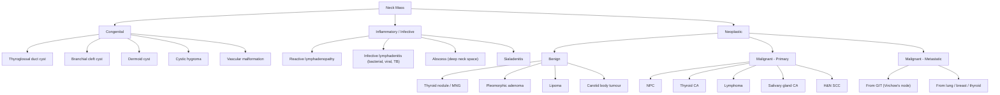

# Neck Mass

## 1. Definition

A **neck mass** (or "neck swelling"/"neck lump") is any palpable or visible mass in the neck — from the skull base to the clavicle, bounded laterally by the trapezius posteriorly and the midline anteriorly. The term is a **presenting complaint**, not a diagnosis. It is a common clinical presentation that encompasses a huge range of pathologies — from trivial (reactive lymph node in an URTI) to life-threatening (metastatic squamous cell carcinoma).

> ***"The symptom of a swelling in the neck is a common presentation of many pathologies occurring in the head and neck region. Generally, swellings in the neck may be benign or malignant and in the latter case, primary or secondary."*** [1]

The clinical approach to a neck mass is essentially a **triage exercise**: Is this congenital vs acquired? If acquired, is it inflammatory/infective or neoplastic? If neoplastic, is it benign or malignant? If malignant, is it primary or metastatic?

---

## 2. Epidemiology and Risk Factors

### 2.1 General Epidemiology

- Neck masses are among the most common surgical referrals in otolaryngology and general surgery.
- ***In young patients, lesions are probably congenital; in old patients, they are likely to be malignant.*** [1] This is the single most useful heuristic for the clinical approach.
- In children and young adults (< 20 years), the majority of neck masses are **inflammatory/infective** (reactive lymphadenopathy from URTI, EBV mononucleosis) or **congenital** (thyroglossal duct cyst, branchial cleft cyst, dermoid cyst, cystic hygroma).
- In adults > 40 years, particularly those with risk factors (smoking, alcohol, betel nut), the **"malignant until proven otherwise"** rule applies — a persistent neck mass > 2–3 weeks in a middle-aged or elderly patient warrants urgent investigation for malignancy.

### 2.2 Key Risk Factors (for malignant neck masses)

- **Smoking** — classical risk factor for head and neck squamous cell carcinoma (HNSCC) [2][3]
- **Alcoholism** — synergism with smoking for HNSCC [2][3]
- **HPV infection (Types 16, 18)** — ***HPV-associated H&N cancer occur primarily in the oropharynx including tonsils and the base of tongue*** [3]. Presents in ***young male patients who have a higher lifetime number of sexual partners and oral sex*** [3].
- **EBV infection** — the ***primary etiological agent in pathogenesis of NPC*** [2]. Endemic in Southern China including Hong Kong.
- **Dietary factors** — ***salted fish, preserved or fermented food*** (contain high levels of nitrosamines) — risk factor for NPC [2]
- **Prior head and neck irradiation** — risk factor for thyroid carcinoma and second primary H&N cancers [4]
- **Family history** — NPC (certain HLA haplotypes), thyroid carcinoma (MEN2, FAP), lymphoma [2][4]
- **Immunosuppression** — increases risk for lymphoma
- ***5Ss for oral/oropharyngeal cancer: Smoking + Spirits + Sharp teeth + Sex (male/oral) + Spicy food*** [3]

<Callout title="Hong Kong Context">
NPC is endemic in Southern China including HK. A young Chinese man presenting with a neck mass + nasal symptoms + unilateral serous otitis media = NPC until proven otherwise. Always check EBV serology (VCA IgA, EA IgA) and plasma EBV DNA. [2]
</Callout>

---

## 3. Anatomy and Function

Understanding neck anatomy is essential because ***the location of the neck mass frequently gives clue to the nature of the neck mass*** [1].

### 3.1 Triangles of the Neck

The neck is divided by the sternocleidomastoid (SCM) muscle into two major triangles:

| Triangle | Boundaries | Key Contents |
|---|---|---|
| **Anterior triangle** | Anterior: midline; Posterior: SCM; Superior: mandible | Submandibular gland, submental LNs, carotid sheath (common carotid artery, IJV, vagus nerve), thyroid gland, larynx, trachea, pharynx, oesophagus |
| **Posterior triangle** | Anterior: SCM; Posterior: trapezius; Inferior: clavicle | Spinal accessory nerve (CN XI), cervical plexus, subclavian vessels, brachial plexus, supraclavicular LNs |

The anterior triangle is further subdivided into:
- **Submental triangle** — between the two anterior bellies of digastric
- **Submandibular (digastric) triangle** — floor contains submandibular gland
- **Carotid triangle** — contains carotid bifurcation, carotid body
- **Muscular triangle** — contains thyroid gland, strap muscles, trachea

### 3.2 Cervical Lymph Node Levels

This is the standardized classification used universally for head and neck surgery and oncology:

| Level | Name | Anatomical Boundaries | Common Pathology |
|---|---|---|---|
| **Ia** | Submental | Between anterior bellies of digastric, above hyoid | Floor of mouth / anterior tongue CA metastasis |
| **Ib** | Submandibular | Within digastric triangle | Submandibular gland tumours, oral cavity CA metastasis |
| **II** | Upper jugular | Skull base to hyoid, anterior to posterior border of SCM | NPC, oropharyngeal CA, supraglottic laryngeal CA |
| **IIa** | | Anterior to spinal accessory nerve | |
| **IIb** | | Posterior to spinal accessory nerve | |
| **III** | Middle jugular | Hyoid to cricoid | Hypopharyngeal CA, laryngeal CA, thyroid CA |
| **IV** | Lower jugular | Cricoid to clavicle | Thyroid CA, hypopharyngeal CA, cervical oesophageal CA |
| **V** | Posterior triangle | Behind posterior border of SCM | NPC, skin CA, lymphoma |
| **Va** | | Above inferior belly of omohyoid | |
| **Vb** | | Below inferior belly of omohyoid | |
| **VI** | Central/visceral compartment | Between carotid sheaths, hyoid to sternum | Thyroid CA (level VI = central compartment nodes) |
| **VII** | Superior mediastinal | Below suprasternal notch, in superior mediastinum | Thyroid CA, oesophageal CA |

> ***A supraclavicular fossa mass may be secondary deposits from primary malignancies in the gastrointestinal tract. Sometimes patients with a small primary papillary cancer of the thyroid may also present with lower neck lymph nodes metastasis.*** [1]

<Callout title="Why Location Matters" type="idea">
A mass at level II in a young man in Hong Kong → think NPC first (metastatic LN from fossa of Rosenmüller). A mass at level VI → think thyroid pathology. A left supraclavicular node (Virchow's node / Troisier's sign) → think abdominal malignancy (gastric, pancreatic, colorectal) draining via the thoracic duct. A right supraclavicular node → think intrathoracic malignancy (lung, oesophageal).
</Callout>

### 3.3 Key Structures in the Neck

#### Thyroid Gland
- ***Level C5–C7*** [5]. Enclosed by the pretracheal layer of the deep cervical fascia (false capsule) and its own true capsule.
- Two lobes connected by isthmus. May have a pyramidal lobe (embryological remnant of thyroglossal duct).
- **Arterial supply**: Superior thyroid artery (from external carotid artery) and inferior thyroid artery (from thyrocervical trunk of subclavian artery). Occasionally, thyroid ima artery from brachiocephalic artery.
- **Venous drainage**: Superior and middle thyroid veins → IJV; inferior thyroid veins → left brachiocephalic vein.
- **Nerve relations**:
  - ***Recurrent laryngeal nerve (RLN)***: runs in the tracheo-oesophageal groove, close to the inferior thyroid artery. Right RLN loops around the right subclavian artery; left RLN loops around the aortic arch. Injury → **hoarseness of voice** (vocal cord palsy).
  - ***External branch of the superior laryngeal nerve (EBSLN)***: runs close to the superior thyroid artery superior pole. Injury → loss of voice projection, inability to hit high notes (denervation of cricothyroid muscle).
- **Parathyroid glands**: 4 glands embedded in or near the posterior capsule of the thyroid. Inadvertent removal → hypoparathyroidism → hypocalcaemia.

#### Parotid Gland [6]
- The largest salivary gland, located overlying the masseter and ramus of the mandible.
- ***The facial nerve (CN VII) runs through the parotid gland***, dividing it into a superficial lobe and a deep lobe. The nerve exits the stylomastoid foramen and branches into: **T**emporal, **Z**ygomatic, **B**uccal, **M**arginal mandibular, **C**ervical branches.
  - Mnemonic: **"T**o **Z**anzibar **B**y **M**otor **C**ar"
- ***Parotid duct (Stensen's duct)*** emerges from the anterior border of the gland, crosses the masseter, pierces the buccinator, and opens into the oral cavity opposite the second upper molar tooth.
- Superficial to the gland: greater auricular nerve (sensation to ear lobule — at risk during parotid surgery).

#### Submandibular Gland
- Located in the submandibular (digastric) triangle.
- **Wharton's duct** drains into the floor of the mouth at the sublingual papilla, lateral to the frenulum of the tongue.
- Important nerve relations:
  - **Lingual nerve**: runs superficial to the gland, then dips deep to Wharton's duct, then crosses back superficially — "The lingual nerve took a curve, around the hyoglossus; 'Well I'll be damned,' said Wharton's duct, 'the nerve has crossed right over us!'"
  - **Marginal mandibular branch of facial nerve**: runs superficial to the submandibular gland, just deep to the platysma and deep cervical fascia, approximately 1 cm below the mandible (or up to 2 cm below in the elderly). At risk in submandibular gland excision.
  - **Hypoglossal nerve (CN XII)**: runs deep to the gland. Injury → ipsilateral tongue deviation towards the lesion side (because the contralateral genioglossus is unopposed).

#### Carotid Sheath
- Contains: common carotid artery (medially), internal jugular vein (laterally), vagus nerve (between/posterior).
- **Carotid body** is located at the carotid bifurcation (approximately at the level of the superior border of the thyroid cartilage). It is a chemoreceptor (senses O₂, CO₂, pH). A **carotid body tumour** (paraganglioma/chemodectoma) arises from it.

### 3.4 Fascial Planes of the Neck

The deep cervical fascia has three layers:
1. **Investing (superficial) layer** — encloses SCM and trapezius, also forms the parotid and submandibular gland capsules
2. **Pretracheal (middle) layer** — encloses thyroid gland, trachea, oesophagus, strap muscles
3. **Prevertebral (deep) layer** — encloses vertebral column, prevertebral muscles, scalene muscles

The **retropharyngeal space** (between the middle and deep layers) is clinically important because retropharyngeal abscesses can spread inferiorly into the mediastinum (danger space).

---

## 4. Etiology (Focus on Hong Kong)

The etiologies of neck masses can be systematically organized. Here is a comprehensive classification:

### 4.1 Congenital / Developmental

| Condition | Key Features |
|---|---|
| **Thyroglossal duct cyst** | Most common congenital midline neck mass. Arises from remnant of thyroglossal duct (tract from foramen cecum of tongue to thyroid). ***Moves with swallowing AND tongue protrusion*** (because attached to hyoid via duct remnant). Usually midline, below hyoid. Risk of thyroglossal duct carcinoma (usually papillary). Treatment: ***Sistrunk procedure*** (excision of cyst + central portion of hyoid bone + tract up to foramen cecum). |
| **Branchial cleft cyst** | Most common lateral congenital neck mass. Second branchial cleft anomaly is most common (>90%). Located at ***anterior border of SCM, at junction of upper 1/3 and lower 2/3***. May present as cyst, sinus, or fistula. |
| **Dermoid cyst** | Midline, submental. Does NOT move with swallowing or tongue protrusion (unlike thyroglossal cyst). |
| **Cystic hygroma (lymphatic malformation)** | ***Transilluminates brilliantly*** [1]. Located in the posterior triangle (often left side). Usually presents in infancy. Can become very large and compromise the airway. Associated with Turner syndrome (45,XO) and Down syndrome. |
| **Vascular malformation** | Haemangioma (most common in infancy, often involutes spontaneously), arteriovenous malformation. |
| **Laryngocele** | Air-filled herniation of the laryngeal saccule through the thyrohyoid membrane. Increases in size with Valsalva. |

### 4.2 Infective / Inflammatory

| Condition | Key Features |
|---|---|
| **Reactive lymphadenopathy** | Most common cause of neck mass in children and young adults. Usually secondary to URTI. Tender, mobile, rubbery. Resolves with treatment of infection. |
| **Infective lymphadenitis** | Bacterial: often Staphylococcus aureus, Streptococcus. Viral: EBV (infectious mononucleosis), CMV, HIV. Mycobacterial: TB lymphadenitis (scrofula) — common in Hong Kong. Presents as a non-tender, matted lymph node, often with a cold abscess and skin sinus. |
| **TB lymphadenitis (scrofula)** | ***Very important in Hong Kong***. Cervical lymph nodes most commonly involved. Caseating granulomas on histology. Ziehl-Neelsen stain for AFB. Culture on Lowenstein-Jensen medium. Treatment: standard anti-TB therapy (RIPE x 2 months + RI x 4 months). |
| **Abscess** | Deep neck space infection. Can arise from dental infection, tonsillitis, parotitis. Ludwig's angina = bilateral submandibular space infection → floor of mouth elevation, "hot potato" voice, airway compromise. |
| ***Suppurative parotitis*** [6] | ***Acute infection of the parotid gland. Occurs in the setting of debilitation, dehydration and poor oral hygiene, particularly among the elderly post-operative patients.*** Most common organism: ***Staphylococcus aureus*** [6]. |
| **Sialadenitis** | Inflammation of salivary glands. Obstructive (calculus → 80% in submandibular gland because Wharton's duct is long, upward-draining, and the saliva is more viscous/alkaline) or infective. |
| **Cat-scratch disease** | *Bartonella henselae*. Self-limiting lymphadenopathy. |
| **Toxoplasmosis** | *Toxoplasma gondii*. Painless cervical lymphadenopathy. |

### 4.3 Neoplastic — Benign

| Condition | Key Features |
|---|---|
| **Thyroid nodule / Multinodular goitre (MNG)** | Very common. ***Around 10-15% of nodules are malignant*** [5]. Moves with swallowing. |
| **Pleomorphic adenoma** | ***Most common salivary gland tumour***. Usually in the parotid (80%). Firm, lobulated, mobile. **Mixed tumour** (epithelial + myoepithelial + mesenchymal). Risk of malignant transformation if left untreated (→ carcinoma ex pleomorphic adenoma). |
| **Warthin's tumour (papillary cystadenoma lymphomatosum)** | Second most common parotid tumour. Bilateral in 10%. More common in males, smokers. "Hot" on Tc-99m pertechnetate scan (unlike most salivary tumours which are "cold"). |
| **Lipoma** | Soft, non-tender, lobulated. "Slip sign" on palpation. Located in posterior triangle or subcutaneous. |
| **Carotid body tumour (paraganglioma / chemodectoma)** | Located at carotid bifurcation. ***Pulsatile*** [1]. Lateral mobility but no vertical mobility (Fontaine's sign). Splays the internal and external carotid arteries ("lyre sign" on angiography). |

### 4.4 Neoplastic — Malignant (Primary)

| Condition | Key Features |
|---|---|
| ***Nasopharyngeal carcinoma (NPC)*** | ***Predominant tumour type arising in nasopharynx. Frequently originates from pharyngeal recess known as fossa of Rosenmüller.*** [2] ***Endemic in Southern China including Hong Kong.*** [2] Often presents with neck mass (metastatic LN, usually level II, often bilateral). Other features: epistaxis, nasal obstruction, serous otitis media (due to Eustachian tube blockage), cranial nerve palsies (III-VI, IX-XII) from skull base invasion. Histology: ***undifferentiated (non-keratinizing) is the most common endemic form in HK, strongly associated with EBV.*** [2] |
| **Thyroid carcinoma** | Papillary (85%, lymphatic spread, young), Follicular (10-15%, haematogenous spread to bone and lung, middle age), Medullary (3%, C cells, calcitonin, MEN2), Anaplastic (1%, elderly, very poor prognosis). [4][5] |
| **Lymphoma** | Hodgkin (painless rubbery lymphadenopathy, Reed-Sternberg cells, often in young adults) or Non-Hodgkin (may involve Waldeyer's ring — ***tonsils and tongue base may be the presenting site for a lymphoma*** [3]). |
| **Salivary gland carcinoma** | Mucoepidermoid carcinoma (most common malignant salivary gland tumour, especially in parotid), adenoid cystic carcinoma (slow growth, perineural invasion → pain, distant metastasis to lungs), acinic cell carcinoma. |
| **H&N squamous cell carcinoma** | Primary sites: oral cavity, oropharynx, hypopharynx, larynx. ***4 Factors for H&N cancer = HPV + EBV + Smoking + Alcoholism*** [3]. May present with a neck mass as the first sign (metastatic LN), sometimes with unknown primary. |

### 4.5 Neoplastic — Malignant (Metastatic / Secondary)

- **Metastatic lymph nodes** are the most common cause of a malignant neck mass in adults.
- The location of the metastatic LN often gives a clue to the primary site (see Level table above).
- ***Supraclavicular fossa mass may be secondary deposits from primary malignancies in the gastrointestinal tract*** [1]:
  - **Left supraclavicular (Virchow's) node** (Troisier's sign) → intra-abdominal malignancy (stomach, pancreas, colon, ovary) via thoracic duct
  - **Right supraclavicular node** → intrathoracic malignancy (lung, oesophagus)
  - **Either side** → lung, breast
- **Metastatic thyroid cancer to neck LN**: papillary thyroid carcinoma commonly metastasizes to level VI (central compartment) and lateral neck (levels II-IV) [4]

### 4.6 Other / Miscellaneous

| Condition | Key Features |
|---|---|
| **Salivary gland calculus (sialolithiasis)** | 80% submandibular. Presents with recurrent painful swelling of gland, especially at mealtimes (when saliva production increases but cannot drain). Bimanual palpation may reveal a stone in Wharton's duct. |
| **Ranula** | Mucocele of sublingual gland. "Plunging ranula" extends through the mylohyoid muscle into the submandibular space → can present as a neck mass. |
| **Ludwig's angina** | Bilateral submandibular space infection. Usually odontogenic (2nd/3rd molars have roots below mylohyoid line). Presents with floor of mouth swelling, trismus, drooling, "hot potato" voice. Airway emergency — can cause rapid airway compromise. |

---

## 5. Pathophysiology (Condition-Specific)

### 5.1 Why Does NPC Commonly Present with Neck Mass?

The nasopharynx is a ***clinically occult site*** [2] — it is located deep and posterior, not easily visible or palpable. The nasopharyngeal mucosa has a rich lymphatic drainage, and the fossa of Rosenmüller is a mucosal recess with numerous lymphoid tissue. Therefore:

1. The primary tumour grows silently in the pharyngeal recess.
2. It metastasizes early to cervical lymph nodes (usually level II, bilateral in up to 50% of cases) due to the rich lymphatic network.
3. ***Lymph node metastasis are usually present at diagnosis and commonly bilateral*** [2].
4. ***Patient will present with locally or regionally advanced disease due to prolonged asymptomatic period or due to missed diagnosis*** [2].

> This is why a neck mass + nasal symptoms + unilateral conductive hearing loss (serous otitis media from Eustachian tube blockage) in a Southern Chinese patient = NPC until proven otherwise.

### 5.2 Why Does Thyroglossal Duct Cyst Move with Tongue Protrusion?

During embryological development, the thyroid gland descends from the foramen cecum at the base of the tongue through the thyroglossal duct to its final position in the anterior neck. The thyroglossal duct normally obliterates but if it persists, a cyst can form anywhere along this tract. The duct is connected to the hyoid bone (it passes through or in front of the hyoid body), and the hyoid is attached to the base of the tongue via the hyoglossus muscle. When the tongue protrudes, it pulls the hyoid forward, which in turn tugs on the thyroglossal duct remnant, causing the cyst to move upward. This distinguishes it from other midline masses.

### 5.3 Why Do 80% of Salivary Calculi Occur in the Submandibular Gland?

Three reasons:
1. **Wharton's duct is longer** than Stensen's duct (parotid) and has a more tortuous course — longer transit time for saliva.
2. **The duct drains upward** (against gravity) — saliva tends to pool.
3. **Submandibular saliva is more viscous and alkaline** with a higher mucin and calcium content — this favours stone formation.

### 5.4 Why Does a Carotid Body Tumour Have Lateral But Not Vertical Mobility?

The carotid body tumour grows within the adventitia of the carotid artery at the bifurcation. It is **tethered to the carotid** vessels vertically (along the long axis of the vessels) but can be moved **side-to-side** (perpendicular to the vessels). This is **Fontaine's sign** and helps distinguish it from a lymph node (which is mobile in all directions) or a fixed metastatic node (immobile in all directions).

### 5.5 Pathophysiology of Key Head & Neck Cancers

#### Nasopharyngeal Carcinoma (NPC)

- **EBV-driven**: EBV infects nasopharyngeal epithelial cells → expression of latent membrane proteins (LMP1, LMP2) → activation of NF-κB and PI3K/Akt signalling → cell proliferation, inhibition of apoptosis, immune evasion.
- **Nitrosamine co-carcinogens**: dietary nitrosamines (from salted fish and preserved food) → DNA adduct formation → genotoxic damage → synergises with EBV to promote carcinogenesis.
- **Genetic susceptibility**: certain HLA haplotypes (HLA-A2, HLA-B46 in Cantonese) → impaired immune clearance of EBV-infected cells.

#### Oropharyngeal SCC (HPV-related) [3]

- ***HPV infection can induce two viral oncoproteins E6 and E7 which inactivate tumour suppressor p53 and Rb leading to tumour promotion*** [3].
- E6 protein → binds and degrades p53 (via E6AP ubiquitin ligase) → loss of cell cycle arrest and apoptosis.
- E7 protein → binds and inactivates Rb → release of E2F transcription factor → uncontrolled S-phase entry → proliferation.
- ***Define a distinct subset of patients compared with HPV-negative tobacco or alcohol-driven oropharynx cancer with: frequent LN metastasis, higher response rate to induction chemotherapy, better prognosis*** [3].

#### Thyroid Carcinoma [4][5]

| Type | Cell of Origin | Spread | Key Molecular Alterations |
|---|---|---|---|
| **Papillary** | Follicular cells | Lymphatic (to level VI) | BRAF V600E mutation (most common), RET/PTC rearrangement |
| **Follicular** | Follicular cells | Haematogenous (bone, lung) | RAS mutations, PAX8-PPARγ rearrangement |
| **Medullary** | C cells (parafollicular) | Lymphatic | RET proto-oncogene mutation (MEN2A/2B: germline; sporadic: somatic) |
| **Anaplastic** | Dedifferentiated follicular cells | Both | TP53 mutations, BRAF, often from dedifferentiation of differentiated carcinoma |

---

## 6. Classification of Neck Masses

### 6.1 By Etiology (Most Common Clinical Classification)

### 6.2 By Location

***The location, size, consistency, mobility, transillumination, pulsation and tenderness of the swelling are also important features that contribute towards diagnosis.*** [1]

| Location | Think of... |
|---|---|
| **Midline** | Thyroglossal duct cyst, dermoid cyst, thyroid nodule/goitre, submental lymph node, laryngocele |
| **Lateral – anterior triangle** | Lymphadenopathy (reactive/metastatic/lymphoma), branchial cleft cyst, salivary gland (submandibular, parotid), carotid body tumour |
| **Lateral – posterior triangle** | Cystic hygroma, lymphoma, metastatic LN (NPC, thyroid CA), spinal accessory nerve schwannoma |
| **Supraclavicular** | Metastatic LN (Virchow's node from GIT; lung/breast on either side), lymphoma, subclavian artery aneurysm |
| **Submental** | Reactive LN, dermoid cyst, ranula, floor of mouth CA metastasis |
| **Submandibular** | Submandibular gland pathology (calculus, sialadenitis, tumour), submandibular LN |
| **Parotid region** | Parotid tumour (pleomorphic adenoma, Warthin's, mucoepidermoid CA), parotitis |

### 6.3 By Age

***Lesions occurring in young patients are probably congenital while those in old patients are likely to be malignant. Benign lesions grow slowly while malignant lesions increase in size rapidly.*** [1]

| Age Group | Most Likely Etiologies |
|---|---|
| **Children (< 15 years)** | Congenital (thyroglossal cyst, branchial cyst, cystic hygroma, dermoid), infective (reactive LN, TB, atypical mycobacterial), lymphoma |
| **Young adults (15-40)** | Infective (EBV mononucleosis, TB), congenital, lymphoma, thyroid, NPC |
| **Middle-aged / elderly ( > 40)** | Metastatic SCC (H&N primary), thyroid CA, NPC, lymphoma, salivary gland CA |

<Callout title="The 80-80-80 Rule for Neck Masses" type="idea">
In adults > 40 years with a neck mass: approximately 80% of non-thyroid neck masses are neoplastic; of these, 80% are malignant; of the malignant ones, 80% are metastatic (rather than primary). This is a useful clinical heuristic.
</Callout>

---

## 7. Clinical Features

### 7.1 Symptoms

| Symptom | Pathophysiological Basis |
|---|---|
| **Neck swelling/lump** | The presenting complaint. Rate of growth matters: ***benign lesions grow slowly while malignant lesions increase in size rapidly*** [1]. Sudden increase may indicate haemorrhage into a cyst (e.g. thyroid cyst) or rapid tumour growth (anaplastic thyroid CA). |
| **Pain in the neck mass** | Inflammation/infection (parotitis, lymphadenitis, abscess), haemorrhage into a cyst, rapid growth in aggressive malignancy (e.g. anaplastic thyroid CA), neural invasion. Note: most malignant masses are initially **painless**. |
| ***Sore throat*** [3] | Pharyngeal tumour (oropharyngeal SCC, tonsillar lymphoma, hypopharyngeal SCC). Also tonsillitis, peritonsillar abscess. |
| ***Referred otalgia (ear pain)*** [3] | Shared sensory innervation via CN IX (Jacobson's nerve) and CN X (Arnold's nerve) between the pharynx/larynx and the ear. Pharyngeal tumour → afferent pain via glossopharyngeal/vagal nerve → referred to the ipsilateral ear. ***This is a RED FLAG for H&N cancer!*** |
| ***Dysphagia / odynophagia*** [3] | Direct tumour mass effect on the pharynx/oesophagus, or extrinsic compression by a large neck mass. Oropharyngeal/hypopharyngeal SCC commonly presents with dysphagia. |
| ***Muffled ("hot potato") speech*** [3] | Tumour or abscess in the oropharynx (e.g. tonsillar mass, peritonsillar abscess) causes the palate and tongue base to be displaced, altering resonance. |
| **Hoarseness of voice (HOV)** | Recurrent laryngeal nerve involvement (thyroid CA invading RLN, or metastatic LN encasing RLN), or laryngeal carcinoma directly involving the vocal cords. ***Compression symptoms: dysphagia, SOB (stridor), HOV*** [5]. |
| **Stridor / dyspnoea** | Extrinsic airway compression (large thyroid goitre, especially retrosternal; deep neck space abscess) or intrinsic tumour (laryngeal CA). |
| **Nasal obstruction / epistaxis** | NPC arising in nasopharynx blocks the posterior choana. Tumour vascularity causes epistaxis. |
| **Unilateral serous otitis media / conductive hearing loss** | NPC blocks the ipsilateral Eustachian tube opening in the nasopharynx → negative middle ear pressure → serous effusion. In a Chinese adult with unilateral middle ear effusion, always rule out NPC. |
| **Cranial nerve palsies** | NPC invading skull base (cavernous sinus: CN III, IV, V1, V2, VI; jugular foramen: CN IX, X, XI; hypoglossal canal: CN XII). |
| **Weight loss, night sweats, fever (B symptoms)** | Lymphoma. Constitutional symptoms suggest a systemic malignancy. |
| **Thyrotoxic symptoms** (palpitations, tremor, weight loss, heat intolerance, diarrhoea) | Toxic nodule, toxic MNG, or Graves' disease. |
| **Hypothyroid symptoms** (fatigue, cold intolerance, constipation, dry skin) | Hashimoto's thyroiditis (most common cause of hypothyroidism in Hong Kong). |
| **Symptoms at mealtimes** (pain, swelling of gland with eating) | Salivary duct obstruction (sialolithiasis) — increased saliva production during eating cannot drain past the stone → painful gland distension. |
| ***Trismus (inability to open mouth)*** [3] | Tumour infiltrating the pterygoid muscles or masticator space (e.g. advanced oral cavity or oropharyngeal SCC). Also peritonsillar abscess. |

### 7.2 Signs

| Sign | Pathophysiological Basis |
|---|---|
| ***Location of neck mass*** [1] | As described above — location gives the best initial clue to aetiology. |
| **Consistency** | Cystic (fluid-filled: branchial cyst, thyroglossal cyst, thyroid cyst); Firm-rubbery (lymphoma, reactive LN); Hard (metastatic carcinoma, anaplastic thyroid CA); Soft (lipoma, cystic hygroma). |
| **Mobility** | Mobile: benign (reactive LN, lipoma, branchial cyst). Fixed: malignant (metastatic LN fixed to surrounding structures). Carotid body tumour: mobile laterally but not vertically (Fontaine's sign). |
| ***Transillumination*** [1] | A mass that ***transilluminates brilliantly*** is a cystic hygroma (lymphatic malformation). Thyroglossal and branchial cysts may transilluminate partially. Solid masses do not transilluminate. |
| ***Pulsation*** [1] | A ***pulsatile*** mass at the carotid bifurcation = carotid body tumour (paraganglioma). Also consider carotid artery aneurysm or arteriovenous malformation. |
| **Tenderness** | Suggests inflammation/infection (abscess, sialadenitis, thyroiditis) or haemorrhage into a cyst. |
| **Moves with swallowing** | Mass attached to the laryngotracheal complex → thyroid gland pathology (goitre, thyroid nodule, thyroid CA), thyroglossal duct cyst. The thyroid is enclosed by the pretracheal fascia which is attached to the larynx/trachea, so it moves when the larynx moves on swallowing. |
| **Moves with tongue protrusion** | Thyroglossal duct cyst — because the duct remnant is connected via the hyoid to the tongue base. This sign distinguishes it from other midline neck masses. |
| ***Asymmetrical tonsil*** [3] | Unilateral tonsillar enlargement suggests tonsillar carcinoma or lymphoma (until proven otherwise — must biopsy). Also peritonsillar abscess (quinsy). ***50% cervical LN*** involvement in oropharyngeal tumours [3]. |
| ***Mass / ulcer in oral cavity or pharynx*** [3] | Direct visualization on examination. Oral cavity tumour (floor of mouth, tongue, buccal mucosa), oropharyngeal tumour (tonsil, base of tongue, soft palate). |
| **Facial nerve palsy** | Parotid malignancy (especially adenoid cystic carcinoma, mucoepidermoid carcinoma) invading the facial nerve. A parotid mass + facial nerve palsy = malignant until proven otherwise. [7] |
| **Horner's syndrome** (miosis, ptosis, anhidrosis) | Sympathetic chain involvement — advanced malignancy at the skull base or neck (NPC, Pancoast tumour, cervical metastasis). |
| **Vocal cord palsy** | Recurrent laryngeal nerve palsy from thyroid CA, lung apex tumour, oesophageal CA, or metastatic LN in the tracheo-oesophageal groove. Always do flexible nasolaryngoscopy to assess vocal cords before thyroid surgery. |
| **Skin changes over the mass** | Erythema (abscess, inflammatory), fungation (advanced malignancy), sinus (TB: caseous discharging sinus), scar (previous surgery). |
| **Retrosternal extension** | Large thyroid goitre can extend behind the sternum — assess by percussing over the sternum and noting dullness, or by inability to palpate the lower border of the thyroid (Pemberton's sign: raising both arms above the head causes facial plethora, cyanosis, and distended neck veins due to thoracic inlet obstruction). |

<Callout title="Red Flags in a Neck Mass" type="error">
The following features in a neck mass should prompt urgent investigation for malignancy:
1. Age > 40 years, especially with smoking/alcohol history
2. Mass persisting > 2–3 weeks without obvious infective cause
3. Hard, fixed, non-tender mass
4. Progressive increase in size
5. Associated cranial nerve palsy (facial nerve, RLN, skull base)
6. Referred otalgia with dysphagia/odynophagia
7. Unilateral serous otitis media in a Southern Chinese adult
8. Unilateral tonsillar enlargement
9. Hoarseness of voice > 3 weeks
10. Weight loss / B symptoms
</Callout>

---

## 8. Clinical Approach to a Patient with a Neck Mass

### 8.1 History

A systematic history should cover:

1. **Mass characteristics**: onset, duration, rate of growth, fluctuation in size, pain
2. **Associated symptoms**: 
   - Head & neck: nasal obstruction, epistaxis, hearing loss, otalgia, sore throat, dysphagia, odynophagia, voice change, trismus
   - Thyroid: palpitations, tremor, weight change, heat/cold intolerance
   - Constitutional: fever, night sweats, weight loss (B symptoms)
   - Salivary: relation to meals
3. **Risk factors**: smoking, alcohol, betel nut, oral sex (HPV), dietary (salted fish), family history (NPC, thyroid CA, lymphoma), prior radiation, immunosuppression, travel (TB exposure), occupation
4. **Past history**: previous malignancy, previous H&N surgery/radiation, dental problems

### 8.2 Physical Examination

***The location, size, consistency, mobility, transillumination, pulsation and tenderness of the swelling are also important features that contribute towards diagnosis.*** [1]

1. **Inspection**: site, size, skin changes (erythema, sinus, ulceration, surgical scars)
2. **Palpation**: 
   - Characteristics: consistency (cystic, firm, hard, rubbery, soft), surface (smooth, lobulated, irregular), tenderness, temperature
   - Mobility: in all planes; relation to underlying structures
   - Special tests: swallowing test (thyroid/thyroglossal), tongue protrusion (thyroglossal)
3. **Transillumination**: cystic hygroma, cystic masses
4. **Auscultation**: bruit (carotid body tumour, AV malformation, thyrotoxic goitre)
5. **Complete H&N examination**:
   - ***Oral cavity and oropharynx examination*** [3]: look for mucosal lesions, asymmetrical tonsils, floor of mouth swelling
   - Anterior rhinoscopy / flexible nasendoscopy: to examine nasopharynx (NPC), larynx (vocal cords)
   - Ear examination: otoscopy for middle ear effusion (suggests NPC)
   - ***Thyroid examination: swallowing test, tongue tug test, palpation (diffuse vs solitary nodule vs MNG), cervical LN, trachea position*** [5]
   - Cranial nerve examination: particularly CN V, VII, IX, X, XI, XII
6. **General examination**: lymphadenopathy elsewhere, hepatosplenomegaly (lymphoma), skin examination (melanoma metastasis)

<Callout title="Examination Pearls" type="idea">
- Always examine the oral cavity, pharynx, and larynx in ANY patient presenting with a neck mass. The primary tumour is often hidden in the nasopharynx, oropharynx, or hypopharynx.
- A parotid mass must have facial nerve function documented before any intervention.
- Every thyroid mass requires vocal cord assessment before surgery.
</Callout>

---

<Callout title="High Yield Summary">

**Definition**: Any palpable/visible mass in the neck — a presenting complaint, not a diagnosis.

**Age rule**: Young = likely congenital; Old = likely malignant.

**Location rule**: Midline → thyroid or thyroglossal duct cyst; Lateral → LN, salivary gland, branchial cyst; Supraclavicular → metastatic (Virchow's node = GIT, right side = thoracic).

**80-80-80 rule**: In adults > 40, 80% of non-thyroid neck masses are neoplastic; 80% of neoplastic are malignant; 80% of malignant are metastatic.

**HK-specific**: NPC (EBV-related, endemic), TB lymphadenitis (scrofula), oropharyngeal SCC (HPV-related).

**Key physical signs**: Transillumination (cystic hygroma), pulsation (carotid body tumour), moves with swallowing (thyroid), moves with tongue protrusion (thyroglossal cyst), facial nerve palsy (parotid malignancy), Fontaine's sign (carotid body tumour).

**Red flags**: > 40 years, > 2-3 weeks, hard/fixed, associated CN palsy, referred otalgia, unilateral serous otitis media, progressive growth, hoarseness > 3 weeks.

**Risk factors for H&N malignancy**: Smoking, alcohol, HPV (oropharyngeal), EBV (NPC), salted fish (NPC), prior radiation (thyroid CA).

**5Ss for oral/oropharyngeal CA**: Smoking, Spirits, Sharp teeth, Sex (male/oral), Spicy food.

</Callout>

---

<ActiveRecallQuiz
  title="Active Recall - Neck Mass (Definition to Clinical Features)"
  items={[
    {
      question: "An adult over 40 presents with a persistent non-tender neck mass for 4 weeks. What is the 80-80-80 rule and what should you assume?",
      markscheme: "80% of non-thyroid neck masses in adults over 40 are neoplastic; 80% of those are malignant; 80% of malignant are metastatic. Assume malignant until proven otherwise and investigate urgently."
    },
    {
      question: "A 45-year-old Southern Chinese man presents with a left level II neck mass, unilateral hearing loss, and nasal obstruction. What is the most likely diagnosis, where does the tumour arise, and what is the primary aetiological agent?",
      markscheme: "Nasopharyngeal carcinoma (NPC). Arises from pharyngeal recess (fossa of Rosenmuller) in nasopharynx. Primary aetiological agent is EBV. Endemic in Southern China/HK. Undifferentiated (non-keratinizing) type is most common in HK."
    },
    {
      question: "Name 3 physical examination features that help distinguish the nature of a neck mass, and give one diagnosis for each.",
      markscheme: "1) Transillumination positive = cystic hygroma; 2) Pulsatile mass at carotid bifurcation = carotid body tumour (paraganglioma); 3) Moves with tongue protrusion = thyroglossal duct cyst. Other acceptable: moves with swallowing (thyroid), fixed hard mass (metastatic carcinoma), Fontaine sign (carotid body tumour)."
    },
    {
      question: "Why does a thyroglossal duct cyst move with tongue protrusion while a thyroid nodule does not?",
      markscheme: "Thyroglossal duct cyst is connected to foramen cecum at tongue base via the thyroglossal duct remnant through the hyoid bone. Tongue protrusion pulls hyoid forward via hyoglossus, pulling the cyst upward. Thyroid is attached to pretracheal fascia (not hyoid/tongue) so it moves with swallowing but not tongue protrusion."
    },
    {
      question: "A patient has a parotid mass with ipsilateral facial nerve palsy. What is the significance and likely diagnosis?",
      markscheme: "Facial nerve palsy with a parotid mass = malignant until proven otherwise. Benign parotid tumours do not cause facial nerve palsy because they displace but do not invade the nerve. Likely diagnoses: mucoepidermoid carcinoma, adenoid cystic carcinoma, or carcinoma ex pleomorphic adenoma."
    },
    {
      question: "A left supraclavicular (Virchow's) node is palpated. What is the clinical significance and what primary sites should you consider?",
      markscheme: "Troisier sign. Indicates metastatic malignancy draining via the thoracic duct. Consider intra-abdominal malignancy: gastric, pancreatic, colorectal, ovarian carcinoma. Also consider lung or oesophageal cancer. Requires urgent investigation including CT TAP and upper/lower GI endoscopy."
    }
  ]}
/>

---

## References

[1] Lecture slides: GC 218. I have a swelling in the neck Neck mass (Notes).pdf
[2] Senior notes: felixlai.md (Nasopharyngeal cancer section)
[3] Lecture slides: GC 219. Infections and tumours in pharynx and oral cavity.pdf
[4] Senior notes: felixlai.md (Thyroid cancer / etiology section)
[5] Senior notes: maxim.md (Thyroid section, 9.1)
[6] Senior notes: felixlai.md (Parotitis section)
[7] Lecture slides: GC 217. Facial nerve palsy and salivary gland diseases.pdf
