## Management Algorithm and Treatment Modalities for Neck Mass

### 1. Overarching Management Principles

The management of a neck mass is entirely dictated by the **underlying diagnosis**. There is no single "treatment of neck mass" — the treatment is the treatment of whatever the mass turns out to be.

> ***"Treatment depends on the nature of the neck mass."*** [1]

> ***"Treatment: nature of pathology."*** [8]

The lecture framework gives us three overarching management themes [1][8][10]:

1. ***Congenital lesion in general should be removed surgically at the appropriate age. Their increase in size may lead to functional disturbances.*** [1][10]
2. ***Lymph node should be investigated rather than excised. For malignant LNs all efforts should be spent to find the primary tumour.*** [10]
3. ***Infective lymph nodes should be treated with appropriate antibiotics and this includes anti-tuberculous chemotherapy.*** [1]

And the general management framework for head and neck malignancy [3]:

> ***"General principle: Tumour clearance with long term survival benefit. Organ and function preservation."*** [3]

> ***"When surgery is indicated → Resection with adequate margins. Reconstruction for Form and Function. Rehabilitation always — swallowing, voice and hearing."*** [3]

---

### 2. Master Management Algorithm

```mermaid
graph TD
    A["Neck Mass — Diagnosis Established"] --> B{"What is it?"}
    B -->|"Congenital"| C["Surgical excision at appropriate age"]
    C --> C1["Thyroglossal cyst → Sistrunk procedure"]
    C --> C2["Branchial cyst → Complete excision"]
    C --> C3["Cystic hygroma → Excision or sclerotherapy"]
    B -->|"Infective / Inflammatory"| D["Medical treatment"]
    D --> D1["Bacterial LN → Antibiotics ± I&D if abscess"]
    D --> D2["TB LN → Anti-TB therapy"]
    D --> D3["Viral → Supportive, observe"]
    D --> D4["Deep neck abscess → Secure airway + Surgical drainage + IV antibiotics"]
    B -->|"Benign Neoplasm"| E["Surgical excision or observation"]
    E --> E1["Thyroid nodule → Based on Bethesda / 4C"]
    E --> E2["Pleomorphic adenoma → Parotidectomy with FN preservation"]
    E --> E3["Carotid body tumour → Surgical excision ± pre-op embolisation"]
    E --> E4["Lipoma → Excision if symptomatic"]
    B -->|"Malignant — Primary"| F{"Site and Stage?"}
    F --> F1["NPC → ChemoRT"]
    F --> F2["Oral cavity / Thyroid → Surgery first"]
    F --> F3["Oropharynx / Hypopharynx / Larynx → Stage-dependent"]
    F3 --> F3a["Early stage → Single modality: surgery or RT"]
    F3 --> F3b["Late stage → Combined modality: surgery + adjuvant OR concurrent chemoRT"]
    B -->|"Malignant — Metastatic LN"| G["Find the primary → Treat primary + Neck dissection"]
    G --> G1["Primary found → Treat according to primary site protocol"]
    G --> G2["Unknown primary → Panendoscopy ± random biopsies → Treat with RT/CRT to likely mucosal sites + neck"]
    B -->|"Lymphoma"| H["Excisional biopsy → Subtype → Oncology referral"]
    H --> H1["Hodgkin → ChemoRT"]
    H --> H2["Non-Hodgkin → Chemotherapy ± RT"]
```

---

### 3. Management by Condition Category

#### 3.1 Congenital Neck Masses

***"Congenital lesion in general should be removed surgically at the appropriate age. These include cystic hygroma, branchial cyst or thyroglossal cyst. Otherwise these lesions may increase in size leading to functional disturbances later."*** [1]

| Condition | Management | Key Surgical Detail | Why? |
|---|---|---|---|
| **Thyroglossal duct cyst** | ***Sistrunk operation*** [5] | ***Remove cyst + duct + whole tract (including body of hyoid bone up to foramen cecum)*** [5] to prevent recurrence. If infected → antibiotics first → then Sistrunk once infection settles | Simple cystectomy has a 50% recurrence rate because the tract remnant persists. The Sistrunk procedure removes the entire tract including the central hyoid body (through which the duct passes), reducing recurrence to < 5% |
| **Branchial cleft cyst** | Complete surgical excision of cyst and tract | Must excise the entire fistula tract. 2nd cleft tract extends from anterior to SCM through carotid bifurcation to tonsillar fossa — complete excision can be technically demanding | Incomplete excision → recurrence + recurrent infections |
| **Cystic hygroma** | Surgical excision or injection sclerotherapy (e.g. OK-432/picibanil, bleomycin) | May require staged excision for large lesions. Care must be taken to preserve vital structures (nerves, vessels) | Often infiltrates surrounding tissue making complete excision difficult. Sclerotherapy is an alternative for macrocystic lesions |
| **Dermoid cyst** | Surgical excision | Midline submental approach | Simple excision is curative |
| **Laryngocele** | Surgical excision via external approach (thyrohyoid membrane) or endoscopic | — | Prevents recurrent infections and airway compromise |

<Callout title="Thyroglossal Cyst — Confirm Normal Thyroid First!" type="error">
Before performing a Sistrunk procedure, always confirm the presence of a normal thyroid gland on USG. In rare cases of thyroid ectopia (especially lingual thyroid), the thyroglossal cyst remnant may contain the only functioning thyroid tissue. Removing it without checking → **iatrogenic hypothyroidism**. [5]
</Callout>

#### 3.2 Infective / Inflammatory Neck Masses

| Condition | Management | Key Principles |
|---|---|---|
| **Reactive viral lymphadenopathy** | Supportive: analgesics, antipyretics, hydration. Observe for resolution (1–2 weeks post symptom resolution) | If LN persists > 2 weeks after resolution of viral symptoms → investigate further (FNA) |
| **Bacterial lymphadenitis** | Empirical antibiotics targeting S. aureus/Streptococcus (e.g. amoxicillin-clavulanate or cloxacillin). If abscess → incision and drainage (I&D) | Suppurative LN may require I&D — antibiotics alone cannot penetrate an abscess cavity effectively |
| **TB lymphadenitis (scrofula)** | ***Anti-tuberculous chemotherapy*** [1]: standard RIPE regimen (Rifampicin + Isoniazid + Pyrazinamide + Ethambutol × 2 months, then Rifampicin + Isoniazid × 4 months). Surgical excision usually not first-line (reserved for diagnostic uncertainty or drug-resistant cases) | Medical therapy is the mainstay. Surgery alone has high recurrence. Nodes may paradoxically enlarge early in treatment (immune reconstitution phenomenon) — this does NOT mean treatment failure |
| ***Deep neck abscess*** [3] | ***Secure airway. Surgical drainage. IV antibiotics. Dental consultation.*** [3] | Airway is the FIRST priority because swelling can rapidly compromise the airway (especially Ludwig's angina, parapharyngeal/retropharyngeal abscess). Dental consultation because the most common source is odontogenic infection |
| ***Peritonsillar abscess (quinsy)*** [3] | ***Definite: Transoral incision and drainage. Antibiotics. Symptomatic: Analgesics. Fluid replacement. Chart I/O. Consider elective tonsillectomy (20% recurrence).*** [3] | Quinsy is drained transorally because the abscess is between the tonsillar capsule and the superior pharyngeal constrictor — easily accessible via the mouth. Interval tonsillectomy is considered because of 20% recurrence risk |
| ***Sialadenitis (salivary gland inflammation)*** [7] | ***Hydration. Sialogogues, massage, heat, antibiotics during acute attacks. Remove stones: exploration of submandibular duct or sialoendoscopy. Excision of the gland*** (if recurrent/refractory) [7] | Conservative measures work by promoting saliva flow to flush the duct. Sialogogues (lemon drops, citric acid) stimulate parasympathetic-mediated salivation. Stones < 5 mm may pass spontaneously. Larger or impacted stones need endoscopic or surgical removal. Gland excision is the definitive option for recurrent disease |

<Callout title="Airway First in Deep Neck Infections" type="error">
The most dangerous complication of a deep neck space infection is airway compromise. Ludwig's angina (bilateral submandibular space infection) can cause rapid floor-of-mouth elevation → airway obstruction. **Always secure the airway first** — this may require fibreoptic intubation, awake tracheostomy, or surgical airway if intubation is impossible. Only then proceed with I&D and antibiotics. [3]
</Callout>

#### 3.3 Benign Neoplasms

##### Thyroid Nodules — Benign (Bethesda II)

Management of a Bethesda II (benign) thyroid nodule follows the **4C indications for thyroidectomy** [5]:

- **C**ancer (or suspicion of)
- **C**ompression (dysphagia, stridor, hoarseness)
- **C**osmetic concern
- **C**linically uncontrolled thyrotoxicosis

If none of the 4Cs → **observation with clinical + USG monitoring** [5]

For euthyroid nodules: observe; hemithyroidectomy if 4C. For hyperthyroid nodules: hemithyroidectomy (toxic adenoma) or total thyroidectomy (toxic MNG) [5].

> Note: Medical therapy with thyroxine suppression for benign nodules is ***mostly obsoleted*** [5] because: (1) controversial benefits, (2) works in < 20% of patients, (3) significant side effects (iatrogenic thyrotoxicosis, osteoporosis, AF), (4) thyroid gland can regrow after cessation.

##### Salivary Gland Tumours — Benign

***Pleomorphic adenoma*** [7]:

> ***"Treatment: complete surgical excision. Parotidectomy with facial nerve preservation. Submandibular gland excision. Wide local excision of minor salivary gland."*** [7]

> ***"Avoid enucleation and tumour spillage."*** [7]

> ***"Consider radiotherapy for recurrent tumour or prevention of recurrence in case of spillage."*** [7]

Why avoid enucleation? Pleomorphic adenoma has an incomplete pseudocapsule with microscopic tumour extensions (pseudopodia) that project through the capsule. Simple enucleation leaves these behind → **recurrence rates of 20–45%** (compared to < 5% with formal parotidectomy). Additionally, tumour spillage seeds the surgical bed and causes **multifocal recurrence**, which is much harder to treat.

**Warthin's tumour**: superficial parotidectomy. Observation is also acceptable for small asymptomatic Warthin's tumours as they are slow-growing and have virtually zero malignant potential.

##### Carotid Body Tumour (Paraganglioma)

- **Surgical excision** — subadventitial dissection, separating the tumour from the carotid artery wall
- **Pre-operative embolisation** may be performed 24–48 hours before surgery to reduce intraoperative blood loss (these tumours are highly vascular)
- **Pre-operative imaging**: MR arteriography/CT angiography to assess relationship to carotid vessels, bilateral tumours (10–20% bilateral), and shunt testing
- Risk: carotid artery injury → stroke

#### 3.4 Malignant Neoplasms — Head & Neck Cancers

##### General H&N Cancer Management Framework [3]

This is the core framework taught in the lecture — learn it well:

> ***"Based on TNM staging. Early stage (I, II): Single modality of treatment — Surgery or radiotherapy alone. Late stage (III, IV): Combined modality of treatment — Concurrent chemo-irradiation. Surgery with adjuvant radiotherapy ± chemotherapy."*** [3]

> ***"General rule: Early stage → radiotherapy or minimally invasive surgery (laser/robotic). Late stage → Surgery with adjuvant treatment."*** [3]

> ***"BUT: Oral cavity and thyroid → surgery in early stage. NPC → chemo-irradiation in late stage."*** [3]

These "BUT" exceptions are **critical** for exams. Let me explain why:

1. **Oral cavity cancer → surgery first** (even early stage): The oral cavity is readily accessible surgically. Radiation to the oral cavity causes significant morbidity (xerostomia, osteoradionecrosis of mandible, dental decay). Surgery allows excellent local control with less long-term morbidity.

2. **Thyroid cancer → surgery first**: Differentiated thyroid carcinoma (papillary, follicular) is not particularly radiosensitive to external beam RT. Instead, after surgical resection, radioactive iodine (I-131) can be used for remnant ablation — this relies on the unique ability of thyroid follicular cells to take up iodine.

3. **NPC → chemo-irradiation** (not surgery, even in late stage): The nasopharynx is anatomically deep, surrounded by the skull base, internal carotid artery, and cranial nerves — surgical access is extremely difficult and morbid. Additionally, undifferentiated NPC is highly **radiosensitive** and **chemosensitive**, making chemo-irradiation the treatment of choice.

| Site | Early Stage (I, II) | Late Stage (III, IV) |
|---|---|---|
| ***Oral cavity*** [3] | ***Surgery*** (primary surgery is recommended rather than definitive RT [9]) ± adjuvant RT if adverse features | Surgery + adjuvant RT ± chemotherapy |
| ***Oropharynx*** [3] | RT alone or minimally invasive surgery (***TORS — transoral robotic surgery***) [9] | ***Concurrent chemoradiation*** (organ/function preservation, comparable survival to surgery + RT [9]) OR Surgery + adjuvant CRT |
| ***Larynx*** | RT alone (voice preservation) or endoscopic laser surgery | Concurrent chemoradiation (larynx preservation) OR Total laryngectomy + adjuvant RT |
| ***Hypopharynx*** | RT alone | Concurrent chemoradiation OR Surgery (laryngopharyngectomy) + adjuvant CRT |
| ***NPC*** [3][4] | ***RT only (Stage I)*** [4] | ***Concurrent chemoradiotherapy ± adjuvant chemotherapy (Stage II-IVB)*** [4] |
| ***Thyroid*** [3] | ***Surgery*** (hemithyroidectomy or total thyroidectomy based on Bethesda/tumour size) | Total thyroidectomy + RAI ablation ± EBRT |

##### NPC — Management by Stage [4]

| Stage | Approach |
|---|---|
| ***Early Stage I*** | ***Radiotherapy ONLY*** |
| ***Intermediate Stage II*** | ***Concurrent chemoradiotherapy*** |
| ***Advanced Stage III, IVA, IVB*** | ***Concurrent chemoradiotherapy ± Adjuvant chemotherapy*** |

Why chemoRT for NPC? Undifferentiated NPC has remarkable sensitivity to both cisplatin-based chemotherapy and radiation. Concurrent delivery exploits the radiosensitising effect of cisplatin (creates DNA crosslinks that impair the tumour cell's ability to repair radiation-induced DNA damage). Adjuvant chemotherapy (e.g. cisplatin + gemcitabine) in advanced stages reduces distant failure rates.

> ***Post-treatment follow-up*** [4]: monitoring with plasma EBV DNA (post-treatment levels evaluate treatment response and detect recurrence), regular nasopharyngoscopy, and imaging.

> ***"Recurrence of the pathologies treated, both benign and malignant. LN treated for unknown primary, the patient should be followed up regularly."*** [8]

##### Oral Cavity / Oropharyngeal Cancer — Detailed Management [9]

**Early stage (I, II) oral cavity cancer** [9]:
- ***Primary surgery is recommended rather than definitive radiotherapy***
- ***Selective neck dissection*** — ipsilateral level I-III or IV for oral tongue cancer > 3mm (Stage I) and most Stage II oral cavity cancers
- ***Bilateral neck dissection*** if primary tumour is close to or involves the midline
- ***Post-operative radiotherapy*** if tumour thickness > 4 mm or presence of lymphovascular or perineural invasion

**Late stage (III, IV) oral cavity/oropharyngeal cancer** [9]:
- ***Surgical resection + modified radical neck dissection + post-operative radiotherapy ± concurrent chemotherapy***
- ***Concurrent chemoradiation*** is commonly utilised in advanced stage oropharyngeal carcinoma — effectively preserves function and associated with comparable survival to surgery + post-op RT [9]
- Definitive RT or CRT for patients who are medically inoperable or have unresectable disease

**Oropharyngeal cancer — surgical advances** [9]:
- ***Transoral robotic surgery (TORS)*** — minimally invasive approach for oropharyngeal tumour resection
- Previously these tumours required a ***lip-splitting mandibulotomy*** approach
- TORS is associated with ***shorter hospital stay*** and patients are ***less likely to be gastrostomy tube or tracheostomy dependent at 6 months*** [9]
- ***Multidisciplinary approach including swallowing rehabilitation is important*** [9]

##### Thyroid Cancer — Management [5]

**Choice of thyroidectomy for differentiated CA thyroid (papillary/follicular)** [5]:
- **Hemithyroidectomy**: small, low-risk, unilateral tumour (T1-T2, N0, M0) with no adverse features
- **Total thyroidectomy**: T3/T4, bilateral disease, N1/M1, aggressive histology (tall cell, columnar cell, diffuse sclerosing, poorly differentiated), or when RAI ablation is planned

**Medullary CA thyroid** [5]: total thyroidectomy always (because MTC does not take up radioactive iodine, so you cannot rely on RAI for remnant ablation). Prophylactic total thyroidectomy for high-risk MEN2 carriers (RET mutation-positive).

**Choice of neck dissection for thyroid cancer** [5]:

| Type | Central Compartment Dissection (Level VI) | Lateral Neck Dissection (Level II-V) |
|---|---|---|
| **Papillary CA** | Therapeutic CCD if central compartment +ve. No prophylactic neck dissection | Therapeutic LCD if lateral compartment +ve |
| **Follicular CA** | Usually not required (haematogenous spread, not lymphatic) | Usually not required |
| **Medullary CA** | ***Prophylactic CCD for all patients*** | Ipsilateral LCD if ipsilateral LN +ve. Bilateral LCD if calcitonin > 200 or contralateral LN +ve |

**Post-operative adjuvant treatments** [5]:

| Radioactive Iodine Ablation (RAI) | External Beam RT (EBRT) |
|---|---|
| Pre-op: give rTSH or withdraw T4 to stimulate I-131 uptake + low iodine diet × 1 week | — |
| Indications: T3/T4 disease, N1/M1 disease, aggressive histology | Positive surgical margins, incomplete resection |

Why RAI works: differentiated thyroid cancer cells retain the sodium-iodide symporter (NIS) and therefore can still take up iodine. After total thyroidectomy, any residual thyroid cells (normal or malignant) will concentrate radioactive I-131, which emits β-particles → localised radiation damage → cell death. TSH stimulation (by withdrawing T4 or giving recombinant TSH) upregulates NIS expression, increasing iodine uptake.

**Thyroxine replacement and suppression** [5]:
- Dual role: replacement (prevent hypothyroidism) + TSH suppression (high TSH stimulates growth of differentiated thyroid CA via TSH receptors)
- Target TSH:
  - **Low risk** → ***No TSH suppression (0.5–2.0 mIU/L)*** [5]
  - **Intermediate risk** (T3, N1, aggressive histology, vascular invasion) → ***Low TSH suppression (0.1–0.5 mIU/L)*** [5]
  - **High risk** (T4, M1, incomplete resection) → ***High TSH suppression ( < 0.1 mIU/L)*** [5]

##### Salivary Gland Carcinomas [7]

***Mucoepidermoid carcinoma*** [7]:
> ***"Treatment influenced by site, stage, grade. Localised to gland → Excision of gland. Neck node metastasis → Neck dissection. RT for high grade tumour, close margin and extra-glandular spread."*** [7]

**Adenoid cystic carcinoma**:
- Wide surgical excision with attention to perineural margins (this tumour is notorious for perineural invasion — it tracks along nerve sheaths for long distances)
- Post-operative RT — especially for advanced disease, close/positive margins, perineural invasion
- Tends to have late distant metastasis (especially lung) despite good local control

***Carcinoma ex-pleomorphic adenoma*** [7]:
> ***"Treatment: Radical excision. Neck dissection (25% with lymph node involvement at presentation). Postoperative XRT."*** [7]
> ***"Prognosis: Dependent upon stage and histology. Usually not very good."*** [7]

This arises from malignant transformation of a longstanding pleomorphic adenoma — hence the importance of excising pleomorphic adenomas rather than observing them indefinitely. The risk of malignant transformation increases with duration (approximately 1.5% per year after 5 years, rising to nearly 10% per year after 15 years).

**Facial nerve management in parotid surgery**:
- Benign tumours: ***parotidectomy with facial nerve preservation*** [7] — the nerve is carefully dissected and preserved
- Malignant tumours: if the nerve is clinically involved (facial palsy pre-operatively or tumour directly invading nerve at surgery) → sacrifice the involved nerve segment → cable nerve graft (e.g. using sural nerve or great auricular nerve)
- If nerve is NOT clinically involved → preserve it even in malignancy, and add post-operative RT

##### Lymphoma

- ***Excisional biopsy*** of the node for subtyping (as discussed previously) [1]
- Refer to haematology/oncology
- **Hodgkin lymphoma**: ABVD chemotherapy ± involved-field radiation therapy (depending on stage)
- **Non-Hodgkin lymphoma**: variable — R-CHOP for diffuse large B-cell lymphoma (most common), rituximab-based regimens for B-cell subtypes

##### Metastatic Cervical LN — Unknown Primary [1][8]

> ***"For malignant LNs all efforts should be spent to find the primary tumour."*** [10]

- If primary is found → treat according to the primary site protocol (surgery, RT, CRT as appropriate) with neck dissection as part of the treatment
- If primary is NOT found after panendoscopy + imaging + PET-CT:
  - Ipsilateral tonsillectomy (common occult site for HPV-related oropharyngeal SCC)
  - RT or CRT to the neck ± likely mucosal sites (nasopharynx, tonsil, tongue base, pyriform sinus)
  - Neck dissection if residual disease after RT

> ***"LN treated for unknown primary, the patient should be followed up regularly."*** [8]

---

### 4. Summary Table: Management by Diagnosis

| Diagnosis | First-Line Treatment | Notes |
|---|---|---|
| **Thyroglossal cyst** | Sistrunk operation | Confirm normal thyroid on USG first. Antibiotics first if infected. |
| **Branchial cleft cyst** | Complete surgical excision | Must excise entire tract to prevent recurrence |
| **Cystic hygroma** | Excision or sclerotherapy | May need staged procedures for large lesions |
| **Reactive LN** | Observation, treat underlying infection | Investigate if persistent > 2 weeks |
| **TB LN** | Anti-TB therapy (RIPE) | Medical mainstay; surgery rarely needed |
| **Deep neck abscess** | ***Secure airway + Surgical drainage + IV antibiotics + Dental consult*** | Airway FIRST |
| **Peritonsillar abscess** | ***Transoral I&D + Antibiotics. Consider interval tonsillectomy*** | 20% recurrence |
| **Sialadenitis** | ***Hydration, sialogogues, massage, antibiotics. Remove stones. Gland excision if refractory.*** | — |
| **Benign thyroid nodule** | Observation. Surgery only if 4C | Thyroxine suppression obsoleted |
| **Pleomorphic adenoma** | ***Parotidectomy with FN preservation. Avoid enucleation/spillage.*** | RT for recurrence or spillage |
| **Carotid body tumour** | Surgical excision ± pre-op embolisation | MR angiography pre-op |
| **NPC Stage I** | ***RT only*** | EBV DNA monitoring post-treatment |
| **NPC Stage II-IV** | ***Concurrent chemoRT ± adjuvant chemo*** | Cisplatin-based |
| **Oral cavity CA (early)** | ***Surgery + selective neck dissection ± adjuvant RT*** | Surgery is first-line for oral cavity |
| **Oropharyngeal CA (early)** | ***RT alone or TORS*** | HPV+ has better prognosis |
| **H&N CA (late stage)** | ***Surgery + adjuvant CRT*** or ***Concurrent CRT*** | Organ preservation approach for oropharynx/larynx |
| **Differentiated thyroid CA** | Total/hemithyroidectomy ± RAI ± thyroxine suppression | Based on risk stratification |
| **Medullary thyroid CA** | Total thyroidectomy + prophylactic CCD | No RAI (C cells don't take up iodine) |
| **Mucoepidermoid CA** | ***Gland excision ± neck dissection ± RT*** | Based on site, stage, grade |
| **Carcinoma ex-pleomorphic adenoma** | ***Radical excision + neck dissection + post-op XRT*** | Poor prognosis |
| **Lymphoma** | Excisional biopsy → chemotherapy ± RT | ABVD (Hodgkin), R-CHOP (DLBCL) |
| **Metastatic LN (known primary)** | Treat primary site + neck dissection | — |
| **Metastatic LN (unknown primary)** | Panendoscopy → tonsillectomy → RT/CRT to neck ± mucosal sites | Regular follow-up |

---

### 5. Key Referral Criteria [3]

> ***"EARLY REFERRAL to ENT Surgeons when suspecting malignancy: Persistent 2–4 weeks after conservative/empirical treatment. Clinically suspicious: irregular, induration, > 2 cm, associated cervical LN enlargement."*** [3]

This is the practical take-home: if you are a GP or a non-surgical clinician and you see a neck mass that is:
- Persistent > 2–4 weeks despite conservative treatment
- Clinically suspicious (irregular, indurated, > 2 cm, associated cervical LN)
- In a patient with risk factors (smoker, alcohol, Southern Chinese, > 40 years old)

→ **Refer urgently to ENT surgery**. Do NOT watch and wait.

---

<Callout title="High Yield Summary">

**Management is dictated by diagnosis**: congenital → surgery; infective → antibiotics (TB = anti-TB chemo); benign neoplasm → excision if symptomatic/4C; malignant → stage-dependent multimodality.

**H&N cancer management framework**:
- ***Early stage (I, II): single modality — surgery or RT***
- ***Late stage (III, IV): combined modality — concurrent chemoRT or surgery + adjuvant CRT***
- ***Exceptions: Oral cavity and thyroid → surgery in early stage. NPC → chemoRT in late stage.***

**NPC**: RT only for Stage I; concurrent chemoRT ± adjuvant chemo for Stage II-IV.

**Thyroid cancer surgery**: total thyroidectomy if T3/T4, N1/M1, aggressive histology, or planned RAI. Hemithyroidectomy for small low-risk tumours. RAI for remnant ablation (T3/T4, N1/M1). Thyroxine with TSH suppression based on risk.

**Salivary gland tumours**: pleomorphic adenoma → parotidectomy with FN preservation, AVOID enucleation/spillage. Mucoepidermoid CA → gland excision ± neck dissection ± RT. Carcinoma ex-pleomorphic adenoma → radical excision + neck dissection + post-op XRT.

**Thyroglossal cyst**: Sistrunk procedure (cyst + central hyoid + tract to foramen cecum). Confirm normal thyroid exists first.

**Deep neck abscess**: AIRWAY FIRST → surgical drainage → IV antibiotics → dental consult.

**4C indications for thyroidectomy**: Cancer, Compression, Cosmetic, unControlled thyrotoxicosis.

**Referral criteria**: persistent > 2-4 weeks, irregular/indurated, > 2 cm, associated cervical LN → early ENT referral.

</Callout>

---

<ActiveRecallQuiz
  title="Active Recall - Management of Neck Mass"
  items={[
    {
      question: "State the general H&N cancer management framework for early vs late stage, and name the two important exceptions.",
      markscheme: "Early stage (I, II): single modality — surgery or RT alone. Late stage (III, IV): combined modality — concurrent chemoRT or surgery + adjuvant RT +/- chemo. Exceptions: (1) Oral cavity and thyroid — surgery in early stage (not RT). (2) NPC — chemoRT even in late stage (not surgery), because nasopharynx is anatomically inaccessible and NPC is highly radiosensitive."
    },
    {
      question: "What is the Sistrunk procedure and why is it superior to simple cyst excision for thyroglossal duct cysts?",
      markscheme: "Sistrunk procedure: excision of the thyroglossal cyst + entire duct tract + central portion of hyoid bone up to foramen cecum of tongue. Simple cystectomy has 50% recurrence because the tract remnant persists. Sistrunk reduces recurrence to less than 5%. Must confirm normal thyroid gland exists on USG before surgery."
    },
    {
      question: "A patient has a pleomorphic adenoma of the parotid gland. What is the treatment, and why is enucleation contraindicated?",
      markscheme: "Treatment: complete surgical excision via parotidectomy with facial nerve preservation. Enucleation is contraindicated because pleomorphic adenoma has an incomplete pseudocapsule with microscopic tumour extensions (pseudopodia). Enucleation leaves these behind causing 20-45% recurrence. Tumour spillage can also cause multifocal recurrence. If spillage occurs or for recurrent tumour, consider radiotherapy."
    },
    {
      question: "What are the 4C indications for thyroidectomy in the context of a benign thyroid nodule?",
      markscheme: "4C: (1) Cancer or suspicion of cancer, (2) Compression symptoms (dysphagia, stridor, hoarseness), (3) Cosmetic concern, (4) Clinically uncontrolled thyrotoxicosis (failed medical therapy). If none of the 4Cs, the benign nodule is observed with clinical and USG monitoring."
    },
    {
      question: "A patient presents with fever, sore throat, and neck swelling consistent with a deep neck abscess. What is the immediate management priority and subsequent steps?",
      markscheme: "Immediate priority: SECURE THE AIRWAY (may require fibreoptic intubation or surgical airway). Then: surgical drainage of the abscess, IV antibiotics, and dental consultation (most common source is odontogenic). The airway comes first because deep neck infections can rapidly cause airway compromise."
    },
    {
      question: "Why is NPC treated with chemoradiation rather than surgery, even in advanced stages?",
      markscheme: "Three reasons: (1) The nasopharynx is anatomically deep, surrounded by skull base, internal carotid artery and cranial nerves — surgical access is extremely difficult and morbid. (2) Undifferentiated NPC is highly radiosensitive and chemosensitive. (3) Concurrent cisplatin-based chemoRT exploits the radiosensitising effect of cisplatin and achieves excellent local control. Stage I: RT only. Stage II-IV: concurrent chemoRT +/- adjuvant chemotherapy."
    }
  ]}
/>

---

## References

[1] Lecture slides: GC 218. I have a swelling in the neck Neck mass (Notes).pdf
[3] Lecture slides: GC 219. Infections and tumours in pharynx and oral cavity.pdf
[4] Senior notes: felixlai.md (NPC treatment section)
[5] Senior notes: maxim.md (Thyroid section — thyroglossal cyst, thyroid cancer management, thyroidectomy indications)
[7] Lecture slides: GC 217. Facial nerve palsy and salivary gland diseases.pdf
[8] Lecture slides: GC 218. I have a swelling in the neck Neck mass.pdf
[9] Senior notes: felixlai.md (Oropharyngeal cancer treatment section)
[10] Lecture slides: GC 218. I have a swelling in the neck Neck mass.pdf (Treatment slide)
