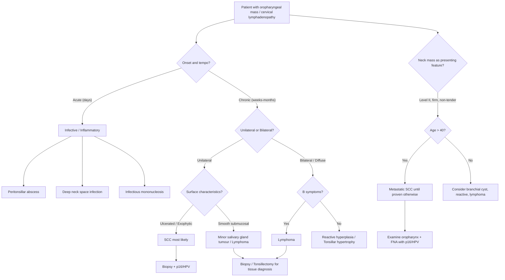

## Differential Diagnosis of Oropharyngeal Masses / Lesions

When a patient presents with an oropharyngeal mass, ulcer, dysphagia, or cervical lymphadenopathy, you need a structured differential diagnosis. The key is to think anatomically (what tissues exist in the oropharynx?) and then match each tissue of origin to its possible neoplastic, infective, or inflammatory pathology.

### Guiding Principle: What Tissues Live in the Oropharynx?

The oropharynx contains:
1. **Surface epithelium** (stratified squamous) → SCC, verrucous carcinoma
2. **Lymphoid tissue** (palatine tonsils, lingual tonsils — part of Waldeyer's ring) → lymphoma, reactive hyperplasia
3. **Minor salivary glands** (scattered submucosally, especially in soft palate and tongue base) → salivary gland neoplasms
4. **Connective tissue, muscle, vessels, nerves** → mesenchymal tumours (rare)
5. **Overlying mucosa can host infections** → peritonsillar abscess, pharyngitis, deep neck space infections

Each tissue type generates a different differential. The clinical challenge is that many of these can present identically — as a mass, ulcer, or asymmetric tonsillar enlargement.

---

### Structured Differential Diagnosis

#### A. Malignant Causes (Must-Exclude Differentials)

| Diagnosis | Tissue of Origin | Key Distinguishing Features | Why It Mimics Oropharyngeal SCC |
|:---|:---|:---|:---|
| ***Squamous cell carcinoma (SCC)*** | Surface epithelium | Most common (~90%); ulcerated or exophytic mass; risk factors (smoking, alcohol, HPV); ***p16/HPV testing distinguishes HPV+ from HPV-*** | — This IS the most common diagnosis |
| ***Lymphoma*** [2][3] | Lymphoid tissue (tonsils, tongue base) | ***Tonsils and tongue base may be the presenting site for a lymphoma*** [2]; typically diffuse, bulky, non-ulcerated enlargement; may have B symptoms (fever, night sweats, weight loss); often bilateral | Presents as tonsillar enlargement or tongue base mass — identical location to SCC. But lymphoma tends to produce smooth, fleshy, diffuse enlargement rather than ulceration. Biopsy is essential — you cannot distinguish them on appearance alone. |
| ***Minor salivary gland tumours*** [2][3] | Submucosal minor salivary glands | ***May present as submucosal masses in the tongue base and soft palate*** [2]; smooth, intact overlying mucosa (submucosal = pushing up from below, not ulcerating through the surface); includes adenoid cystic carcinoma (perineural invasion — pain/numbness), mucoepidermoid carcinoma, polymorphous adenocarcinoma | The mass is deep and covered by normal mucosa — unlike SCC which disrupts the surface. But advanced salivary gland malignancies can ulcerate, blurring the distinction. |
| **Nasopharyngeal carcinoma (NPC) extending inferiorly** | Nasopharyngeal epithelium | Endemic in Southern China/Hong Kong; EBV-driven; may extend from nasopharynx into oropharynx; bilateral cervical lymphadenopathy; cranial nerve palsies; EBV VCA IgA positive [5] | When NPC extends inferiorly, it can involve the soft palate and posterior pharyngeal wall, mimicking a primary oropharyngeal tumour. Nasoendoscopy reveals the primary in the nasopharynx (fossa of Rosenmüller). |
| **Metastatic carcinoma to cervical nodes** | Various primaries | A neck mass may be the presenting feature of an occult oropharyngeal primary; or it could represent metastasis from thyroid, lung, or other sites | The key question when you find a Level II neck node is: where is the primary? Always examine the oropharynx, particularly tonsil and tongue base. |
| **Other rare malignancies** | Various | Mucosal melanoma, sarcoma (rhabdomyosarcoma in children, leiomyosarcoma), neuroendocrine carcinoma | Very rare; melanoma may be pigmented or amelanotic; sarcomas present as submucosal masses |

<Callout title="Exam Trap: Lymphoma vs SCC" type="error">
A common mistake is to assume every tonsillar mass is SCC. ***Lymphoma*** — particularly diffuse large B-cell lymphoma (DLBCL) and extranodal marginal zone lymphoma — frequently presents in the tonsil or tongue base. If you see a large, smooth, fleshy tonsillar mass without ulceration, lymphoma should be high on your differential. Biopsy with flow cytometry and immunohistochemistry is essential — ***FNA alone does NOT provide material for tissue architecture or immunohistochemical analysis*** [6], so if lymphoma is suspected, excisional biopsy (e.g. tonsillectomy) or core needle biopsy is needed for subtyping.
</Callout>

#### B. Benign Neoplasms

| Diagnosis | Key Features | Why It Enters the Differential |
|:---|:---|:---|
| **Pleomorphic adenoma of minor salivary gland** | Most common benign salivary tumour; well-circumscribed, slow-growing, submucosal mass; usually painless; most commonly in soft palate | Submucosal mass in the palate or tongue base — could be mistaken for a malignant salivary gland tumour or early SCC |
| **Papilloma** | Benign epithelial neoplasm; pedunculated, finger-like projections; HPV 6/11 (low-risk types); usually small, painless | Exophytic mass that could be confused with verrucous carcinoma or early SCC |
| **Haemangioma / vascular malformation** | Bluish, compressible, non-tender; may bleed | A blue-tinged submucosal mass in the tongue base |
| **Granular cell tumour** | Firm, submucosal nodule; tongue is the most common oral site; benign in most cases | Can mimic a malignant submucosal lesion |

#### C. Infective and Inflammatory Conditions

| Diagnosis | Key Features | Why It Mimics Oropharyngeal Carcinoma |
|:---|:---|:---|
| **Peritonsillar abscess (quinsy)** | Acute onset; unilateral; fever, severe sore throat, trismus, "hot-potato" voice, uvula deviation to contralateral side; responds to drainage and antibiotics | Shares symptoms with oropharyngeal SCC: sore throat, trismus, muffled voice, unilateral tonsillar swelling. But quinsy is **acute** (days) vs carcinoma which is **chronic** (weeks-months). Absence of systemic infection signs and indolent course favours malignancy. |
| **Deep neck space infection (parapharyngeal / retropharyngeal abscess)** | Fever, toxaemia, neck swelling, odynophagia, dysphagia; CT shows rim-enhancing collection | Can present with similar pharyngeal symptoms; but systemic toxicity and acute onset distinguish it |
| **Infectious mononucleosis (EBV pharyngitis)** | Bilateral tonsillar enlargement with exudate; fever, lymphadenopathy, splenomegaly; positive Monospot; young patients | Bilateral tonsillar enlargement with cervical nodes in a young patient — but bilateral, acute, and systemic features point away from carcinoma |
| **Chronic tonsillitis / tonsillar hypertrophy** | Recurrent sore throats; bilateral; tonsillar crypts with debris (tonsilloliths); no ulceration | Bilateral and symmetric = benign. Unilateral and asymmetric = worry about malignancy. |
| **Pharyngeal tuberculosis** | Rare; granulomatous ulceration of pharynx; may present as chronic sore throat and dysphagia; associated with pulmonary TB; AFB on biopsy | Chronic ulcerated pharyngeal lesion — can look identical to SCC on examination. Must biopsy to differentiate. Important in Hong Kong where TB remains relevant. |
| **Syphilitic chancre / gumma** | Primary chancre: painless ulcer; tertiary gumma: destructive granulomatous lesion; both can involve oropharynx | Painless oropharyngeal ulcer — mimics early SCC. Sexual history and serology help. |

#### D. Premalignant Conditions

| Condition | Malignant Potential | Key Features |
|:---|:---|:---|
| ***Erythroplakia*** | ~50% harbour carcinoma in situ or invasive SCC at biopsy | Bright red mucosal plaque; cannot be attributed to any other diagnosis; highest single-lesion malignant potential |
| ***Leukoplakia*** | ~5% transform over 10 years | White patch that cannot be scraped off; floor of mouth = highest risk site |
| ***Speckled leukoplakia*** | Highest transformation rate | Mixed red-white lesion; combines features of both erythroplakia and leukoplakia |

#### E. Other Conditions Presenting as a Neck Mass (When Cervical Lymphadenopathy Is the Presenting Feature)

Since ***50% of oropharyngeal carcinoma patients present with cervical lymphadenopathy*** [2][3], the differential of a **Level II neck mass** is critical:

| Diagnosis | Key Distinguishing Features |
|:---|:---|
| **Metastatic oropharyngeal SCC** | Firm, non-tender, fixed; Level II most common; may be cystic (HPV+); p16/HPV testing on FNA |
| **Lymphoma** | Rubbery, non-tender; may be multiple; bilateral; B symptoms; flow cytometry on FNA/biopsy |
| **Reactive lymphadenopathy** | Tender, mobile; associated recent URTI or dental infection; resolves with treatment |
| **Branchial cleft cyst** | Anterior to SCM, smooth, cystic; classically in young adults — ***but a "branchial cyst" in a patient > 40 is malignancy until proven otherwise*** |
| **Tuberculous lymphadenitis (scrofula)** | Matted nodes, cold abscess; chronic; relevant in Hong Kong endemic setting; AFB/PCR on aspirate |
| **Salivary gland tumour (parotid tail / submandibular)** | Location specific to the gland; FNA diagnostic |
| **Carotid body tumour (paraganglioma)** | Pulsatile mass at carotid bifurcation; splays carotid vessels on imaging; mobile side-to-side but not up-and-down |

---

### Clinical Approach: How to Differentiate — A Diagnostic Thinking Framework

---

### Key Differentiating Principles — Summary Table

| Feature | SCC | Lymphoma | Minor Salivary Gland Tumour | Peritonsillar Abscess |
|:---|:---|:---|:---|:---|
| **Onset** | Weeks-months | Weeks-months | Months-years | Days |
| **Surface** | Ulcerated, irregular | Smooth, fleshy, intact mucosa | Smooth, submucosal, intact mucosa | Swollen, erythematous, bulging |
| **Laterality** | Usually unilateral | Often bilateral or diffuse | Unilateral | Unilateral |
| **Pain** | Late (nerve invasion) | Usually painless | Usually painless | Severe |
| **Trismus** | Indicates pterygoid invasion (advanced SCC) | Rare | Rare | Common (inflammation of pterygoids) |
| **Fever** | Absent (unless superinfected) | May have B symptoms | Absent | High-grade |
| **Cervical nodes** | Firm, non-tender, fixed | Rubbery, multiple | Uncommon early | Reactive, tender |
| **Risk factors** | Smoking, alcohol, HPV, age > 40 | None specific; may have immunosuppression | None specific | Recent URTI, poor dentition |
| **Investigation** | ***Panendoscopy + biopsy*** [4]; FNA with p16/HPV [6] | Excisional biopsy / core biopsy for subtyping | Biopsy (often needs incisional/excisional) | CT neck; I&D if abscess confirmed |

<Callout title="Golden Rule: Asymmetric Tonsils in Adults">
Any **unilateral tonsillar enlargement** in an adult that persists for > 3 weeks without signs of acute infection mandates biopsy to rule out SCC or lymphoma. Do not simply observe — the consequences of delayed diagnosis are severe.
</Callout>

<Callout title="Important: The 'Lateral Neck Cyst' Trap" type="error">
A cystic Level II neck mass in a patient over 40 years old should NEVER be dismissed as a branchial cleft cyst. This is a classic HPV-positive oropharyngeal SCC with cystic nodal metastasis until proven otherwise. FNA with cytology + p16 immunohistochemistry is mandatory. The primary tumour may be tiny or even occult — thorough oropharyngeal examination (including tongue base palpation and flexible nasendoscopy) is essential.
</Callout>

---

### Why Each Differential Matters — Reasoning from First Principles

**Why can lymphoma present at the tonsil and tongue base?**
The palatine tonsils and lingual tonsils are part of **Waldeyer's ring** — a ring of mucosa-associated lymphoid tissue (MALT) at the entrance to the aerodigestive tract. This is dense lymphoid tissue designed to sample antigens from inhaled/ingested material. Because lymphoma is a malignancy of lymphoid cells, any site with concentrated lymphoid tissue is a potential site for lymphoma. The tonsil is, in fact, one of the most common extranodal sites for non-Hodgkin lymphoma (particularly DLBCL).

**Why do minor salivary gland tumours present submucosally?**
Minor salivary glands are **embedded within the submucosa** throughout the oral cavity and oropharynx (highest density in the soft palate, tongue base, and buccal mucosa). Tumours arising from these glands grow within the submucosal layer, pushing the overlying mucosa upward but not initially breaking through it. This is why they present as smooth, non-ulcerated bumps — the mucosa is stretched but intact. SCC, by contrast, arises *from* the surface epithelium and disrupts it from the outset.

**Why does peritonsillar abscess mimic oropharyngeal SCC?**
Both cause unilateral tonsillar region swelling, trismus, muffled voice, and dysphagia. The mechanism of trismus differs though:
- In **abscess**: inflammation and oedema in the peritonsillar space directly irritates the adjacent medial pterygoid muscle → reflex spasm
- In **SCC**: direct tumour invasion into the medial pterygoid → fibrosis and mechanical restriction
The tempo is the key differentiator — abscess develops over days with fever; carcinoma develops over weeks-months without fever.

---

<Callout title="High Yield Summary">

**Differential Diagnosis of Oropharyngeal Masses — The Big Three:**
1. **SCC** (~90%) — ulcerated, exophytic, risk factors (smoking/alcohol/HPV), ***p16 testing essential***
2. **Lymphoma** — smooth, fleshy tonsillar/tongue base mass; ***tonsils and tongue base may be the presenting site for lymphoma***; need tissue biopsy for subtyping
3. **Minor salivary gland tumour** — ***submucosal masses in tongue base and soft palate***; smooth, intact mucosa

**Infective mimics:** Peritonsillar abscess (acute onset, fever, unilateral, trismus), deep neck space infection, TB pharyngitis

**Neck mass differential:** A cystic Level II mass in a patient > 40 = metastatic HPV+ oropharyngeal SCC until proven otherwise. Never call it a "branchial cleft cyst" without ruling out malignancy.

**Key differentiating questions:**
- Acute vs chronic onset?
- Unilateral vs bilateral?
- Ulcerated surface vs smooth/submucosal?
- Risk factors present?
- B symptoms?

***Always biopsy*** — clinical appearance alone cannot distinguish SCC from lymphoma or minor salivary gland tumours. ***Panendoscopy + biopsy*** is mandatory; ***10% risk of synchronous/metachronous tumour (field cancerisation)*** [4].

</Callout>

---

<ActiveRecallQuiz
  title="Active Recall - Differential Diagnosis of Oropharyngeal Carcinoma"
  items={[
    {
      question: "Name the three most important malignant differentials for an oropharyngeal mass and state which tissue each arises from.",
      markscheme: "1. Squamous cell carcinoma (surface epithelium, ~90%). 2. Lymphoma (lymphoid tissue of Waldeyer ring — tonsils, tongue base). 3. Minor salivary gland tumour (submucosal minor salivary glands — tongue base, soft palate)."
    },
    {
      question: "A 55-year-old man presents with a painless, cystic Level II neck mass. What is the most likely diagnosis and why should you NOT call it a branchial cleft cyst?",
      markscheme: "Most likely HPV-positive oropharyngeal SCC with cystic nodal metastasis. A lateral cystic neck mass in a patient over 40 is malignancy until proven otherwise. Branchial cleft cysts are developmental anomalies presenting in younger patients. Must perform FNA with p16/HPV testing and thorough oropharyngeal examination to identify the occult primary."
    },
    {
      question: "How do you clinically distinguish peritonsillar abscess from oropharyngeal carcinoma? Both cause unilateral tonsillar swelling, trismus, and muffled voice.",
      markscheme: "Abscess: acute onset (days), high fever, severe pain, uvula deviation, responds to antibiotics/drainage. Carcinoma: chronic/insidious onset (weeks-months), no fever, pain is late (nerve invasion), no uvula deviation, does not respond to antibiotics. Trismus mechanism differs: abscess = reflex pterygoid spasm from inflammation; carcinoma = direct tumour invasion of pterygoid muscle."
    },
    {
      question: "Why is excisional biopsy or core needle biopsy preferred over FNA when lymphoma is suspected in the tonsil?",
      markscheme: "FNA provides only cytological material and does NOT provide tissue architecture or immunohistochemical analysis needed for lymphoma subtyping. Lymphoma classification requires assessment of tissue architecture (follicular vs diffuse pattern), immunophenotyping, and molecular studies — all of which need intact tissue from excisional or core biopsy."
    },
    {
      question: "Explain why minor salivary gland tumours present as smooth submucosal masses while SCC presents as ulcerated surface lesions.",
      markscheme: "Minor salivary glands are embedded within the submucosa. Tumours arising from them grow within this layer, pushing the overlying intact mucosa upward without breaking through it (submucosal mass with normal surface). SCC arises from the surface squamous epithelium itself, so it disrupts the mucosal surface from the outset, causing ulceration and exophytic growth."
    }
  ]}
/>

## References

[2] Senior notes: felixlai.md (CA Oropharynx sections — differential diagnosis, patterns of metastasis, overview)
[3] Lecture slides: GC 219. Infections and tumours in pharynx and oral cavity.pdf (p36 — oropharyngeal malignancy sub-sites and histology)
[4] Lecture slides: GC 219. Infections and tumours in pharynx and oral cavity.pdf (p42 — workup and investigation, field cancerisation 10% synchronous/metachronous risk)
[5] Senior notes: felixlai.md (Nasopharyngeal cancer — NPC overview and etiology)
[6] Senior notes: felixlai.md (Pathological tests — FNA limitations, biopsy for lymphoma subtyping)
