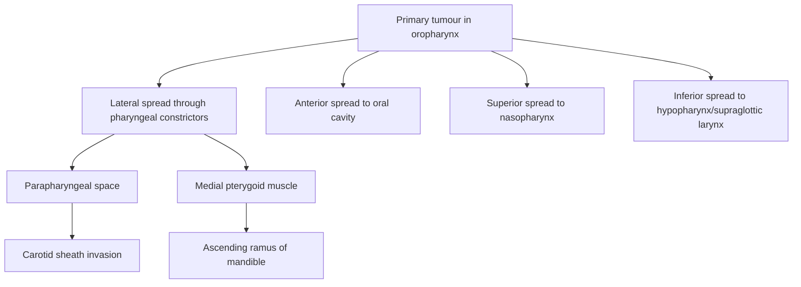

# Oropharyngeal Carcinoma

## 1. Definition

Oropharyngeal carcinoma refers to malignant neoplasms arising from the mucosal lining of the oropharynx — the middle portion of the pharynx situated between the nasopharynx superiorly and the hypopharynx inferiorly. The term breaks down as: "oro-" (Latin: mouth) + "pharyngeal" (Greek: pharynx/throat) + "carcinoma" (Greek: karkinos = crab, referring to cancer).

***90% of head and neck malignancies are squamous cell carcinoma (SCC)*** [1], and the oropharynx is no exception — ***the majority of oropharyngeal carcinomas are SCC*** [2]. However, other histologies can arise here, including ***lymphoma and minor salivary gland tumours*** [3].

This is important to understand: the oropharynx is lined by non-keratinised stratified squamous epithelium overlying a rich submucosal lymphoid tissue (especially in the palatine tonsils and lingual tonsils at the tongue base). This dual composition explains why both SCC and lymphoma can present at this site.

<Callout title="Key Concept">
Oropharyngeal carcinoma is predominantly SCC, but always keep lymphoma and minor salivary gland tumours in your differential — especially when a tonsillar or tongue base mass looks atypical or is submucosal.
</Callout>

---

## 2. Epidemiology

### 2.1 General Epidemiology

- **Male preponderance** — reflects the higher prevalence of smoking, alcohol use and HPV-related oral sexual practices in males [2]
- **Bimodal age distribution emerging**:
  - **Older patients (age > 60)**: traditionally the predominant group, driven by tobacco and alcohol
  - **Younger patients (age 40–60)**: an increasingly recognised cohort, driven by ***HPV infection***, presenting in ***young male patients who have a higher lifetime number of sexual partners and oral sex*** [2][4]

### 2.2 Global Trends

- In Western countries (USA, Northern Europe, Australia), **HPV-positive oropharyngeal carcinoma has risen dramatically** over the past two decades — to the point that it now constitutes the majority (60–80%) of oropharyngeal SCC in these regions.
- The rise is so striking that some have called it an "epidemic" — driven by changes in sexual behaviour.

### 2.3 Hong Kong Context

- In Hong Kong, head and neck SCC remains significant. While NPC has historically dominated (EBV-driven, endemic in Southern China), oropharyngeal SCC is increasingly recognised.
- **HPV-positive oropharyngeal SCC** is less common in Hong Kong and East Asia compared to Western populations, but prevalence is rising.
- ***Smoking remains the primary risk factor*** for head and neck cancers in Hong Kong [1].
- Betel nut chewing is relevant for oral cavity carcinoma in parts of Asia but less so for oropharyngeal carcinoma specifically.

---

## 3. Anatomy and Function

Understanding the anatomy is crucial — it determines the clinical features, patterns of spread, and surgical approach.

### 3.1 Boundaries of the Oropharynx

The oropharynx ***extends vertically from the soft palate to the superior surface of the hyoid bone (floor of the vallecula)*** [2]. It is ***laterally bounded by the pharyngeal constrictor muscles and the medial aspect of the mandible*** [2].

| Boundary | Landmark |
|:---|:---|
| Superior | Soft palate (junction with nasopharynx) |
| Inferior | Superior surface of hyoid bone / plane of vallecula (junction with hypopharynx/supraglottic larynx) |
| Anterior | Anterior tonsillar pillars (palatoglossal arch), circumvallate papillae of tongue |
| Posterior | Posterior pharyngeal wall (overlying prevertebral fascia) |
| Lateral | Palatine tonsils, pharyngeal constrictors, medial mandible |

### 3.2 Sub-sites of the Oropharynx

***The components are: tonsillar region, base of tongue, soft palate, and posterolateral pharyngeal wall*** [2][3].

| Sub-site | Key Features |
|:---|:---|
| ***Tonsil (commonest)*** [3] | Palatine tonsils sit in the tonsillar fossa between anterior (palatoglossal) and posterior (palatopharyngeal) pillars. Rich lymphoid tissue — Waldeyer's ring component. Most common sub-site for oropharyngeal SCC. |
| ***Tongue base*** [3] | Posterior one-third of tongue, behind circumvallate papillae. Contains lingual tonsils. Tumours here are often large at presentation because the tongue base is difficult to visualise on routine oral examination. |
| ***Soft palate*** [3] | Muscular extension of hard palate. Minor salivary glands are abundant here — hence minor salivary gland tumours can present as submucosal masses. |
| ***Posterior pharyngeal wall*** [3] | Mucosal lining overlying superior and middle pharyngeal constrictors and prevertebral fascia. |

### 3.3 Key Adjacent Structures and Spaces

Understanding these explains patterns of local invasion:

- **Parapharyngeal space**: a fat-filled space lateral to the pharynx, medial to the medial pterygoid and mandible. ***Direct extension of tumours from oropharynx into lateral tissues including pharyngeal constrictors may involve spread into the parapharyngeal space*** [2]. Once tumour reaches this space, it can access the carotid sheath (internal carotid artery, internal jugular vein, CN IX, X, XI, XII).
- **Pterygoid muscles**: ***invasion into medial pterygoid muscle can involve the ascending ramus of mandible*** [2] — this is what causes **trismus** (see Clinical Features).
- **Prevertebral fascia**: posterior, acts as a barrier to posterior spread — but once breached, tumour accesses the vertebral bodies.

### 3.4 Lymphatic Drainage

This is extremely high-yield because oropharyngeal carcinoma has a high propensity for nodal metastasis:

- ***Metastasise to level II (most common), III, IV, V, parapharyngeal and retropharyngeal and contralateral nodal groups*** [2]
- ***Approximately 50% have metastasis at time of presentation*** [2]
- ***Bilateral metastasis are common from tumours arising in the tongue base and soft palate*** [2] — because midline structures have bilateral lymphatic drainage
- The rich lymphoid network within Waldeyer's ring (tonsils, adenoids, lingual tonsils) facilitates early lymphatic spread

> **Why Level II?** Level II nodes (upper deep cervical / jugulodigastric nodes) are the primary echelon drainage for the oropharynx. They sit along the upper internal jugular vein, just below the posterior belly of digastric — exactly where lymphatics from the tonsil and tongue base drain first.

### 3.5 Nerve Supply (Relevant to Symptoms)

- **Glossopharyngeal nerve (CN IX)**: sensory supply to the oropharynx (tonsil, posterior tongue, pharyngeal wall). The tympanic branch (Jacobson's nerve) provides sensory supply to the middle ear → explains **referred otalgia**.
- **Vagus nerve (CN X)**: the auricular branch (Arnold's nerve) also mediates referred otalgia.
- **Hypoglossal nerve (CN XII)**: motor supply to the tongue — invasion causes tongue deviation.
- **Lingual nerve** (branch of CN V3): sensory to anterior 2/3 of tongue — involvement causes paraesthesia.

<Callout title="Clinical Pearl" type="idea">
When a patient with sore throat has ipsilateral ear pain but a normal ear examination — think oropharyngeal carcinoma with referred otalgia via CN IX/X.
</Callout>

### 3.6 Function of the Oropharynx

The oropharynx is critical for:
1. **Swallowing** (oropharyngeal phase): tongue base propels bolus posteriorly, pharyngeal constrictors generate the peristaltic wave
2. **Speech/resonance**: soft palate closes off nasopharynx, tongue base and pharyngeal walls shape sound
3. **Breathing**: maintains airway patency during sleep and waking

This explains why oropharyngeal tumours cause dysphagia, speech changes ("hot-potato voice"), and potentially airway compromise.

---

## 4. Etiology and Risk Factors

### 4.1 Overview — The "Big Four" for Head and Neck Cancer

***4 factors for H&N cancer = HPV + EBV + Smoking + Alcoholism*** [2]. For oropharyngeal carcinoma specifically, HPV is the dominant driver in Western populations, while smoking remains the primary overall risk factor in Hong Kong [1].

### 4.2 Human Papillomavirus (HPV) Infection

***HPV is the key aetiological factor for oropharyngeal carcinoma*** [1][4].

- ***HPV type 16 and 18*** (high-risk serotypes) — HPV-16 accounts for ~90% of HPV-positive oropharyngeal SCC [2]
- ***HPV-associated H&N cancer occur primarily in the oropharynx including tonsils and the base of tongue*** [2] — Why the oropharynx specifically? The tonsillar crypts have a specialised reticulated epithelium that lacks a complete basement membrane, allowing HPV to access basal cells more easily. This is analogous to the transformation zone of the uterine cervix.

#### Pathophysiology of HPV-driven carcinogenesis:

***HPV infection can induce two viral oncoproteins E6 and E7 which inactivate tumour suppressor p53 and Rb leading to tumour promotion*** [2]:

1. **E6 oncoprotein** → binds to E6-associated protein (E6AP) → forms a complex that ubiquitinates and degrades **p53** → loss of p53 function → loss of cell cycle arrest, loss of apoptosis in response to DNA damage → uncontrolled proliferation
2. **E7 oncoprotein** → binds to and inactivates **pRb (retinoblastoma protein)** → release of E2F transcription factor → uncontrolled S-phase entry → aberrant cell division

Because p53 is *degraded* (not mutated) in HPV-positive tumours, once you remove the virus, p53 can theoretically recover — this partly explains the better treatment response.

> **Key molecular distinction**: In HPV-positive tumours, p53 is *wild-type but degraded* by E6. In HPV-negative (smoking-driven) tumours, p53 is *mutated* and permanently dysfunctional. This is why HPV-positive tumours are more chemo/radiosensitive — their DNA damage repair machinery is intact but suppressed, so treatment can reactivate apoptosis.

#### Clinical and Demographic Features of HPV-Positive Oropharyngeal SCC:

***Presents in young male patients who have a higher lifetime number of sexual partners and oral sex*** [2][4].

***HPV-positive oropharyngeal SCC defines a distinct subset of patients compared with HPV-negative tobacco/alcohol-driven oropharynx cancer with the following features*** [2]:
- ***Frequent LN metastasis*** — often presenting with a cystic neck node (because HPV-positive tumours in the tonsil/tongue base can be small primaries with large nodal disease)
- ***Higher response rate to induction chemotherapy***
- ***Better prognosis*** — ~80% 5-year survival vs ~50% for HPV-negative
- ***Deintensification of treatment can be considered while obtaining the same locoregional and overall survival seen with standard treatment options*** [2] — this is a major area of ongoing clinical trials (reducing radiation dose or omitting chemotherapy to reduce long-term toxicity)

<Callout title="HPV-Positive vs HPV-Negative OPC" type="idea">

| Feature | HPV-Positive | HPV-Negative |
|:---|:---|:---|
| Age | Younger (40–60) | Older ( > 60) |
| Sex | Male predominance | Male predominance |
| Risk factors | Oral sex, multiple partners | Smoking, alcohol |
| Typical sub-site | Tonsil, tongue base | Any oropharyngeal sub-site |
| p53 | Wild-type (degraded by E6) | Mutated |
| p16 overexpression | Yes (surrogate marker) | No |
| Nodal metastasis | Frequent, often cystic | Less frequent at early stage |
| Prognosis | Excellent | Poorer |
| Treatment | De-intensification being studied | Standard full-dose CRT |

</Callout>

### 4.3 Smoking

***Smoking is the primary risk factor*** for head and neck cancers overall [1].

- Tobacco smoke contains > 60 known carcinogens (polycyclic aromatic hydrocarbons, nitrosamines, aromatic amines)
- These cause direct DNA damage → TP53 mutations, CDKN2A inactivation → field cancerisation
- **Synergism between smoking and alcohol**: ***the synergism between smoking and alcohol in development of HNSCC is well established*** [2] — the combined risk is multiplicative (not merely additive). Why? Alcohol acts as a solvent that increases mucosal permeability to tobacco carcinogens, and alcohol metabolism generates acetaldehyde (a direct carcinogen).

### 4.4 Alcohol

- ***Synergistic effect with smoking, especially for hypopharyngeal carcinoma*** [1]
- Alcohol → acetaldehyde (via alcohol dehydrogenase) → direct DNA adduct formation
- Chronic alcohol use → nutritional deficiency (folate, vitamin A) → impaired DNA repair
- Chronic mucosal irritation → increased cell turnover

### 4.5 Epstein-Barr Virus (EBV)

- ***Majority are related to NPC but association with oral SCC are also suggested*** [2]
- In Hong Kong, EBV's role is primarily in NPC (endemic) — its role in oropharyngeal SCC is minor

### 4.6 Other Risk Factors

- ***Poor oral hygiene with chronic infection*** [1]
- ***Previous irradiation/malignancy, immunocompromised*** [1]
- ***Chewing betel nut — primarily oral cavity carcinoma*** [1] (less relevant for oropharynx)
- Plummer-Vinson syndrome (Paterson-Brown-Kelly syndrome): ***triad of iron deficiency anaemia, dysphagia and cervical oesophageal web*** — ***well-established relationship with the development of oral cancer*** [2] (primarily oral cavity and hypopharynx, but included as a premalignant condition)

#### The "5 S's" Mnemonic for Oral/Oropharyngeal Cancer Risk Factors:
- **S**moking
- **S**pirits (alcohol)
- **S**harp teeth (chronic dental trauma — more oral cavity)
- **S**ex (male sex / oral sex → HPV)
- **S**picy food

---

## 5. Pathophysiology

### 5.1 Field Cancerisation

***Diffuse and chronic exposure of mucosa of upper aerodigestive tract to carcinogenic substance leads to widespread changes in mucosal epithelium → leads to development of separate tumours at different anatomical sites*** [2].

This concept is critical to understand:
- The entire mucosal lining from lips to bronchi has been "conditioned" by years of carcinogen exposure
- Multiple independent clones of dysplastic/neoplastic cells can develop simultaneously
- ***Increased risk of synchronous or metachronous tumour*** [2]:
  - ***Synchronous tumour = second primary tumour detected within 6 months*** [2]
  - ***Metachronous tumour = second primary tumour detected > 6 months*** [2]
- ***Patients who develop tumour in the oral cavity and the oropharynx are more likely to develop a second primary tumour in the upper oesophagus*** [2]
- ***Patients who develop tumour in the larynx are more likely to develop a secondary primary tumour in the lung*** [2]

> **Clinical implication**: This is why ***panendoscopy is always recommended*** — ***panendoscopy includes direct laryngoscopy, bronchoscopy and OGD*** — ***staging examination is recommended at the initial evaluation of all patients with primary cancers of upper aerodigestive tract*** [2]. You must look everywhere because there may be a second cancer hiding.

> **Surveillance**: ***Patients with oral cavity/oropharyngeal tumours should undergo surveillance to detect dysplasia with chromoendoscopy, high-resolution white light endoscopy, or narrow band imaging (NBI) to allow early effective treatment*** [2].

### 5.2 Premalignant Lesions

These are the precursor states — understanding them helps with early detection:

- ***Erythroplakia*** [2]:
  - ***Defined as bright red plaque of oral mucosa that cannot be characterised clinically or pathologically*** (i.e., no specific histological correlation — it's a clinical descriptor)
  - Higher malignant potential than leukoplakia (~50% harbour invasive carcinoma or carcinoma in situ at biopsy)

- ***Leukoplakia*** [2]:
  - ***Defined as white patch or plaque that cannot be characterised clinically or pathologically***
  - ***Leukoplakia on the floor of the mouth has a particularly high risk of malignant transformation***
  - Overall malignant transformation rate ~5% over 10 years

- ***Speckled leukoplakia*** [2]:
  - ***Variation of leukoplakia arising on an erythematous base***
  - ***Highest rate of malignant transformation*** — the combination of red and white is the most dangerous

<Callout title="Exam Trap" type="error">
Students often confuse leukoplakia and erythroplakia. Remember: erythroplakia has a HIGHER malignant potential than leukoplakia, and speckled leukoplakia (mixed red-white) has the HIGHEST risk. "Red is more dangerous than white."
</Callout>

### 5.3 Molecular Pathogenesis

Two distinct molecular pathways based on HPV status:

**HPV-positive pathway:**
- HPV integration → E6/E7 oncoprotein expression → p53 degradation + pRb inactivation → uncontrolled proliferation
- p16^INK4a is *overexpressed* (paradoxically) as a compensatory response to Rb inactivation — p16 is used as a surrogate immunohistochemical marker for HPV-positive disease
- Wild-type p53 — intact DNA damage response when viral oncoproteins are neutralised by treatment

**HPV-negative pathway:**
- Tobacco/alcohol → direct DNA damage → TP53 mutations (most common), CDKN2A (p16) deletion/methylation, CCND1 amplification
- Mutated p53 — permanently dysfunctional → less responsive to DNA-damaging therapies
- Accumulated mutations → genomic instability → worse prognosis

### 5.4 Patterns of Local Spread

***Direct extension of tumours from oropharynx into lateral tissues including pharyngeal constrictors may involve the spread into the parapharyngeal space*** [2]:

***Invasion into medial pterygoid muscle can involve the ascending ramus of mandible*** [2] → causes trismus and potential mandibular invasion.

### 5.5 Patterns of Metastasis

#### Lymph Node Metastasis:
- ***Approximately 50% have metastasis at time of presentation*** [2] — this is a defining feature of oropharyngeal SCC
- ***Metastasise to Level II (most common), III, IV, V, parapharyngeal and retropharyngeal and contralateral nodal groups*** [2]
- ***Bilateral metastasis are common from tumours arising in the tongue base and soft palate*** [2]
- HPV-positive tumours characteristically present with *cystic* nodal metastasis (can mimic branchial cleft cysts — beware the "lateral neck cyst" in a middle-aged adult)

<Callout title="Important Clinical Rule" type="error">
A "branchial cleft cyst" in a patient over 40 is oropharyngeal carcinoma until proven otherwise. Always biopsy and check for HPV/p16.
</Callout>

#### Distant Metastasis:
- ***Uncommon but possible sites include brain, lung, liver, bone and skin*** [2]
- HPV-positive tumours, despite their excellent locoregional control, can have delayed distant metastases (sometimes > 5 years out) — a distinct biological behaviour

---

## 6. Classification

### 6.1 Histological Classification

| Histology | Proportion | Key Features |
|:---|:---|:---|
| ***Squamous cell carcinoma*** | ~90% | Most common; HPV-positive and HPV-negative subtypes |
| ***Lymphoma*** | Variable | Tonsils/tongue base are common extranodal sites; NHL > HL |
| ***Minor salivary gland tumours*** | Rare | ***May present as submucosal masses in the tongue base and soft palate*** [2]; includes adenoid cystic carcinoma, mucoepidermoid carcinoma |
| Others | Rare | Melanoma, sarcoma |

### 6.2 WHO Classification of Head and Neck SCC (Histological Subtypes)

- Conventional (keratinising) SCC
- Non-keratinising SCC (more common in HPV-positive)
- Basaloid SCC
- Verrucous carcinoma
- Spindle cell carcinoma
- Papillary SCC

### 6.3 HPV Status Classification (AJCC 8th Edition, Current Standard)

The **AJCC 8th Edition (2017, current in 2026)** made a landmark change: **oropharyngeal SCC is now staged separately based on HPV/p16 status**. This reflects the fundamentally different biology and prognosis.

**p16 immunohistochemistry** is used as the surrogate marker for HPV status:
- **p16-positive**: ≥ 70% of tumour cells show diffuse nuclear and cytoplasmic staining
- If p16-positive → use the HPV-positive (p16+) staging system
- If p16-negative → use the HPV-negative staging system (same as other head and neck SCC)

> **Why separate staging?** Because HPV-positive patients with the same T and N as HPV-negative patients have dramatically better survival. Lumping them together would over-stage (and potentially over-treat) HPV-positive patients.

### 6.4 TNM Staging — Key Differences

**T staging (same for both HPV+ and HPV-):**

| T Stage | Definition |
|:---|:---|
| T1 | Tumour ≤ 2 cm |
| T2 | Tumour > 2 cm but ≤ 4 cm |
| T3 | Tumour > 4 cm OR extension to lingual surface of epiglottis |
| T4a | Tumour invades larynx, extrinsic tongue muscles, medial pterygoid, hard palate, or mandible |
| T4b | Tumour invades lateral pterygoid muscle, pterygoid plates, lateral nasopharynx, skull base, or encases carotid artery |

**N staging — HPV-positive (p16+) — CLINICAL:**

| N Stage | Definition |
|:---|:---|
| N0 | No regional LN metastasis |
| N1 | Unilateral LN(s), all ≤ 6 cm |
| N2 | Bilateral or contralateral LN(s), all ≤ 6 cm |
| N3 | LN(s) > 6 cm |

**N staging — HPV-negative (same as general H&N):**

| N Stage | Definition |
|:---|:---|
| N0 | No regional LN metastasis |
| N1 | Single ipsilateral LN ≤ 3 cm, no extranodal extension (ENE) |
| N2a | Single ipsilateral LN > 3 cm but ≤ 6 cm, no ENE |
| N2b | Multiple ipsilateral LN(s), none > 6 cm, no ENE |
| N2c | Bilateral or contralateral LN(s), none > 6 cm, no ENE |
| N3a | LN > 6 cm, no ENE |
| N3b | Any LN with clinical ENE |

> Notice that ENE (extranodal extension) is incorporated into N staging for HPV-negative but NOT for HPV-positive (clinical). This simplification for HPV-positive reflects the fact that even with nodal disease, outcomes remain good.

**Overall Stage Grouping — HPV-positive:**

| Stage | T | N | M |
|:---|:---|:---|:---|
| I | T0-T2 | N0-N1 | M0 |
| II | T0-T2 | N2 | M0 |
| II | T3 | N0-N2 | M0 |
| III | T0-T3 | N3 | M0 |
| III | T4 | Any N | M0 |
| IV | Any T | Any N | M1 |

Compare with HPV-negative where stage IVA/IVB exist — HPV-positive maxes out at Stage III for M0 disease, reflecting the better prognosis.

<Callout title="High Yield: AJCC 8th Edition Key Change">
Oropharyngeal SCC is staged differently based on p16/HPV status. HPV-positive tumours are "down-staged" compared to HPV-negative because of their better prognosis. A p16-positive patient with bilateral 5 cm nodes (N2) is only Stage II, whereas a p16-negative patient with the same finding might be Stage IVA.
</Callout>

---

## 7. Clinical Features

### 7.1 Symptoms

The clinical presentation depends on the sub-site and stage of disease. Many patients present late because early oropharyngeal tumours are asymptomatic or cause vague symptoms.

| Symptom | Pathophysiological Basis |
|:---|:---|
| ***Sore throat*** [3] | Mucosal ulceration/inflammation from tumour invasion stimulates nociceptors in the pharyngeal mucosa supplied by CN IX and X |
| ***Referred otalgia*** [2][3] | ***Referred otalgia mediated by tympanic branches of CN IX and CN X*** [2] — the glossopharyngeal nerve (Jacobson's nerve) and vagus nerve (Arnold's nerve) share central connections with ear sensation in the nucleus of the tractus solitarius. Pharyngeal pain is "referred" to the ear because the brain misinterprets the signal's origin. This is a red-flag symptom. |
| ***Dysphagia and odynophagia*** [2][3] | Tumour mass obstructs the oropharyngeal lumen and/or infiltrates the muscles of swallowing (pharyngeal constrictors, tongue base). Ulcerated tumour surface causes pain on swallowing (odynophagia). |
| ***Muffled speech / "hot-potato" voice*** [2][3] | ***Muffled voice is seen with large tongue base tumours*** [2] — the tongue base is critical for articulation and resonance. A bulky tumour restricts tongue movement, altering the oral resonance chamber. The voice sounds as if the patient is speaking with a hot potato in their mouth. |
| Weight loss | A combination of: (1) reduced oral intake from dysphagia/odynophagia, (2) tumour-related cachexia mediated by cytokines (TNF-α, IL-6), and (3) increased metabolic demand. ***Constitutional symptom*** [2]. |
| Haemoptysis/blood-stained saliva | Ulcerated, friable tumour surface bleeds — especially with trauma from food bolus passage. |
| Globus sensation | Early tumours or submucosal masses can produce a sensation of a lump in the throat. |
| ***Risk factor history*** | ***Smoking, alcohol, oral sex (HPV related)*** — always ask specifically [3] |

### 7.2 Signs

| Sign | Pathophysiological Basis |
|:---|:---|
| ***Mass / ulcer*** [3] | Direct visualisation of the tumour — may appear as an exophytic (outward-growing) mass, an ulcerated lesion with raised/rolled edges (typical of SCC), or a submucosal swelling (salivary gland tumour/lymphoma). |
| ***Asymmetrical tonsil*** [3] | ***Unilateral tonsillar enlargement or ulceration*** [2] — the most common presentation of tonsillar SCC. One tonsil looks significantly larger than the other, or has an irregular surface/ulcer. In adults, asymmetric tonsils should raise suspicion for malignancy. |
| ***Trismus*** [2][3] | ***Indicates advanced disease and usually results from involvement of pterygoid musculature*** [2]. The medial pterygoid muscle (a jaw closer) is infiltrated by tumour → muscle spasm and fibrosis → inability to open the mouth fully. Trismus indicates T4a disease (invasion of medial pterygoid). |
| ***Cervical lymphadenopathy (50%)*** [2][3] | ***Ipsilateral or bilateral non-tender cervical lymphadenopathy is a common presenting sign since the incidence of regional metastasis from oropharyngeal cancer is high*** [2]. Nodes are typically firm, non-tender, and fixed. In HPV-positive disease, nodes may be *cystic* (due to tumour necrosis within the node). |
| Tongue deviation | Invasion of CN XII (hypoglossal nerve) by locally extensive tumours → denervation of ipsilateral tongue muscles → tongue deviates *toward* the side of the lesion (because the contralateral genioglossus pushes the tongue toward the weak side). |
| Tongue paraesthesia | Invasion of lingual nerve (CN V3) → numbness/tingling of ipsilateral tongue. |
| Cranial nerve palsies | Advanced disease with parapharyngeal space/skull base invasion can affect CN IX, X, XI, XII. |
| Neck mass as presenting complaint | In HPV-positive oropharyngeal SCC, the primary tumour may be very small (even occult) but the *neck node* is the presenting complaint. A cystic Level II neck mass in a middle-aged adult is HPV-positive oropharyngeal SCC until proven otherwise. |

<Callout title="Red Flags for Oropharyngeal Carcinoma">
Any adult with **persistent unilateral sore throat > 3 weeks**, **referred otalgia with normal otoscopy**, **unilateral tonsillar enlargement**, or **cervical lymphadenopathy** should be investigated for oropharyngeal carcinoma. These are exam favourites.
</Callout>

### 7.3 Clinical Presentation by Sub-site

| Sub-site | Typical Presentation |
|:---|:---|
| **Tonsil** | Unilateral tonsillar enlargement/ulcer, sore throat, referred otalgia, neck mass |
| **Tongue base** | Dysphagia, "hot-potato" voice, referred otalgia, neck mass (often the first symptom — primary may be occult) |
| **Soft palate** | Visible mass/ulcer on soft palate, nasal regurgitation if palatal function compromised, altered speech |
| **Posterior pharyngeal wall** | Dysphagia, sore throat, may present late |

---

## 8. Differential Diagnosis (Brief Overview — to be expanded later)

| Differential | Distinguishing Features |
|:---|:---|
| ***Minor salivary gland tumour*** [2] | ***May present as submucosal masses in the tongue base and soft palate*** — smooth, non-ulcerated, firm |
| ***Lymphoma*** [2] | ***Tonsils and tongue base may be the presenting site for a lymphoma*** — typically diffuse enlargement without ulceration; may have B symptoms |
| Peritonsillar abscess (quinsy) | Acute onset, fever, trismus, "hot-potato" voice, uvula deviation — responds to drainage/antibiotics |
| Tonsillar hypertrophy | Bilateral, symmetric, smooth — usually in children/adolescents |
| Benign salivary gland tumour (pleomorphic adenoma) | Submucosal, smooth, slow-growing |
| Deep neck space infection | Acute, fever, odynophagia, swelling — systemic signs |

---

<Callout title="High Yield Summary">

**Definition**: Malignant neoplasm of the oropharynx (tonsil, tongue base, soft palate, posterior pharyngeal wall); >90% SCC.

**Epidemiology**: Male predominance; bimodal age (younger HPV+, older HPV-); rising HPV-positive incidence globally.

**Anatomy**: Oropharynx extends from soft palate to hyoid bone. **Tonsil is commonest sub-site**. Rich lymphatic drainage → 50% have nodal metastasis at presentation. Level II nodes most commonly involved. Bilateral nodal disease common from midline structures (tongue base, soft palate).

**Aetiology**: ***HPV (type 16/18)*** is the key driver for oropharyngeal SCC — E6 degrades p53, E7 inactivates Rb. **Smoking** is the primary overall risk factor. Alcohol is synergistic with smoking. "5 S's": Smoking, Spirits, Sharp teeth, Sex, Spicy food.

**HPV-positive vs HPV-negative**: HPV+ = younger, better prognosis, p16 overexpression, wild-type p53, cystic nodal metastasis, de-intensification being studied. HPV- = older, smoking/alcohol, mutated p53, worse prognosis.

**Field cancerisation**: Chronic carcinogen exposure → entire mucosa at risk → synchronous/metachronous tumours → always do **panendoscopy** (laryngoscopy + bronchoscopy + OGD).

**Premalignant lesions**: Erythroplakia (highest single-lesion malignant potential) > Speckled leukoplakia (highest transformation rate) > Leukoplakia.

**Clinical features**: Sore throat, referred otalgia (CN IX/X), dysphagia/odynophagia, "hot-potato" voice, weight loss. Signs: mass/ulcer, asymmetric tonsil, trismus (pterygoid invasion = advanced), cervical lymphadenopathy (50%), tongue deviation (CN XII invasion).

**AJCC 8th Edition**: Separate staging for p16+ and p16- oropharyngeal SCC. HPV-positive tumours are "down-staged" reflecting better prognosis.

</Callout>

---

<ActiveRecallQuiz
  title="Active Recall - Oropharyngeal Carcinoma (Definition to Clinical Features)"
  items={[
    {
      question: "Name the four sub-sites of the oropharynx and state which is the commonest site for oropharyngeal carcinoma.",
      markscheme: "Tonsil (commonest), tongue base, soft palate, posterior pharyngeal wall."
    },
    {
      question: "Explain the molecular mechanism by which HPV causes oropharyngeal carcinoma. Which two tumour suppressors are inactivated, and by which oncoproteins?",
      markscheme: "HPV E6 oncoprotein degrades p53 (via ubiquitination); HPV E7 oncoprotein inactivates Rb (retinoblastoma protein). This removes cell cycle checkpoints and apoptosis, leading to uncontrolled proliferation."
    },
    {
      question: "Why does oropharyngeal carcinoma cause referred otalgia despite the ear being anatomically normal?",
      markscheme: "Referred otalgia is mediated by the tympanic branch of CN IX (Jacobson's nerve) and the auricular branch of CN X (Arnold's nerve). These nerves share central connections in the brainstem with ear sensation, so pharyngeal pain is misinterpreted as ear pain."
    },
    {
      question: "What is field cancerisation and what is its clinical implication for oropharyngeal carcinoma patients?",
      markscheme: "Diffuse chronic carcinogen exposure causes widespread mucosal dysplasia across the upper aerodigestive tract, leading to risk of synchronous (within 6 months) or metachronous (more than 6 months) second primary tumours. Clinical implication: panendoscopy (direct laryngoscopy, bronchoscopy, OGD) is mandatory at initial evaluation."
    },
    {
      question: "A 45-year-old non-smoking male presents with a painless cystic Level II neck mass. What is the most likely diagnosis and what investigation would you request to confirm?",
      markscheme: "Most likely HPV-positive oropharyngeal SCC (likely tonsillar or tongue base primary). Investigate with FNA of the node (cytology plus p16 immunohistochemistry and/or HPV PCR), followed by examination of the oropharynx (flexible nasendoscopy) and panendoscopy with biopsy. A lateral neck cyst in a patient over 40 is malignancy until proven otherwise."
    },
    {
      question: "What is the key difference in AJCC 8th Edition staging between HPV-positive and HPV-negative oropharyngeal SCC, and why was this change made?",
      markscheme: "HPV-positive oropharyngeal SCC has a separate, simplified staging system with down-staging compared to HPV-negative. For example, p16-positive N staging does not incorporate extranodal extension, and maximum stage for M0 disease is Stage III (not IVA/IVB). This reflects the significantly better prognosis of HPV-positive disease, preventing over-treatment."
    }
  ]}
/>

## References

[1] Lecture slides: GC 219. Infections and tumours in pharynx and oral cavity.pdf (p40, p41)
[2] Senior notes: felixlai.md (CA Oropharynx sections, H&N cancer overview)
[3] Lecture slides: GC 219. Infections and tumours in pharynx and oral cavity.pdf (p36, p37)
[4] Lecture slides: GC 219. Infections and tumours in pharynx and oral cavity.pdf (p41)
