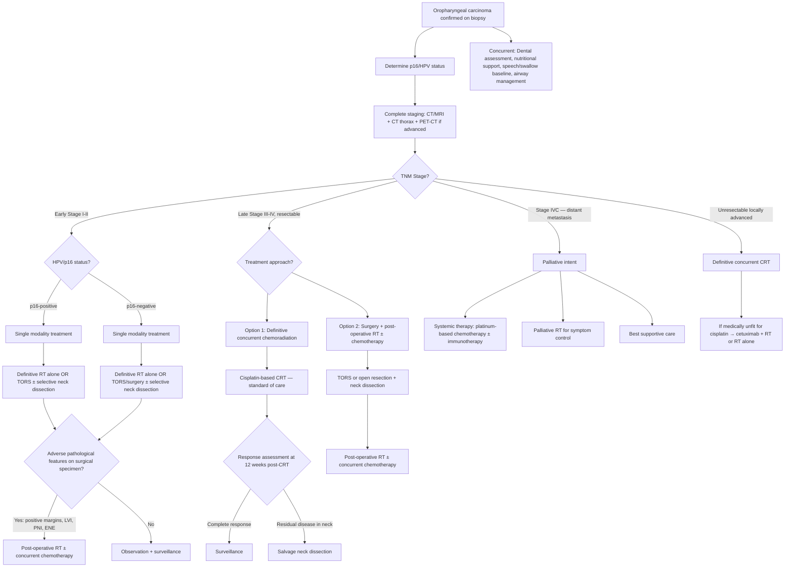

## Management of Oropharyngeal Carcinoma

### 1. General Principles of Management

Before diving into the algorithm, let's establish the overarching philosophy. The lecture slides lay out a clear management framework that applies across all head and neck cancers, with specific nuances for the oropharynx:

***Management Framework — General Principle*** [8]:
- ***Tumour clearance with long-term survival benefit***
- ***Organ and function preservation***
- ***When surgery is indicated → Resection with adequate margins → Reconstruction for Form and Function → Rehabilitation always — swallowing, voice and hearing***

This triad — **Resection, Reconstruction, Rehabilitation** — is the backbone of all H&N surgical oncology. You never just cut; you must plan how to rebuild and how to restore function.

***Management is based on TNM staging*** [8]:

| Stage | Treatment Philosophy |
|:---|:---|
| ***Early stage (I, II)*** | ***Single modality of treatment — Surgery or radiotherapy alone*** [8] |
| ***Late stage (III, IV)*** | ***Combined modality of treatment — Concurrent chemo-irradiation OR Surgery with adjuvant radiotherapy ± chemotherapy*** [8] |

***General rule*** [8]:
- ***Early stage: radiotherapy or minimally invasive surgery (laser/robotic)***
- ***Late stage: Surgery with adjuvant treatment***

***BUT — there are important site-specific exceptions*** [8]:
- ***Oral cavity and thyroid: surgery in early stage*** (oral cavity tumours respond less well to radiotherapy; thyroid is surgically accessible)
- ***NPC: chemo-irradiation in late stage*** (NPC is exquisitely radiosensitive + surgically inaccessible at the skull base)

For the **oropharynx specifically**, the approach has unique features [2]:
- ***Tumours of the oropharynx tend to be chemosensitive*** [2] — this is why chemoradiation plays such a central role, often as an alternative to surgery
- ***Adequate treatment of the neck is important because of high risk of regional metastasis*** [2] — with 50% of patients presenting with nodal disease, the neck must be addressed in every treatment plan
- ***Multidisciplinary approach including swallowing rehabilitation is important*** [2]

<Callout title="Oropharynx Is Different from Oral Cavity">
For oral cavity cancers, surgery is preferred even in early stages because the oral cavity is accessible and radiation has significant morbidity (xerostomia, ORN). For oropharyngeal cancers, particularly HPV-positive tumours, chemoradiation is often preferred because: (1) the oropharynx is less surgically accessible, (2) oropharyngeal SCC is highly chemo- and radiosensitive, and (3) organ preservation (swallowing, speech) is paramount. Don't confuse the two — the management frameworks are different.
</Callout>

---

### 2. Management Algorithm

---

### 3. Treatment Modalities — Detailed Breakdown

#### 3.1 Surgery

##### a) Transoral Robotic Surgery (TORS)

***Minimally invasive technique to resect tumours of oropharynx include a transoral robotic surgical approach (TORS)*** [2].

| Aspect | Details |
|:---|:---|
| **What it is** | Robotic-assisted transoral surgery using the da Vinci surgical system; binocular 3D vision + articulating instruments pass through the mouth to resect the tumour |
| **Why it was developed** | ***Previously, procedures might otherwise require a lip-splitting mandibulotomy approach to resect tumours of the oropharynx*** [2] — mandibulotomy is a major open procedure where the mandible is divided to gain access to the oropharynx, carrying significant morbidity (malocclusion, plate complications, prolonged recovery) |
| **Advantages** | ***Associated with shorter length of hospital stay and less likely to be gastrostomy tube or tracheostomy dependent at 6 months*** [2]; excellent visualisation of tongue base and tonsil; avoids mandibulotomy; less tissue destruction → better functional outcomes |
| **Indications** | Early-stage (T1–T2) oropharyngeal SCC, selected T3 tumours; particularly useful for tonsillar and tongue base tumours |
| **Contraindications** | Trismus (cannot open mouth for transoral access); tumours encasing the carotid artery; extensive mandibular invasion; tumours too lateral/posterior for transoral reach |
| **What is resected** | Primary tumour with adequate margins (radical tonsillectomy for tonsillar SCC, tongue base resection for tongue base tumours) |

***Minimal invasion surgery: Laser/endoscopic/robotic partial pharyngectomy ± reconstruction*** [9]

##### b) Open Surgery

For larger or more advanced tumours where transoral access is insufficient:

***Open major surgery with reconstruction*** [9]:

| Procedure | Indication |
|:---|:---|
| **Mandibulotomy approach** | Access to tongue base/parapharyngeal space tumours too large for TORS; mandible is temporarily divided (lip-splitting approach) and re-plated |
| **Partial pharyngectomy** | Resection of the involved portion of the oropharyngeal wall |
| ***Circumferential pharyngectomy + reconstruction*** [9] | When the tumour involves the circumference of the pharynx — requires free flap reconstruction (e.g., jejunal free flap, anterolateral thigh flap) to restore the pharyngeal conduit |
| ***Pharyngo-laryngo-oesophagectomy (PLO)*** [9] | Extensive tumour involving pharynx, larynx and cervical oesophagus — a massive operation with significant morbidity; requires gastric pull-up or jejunal free flap for reconstruction |

##### c) Neck Dissection

***Adequate treatment of the neck is important because of high risk of regional metastasis*** [2].

| Type | What Is Removed | Indication |
|:---|:---|:---|
| **Selective neck dissection** | Selected lymph node levels (typically II–IV) while preserving IJV, CN XI, SCM | Clinically N0 neck with > 15–20% risk of occult metastasis (applies to most oropharyngeal SCC); ipsilateral for unilateral tumours, bilateral for midline tumours (tongue base, soft palate) |
| **Modified radical neck dissection** | Levels I–V LN; preserves one or more of: IJV, CN XI, SCM | Clinically positive neck (N+) disease |
| **Radical neck dissection** | Levels I–V LN + IJV + CN XI + SCM — all removed | Extensive nodal disease with gross involvement of IJV/SCM/CN XI; now rarely performed as modified radical achieves comparable oncological outcomes |

> **Why bilateral neck dissection for midline tumours?** The tongue base and soft palate straddle the midline. Lymphatic drainage from midline structures goes bilaterally — to both right and left Level II–IV nodes. Treating only one side leaves the contralateral neck at risk.

<Callout title="Elective Neck Dissection" type="idea">
***15–20% of occult nodal metastasis*** [10] — even when the neck is clinically and radiologically N0, there is a significant risk of microscopic disease in the lymph nodes. This is why **elective (prophylactic) neck dissection** is performed — to remove microscopic disease before it becomes macroscopic. The threshold for elective neck dissection is generally accepted as > 15–20% risk of occult nodal metastasis.
</Callout>

##### d) Reconstruction

***Reconstruction for Form and Function*** [8]:

After surgical resection, the defect must be reconstructed to restore:
- **Swallowing** — maintain oropharyngeal conduit patency and tongue base contact with palate
- **Speech** — preserve velopharyngeal closure (soft palate function) and tongue mobility
- **Airway** — prevent aspiration

| Reconstruction Method | When Used |
|:---|:---|
| **Primary closure** | Small defects that can be closed directly |
| **Local/regional flaps** (e.g., buccal fat pad flap, submental flap) | Moderate defects |
| **Free tissue transfer** — fasciocutaneous flaps (e.g., radial forearm free flap, anterolateral thigh flap) | Larger defects; provides soft tissue bulk for tongue base/pharyngeal wall reconstruction |
| **Osseous free flaps** (e.g., fibula free flap) | When mandibular reconstruction is needed following segmental mandibulectomy |

---

#### 3.2 Radiotherapy (RT)

Radiotherapy is a cornerstone of oropharyngeal carcinoma treatment — both as primary definitive therapy and as adjuvant post-operative treatment.

##### a) Definitive Radiotherapy

| Aspect | Details |
|:---|:---|
| **Indication** | Early-stage (I–II) oropharyngeal SCC as single modality; locoregionally advanced disease as concurrent chemoradiation; patients medically unfit for surgery |
| **Technique** | **Intensity-modulated radiotherapy (IMRT)** is the current standard — allows dose sculpting to conform radiation to the tumour while sparing adjacent normal structures (especially parotid glands → reduces xerostomia) |
| **Dose** | Typically 70 Gy in 35 fractions (2 Gy/fraction, 7 weeks) for definitive treatment |
| **Radiation fields** | Primary tumour + bilateral neck (because of high risk of bilateral nodal disease from oropharynx) |

***Early stage: radiotherapy or minimally invasive surgery (laser/robotic)*** [8] — for early oropharyngeal SCC, definitive RT and TORS are both acceptable options. The choice depends on institutional expertise, patient preference, and anticipated functional outcomes.

##### b) Post-operative Radiotherapy (PORT)

***Post-operative RT ± chemotherapy: indicated for patients who have close or positive margins or factors increasing risk of local recurrence including lymphovascular invasion, perineural invasion and extranodal extensions (ENE)*** [7]

| Indication for PORT | Rationale |
|:---|:---|
| **Positive or close margins** | Residual microscopic tumour at the surgical margin → RT sterilises remaining cells |
| **Perineural invasion (PNI)** | Tumour cells tracking along nerves can extend far beyond the visible tumour margin → RT covers the nerve pathway |
| **Lymphovascular invasion (LVI)** | Indicates systemic/regional spread potential beyond what surgery removed |
| **Extranodal extension (ENE)** | Tumour has breached the lymph node capsule → dramatically increases risk of locoregional recurrence |
| **Multiple positive nodes** | Higher tumour burden in the neck |
| **pT3–T4 tumour** | Advanced primary warrants adjuvant treatment |

> **When to add chemotherapy to PORT**: If the patient has **positive margins** or **extranodal extension (ENE)**, concurrent chemotherapy (cisplatin) is added to PORT — these two features are the strongest indications for chemo-RT over RT alone post-operatively, based on the landmark EORTC 22931 and RTOG 9501 trials.

##### c) Brachytherapy

- Radioactive sources placed directly into/adjacent to the tumour bed
- Used as a boost to external beam RT or as primary treatment for small, well-defined tumours
- Less commonly used in oropharynx compared to oral cavity

---

#### 3.3 Chemotherapy

Chemotherapy in oropharyngeal carcinoma is almost always used **in combination with radiotherapy** (concurrent chemoradiation, CRT) — it is rarely used as a standalone curative treatment.

##### a) Concurrent Chemoradiation (CRT)

***Concomitant chemoradiation is commonly utilised in advanced stage (III and IV) oropharyngeal carcinoma which effectively preserves function and is associated with survival comparable to surgery with postoperative radiation*** [2].

| Aspect | Details |
|:---|:---|
| **Standard regimen** | **Cisplatin** 100 mg/m² IV on days 1, 22, and 43 of radiotherapy (3 cycles concurrent with RT) |
| **Mechanism** | Cisplatin is a radiosensitiser — it forms DNA cross-links that impair DNA repair, making cancer cells more susceptible to radiation-induced damage. The combination is synergistic, not just additive. |
| **Why not chemotherapy alone?** | Chemotherapy alone cannot cure oropharyngeal SCC. It reduces tumour bulk but does not eradicate locoregional disease. RT provides the definitive locoregional control. |
| **Alternative for cisplatin-unfit patients** | Carboplatin (less nephrotoxic but less efficacious); cetuximab (anti-EGFR monoclonal antibody) + RT — though recent evidence (De-ESCALaTE, RTOG 1016) shows cetuximab + RT is inferior to cisplatin + RT for HPV-positive disease |

##### b) Induction Chemotherapy

- Chemotherapy given BEFORE definitive CRT or surgery
- Regimen: **TPF** (docetaxel + cisplatin + 5-fluorouracil)
- ***HPV-positive oropharyngeal SCC has higher response rate to induction chemotherapy*** [2]
- Role: controversial; primarily used in research settings for treatment de-intensification strategies (if excellent response to induction chemo → reduce subsequent RT dose)
- Not standard of care outside clinical trials for most patients

##### c) Systemic Therapy for Metastatic/Recurrent Disease

For patients with **distant metastatic disease (Stage IVC)** or **recurrent disease** not amenable to salvage surgery or re-irradiation:

| Agent | Mechanism | Indication |
|:---|:---|:---|
| **Cisplatin or carboplatin + 5-FU** | Platinum-based cytotoxic chemotherapy | First-line palliative chemotherapy |
| **Pembrolizumab** (anti-PD-1) | Immune checkpoint inhibitor — blocks PD-1 on T cells → restores anti-tumour immune response | First-line for recurrent/metastatic HNSCC (alone if PD-L1 CPS ≥ 1, or combined with platinum/5-FU — KEYNOTE-048 trial) |
| **Nivolumab** (anti-PD-1) | Same mechanism as pembrolizumab | Second-line for platinum-refractory recurrent/metastatic HNSCC (CheckMate 141) |
| **Cetuximab** (anti-EGFR) | Monoclonal antibody targeting EGFR → inhibits proliferation, induces apoptosis, enhances radiosensitivity | Combined with platinum-based chemo in first-line (EXTREME regimen); or with RT when cisplatin contraindicated |

> **Immunotherapy in oropharyngeal SCC**: HPV-positive tumours have a higher tumour mutational burden and more immune infiltration — they tend to respond well to checkpoint inhibitors. Pembrolizumab has become a game-changer for recurrent/metastatic disease.

---

#### 3.4 HPV-Positive Oropharyngeal SCC — De-intensification

This is one of the hottest topics in head and neck oncology right now. The rationale:

***De-intensification of treatment can be considered while obtaining the same locoregional and overall survival seen with standard treatment options*** [2].

**Why de-intensify?**
- HPV-positive patients are younger (40–60), have excellent prognosis (~80% 5-year survival), and will live long enough to suffer from late treatment toxicities
- Standard CRT causes: severe xerostomia, dysphagia, fibrosis, dental decay, hypothyroidism, hearing loss, osteoradionecrosis — these are lifelong problems
- If we can achieve the same cure rate with less intensive treatment, we spare patients decades of morbidity

**Current de-intensification strategies (under investigation in clinical trials):**

| Strategy | Approach | Status |
|:---|:---|:---|
| **Reduced RT dose after good response to induction chemo** | If induction TPF → excellent response → reduce RT from 70 Gy to 54 Gy | Clinical trials (e.g., ECOG-ACRIN E1308) |
| **TORS + reduced-dose adjuvant RT** | Surgery first → if pathology favourable → reduce or omit adjuvant RT | Clinical trials (e.g., ECOG E3311) |
| **Replace cisplatin with cetuximab** | Less toxic than cisplatin | **Abandoned** — RTOG 1016 and De-ESCALaTE showed inferior outcomes with cetuximab + RT vs cisplatin + RT |
| **Omit chemotherapy** | RT alone for favourable-risk HPV+ patients | Under investigation |

<Callout title="Critical Update: Cetuximab + RT Is NOT Equivalent to Cisplatin + RT" type="error">
The RTOG 1016 and De-ESCALaTE trials definitively showed that for HPV-positive oropharyngeal SCC, cetuximab + RT is inferior to cisplatin + RT in terms of overall survival and locoregional control. Do NOT use cetuximab as a de-intensification substitute for cisplatin in HPV-positive disease. Cisplatin remains the standard. De-intensification must be pursued through other strategies (reduced dose, reduced volume) within clinical trials.
</Callout>

---

#### 3.5 Specific Management by Stage

##### Early Stage (I–II) — Single Modality

***Early stage (I, II): Single modality of treatment — Surgery or radiotherapy alone*** [8]

| Option | Details | When to Choose |
|:---|:---|:---|
| **Definitive RT (IMRT)** | 70 Gy/35# to primary + bilateral neck | Excellent option for most early oropharyngeal SCC; preserves anatomy; avoids surgical morbidity |
| **TORS ± selective neck dissection** | Transoral resection of primary + ipsilateral or bilateral selective neck dissection (levels II–IV) | Preferred when: clear surgical margins achievable, desire to avoid RT (preserve RT as salvage option), small tonsillar or tongue base tumour amenable to transoral approach |

Post-operative adjuvant treatment after surgery:
- **No adverse features** → observation and surveillance
- ***Adverse features (positive margins, LVI, PNI, ENE, tumour thickness > 4 mm)*** → ***post-operative radiotherapy ± concurrent chemotherapy*** [2][7]

##### Late Stage (III–IV, Resectable) — Combined Modality

***Late stage (III, IV): Combined modality of treatment*** [8]

**Option 1: Definitive concurrent chemoradiation (preferred for oropharynx)**

***Concurrent chemo-irradiation*** [8]:
- Cisplatin 100 mg/m² q3w × 3 cycles + IMRT 70 Gy/35#
- ***Effectively preserves function and associated with survival comparable to surgery with postoperative radiation*** [2]
- Preferred for most locoregionally advanced oropharyngeal SCC because it avoids the morbidity of open surgery + preserves swallowing and speech

**Option 2: Surgery with adjuvant treatment**

***Surgery with adjuvant radiotherapy ± chemotherapy*** [8]:
- TORS or open resection of primary + modified radical neck dissection
- Followed by post-operative RT (± cisplatin if positive margins or ENE)
- Preferred when: definitive pathological staging is needed, tumour anatomy favours surgical approach, or patient preference

**For medically inoperable or unresectable disease:**
- ***Definitive radiotherapy or chemotherapy are options for patients who are medically inoperable or have unresectable disease*** [2]
- "Unresectable" includes: tumour encasing the carotid artery, extensive skull base invasion, fixed to prevertebral fascia

##### Stage IVC (Distant Metastasis) — Palliative

- **Not curable** — treatment intent is palliative (symptom control, prolongation of quality life)
- **Systemic therapy**: pembrolizumab ± platinum/5-FU (KEYNOTE-048); or platinum/5-FU + cetuximab (EXTREME)
- **Palliative RT**: for local symptom control (pain, bleeding, airway obstruction)
- **Best supportive care**: pain management, nutritional support, airway management

---

#### 3.6 Supportive and Rehabilitative Care

***Rehabilitation always — swallowing, voice and hearing*** [8]

This is not an afterthought — it is integral to the treatment plan:

| Domain | Intervention | Why |
|:---|:---|:---|
| **Swallowing** | Pre-treatment speech pathologist assessment; swallowing exercises during and after RT; modified diet consistency; PEG/RIG tube for enteral feeding if needed | RT causes mucositis → fibrosis → pharyngeal stricture → long-term dysphagia. Proactive swallowing rehabilitation reduces severity. |
| **Speech** | Speech therapy; prosthetic rehabilitation if soft palate resected | Oropharyngeal surgery/RT affects velopharyngeal closure and tongue base mobility |
| **Nutrition** | Dietitian involvement; prophylactic PEG in patients expected to have > 10% weight loss during CRT | Mucositis from CRT causes severe odynophagia; patients cannot eat → malnutrition → treatment breaks → worse outcomes |
| **Dental** | Pre-RT dental assessment; extraction of compromised teeth; lifelong fluoride trays | Prevents osteoradionecrosis (ORN) of the mandible |
| **Airway** | ***ALWAYS protect the airway for all H&N cancer*** [2]; tracheostomy if airway threatened | Bulky tumours or post-treatment oedema can obstruct the airway |
| **Psychosocial** | Psychology/psychiatry input; support groups | H&N cancer profoundly affects appearance, eating, speaking → depression, social isolation |
| **Smoking cessation** | Mandatory; continued smoking during RT reduces cure rate by 50% and increases toxicity | Smoking causes vasoconstriction → reduces tumour oxygenation → radiation is less effective in hypoxic tissue |
| **Hearing** | Audiometry before and after cisplatin | Cisplatin is ototoxic (damages cochlear hair cells) |

---

#### 3.7 Follow-Up and Surveillance

Post-treatment surveillance is critical because:
1. Early detection of recurrence allows salvage treatment
2. Detection of metachronous second primaries (field cancerisation)
3. Management of late treatment toxicities

| Timeframe | Schedule | Assessments |
|:---|:---|:---|
| Year 1–2 | Every 1–3 months | Clinical exam, flexible nasendoscopy, thyroid function (if neck irradiated) |
| Year 3–5 | Every 3–6 months | As above |
| Year 5+ | Annually | As above; lifelong due to second primary risk |
| Post-CRT response assessment | PET-CT at 12 weeks post-CRT | If complete metabolic response → surveillance. If residual FDG uptake in neck → consider salvage neck dissection |

---

### 4. When to Refer — Take Home Messages from Lectures

***EARLY REFERRAL to ENT Surgeons when suspecting malignancy*** [11]:
- ***Persistent 2–4 weeks after conservative/empirical treatment***
- ***Clinically suspicious: irregular, induration, > 2 cm, associated cervical LN enlargement***

<Callout title="High Yield Summary">

**Management framework per lecture slides** [8]:
- ***Early stage (I, II) → single modality: surgery OR radiotherapy alone***
- ***Late stage (III, IV) → combined modality: concurrent CRT OR surgery + adjuvant RT ± chemo***
- ***General rule: Early = RT or minimally invasive surgery; Late = surgery + adjuvant***
- ***BUT: Oral cavity = surgery early; NPC = chemo-irradiation late***
- ***General principle: Tumour clearance + Organ/function preservation + Reconstruction for form and function + Rehabilitation always***

**Oropharynx-specific points** [2]:
- ***Oropharyngeal tumours are chemosensitive*** → CRT is a mainstay
- ***TORS*** replaces the old lip-splitting mandibulotomy → shorter hospital stay, less morbidity
- ***Adequate neck treatment is essential*** — 50% have nodal disease at presentation
- ***CRT effectively preserves function with survival comparable to surgery + PORT***

**HPV-positive disease** [2]:
- ***Better prognosis, higher chemo-response, de-intensification being studied***
- Cetuximab + RT is NOT a valid de-intensification strategy (inferior to cisplatin + RT)
- Cisplatin + RT remains the standard concurrent regimen

**Adjuvant treatment after surgery** [7]:
- PORT indicated for: positive margins, PNI, LVI, ENE, advanced T stage
- Add cisplatin to PORT if: positive margins or ENE

**Metastatic/recurrent disease**: Pembrolizumab ± platinum/5-FU (immunotherapy era)

**Supportive care**: Dental assessment pre-RT, nutritional support, swallowing rehabilitation, smoking cessation, airway protection — all mandatory.

**Refer early**: ***Persistent > 2–4 weeks, irregular, indurated, > 2 cm, cervical LN*** [11].

</Callout>

---

<ActiveRecallQuiz
  title="Active Recall - Management of Oropharyngeal Carcinoma"
  items={[
    {
      question: "State the management framework for early-stage vs late-stage head and neck cancers as per the lecture slides, and the specific exception for oropharyngeal carcinoma.",
      markscheme: "Early stage (I, II): single modality — surgery or radiotherapy alone. Late stage (III, IV): combined modality — concurrent chemo-irradiation OR surgery with adjuvant RT +/- chemotherapy. For oropharynx specifically, concurrent CRT is commonly used in advanced stage because oropharyngeal tumours are chemosensitive, and CRT effectively preserves function with survival comparable to surgery + post-operative RT."
    },
    {
      question: "What is TORS and what did it replace? State two advantages of TORS over the traditional approach.",
      markscheme: "TORS = Transoral Robotic Surgery. It replaced the lip-splitting mandibulotomy approach for accessing oropharyngeal tumours. Advantages: (1) shorter hospital stay, (2) less likely to be gastrostomy tube or tracheostomy dependent at 6 months. Also avoids mandibulotomy morbidity (malocclusion, plate complications)."
    },
    {
      question: "After surgical resection of oropharyngeal SCC, list the pathological features that would mandate post-operative radiotherapy, and state which two features require the addition of concurrent chemotherapy.",
      markscheme: "Features mandating PORT: positive or close margins, perineural invasion (PNI), lymphovascular invasion (LVI), extranodal extension (ENE), multiple positive nodes, pT3-T4 tumour. The two features requiring concurrent chemotherapy added to PORT: (1) positive surgical margins and (2) extranodal extension (ENE) — based on EORTC 22931 and RTOG 9501 trials."
    },
    {
      question: "Why is cisplatin + RT preferred over cetuximab + RT for HPV-positive oropharyngeal SCC, despite the theoretical rationale for de-intensification?",
      markscheme: "The RTOG 1016 and De-ESCALaTE clinical trials showed that cetuximab + RT is inferior to cisplatin + RT for HPV-positive oropharyngeal SCC in terms of overall survival and locoregional control. Therefore, cetuximab cannot be used as a less toxic substitute for cisplatin. Cisplatin remains the standard. De-intensification must be pursued through other strategies such as reduced radiation dose or volume within clinical trials."
    },
    {
      question: "State the three components of the head and neck surgical oncology management principle from the lecture slides.",
      markscheme: "Resection with adequate margins, Reconstruction for Form and Function, and Rehabilitation always — swallowing, voice and hearing."
    },
    {
      question: "What are the indications for referring a patient with an oropharyngeal lesion to ENT early, per the lecture take-home message?",
      markscheme: "Early referral when suspecting malignancy: (1) persistent symptoms for 2-4 weeks after conservative/empirical treatment, (2) clinically suspicious features — irregular, induration, size greater than 2 cm, associated cervical lymph node enlargement."
    }
  ]}
/>

## References

[2] Senior notes: felixlai.md (CA Oropharynx — Treatment section, general principles, TORS, chemoradiation)
[7] Senior notes: felixlai.md (H&N cancer — Treatment of localised and locoregionally advanced cancers, post-operative RT indications)
[8] Lecture slides: GC 219. Infections and tumours in pharynx and oral cavity.pdf (p43, p44 — Management Framework)
[9] Lecture slides: GC 219. Infections and tumours in pharynx and oral cavity.pdf (p47 — Minimal invasion surgery, open surgery, PLO)
[10] Lecture slides: GC 219. Infections and tumours in pharynx and oral cavity.pdf (p35 — 15-20% occult nodal metastasis, elective neck dissection)
[11] Lecture slides: GC 219. Infections and tumours in pharynx and oral cavity.pdf (p48 — Take Home Message, early referral criteria)
