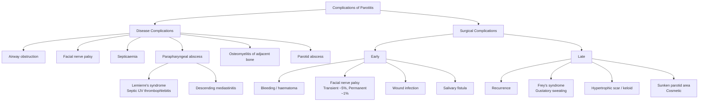

## Complications of Parotitis

Complications of parotitis can be divided into those arising from **the disease itself** (infectious parotitis — bacterial or viral) and those arising from **surgical treatment** (parotidectomy or I&D). Understanding the anatomy of the parotid region is the key to understanding why each complication occurs — every single one can be traced back to the intimate relationships between the parotid gland and its neighbours.

---

### A. Complications of Parotitis (The Disease)

***Complications of parotitis*** [2]:

#### 1. ***Airway Obstruction*** [2]

| Aspect | Detail |
|---|---|
| **Mechanism** | The deep lobe of the parotid gland is intimately related to the **parapharyngeal space**, which forms the lateral wall of the oropharynx. Severe parotid swelling — particularly bilateral or deep lobe involvement — can cause extrinsic compression and oedema of the pharyngeal/laryngeal airway. If infection extends into the parapharyngeal space (forming a parapharyngeal abscess), the pharyngeal wall bulges medially, critically narrowing the airway. Additionally, a large parotid abscess can cause trismus so severe that the patient cannot open their mouth, compromising oral airway access |
| **Clinical features** | Stridor (inspiratory — suggests supraglottic narrowing), dyspnoea, drooling (unable to swallow secretions), "hot potato" voice (muffled voice from pharyngeal oedema), tripod positioning |
| **Management** | ***Secure airway*** — this is the **first priority** before anything else. May require fibreoptic intubation or surgical airway (cricothyroidotomy/tracheostomy) if oral intubation is impossible due to trismus. Then proceed with surgical drainage + IV antibiotics [21] |

<Callout title="Airway First!" type="error">
In any deep neck space infection — whether from parotitis, peritonsillar abscess, or odontogenic infection — **airway management takes precedence over everything**. A patient can die from airway obstruction within minutes. Always assess and secure the airway before proceeding to imaging or definitive surgical drainage.
</Callout>

#### 2. ***Facial Nerve Palsy*** [2]

| Aspect | Detail |
|---|---|
| **Mechanism** | The facial nerve (CN VII) exits the stylomastoid foramen and **traverses through the substance of the parotid gland**, dividing into its 5 terminal branches (temporal, zygomatic, buccal, marginal mandibular, cervical) within it. Severe parotid inflammation, oedema, or abscess formation can **compress** the nerve within the tight fascial capsule. Direct **neuritis** (inflammatory infiltration of the nerve) can also occur. If a parotid abscess erodes into the nerve trunk, irreversible damage results |
| **Clinical features** | **Lower motor neuron (LMN) facial palsy** — weakness of the **entire ipsilateral half of the face** (forehead AND lower face), in contrast to UMN lesions which spare the forehead. Inability to close the eye (zygomatic branch), loss of nasolabial fold (buccal branch), drooping mouth corner (marginal mandibular branch). May be partial (affecting only some branches) depending on the location and extent of nerve involvement |
| **Why LMN?** | The lesion is at the level of the nerve trunk or its branches within the parotid gland — this is distal to the facial motor nucleus in the pons, so it is a peripheral (LMN) pattern. In UMN lesions (e.g., stroke), the forehead is spared because the upper face receives bilateral cortical innervation |
| **Prognosis** | If due to oedema/compression alone → usually **reversible** with treatment of the infection. If due to direct nerve destruction by abscess → may be **permanent**. Early aggressive treatment of parotitis (antibiotics ± drainage) is the best way to prevent this complication |
| **Important distinction** | Facial nerve palsy occurring with a parotid **mass** (rather than acute infection) is a **red flag for malignancy** — malignant tumours invade the nerve perineurally, whereas benign tumours merely displace it [11] |

#### 3. ***Septicaemia*** [2]

| Aspect | Detail |
|---|---|
| **Mechanism** | Bacteria from the suppurative parotid gland enter the bloodstream via the rich venous drainage of the gland (retromandibular vein → external/internal jugular system). The parotid's extensive vascular supply, combined with the virulence of organisms like *S. aureus*, facilitates haematogenous dissemination. In debilitated, immunocompromised, or elderly patients, the impaired immune response allows unchecked bacterial proliferation and systemic spread |
| **Clinical features** | High spiking fevers, rigors, tachycardia, hypotension, altered mental status — the full spectrum of **systemic inflammatory response syndrome (SIRS) → sepsis → septic shock**. End-organ dysfunction (acute kidney injury, coagulopathy, hepatic dysfunction) may develop |
| **Risk factors** | Delayed treatment, immunocompromised host, very elderly, already debilitated patients (the exact population that develops parotitis in the first place) |
| **Investigations** | Blood cultures (at least 2 sets from different sites before antibiotics), serum lactate, procalcitonin, full sepsis workup |
| **Management** | Aggressive IV fluid resuscitation, broad-spectrum IV antibiotics (escalate to immunocompromised regimen: vancomycin + piperacillin-tazobactam or carbapenem), source control (I&D if abscess), vasopressors if refractory hypotension, ICU admission |

#### 4. ***Parapharyngeal Abscess*** [2]

| Aspect | Detail |
|---|---|
| **Mechanism** | The deep lobe of the parotid gland is separated from the parapharyngeal space by only a thin fascial layer. Infection from the parotid can track directly through this fascia into the parapharyngeal space (a potential space lateral to the pharynx, bounded by the superior pharyngeal constrictor medially and the pterygoid muscles/mandible laterally). The parapharyngeal space also communicates with the retropharyngeal space, submandibular space, and masticator space — so infection can spread widely through fascial planes |
| **Clinical features** | Fever, severe sore throat, dysphagia, odynophagia, trismus, "hot potato" voice, neck swelling/induration. On intraoral exam: **medial bulging of the lateral pharyngeal wall** (pushing the tonsil medially) |
| **Danger** | The parapharyngeal space contains the **internal carotid artery, internal jugular vein, and cranial nerves IX, X, XI, XII**. Infection in this space can erode into the carotid (catastrophic haemorrhage), spread to the mediastinum via the retropharyngeal space (descending necrotising mediastinitis — a life-threatening emergency), or cause **septic jugular thrombophlebitis** |
| **Management** | CT with contrast to delineate the abscess → ***secure airway*** → ***surgical drainage*** (transcervical approach) → ***IV antibiotics*** [21] |

##### Lemierre's Syndrome (Septic Jugular Thrombophlebitis) [2]

| Aspect | Detail |
|---|---|
| **Mechanism** | ***Septic jugular thrombophlebitis*** occurs when infection from the parapharyngeal space (or directly from the deep parotid) involves the **internal jugular vein (IJV)**. Bacterial invasion of the vein wall triggers thrombosis + seeding of the thrombus with bacteria → infected thrombus → **septic emboli** disseminate via the venous system to distant sites. Classically associated with *Fusobacterium necrophorum* (a normal oral anaerobe), though any pathogen can cause it |
| **Clinical features** | High spiking fevers with rigors that fail to resolve despite antibiotics; tender/indurated neck along the course of the IJV (anterior border of sternocleidomastoid); **septic pulmonary emboli** (multiple peripheral lung nodules/cavities on CXR or CT thorax — "cannon ball" lesions); may also seed to joints (septic arthritis), liver (hepatic abscesses), bone |
| **Investigations** | CT neck with contrast (filling defect in IJV = thrombus); CT thorax (septic pulmonary emboli); blood cultures (anaerobes — need to request specifically and hold cultures for > 5 days) |
| **Management** | Prolonged IV antibiotics (4–6 weeks; must cover anaerobes — metronidazole or clindamycin + broad-spectrum agent); anticoagulation is controversial (some advocate for it to prevent thrombus propagation); surgical drainage of the primary source; IJV ligation in refractory cases is rarely required |

<Callout title="Lemierre's Syndrome — The 'Forgotten Disease'">
Lemierre's syndrome was common in the pre-antibiotic era, became rare with antibiotics, but has re-emerged — partly due to more conservative antibiotic prescribing for upper respiratory infections. It classically follows pharyngotonsillitis in young adults but can complicate any deep neck space infection, including parotitis. The triad of **recent oropharyngeal/parotid infection + septic clinical picture + septic pulmonary emboli** should trigger this diagnosis.
</Callout>

#### 5. ***Osteomyelitis of Adjacent Facial Bone*** [2]

| Aspect | Detail |
|---|---|
| **Mechanism** | Direct contiguous spread of infection from the parotid gland to the adjacent **mandible** (ramus of mandible) or **temporal bone** (mastoid process). The parotid lies directly over the ramus of the mandible and just anterior to the mastoid process. In severe, prolonged, or inadequately treated parotitis — particularly in immunocompromised patients — bacteria can penetrate the periosteum and establish infection within the bone marrow (osteomyelitis). The mandible's relatively poor blood supply (compared to, say, the tibia) makes it somewhat vulnerable once infection reaches the bone |
| **Clinical features** | Persistent deep bone pain despite treatment of soft tissue infection, chronic draining sinuses, loosening of teeth (if alveolar bone involved), pathological fracture in severe cases. Systemic features may be mild (chronic osteomyelitis) or marked (acute osteomyelitis) |
| **Investigations** | CT (cortical erosion, periosteal reaction); MRI (bone marrow oedema — most sensitive early finding); bone biopsy + culture for definitive microbiological diagnosis; bone scan (increased uptake — sensitive but non-specific) |
| **Management** | Prolonged IV antibiotics (minimum 4–6 weeks, guided by bone culture); surgical debridement of necrotic bone if present; address the source (treat the parotitis/abscess); hyperbaric oxygen therapy may be considered as adjunct in refractory cases (promotes angiogenesis and osteoclast/osteoblast activity in poorly vascularised infected bone) |

#### 6. Parotid Abscess (Complication of Untreated/Undertreated Suppurative Parotitis)

| Aspect | Detail |
|---|---|
| **Mechanism** | ***Contiguous infection or haematogenous seeding to intraparotid or periparotid lymph nodes*** leads to abscess formation [2]. When bacteria proliferate faster than the immune response can contain them, focal liquefactive necrosis occurs → discrete walled-off pus collection within or adjacent to the gland. The parotid's unique intraglandular lymph nodes can serve as foci for abscess development |
| **Clinical features** | Persistent or worsening pain and swelling despite 48 hours of IV antibiotics, fluctuance on examination (late sign), persistent high fever, failure of inflammatory markers to downtrend |
| **Investigations** | CT with IV contrast — rim-enhancing hypodense collection confirms abscess |
| **Management** | Incision and drainage (or US-guided aspiration for smaller collections) + continue IV antibiotics |

---

### B. Complications of Viral Parotitis (Mumps)

Mumps is usually self-limiting, but complications can affect multiple organ systems due to the virus's tropism for glandular and neural tissue:

| Complication | Mechanism / Explanation | Frequency |
|---|---|---|
| **Orchitis/epididymo-orchitis** | Mumps virus has tropism for germinal epithelium of the testes. Haematogenous spread → viral replication in testicular cells → inflammation and oedema within the rigid tunica albuginea → **ischaemic pressure necrosis** of seminiferous tubules. Presents as testicular pain/swelling 4–8 days after parotid onset | 15–30% of **post-pubertal** males (rare pre-puberty) |
| **Subfertility** (post-orchitis) | Ischaemic damage to seminiferous tubules → impaired spermatogenesis. Bilateral orchitis (rare — ~15% of those with orchitis) carries the highest risk. Complete sterility is uncommon (~1%) but oligospermia can occur in up to 13% | Uncommon but feared |
| **Meningitis** (aseptic) | Viral invasion of the meninges → lymphocytic meningitis. CSF shows lymphocytic pleocytosis, elevated protein, normal glucose | Up to 10% (most are subclinical); CSF pleocytosis may be present in > 50% without clinical meningitis |
| **Encephalitis** | Direct viral invasion of brain parenchyma | Rare (0.1–0.3%); mortality ~1.5% |
| **Pancreatitis** | Viral tropism for pancreatic acinar cells → inflammation | ~5%; presents with epigastric pain, vomiting, elevated amylase AND lipase (helps distinguish from parotitis-only elevated amylase where lipase is normal) |
| **Sensorineural hearing loss** | Viral damage to the cochlea (organ of Corti) and/or cochlear nerve → **unilateral** sensorineural deafness. Usually permanent | ~1 in 20,000 cases; usually unilateral |
| **Oophoritis** | Ovarian inflammation (analogous to orchitis) | 5% of post-pubertal females; rarely causes infertility (ovarian reserve is more resilient than testicular) |
| **Myocarditis** | Viral inflammation of myocardium | Rare; usually subclinical ECG changes |
| **Arthritis** | Immune-mediated reactive arthritis | Rare; large joints, self-limiting |

> **How to distinguish pancreatitis from parotitis when amylase is elevated**: Check **lipase**. Lipase is elevated ONLY in pancreatitis, not in isolated parotitis. If both amylase and lipase are raised in a mumps patient, they likely have both parotitis AND pancreatitis.

---

### C. Complications of Parotidectomy (Surgical Complications)

If parotitis requires surgical intervention (I&D of abscess, or parotidectomy for recurrent disease or concomitant neoplasm), there are specific surgical complications:

#### Early Complications [22]

| Complication | Mechanism | Detail |
|---|---|---|
| ***Bleeding / haematoma*** [22] | Injury to the rich vascular supply of the parotid region (external carotid artery branches, retromandibular vein). Post-operative reactionary (first 24 hours) or secondary (days 5–10, usually infection-related) haemorrhage | Expanding neck haematoma can compress the airway → **surgical emergency** requiring urgent re-exploration and evacuation. This is why patients are monitored closely post-operatively with a drain in situ |
| ***Facial nerve palsy*** [22] | The facial nerve runs through the parotid gland and must be dissected and preserved during parotidectomy. Even with meticulous technique, the nerve can be injured by direct trauma, traction, electrocautery heat, or post-operative oedema. ***Transient ~5%***; ***permanent ~1%*** [22] | Transient palsy is usually due to neuropraxia (oedema/traction) and recovers over weeks to months. Permanent palsy results from axonotmesis or neurotmesis (nerve division). If the nerve is intentionally sacrificed (for malignant tumour encasement), nerve grafting (great auricular nerve or sural nerve graft) can be performed |
| ***Wound infection*** [22] | Bacterial contamination of the surgical field | Standard wound infection management: antibiotics, wound care, drainage if collection forms |
| ***Salivary fistula*** [22] | Residual parotid tissue continues to produce saliva which leaks through the wound rather than draining via Stensen's duct (if the duct is damaged or the remaining gland is disrupted) | Usually self-limiting — managed with pressure dressings, antisialogogue drugs (e.g., glycopyrrolate to reduce salivary secretion), and botulinum toxin injection to the residual gland in refractory cases |

#### Late Complications [23]

| Complication | Mechanism | Detail |
|---|---|---|
| ***Recurrence*** [23] | Incomplete excision of the primary pathology (particularly relevant for pleomorphic adenoma, which has pseudopod extensions beyond the visible tumour capsule → tumour seeding if capsule is violated) | Pleomorphic adenoma has a ~2–4% recurrence rate after adequate superficial parotidectomy, but much higher (20–45%) after enucleation alone. Recurrent pleomorphic adenoma is multinodular and much harder to treat |
| ***Frey's syndrome — gustatory sweating*** [23] | ***Characterized by sweating and flushing of facial skin over parotid bed and neck during mastication*** [11]. ***Results from aberrant regeneration of cut parasympathetic fibres between the otic ganglion and salivary tissues which leads to innervation of sweat glands and subcutaneous vessels*** [11]. The auriculotemporal nerve (a branch of CN V3 carrying post-ganglionic parasympathetic secretomotor fibres from the otic ganglion to the parotid) is severed during surgery. During nerve regeneration, these parasympathetic fibres aberrantly innervate the sympathetically-controlled **sweat glands** and **cutaneous blood vessels** of the overlying skin. When the patient eats (triggering salivary parasympathetic discharge), the misdirected fibres stimulate sweating and flushing instead | Occurs in **30–60%** of patients (clinically significant in ~10%). Diagnosed by **Minor's starch-iodine test** (paint iodine on skin → dust with starch powder → give the patient food → sweating areas turn blue-black). Treatment: topical antiperspirant (aluminium chloride), **botulinum toxin A injection** (blocks acetylcholine release at the aberrant nerve terminals — lasts 6–12 months), interposition barrier graft (AlloDerm, SCM flap, or SMAS flap) at time of initial surgery to prevent aberrant reinnervation |
| ***Hypertrophic scar / keloid*** [23] | Abnormal wound healing with excessive collagen deposition | The modified Blair incision is placed in natural skin creases to minimise visible scarring, but some patients (especially those prone to keloid — more common in Chinese/Asian populations) develop problematic scars. Managed with silicone sheets, intralesional steroid injection (triamcinolone), or revision |
| ***Sunken parotid area, cosmetic problem*** [23] | Removal of the parotid gland leaves a **volume deficit** in the preauricular region → visible concavity/asymmetry | Can be addressed with **SMAS flap advancement**, **free fat grafting**, or **AlloDerm** implantation at the time of surgery or secondarily. This is particularly noticeable in thin patients |

---

### D. Complications of Sialolithiasis-Related Sialadenitis

***Complication: sialadenitis*** from ductal stone — ***pus expressed from ductal orifice*** [24]

| Complication | Mechanism |
|---|---|
| **Superimposed infection (sialadenitis)** | Ductal obstruction by stone → salivary stasis → retrograde bacterial infection → suppurative sialadenitis. This is essentially how sialolithiasis causes parotitis [24] |
| **Abscess formation** | Progressive infection with walled-off pus collection → ***potentially compromises the airway*** if large or in the submandibular/parapharyngeal region [2] |
| **Ductal stricture** | Chronic inflammation and scarring of the duct wall → permanent narrowing → predisposes to recurrent stasis and infection even after stone removal |
| **Gland atrophy** | Complete chronic obstruction → the gland ceases saliva production → progressive fibrosis and atrophy. The gland eventually feels firm and non-tender, and the patient becomes asymptomatic (the gland essentially "burns out") |
| **Ranula** | Iatrogenic complication of transoral stone removal — excessive trauma to the sublingual gland or Wharton's duct during surgery can cause a **retention cyst** (ranula) in the floor of the mouth [2] |

---

<Callout title="High Yield Summary">

1. **Five key complications of parotitis** (the disease): ***airway obstruction, facial nerve palsy, septicaemia, parapharyngeal abscess (→ Lemierre's syndrome), osteomyelitis of adjacent bone*** [2]
2. **Airway obstruction** is the most immediately life-threatening — always **secure the airway first** in deep neck infections
3. **Facial nerve palsy** in parotitis = compression/neuritis from inflammation/abscess; usually reversible if treated early. Facial nerve palsy with a parotid mass = think malignancy
4. **Parapharyngeal abscess** can lead to **Lemierre's syndrome** (septic IJV thrombophlebitis → septic pulmonary emboli) or descending necrotising mediastinitis
5. **Parotidectomy early complications**: ***bleeding/haematoma, facial nerve palsy (transient ~5%, permanent ~1%), wound infection, salivary fistula*** [22]
6. **Parotidectomy late complications**: ***recurrence, Frey's syndrome (gustatory sweating), hypertrophic scar/keloid, sunken parotid area*** [23]
7. **Frey's syndrome** = aberrant parasympathetic reinnervation of sweat glands after auriculotemporal nerve injury → sweating and flushing during eating. Diagnosed by Minor's starch-iodine test. Treated with botulinum toxin A or barrier graft
8. **Mumps complications**: orchitis (15–30% post-pubertal males), meningitis, pancreatitis, sensorineural deafness, encephalitis
9. **Distinguish mumps pancreatitis from parotitis**: both raise amylase, but **lipase is elevated only in pancreatitis**
</Callout>

---

<ActiveRecallQuiz
  title="Active Recall - Complications of Parotitis"
  items={[
    {
      question: "List the 5 key complications of acute suppurative parotitis as a disease.",
      markscheme: "1. Airway obstruction (from parapharyngeal extension/deep lobe swelling). 2. Facial nerve palsy (CN VII runs through the gland — compression by oedema/abscess). 3. Septicaemia (haematogenous bacterial dissemination). 4. Parapharyngeal abscess (direct extension from deep lobe through fascia into parapharyngeal space — may lead to Lemierre's syndrome). 5. Osteomyelitis of adjacent facial bone (contiguous spread to mandible or temporal bone)."
    },
    {
      question: "What is Lemierre's syndrome, what is its pathogenesis in relation to parotitis, and what is the classic imaging finding on CT thorax?",
      markscheme: "Lemierre's syndrome = septic jugular vein thrombophlebitis. Pathogenesis: Parotitis extends to parapharyngeal space, infection involves the internal jugular vein wall, causing thrombosis seeded with bacteria. Septic emboli disseminate via venous system. CT thorax shows multiple peripheral septic pulmonary emboli (cavitating nodules). CT neck shows filling defect in the internal jugular vein."
    },
    {
      question: "What is Frey's syndrome? Explain the mechanism of aberrant reinnervation, how it is diagnosed, and how it is treated.",
      markscheme: "Frey's syndrome = gustatory sweating and flushing over the parotid bed during eating. Mechanism: During parotidectomy, parasympathetic secretomotor fibres in the auriculotemporal nerve (from otic ganglion, intended for parotid acinar cells) are severed. They aberrantly regenerate and reinnervate sweat glands and cutaneous vessels instead. Eating triggers parasympathetic discharge causing sweating/flushing. Diagnosis: Minor's starch-iodine test. Treatment: botulinum toxin A injection (blocks ACh release at aberrant terminals), topical antiperspirants, interposition barrier graft at surgery."
    },
    {
      question: "A patient with mumps develops epigastric pain and vomiting with elevated serum amylase. How do you distinguish whether this is due to parotitis alone or concurrent pancreatitis?",
      markscheme: "Check serum lipase. Lipase is elevated ONLY in pancreatitis, not in isolated parotitis. Both parotitis and pancreatitis raise amylase (S-type salivary isoamylase from parotid, P-type pancreatic isoamylase from pancreas). If both amylase and lipase are elevated, the patient likely has mumps pancreatitis in addition to parotitis."
    },
    {
      question: "What are the early complications of parotidectomy and the approximate rates of facial nerve injury?",
      markscheme: "Early complications: (1) Bleeding/haematoma (can compress airway — surgical emergency), (2) Facial nerve palsy — transient approximately 5%, permanent approximately 1%, (3) Wound infection, (4) Salivary fistula (residual gland secretes saliva through wound). Facial nerve palsy occurs because CN VII traverses through the parotid gland and must be dissected during surgery."
    },
    {
      question: "Why is airway obstruction a complication of parotitis, and what is the first step in management?",
      markscheme: "The deep lobe of the parotid is intimately related to the parapharyngeal space, which forms the lateral wall of the oropharynx. Severe swelling or parapharyngeal abscess formation causes extrinsic compression of the pharyngeal airway. Severe trismus may also prevent oral access. First step: SECURE THE AIRWAY (fibreoptic intubation, or surgical airway if oral route is impossible). Airway takes priority over all other management including imaging or surgical drainage."
    }
  ]}
/>

---

## References

[2] Senior notes: felixlai.md, sections 322–323
[11] Senior notes: felixlai.md, section 338
[21] Lecture slides: GC 219. Infections and tumours in pharynx and oral cavity.pdf, p22
[22] Lecture slides: GC 217. Facial nerve palsy and salivary gland diseases.pdf, p79
[23] Lecture slides: GC 217. Facial nerve palsy and salivary gland diseases.pdf, p80
[24] Lecture slides: GC 219. Infections and tumours in pharynx and oral cavity.pdf, p28
