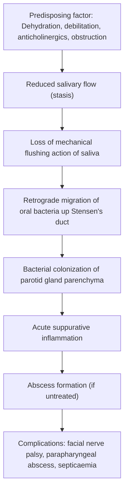

# Parotitis

## Definition

Parotitis literally breaks down as **"parotid" + "-itis"** → inflammation of the parotid gland. The parotid gland itself gets its name from Greek: *para-* (beside) + *ous/otos* (ear) — the gland that sits beside the ear.

Parotitis refers to **inflammation of the parotid gland**, which may be caused by infection (bacterial or viral), autoimmune disease, obstruction, or systemic conditions. In clinical practice, the term most commonly refers to either:

- **Acute suppurative (bacterial) parotitis** — a potentially serious infection seen in debilitated, dehydrated, post-operative, or elderly patients
- **Viral parotitis** — classically caused by mumps, presenting as bilateral painless-to-mildly-tender swelling

> **Why the parotid gland specifically?** The parotid is the largest salivary gland and has a long duct (Stensen's duct) that opens into the oral cavity — a non-sterile environment. Any condition that reduces salivary flow allows oral bacteria to migrate retrogradely up the duct into the gland. The parotid's serous (watery, low-mucin) secretion also lacks the protective mucin-rich, lysozyme-dense properties of submandibular secretions, making it relatively more vulnerable to ascending infection [1][2].

---

## Epidemiology

### Acute Suppurative Parotitis
- **Most common in elderly, debilitated, post-operative, or immunocompromised patients**
- Historically a dreaded post-surgical complication (before modern IV fluid resuscitation) — mortality was historically very high in the pre-antibiotic era
- Incidence has decreased with improved perioperative hydration and oral hygiene practices
- **No strong sex predilection** for suppurative parotitis specifically (contrast with sialolithiasis which has female predominance)

### Viral Parotitis (Mumps)
- ***Mumps is the commonest cause of viral parotitis*** [3]
- Before widespread vaccination, mumps was a common childhood illness (peak age 5–9 years)
- In Hong Kong, MMR (Measles-Mumps-Rubella) vaccination is part of the Childhood Immunisation Programme — given at 1 year and Primary 1 (age 6). As a result, mumps incidence in HK has dropped dramatically
- Sporadic outbreaks still occur in unvaccinated or under-vaccinated populations, including young adults in institutional settings (university dormitories, military barracks)

### HIV-Associated Parotid Enlargement
- Increased incidence of **benign lymphoepithelial cysts** and **diffuse infiltrative lymphocytosis syndrome (DILS)** causing bilateral parotid enlargement in HIV patients — particularly seen in the pre-HAART era [2]

---

## Risk Factors

Understanding risk factors requires understanding the pathophysiology — anything that **reduces salivary flow** or **introduces organisms** into the gland predisposes to parotitis.

| Risk Factor | Mechanism |
|---|---|
| ***Dehydration*** (post-operative, elderly, critically ill) | Reduced salivary production → stasis → retrograde bacterial colonization [1] |
| ***Debilitation / infirm elderly*** | Poor oral hygiene + reduced oral intake → bacterial overgrowth + reduced salivary flow [1] |
| **Salivary duct obstruction** (calculi/sialolithiasis) | Physical obstruction → stasis proximal to stone → retrograde infection [2] |
| **Tumour of the oral cavity** | Extrinsic compression of Stensen's duct → obstruction → stasis [2] |
| **Post-operative / intubated patients** | Dehydration + NPO status + endotracheal tube reduces oral clearance + anticholinergic anaesthetic agents [2] |
| **Anticholinergic drugs** (atropine, glycopyrrolate, antihistamines, tricyclics) | Block muscarinic M3 receptors on salivary acinar cells → **↓ salivary flow** [2] |
| **Recent intensive teeth cleaning** | Transient bacteraemia + mechanical trauma to duct orifice [2] |
| **Poor oral hygiene** | Increased bacterial load in oral cavity → greater risk of retrograde seeding |
| **Immunosuppression** (HIV, chemotherapy, diabetes mellitus) | Impaired local and systemic immune defences |
| **Sjögren's syndrome** | Chronic lymphocytic infiltration of salivary glands → reduced flow → recurrent sialadenitis |
| **Radiation to head & neck** | Radiation-induced fibrosis and atrophy of salivary acini → **xerostomia** (dry mouth) → stasis |

<Callout title="Post-Operative Parotitis" type="idea">
Think of the classic scenario: an elderly patient, 2–3 days post-abdominal surgery, NPO, on IV fluids (often under-hydrated), receiving anticholinergic premedication. They develop a unilateral painful swelling anterior to the ear with purulent discharge from Stensen's duct. This is the textbook presentation of acute suppurative parotitis.
</Callout>

---

## Anatomy and Function

### Gross Anatomy of the Parotid Gland

The parotid gland is the **largest of the three paired major salivary glands** (parotid, submandibular, sublingual). Understanding its anatomy is critical because of the structures that run **through** it.

**Location** [2]:
- ***Anterior to the external auditory canal***
- ***Superior to the angle of the mandible***
- ***Inferior to the zygomatic arch***
- ***Majority is superficial to the masseter muscle***
- The gland wraps around the posterior border of the ramus of the mandible

**Lobes**:
- The parotid is divided into a **superficial lobe** (80%) and a **deep lobe** (20%) by the **facial nerve (CN VII)**, which passes through the substance of the gland
- ***Differentiation between superficial and deep lobe:***
  - ***Imaginary line from mandible to mastoid tip*** (above = superficial; below = deep)
  - ***Retromandibular vein*** (above = superficial; below = deep) [2]

**Key structures traversing/within the parotid gland** (from superficial to deep — mnemonic: **"SaVaNA"** = Superficial to deep: Skin → Vein → Artery → Nerve → ...or think of it as the facial nerve is the deepest major structure):

Actually, the classic teaching is from **lateral to medial (superficial to deep)**:
1. **Facial nerve (CN VII)** — the most surgically important structure. It enters the gland after exiting the stylomastoid foramen and divides into its 5 terminal branches within the gland:
   - **T**emporal
   - **Z**ygomatic
   - **B**uccal
   - **M**arginal mandibular
   - **C**ervical
   - Mnemonic: **"To Zanzibar By Motor Car"** or **"Two Zebras Bit My Cat"**
2. **Retromandibular vein** (formed by superficial temporal + maxillary veins)
3. **External carotid artery** (deepest of the three)

> **Why does the facial nerve matter so much?** The facial nerve runs *through* the parotid gland parenchyma. Any parotid pathology — infection, abscess, tumour, surgery — can damage the facial nerve, causing **facial nerve palsy**. This is why facial nerve palsy is a complication of parotitis [2].

**Stensen's Duct** [2]:
- ***Arises from the anterior border of the parotid gland***
- ***4–7 cm long***
- Runs superficially over the masseter muscle, then pierces the buccinator muscle
- ***Opens opposite the upper second molar*** on the buccal mucosa (the parotid papilla)
- This is where you look when examining for purulent discharge in suspected parotitis

### Parotid Gland Function

- The parotid gland produces **purely serous** (watery) saliva — rich in **amylase** (hence elevated serum amylase in parotitis), water, and electrolytes
- Contributes approximately **25% of total salivary volume** at rest, but **~50% during stimulated secretion** (eating)
- Saliva has antimicrobial properties: contains **IgA, lysozyme, lactoferrin, and histatins**
- Salivary flow is stimulated by **parasympathetic innervation** via the glossopharyngeal nerve (CN IX) → inferior salivatory nucleus → otic ganglion → auriculotemporal nerve → parotid
- Sympathetic innervation (from superior cervical ganglion) produces a small volume of thick, protein-rich secretion

> **Why does serum amylase rise in parotitis?** The parotid gland is the major source of salivary amylase. When the gland is inflamed, amylase leaks into the blood. Elevated serum amylase in the absence of pancreatitis supports the diagnosis of parotitis [2].

### Blood Supply and Lymphatic Drainage

- **Arterial supply**: Branches of the external carotid artery (including the transverse facial artery)
- **Venous drainage**: Retromandibular vein
- **Lymphatic drainage**: Intraparotid lymph nodes (superficial and deep) → deep cervical chain
  - The parotid gland is **unique** among salivary glands in that it contains **intraglandular lymph nodes** (because the lymph nodes were encapsulated during embryological development before the gland fully formed). This means **metastatic lymph node disease** (e.g., from scalp SCC, melanoma) can present as an intraparotid mass

### Fascial Relationships

- The parotid gland is enclosed within a **fibrous capsule** derived from the **investing layer of deep cervical fascia**
- The deep lobe of the parotid is closely related to the **parapharyngeal space** — this is why deep lobe parotid infections can extend to form **parapharyngeal abscesses** [2]

---

## Etiology

### A. Suppurative (Bacterial) Parotitis

***Acute suppurative parotitis is most commonly caused by Staphylococcus aureus*** [1][2].

It is ***often polymicrobial***, reflecting retrograde contamination from the oral flora [2].

| Category | Organisms |
|---|---|
| **Aerobes** | ***Staphylococcus aureus*** (most common) [1][2], *Streptococcus viridans*, *Streptococcus pneumoniae*, *Streptococcus pyogenes*, *Haemophilus influenzae*, *Mycobacterium* spp., *Enterobacteriaceae*, *Pseudomonas aeruginosa*, *Eikenella corrodens* [2] |
| **Anaerobes** | *Peptostreptococcus*, *Actinomyces*, *Bacteroides*, *Fusobacterium*, *Prevotella*, *Porphyromonas* [2] |

**Key points:**
- In **immunocompetent** patients: *S. aureus* and oral streptococci predominate
- In **immunocompromised** patients: Gram-negative organisms (Pseudomonas, Enterobacteriaceae) and MRSA become more important — requiring broader-spectrum empirical cover
- **Mycobacterial parotitis** (both TB and non-tuberculous mycobacteria/NTM) should be considered in Hong Kong given the intermediate TB prevalence. NTM parotitis is classically seen in children (presenting as a chronic, non-tender parotid mass with violaceous skin)
- **Actinomycosis** is a rare but important cause — presents as a chronic, indolent infection with draining sinuses and "sulfur granules"

### B. Non-Suppurative (Viral) Parotitis

| Virus | Notes |
|---|---|
| ***Mumps (Paramyxovirus)*** | ***Commonest*** cause of viral parotitis [3]. Bilateral parotid swelling in 70% of cases. Preceded by prodrome (fever, malaise, myalgia). Orchitis in post-pubertal males (15–30%). Complications: meningitis, encephalitis, pancreatitis, deafness |
| ***Coxsackievirus*** | Can cause parotitis as part of hand-foot-mouth disease spectrum [3] |
| ***CMV (Cytomegalovirus)*** | Especially in immunocompromised (HIV, transplant patients) [3] |
| ***Influenza*** | Rare cause [3] |
| **Parainfluenza** | [2] |
| **Herpes simplex virus (HSV)** | [2] |
| **Epstein-Barr virus (EBV)** | Parotitis as part of infectious mononucleosis; also associated with lymphoepithelial carcinoma in endemic areas [2] |
| **HIV** | Causes **benign lymphoepithelial cysts** (bilateral, painless parotid enlargement); also **DILS** (diffuse infiltrative lymphocytosis syndrome) [2] |

<Callout title="Viral vs. Bacterial Parotitis — Key Distinctions">

- **Viral**: prodromal symptoms → bilateral swelling (often), **no purulent discharge from Stensen's duct**, self-limiting (5–10 days) [2]
- **Bacterial**: unilateral swelling (usually), **purulent discharge expressible from Stensen's duct**, systemically unwell with high fever, requires antibiotics [1][2]
</Callout>

### C. Non-Infectious Causes of Parotid Enlargement

***Causes of bilateral parotid enlargement*** [4]:

| Cause | Mechanism |
|---|---|
| ***Pseudoparotomegaly (e.g., masseter hypertrophy)*** | Not true parotid enlargement — masseter muscle bulk mimics parotid swelling. Seen in bruxism or habitual clenching [4] |
| ***Bulimia nervosa*** | Repeated vomiting → chronic stimulation of salivary glands → sialadenosis (non-inflammatory hypertrophy of acinar cells). The acid exposure also triggers compensatory hypersecretion [4] |
| ***Alcoholic cirrhosis*** | Fatty infiltration of parotid glands + autonomic neuropathy → sialadenosis [4] |
| ***Diabetes mellitus*** | Fatty infiltration of parotid glands → painless bilateral enlargement [4] |
| ***Hypothyroidism*** | Mucopolysaccharide deposition in glandular tissue [4] |
| ***Drugs (e.g., phenytoin)*** | Drug-induced sialadenosis [4] |
| **Sjögren's syndrome** | Autoimmune lymphocytic infiltration → chronic inflammation → progressive glandular enlargement. Can be bilateral. Associated with dry eyes (keratoconjunctivitis sicca) and dry mouth (xerostomia) |
| **Sarcoidosis** | Non-caseating granulomatous infiltration. Heerfordt syndrome = uveoparotid fever (bilateral parotid enlargement + anterior uveitis + facial nerve palsy + fever) |
| **IgG4-related disease** | Storiform fibrosis and IgG4+ plasma cell infiltration → bilateral painless parotid/submandibular enlargement (previously called Mikulicz disease) |

<Callout title="Bilateral Parotid Enlargement — Think Non-Infectious!" type="idea">
When you see **bilateral painless parotid enlargement** without signs of infection (no fever, no tenderness, no pus), think: bulimia, alcohol, diabetes, hypothyroidism, Sjögren's, sarcoidosis, HIV, or drugs. This is a classic exam question [4].
</Callout>

---

## Pathophysiology

### Acute Suppurative Parotitis

The pathogenesis follows a logical sequence [2]:

**Step-by-step explanation:**

1. **Salivary stasis** — any condition that reduces salivary flow (dehydration, anticholinergics, duct obstruction) removes the gland's primary defence mechanism: the continuous forward flushing of saliva out through the duct. Saliva also contains antimicrobial factors (IgA, lysozyme) — reduced production means reduced local immunity

2. ***Retrograde seeding of Stensen's duct by mixed oral flora*** — normally, the unidirectional flow of saliva prevents bacteria from ascending the duct. When flow stops, bacteria from the oral cavity (which harbours >700 species) can travel retrogradely up the duct into the gland [2]

3. **Acute bacterial infection** — the bacteria multiply within the gland's ductal system and parenchyma, triggering an acute inflammatory response (neutrophilic infiltration, oedema, pus formation)

4. ***May be complicated by abscess formation*** — contiguous infection can lead to discrete abscess collections within the gland, or infection can spread via ***haematogenous seeding to intraparotid or periparotid lymph nodes*** [2]

5. **Extension to adjacent spaces** — the deep lobe of the parotid is intimately related to the parapharyngeal space. Infection can track into this space, causing parapharyngeal abscess, which in turn can lead to **Lemierre's syndrome** (septic jugular thrombophlebitis) [2]

### Viral Parotitis (Mumps)

- The mumps virus (a Paramyxovirus, genus *Rubulavirus*) is transmitted via respiratory droplets
- The virus infects the upper respiratory tract epithelium → primary viraemia → disseminates to salivary glands (tropism for ductal epithelium) → replicates in parotid ductal and acinar cells
- Triggers a lymphocytic inflammatory infiltrate → interstitial oedema → gland swelling
- The swelling is **diffuse and non-suppurative** (no pus) — this is because it's a viral process with lymphocytic (not neutrophilic) infiltration
- Incubation period: 14–25 days (average 16–18 days)
- Virus can also disseminate to other glandular/neural tissues: testes (orchitis), pancreas (pancreatitis), meninges (meningitis), cochlea (sensorineural deafness)

### Sialadenosis (Non-Inflammatory Enlargement)

- This is the mechanism behind bilateral parotid enlargement in **bulimia, alcoholism, DM, hypothyroidism**
- It represents **non-inflammatory, non-neoplastic acinar hypertrophy** — the acinar cells (particularly serous cells) enlarge due to metabolic/autonomic dysfunction
- In **bulimia**: chronic vomiting stimulates gustatory-salivary reflexes repeatedly; the acid exposure to the oral cavity may also drive compensatory salivary hyperactivity → work hypertrophy of acinar cells
- In **alcoholism/cirrhosis**: autonomic neuropathy (affecting parasympathetic innervation of the parotid) leads to degranulation and hypertrophy of acinar cells; additionally, fatty infiltration contributes
- **Key point**: sialadenosis is painless and non-tender (no inflammation)

---

## Classification

### By Aetiology

| Category | Subtypes |
|---|---|
| **Infectious** | Bacterial (suppurative), Viral (non-suppurative), Mycobacterial, Fungal (rare) |
| **Obstructive** | Sialolithiasis, Ductal stricture, Mucous plug |
| **Autoimmune** | Sjögren's syndrome, IgG4-related disease |
| **Granulomatous** | Sarcoidosis, TB |
| **Metabolic/Systemic** | Bulimia, Alcoholic cirrhosis, DM, Hypothyroidism |
| **Drug-induced** | Phenytoin, anticholinergics (indirect — via reduced flow), iodine-containing contrast |
| **Neoplastic** | Primary or metastatic parotid tumours (not parotitis per se, but can present with parotid enlargement ± secondary infection) |
| **Radiation-induced** | Post-radiotherapy sialadenitis |

### By Chronicity

| Type | Features |
|---|---|
| **Acute parotitis** | Sudden onset, < 4 weeks. Usually infectious (bacterial or viral) |
| **Chronic parotitis** | Recurrent episodes or persistent inflammation > 3 months. Think: recurrent juvenile parotitis (in children), Sjögren's, IgG4-RD, chronic sialadenitis from stones |
| **Recurrent parotitis of childhood** | Recurrent episodes of acute parotitis in children (age 3–6), often unilateral, aetiology unclear (possibly related to ductal ectasia and reduced salivary flow). Usually self-limiting by puberty |

### By Laterality

| Pattern | Think of... |
|---|---|
| **Unilateral** | Bacterial suppurative parotitis, sialolithiasis, parotid tumour, parotid abscess |
| **Bilateral** | Viral parotitis (mumps), Sjögren's, bulimia, alcoholism, DM, hypothyroidism, HIV, sarcoidosis, drugs [4] |

---

## Clinical Features

### Symptoms

| Symptom | Pathophysiological Basis |
|---|---|
| ***Sudden onset of firm swelling*** in the preauricular/postauricular region extending to the angle of mandible [2] | Acute inflammatory oedema and cellular infiltration of the parotid gland parenchyma within its fascial capsule. The gland is bounded by the structures described above (EAC, mandible angle, zygomatic arch), so swelling tracks along these landmarks |
| ***Exquisite local pain and tenderness*** [2] | Rapid swelling within a tight fascial capsule → increased intraglandular pressure → stimulation of pain fibres. Additionally, inflammatory mediators (prostaglandins, bradykinin) directly sensitize nociceptors |
| **Erythema and warmth of overlying skin** | Classical signs of acute inflammation (rubor, calor) — vasodilation and increased blood flow from inflammatory mediators (histamine, NO) |
| ***Trismus*** (difficulty opening mouth) [2] | The parotid gland is intimately related to the masseter muscle and the temporomandibular joint. Inflammation and oedema in the parotid region irritate and splint the muscles of mastication → reflex muscle spasm → limited jaw opening |
| ***Dysphagia*** (difficulty swallowing) [2] | Deep lobe swelling can impinge on the parapharyngeal space and oropharynx, narrowing the pharyngeal lumen. Pain also inhibits swallowing |
| ***Fever and chills*** [2] | Systemic inflammatory response to bacterial infection (IL-1, IL-6, TNF-α → hypothalamic PGE2 → raised thermostat set point). Chills/rigors indicate bacteraemia |
| ***Generalized toxicity*** (malaise, anorexia) [2] | Cytokine-mediated systemic effects of infection/sepsis |
| **Foul taste in mouth** | Purulent material draining from Stensen's duct into the oral cavity |
| **Xerostomia** (dry mouth) | If salivary flow is obstructed or the gland is severely damaged, reduced salivary output to the mouth |

### Signs

| Sign | Pathophysiological Basis |
|---|---|
| ***Firm, erythematous swelling involving the preauricular and postauricular region extending to the angle of mandible*** [2] | Parotid gland boundaries: anterior to EAC, overlying masseter, extending to mandibular angle. The gland is encapsulated, so the swelling tends to be diffuse within these boundaries |
| ***Purulent material expressed from the orifice of Stensen's duct*** (opposite upper 2nd molar) on bimanual massage of the gland [1][2] | This is the **hallmark sign** of suppurative parotitis. Bacteria within the gland produce pus; external pressure on the gland forces this pus anterogradely through Stensen's duct. **This sign distinguishes suppurative from viral parotitis** (viral parotitis does NOT produce purulent discharge) [2] |
| **Induration of the gland** | Inflammatory infiltrate and oedema within the parenchyma |
| **Elevation of ear lobe** | The parotid gland lies just below and anterior to the ear. Significant swelling lifts the ear lobe upward and outward — a classic clinical sign |
| **Fluctuance** (late sign) | Indicates abscess formation — liquefactive necrosis has produced a discrete pus collection within the gland |
| **Facial nerve palsy** (rare but important) | The facial nerve runs through the parotid gland. Severe infection, abscess formation, or surgical intervention can damage the nerve → lower motor neuron facial weakness. **If facial nerve palsy is present with a parotid mass, always consider malignancy** (parotid tumour with perineural invasion) |
| **Trismus** (on examination) | Measured as inter-incisor distance < 35mm. Reflects irritation of masticatory muscles |
| **Cervical lymphadenopathy** | Regional lymph nodes (upper deep cervical chain) become reactive in response to infection |

### Specific Features by Aetiology

#### Viral Parotitis (Mumps) [2][3]

- ***Distinguished from suppurative parotitis by a prodromal period*** (2–3 days of fever, headache, malaise, myalgia, anorexia) ***followed by acute swelling of the gland***
- ***Lasts 5–10 days*** and is ***often bilateral*** (70%) [2]
- ***Does NOT give purulent discharge from Stensen's duct*** [2]
- ***Diagnosis by clinical presentation and serology*** (mumps IgM, or 4-fold rise in IgG) [3]
- The swelling characteristically obscures the angle of the mandible
- Pain is worsened by eating (salivary stimulation) or acidic foods (lemon juice — sometimes used as a provocative test)

#### Acute Suppurative Parotitis [1][2]

- ***Dehydrated, infirm, elderly*** patient [1]
- ***Tender swelling*** [1]
- ***Pus from duct opening*** [1]
- Usually **unilateral** (bilateral suppurative parotitis is uncommon and suggests severe systemic illness)
- Rapid onset over 24–48 hours
- High fever, toxicity

#### HIV-Associated Parotid Enlargement

- **Bilateral, painless, progressive** parotid enlargement
- Due to **benign lymphoepithelial cysts** or **DILS**
- No signs of acute infection
- CD4 count typically 200–500 cells/μL
- May be the presenting feature of HIV

<Callout title="The Stensen's Duct Exam" type="error">
A common mistake is forgetting to examine the **intraoral orifice of Stensen's duct** (opposite the upper 2nd molar). In suspected parotitis, you must **massage the gland externally and look for purulent discharge** at the duct opening. This is the single most important clinical sign to differentiate suppurative from non-suppurative parotitis. If you see pus, send it for Gram stain and culture.
</Callout>

<Callout title="Ear Lobe Elevation">
In significant parotid swelling (whether from infection, tumour, or other causes), the **ear lobe is displaced upward and outward**. This is a subtle but important sign on inspection — it immediately tells you the swelling is arising from the parotid rather than from the submandibular gland or cervical lymph nodes.
</Callout>

---

## Summary of Key Anatomical Relationships Explaining Clinical Features

| Anatomical Relationship | Clinical Consequence |
|---|---|
| Parotid gland encased in tight fascial capsule | Pain (pressure within capsule), firm swelling |
| Stensen's duct opens opposite upper 2nd molar | Purulent discharge visible intraorally; can be expressed by massage |
| Facial nerve (CN VII) traverses the gland | Facial nerve palsy in severe infection/abscess/surgery |
| Deep lobe abuts parapharyngeal space | Parapharyngeal abscess; airway compromise; dysphagia |
| Gland overlies masseter and near TMJ | Trismus |
| Gland lies inferior/anterior to ear | Ear lobe elevation |
| Intraglandular lymph nodes present | Infection can seed lymph nodes → abscess; also relevant for metastatic disease |

---

<Callout title="High Yield Summary">

1. **Acute suppurative parotitis** = dehydrated/debilitated/post-op patient + unilateral tender parotid swelling + pus from Stensen's duct + *S. aureus* most common organism
2. **Viral parotitis** = mumps (commonest viral cause) + bilateral + prodrome + no pus from duct + self-limiting 5–10 days + diagnose clinically + serology
3. **Pathophysiology** = reduced salivary flow → stasis → retrograde bacterial seeding up Stensen's duct → suppurative infection → ± abscess
4. **Risk factors** = dehydration, post-op, elderly, anticholinergics, duct obstruction, poor oral hygiene, immunosuppression
5. **Bilateral painless parotid enlargement** differential: bulimia, alcoholic cirrhosis, DM, hypothyroidism, drugs (phenytoin), Sjögren's, HIV, sarcoidosis, pseudoparotomegaly (masseter hypertrophy)
6. **Key clinical sign** = express pus from Stensen's duct orifice (opposite upper 2nd molar) by massaging the gland
7. **Serum amylase** elevated in parotitis (parotid is the main source of salivary amylase)
8. **Facial nerve** runs through the gland → facial nerve palsy is a complication of parotitis/abscess/surgery
9. **Stensen's duct** = 4–7 cm long, opens opposite upper 2nd molar
10. **Complications**: airway obstruction, facial nerve palsy, septicaemia, parapharyngeal abscess (→ Lemierre's syndrome), osteomyelitis of adjacent bone
</Callout>

---

<ActiveRecallQuiz
  title="Active Recall - Parotitis"
  items={[
    {
      question: "A 75-year-old man is 3 days post-laparotomy, NPO, on IV fluids. He develops a unilateral tender swelling anterior to the right ear with purulent discharge from the mouth. What is the most likely diagnosis, the most common causative organism, and the key pathophysiological mechanism?",
      markscheme: "Acute suppurative parotitis. Most common organism: Staphylococcus aureus. Mechanism: Dehydration and reduced oral intake lead to reduced salivary flow (stasis), allowing retrograde migration of oral bacteria up Stensen's duct into the parotid gland."
    },
    {
      question: "How do you clinically distinguish suppurative parotitis from viral (mumps) parotitis? Name 3 key differences.",
      markscheme: "1. Suppurative: purulent discharge from Stensen's duct vs. viral: NO purulent discharge. 2. Suppurative: usually unilateral vs. viral: often bilateral. 3. Suppurative: no prodrome, acute onset with high fever/toxicity vs. viral: prodromal period (fever, malaise, myalgia) then gland swelling lasting 5-10 days."
    },
    {
      question: "Where does Stensen's duct open in the oral cavity, and why is this important in the examination of suspected parotitis?",
      markscheme: "Stensen's duct opens on the buccal mucosa opposite the upper second molar (parotid papilla). Important because: you must examine this site for purulent discharge by externally massaging the parotid gland - this is the hallmark sign of suppurative parotitis and allows collection of pus for Gram stain and culture."
    },
    {
      question: "List 5 causes of bilateral parotid enlargement that are non-infectious.",
      markscheme: "Any 5 of: Bulimia nervosa, Alcoholic cirrhosis, Diabetes mellitus, Hypothyroidism, Drugs (e.g. phenytoin), Sjogren's syndrome, Sarcoidosis, HIV (lymphoepithelial cysts/DILS), IgG4-related disease, Pseudoparotomegaly (masseter hypertrophy)."
    },
    {
      question: "Why can parotitis cause facial nerve palsy? Explain the anatomical basis.",
      markscheme: "The facial nerve (CN VII) exits the stylomastoid foramen and traverses through the substance of the parotid gland, dividing into its 5 terminal branches within it. Severe parotid infection, abscess formation, or surgical drainage can directly compress or damage the nerve, causing a lower motor neuron facial palsy."
    },
    {
      question: "Why is the parotid gland more susceptible to ascending bacterial infection than the submandibular gland?",
      markscheme: "The parotid produces purely serous (watery) saliva which lacks the protective mucin-rich composition of submandibular saliva. Mucin has antibacterial properties. Additionally, the submandibular gland's saliva is more alkaline with higher calcium content. Stensen's duct is also longer and opens directly into the oral cavity, facilitating retrograde bacterial access when flow is reduced."
    }
  ]}
/>

---

## References

[1] Lecture slides: GC 217. Facial nerve palsy and salivary gland diseases.pdf, p50
[2] Senior notes: felixlai.md, sections 321–323 (Parotitis)
[3] Lecture slides: GC 217. Facial nerve palsy and salivary gland diseases.pdf, p51
[4] Lecture slides: GC 217. Facial nerve palsy and salivary gland diseases.pdf, p58
