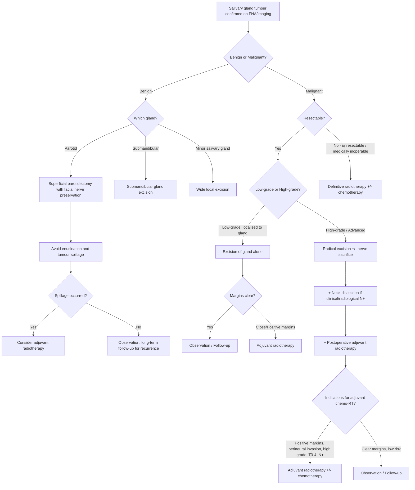

## Management of Salivary Gland Tumours

### Overarching Principles

Before diving into specifics, let's establish the management philosophy. Salivary gland tumour management is guided by the same core H&N cancer principles, adapted for the unique anatomy (facial nerve, salivary function):

***General Principles*** [13]:
1. ***Tumour clearance with long-term survival benefit*** [13]
2. ***Organ and function preservation*** [13]
3. ***When surgery is indicated → Resection with adequate margins → Reconstruction for form and function → Rehabilitation always (swallowing, voice, hearing)*** [13]

And the fundamental rule from the lecture slides:

***Complete surgical resection is the cornerstone of treatment when it can be achieved with negative surgical margins*** [2]

The management algorithm depends on three variables:
- **Benign vs Malignant** (determines extent of surgery)
- **Grade** (low vs high — determines need for adjuvant therapy)
- **Stage** (T, N, M — determines operability and extent of resection)

---

### Management Algorithm

---

### I. Surgical Treatment — The Cornerstone

***Complete surgical resection is the cornerstone of treatment when it can be achieved with negative surgical margins*** [2]. Surgery is the primary treatment modality for nearly all salivary gland tumours — both benign and malignant. The key concept is that the extent of surgery is tailored to the pathology.

#### A. Parotid Gland Surgery

***Parotidectomy is an exercise of facial nerve dissection*** [1]

This single sentence from the lecture captures the essence of parotid surgery. The entire operation revolves around identifying, dissecting, and preserving the facial nerve while removing the tumour with an adequate cuff of normal tissue. The facial nerve is identified at its main trunk as it exits the stylomastoid foramen, then each branch is traced distally while tumour and surrounding parotid tissue are removed.

***Excisional biopsy of parotid tumour = parotidectomy*** [1] — you don't "biopsy" a parotid tumour with a little incision; the parotidectomy itself IS the biopsy. This is because:
- Incisional biopsy risks tumour spillage and facial nerve injury
- The tumour needs to be removed with a margin of normal tissue
- The parotidectomy provides both definitive treatment AND definitive histological diagnosis

***Modified Blair's incision*** [1] — the standard surgical approach. This is a skin incision that runs from the pre-auricular region, curves behind the ear lobule, and extends into the upper neck. It provides excellent exposure of the facial nerve trunk and all branches while being cosmetically acceptable (hidden in skin creases and behind the ear).

##### i. Superficial Parotidectomy

***Recommended for most benign tumours confined to the superficial lobe including pleomorphic adenoma*** [2]

| Aspect | Detail |
|---|---|
| **What is removed** | All parotid tissue lateral to the facial nerve (superficial lobe) including the tumour with a cuff of normal tissue |
| **Facial nerve** | Identified, dissected, and **preserved** in all cases |
| **Indication — Benign** | Pleomorphic adenoma, Warthin's tumour, other benign tumours in the superficial lobe |
| **Indication — Malignant** | ***Low-grade tumours or high-grade tumours that are located peripherally within the superficial lobe*** [2] |

**Why superficial parotidectomy and not just "shelling out" (enucleation) the tumour?**

***Avoid enucleation and tumour spillage*** [1]

This is one of the most critical surgical principles. Enucleation means simply "popping out" the tumour from its capsule. This is WRONG for pleomorphic adenoma because:
1. Pleomorphic adenoma has a **pseudocapsule** (not a true capsule) with **satellite nodules/pseudopods** that extend beyond the apparent capsule margin into adjacent parotid tissue
2. Enucleation inevitably leaves behind these satellite nodules → **multifocal recurrence** (20–45% recurrence rate after enucleation vs < 5% after formal superficial parotidectomy)
3. Tumour spillage during enucleation seeds tumour cells into the surgical bed → even more recurrences, scattered throughout the parotid bed, making re-operation extremely difficult (each recurrent nodule is close to facial nerve branches)

***Consider radiotherapy for recurrent tumour or prevention of recurrence in case of spillage*** [1] — if intraoperative spillage does occur despite best efforts, adjuvant radiotherapy to the parotid bed reduces the risk of recurrence.

##### ii. Total Parotidectomy

***Indicated for high-grade tumours*** [2]

| Aspect | Detail |
|---|---|
| **What is removed** | ***Removal of parotid tissue in the deep as well as superficial lobes*** [2] — the entire parotid gland |
| **Facial nerve** | ***Involves dissection and preservation of facial nerve*** [2]. ***Preservation of facial nerve should be made with every single effort unless direct invasion is detected during operation*** [2] |
| **When to sacrifice the nerve** | Only when the tumour is directly invading the nerve trunk or branches — confirmed intraoperatively by frozen section or direct visualisation of tumour encasing the nerve |
| **Nerve reconstruction** | ***Reconstruction of nerve with interposition of a nerve graft or static procedures to mitigate facial drop should be performed at the same procedure if indicated*** [2] |

**Why preserve the facial nerve even in malignancy?**

The facial nerve can be spared if there is a tissue plane between the tumour and the nerve. Sacrificing the nerve when it's not invaded causes devastating morbidity (complete ipsilateral facial paralysis — eye exposure/corneal ulceration, oral incompetence, cosmetic deformity) without oncological benefit. The decision is made intraoperatively: if the nerve is grossly encased by tumour and cannot be dissected free, it is sacrificed and immediately reconstructed.

**Nerve reconstruction options when CN VII is sacrificed:**
1. **Cable nerve graft** — the gold standard. The sural nerve (from the leg) or great auricular nerve is harvested and used as an interpositional graft to bridge the gap. Axonal regeneration occurs over 12–18 months
2. **Cross-facial nerve graft** — branches from the contralateral healthy facial nerve are tunnelled across the face
3. **Static procedures** — gold weight insertion in the upper eyelid (for eye closure), fascia lata sling for oral commissure suspension. These provide immediate functional improvement while nerve grafts regenerate
4. **Free muscle transfer** (gracilis) — for complete long-segment nerve defects where grafting is not feasible

<Callout title="Exam Must-Know">
***Parotidectomy = an exercise of facial nerve dissection*** [1]. The operation is defined by what you do with the nerve, not just by removing the tumour. Every effort is made to preserve the nerve. Sacrifice only if directly invaded. Reconstruct immediately if sacrificed.
</Callout>

#### B. Submandibular Gland Surgery

***Submandibular sialoadenectomy — resection of the submandibular gland*** [2]

This is the standard operation for both benign and malignant submandibular gland tumours. Remember that ~50% of submandibular tumours are malignant [1], so a high index of suspicion is warranted.

***Anatomical considerations include close proximity to:*** [2]
- ***Facial artery and vein*** — these are ligated during the procedure
- ***Marginal mandibular branch of the facial nerve*** — runs superficial to the gland; injury causes inability to depress the lower lip (asymmetric smile). The **Hayes-Martin manoeuvre** (reflecting the marginal mandibular branch superiorly with the facial vein) protects the nerve
- ***Hypoglossal nerve (CN XII)*** — runs deep to the gland; injury causes ipsilateral tongue deviation and difficulty with speech/swallowing
- ***Lingual nerve*** — loops under Wharton's duct; injury causes loss of taste and sensation to the anterior 2/3 of the ipsilateral tongue
- ***Wharton's duct*** — must be ligated and divided

For **malignant** submandibular tumours: the excision may need to be extended to include:
- Adjacent floor of mouth mucosa
- Mandible (marginal or segmental mandibulectomy if bone is invaded)
- Neck dissection (supraomohyoid — levels I–III)

#### C. Sublingual Gland Surgery

***Resection of floor of mouth and involved sublingual gland and ipsilateral submandibular gland*** [2]

Because sublingual tumours have a very high malignancy rate (60–90%), surgery is often extensive:
- ***En bloc resection for large tumours may entail a marginal or segmental mandibulectomy and resection of lingual nerve with reconstruction with microvascular free-flaps*** [2]
- The ipsilateral submandibular gland is included because of shared lymphatic drainage and the need for adequate margins

#### D. Minor Salivary Gland Surgery

***Surgical resection of involved minor salivary gland according to the anatomical site they arise*** [2]

The approach is dictated by the tumour location:

| Site | Surgical Approach |
|---|---|
| Hard palate | Mucosal excision for superficial lesions (periosteum acts as a barrier); partial palatectomy or infrastructure maxillectomy for larger lesions. Through-and-through defects require dental prosthesis for rehabilitation [14] |
| Oral tongue / Floor of mouth | Wide local excision ± mandibulectomy if bone involved |
| Buccal mucosa | Wide excision ± alveolar ridge resection if mandible/maxilla involved. Reconstruction with fasciocutaneous free flap [14] |
| Lip | Wedge excision with primary closure or local flap reconstruction |
| Oropharynx / Tongue base | Transoral robotic surgery (TORS) or open mandibulotomy approach |

For minor salivary gland tumours, ***wide local excision*** [1] is the standard — unlike major gland tumours where you remove the entire gland, here you excise the tumour with a margin of normal tissue from the surrounding soft tissue/bone.

---

### II. Management by Specific Tumour Type

#### ***Pleomorphic Adenoma*** [1]

***Treatment: complete surgical excision*** [1]
- ***Parotidectomy with facial nerve preservation*** [1]
- ***Submandibular gland excision*** [1]
- ***Wide local excision of minor salivary gland*** [1]
- ***Avoid enucleation and tumour spillage*** [1]
- ***Consider radiotherapy for recurrent tumour or prevention of recurrence in case of spillage*** [1]

**Why long-term follow-up is essential**: ***Malignant degeneration 10–15% risk in 10 years*** [1]. Even after complete excision, patients need surveillance for:
1. Local recurrence (especially if initial surgery was inadequate)
2. Malignant transformation in any residual/recurrent tumour

#### ***Mucoepidermoid Carcinoma*** [1]

***Treatment is influenced by site, stage, grade*** [1]:

| Scenario | Treatment |
|---|---|
| ***Localised to gland*** | ***Excision of gland*** [1] (superficial parotidectomy for low-grade superficial parotid; total parotidectomy for high-grade) |
| ***Neck node metastasis*** | ***Neck dissection*** [1] |
| ***High-grade tumour, close margin, extra-glandular spread*** | ***Radiotherapy*** (adjuvant) [1] |

**Why does grade matter so much?**
- Low-grade mucoepidermoid carcinoma behaves almost like a benign tumour: 5-year survival > 95%; surgery alone is usually curative
- High-grade mucoepidermoid carcinoma is aggressive with higher rates of nodal and distant metastasis: 5-year survival ~50%; needs multimodality treatment (surgery + adjuvant RT ± chemotherapy)

#### Adenoid Cystic Carcinoma

Treatment follows the general principles of radical surgery + adjuvant radiotherapy, but with special considerations:
- **Perineural invasion** is the hallmark → surgery must aim for negative perineural margins, which can mean tracing nerves back to the skull base. Even then, microscopic perineural disease often persists
- **Adjuvant radiotherapy** is almost always indicated because of the high rate of microscopic positive margins and perineural invasion
- Neck dissection only if clinically/radiologically N+ (adenoid cystic carcinoma metastasises haematogenously more than via lymphatics)
- **Role of neutron/proton/carbon ion therapy**: Adenoid cystic carcinoma is relatively **radioresistant** to conventional photon radiotherapy. Particle beam therapies (neutrons, protons, carbon ions) have shown improved local control rates and are increasingly used, particularly for skull base extension or unresectable disease

#### ***Acinic Cell Carcinoma*** [1]

***Treatment: Complete local excision +/- postoperative XRT*** [1]

***Prognosis — good*** [1]:
- ***5-year survival: 82%*** [1]
- ***10-year survival: 68%*** [1]
- ***25-year survival: 50%*** [1]

Note the slow decline in survival over decades — this reflects the indolent but persistent nature of the tumour. Late recurrences (10+ years) can occur, similar to adenoid cystic carcinoma.

#### ***Carcinoma Ex Pleomorphic Adenoma*** [1]

***Treatment*** [1]:
- ***Radical excision*** [1]
- ***Neck dissection (25% with lymph node involvement at presentation)*** [1]
- ***Postoperative XRT*** [1]

***Prognosis*** [1]:
- ***Dependent upon stage and histology*** [1]
- ***Usually not very good*** [1]

**Why is the prognosis poor?** Because by the time a carcinoma ex pleomorphic adenoma presents (sudden growth of a long-standing mass), the malignant component has often already invaded beyond the original pseudocapsule, and the long-standing nature means the tumour has had time to develop aggressive biology.

#### Squamous Cell Carcinoma

- ***Must rule out: high-grade mucoepidermoid carcinoma, metastatic SCC to intraglandular lymph nodes from scalp SCC, direct extension of skin SCC*** [1]
- If truly primary: radical excision + neck dissection + adjuvant radiotherapy
- If metastatic from cutaneous primary: treatment of primary cutaneous SCC + parotidectomy + neck dissection + adjuvant RT to parotid bed and neck

---

### III. Radiotherapy

***Definitive radiotherapy is reserved for patients who are medically inoperable or who have unresectable disease*** [2]

***Unresectable disease is defined as either by extent of tumour invasion or location such that resection would result in a significant functional or cosmetic deficit*** [2]

#### Indications for Adjuvant Radiotherapy (Post-Surgery)

Adjuvant RT is indicated when there are **high-risk features** that predict a high probability of local recurrence or regional failure:

| Indication | Rationale |
|---|---|
| **Positive or close surgical margins** | Microscopic residual disease left behind → RT sterilises the tumour bed |
| **High-grade histology** | Higher biological aggressiveness → higher local recurrence rate without RT |
| ***Extra-glandular spread*** [1] | Tumour beyond the gland capsule indicates higher risk of microscopic residual disease |
| **Perineural invasion** | Microscopic spread along nerves extends beyond surgical margins (especially adenoid cystic carcinoma) |
| **Advanced T stage (T3/T4)** | Larger tumours have higher recurrence rates |
| **Nodal metastasis (N+)** | Indicates regional dissemination; RT to the neck reduces recurrence |
| **Lymphovascular invasion** | Marker of biologically aggressive behaviour |
| **Recurrent tumour** | Higher recurrence risk after re-excision alone |
| ***Tumour spillage*** [1] | If intraoperative spillage of pleomorphic adenoma occurred |

***Consider radiotherapy for recurrent tumour or prevention of recurrence in case of spillage*** [1]

#### Types of Radiotherapy
- **Conventional external beam radiotherapy (EBRT)** — standard photon-based RT; 60–70 Gy in 30–35 fractions
- **Intensity-modulated radiotherapy (IMRT)** — allows precise dose shaping to spare adjacent critical structures (contralateral parotid, oral cavity, brainstem, spinal cord) while maximising dose to the tumour bed
- **Particle beam therapy (proton/carbon ion)** — particularly considered for adenoid cystic carcinoma (radioresistant) and skull base tumours. Carbon ion therapy delivers higher relative biological effectiveness (RBE) than photons
- **Brachytherapy** — rarely used; sometimes for boost dose in minor salivary gland tumours of the oral cavity

---

### IV. Chemotherapy and Systemic Therapy

Chemotherapy has a **limited role** in salivary gland tumours compared to other H&N cancers. This is because:
1. Many subtypes are relatively chemoresistant
2. Surgery ± RT achieves good local control for most
3. Evidence for chemotherapy benefit is limited to specific scenarios

#### Indications
- **Recurrent/metastatic disease** not amenable to surgery or RT
- **Concurrent chemo-radiation** for unresectable locally advanced disease
- **Palliative setting** — symptom control in distant metastatic disease

#### Agents
- **Cisplatin-based regimens** — most commonly used (cisplatin + doxorubicin, or cisplatin + 5-FU)
- **Targeted therapy** (emerging):
  - **Trastuzumab** (anti-HER2) — salivary duct carcinoma frequently overexpresses HER2 (~30%); trastuzumab + docetaxel has shown benefit
  - **Androgen receptor (AR) antagonists** — salivary duct carcinoma often expresses AR; enzalutamide or bicalutamide can be used
  - **NTRK inhibitors** (larotrectinib, entrectinib) — for secretory carcinoma with ETV6-NTRK3 fusion; these are "tumour-agnostic" therapies approved based on the molecular target regardless of tumour type
  - **Lenvatinib** (multi-kinase inhibitor) — showing activity in adenoid cystic carcinoma
- **Immunotherapy** (pembrolizumab, nivolumab) — checkpoint inhibitors are being studied; some benefit in PD-L1 positive salivary gland cancers, but evidence is still evolving

---

### V. Neck Dissection

Neck dissection is performed when there is **clinical or radiological evidence of cervical lymph node metastasis (N+ disease)**, or **electively** in high-risk situations:

| Scenario | Neck Dissection Indicated? | Type |
|---|---|---|
| Benign tumour | No | — |
| Low-grade malignancy, N0 | Generally no (low risk of occult nodal metastasis) | — |
| High-grade malignancy, N0 | Consider elective (risk of occult metastasis ~15–20%) | Selective (levels I–III for submandibular; levels II–IV for parotid) |
| ***Clinical/radiological N+*** | ***Yes — neck dissection*** [1] | Modified radical or selective, depending on extent of nodal disease |
| ***Carcinoma ex PA*** | ***Yes — 25% with lymph node involvement at presentation*** [1] | At minimum selective |
| Metastatic SCC to parotid nodes | Yes — parotidectomy + comprehensive neck dissection | Modified radical including levels I–V |

---

### VI. Management Framework Summary

Adapting the ***H&N cancer management framework*** [13] to salivary gland tumours:

| Stage | Treatment Approach |
|---|---|
| ***Early stage (I, II)*** | ***Single modality treatment*** [13] — surgery alone (complete excision of gland with adequate margins) |
| ***Late stage (III, IV)*** — Resectable | ***Combined modality treatment*** [13] — surgery with adjuvant radiotherapy +/- chemotherapy |
| ***Late stage*** — Unresectable / Medically inoperable | ***Definitive radiotherapy*** [2] +/- chemotherapy; palliative systemic therapy |
| Recurrent / Metastatic | Salvage surgery if feasible; re-irradiation if possible; systemic therapy (chemo, targeted agents, immunotherapy); best supportive care |

***Key exception for salivary gland tumours***: Unlike NPC (which is treated with chemo-radiation even in late stage) and unlike oropharyngeal SCC (where RT-based approaches are often preferred), ***salivary gland tumours are primarily surgical*** at all resectable stages. Radiotherapy is almost always **adjuvant** (post-surgical), not primary, because most salivary gland tumours are relatively **radioresistant** compared to SCC.

<Callout title="Management Decision Summary" type="idea">

**Benign tumours**: Surgery alone. The operation IS the cure.
- ***Patients with benign tumours or low-grade malignancy are treated with surgery alone*** [2]

**High-grade malignant tumours**: Surgery + adjuvant RT.
- ***Patients with high-grade malignancy and those with positive margins post-surgery or other high-risk features are treated with surgery and adjuvant radiotherapy*** [2]

**Unresectable/Inoperable**: Definitive RT ± chemo.
- ***Definitive radiotherapy is reserved for patients who are medically inoperable or who have unresectable disease*** [2]

</Callout>

---

### VII. Complications of Treatment

***Parotidectomy and related complications*** [1]:

#### 1. ***Facial Nerve Injury*** [2]

The most feared complication. Can be:
- **Temporary** (neuropraxia): occurs in 10–30% of parotidectomies due to nerve stretching, heat from diathermy, or oedema. Recovers within weeks to months
- **Permanent**: occurs in ~1–3% of superficial parotidectomies; higher in revision surgery or malignant cases requiring nerve sacrifice

**Clinical consequences by branch:**
| Branch | Deficit |
|---|---|
| Temporal | Cannot raise eyebrow |
| Zygomatic | Cannot close eye tightly → lagophthalmos → corneal exposure → ulceration |
| Buccal | Cannot puff cheek; food pocketing |
| Marginal mandibular | Cannot depress lower lip → asymmetric smile |
| Cervical | Loss of platysma contraction (minimal clinical significance) |

**The zygomatic branch injury is the most dangerous** — inability to close the eye → corneal desiccation → ulceration → potentially blindness. Requires urgent eye protection (artificial tears, taping the eye shut, gold weight implant).

#### 2. ***Frey Syndrome*** [2]

***Also known as auriculotemporal syndrome or gustatory sweating*** [2]

***Characterised by sweating and flushing of facial skin over parotid bed and neck during mastication*** [2]

***Result of aberrant regeneration of cut parasympathetic fibres between the otic ganglion and salivary tissues which leads to innervation of sweat glands and subcutaneous vessels*** [2]

**Why does this happen?** During parotidectomy, the auriculotemporal nerve (which carries parasympathetic secretomotor fibres from the otic ganglion to the parotid) is divided. During nerve regeneration, the parasympathetic fibres meant for salivary glands **aberrantly regenerate** into the sympathetic pathways that innervate dermal sweat glands and blood vessels. So when the patient eats (which should stimulate saliva production), the misdirected parasympathetic impulses instead cause **sweating and flushing** of the skin overlying the parotid bed.

- Incidence: 30–60% of patients (subclinical in many; symptomatic in ~10–15%)
- Diagnosis: **Minor's starch-iodine test** — apply iodine to the affected skin, dust with starch, then give the patient something to eat. Sweating produces moisture → starch + iodine = blue-black colour change
- Treatment:
  - **Antiperspirants** (aluminium chloride) — first-line
  - **Botulinum toxin injection** — blocks acetylcholine release at the aberrant nerve endings → highly effective, lasts 6–12 months, can be repeated
  - **Interposition of tissue** (e.g., sternocleidomastoid muscle flap, acellular dermal matrix) between the skin and the parotid bed during surgery — **preventive** measure

#### 3. Other Surgical Complications

| Complication | Mechanism |
|---|---|
| **Haematoma/Seroma** | Post-operative bleeding or serous fluid collection in the surgical bed. Managed with drain placement (usually a suction drain left for 24–48 hours) |
| **Salivary fistula/sialocele** | Residual salivary tissue continues to produce saliva that leaks through the wound. Usually self-limiting; managed with pressure dressing and anti-sialagogues (e.g., glycopyrrolate) |
| **Numbness of ear lobule** | Great auricular nerve is often sacrificed during parotidectomy (runs over SCM directly into the parotid). Causes numbness of the ear lobule and adjacent skin — permanent but well-tolerated |
| **Cosmetic deformity** | Loss of parotid tissue volume creates a concavity at the jaw angle ("parotidectomy hollow"). Can be addressed with SCM flap, fat grafting, or acellular dermal matrix |
| **Wound infection** | Standard surgical complication; prophylactic antibiotics given perioperatively |
| **First bite syndrome** | Sharp pain in the parotid region with the first bite of each meal; thought to be due to loss of sympathetic innervation to the parotid (from surgical disruption) leading to parasympathetic hypersensitivity of myoepithelial cells. Managed with botulinum toxin or carbamazepine |

---

<Callout title="High Yield Summary">

**Management of Salivary Gland Tumours — Must-Know Points:**

1. ***Complete surgical resection with negative margins is the cornerstone*** [2]
2. ***Parotidectomy = an exercise of facial nerve dissection*** [1]; use ***Modified Blair's incision*** [1]
3. ***Avoid enucleation and tumour spillage*** [1] — formal superficial parotidectomy is mandatory for pleomorphic adenoma
4. ***Consider radiotherapy for recurrent tumour or prevention of recurrence in case of spillage*** [1]
5. ***Preservation of facial nerve should be made with every single effort unless direct invasion is detected*** [2]; reconstruct immediately with nerve graft or static procedures [2]
6. ***Benign tumours and low-grade malignancy → surgery alone*** [2]
7. ***High-grade malignancy + positive margins/high-risk features → surgery + adjuvant radiotherapy*** [2]
8. ***Definitive radiotherapy is reserved for medically inoperable or unresectable disease*** [2]
9. ***Mucoepidermoid carcinoma treatment influenced by site, stage, grade*** [1]; ***RT for high-grade, close margin, extra-glandular spread*** [1]
10. ***Carcinoma ex PA: radical excision + neck dissection (25% N+ at presentation) + postoperative XRT; prognosis usually not very good*** [1]
11. ***Acinic cell carcinoma: complete local excision +/- postoperative XRT; prognosis good (5yr 82%, 10yr 68%, 25yr 50%)*** [1]
12. Complications: facial nerve injury (temporary/permanent), ***Frey syndrome*** (aberrant parasympathetic regeneration → gustatory sweating), great auricular nerve numbness, sialocele, first bite syndrome, cosmetic deformity [2]

</Callout>

---

<ActiveRecallQuiz
  title="Active Recall - Management of Salivary Gland Tumours"
  items={[
    {
      question: "Why must enucleation be avoided for pleomorphic adenoma? What is the correct operation and what do you do if intraoperative spillage occurs?",
      markscheme: "Enucleation leaves satellite nodules/pseudopods beyond the pseudocapsule, causing 20-45% recurrence rate. Correct operation: formal superficial parotidectomy with facial nerve preservation. If spillage occurs: consider adjuvant radiotherapy to the parotid bed to prevent recurrence.",
    },
    {
      question: "State the indications for adjuvant radiotherapy after surgery for a malignant salivary gland tumour.",
      markscheme: "Positive or close surgical margins, high-grade histology, extra-glandular spread, perineural invasion, advanced T stage (T3/T4), nodal metastasis (N+), lymphovascular invasion, recurrent tumour, tumour spillage.",
    },
    {
      question: "Explain the pathophysiology of Frey syndrome and name two treatments.",
      markscheme: "After parotidectomy, divided parasympathetic fibres from the auriculotemporal nerve (meant for salivary glands) aberrantly regenerate into sympathetic pathways innervating dermal sweat glands and subcutaneous vessels. During eating, parasympathetic stimulation causes sweating and flushing instead of salivation. Treatments: (1) Botulinum toxin injection, (2) topical aluminium chloride antiperspirant, (3) SCM flap interposition (preventive).",
    },
    {
      question: "Describe the management of carcinoma ex pleomorphic adenoma, including the rationale for neck dissection.",
      markscheme: "Radical excision of the tumour (total parotidectomy) plus neck dissection (because 25% have lymph node involvement at presentation) plus postoperative radiotherapy. Prognosis is usually not very good, dependent on stage and histology.",
    },
    {
      question: "When is definitive radiotherapy (as opposed to adjuvant) used for salivary gland tumours?",
      markscheme: "Reserved for patients who are medically inoperable (cannot tolerate general anaesthesia/surgery) or who have unresectable disease (extent of tumour invasion or location such that resection would result in significant functional or cosmetic deficit).",
    },
    {
      question: "Compare the management of low-grade versus high-grade mucoepidermoid carcinoma of the parotid gland.",
      markscheme: "Low-grade: excision of gland alone (superficial parotidectomy); surgery alone usually sufficient. High-grade: total parotidectomy with facial nerve preservation if possible, neck dissection if N+, adjuvant radiotherapy for high grade, close margins, or extra-glandular spread. Grade is the most important prognostic factor.",
    },
  ]}
/>

## References

[1] Lecture slides: GC 217. Facial nerve palsy and salivary gland diseases.pdf (p62 — pleomorphic adenoma treatment; p67 — mucoepidermoid treatment; p71 — acinic cell treatment; p74 — carcinoma ex PA treatment; p78 — parotidectomy and Blair's incision; p81 — summary)
[2] Senior notes: felixlai.md (Salivary gland tumour, section VII — Treatment: medical, surgical, complications; surgical tables for parotid, submandibular, sublingual, minor salivary glands)
[13] Lecture slides: GC 219. Infections and tumours in pharynx and oral cavity.pdf (p43–44 — Management framework: TNM staging, early vs late stage, general principles of resection-reconstruction-rehabilitation)
[14] Senior notes: felixlai.md (Head and neck cancer — cancer of hard palate, cancer of buccal mucosa management)
