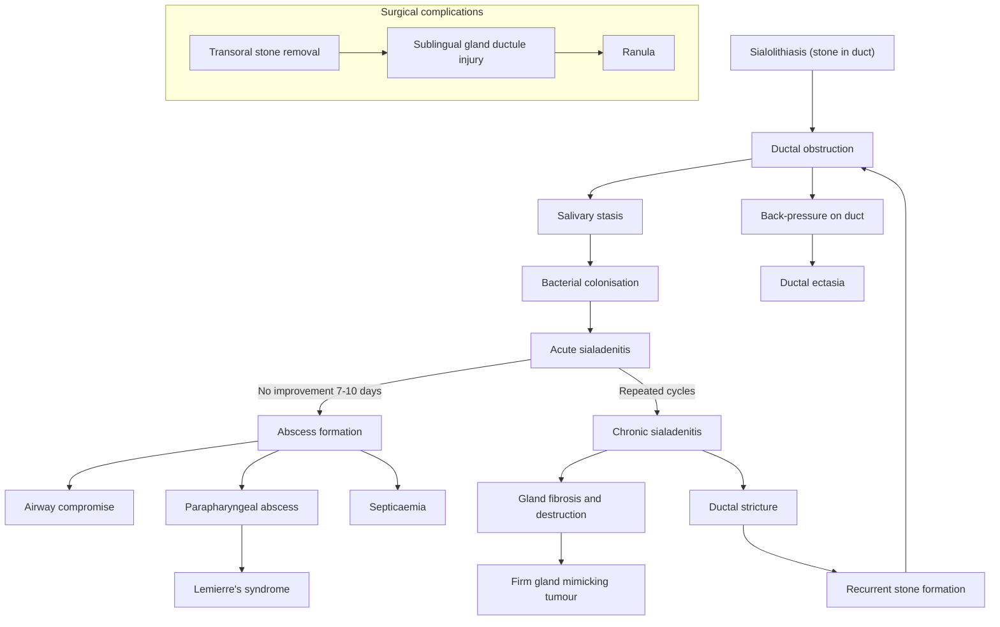

## Complications of Sialolithiasis

Understanding the complications of sialolithiasis is really about understanding what happens when a duct is blocked and left unmanaged over time. Every complication flows logically from a single pathophysiological root: **a stone obstructing the salivary duct**. Think of it as a cascade — obstruction → stasis → infection → destruction — with each step producing its own set of clinical problems.

The lecture slides explicitly list the three key complications of sialolithiasis: ***sialadenitis, ductal ectasia, and stricture*** [1].

---

### Complications of the Disease Itself

---

#### 1. Sialadenitis (Secondary Infection)

***Complication: sialadenitis*** [3] — this is the most common and most clinically significant complication.

***Superimposed infection leads to secondary infection as a result of ductal obstruction and stasis*** [2].

**Pathophysiology — from first principles**:
- A stone obstructs the duct → saliva stagnates behind it → the stagnant, warm, protein-rich saliva is an ideal bacterial culture medium → oral bacteria (predominantly *S. aureus*, *S. viridans*, *H. influenzae*, anaerobes like *Bacteroides*) ascend through the duct orifice retrograde → colonise the stagnant pool → multiply → acute sialadenitis.
- The gland becomes swollen, erythematous, and exquisitely tender. The patient develops fever, chills, and systemic toxicity.
- ***Pus is expressed from the ductal orifice*** when the gland is milked [3] — this is essentially pathognomonic of suppurative sialadenitis.

**Clinical significance**:
- Fever, chills, marked systemic toxicity [2]
- ***Pain, swelling and erythema of the gland*** [2]
- ***Purulent discharge from the salivary duct*** [2][3]
- ***Lack of improvement or focal worsening within the gland despite antibiotics for 7–10 days suggests possibility of abscess formation*** [2]

**Management** (as covered in the Management section):
- ***Hydration, sialogogues, massage, heat, antibiotics during acute attacks*** [1]
- Anti-staphylococcal antibiotics (dicloxacillin, cephalexin) [2]
- Once infection settles → definitive stone removal

---

#### 2. Abscess Formation

***Abscess formation*** is the progression of untreated or inadequately treated sialadenitis [2].

**Pathophysiology**:
- Acute sialadenitis → bacteria continue to proliferate → localised collection of pus forms within the gland parenchyma or periglandular tissues → a walled-off abscess develops.
- The abscess creates a fluctuant, tender mass within or adjacent to the gland. The patient appears systemically unwell with spiking fevers and rigors.

**Why this is dangerous — airway compromise**:
***Abscess formation can potentially compromise the airways*** [2]. This is the main reason abscess is a feared complication:

- **Submandibular abscess**: The submandibular gland lies in the submandibular space (below the mylohyoid). Infection can spread to:
  - **Sublingual space** (above the mylohyoid) → bilateral sublingual + submandibular space involvement = **Ludwig's angina** — a rapidly progressive, life-threatening cellulitis of the floor of mouth that causes tongue elevation, drooling, trismus, and airway obstruction.
  - **Parapharyngeal space** → lateral pharyngeal wall swelling → airway narrowing.

- **Parotid abscess**: Can spread to:
  - **Parapharyngeal space** (the deep lobe of the parotid is separated from the parapharyngeal space by only a thin fascial layer).
  - ***Parapharyngeal abscess → risk of septic jugular thrombophlebitis (Lemierre's syndrome)*** [2] — infection of the internal jugular vein with septic thrombosis, classically caused by *Fusobacterium necrophorum*, leading to septic emboli to the lungs and other organs. This is rare but devastating.

**Clinical clue for abscess**: ***Lack of improvement or focal worsening within the gland despite antibiotics for 7–10 days*** [2] — this should trigger urgent imaging (CT with contrast) to look for a rim-enhancing collection.

**Management**: Incision and drainage (I&D) + continued IV antibiotics + airway monitoring.

<Callout title="Airway Emergency" type="error">
A submandibular abscess from sialolithiasis can progress to Ludwig's angina. If a patient with submandibular sialolithiasis develops bilateral floor-of-mouth swelling, difficulty swallowing, drooling, or stridor — this is an airway emergency. Secure the airway first (may need fibreoptic intubation or surgical airway), then drain the abscess.
</Callout>

---

#### 3. Ductal Ectasia

***Ductal ectasia*** [1] (from Greek *ektasis* = dilation/stretching) refers to abnormal dilation of the salivary duct proximal to the obstructing stone.

**Pathophysiology**:
- A stone causes chronic partial obstruction → saliva continues to be produced but cannot flow freely → pressure builds up behind the stone → the duct wall stretches and dilates over time → ectasia.
- This is analogous to hydronephrosis from a ureteric stone, or to bile duct dilatation from a common bile duct stone — the same principle of "back-pressure dilation proximal to an obstruction."

**Clinical significance**:
- Ectatic ducts have poor motility (the muscle wall is stretched thin) → even after stone removal, the dilated duct may not contract back to normal → continued stasis → predisposition to recurrent stone formation or chronic sialadenitis.
- On imaging (USG or sialography), ductal ectasia appears as a dilated, tortuous duct. On sialography specifically, the duct appears as a "sausage-shaped" or irregularly widened structure with contrast pooling.

---

#### 4. Ductal Stricture

***Stricture*** [1] refers to fibrotic narrowing of the salivary duct.

**Pathophysiology**:
- Chronic obstruction by a stone → repeated episodes of inflammation (sialadenitis) around the stone → the duct wall becomes inflamed and oedematous → healing occurs by fibrosis → the duct narrows (stricture) → a new point of obstruction is created, independent of the stone itself.
- This is the same process that creates oesophageal strictures from chronic reflux or urethral strictures from chronic infection — **inflammation → fibrosis → narrowing**.

**Clinical significance**:
- Even after the stone is removed, the patient may continue to have obstructive symptoms (episodic meal-related swelling) because the stricture itself is now the obstruction.
- Strictures are a common cause of **recurrent sialolithiasis** — the narrowed segment creates turbulent flow and stasis → new stones form.
- On sialography, strictures appear as focal narrowing of the duct with proximal dilatation.
- Management: sialoendoscopic balloon dilatation of the stricture, or in severe cases, gland excision.

---

#### 5. Chronic Sialadenitis and Gland Destruction

***Chronic sialadenitis*** is the long-term consequence of repeated or unresolved acute sialadenitis.

***Chronic sialadenitis is most commonly caused by stones*** [1]. The lecture slides describe the pathological process: ***destruction of gland tissue after acute infection*** and ***blockage of saliva drainage*** [1].

**Pathophysiology**:
- Repeated cycles of obstruction → infection → inflammation → resolution → more obstruction → more infection...
- Each cycle causes progressive **parenchymal destruction**: acinar cells (the saliva-producing cells) are destroyed by inflammatory infiltrate and replaced by fibrous tissue.
- Eventually, the gland is replaced by fibrotic, non-functioning tissue — it becomes firm, shrunken, and non-tender.
- ***Complete obstruction of salivary gland outflow will lead to persistent swelling of glands. Swelling will eventually regress as the obstruction results in the glands ceasing to produce saliva. Salivary gland will then feel to be firm and mistaken to be a focal mass*** [2].

**Clinical significance**:
- The destroyed, fibrotic gland serves no useful function but can be a source of recurrent infection if not excised.
- The firm, non-tender gland can mimic a **salivary gland tumour** on examination — this is a classic diagnostic pitfall [2].
- Management: ***excision of the gland*** [1] — there is nothing left to save.

---

#### 6. Ranula (Complication of Treatment)

***A ranula*** is not a complication of sialolithiasis itself but a complication of its **surgical treatment** — specifically, transoral stone removal from Wharton's duct.

***Care must be taken to avoid excess trauma to the duct and associated sublingual glands to avoid formation of ranula, which is a retention cyst on the floor of mouth*** [2].

**Pathophysiology**:
- During transoral removal of a submandibular duct stone, the sublingual gland and its delicate ductules lie in close proximity to the surgical field.
- If these ductules are inadvertently damaged, mucus (from the sublingual gland, which is predominantly mucinous) accumulates in the floor of mouth, forming a retention pseudocyst.
- ***A ranula is a bluish cystic swelling in the floor of the mouth ("belly of a frog")*** — a ***mucus retention cyst arising from the blocked sublingual gland*** [5].

**Types**:
- **Simple (oral) ranula**: confined to the floor of mouth, above the mylohyoid.
- **Plunging ranula**: extends through or around the mylohyoid muscle into the submandibular space or even the neck — can present as a neck mass.

***Definitive treatment: excision of the pseudocyst together with resection of the sublingual gland*** [5]. Simple aspiration or marsupialisation alone has a high recurrence rate because the damaged sublingual gland continues to produce mucus.

---

### Complications of Parotid Sialadenitis/Abscess (Extended)

When sialolithiasis of the parotid gland leads to sialadenitis or abscess, additional complications specific to the parotid region can occur [2]:

| Complication | Mechanism |
|---|---|
| ***Airway obstruction*** | Parapharyngeal extension of infection → pharyngeal wall oedema → airway narrowing |
| ***Facial nerve palsy*** | The facial nerve (CN VII) runs through the parotid gland. Inflammatory oedema or abscess within the gland can compress or injure the nerve → ipsilateral facial weakness (lower motor neuron pattern — forehead AND lower face) [2] |
| ***Septicaemia*** | Spread of infection into the bloodstream, especially in immunocompromised or debilitated patients [2] |
| ***Parapharyngeal abscess*** | Deep lobe of parotid is in direct continuity with the parapharyngeal space — infection easily tracks medially [2] |
| ***Septic jugular thrombophlebitis (Lemierre's syndrome)*** | Parapharyngeal abscess → inflammation/thrombosis of the internal jugular vein → septic emboli to lungs and elsewhere [2] |
| ***Osteomyelitis of adjacent facial bone*** | Contiguous spread of infection to the mandible or temporal bone [2] |

---

### Summary: The Complication Cascade

---

### Comprehensive Complications Table

| Complication | Pathophysiology | Clinical Features | Management |
|---|---|---|---|
| ***Sialadenitis*** [1][3] | Stasis behind stone → bacterial colonisation → ascending infection | Fever, painful swollen gland, pus from duct | Antibiotics, hydration, sialogogues → stone removal |
| ***Abscess formation*** [2] | Progression of untreated sialadenitis → walled-off pus | Fluctuant mass, spiking fevers, failure to respond to antibiotics 7–10 days | CT → I&D + IV antibiotics; ***airway monitoring*** |
| ***Ductal ectasia*** [1] | Chronic back-pressure → duct wall stretching | Persistent stasis, recurrent stones; dilated duct on imaging | Stone removal; may need sialoendoscopic intervention |
| ***Ductal stricture*** [1] | Chronic inflammation → fibrosis → duct narrowing | Recurrent obstructive symptoms even after stone removal | Sialoendoscopic balloon dilatation; gland excision if severe |
| ***Chronic sialadenitis / gland destruction*** [1] | Repeated infection cycles → parenchymal fibrosis | Firm, non-tender gland mimicking tumour; recurrent infections | Gland excision |
| ***Airway compromise*** [2] | Submandibular abscess → Ludwig's angina; parotid abscess → parapharyngeal extension | Floor-of-mouth swelling, drooling, stridor | Emergency airway management + surgical drainage |
| **Ranula** (surgical complication) [2][5] | Sublingual gland ductule injury during transoral stone removal | Bluish cystic floor-of-mouth swelling | Excision of pseudocyst + sublingual gland resection |
| ***Facial nerve palsy*** (parotid) [2] | Inflammatory compression of CN VII within the parotid | Ipsilateral LMN facial weakness | Treat infection; nerve usually recovers if compression relieved |
| ***Septicaemia*** [2] | Haematogenous spread from infected gland | Systemic sepsis features | IV antibiotics, source control (drainage) |

---

<Callout title="High Yield Summary">

1. ***Three named complications from the lecture slides: sialadenitis, ductal ectasia, and stricture*** [1].

2. ***Sialadenitis*** is the most common complication — caused by ***ductal obstruction and stasis*** leading to ascending bacterial infection → fever, pus from duct [2][3].

3. ***Abscess formation***: suspect if ***no improvement after 7–10 days of antibiotics***; ***can potentially compromise the airways*** [2] — submandibular abscess may progress to Ludwig's angina.

4. **Ductal ectasia**: back-pressure dilation of the duct proximal to the stone; predisposes to recurrent stone formation.

5. **Ductal stricture**: chronic inflammation → fibrosis → narrowing; creates a new point of obstruction even after stone removal; common cause of recurrence.

6. ***Chronic sialadenitis***: ***destruction of gland tissue after acute infection + blockage of saliva drainage*** [1] → firm, fibrosed gland that mimics a tumour [2].

7. **Ranula**: iatrogenic complication of transoral stone removal — sublingual gland ductule injury → ***mucus retention cyst on the floor of mouth*** [2][5].

8. **Parotid-specific complications** of sialadenitis/abscess: ***facial nerve palsy, parapharyngeal abscess, Lemierre's syndrome, septicaemia, osteomyelitis*** [2].

</Callout>

---

<ActiveRecallQuiz
  title="Active Recall - Complications of Sialolithiasis"
  items={[
    {
      question: "Name the 3 complications of sialolithiasis explicitly listed in the lecture slides.",
      markscheme: "Sialadenitis (secondary infection from ductal obstruction and bacterial colonisation of stagnant saliva), ductal ectasia (back-pressure dilation of duct proximal to stone), and ductal stricture (fibrotic narrowing of duct from chronic inflammation)."
    },
    {
      question: "Explain the pathophysiology of how sialolithiasis leads to sialadenitis from first principles.",
      markscheme: "Stone obstructs duct → saliva stagnates behind the stone → stagnant warm protein-rich saliva is an ideal bacterial culture medium → oral bacteria (S. aureus, S. viridans, anaerobes) ascend retrograde through the duct orifice → colonise stagnant pool → multiply → acute suppurative sialadenitis with fever, pain, erythema, and pus expressible from the duct."
    },
    {
      question: "What clinical finding suggests abscess formation in the context of sialadenitis, and why is this particularly dangerous for submandibular stones?",
      markscheme: "Lack of improvement or focal worsening despite antibiotics for 7-10 days suggests abscess. Dangerous for submandibular stones because submandibular abscess can spread to sublingual space, causing Ludwig's angina (bilateral floor-of-mouth cellulitis) → tongue elevation → airway obstruction. This is a life-threatening emergency."
    },
    {
      question: "What is a ranula, what causes it in the context of sialolithiasis management, and what is the definitive treatment?",
      markscheme: "Ranula is a bluish cystic mucus retention pseudocyst on the floor of the mouth (belly of a frog). Caused by inadvertent trauma to sublingual gland ductules during transoral removal of a Wharton's duct stone. Definitive treatment: excision of the pseudocyst together with resection of the sublingual gland."
    },
    {
      question: "Why can a chronically obstructed salivary gland from sialolithiasis be mistaken for a tumour?",
      markscheme: "Chronic complete obstruction → gland ceases to produce saliva (acinar atrophy from pressure) → replaced by fibrosis → gland becomes firm, shrunken, and non-tender → feels like a hard focal mass on palpation. Patient is asymptomatic (no meal-related swelling because no saliva is being produced). History of prior episodic swelling that has now resolved is the key differentiator from true neoplasm."
    }
  ]}
/>

---

## References

[1] Lecture slides: GC 217. Facial nerve palsy and salivary gland diseases.pdf (p52, p55, p56, p57)
[2] Senior notes: felixlai.md (sections 323, 326, 327, 330)
[3] Lecture slides: GC 219. Infections and tumours in pharynx and oral cavity.pdf (p27, p28)
[5] Lecture slides: GC 219. Infections and tumours in pharynx and oral cavity.pdf (p26)
