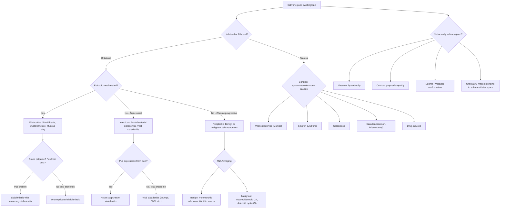

## Differential Diagnosis of Sialolithiasis

When a patient presents with a swelling or pain in the region of a salivary gland — particularly episodic, meal-related swelling — sialolithiasis is at the top of the list, but it is by no means the only possibility. The differential diagnosis can be broadly organised into categories based on the clinical question you are really asking yourself: **"Is this an obstructive problem, an infectious problem, an autoimmune problem, or a neoplastic problem?"**

The lecture slides explicitly prompt you to consider: ***Is it really a parotid swelling?*** and ***Is it really a submandibular gland swelling?*** — because several non-salivary conditions can mimic salivary gland pathology [1].

---

### Approach to the Differential Diagnosis

---

### Differential Diagnoses — Detailed Discussion

#### 1. Obstructive Causes

##### a. Sialolithiasis (the index condition)

The cardinal features — ***recurrent swelling, pain worse with eating*** [1], ***colicky postprandial glandular swelling and pain*** [3] — are essentially pathognomonic. The key pathophysiological link is that eating triggers parasympathetic-mediated salivary secretion, which cannot flow past the obstructing stone, so the gland distends and hurts. When eating stops, secretion rate drops and symptoms gradually resolve [2].

**Why this matters as a DDx anchor**: If the swelling is episodic, clearly meal-related, and unilateral, sialolithiasis is the most likely diagnosis until proven otherwise.

##### b. Ductal Stricture

- A stricture (fibrotic narrowing) of the salivary duct can mimic sialolithiasis exactly — episodic, meal-related swelling and pain — because the mechanism is the same: outflow obstruction.
- Strictures often form as a ***complication of prior sialolithiasis or chronic sialadenitis*** [1] (inflammation → fibrosis → narrowing).
- Differentiation requires imaging (sialography or sialoendoscopy) — a stricture will show ductal narrowing without a calcified stone.
- ***Complications of sialolithiasis include: sialadenitis, ductal ectasia, and stricture*** [1].

##### c. Mucous Plug

- Inspissated (thickened) mucus can transiently obstruct the duct, mimicking sialolithiasis.
- More common in dehydrated patients or those on anticholinergics.
- Tends to resolve spontaneously with hydration and gland massage; no stone seen on imaging.

##### d. Ranula

***A ranula is a bluish cystic swelling in the floor of the mouth ("belly of a frog")*** — it is a ***mucus retention cyst arising from a blocked sublingual gland*** [5]. It presents as a translucent, fluctuant mass in the floor of the mouth. It can be confused with a submandibular duct stone if it is large, but it is cystic (not hard), and there is no meal-related pain pattern. ***Definitive treatment is excision of the pseudocyst together with resection of the sublingual gland*** [5].

**Why it enters the DDx**: Both ranula and a submandibular stone can cause floor-of-mouth swelling. The distinguishing feature is that a ranula is soft, bluish, and cystic, while a stone is hard and palpable within the duct.

---

#### 2. Infectious Causes

##### a. Acute Bacterial (Suppurative) Sialadenitis

- ***Acute suppurative sialadenitis in the absence of sialolithiasis*** is a distinct entity that typically affects ***older adults, malnourished or post-operative patients*** [2].
- ***Commonly caused by Staphylococcus aureus*** [1][2], but *S. viridans*, *S. pneumoniae*, *H. influenzae*, and *Bacteroides* species have also been isolated [2].
- ***Characterized by sudden onset of a very firm and tender swelling*** of the involved gland [2].
- ***Fever and chills are present with fairly marked systemic toxicity*** [2].
- ***Purulent discharge can be expressed from the affected duct orifice*** — this is essentially diagnostic [2][3].
- The lecture slides specifically teach: ***Acute parotitis occurs in dehydrated, infirmed elderly; presents with tender swelling, pus from duct opening; S. aureus is the organism; treatment is rehydration and IV antibiotics*** [1].

**Why this is a DDx**: Both sialolithiasis and acute bacterial sialadenitis cause a painful, swollen salivary gland. The key distinction: sialolithiasis has *episodic, meal-related* symptoms; acute bacterial sialadenitis has *constant, progressive* pain with systemic toxicity and pus from the duct. Of course, they often coexist — sialolithiasis is the most common *cause* of sialadenitis (obstruction → stasis → infection).

##### b. Chronic Bacterial Sialadenitis

- ***Low-grade chronic infection that eventually leads to destruction of the salivary gland*** [2].
- Occurs in patients with ***decreased salivary secretion and increased mucus content*** in the saliva [2].
- ***Predisposing factors include stones, strictures, and trauma*** [2].
- ***Chronic sialadenitis is most commonly caused by stones*** [1] — so sialolithiasis and chronic sialadenitis are deeply intertwined.
- The lecture slides describe: ***Chronic sialadenitis: destruction of gland tissue after acute infection, blockage of saliva drainage*** [1].
- ***Presentation: mild pain, worsens after meal; recurrent parotid or submandibular swelling after meal*** [1].

**Why it is a separate DDx**: Chronic sialadenitis can exist *without* a demonstrable stone — the original stone may have passed, leaving behind a damaged, strictured duct and chronically inflamed gland. Or the cause may be autoimmune (see Sjögren's below).

##### c. Viral Sialadenitis

- ***Commonest viral cause is mumps*** [1][2] — the classic childhood parotitis, though it can affect adults.
- Other viruses: ***Coxsackievirus, CMV, Influenza*** [1], as well as parainfluenza, HSV, EBV, and HIV [2].
- ***Mumps: acute pain and swelling of one or both parotid glands***, associated with a ***non-specific prodrome of low-grade fever, malaise, headache, myalgia, and anorexia*** [2].
- ***Diagnosis by clinical features and serology*** [1].

**Why this is a DDx**: Viral parotitis causes bilateral parotid swelling, which can superficially look like bilateral sialolithiasis. However, viral parotitis has a systemic prodrome, is usually bilateral, and does *not* have meal-related episodic worsening. There is no palpable stone and no pus from the duct (it is non-suppurative).

<Callout title="Suppurative vs Non-Suppurative" type="idea">
A quick bedside test: milk the gland and look at the duct orifice. If pus comes out → bacterial (suppurative) sialadenitis. If clear saliva or nothing comes out → viral sialadenitis, stone, or autoimmune. This is the single most useful clinical manoeuvre for triaging the differential.
</Callout>

---

#### 3. Autoimmune / Systemic Causes

##### a. Sjögren Syndrome

- ***Chronic inflammatory disorder characterised primarily by diminished lacrimal and salivary gland secretions resulting in symptoms of dry eyes and mouth (sicca complex)*** [2].
- ***Presents with gradual swelling of parotid or submandibular glands, typically bilaterally*** [2].
- ***Autoimmune sialadenitis causes parenchymal destruction and dilation of intraglandular ducts*** [2].
- The lecture slides reinforce that ***chronic sialadenitis can be caused by autoimmune disease (Sjögren syndrome)*** [1].
- Key clinical features: dry eyes (keratoconjunctivitis sicca), dry mouth (xerostomia), positive anti-Ro/SSA and anti-La/SSB antibodies, lymphocytic infiltration on minor salivary gland biopsy.

**Why this is a DDx**: Sjögren's causes bilateral, chronic, gradually progressive salivary gland swelling — quite different from the episodic, unilateral, meal-related pattern of sialolithiasis. However, reduced salivary flow in Sjögren's can *predispose* to stone formation, so both conditions can coexist.

##### b. Sarcoidosis

- ***Extrapulmonary sarcoidosis affecting salivary glands*** [2].
- ***Characterised by bilateral painless parotid enlargement due to granulomatous infiltration*** [2].
- **Heerfordt syndrome** (uveoparotid fever) is a classic presentation: parotid enlargement + uveitis + facial nerve palsy + fever.
- Other features of sarcoidosis (bilateral hilar lymphadenopathy, erythema nodosum, elevated ACE) help clinch the diagnosis.

**Why this is a DDx**: Bilateral, painless parotid enlargement can initially raise the question of stones or tumour. The key differentiators are bilaterality, painlessness, and systemic features of sarcoidosis.

---

#### 4. Neoplastic Causes

##### a. Benign Salivary Gland Tumours

- ***Pleomorphic adenoma***: ***slow-growing, painless mass; parotid — 90% in superficial lobe, most in tail of gland; minor salivary gland — lateral palate, submucosal mass; malignant degeneration 10–15% risk in 10 years*** [1].
- **Warthin tumour** (papillary cystadenoma lymphomatosum): second most common benign parotid tumour; strongly associated with smoking; can be bilateral.

**Why this is a DDx**: A chronic, slowly enlarging, painless parotid or submandibular mass could be either a tumour or a chronically obstructed, atrophied gland from sialolithiasis. Recall from the previous section: chronic complete obstruction causes the gland to become firm and asymptomatic — ***mimicking a focal mass*** [2]. Imaging (USG, CT) and FNA are required to differentiate.

##### b. Malignant Salivary Gland Tumours

- Mucoepidermoid carcinoma (most common malignant salivary tumour), adenoid cystic carcinoma, acinic cell carcinoma, carcinoma ex pleomorphic adenoma.
- Key red flags for malignancy: rapid growth, pain, fixation to skin/deeper structures, ***facial weakness*** (especially parotid malignancy involving CN VII) [2], cervical lymphadenopathy, ***mucosal ulceration, pain and paraesthesia*** [2].
- **Rule of thumb**: ***The smaller the salivary gland, the higher the probability that a neoplasm arising in it is malignant*** [2]. (e.g., a tumour in a minor salivary gland on the palate has a > 50% chance of being malignant; a parotid tumour has ~20% malignancy rate.)

---

#### 5. Non-Salivary Mimics ("Is it really a salivary gland swelling?")

The lecture slides make a point of emphasising these mimics [1]:

##### For a "parotid swelling" that isn't actually the parotid:

| Mimic | Distinguishing Features |
|---|---|
| ***Masseter hypertrophy*** | Bilateral, firm, non-tender enlargement over the angle of mandible; becomes more prominent with jaw clenching (ask patient to clench teeth); no meal-related symptoms [1] |
| ***Neck lymph nodes*** | Multiple, may be tender if reactive; mobile or fixed depending on cause; not related to eating; check for sources of infection or malignancy in the drainage area [1] |
| ***Lipoma, vascular malformations*** | Lipoma: soft, mobile, non-tender, no change with meals. Vascular malformation: compressible, may change size with Valsalva [1] |

##### For a "submandibular gland swelling" that isn't actually the gland:

| Mimic | Distinguishing Features |
|---|---|
| ***Enlarged submandibular lymph node*** | Firm or rubbery, may be multiple, not meal-related; look for oral cavity pathology, dental infection, or head and neck malignancy draining to level I nodes [1] |
| ***Oral cavity mass with direct extension to submandibular space*** | ***Requires intraoral examination*** — a floor-of-mouth carcinoma or other oral cavity mass may extend through the mylohyoid into the submandibular space and feel like a gland mass from outside [1] |

<Callout title="Exam Must-Know — Always Consider Non-Salivary Mimics" type="error">
Before diagnosing a salivary gland condition, always confirm that the swelling truly arises from the salivary gland. ***Masseter hypertrophy, cervical lymphadenopathy, lipoma, vascular malformations, and oral cavity masses extending into the submandibular space*** are all common mimics highlighted in the lecture slides [1]. Always perform an intraoral examination.
</Callout>

---

#### 6. Other Causes of Bilateral Parotid Swelling (Sialadenosis and Drug-Induced)

##### a. Sialadenosis

- ***Non-inflammatory, non-neoplastic hypertrophy of the salivary gland*** [2].
- ***Usually bilateral and painless*** [2].
- Associated conditions: ***Anorexia/Bulimia nervosa*** (self-induced vomiting causes reflex parotid hypertrophy), ***alcoholic cirrhosis, diabetes mellitus*** [2].
- Mechanism: autonomic neuropathy of the myoepithelial cells → acinar cell enlargement → gland hypertrophy without inflammation.

##### b. Drug-Induced Parotid Enlargement

- ***Phenytoin*** and other drugs can cause bilateral parotid swelling [2].
- Mechanism is thought to involve altered autonomic innervation or direct acinar cell effects.

---

### Summary Table: Key Differentiating Features

| Condition | Laterality | Meal-Related? | Pain? | Pus from Duct? | Key Distinguishing Feature |
|---|---|---|---|---|---|
| **Sialolithiasis** | Usually unilateral | ***Yes*** | ***Yes*** (colicky) | Only if secondary sialadenitis | Palpable stone; radiopaque on X-ray (submandibular) |
| **Acute bacterial sialadenitis** | Usually unilateral | No | Yes (constant, severe) | ***Yes*** | Systemic toxicity, S. aureus, dehydrated/elderly patient |
| **Chronic sialadenitis** | Usually unilateral | Mild worsening | Mild | No (unless acute flare) | History of recurrent infections; stone may have passed |
| **Viral sialadenitis (Mumps)** | ***Often bilateral*** | No | Yes | No | Prodrome, bilateral, serology |
| **Sjögren syndrome** | ***Bilateral*** | No | No (or mild) | No | Dry eyes + dry mouth; anti-Ro/SSA, anti-La/SSB |
| **Sarcoidosis** | ***Bilateral*** | No | No | No | ***Bilateral painless parotid enlargement***; systemic features |
| **Pleomorphic adenoma** | Unilateral | No | No | No | ***Slow-growing, painless mass***; FNA diagnostic |
| **Malignant tumour** | Unilateral | No | Possible | No | Rapid growth, facial nerve palsy, fixation |
| **Sialadenosis** | ***Bilateral*** | No | No | No | ***Non-inflammatory***; bulimia, alcoholism, DM |
| **Ranula** | Unilateral (floor of mouth) | No | No | No | ***Bluish cystic swelling*** in floor of mouth |
| **Masseter hypertrophy** | Bilateral | No | No | N/A | Prominent with jaw clenching; not a gland at all |

---

### Investigations to Guide the DDx

These are mentioned in the lecture slides under ***chronic sialadenitis investigations*** [1]:

- ***Clinical examination*** (bimanual palpation, express saliva from duct) [1]
- ***USG / sialogram*** — ***rule out stones or other masses*** [1]
- ***Rule out Sjögren syndrome*** (serology: anti-Ro/SSA, anti-La/SSB; Schirmer's test; minor salivary gland biopsy) [1]

The imaging modalities will be discussed in detail in the Diagnosis section, but the key principle is:

> **Ultrasound** is the first-line imaging for any salivary gland swelling — it differentiates stones from tumours from lymph nodes, is non-invasive, and detects > 90% of stones ≥ 2 mm [2].

---

<Callout title="High Yield Summary">

1. The DDx of sialolithiasis broadly includes: **obstructive** (stone, stricture, mucous plug, ranula), **infectious** (acute/chronic bacterial sialadenitis, viral sialadenitis), **autoimmune** (Sjögren syndrome), **granulomatous** (sarcoidosis), **neoplastic** (benign — pleomorphic adenoma, Warthin tumour; malignant — mucoepidermoid CA), **sialadenosis** (non-inflammatory hypertrophy), and **non-salivary mimics** (masseter hypertrophy, lymphadenopathy, lipoma, oral cavity mass).

2. The single most useful bedside manoeuvre: ***milk the gland and inspect the duct orifice*** — pus = bacterial sialadenitis; stone visible = sialolithiasis; nothing = obstruction/atrophy/tumour.

3. ***Always confirm the swelling is truly salivary gland*** — lecture slides emphasise mimics: ***masseter hypertrophy, neck lymph nodes, lipoma, vascular malformations, oral cavity mass extending to submandibular space*** [1].

4. ***Episodic, meal-related, unilateral*** = obstructive (sialolithiasis until proven otherwise). ***Bilateral, painless, chronic*** = autoimmune (Sjögren) or sialadenosis. ***Acute, tender, purulent, systemic toxicity*** = acute bacterial sialadenitis.

5. ***Chronic sialadenitis investigations: clinical, USG/sialogram to rule out stones/masses, rule out Sjögren syndrome*** [1].

6. ***Pleomorphic adenoma has 10–15% malignant degeneration risk in 10 years*** — any long-standing salivary lump should be investigated [1].

</Callout>

---

<ActiveRecallQuiz
  title="Active Recall - Differential Diagnosis of Sialolithiasis"
  items={[
    {
      question: "A patient presents with a unilateral, firm, non-tender submandibular swelling that does NOT vary with meals. What are 3 differentials besides sialolithiasis?",
      markscheme: "(1) Submandibular salivary gland tumour (e.g. pleomorphic adenoma); (2) Enlarged submandibular lymph node (reactive or metastatic); (3) Chronic sialadenitis with gland atrophy from prior stone (gland has ceased producing saliva, so no meal-related symptoms). Also accept: oral cavity mass extending to submandibular space."
    },
    {
      question: "How do you differentiate acute bacterial sialadenitis from sialolithiasis clinically?",
      markscheme: "Sialolithiasis: episodic, meal-related swelling and pain that waxes and wanes. Acute bacterial sialadenitis: constant progressive pain with systemic toxicity (fever, chills), very firm tender gland, purulent discharge from duct orifice. Key: bacterial sialadenitis is commonly a COMPLICATION of sialolithiasis, so both can coexist."
    },
    {
      question: "Name 3 causes of bilateral painless parotid enlargement and briefly explain each mechanism.",
      markscheme: "(1) Sjögren syndrome - autoimmune lymphocytic infiltration and destruction of salivary gland parenchyma, causing gland swelling with reduced secretion. (2) Sarcoidosis - non-caseating granulomatous infiltration of parotid glands. (3) Sialadenosis - non-inflammatory, non-neoplastic acinar hypertrophy associated with bulimia, alcoholic cirrhosis, or diabetes mellitus (autonomic neuropathy of myoepithelial cells)."
    },
    {
      question: "The lecture slides ask: Is it really a parotid swelling? Name 4 non-salivary mimics of parotid or submandibular gland enlargement.",
      markscheme: "(1) Masseter hypertrophy (prominent with jaw clenching); (2) Cervical lymphadenopathy; (3) Lipoma; (4) Vascular malformation; (5) Oral cavity mass with direct extension to submandibular space. Any 4 of these accepted."
    },
    {
      question: "A ranula can mimic a submandibular duct stone because both cause floor-of-mouth swelling. How do you distinguish them?",
      markscheme: "Ranula: bluish, cystic, fluctuant, translucent swelling in floor of mouth; mucus retention cyst from blocked sublingual gland; no meal-related colicky pain; no hard palpable stone. Sialolithiasis: hard, rock-like structure palpable in Wharton's duct; episodic meal-related colicky pain and swelling."
    }
  ]}
/>

---

## References

[1] Lecture slides: GC 217. Facial nerve palsy and salivary gland diseases.pdf (p38, p50, p51, p52, p53, p54, p56, p61)
[2] Senior notes: felixlai.md (sections 321, 325–330, 336)
[3] Lecture slides: GC 219. Infections and tumours in pharynx and oral cavity.pdf (p27, p28)
[5] Lecture slides: GC 219. Infections and tumours in pharynx and oral cavity.pdf (p26)
