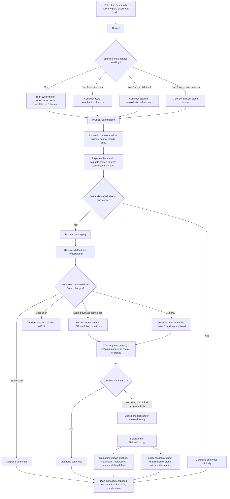

## Diagnostic Criteria, Diagnostic Algorithm and Investigations for Sialolithiasis

### Diagnostic Criteria

Sialolithiasis does not have a formal set of "diagnostic criteria" in the way that, say, rheumatic fever (Jones criteria) or SLE (ACR/EULAR criteria) does. Instead, the diagnosis is made by the combination of **compatible clinical features + confirmatory imaging**. In practical terms, you need two things:

1. **A clinical picture consistent with salivary duct obstruction**: episodic, meal-related, unilateral gland swelling ± pain (or chronic firm gland) — i.e., the history and examination point to an obstructive salivary problem.
2. **Demonstration of a calculus** on imaging (or directly visualised on examination / at sialoendoscopy).

Sometimes the diagnosis is made purely clinically — if you can **palpate a rock-hard stone in the duct** or **see it at the duct orifice**, that is diagnostic without any imaging at all [2]. But in most cases, imaging confirmation is sought.

<Callout title="When is the Diagnosis 'Confirmed'?">
The diagnosis of sialolithiasis is confirmed when a stone is **directly visualised** (at the duct orifice, on sialoendoscopy) or **demonstrated on imaging** (USG, X-ray, CT). A classic history of meal-related colicky gland swelling is highly suggestive but not confirmatory — you could have a ductal stricture or mucous plug producing identical symptoms.
</Callout>

---

### Diagnostic Algorithm

The approach to diagnosing sialolithiasis follows a logical sequence: **History → Examination → First-line imaging → Second-line imaging (if needed) → Interventional diagnostic/therapeutic procedure**. Here is the full algorithm:

---

### Investigation Modalities — Detailed Discussion

#### 1. Clinical Examination (The "Zero-Cost Investigation")

Clinical examination is not just a prelude to imaging — it can be diagnostic on its own.

##### a. Inspection

***Intraoral inspection*** is explicitly taught on the lecture slides [1] and should assess:
- ***Parotid duct opening*** (Stensen's duct orifice — opposite upper 2nd molar on buccal mucosa) [1]
- ***Submandibular duct opening*** (Wharton's duct orifice — sublingual caruncle on floor of mouth) [1]
- ***Floor of mouth swelling*** (may indicate a large Wharton's duct stone or ranula) [1]
- ***Tumour in floor of mouth / oral cavity*** (to exclude non-salivary causes) [1]
- ***Pus in the salivary duct openings*** — if present, indicates secondary sialadenitis [1][3]

**Why inspect the duct orifice?** Small stones may be visible at the duct orifice, sometimes ***moving in and out of view with compression of the gland*** [2]. A stone at the orifice can be directly removed then and there.

##### b. Palpation

***Palpation*** of the glands and ducts is the next critical step [1]:

- ***Confirm the lesion is not arising from the skin*** (i.e., pinch the overlying skin — if the lump moves independently of skin, it is deeper) [1]
- ***Palpate the ducts for stones*** [1]
- ***Express pus*** from the duct by milking the gland [1]

The lecture slides honestly state: ***"Cannot really differentiate between submandibular lymph nodes or gland/submandibular tumour"*** and ***"Also difficult to ascertain mass is a parotid tumour"*** by palpation alone [1] — which is why imaging is almost always needed.

**Specific technique** (detailed from senior notes [2]):

| Duct | Technique | Key Findings |
|---|---|---|
| **Wharton's duct** (submandibular) | Palpate the floor of mouth in a ***posterior-to-anterior direction***; have the patient ***close their mouth slightly to relax the floor-of-mouth musculature*** [2] | Stone felt as rock-hard, small, smooth or irregular structure in the duct |
| **Stensen's duct** (parotid) | Palpate the ***buccal mucosa around the orifice***; then palpate externally from the ***earlobe forward along the jaw-line*** with one hand outside, one inside the mouth [2] | Stone felt along the duct course; may be harder to palpate than submandibular stones |

**Expected normal findings**: The gland should feel ***spongy and elastic***. ***Clear saliva should flow from the duct when the gland is compressed*** [2]. Absence of saliva flow, turbid/purulent discharge, or a palpable hard structure are all abnormal.

<Callout title="Exam Tip — The Bimanual Exam" type="idea">
In an OSCE station, always demonstrate bimanual palpation of the floor of the mouth for submandibular pathology. One finger intraorally, one hand extraorally. Tell the examiner: "I am checking for palpable stones in Wharton's duct and will attempt to express saliva from the orifice to assess for pus or obstruction."
</Callout>

---

#### 2. Ultrasound (USG) — First-Line Investigation

***Ultrasound is the first-line investigation*** for any salivary gland swelling [1].

**Why USG first?**
- Non-invasive, no radiation, widely available, inexpensive, real-time
- Can be performed at the bedside or in clinic
- Excellent for superficial structures like salivary glands

**What USG can do** (from lecture slides [1] and senior notes [2]):

| Capability | Explanation |
|---|---|
| ***Confirm origin of mass*** | Determine whether a palpable lump truly arises from the salivary gland or from adjacent structures (lymph node, masseter, etc.) [1] |
| ***Detect stones*** | ***> 90% of stones ≥ 2 mm in diameter can be detected*** [2]. Stones appear as **hyperechoic foci with posterior acoustic shadowing** — the same principle as detecting gallstones on abdominal USG |
| ***Detect dilated ducts*** | Proximal ductal dilatation behind an obstructing stone is a key indirect sign [1] |
| ***Enlarged neck lymph nodes*** | Assess for cervical lymphadenopathy [1] |
| ***Differentiate stones from masses and lymph nodes*** | Stones are hyperechoic with shadowing; tumours are hypoechoic solid masses; lymph nodes have a characteristic oval shape with echogenic hilum [2] |
| ***Detect radiolucent stones*** | Unlike plain X-ray, USG is not dependent on calcium content — it detects both radiopaque and radiolucent stones [2] |
| ***Detect stones superimposed on bone*** | Radiopaque stones overlying the mandible can be invisible on X-ray but detectable on USG [2] |
| ***Assess periglandular structures*** | Better than sialography for this purpose, and less invasive [2] |

**Limitations of USG**:
- Operator-dependent
- Cannot visualise the deep portion of the parotid gland well (acoustic shadow from mandible)
- May miss very small stones ( < 2 mm) or stones deep within the gland parenchyma
- Cannot assess the full length of the duct in detail (cf. sialoendoscopy)

**Typical USG findings in sialolithiasis**:
- **Hyperechoic focus** within the duct or gland with **posterior acoustic shadowing**
- **Dilated duct** proximal to the stone
- **Enlarged, oedematous gland** if secondary sialadenitis is present (diffusely hypoechoic, increased vascularity on Doppler)

---

#### 3. Plain X-Ray (Radiograph)

***Plain X-ray*** can detect radiopaque stones — but its utility depends entirely on which gland is affected [1][2]:

| Gland | Radiopacity | X-Ray Usefulness |
|---|---|---|
| ***Submandibular*** | ***90% radiopaque*** [1] | Good — most stones will be visible |
| ***Parotid*** | ***90% radiolucent*** [1] | Poor — most stones will NOT be visible |

**Views used**:
- **Occlusal view** (lower): for submandibular duct stones — the X-ray film is placed in the patient's mouth on the floor of mouth, and the beam is directed from below the chin. This gives an excellent view of the floor of mouth and Wharton's duct.
- **Lateral oblique / PA mandible**: for proximal submandibular or parotid stones.
- **AP/lateral cheek**: for parotid duct stones.

**Limitations** (from lecture slides [1]):
- ***Still can miss small stones*** [1] — small calculi may be below the resolution of plain radiography
- Radiolucent stones (90% of parotid stones) will be invisible
- Stones **superimposed on bone** (e.g., overlying the mandible) may be obscured — USG is better for these [2]

**Why X-ray is still sometimes used**: It is cheap, quick, readily available, and if you see a calcified stone in the floor of mouth on an occlusal film in a patient with classic symptoms, that is essentially diagnostic. But it should not be relied upon as the sole investigation, especially for parotid stones.

<Callout title="High Yield Radiopacity Factoid">
***90% of submandibular stones are radiopaque; 90% of parotid stones are radiolucent*** [1]. This is one of the most frequently tested facts about sialolithiasis. The reason: submandibular stones are heavily calcified (calcium phosphate / hydroxyapatite predominate), while parotid stones have more organic matrix and less mineral content.
</Callout>

---

#### 4. CT Scan — Imaging Modality of Choice

***CT scan is the imaging modality of choice for evaluation of salivary stones*** [2].

**Why CT is superior**:
- ***Most stones contain enough Ca²⁺ to be visible on non-contrast imaging*** [2] — even stones that are "radiolucent" on plain X-ray (because the calcium content, while not enough to show on a plain film, is enough for the far greater contrast resolution of CT)
- Provides detailed anatomical information: exact stone location (intraductal vs intraglandular), size, number, relationship to surrounding structures
- Can identify complications: abscess formation, ductal dilatation, gland enlargement
- Can assess for differential diagnoses (tumour, lymphadenopathy)

**Protocol**: Non-contrast CT of the neck/face is usually sufficient. Contrast is added if sialadenitis/abscess is suspected (to delineate abscess walls and assess enhancement patterns).

**Typical CT findings**:
- **Hyperdense calcified focus** within the duct or gland on non-contrast CT
- **Dilated duct** proximal to the stone
- **Gland enlargement** and stranding of surrounding fat if sialadenitis is present
- **Rim-enhancing collection** if abscess has formed (on contrast-enhanced CT)

**When to use CT over USG**:
- USG inconclusive or technically limited
- Need to localise the stone precisely for surgical planning (transoral vs sialoendoscopy vs gland excision)
- Suspected complications (abscess, deep space infection)
- Parotid stones (deep gland involvement poorly seen on USG)

---

#### 5. Sialography

***Sialography*** is a classical investigation that involves ***cannulation of the duct and injection of radiopaque contrast (dye), followed by plain films*** [2].

**What it shows**:
- The entire ductal anatomy in exquisite detail
- Stones appear as **filling defects** within the contrast-opacified duct
- Can identify ***strictures, sialectasis*** (ductal dilatation), and ***cystic degeneration of the duct and gland*** [2] — i.e., it is excellent for diagnosing non-stone causes of obstruction

**Strengths** (from lecture slides [1]):
- ***Useful for chronic sialolithiasis*** [1]
- ***May flush out stones or debris (therapeutic)*** — the act of injecting contrast under pressure can dislodge small stones [1]

**Limitations and caveats**:
- ***Superseded by USG / sialoendoscopy*** [1] — modern practice favours non-invasive imaging first
- ***Cannulation of the duct may be difficult*** [1] — especially if the orifice is oedematous or stenosed
- ***Contraindicated in patients with acute sialadenitis*** (risk of worsening infection/spreading bacteria) ***or contrast allergy*** [2]
- ***Largely supplanted by high-resolution CT scan and ultrasound*** [2]

**When is sialography still used?**
- When you suspect a ductal stricture or sialectasis rather than a stone (these are better characterised by sialography than by CT/USG)
- As a **therapeutic manoeuvre** — the hydraulic pressure of contrast injection may dislodge small stones
- In centres without access to sialoendoscopy

---

#### 6. Sialoendoscopy — Diagnostic AND Therapeutic

Sialoendoscopy (*sialon* = saliva, *endo* = within, *scopy* = looking) involves inserting a miniature endoscope directly into the salivary duct to visualise the lumen.

**What it offers**:
- **Direct visualisation** of the ductal anatomy, stones, strictures, mucous plugs
- Can **find stones that have gone undetected by other imaging techniques** [2]
- Simultaneously **therapeutic**: small stones can be retrieved with baskets or graspers; strictures can be dilated; the duct can be irrigated
- Can be performed **after transoral calculus removal to check for residual stone fragments** [2]
- ***Recent advance*** highlighted in lecture slides as the modern approach [3]

**When to use sialoendoscopy**:
- When USG/CT confirms a stone but its location makes transoral removal difficult (proximal duct, intraglandular)
- When imaging is inconclusive but clinical suspicion remains high
- When there is concern for stricture or other ductal pathology alongside or instead of a stone
- For combined diagnostic + therapeutic intent (increasingly the standard approach)

---

#### 7. MRI

***Standard MRI will NOT visualise stones*** [2] — this is because calcified structures have very low signal on all MRI sequences (they contain very few mobile protons). So MRI appears as a signal void, which is easily missed.

**However**, MRI has specific roles:
- **MR sialography** (heavily T2-weighted sequences) can show the ductal system non-invasively (saliva is bright on T2), revealing ductal dilatation, strictures, and filling defects (stones appear as signal voids within bright saliva)
- **Tumour assessment**: if the differential is between a stone and a salivary gland tumour, MRI provides excellent soft tissue contrast for tumour characterisation
- **No radiation**: useful in young patients or pregnant patients

**Bottom line**: MRI is not used to diagnose stones per se, but MR sialography can show ductal anatomy non-invasively, and MRI is the modality of choice when tumour is in the differential.

---

#### 8. Blood Investigations (Supporting, Not Diagnostic)

Blood tests do not diagnose sialolithiasis directly, but they are important for:

| Test | Purpose |
|---|---|
| **FBC** (Full blood count) | Leucocytosis suggests secondary infection (sialadenitis/abscess) |
| **CRP / ESR** | Elevated in sialadenitis; helps monitor treatment response |
| **Serum calcium** | To exclude hypercalcaemia as a predisposing cause (e.g., hyperparathyroidism) |
| **Serum uric acid** | To exclude gout/hyperuricaemia as a predisposing factor |
| **Anti-Ro/SSA, Anti-La/SSB** | ***Rule out Sjögren syndrome*** [1] — as emphasised on the lecture slides for chronic sialadenitis workup |
| **Serum amylase** | May be elevated in acute sialadenitis (salivary amylase, not pancreatic) |
| **Blood culture** | If septic from complicated sialadenitis/abscess |

---

### Summary Table: Investigations at a Glance

| Investigation | Role | Key Findings in Sialolithiasis | Limitations |
|---|---|---|---|
| ***Clinical exam*** | Bedside; can be diagnostic | Palpable stone, visible stone at orifice, pus from duct | Cannot detect deep/small stones; cannot differentiate gland from LN |
| ***Ultrasound (first-line)*** [1] | ***First-line imaging*** | Hyperechoic focus + posterior shadowing; dilated duct | Operator-dependent; poor for deep parotid; misses < 2 mm stones |
| ***Plain X-ray*** [1] | Quick, cheap | Radiopaque calculus (90% submandibular) | ***Misses small stones***; useless for radiolucent parotid stones (90%); bone overlap |
| ***CT scan (non-contrast)*** [2] | ***Imaging modality of choice*** for stones | Hyperdense calcified focus; precise localisation | Radiation; cost; does not show ductal anatomy as well as sialography |
| ***Sialogram*** [1] | Chronic / complex cases | Filling defect in duct; stricture; sialectasis | ***Superseded by USG / sialoendoscopy***; ***difficult cannulation***; contraindicated in acute sialadenitis |
| ***Sialoendoscopy*** [2][3] | Diagnostic + therapeutic | Direct stone visualisation; stricture; mucous plug | Requires specialised equipment and expertise; cannot access very proximal ducts or intraglandular stones |
| ***MRI*** [2] | Tumour assessment; MR sialography | ***Will not visualise stones*** directly; ductal anatomy on MR sialography | Not for stone detection; expensive; long scan time |
| **Bloods** | Supporting | Leucocytosis, ↑CRP (sialadenitis); ↑Ca²⁺ (hyperPTH); anti-Ro/La (Sjögren) | Not diagnostic for the stone itself |

---

### Investigations for Chronic Sialadenitis Workup

The lecture slides provide a specific investigation list for ***chronic sialadenitis*** [1]:
- ***Clinical*** examination
- ***USG / sialogram — to rule out stones / other masses*** [1]
- ***Rule out Sjögren syndrome*** (serology: anti-Ro/SSA, anti-La/SSB; Schirmer test for dry eyes; minor salivary gland biopsy of lower lip for lymphocytic infiltration) [1]

This is because chronic sialadenitis is most commonly caused by stones, but Sjögren syndrome is an important alternative aetiology that must be excluded — the management is completely different (immunosuppression vs stone removal).

<Callout title="Investigation Hierarchy — How to Remember" type="idea">

Think of it as a **"bedside → non-invasive imaging → invasive imaging → intervention"** ladder:

1. **Bedside**: History + bimanual palpation + express saliva from duct
2. **First-line imaging**: ***USG*** (non-invasive, no radiation, detects > 90% of stones ≥ 2 mm)
3. **Second-line imaging**: ***CT*** (imaging modality of choice — best for stone localisation and surgical planning) or ***Plain X-ray*** (quick screen for radiopaque stones)
4. **Third-line / specialised**: ***Sialography*** (for ductal anatomy, strictures — largely superseded) or ***Sialoendoscopy*** (diagnostic + therapeutic — the modern approach)
5. **Supporting**: Bloods (FBC, CRP, Ca²⁺, uric acid, Sjögren serology)

</Callout>

<Callout title="High Yield Summary">

1. **No formal diagnostic criteria** — diagnosis = compatible clinical picture + demonstration of stone (palpable, visible, or on imaging).

2. ***Ultrasound is the first-line investigation*** [1] — detects > 90% of stones ≥ 2 mm; confirms gland origin; differentiates stone from tumour from lymph node; detects dilated ducts.

3. ***CT scan is the imaging modality of choice*** for definitive stone evaluation [2] — most stones visible on non-contrast CT regardless of radiopacity on X-ray.

4. ***Plain X-ray***: useful for submandibular stones (90% radiopaque), poor for parotid stones (90% radiolucent); ***still can miss small stones*** [1].

5. ***Sialography***: ***useful for chronic sialolithiasis***; ***superseded by USG / sialoendoscopy***; ***cannulation may be difficult***; ***may flush out stones or debris (therapeutic)***; ***contraindicated in acute sialadenitis*** [1][2].

6. ***MRI will NOT visualise stones*** [2] — used for tumour assessment or MR sialography for ductal anatomy.

7. ***Sialoendoscopy*** is both diagnostic and therapeutic — the modern approach for stones beyond reach of transoral excision [2][3].

8. For ***chronic sialadenitis workup***: ***Clinical + USG/sialogram to rule out stones/masses + rule out Sjögren syndrome*** [1].

9. **Clinical exam**: bimanual palpation for stone; milk gland to express saliva/pus from duct orifice. A palpable stone is diagnostic.

</Callout>

---

<ActiveRecallQuiz
  title="Active Recall - Diagnosis and Investigations of Sialolithiasis"
  items={[
    {
      question: "What is the first-line imaging investigation for a suspected salivary gland stone, and what are 4 things it can assess?",
      markscheme: "Ultrasound is first-line. It can: (1) confirm origin of mass from the salivary gland, (2) detect stones (hyperechoic with posterior acoustic shadowing), (3) detect dilated ducts proximal to obstruction, (4) identify enlarged neck lymph nodes. Also accept: differentiate stone from tumour from lymph node; detect radiolucent stones invisible on X-ray."
    },
    {
      question: "Why is plain X-ray useful for submandibular stones but not for parotid stones?",
      markscheme: "90% of submandibular stones are radiopaque (heavily calcified with calcium phosphate/hydroxyapatite) so they are visible on X-ray. 90% of parotid stones are radiolucent (more organic matrix, less calcification) so they are invisible on X-ray. X-ray can also miss small stones and stones superimposed on bone."
    },
    {
      question: "Name 3 advantages and 3 limitations of sialography in the workup of sialolithiasis.",
      markscheme: "Advantages: (1) Excellent ductal anatomy showing strictures, sialectasis, cystic degeneration; (2) Useful for chronic sialolithiasis; (3) May flush out stones or debris (therapeutic). Limitations: (1) Superseded by USG/sialoendoscopy; (2) Cannulation of the duct may be difficult; (3) Contraindicated in acute sialadenitis and contrast allergy."
    },
    {
      question: "What is the imaging modality of choice for definitive evaluation of salivary stones, and why?",
      markscheme: "CT scan (non-contrast). Most stones contain enough calcium to be visible on CT even if radiolucent on plain X-ray. CT provides precise localisation (intraductal vs intraglandular), stone size and number, and can identify complications (abscess, ductal dilatation). Essential for surgical planning."
    },
    {
      question: "What investigations does the lecture recommend for a chronic sialadenitis workup? Why is Sjogren syndrome specifically mentioned?",
      markscheme: "Clinical examination, USG/sialogram to rule out stones/other masses, and rule out Sjogren syndrome (anti-Ro/SSA, anti-La/SSB, Schirmer test, minor salivary gland biopsy). Sjogren is specifically mentioned because chronic sialadenitis is most commonly caused by stones BUT can also be caused by autoimmune disease (Sjogren) which requires completely different management (immunosuppression vs stone removal)."
    },
    {
      question: "Why does standard MRI NOT visualise salivary stones? When is MRI useful in salivary gland workup?",
      markscheme: "MRI does not visualise stones because calcified structures have very few mobile protons and appear as signal voids, which are easily missed. MRI is useful for: (1) MR sialography using T2-weighted sequences to show ductal anatomy non-invasively, and (2) tumour assessment when the differential includes salivary gland neoplasm (excellent soft tissue contrast)."
    }
  ]}
/>

---

## References

[1] Lecture slides: GC 217. Facial nerve palsy and salivary gland diseases.pdf (p40, p41, p43, p44, p45, p54, p56)
[2] Senior notes: felixlai.md (sections 325–330)
[3] Lecture slides: GC 219. Infections and tumours in pharynx and oral cavity.pdf (p27, p28)
