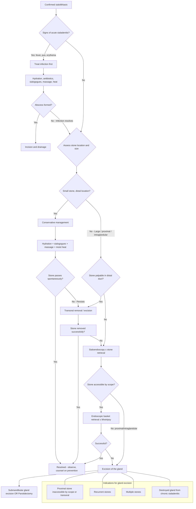

## Management of Sialolithiasis

### Guiding Principles

The management of sialolithiasis follows a simple, logical escalation ladder. Think of it from the patient's perspective: every salivary gland you can save is a gland that continues to produce saliva for the rest of their life. Modern management therefore follows a **gland-preserving philosophy** — you start with the least invasive option and escalate only if needed. Gland excision is the last resort.

The key decision points are:

1. **Is there active infection (sialadenitis)?** → Treat the infection first before any stone removal.
2. **Where is the stone?** (Distal duct → easily accessible transoral; proximal duct → sialoendoscopy; intraglandular → may need gland excision)
3. **How big is the stone?** (Small stones may pass spontaneously; large stones need intervention)
4. **Is this recurrent or are there multiple stones?** → Gland excision may be the definitive answer.

---

### Management Algorithm

---

### Treatment Modalities — Detailed Discussion

---

#### 1. Conservative Management

***Conservative management*** is the first step for small, uncomplicated stones, and is also the supportive backbone of management at every stage [1][2].

The rationale is straightforward: if you can increase salivary flow and reduce viscosity, the increased hydraulic pressure may flush the stone out through the duct orifice naturally. This works best for small, distal stones.

***Conservative — small stones to pass by themselves*** [1].

| Measure | Mechanism | Practical Details |
|---|---|---|
| ***Adequate hydration*** [2] | Increases overall fluid status → increases salivary production → more flow through the duct → hydraulic pressure to push the stone out | Encourage oral fluid intake of ≥ 2–3 L/day; IV fluids if the patient is acutely unwell or unable to tolerate oral intake |
| ***Sialogogues to promote ductal secretions*** [2] | Sialogogues (*sialon* = saliva, *agogos* = leading/promoting) are substances that stimulate salivary flow. They work by activating the gustatory reflex arc — sour taste → afferent via CN VII/IX → salivatory nuclei → efferent parasympathetic → salivary secretion | ***Examples include tart hard candies such as lemon drops*** [2]; ***used throughout the day as often as tolerated*** [2]. Vitamin C tablets, sour sweets, or even just sucking on a lemon wedge will work |
| ***Massaging the gland*** [2] | Mechanical compression of the gland squeezes saliva (and potentially the stone) toward the duct orifice | Gentle but firm external massage over the gland, directed anteriorly toward the duct opening |
| ***Milking the duct*** [2] | Specifically applies pressure along the course of the duct (posterior → anterior for Wharton's duct) to push the stone distally | Bimanual technique: intraoral finger on the floor of mouth presses the duct while external hand supports the gland |
| ***Apply moist heat to involved area*** [2] | Warmth causes local vasodilatation → reduces oedema around the stone → widens the duct lumen slightly → facilitates stone passage; also provides symptomatic pain relief | Warm compress or warm towel applied to the affected side of the face for 15–20 min, several times daily |

**When conservative management is appropriate**:
- Small stones ( < 5 mm)
- Distal location (near the duct orifice)
- First episode, mild symptoms
- No signs of infection

**When conservative management is NOT enough**:
- Large stones (unlikely to pass spontaneously)
- Proximal or intraglandular stones
- Recurrent episodes despite conservative measures
- Secondary sialadenitis or abscess

<Callout title="Clinical Pearl — Sialogogues" type="idea">
Sialogogues are underappreciated. Even after surgical stone removal, continuing sialogogues for weeks helps keep the duct flushed, preventing recurrence. They are essentially "physiotherapy for the salivary duct."
</Callout>

---

#### 2. Medical Treatment

##### a. NSAIDs

***NSAIDs*** serve a dual purpose: ***analgesics and decrease inflammation*** [2].

- **Why NSAIDs?** Ductal obstruction causes capsular distension (pain) and local inflammation (swelling, oedema). NSAIDs inhibit cyclooxygenase (COX) → ↓ prostaglandin synthesis → ↓ pain and ↓ inflammatory swelling. Reducing periductal oedema also helps widen the duct lumen around the stone.
- ***Example: Ibuprofen*** [2].
- Alternative: Paracetamol if NSAIDs are contraindicated (renal impairment, peptic ulcer disease, aspirin-sensitive asthma).

##### b. Antibiotics

***Antibiotics*** are NOT needed for uncomplicated sialolithiasis. They are ***indicated if superinfection is suspected from increasing pain, fever or purulent discharge from the salivary duct*** [2].

- **Rationale**: Stagnant saliva behind the stone is colonised by oral bacteria that ascend through the duct. Once infection establishes (sialadenitis), antibiotics are needed to control sepsis before any stone removal is attempted.
- ***Anti-staphylococcal antibiotics should be administered*** because ***S. aureus is the most common organism*** in acute suppurative sialadenitis [2].
- ***Examples: dicloxacillin and cephalexin*** [2] — both are anti-staphylococcal β-lactams.
  - **Dicloxacillin** (*di-* = two, *clox-* = cloxacillin derivative): a penicillinase-resistant penicillin → effective against MSSA (methicillin-sensitive *S. aureus*)
  - **Cephalexin** (1st generation cephalosporin): good gram-positive coverage including MSSA
- For penicillin-allergic patients: clindamycin (also covers anaerobes, which is useful given the polymicrobial nature of many salivary infections).
- Duration: typically 7–10 days; ***lack of improvement or focal worsening within the gland despite antibiotics for 7–10 days suggests possibility of abscess formation*** [2] — at which point incision and drainage is needed.

The lecture slides for ***sialadenitis treatment*** reinforce: ***hydration, sialogogues, massage, heat, antibiotics during acute attacks*** [1].

<Callout title="Treat Infection Before Stone Removal" type="error">
Never attempt transoral stone removal or sialoendoscopy in the setting of acute sialadenitis — the tissues are oedematous, friable, and there is a risk of spreading infection. Control the infection first (antibiotics, hydration, sialogogues), let the acute inflammation settle, then plan definitive stone removal.
</Callout>

---

#### 3. Surgical Treatment — Gland-Preserving Approaches

The goal of modern surgery is to **remove the stone while preserving the gland**. The gland is only sacrificed when gland-preserving techniques are not feasible or have failed.

##### a. Transoral Removal / Excision

***Transoral removal/excision*** [1] is the classic approach for distal duct stones.

- **Indication**: ***Stones that are palpable within the mouth are generally amenable to this procedure*** [2] — i.e., distal Wharton's duct stones that can be felt on bimanual palpation of the floor of mouth, or stones visible at the duct orifice.
- **Technique**: Under local anaesthesia, an incision is made over the stone in the floor-of-mouth mucosa directly over the palpable calculus. The stone is delivered. The duct is then either left open (marsupialisation) or loosely re-approximated.
- ***Treatment in the past included marsupialisation and calculus removal*** [3] — marsupialisation means opening the duct over the stone site and suturing the duct edges to the oral mucosa, creating a new, wider duct opening. This prevents stricture formation at the incision site.

**Complications to watch for**:
- ***Care must be taken to avoid excess trauma to the duct and associated sublingual glands to avoid formation of ranula*** — a ranula is a ***retention cyst on the floor of mouth*** that can form if the sublingual gland ductules are injured [2].
- **Lingual nerve injury** (sensory branch of CN V3): runs in close proximity to Wharton's duct on the floor of mouth. Damage causes numbness of the ipsilateral anterior 2/3 of the tongue and loss of taste (carried by chorda tympani which runs with lingual nerve).
- **Wharton's duct stricture**: if the duct heals with scarring at the incision site → future obstruction.

**Advantages**: Simple, quick, can be done under local anaesthesia, minimal morbidity, preserves the gland.

**Limitations**: Only works for distal, palpable stones. Cannot reach proximal duct or intraglandular stones.

##### b. Sialoendoscopy and Stone Removal

***Sialoendoscopy and removal*** [1] represents the ***recent advance*** [3] in sialolithiasis management and has transformed the field.

- **What it is**: A miniature semi-rigid or flexible endoscope (0.8–1.6 mm diameter) is introduced into the duct orifice and advanced along the duct to the stone.
- **Technique**: Once the stone is visualised, it can be retrieved with wire baskets, grasped with micro-forceps, or fragmented with laser lithotripsy (see below) before retrieval. The duct can also be dilated and irrigated.
- ***Sialoendoscopy may be utilized to visualize the ductal anatomy and to remove small stones that are beyond the reach of traditional transoral surgical procedures*** [2].
- ***Can find stones that have gone undetected by other imaging techniques*** [2].
- ***Can also be performed after traditional transoral calculus removal to check for presence of residual stone fragments*** [2] — this is an important quality-control step.

**Indications**:
- Stones in the proximal duct (beyond the reach of transoral excision)
- Small-to-moderate sized intraductal stones
- Failed conservative management
- Need for combined diagnostic + therapeutic procedure
- Post-transoral removal — to check for residual fragments

**Limitations**:
- Cannot access very proximal hilum or intraglandular stones in some cases
- Stone too large for endoscopic retrieval (may need lithotripsy first)
- Requires specialised equipment and training
- Duct may be too stenosed or inflamed to allow scope passage

**Lecture slides highlight sialoendoscopy** under both sialolithiasis treatment [1] and sialadenitis treatment: ***remove stones — exploration of submandibular duct, sialoendoscopy*** [1].

##### c. Extracorporeal Shock Wave Lithotripsy (ESWL)

***Extracorporeal lithotripsy*** [2] — "extra" = outside, "corporeal" = body, "litho" = stone, "tripsy" = crushing.

- **What it is**: Focused shock waves generated outside the body are directed at the stone to fragment it into smaller pieces that can then be flushed out naturally or retrieved endoscopically.
- ***Indicated in patients in whom a simple transoral surgical approach is not possible or fails — typically stones located in proximal ducts or in salivary glands themselves*** [2].
- ***Effective for intraductal stones < 7 mm*** [2].

**Advantages**: Non-invasive, no incision, can reach stones in proximal ducts or within the gland parenchyma.

**Limitations**:
- Less effective for large stones ( > 7 mm)
- Multiple sessions often required
- Fragments may not all be expelled — residual fragments can serve as nidi for recurrence
- Not widely available in all centres
- Contraindicated in patients with coagulopathies or acute sialadenitis

##### d. Laser Lithotripsy (Intracorporeal)

***Laser lithotripsy*** [2] — performed *inside* the duct via a sialoendoscope.

- ***Performed via an endoscope to allow fragmentation of stones prior to endoscopic removal*** [2].
- A laser fibre (e.g., Holmium:YAG or Thulium laser) is passed through the working channel of the sialoendoscope and directed at the stone surface. Laser energy fragments the stone into smaller pieces which are then flushed out or retrieved with baskets.

**Advantages**: Allows treatment of larger stones that cannot be retrieved whole through the endoscope. Combined with sialoendoscopy, it is a single-session, gland-preserving procedure.

**Limitations**: Requires specialised equipment; risk of ductal injury from thermal effect; not suitable for intraglandular stones.

---

#### 4. Surgical Treatment — Gland Excision (Definitive)

***Excision of the gland*** [1] is the definitive, last-resort treatment when gland-preserving approaches are not feasible.

The lecture slides provide clear indications for gland excision [1]:

> ***Excision of the gland:***
> - ***Proximal stone — inaccessible by scope or transoral excision***
> - ***Recurrent stones***
> - ***Multiple stones***

An additional indication from the pathophysiology discussion:
- **Destroyed gland from chronic sialadenitis**: If the gland has already been destroyed by chronic inflammation/fibrosis (the end-stage of repeated infection/obstruction), there is no functioning gland left to save. Removing it eliminates a source of recurrent infection [1].

***Treatment in the past*** relied heavily on ***submandibular gland excision*** [3] — this was the standard before sialoendoscopy became available. Now, gland excision is reserved for cases that fail minimally invasive approaches.

##### a. Submandibular Gland Excision (Submandibular Sialadenectomy)

- **Approach**: External incision in the neck, ~2 cm below the lower border of the mandible (in a skin crease for cosmesis), following the submandibular triangle.
- **Key structures at risk**:
  - **Marginal mandibular branch of the facial nerve (CN VII)**: runs superficially along the lower border of the mandible — if damaged, the patient loses the ability to depress the lower lip on that side (asymmetric smile). This is the most important nerve to protect.
  - **Lingual nerve (CN V3)**: runs in intimate contact with the deep part of the submandibular gland (loops under Wharton's duct). Injury → numbness of ipsilateral anterior 2/3 of tongue + loss of taste.
  - **Hypoglossal nerve (CN XII)**: runs deep to the gland on the hyoglossus muscle. Injury → ipsilateral tongue deviation (tongue deviates toward the side of the lesion on protrusion because the contralateral genioglossus is unopposed).

##### b. Parotidectomy

- Much less commonly needed for sialolithiasis (parotid stones are rarer, and many can be managed endoscopically).
- **Approach**: Modified Blair incision (pre-auricular, extending behind the ear and into the neck).
- **Key structure at risk**: **Facial nerve (CN VII)** — runs through the substance of the parotid gland. The nerve must be identified and preserved. Superficial parotidectomy (removing only the superficial lobe) is the standard if the stone is in the superficial portion.
- Complications: facial nerve palsy (temporary or permanent), Frey syndrome (gustatory sweating — aberrant reinnervation of sweat glands by parasympathetic fibres intended for the parotid), salivary fistula, great auricular nerve injury (earlobe numbness).

<Callout title="When to Excise the Gland — Summary" type="idea">
Use this mnemonic: **PRM-D** — ***P***roximal stone inaccessible, ***R***ecurrent stones, ***M***ultiple stones, ***D***estroyed gland. If any of these apply, gland excision is the answer [1].
</Callout>

---

#### 5. Management of Sialadenitis (as a Complication)

The lecture slides provide a dedicated treatment slide for ***sialadenitis*** [1]:

> ***Sialadenitis — treatment:***
> - ***Hydration***
> - ***Sialogogues, massage, heat, antibiotics during acute attacks***
> - ***Remove stones:***
>   - ***Exploration of submandibular duct***
>   - ***Sialoendoscopy***
> - ***Excision of the gland***

This confirms the stepwise approach: medical stabilisation → stone removal → gland excision if needed.

**Abscess management**: If ***lack of improvement or focal worsening within the gland despite antibiotics for 7–10 days suggests abscess formation*** [2], then:
- CT with contrast to confirm abscess
- **Incision and drainage** (I&D) — either percutaneous (USG-guided) or open surgical drainage
- ***Abscess formation can potentially compromise the airways*** [2] — especially submandibular abscesses, which can extend into the submandibular space (Ludwig's angina) or parapharyngeal space. This is an ENT emergency requiring urgent airway management + drainage.

---

#### 6. Prevention of Recurrence

After successful stone removal, counsel the patient on prevention:

| Measure | Rationale |
|---|---|
| **Adequate hydration** (≥ 2 L/day) | Maintains salivary flow → prevents stasis and supersaturation |
| **Avoid anticholinergic medications** where possible | These reduce salivary flow, predisposing to stasis |
| **Regular sialogogues** | Periodic use of sour candies keeps ducts flushed |
| **Good oral hygiene** | Reduces bacterial load → less risk of ascending infection if partial obstruction recurs |
| **Treat underlying metabolic causes** | Correct hypercalcaemia (e.g., treat hyperparathyroidism), gout (urate-lowering therapy) |
| **Smoking cessation** | Smoking reduces salivary flow and alters saliva composition |

---

### Summary Table: Treatment Escalation Ladder

| Step | Treatment | Indication | Key Points |
|---|---|---|---|
| **1** | ***Conservative*** | Small, distal stones; first episode | ***Hydration, sialogogues, massage, moist heat*** [1][2] |
| **2** | ***Medical*** | Pain / inflammation / superinfection | ***NSAIDs (ibuprofen); antibiotics (dicloxacillin/cephalexin) if sialadenitis*** [2] |
| **3** | ***Transoral removal*** | ***Palpable distal duct stone*** | Incision over stone in floor of mouth; risk of ranula, lingual nerve injury [2] |
| **4** | ***Sialoendoscopy ± lithotripsy*** | Proximal duct stones; failed transoral; combined diagnostic-therapeutic | ***Recent advance***; can also check for residual fragments post-transoral [2][3] |
| **5** | ***ESWL*** | Intraductal stone < 7 mm; proximal or intraglandular; transoral not possible | Non-invasive; may need multiple sessions [2] |
| **6** | ***Gland excision*** | ***Proximal stone inaccessible; recurrent stones; multiple stones; destroyed gland*** [1] | Submandibular sialadenectomy or parotidectomy; watch for CN VII, lingual nerve, CN XII |

---

<Callout title="High Yield Summary">

1. **Management philosophy**: Gland-preserving → escalate as needed → gland excision is last resort.

2. ***Conservative management: small stones to pass by themselves*** [1] — ***hydration, sialogogues (lemon drops), massage, milking the duct, moist heat*** [2].

3. ***NSAIDs for pain and inflammation; antibiotics (anti-staphylococcal: dicloxacillin/cephalexin) only if superinfection suspected*** [2].

4. ***Transoral removal for distal, palpable stones*** — beware ranula formation and lingual nerve injury [2].

5. ***Sialoendoscopy and removal*** — the ***recent advance*** [3]; for proximal duct stones beyond transoral reach; can also check for residual fragments after transoral removal [2].

6. ***ESWL effective for intraductal stones < 7 mm*** [2].

7. ***Gland excision indications: proximal stone inaccessible by scope or transoral excision, recurrent stones, multiple stones*** [1], destroyed gland from chronic sialadenitis.

8. ***Sialadenitis treatment: hydration, sialogogues, massage, heat, antibiotics during acute attacks → remove stones → excision of gland*** [1].

9. ***Abscess formation*** (failure to improve on antibiotics for 7–10 days) → CT → I&D; ***can potentially compromise airways*** [2].

10. ***Past treatment: marsupialisation and calculus removal, submandibular gland excision. Current: sialoendoscopy*** [3].

</Callout>

---

<ActiveRecallQuiz
  title="Active Recall - Management of Sialolithiasis"
  items={[
    {
      question: "List the 5 components of conservative management for sialolithiasis and explain the mechanism of sialogogues.",
      markscheme: "(1) Adequate hydration - increases salivary flow. (2) Sialogogues (e.g. lemon drops) - sour taste activates gustatory reflex via CN VII/IX to salivatory nuclei, increasing parasympathetic-driven salivary secretion to flush out the stone. (3) Massaging the gland - mechanical compression pushes saliva and stone toward orifice. (4) Milking the duct - directed posterior-to-anterior pressure along duct course. (5) Moist heat - vasodilatation reduces periductal oedema, widens duct lumen."
    },
    {
      question: "When are antibiotics indicated in sialolithiasis, and which antibiotics should be used? Why anti-staphylococcal?",
      markscheme: "Antibiotics indicated when superinfection is suspected: increasing pain, fever, or purulent discharge from the duct. Use anti-staphylococcal antibiotics (dicloxacillin or cephalexin) because S. aureus is the most common organism in acute suppurative sialadenitis. Clindamycin for penicillin-allergic patients."
    },
    {
      question: "What are the 3 indications for gland excision listed in the lecture slides?",
      markscheme: "(1) Proximal stone inaccessible by scope or transoral excision. (2) Recurrent stones. (3) Multiple stones. Also accept: destroyed gland from chronic sialadenitis."
    },
    {
      question: "What complication of transoral stone removal must the surgeon specifically avoid, and how does it occur?",
      markscheme: "Ranula - a mucus retention cyst on the floor of mouth. It occurs from excess trauma to Wharton's duct and the associated sublingual glands during stone removal, causing ductule obstruction and mucus accumulation. Also: lingual nerve injury causing tongue numbness and taste loss."
    },
    {
      question: "Compare the old standard treatment for salivary duct stones with the modern approach, as stated in the lecture slides.",
      markscheme: "Past treatment: marsupialisation and calculus removal, or submandibular gland excision. Recent advance: sialoendoscopy - allows minimally invasive visualisation and removal of stones, preserving the gland. Sialoendoscopy can also be combined with laser lithotripsy for larger stones."
    },
    {
      question: "A patient with sialolithiasis has been on antibiotics for 10 days but has worsening focal swelling and fever. What do you suspect and what is the management?",
      markscheme: "Suspect abscess formation (lack of improvement or focal worsening despite 7-10 days of antibiotics). Management: CT with contrast to confirm abscess, then incision and drainage. Must also assess airway as abscess can potentially compromise the airway (especially submandibular - risk of Ludwig's angina). Continue IV antibiotics."
    }
  ]}
/>

---

## References

[1] Lecture slides: GC 217. Facial nerve palsy and salivary gland diseases.pdf (p45, p55, p56, p57)
[2] Senior notes: felixlai.md (sections 326–330)
[3] Lecture slides: GC 219. Infections and tumours in pharynx and oral cavity.pdf (p27, p28)
