## Differential Diagnosis of Abdominal Pain

### Philosophical Approach — How to Think About the DDx

The differential diagnosis of abdominal pain is enormous. Rather than trying to memorise every single cause, the key is to have a **structured framework** that you apply every single time. There are several complementary frameworks you can use simultaneously:

1. **By anatomical quadrant** (where is the pain?) — narrows the organ
2. **By acuity** (acute vs chronic vs recurrent) — narrows the tempo of disease
3. **By mechanism** (inflammation, obstruction, ischaemia, perforation, haemorrhage, functional) — narrows the pathology
4. **By patient demographics** (age, sex, ethnicity, comorbidities) — narrows the probability
5. **By Murtagh's diagnostic strategy** (probability diagnosis → serious disorders not to be missed → pitfalls → masquerades → "is the patient trying to tell me something?") — a systematic safety net [1]

> The beauty of Murtagh's framework is that it forces you to think about common things first, then actively look for the dangerous mimics and the "often missed" diagnoses. This is exactly how a good clinician thinks.

---

### Master DDx Framework: Mermaid Diagram

```mermaid
flowchart TD
    A["Abdominal Pain"] --> B["Acute (< 1 week)"]
    A --> C["Chronic / Recurrent (> 3 months)"]
    
    B --> D["By Quadrant"]
    B --> E["Diffuse / Non-specific"]
    B --> F["Life-threatening - MUST NOT MISS"]
    
    D --> D1["RUQ: Biliary colic, Cholecystitis,\nCholangitis, Hepatitis, Liver abscess,\nRuptured HCC"]
    D --> D2["Epigastric: PUD, Pancreatitis, PPU,\nGERD, AAA, Acute gastritis"]
    D --> D3["LUQ: Splenic pathology,\nGastric ulcer, Pancreatitis tail"]
    D --> D4["RLQ: Appendicitis, Rt diverticulitis,\nCrohn's, Ectopic pregnancy,\nOvarian torsion, Mesenteric adenitis"]
    D --> D5["LLQ: Sigmoid diverticulitis,\nCRC, IBD, Ovarian pathology,\nUreteric colic"]
    D --> D6["Suprapubic: UTI, AROU, PID,\nFibroid, Endometriosis"]
    
    E --> E1["GE, Constipation, IO,\nGeneralised peritonitis,\nIntra-abdominal haemorrhage"]
    E --> E2["Medical: DKA, HyperCa, Herpes zoster,\nAnaphylaxis, Porphyria, Acute MI,\nAddisonian crisis, Sickle cell"]
    
    F --> F1["Perforated viscus"]
    F --> F2["Ruptured AAA"]
    F --> F3["Acute mesenteric ischaemia"]
    F --> F4["Acute IO with strangulation"]
    F --> F5["Severe pancreatitis"]
    F --> F6["Ruptured HCC"]
    F --> F7["DKA / Acute MI / Addisonian crisis"]
    F --> F8["Ruptured ectopic / Placental abruption"]
    
    C --> G["Probability: IBS, Dysmenorrhoea,\nConstipation, PUD/Gastritis"]
    C --> H["Serious: Mesenteric ischaemia, AAA,\nBowel/Stomach/Pancreatic/Ovarian CA"]
    C --> I["Pitfalls: Adhesions, Biliary disease,\nLactose intolerance, IBD, Endometriosis,\nChronic pancreatitis, Coeliac disease"]
```

---

### Murtagh's Diagnostic Strategy — Acute Abdominal Pain in Adults [1]

This is the lecture-slides framework. Every single entry below comes from or is cross-referenced with the Murtagh slides. Understand the *logic* behind each category.

#### Probability Diagnosis (Common — Think of First)

These are the conditions you will see **most often** in clinical practice:

| Condition | Why It's Common | Key Distinguishing Feature |
|---|---|---|
| ***Acute gastroenteritis*** | Most common cause of acute abdominal pain worldwide; viral/bacterial | Diffuse crampy pain + **diarrhoea + vomiting** (N/V typically *before* pain — contrast with appendicitis where pain precedes vomiting) |
| ***Acute appendicitis*** | Lifetime risk ~7-8%; peak 20s-30s | **Migratory pain** periumbilical → RLQ; anorexia; low-grade fever |
| ***Mittelschmerz / Dysmenorrhoea*** | Extremely common in women of reproductive age | Mid-cycle (Mittelschmerz = "middle pain" in German, i.e., pain at ovulation) or cyclical with menses |
| ***Irritable bowel syndrome*** | Prevalence up to 25% in East Asia | **Recurrent** crampy pain related to defecation; no red flags; diagnosis of exclusion [12][18] |
| ***Biliary colic / Renal colic*** | Gallstones affect ~10-15% of adults; renal stones ~5% | Biliary: constant RUQ/epigastric < 6h; Renal: loin-to-groin colicky pain with haematuria |
| ***Peptic ulcer*** | Lifetime risk ~10% | Epigastric burning; meal-related; NSAID/H. pylori history [6][18] |

#### Serious Disorders Not to Be Missed [1]

These are the ones that **kill or maim** if you miss them. You must actively consider and exclude these in every patient with acute abdominal pain.

**Vascular** — Why vascular causes are deadly: large-vessel events cause rapid exsanguination or irreversible organ ischaemia:

| Condition | Mechanism of Pain | Key Clinical Clue |
|---|---|---|
| ***Myocardial infarction (esp. inferior)*** [1] | Inferior MI can refer pain to the epigastrium via shared T5-T9 autonomic afferents from the diaphragmatic surface of the heart | ECG changes; cardiac risk factors; **epigastric pain + nausea/diaphoresis in an elderly patient with no peritoneal signs** — always do an ECG! |
| ***Splenic infarction*** [1] | Embolic occlusion of splenic artery → splenic ischaemia → capsular distension | LUQ pain ± left shoulder tip pain; AF, endocarditis, myeloproliferative disorders |
| ***Ruptured AAA*** [1] | Aortic wall rupture → retroperitoneal/intraperitoneal haemorrhage | **Classical triad: severe abdominal/back pain + hypotension + pulsatile abdominal mass** [9] |
| ***Dissecting aneurysm of aorta*** [1] | Intimal tear → blood dissects through medial layer → stretches adventitia (nociceptive) | "Tearing" interscapular/back pain; BP differential between arms; wide mediastinum on CXR |
| ***Mesenteric artery occlusion*** [1] | SMA embolism/thrombosis → midgut ischaemia/infarction | ***Pain out of proportion to examination***; AF or vascular disease history; metabolic acidosis + ↑lactate [4] |

**Cancer** [1]:
- ***Bowel cancer with large or small bowel obstruction*** — Colorectal carcinoma is the **commonest cause of LBO** in adults. Think of this in any elderly patient with new-onset colicky pain + distension + change in bowel habit.

**Infection** [1]:

| Condition | Why Serious | Distinguishing Features |
|---|---|---|
| ***Acute cholecystitis*** | Can progress to empyema, gangrenous cholecystitis, perforation | RUQ pain > 4-6h + fever + Murphy's sign [2][5] |
| ***Acute salpingitis*** | Can cause tubo-ovarian abscess, sepsis, infertility | Bilateral lower abdominal pain + fever + vaginal discharge; cervical motion tenderness |
| ***Peritonitis / SBP*** | Septicaemia → multi-organ failure | Generalised guarding/rigidity; SBP in cirrhotic patients [13] |
| ***Ascending cholangitis*** | Biliary sepsis → septic shock | Charcot's triad / Reynold's pentad [2] |
| ***Intra-abdominal abscess*** | Persistent sepsis | Persistent fever despite antibiotics; CT shows collection [3][11] |

**Other serious conditions** [1]:

| Condition | Mechanism | Key Feature |
|---|---|---|
| ***Pancreatitis*** | Autodigestion → systemic inflammatory cascade → organ failure | Epigastric → back; ↓ leaning forward; ↑amylase/lipase ≥ 3× ULN [7] |
| ***Ectopic pregnancy*** | Tubal implantation → rupture → haemoperitoneum | **+β-hCG**, amenorrhoea, unilateral pain ± shoulder tip pain if ruptured |
| ***Small bowel obstruction / Strangulated hernia*** [1] | Luminal obstruction → bowel ischaemia if strangulated | Colicky pain + vomiting + distension + absolute constipation; **always check hernial orifices!** [14] |
| ***Sigmoid volvulus*** [1] | Sigmoid colon twists on mesentery → closed-loop obstruction | Elderly constipated male; massive abdominal distension; "coffee-bean sign" on AXR [17] |
| ***Perforated viscus (esp. PPU)*** [1] | Free leakage of GI contents → chemical then bacterial peritonitis | Sudden maximal epigastric pain → generalised; board-like rigidity; loss of liver dullness [2] |

<Callout title="Always Check Hernial Orifices" type="error">

***Incarcerated hernias*** are a leading cause of complications related to bowel obstruction [14]. A strangulated inguinal or femoral hernia is easily missed if the groins are not examined — **a cardinal sin in the assessment of acute abdominal pain**. Femoral hernias are particularly treacherous because they are small, more common in women, and have a high rate of strangulation.

</Callout>

#### Pitfalls (Often Missed) [1]

These are the diagnoses that are **frequently overlooked**, leading to diagnostic delay:

| Condition | Why It's Missed | How to Catch It |
|---|---|---|
| ***Acute appendicitis (atypical)*** [1] | Retrocaecal (minimal anterior signs), pelvic (suprapubic/urinary/rectal symptoms), or malrotated appendix | **Maintain a high index of suspicion** in any RLQ/RIF pain; serial examination is key; CT if in doubt [3][10][18] |
| ***Myofascial tear / Muscle wall pain*** [1] | Abdominal wall pathology masquerading as intra-abdominal | **Carnett sign**: tenderness that *increases* when the patient tenses the abdominal wall muscles (sit-up position) → points to abdominal wall origin [18] |
| ***Pulmonary causes: pneumonia, PE*** [1] | Lower lobe pneumonia (especially right) refers pain to upper abdomen via diaphragmatic irritation (phrenic nerve C3-C5) | CXR; pleuritic pain; cough; hypoxia; high respiratory rate |
| ***Faecal impaction (elderly)*** [1] | Elderly, immobile or demented patients may present with vague abdominal pain; easily diagnosed on PR exam | **Always do a PR exam** in elderly patients with abdominal pain |
| ***Acute diverticulitis*** [1] | **Right-sided diverticulitis in Asian patients mimics appendicitis** [3][11]; sigmoid diverticulitis may be mild | CT abdomen with contrast is the diagnostic test of choice [3] |
| ***Herpes zoster*** [1] | Pre-eruptive phase causes dermatomal pain *before* the rash appears → can mimic visceral pain | Look for rash in a dermatomal distribution; unilateral; burning/lancinating quality |
| ***Acute hepatitis*** [1] | RUQ pain from liver capsule distension; may be subtle | LFTs (markedly ↑ALT/AST); jaundice; travel/drug/sexual history |
| ***Inflammatory bowel disease*** [1] | Insidious onset; may present acutely in young patients | Bloody diarrhoea (UC); chronic diarrhoea + weight loss + perianal disease (Crohn's) [16] |

**Rarities** (low probability but examinable) [1]:
- ***Porphyria*** ("purple urine" — actually port-wine) — intermittent severe colicky abdominal pain with neuropsychiatric features; check urine porphyrins
- ***Lead poisoning*** — colicky pain + constipation + basophilic stippling on blood film + blue line on gums (Burton's line)
- ***Haemochromatosis*** — RUQ pain from hepatomegaly; bronze skin; diabetes; arthropathy; ↑ferritin, ↑transferrin saturation
- ***Haemoglobinuria / Sickle cell anaemia*** [1] — vaso-occlusive crises cause severe diffuse abdominal pain; sickle cell patients have a high rate of cholesterol gallstones too
- ***Addison disease*** [1] — **acute adrenal crisis presents as an acute abdomen** with diffuse abdominal pain, nausea, vomiting, fever, hypotension and shock [19]; hypoNa, hyperK, hypoglycaemia

#### Masquerades Checklist [1]

These are **non-abdominal conditions** that present with abdominal pain. The concept is that the abdomen is a "great mimicker" — and equally, other conditions can mimic abdominal pathology.

| Masquerade | Mechanism | Clinical Clue |
|---|---|---|
| ***Depression*** [1] | Somatic presentation of psychiatric illness; visceral hypersensitivity from altered brain-gut signalling | Chronic/recurrent pain with no organic cause found; associated with sleep disturbance, anhedonia, psychomotor changes |
| ***Diabetes (ketoacidosis)*** [1] | **DKA causes an acute abdomen** — diffuse abdominal pain, nausea, vomiting due to ileus (metabolic acidosis → impaired GI motility) [19] | Kussmaul respiration, fruity breath, polyuria/polydipsia history, **hyperglycaemia ≥ 11 mmol/L** with ketonuria + metabolic acidosis |
| ***Drugs*** [1] | NSAIDs → PUD/gastropathy; iron tablets → GI irritation; narcotics → constipation/ileus; cytotoxics → mucositis, neutropenic enterocolitis | **Always take a thorough drug history** |
| ***Anaemia (sickle cell)*** [1] | Vaso-occlusive crisis → microinfarction of mesenteric vasculature, splenic infarction, or hepatic sequestration | Known sickle cell disease; acute pain crisis; ↓Hb; sickle cells on film |
| ***Spinal dysfunction (referred)*** [1] | Thoracolumbar spinal pathology (T7-L1) can refer pain to the abdomen via somatic nerve roots | Dermatomal distribution; associated with back pain; tenderness follows dermatome, not organ |
| ***UTI (including urosepsis)*** [1] | Lower urinary tract infection → suprapubic pain; pyelonephritis → flank/loin pain; urosepsis → diffuse abdominal pain with systemic toxicity | Dysuria, frequency, urgency; pyuria on urine MC; fever with rigors in urosepsis |

> ***"Is the patient trying to tell me something?"*** [1] — ***May be very significant. Consider Munchausen syndrome, sexual dysfunction and abnormal stress*** [1]. This is the final safety net in Murtagh's framework: some patients present with abdominal pain as a vehicle to discuss other concerns.

<Callout title="DKA as an Acute Abdomen" type="error">

***DKA can perfectly mimic a surgical acute abdomen*** [1][19]. The mechanism is multifactorial: severe metabolic acidosis causes **paralytic ileus** (impaired smooth muscle contractility), **gastric distension**, and **direct peritoneal irritation** from ketone bodies. The clinical presentation includes diffuse abdominal pain, guarding, nausea, and vomiting — making it virtually indistinguishable from peritonitis on examination alone. ***Always check blood glucose and ketones in any patient with acute abdominal pain***, especially if young, thin, or with known T1DM. Performing an unnecessary laparotomy on a DKA patient is a classic exam and real-life disaster.

</Callout>

---

### Murtagh's Diagnostic Strategy — Chronic / Recurrent Abdominal Pain in Adults [1]

The chronic DDx overlaps with the acute list but shifts the probabilities significantly toward functional, inflammatory and neoplastic causes.

#### Probability Diagnosis [1]
- ***Irritable bowel syndrome*** — #1 cause of chronic abdominal pain; Rome IV criteria (recurrent pain ≥ 1 day/week for 3 months, associated with ≥ 2 of: related to defecation, change in stool frequency, change in stool form) [12]
- ***Mittelschmerz / Dysmenorrhoea*** — cyclical, mid-cycle or menstrual
- ***Constipation*** — common especially in elderly, immobile, drug-related (opioids, CCB, anticholinergics)
- ***Peptic ulcer / Gastritis*** — chronic, meal-related epigastric pain [6]

#### Serious Disorders Not to Be Missed [1]
- ***Mesenteric artery ischaemia*** (chronic) — "intestinal angina": postprandial pain (increased metabolic demand of gut exceeds compromised blood supply) → food fear → weight loss. Classic triad: postprandial pain, food avoidance, weight loss [4].
- ***AAA*** — vague, indolent abdominal/back pain; stretching of aneurysm sac indicates **impending rupture** [9]
- ***Cancer: bowel, stomach, pancreatic, ovarian*** [1] — Weight loss, constitutional symptoms, change in bowel habit, new dyspepsia in elderly
- ***Hepatitis*** (chronic) — insidious; RUQ discomfort, fatigue, jaundice
- ***Recurrent PID*** — recurrent lower abdominal pain with vaginal discharge

#### Pitfalls (Often Missed) [1]
- ***Adhesions*** — prior abdominal surgery; intermittent colicky pain from partial SBO
- ***Appendicitis*** (grumbling / recurrent) — atypical, chronic RLQ pain
- ***Biliary disease: gallstones, sludge*** — recurrent biliary colic episodes
- ***Food allergies / Lactase deficiency*** — diarrhoea, bloating, pain related to specific dietary intake (dairy in lactose intolerance)
- ***Hernia*** — intermittent pain at hernial orifice; worse with straining/standing
- ***Constipation / Faecal impaction*** [1]
- ***Chronic pancreatitis*** [1] — chronic epigastric pain radiating to back; history of alcohol; pancreatic calcifications on imaging; exocrine insufficiency (steatorrhoea)
- ***Coeliac disease*** [1] — diarrhoea, steatorrhoea, iron/B12/folate deficiency anaemia, weight loss; positive anti-tTG antibodies; duodenal biopsy shows villous atrophy
- ***Inflammatory bowel disease*** [1] — Crohn's (any part of GIT, transmural, skip lesions, granulomas) vs UC (continuous from rectum, mucosal, pseudopolyps) [16]
- ***Crohn disease*** [1] — specifically mentioned; terminal ileum commonest site; RLQ pain, chronic diarrhoea ± PR bleeding, perianal disease, weight loss
- ***Endometriosis*** [1] — cyclical pain, dyspareunia, dyschezia; ectopic endometrial tissue
- ***Diverticular disease*** [1] — recurrent LLQ/RLQ pain; change in bowel habit
- ***Subacute obstruction (cancer, adhesions)*** [1] — intermittent colicky pain, vomiting, distension

**Rarities** [1]:
- ***Tropical infections*** (hydatids, melioidosis, strongyloides) — travel history!
- ***Uraemia*** — chronic renal failure → GI symptoms
- ***Lead poisoning, Porphyria, Sickle cell, Hypercalcaemia, Addison disease*** [1]

---

### Murtagh's Diagnostic Strategy — Abdominal Pain in Women [1]

***Probability diagnosis***: **Primary dysmenorrhoea**, **Mittelschmerz**, **Pelvic/abdominal adhesions**, **Endometriosis** [1]

***Serious disorders not to be missed*** [1]:
- **Vascular**: ***internal iliac claudication*** (rare but important)
- **Neoplasms**: ***ovary, uterus, other pelvic structures*** [1]
- **Infection**: ***PID, pelvic abscess, appendicitis*** [1]
- **Other**: ***ectopic pregnancy*** [1] — **the single most dangerous diagnosis to miss in a woman of reproductive age**

***Pitfalls (often missed)*** [1]:
- ***Endometriosis / Adenomyosis***
- ***Torsion of ovary or pedunculated fibroid***
- ***Constipation / Faecal impaction***
- ***Pelvic congestion syndrome*** — chronic pelvic pain from dilated pelvic veins; worse with standing/end of day
- ***Misplaced IUCD***
- ***Nerve entrapment*** [1] — ilioinguinal or iliohypogastric nerve entrapment (e.g., post-surgical) causing chronic localised pain

***Referred pain to pelvis*** [1]: ***appendicitis, cholecystitis, diverticulitis, UTI*** — always consider these even when the pain appears pelvic.

---

### Murtagh's Diagnostic Strategy — Acute Abdominal Pain in Children [1]

| Category | Diagnoses |
|---|---|
| **Probability diagnosis** | ***Infant 'colic' (2-16 weeks)***, ***Gastroenteritis (all ages)***, ***Mesenteric adenitis*** |
| **Serious - not to miss** | ***Acute appendicitis (mainly 5-15y)*** — more likely **complicated** in children due to delayed presentation [18]; ***Pneumonia (esp. right lower lobe)***; ***Pyelonephritis***; ***Peritonitis***; ***Intussusception (peaks 6-9 months)***; ***Bowel obstruction***; ***Coeliac disease***; ***Strangulated inguinal hernia***; colon cancer (rare) |
| **Pitfalls** | ***Child abuse***; ***Constipation***; ***Torsion of testes***; ***Lactose intolerance***; ***Peptic ulcer***; Infections (***mumps, tonsillitis, pneumonia, EBV, UTI, hepatitis***) |

> **Key pearl for children**: ***Intussusception*** (telescoping of proximal bowel into distal bowel, classically ileocolic) presents with episodic severe colicky pain (child draws up legs and screams) + **"redcurrant jelly" stools** (mixed blood and mucus) + **sausage-shaped mass** in RUQ. Peak age 6-9 months. Pathophysiology: lead point (often Peyer's patch / lymphoid hyperplasia) gets caught in peristaltic wave → intussusception → venous congestion → ischaemia → bloody mucus extrusion.

---

### Murtagh's Diagnostic Strategy — Recurrent Abdominal Pain in Children [1]

| Category | Diagnoses |
|---|---|
| **Probability** | ***Non-organic RAP***, ***Constipation***, ***Recurrent viral illness / mesenteric adenitis*** |
| **Serious** | ***Recurrent UTI / ureteric reflux***, ***Parasitic infection*** (pinworm, strongyloides), ***TB***, ***Hydronephrosis***, colon cancer (rare) |
| **Pitfalls** | ***IBD***, ***Childhood migraine equivalent (periodic syndrome)***, ***Food allergy / lactose intolerance***, ***Gastritis / GERD***; Rarities: ***Meckel's diverticulum***, ***temporal lobe epilepsy***, ***sickle cell disease***, ***HSP***, ***IBS*** |

---

### DDx Organised by Location — Expanded Detail

This section integrates the quadrant-based approach from multiple senior notes [2][18] with the Murtagh framework above. The purpose is to have a **single, comprehensive, location-based DDx** you can recall at the bedside.

#### Right Upper Quadrant [2]

| Organ System | Differential | Key Distinguishing Feature |
|---|---|---|
| **Biliary (commonest)** | ***Biliary colic*** | Constant RUQ < 6h, post-fatty meal, ± jaundice (CBD stone) |
| | ***Acute cholecystitis*** | > 4-6h, fever, Murphy's sign [5] |
| | ***Acute cholangitis*** | Charcot's / Reynold's pentad [2] |
| | ***Sphincter of Oddi dysfunction*** | Pain < 6h, intermittent; normal labs and imaging [5] |
| **Liver** | ***Acute hepatitis*** | Capsular distension; markedly ↑ALT/AST; jaundice |
| | ***Liver abscess*** | Fever (90%), guarding/rebound; **Klebsiella in HK/diabetics**, amoebic if travel history [5] |
| | ***HCC or metastasis*** | Underlying cirrhosis/HBV carrier; sudden RUQ pain if ruptured |
| | ***Budd-Chiari syndrome*** | RUQ pain + massive ascites + LL oedema + jaundice; thrombotic RFs [2] |
| | ***Portal vein thrombosis*** | Background cirrhosis; acute RUQ pain + fever [2] |
| | ***Fitz-Hugh-Curtis syndrome*** | Pleuritic RUQ pain ± radiation to right shoulder; perihepatic adhesions from PID ("violin-string" adhesions) [2] |
| **Pancreatic** | ***Acute pancreatitis*** | Epigastric → back; ↓ leaning forward; gallstones/alcohol [7] |
| **GI** | ***PUD*** | Epigastric burning; may radiate to RUQ [2] |
| | ***Colorectal diseases*** | Hepatic flexure pathology |
| **Others** | ***Pyelonephritis, renal stone, RCC*** | Flank/loin pain, CVA tenderness, haematuria |
| | ***Basal pneumonia, pleural effusion, basal MI*** | Referred from thorax; CXR, ECG [2] |
| | ***Herpes zoster, abdominal wall pain*** | Dermatomal; Carnett sign [2] |

#### Epigastric

| Differential | Key Feature |
|---|---|
| ***PUD (GU / DU)*** | Meal-related; NSAID/H. pylori [6] |
| ***PPU*** | Sudden maximal severity; board-like rigidity; ↓liver dullness [2] |
| ***Acute pancreatitis*** | → back; ↓ leaning forward [7] |
| ***GERD / Oesophagitis*** | Retrosternal burning; ↑ lying flat [8] |
| ***Acute gastritis / Duodenitis*** | Drug history; milder |
| ***AAA (symptomatic/ruptured)*** | Pulsatile mass; hypotension [9] |
| ***Gastric / Pancreatic cancer*** | Weight loss; new dyspepsia in > 55 |
| ***Functional dyspepsia*** | 75% of dyspepsia; diagnosis of exclusion (Rome IV criteria); postprandial fullness, early satiety, epigastric pain/burning; no structural disease [18][20] |

#### Right Lower Quadrant [3][10]

| Differential | Key Distinguishing Feature |
|---|---|
| ***Acute appendicitis*** | Migratory pain; McBurney's point; anorexia → vomiting → pain sequence [3][10] |
| ***Right-sided diverticulitis*** | **More common in Asian populations**; CT shows pericolonic inflammation > 10 cm involvement, no enlarged LN [3][11] |
| ***Meckel's diverticulitis*** | Congenital remnant 2 feet from ileocaecal valve on antimesenteric border; can mimic appendicitis; usually incidental finding at surgery [3] |
| ***Acute ileitis*** | Acute bacterial (Yersinia, Campylobacter, Salmonella); **diarrhoea is a prominent symptom** [3] |
| ***Crohn's disease*** | Chronic; fever, prolonged diarrhoea, weight loss, perianal disease [3] |
| ***Tubo-ovarian abscess*** | Reproductive age women; complication of PID [3] |
| ***Ruptured ovarian cyst*** | Sudden onset; during exercise/intercourse [3] |
| ***Ovarian / Fallopian tube torsion*** | Severe sudden pain; torsion of ovarian pedicle → ischaemia [3] |
| ***PID*** | Pain worsens during coitus or near menses; purulent endocervical discharge; cervical motion tenderness [3] |
| ***Ectopic pregnancy*** | Positive β-hCG; no IUP on USS [3] |
| ***Endometritis*** | Post-delivery or post-procedure [3] |
| ***Endometriosis*** | Cyclical; dyspareunia; ectopic endometrial tissue [3] |
| ***Ureteric colic*** | Loin-to-groin; haematuria |
| ***Strangulated inguinal/femoral hernia*** | Irreducible groin lump + signs of obstruction [1] |

#### Left Lower Quadrant

| Differential | Key Distinguishing Feature |
|---|---|
| ***Sigmoid diverticulitis*** | "Left-sided appendicitis" in Western populations; triad of LLQ pain + fever + leucocytosis [11] |
| ***CRC (sigmoid)*** | Elderly; change in bowel habit; PR bleeding; iron-deficiency anaemia |
| ***UC / IBD*** | Bloody diarrhoea; continuous from rectum [16] |
| ***Ischaemic colitis*** | Elderly; sudden crampy pain + rectal bleeding < 24h; watershed areas [4][15] |
| ***Gynaecological*** | As per RLQ (left-sided equivalents) |
| ***Ureteric colic (left)*** | Loin-to-groin |

---

### DDx by Specific Clinical Scenario — Cross-Referencing Key Conditions

#### DDx of Acute Pancreatitis [7]

When a patient presents with epigastric pain radiating to the back:
- ***Peptic ulcer disease*** — burning, meal-related, no ↑amylase/lipase
- ***Choledocholithiasis / Cholangitis / Cholecystitis*** — overlaps significantly (gallstones are the commonest cause of pancreatitis!); jaundice, RUQ predominant
- ***Hepatitis*** — ↑↑ALT/AST, not amylase/lipase
- ***Mesenteric ischaemia*** — pain out of proportion; AF/vascular risk; ↑lactate [4]
- ***Intestinal obstruction*** — colicky; distension; vomiting
- ***Myocardial infarction*** [7] — **always do an ECG** in upper abdominal pain; inferior MI can mimic pancreatitis perfectly

#### DDx of Acute Diverticulitis [3][11]

- ***Colorectal cancer*** — similar presentation + bowel wall thickening on CT. **CRC can only be excluded with colonoscopy after resolution of acute inflammation** [3]. CT features favouring diverticulitis: pericolonic/mesenteric inflammation, involvement > 10 cm of colon, absence of enlarged pericolonic LN [3].
- ***Acute appendicitis*** — periumbilical → RLQ migration; younger patients
- ***Inflammatory bowel disease*** — diarrhoea predominant rather than pain [3]
- ***Infectious colitis*** — diarrhoea predominant [3]
- ***Ischaemic colitis*** — rapid onset pain + hematochezia; elderly with vascular risk factors [3]
- ***Gynaecological disorders*** — tubo-ovarian abscess, ovarian torsion, ectopic pregnancy [3]
- ***Urological disorders*** — cystitis, nephrolithiasis [3]

#### DDx of AAA [9]

- ***Aortic dissection*** — tearing interscapular pain; BP differential
- ***Ulcerated aortic plaque*** — chronic atheroembolism
- ***Acute pancreatitis*** — ↑amylase/lipase
- ***Acute peritonitis*** — peritoneal signs
- ***Acute MI*** [9] — ECG

#### DDx of Biliary Colic [5]

- ***Gallbladder polyps*** — adenoma (commonest benign neoplastic), cholesterol polyps (commonest benign non-neoplastic — "strawberry gallbladder"), adenomyomatosis [5]
- ***Acute cholecystitis*** — pain > 6h, fever, Murphy's sign [5]
- ***Sphincter of Oddi dysfunction*** — pain < 6h, intermittent, normal labs [5]
- ***Functional gallbladder disorder*** — pain < 6h, intermittent, normal labs and imaging [5]

---

### Paediatric Surgical Abdomen — Specific DDx [18]

| Condition | Age | Key Features |
|---|---|---|
| **Acute appendicitis** | MC 5-12y | Similar to adults but **more likely complicated** due to delayed presentation |
| **Mesenteric adenitis** | Children/young adults | Viral illness prodrome; high fever ( > 38.5°C — contrast with appendicitis which has *low-grade* fever); mimics appendicitis |
| **Meckel's diverticulitis** | Any age | Painless PR bleeding (ectopic gastric mucosa causing ulceration) OR mimic appendicitis |
| **Intussusception** | Peak 6-9 months | Episodic colicky pain; "redcurrant jelly" stools; sausage-shaped mass; USS "target sign" |
| **Testicular torsion** | Adolescent males | Sudden severe scrotal pain; absent cremasteric reflex; high-riding testis; **surgical emergency** — testicular viability < 6h |
| **HSP** | 3-10 years | Purpuric rash (lower limbs/buttocks) + abdominal pain (GI vasculitis) + arthritis + nephritis |
| **DKA** | Any age | As per adults; **always check glucose** [19] |

---

### Key Diagnostic Tips from Murtagh [1]

> ***"Upper abdominal pain is caused by lesions of the upper GIT. Lower abdominal pain is caused by lesions of the lower GIT or pelvic organs."*** [1]

> ***"Early severe vomiting indicates a high obstruction of the GIT."*** [1] — Because proximal obstruction has less bowel to accommodate the backed-up secretions, so vomiting occurs earlier and more prominently.

---

<Callout title="High Yield Summary">

1. **Murtagh's framework**: Probability → Serious not to miss → Pitfalls → Masquerades → "Is the patient trying to tell me something?" Apply this systematically to every patient.

2. **Life-threatening DDx of acute abdomen**: PPU, ruptured AAA, acute mesenteric ischaemia, acute IO, severe pancreatitis, ruptured HCC, DKA, acute MI, Addisonian crisis, ruptured ectopic, placental abruption.

3. **Masquerades**: Depression, DKA, Drugs (NSAIDs, opioids, cytotoxics), Sickle cell anaemia, Spinal dysfunction (referred pain), UTI/urosepsis.

4. **DKA mimics surgical acute abdomen** — always check blood glucose and ketones.

5. **Inferior MI mimics upper abdominal pain** — always do an ECG in epigastric pain.

6. **Right-sided diverticulitis in Asia mimics appendicitis** — CT abdomen is the differentiator.

7. **CRC can only be excluded with colonoscopy** after resolution of acute diverticulitis inflammation.

8. **Women of reproductive age**: always β-hCG; ectopic pregnancy is the single most dangerous miss.

9. **Children**: appendicitis more likely complicated (delayed); intussusception peaks 6-9 months; mesenteric adenitis has higher fever than appendicitis.

10. **Carnett sign** differentiates abdominal wall pain from intra-abdominal: tenderness increases with muscle tensing → wall origin.

11. **Early severe vomiting = high GI obstruction; late vomiting = distal obstruction.**

12. **Always examine hernial orifices** — incarcerated hernia is a leading cause of bowel obstruction complications.

</Callout>

---

<ActiveRecallQuiz
  title="Active Recall - Differential Diagnosis of Abdominal Pain"
  items={[
    {
      question: "List 5 life-threatening causes of an acute abdomen that must not be missed, covering at least 3 different organ systems.",
      markscheme: "Any 5 from: Perforated viscus (GI), Ruptured AAA (vascular), Acute mesenteric ischaemia (vascular), Acute IO with strangulation (GI), Severe pancreatitis (HBP), Ruptured HCC (hepatic), DKA (endocrine), Acute MI (cardiac), Addisonian crisis (endocrine), Ruptured ectopic pregnancy (obstetric). Must cover at least 3 different organ systems."
    },
    {
      question: "A 70-year-old man with AF presents with sudden severe diffuse abdominal pain. Examination reveals minimal tenderness. Lactate is elevated. What is the most likely diagnosis and why is the examination-pain discordance characteristic?",
      markscheme: "Acute mesenteric ischaemia (SMA embolism from AF). Pain out of proportion to physical findings is the hallmark because early ischaemia activates visceral nociceptors intensely but there is no peritoneal inflammation yet (parietal peritoneum not involved until transmural infarction occurs)."
    },
    {
      question: "Name 4 masquerade (non-abdominal) causes of abdominal pain from Murtagh's checklist and explain the mechanism for DKA.",
      markscheme: "Masquerades: Depression, DKA, Drugs (NSAIDs, opioids, etc.), Sickle cell anaemia, Spinal dysfunction, UTI. DKA mechanism: severe metabolic acidosis causes paralytic ileus (impaired smooth muscle contractility), gastric distension, and direct peritoneal irritation by ketone bodies, mimicking a surgical acute abdomen."
    },
    {
      question: "A 40-year-old Chinese woman presents with RLQ pain, fever, and leucocytosis. What are the two most important differential diagnoses to consider and what investigation differentiates them?",
      markscheme: "1. Acute appendicitis. 2. Right-sided diverticulitis (significantly more common in Asian populations). CT abdomen with contrast is the differentiating investigation. Features favouring diverticulitis: pericolonic and mesenteric inflammation, involvement of more than 10 cm of colon, absence of enlarged pericolonic lymph nodes."
    },
    {
      question: "Using Murtagh's diagnostic strategy, list the probability diagnoses for acute abdominal pain in children.",
      markscheme: "1. Infant colic (2-16 weeks). 2. Gastroenteritis (all ages). 3. Mesenteric adenitis. These are the most common causes to consider first in paediatric acute abdominal pain."
    },
    {
      question: "What is the Carnett sign and what does it help differentiate?",
      markscheme: "Carnett sign: abdominal tenderness that increases when the patient tenses abdominal wall muscles (e.g., by lifting head off pillow or doing a sit-up). A positive Carnett sign indicates abdominal wall origin of pain (e.g., myofascial tear, nerve entrapment, rectus sheath haematoma) rather than intra-abdominal pathology, where tenderness would decrease with muscle tensing as the contracted muscles protect underlying viscera."
    }
  ]}
/>

## References

[1] Lecture slides: murtagh merge.pdf (Abdominal pain acute in adults p4-6; Abdominal pain in women p1-2; Abdominal pain acute in children p8; Abdominal pain chronic/recurrent in adults p11-12; Abdominal pain recurrent in children p14)
[2] Senior notes: Ryan Ho Fundamentals.pdf (p268-276, p307-308, Causes of Upper Abdominal Pain, RUQ Pain)
[3] Senior notes: felixlai.md (Acute appendicitis section, Diverticulitis DDx section)
[4] Senior notes: felixlai.md (Mesenteric ischaemia section)
[5] Senior notes: felixlai.md (Cholecystitis section, Biliary colic DDx section)
[6] Senior notes: Ryan Ho GI.pdf (p76, Peptic Ulcer Disease)
[7] Senior notes: felixlai.md (Acute pancreatitis section)
[8] Senior notes: felixlai.md (GERD section)
[9] Senior notes: Ryan Ho Cardiology.pdf (p222, Abdominal Aortic Aneurysms); felixlai.md (AAA DDx section)
[10] Senior notes: maxim.md (Acute appendicitis section)
[11] Senior notes: felixlai.md (Diverticular disease section); maxim.md (Diverticular disease section)
[12] Senior notes: Ryan Ho GI.pdf (p118-119, Irritable Bowel Syndrome)
[13] Senior notes: felixlai.md (Peritonitis section)
[14] Senior notes: felixlai.md (Bowel obstruction section)
[15] Senior notes: Ryan Ho GI.pdf (p146, Ischaemic Colitis)
[16] Senior notes: felixlai.md (Ulcerative colitis section)
[17] Senior notes: felixlai.md (Volvulus section)
[18] Senior notes: maxim.md (Paediatric surgical abdomen section; Acute appendicitis section)
[19] Senior notes: Ryan Ho Endocrine.pdf (p71, Adrenal insufficiency; p91, DKA)
[20] Senior notes: felixlai.md (Dyspepsia section); Ryan Ho Fundamentals.pdf (p263, Approach to Dyspepsia)
