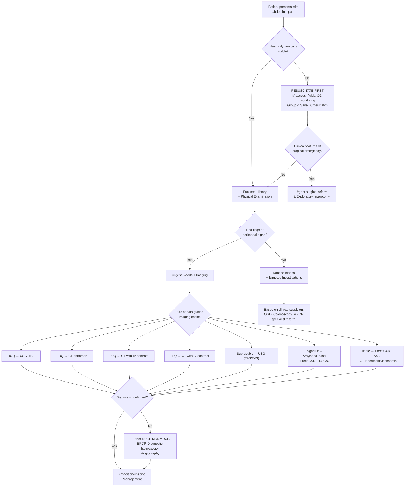
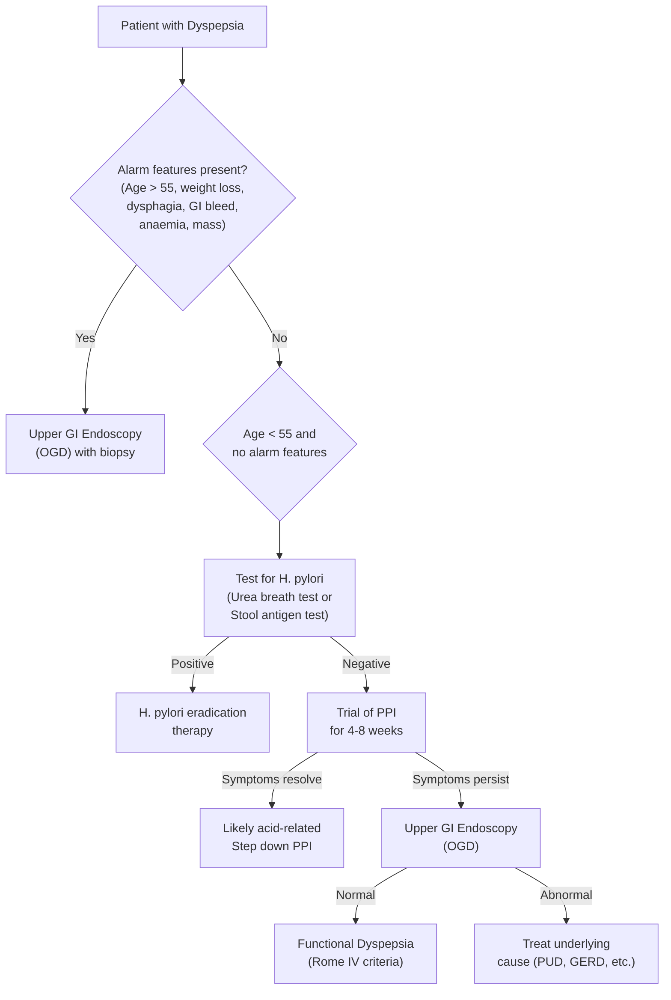
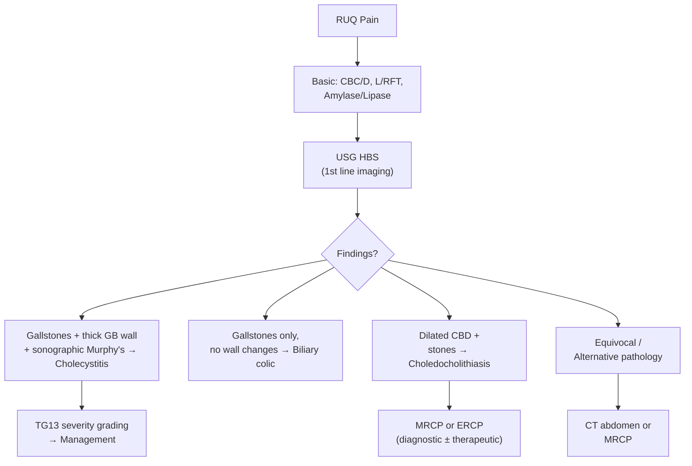

## Diagnostic Approach to Abdominal Pain

The diagnostic approach to abdominal pain is fundamentally about **pattern recognition guided by structured clinical reasoning**, followed by **targeted investigations** to confirm or refute your clinical hypothesis. There is no single diagnostic criterion for "abdominal pain" itself — instead, we use condition-specific criteria alongside a systematic investigative algorithm.

---

### Overarching Diagnostic Algorithm

The first question is always: **Is this patient haemodynamically stable?** If not, resuscitate first. The second question: **Is this a surgical abdomen requiring immediate intervention?**

<Callout title="Imaging Choice by Pain Location" type="idea">

This is a high-yield, practical rule from the senior notes [21]:

| ***Site of Pain*** | ***Imaging of Choice*** |
|---|---|
| ***RUQ*** | ***USG*** |
| ***LUQ*** | ***CT*** |
| ***RLQ*** | ***CT with IV contrast*** |
| ***LLQ*** | ***CT with IV contrast*** |
| ***Suprapubic*** | ***USG (TAS or TVS)*** |

**Why USG for RUQ?** Because the commonest causes are biliary (gallstones, cholecystitis) and hepatic — USG is highly sensitive (95%) for gallstones and can demonstrate gallbladder wall thickening, pericholecystic fluid, and sonographic Murphy's sign [2][22].

**Why CT for LUQ, RLQ, LLQ?** Because CT provides the best anatomical detail for bowel pathology (diverticulitis, appendicitis, malignancy, ischaemia) and retroperitoneal structures. CT with IV contrast is preferred to demonstrate bowel wall enhancement and vascular pathology [3][21].

**Why USG for suprapubic?** Pelvic pathology (ovarian cysts, ectopic pregnancy, fibroids, bladder) is well-visualised by transabdominal (TAS) or transvaginal (TVS) ultrasonography without radiation [21].

</Callout>

---

### Key Examination Checklist [1]

***A useful checklist*** from the lecture slides [1]:
- ***General appearance***
- ***Oral cavity*** (dehydration, jaundice)
- ***Vital parameters including temperature, pulse***
- ***Abdominal examination: inspection, auscultation, palpation and percussion (in that order)*** [1]
- ***Rectal examination***
- ***Inguinal region*** (hernial orifices)
- ***Vaginal examination (if appropriate)*** [1]
- ***Urine analysis*** [1]

> **Why auscultation before palpation?** Because palpation can stimulate peristalsis and alter bowel sounds, invalidating your assessment. Auscultate first to get a true baseline.

### Physical Examination Signs — Detailed Interpretation

| Sign | How to Elicit | Positive Finding | Pathophysiological Basis |
|---|---|---|---|
| **Guarding** | Palpate the abdomen | Voluntary muscle contraction over tender area | Patient consciously or subconsciously protects inflamed peritoneum |
| **Rigidity** | Palpate the abdomen | Involuntary board-like muscle spasm | Reflex arc: peritoneal somatic afferents → spinal cord → motor efferents to rectus abdominis. Indicates **severe peritonitis** [2] |
| **Rebound tenderness** | Press slowly then release suddenly | Pain on release worse than on pressing | Rapid peritoneal rebound stretches inflamed peritoneum |
| ***Murphy's sign*** | Palpate GB fossa; ask patient to inspire deeply | Patient catches breath (inspiratory arrest) | Inflamed GB descends with diaphragm and contacts examiner's fingers → pain. **Sensitivity 97%, Specificity 48%** [22] |
| ***Sonographic Murphy's sign*** | USG probe pressed on visualised gallbladder | Maximal tenderness when probe directly over GB | Same principle as clinical Murphy's but **confirms anatomical correlation** — the tenderness is definitely from the gallbladder, not adjacent structures [2][22] |
| ***McBurney's point*** | Palpate 1/3 distance from ASIS to umbilicus | Maximal tenderness at this point | Overlies the base of the appendix where taeniae coli converge on caecum [3][10] |
| ***Rovsing's sign*** | Deep palpation of LLQ | Pain felt in RLQ | Displacement of peritoneal gas/fluid to the right → stretches inflamed RLQ peritoneum [3][10] |
| ***Psoas sign*** | Passive right hip extension (patient lies on left side) | RLQ pain | Inflamed retrocaecal appendix overlies psoas muscle → stretching the muscle stretches inflamed tissue [3][10] |
| ***Obturator sign*** | Passive internal rotation of flexed right hip | RLQ pain | Inflamed pelvic appendix irritates obturator internus [3] |
| ***Carnett sign*** | Ask patient to tense abdominal wall (lift head) | Tenderness *increases* with muscle tensing | Abdominal wall pathology (not intra-abdominal) — contracted muscles would normally *shield* viscera, so if pain increases it must be in the wall [20] |
| ***Boas' sign*** | Check for hyperaesthesia below right scapula | Increased sensitivity in T6-T9 dermatome | Referred pain from gallbladder inflammation via sympathetic afferents to T6-T9 spinal segments [22] |
| **Loss of liver dullness** | Percuss over liver area | Tympanic instead of dull | **Pneumoperitoneum** — free gas from perforated viscus rises to the highest point under the diaphragm [2] |
| **Succussion splash** | Shake the patient's abdomen while auscultating | Splashing sound | Retained fluid + gas in the stomach — indicates **gastric outlet obstruction** (or recent large meal) [6] |

---

### Key Investigations — Systematic Approach

#### A. Bedside Tests [1][2][21]

| Test | What It Tells You | When to Order |
|---|---|---|
| ***Urinalysis (dipstick + microscopy)*** [1] | Haematuria (renal/ureteric stones), pyuria/nitrites (UTI), glycosuria + ketonuria (DKA), proteinuria | **Every patient** with abdominal pain |
| ***Urine pregnancy test*** [1][2] | β-hCG positivity → **must rule out ectopic pregnancy** | ***All women of childbearing age*** — non-negotiable! [3][21] |
| ***ECG*** | Inferior MI mimicking epigastric pain; arrhythmias (AF → mesenteric embolism) | ***Every patient with upper abdominal pain*** [1][21]; also if elderly, cardiac risk factors, or unexplained tachycardia |
| **Capillary blood glucose** | DKA (hyperglycaemia ≥ 11 mmol/L with ketoacidosis mimics acute abdomen) [19] | If any suspicion of DKA; young patients, known diabetes |

<Callout title="Non-Negotiable Bedside Tests" type="error">

***Three tests that must NEVER be omitted in acute abdominal pain:***
1. **Urine pregnancy test** in all women of childbearing age (ectopic pregnancy kills)
2. **ECG** in all patients with upper abdominal pain (inferior MI mimics abdominal pathology)
3. **Capillary glucose** if any suspicion of DKA (DKA mimics surgical abdomen)

Missing any of these is a **patient safety failure**.

</Callout>

#### B. Blood Tests [1][2][21]

| Test | Key Findings & Interpretation | Clinical Relevance |
|---|---|---|
| ***FBE / CBC with differential*** [1] | **↑WBC with left shift** (↑bands/neutrophils) → infection/inflammation. **Markedly ↑↑WBC ( > 16 × 10⁹/L)** → may suggest gangrenous/perforated appendicitis [3][23]. **Normal WBC does NOT rule out appendicitis** [23]. **RBC indices** → microcytic anaemia from chronic bleeding (takes 48h for haemodilution post-acute bleed) [2] | Every patient |
| ***ESR / CRP*** [1] | Non-specific inflammatory markers. **CRP > 3 mg/dL** is one of the TG13 systemic criteria for cholecystitis [22][24]. ***WBC > 10 × 10⁹/L or CRP > 10 mg/L gives PPV 61.5% and NPV 88.1% for appendicitis*** [23] | Every patient |
| ***LFT*** [1] | **Hepatocellular pattern** (↑↑ALT/AST) → hepatitis. **Cholestatic pattern** (↑ALP, ↑GGT, ↑bilirubin) → biliary obstruction, cholangitis. **Mild non-specific derangement** → cholecystitis. ***↑Bilirubin/GGT should raise suspicion of CBD obstruction*** [22] | RUQ pain, jaundice, suspected biliary/hepatic pathology |
| ***RFT*** [2] | **Hydration status** (↑urea:creatinine ratio → pre-renal). **HypoK/hypoCl** → prolonged vomiting. **HypoK/hypoCa** → can cause ileus. **Cr** → suitability for contrast CT [2] | Every patient |
| ***Serum amylase*** [1] | **Peaks 6-12h** of onset, normalises in 3-5 days [21]. **≥ 3× ULN** → diagnostic of acute pancreatitis (with compatible clinical features) [7][21]. ***Amylase > 1000 is virtually diagnostic of acute pancreatitis*** [2]. Prolonged elevation → complications (e.g., pseudocyst) [21]. **False positives**: PPU, ruptured AAA, DKA, macroamylasaemia [21]. If equivocal or delayed presentation: **urine amylase** (rises within 24-48h, persists 1 week) [21] | Epigastric pain, suspected pancreatitis |
| ***Serum lipase*** [1] | **Rises within 4-8h**, normalises in 8-14 days (longer half-life) [21]. ***More specific than amylase and preferred for delayed presentation > 24h*** [21]. ≥ 3× ULN → diagnostic of pancreatitis [7] | Preferred if patient presents > 24h after onset |
| ***Clotting profile + Type & Screen*** | Pre-operative preparation; DIC in severe sepsis/pancreatitis | Surgical abdomen, GI bleeding, suspected AAA |
| ***Cardiac enzymes (Troponin)*** | Exclude acute MI (inferior MI mimics epigastric pain) [1][2] | Upper abdominal pain, elderly, cardiac risk factors |
| ***Blood glucose*** | ***DKA: hyperglycaemia ≥ 11 mmol/L*** [19] | Young patients, known diabetics, metabolic acidosis |
| ***ABG + Lactate*** [2][21] | **Metabolic acidosis + ↑lactate** → ***intestinal ischaemia*** (classic and critical finding) [4]. **Metabolic alkalosis** → prolonged vomiting. **Respiratory alkalosis** → early sepsis (compensatory hyperventilation) | Suspected ischaemic bowel, sepsis, shock |
| ***CaPO₄*** [21] | Hypercalcaemia (cause of pancreatitis and abdominal pain); hypocalcaemia in severe pancreatitis (saponification of calcium by fat necrosis) | Suspected pancreatitis |
| ***H. pylori tests*** [1] | Urea breath test (non-invasive, best for confirming eradication); stool antigen test; serology (indicates exposure, not active infection); CLO test on biopsy (rapid urease test) | Suspected PUD/dyspepsia [6] |
| ***Faecal blood (FOBT)*** [1] | Occult GI bleeding not visible to the naked eye | Suspected GI malignancy, chronic anaemia |
| ***Fecal calprotectin*** | Elevated in inflammatory bowel disease; normal in IBS — useful to differentiate [12] | Chronic abdominal pain with diarrhoea, suspected IBD vs IBS |

> **Why does amylase have false positives?** Amylase is not exclusively produced by the pancreas — salivary glands also produce it (salivary amylase), and damaged bowel wall (as in PPU or ischaemia) can release it. This is why **lipase is more specific** — it is produced almost exclusively by pancreatic acinar cells. In clinical practice, most centres now prefer lipase.

#### C. Imaging — Systematic Approach [1][2][21]

##### 1. Plain Radiographs

***Erect CXR*** [1][2]

The **single most important first radiograph** in acute abdominal pain — not the AXR! Why?

- **Free gas under diaphragm (pneumoperitoneum)** → perforation of a hollow viscus (PPU being the commonest) [2]. The patient must be sitting upright for ≥ 10 minutes before the film to allow free gas to rise. Even a small amount of free gas ( < 1 mL) can be detected on erect CXR.
- Also screens for **basal pneumonia** (referred abdominal pain) and **pleural effusion** (pancreatitis — especially left-sided).
- **Sensitivity for pneumoperitoneum: ~80%** — i.e., 20% of perforations may NOT show free gas. If clinical suspicion is high, proceed to CT.

<Callout title="Why Erect CXR Before AXR?" type="idea">

Many students instinctively order an AXR first. But the **erect CXR is more important** because:
1. It detects pneumoperitoneum (perforation — a surgical emergency requiring immediate action)
2. It excludes thoracic causes of abdominal pain (pneumonia, PE, pleural effusion)
3. It is more sensitive for free gas than a supine AXR

**If there is free gas under the diaphragm and the patient has peritoneal signs, you go straight to theatre — you don't need a CT.**

</Callout>

***Supine AXR / KUB*** [2][21]

| Finding | Interpretation | Clinical Condition |
|---|---|---|
| **Proximal dilatation + distal collapse** | Mechanical obstruction | Intestinal obstruction — ***'3-6-9 rule': SB > 3 cm, LB > 6 cm, caecum > 9 cm*** [23] |
| **Air-fluid levels on erect AXR** | Bowel loops with trapped air above fluid | ***> 5 air-fluid levels is diagnostic of intestinal obstruction*** [2][23] |
| ***Coffee-bean sign*** | Massively dilated, bent loop of sigmoid | ***Sigmoid volvulus*** — loop extends from LLQ to RUQ [2][17][23] |
| ***Sentinel loop sign*** | Solitary dilated loop of bowel near an inflammatory focus | ***Localised ileus*** indicating adjacent inflammation (e.g., pancreatitis — dilated jejunal loop near pancreas) [2][21] |
| ***Colonic cut-off sign*** | Dilated colon from ascending to mid-transverse with abrupt paucity distal to splenic flexure | ***Acute pancreatitis*** — inflammatory spasm of colon at splenic flexure [21] |
| ***Obliteration of psoas outline*** | Loss of the normally visible psoas shadow | ***Retroperitoneal fluid/pathology*** (e.g., retroperitoneal extension of pancreatitis) [21] |
| **Radio-opaque stones** | Calcified structures in RUQ, renal areas, or along ureters | ***90% of urinary stones are radio-opaque; only 15% of gallstones are radio-opaque*** (only pigmented stones — majority cholesterol stones are radiolucent) [2] |
| **Pancreatic calcification** | Calcified deposits in the pancreatic region | ***Chronic pancreatitis*** [2] |
| ***Rigler's triad*** | Pneumobilia + SBO + ectopic gallstone | ***Gallstone ileus*** — gallstone erodes through gallbladder into duodenum and impacts at ileocaecal valve |
| **Thumb-printing** | Thickened bowel wall with scalloped pattern | ***Ischaemic colitis*** or IBD (thickened, oedematous mucosal folds indent the gas column) [23] |
| **Faecal loading** | Multiple faecal densities throughout colon/rectum | ***Faecal impaction / Constipation*** |

> ***Gasless abdomen on AXR***: In some cases of IO, bowel loops may be completely filled with fluid with minimal gas. Look for the **"string of pearls" sign** — collection of small intraluminal gas bubbles along the superior bowel wall separated by valvulae conniventes [23].

##### 2. Ultrasound (USG) [2][22]

USG is the **first-line imaging for RUQ and suprapubic/pelvic pain**.

| Application | Key Findings | Sensitivity/Specificity |
|---|---|---|
| ***Gallstones*** | Hyperechoic focus with posterior acoustic shadowing | ***95% sensitivity*** [2] |
| ***Acute cholecystitis*** | **Thickened GB wall ( > 3 mm)**, **pericholecystic fluid**, **stone at neck of GB**, ***sonographic Murphy's sign*** (tenderness maximal when probe presses on visualised gallbladder) [2][22] | Sens 88%, Spec 80% [22] |
| ***CBD dilatation*** | CBD diameter > 6 mm ( > 8 mm post-cholecystectomy) → suggests distal obstruction | Problem: distal CBD often obscured by bowel gas [2] |
| ***Acute appendicitis*** | **Non-compressible appendix with double-wall thickness > 6 mm**, focal pain with compression, **increased echogenicity of periappendiceal fat**, RLQ fluid, ± appendicolith [3] | Lower sensitivity than CT; operator-dependent; reserved for **pregnant women and children** to avoid radiation [3][23] |
| ***Acute pancreatitis*** | **Swollen, diffusely enlarged, hypoechoic pancreas**; peripancreatic anechoic fluid collection; gallstones/biliary obstruction as underlying cause [22]. May be obscured by bowel gas from paralytic ileus [22] | — |
| ***Pelvic pathology*** | Ovarian cysts, ectopic pregnancy (empty uterus + adnexal mass + free fluid), fibroids, AROU | TAS for screening; TVS for better pelvic detail |
| ***AAA*** | Aortic diameter measurement; peri-aortic haematoma | Screening and monitoring; CT for acute assessment |

##### 3. CT Abdomen and Pelvis [2][21][22][23]

CT is the **workhorse investigation** for most causes of acute abdominal pain, particularly when the diagnosis is unclear or the clinical situation is complex. **Contrast-enhanced CT (CECT)** provides the most information.

| Application | Key CT Findings | Notes |
|---|---|---|
| ***Acute appendicitis*** | **Distended appendix AP > 6 mm with occluded lumen**, **wall thickening > 2 mm**, **periappendiceal fat stranding**, **wall hyperenhancement**, ± appendicolith [3][23] | ***Highest diagnostic accuracy*** and lowest non-diagnostic rate among all imaging. Standard for most non-pregnant adults [3][23] |
| ***Acute diverticulitis*** | **Pericolonic fat stranding**, **bowel wall thickening**, ± abscess, ± free air. Features favouring diverticulitis over CRC: involvement > 10 cm of colon, pericolonic/mesenteric inflammation, absence of enlarged pericolonic LN [3][11] | CT is the diagnostic test of choice for diverticulitis [3] |
| ***Acute pancreatitis*** | **Focal or diffuse pancreatic enlargement with homogeneous enhancement**, **peripancreatic fat stranding**, ± necrosis (hypoenhancement on contrast — not visible on early CT, best seen ≥ 3 days after onset) [22]. May also show gallstones, biliary dilatation [22] | ***NOT needed in majority of cases, especially if mild*** — diagnosis is usually clinical + biochemical [22]. Indicated if diagnostic uncertainty, severe pancreatitis, or suspicion of complications |
| ***Acute cholecystitis*** | GB wall thickening, distension, pericholecystic fat stranding, ± stone. **Fat stranding** seen on CT but NOT on USG [22] | Sens 94%, Spec 59% [22]. Usually used to rule out complications/alternative diagnoses |
| ***Intestinal obstruction*** | Transition point (dilated proximal → collapsed distal), cause of obstruction (hernia, mass, adhesion band), features of strangulation (mesenteric oedema, poor bowel wall enhancement, pneumatosis) [23] | CT superior to AXR for identifying cause and complications of IO |
| ***Mesenteric ischaemia (CTA)*** | **Embolic**: oval thrombus in proximal SMA surrounded by contrast. **Thrombotic**: thrombus superimposed on calcified atherosclerotic lesion at SMA ostium. **Bowel changes**: focal/segmental wall thickening, **pneumatosis intestinalis**, **portal venous gas**, bowel dilatation with mesenteric stranding [4][23] | ***CTA is the most important investigation for diagnosis in stable patients*** [4]. **No oral contrast** should be given (delays and obscures) [4]. Unstable → diagnosis often made at laparotomy. |
| ***Perforated viscus*** | **Free intraperitoneal gas** (even tiny amounts), extraluminal fluid, thickened bowel/ulcer crater at site of perforation | CT more sensitive than erect CXR for free gas. If erect CXR shows obvious free gas + peritoneal signs → go straight to theatre without CT |
| ***AAA*** | Aortic diameter, extent, relationship to renal arteries (infra- vs supra-renal), mural thrombus, retroperitoneal haematoma if ruptured [9] | CTA for pre-operative planning |
| ***Bowel ischaemia (colonic)*** | Bowel wall thickening, submucosal oedema/haemorrhage, **thumbprinting**, **pneumatosis** (only in advanced ischaemia), mesenteric stranding | CTA with coronal/sagittal reconstruction |

> **Radiation concerns**: CT involves significant radiation. In **pregnant women** and **children**, prefer **USG** or **MRI** to avoid radiation when possible [3].

> **Contrast concerns**: IV contrast is contraindicated in **renal insufficiency** (risk of contrast-induced nephropathy — check Cr/eGFR beforehand) and **contrast allergy** [3]. In such patients, consider non-contrast CT, USG, or MRI.

##### 4. Specialised Imaging

| Modality | Application | Key Points |
|---|---|---|
| ***MRI abdomen/pelvis*** | Appendicitis in pregnancy; pancreatitis (pancreatic oedema: ↓T1W, ↑T2W [22]); equivocal CT findings | No radiation; limited by availability, cost, and scan time |
| ***MRCP*** | **2nd line** after USG for biliary pathology [2]; better than CT for bile duct stones and ductal anatomy | Non-invasive; useful when ERCP not yet indicated |
| ***ERCP*** | **Diagnostic AND therapeutic** for gallstone disease and cholangitis [2]; stone extraction, sphincterotomy, stent placement | Invasive; risk of post-ERCP pancreatitis. ***AVOID endoscopy for acute abdomen if sealed-off perforation may open by gas insufflation*** [21] |
| ***Cholescintigraphy (HIDA scan)*** | Alternative to USG for acute cholecystitis. IV ⁹⁹ᵐTc-labelled HIDA taken up by hepatocytes → excreted into bile → **no entry into GB = obstructed cystic duct** [22] | Sens 90-97%, Spec 71-90% [22]. Rarely available in many centres |
| ***Mesenteric arteriogram*** | Direct visualisation of mesenteric vasculature; can combine with catheter-directed thrombolysis | If CTA equivocal or for endovascular intervention [4] |
| ***MR venography*** | **More sensitive for mesenteric venous occlusion** than CT [4] | Consider if venous thrombosis suspected and CTA inconclusive |
| ***Diagnostic laparoscopy*** | When all non-invasive investigations are inconclusive but clinical suspicion remains high | Allows direct visualisation + therapeutic intervention (e.g., appendicectomy); avoids unnecessary laparotomy [21] |

<Callout title="AVOID Endoscopy in Acute Abdomen" type="error">

***AVOID endoscopy for acute abdomen*** [21]: a sealed-off perforation may be opened by gas insufflation during endoscopy, converting a contained situation into free perforation and generalised peritonitis. The only exception is **ERCP** in the context of acute cholangitis or gallstone pancreatitis, where the benefit of biliary decompression outweighs the risk.

</Callout>

##### 5. Upper GI Endoscopy (OGD) [1]

***Consider upper GI endoscopy*** [1] for:
- Investigation of **dyspepsia** with alarm features (age > 55, weight loss, dysphagia, GI bleeding, anaemia)
- Suspected **PUD** — diagnostic + biopsy (H. pylori, exclude malignancy in gastric ulcers)
- **Upper GI bleeding** — diagnostic + therapeutic (adrenaline injection, clipping, thermal coagulation)
- **Not indicated in the acute abdomen setting** unless for specific upper GI bleeding management

---

### Condition-Specific Diagnostic Criteria

#### 1. Acute Cholecystitis — Tokyo Guidelines 2013 (TG13) [5][22][24]

***Diagnosis of acute cholecystitis can be made by a combination of local and systemic signs of inflammation correlated with imaging findings*** [5].

| Category | Criteria |
|---|---|
| **A: Local signs of inflammation** | ***Murphy's sign*** (Sens 50-65%, Spec 79-96% [22]); ***RUQ mass, pain or tenderness*** |
| **B: Systemic signs of inflammation** | ***Fever***; ***↑WBC count***; ***↑CRP ( > 3 mg/dL)*** [22][24] |
| **C: Imaging findings** | ***Imaging findings characteristic of acute cholecystitis*** — USG as 1st line (thickened GB wall > 3 mm, pericholecystic fluid, stone at neck, sonographic Murphy's sign). Alternatives: CECT, Doppler USG, HIDA [22][24] |

**Interpretation** [5][24]:
- ***Suspected diagnosis = One item in A + One item in B***
- ***Definite diagnosis = One item in A + One item in B + One item in C***

> Why three categories? Because local signs alone (e.g., RUQ tenderness) could be biliary colic, PUD, or hepatitis. Adding systemic inflammation increases specificity. Adding imaging confirms the pathology is in the gallbladder specifically.

#### 2. Acute Pancreatitis — Revised Atlanta Classification 2013 [7][21][22]

***Diagnosis requires ≥ 2 out of 3 of*** [7][21][22]:

| Criterion | Detail |
|---|---|
| **Clinical** | ***Acute onset of persistent, severe, epigastric pain often radiating to the back*** |
| **Biochemical** | ***Serum amylase or lipase ≥ 3× upper limit of normal*** |
| **Radiological** | ***Characteristic imaging findings on USG, contrast-enhanced CT, or MRI*** |

> **Why is imaging not always needed?** If a patient has classic epigastric-to-back pain AND amylase/lipase ≥ 3× ULN, that satisfies 2/3 criteria — the diagnosis is made without imaging. Imaging is reserved for **diagnostic uncertainty** (is it really pancreatitis or could it be PPU?) or to assess **severity and complications** [22].

**Important caveats on pancreatic enzymes** [21]:
- ***Amylase cut-off is 3× ULN — it is NOT indicative of severity*** [21]. A patient with amylase of 10,000 does not necessarily have more severe pancreatitis than one with amylase of 1,000.
- ***Serum amylase***: rises within 6-12h, normalises in 3-5 days. **False positives**: PPU, ruptured AAA, DKA, macroamylasaemia [21].
- ***Serum lipase***: rises within 4-8h, normalises in 8-14 days — ***preferred for delayed presentation > 24h*** because of its longer half-life and greater specificity [21].
- If equivocal or delayed: **urine amylase** (rises within 24-48h, persists 1 week) [21].

#### 3. Acute Appendicitis — Modified Alvarado Score (MANTREL) [3][10][23]

***Diagnosis of acute appendicitis is essentially clinical*** [3]. However, clinical diagnosis alone has a negative appendectomy rate (NAR) of 15-30% [23]. The Alvarado/MANTREL score is used for **risk stratification**:

| Component | Score |
|---|---|
| **M** — Migratory RLQ pain | 1 |
| **A** — Anorexia | 1 |
| **N** — Nausea or vomiting | 1 |
| **T** — Tenderness in RLQ | 2 |
| **R** — Rebound tenderness in RLQ | 1 |
| **E** — Elevated temperature ( > 37.5°C) | 1 |
| **L** — Leukocytosis (WBC > 10 × 10⁹/L) | 1 |
| **Total** | **8** |

**Interpretation** [3][10][23]:
- ***0-3 (previously ≤ 4)***: Appendicitis unlikely → evaluate for other diagnoses
- ***4-6 (previously 5-6)***: ***Equivocal → imaging recommended*** (USG or contrast CT)
- ***≥ 7***: ***Strongly predictive of acute appendicitis → consider surgery*** (may proceed to imaging if available to confirm and plan)

> **Why is this scoring system useful?** It structures the subjective clinical assessment into an objective score. The key high-value items are **Tenderness in RLQ** (2 points — the most discriminating sign) and **Leukocytosis** (objective lab data). The mnemonic **MANTREL** (or MANTRELS with the original 10-point scale) makes it easy to remember.

#### 4. Intestinal Obstruction — Diagnostic Criteria on AXR [23]

| Criterion | Threshold | Explanation |
|---|---|---|
| **Dilated bowel** | ***'3-6-9 rule': SB > 3 cm, LB > 6 cm, caecum > 9 cm*** [23] | Bowel dilated proximal to obstruction due to accumulated gas and fluid |
| **Air-fluid levels** | ***> 5 air-fluid levels on erect AXR = diagnostic of IO*** [2] | Gas-fluid interfaces in obstructed, dilated bowel loops |
| **Transition point** | Dilated proximal + collapsed distal bowel | Identifies the level of obstruction |
| **SB vs LB** | SB: central location, **valvulae conniventes** (cross full diameter — "stack-of-coins"), featureless (ileum). LB: peripheral, **haustral folds** (irregularly spaced, not crossing full diameter) [23] | Critical to distinguish SBO from LBO — different management |

#### 5. IBS — Rome IV Criteria [12]

***Recurrent abdominal pain on average ≥ 1 day/week, associated with ≥ 2 of*** [12]:
1. Related to defecation
2. Associated with change in **frequency** of stools
3. Associated with change in **form** (appearance) of stools

***For the past 3 months, with symptom onset ≥ 6 months before diagnosis*** [12].

> IBS is a **diagnosis of exclusion**. **Alarm features** that alert to alternative diagnosis: weight loss, constitutional symptoms, PR bleeding, old age of onset, family history of CRC or IBD, positive FOBT, anaemia, leukocytosis, ↑ESR, abnormal biochemistry [12].

#### 6. Functional Dyspepsia — Rome IV Criteria [20]

One or more of:
- Postprandial fullness
- Early satiety
- Epigastric pain or burning

**With NO evidence of structural disease** on investigation to explain symptoms. Symptoms present for **last 3 months** with onset ≥ 6 months before diagnosis [20].

> ***GERD is overdiagnosed in dyspepsia*** [20] — do NOT conclude GERD unless there are typical symptoms of heartburn or regurgitation.

---

### Diagnostic Approach by Clinical Scenario — Decision Trees

#### Approach to Dyspepsia [1][20]

> This is the classic "test-and-treat" approach for H. pylori in young patients without alarm features — it avoids unnecessary endoscopy while still catching H. pylori-related PUD [20].

#### Approach to RUQ Pain [2][22]

> ***USG HBS is the 1st line*** for RUQ pain [2]. Its **limitation** is that the **distal bile duct may be obscured by bowel gas** and the **sonographic Murphy's sign may be equivocal** [2]. In such cases, proceed to MRCP (2nd line, more sensitive than CT) [2] or CT.

---

### Diagnostic Tips from Lecture Slides [1]

> ***"Upper abdominal pain is caused by lesions of the upper GIT."*** [1]

> ***"Lower abdominal pain is caused by lesions of the lower GIT or pelvic organs."*** [1]

> ***"Early severe vomiting indicates a high obstruction of the GIT."*** [1]

These simple maxims help generate your initial differential before investigations even return.

---

### Special Situations

#### Pregnant Patient
- **USG** = first-line imaging (no radiation) [3]
- **MRI** = second-line (no radiation, excellent for appendicitis in pregnancy) [3]
- CT is contraindicated in the **first trimester** but may be used in **life-threatening situations** with informed consent
- **β-hCG** quantitation guides management of suspected ectopic pregnancy

#### Elderly Patient
- **Lower threshold for CT** — atypical presentations are common; examination may be unreliable (decreased pain perception, immunosuppression masking inflammation)
- **Always check for mesenteric ischaemia** (pain out of proportion, lactate, CTA) [4]
- **Always do PR exam** — faecal impaction is a very common and easily treatable cause [1]
- **Consider ruptured AAA** in any elderly patient with back/abdominal pain and haemodynamic instability [9]

#### Paediatric Patient [1]
- ***Rule out UTI with urinalysis*** — blood, protein and leucocytes may all be present with acute appendicitis; ***nitrites are more specific for UTIs*** [1]
- ***FBE/ESR/CRP***
- ***Scanning according to findings*** [1]
- ***Consider gentle abdominal palpation with a soft toy*** [1] — reduces anxiety and improves examination quality in young children
- **USG** preferred over CT (no radiation) for appendicitis in children [3][23]

---

<Callout title="High Yield Summary">

1. **Erect CXR is the most important first radiograph** — detects pneumoperitoneum (perforation), basal pneumonia, pleural effusion. If free gas + peritoneal signs → straight to theatre.

2. **Three non-negotiable bedside tests**: Urine pregnancy test (all women of childbearing age), ECG (all upper abdominal pain), Capillary glucose (DKA suspicion).

3. **Imaging by pain site**: RUQ → USG; LUQ → CT; RLQ/LLQ → CT with IV contrast; Suprapubic → USG (TAS/TVS).

4. **Acute cholecystitis (TG13)**: Suspected = 1× local sign + 1× systemic sign. Definite = + 1× imaging finding. USG is 1st line (Sens 88%, Spec 80%).

5. **Acute pancreatitis (Revised Atlanta)**: ≥ 2/3 of clinical pain, amylase/lipase ≥ 3× ULN, imaging. Amylase cut-off NOT indicative of severity. Lipase preferred if > 24h.

6. **Appendicitis (MANTREL)**: ≤ 3 = unlikely; 4-6 = image; ≥ 7 = surgery. CT is gold standard in adults. USG for pregnant/children.

7. **IO on AXR**: 3-6-9 rule (SB > 3, LB > 6, caecum > 9 cm). > 5 air-fluid levels on erect AXR = diagnostic.

8. **Amylase false positives**: PPU, ruptured AAA, DKA, macroamylasaemia. Lipase is more specific.

9. **90% urinary stones are radio-opaque; only 15% gallstones are radio-opaque** (only pigmented stones).

10. **CTA is the most important investigation for mesenteric ischaemia in stable patients**. No oral contrast. Metabolic acidosis + ↑lactate = ischaemic bowel until proven otherwise.

11. **AVOID endoscopy in acute abdomen** — sealed-off perforation may open with gas insufflation.

12. **IBS**: Rome IV — pain ≥ 1 day/week for 3 months, a/w ≥ 2 of: related to defecation, change in stool frequency, change in stool form. Diagnosis of exclusion.

</Callout>

---

<ActiveRecallQuiz
  title="Active Recall - Diagnostic Criteria and Investigations for Abdominal Pain"
  items={[
    {
      question: "State the Revised Atlanta Classification 2013 diagnostic criteria for acute pancreatitis. How many criteria are needed? Why is imaging not always necessary?",
      markscheme: "Requires 2 out of 3: (1) Acute onset persistent severe epigastric pain often radiating to back, (2) Serum amylase or lipase >= 3x ULN, (3) Characteristic imaging findings on USG/CT/MRI. Imaging is not always needed because if both clinical and biochemical criteria are met, diagnosis is confirmed (2/3 satisfied). Imaging is reserved for diagnostic uncertainty or to assess severity and complications."
    },
    {
      question: "A patient with suspected acute cholecystitis has RUQ tenderness and fever but no imaging has been done yet. Using TG13 criteria, is this a suspected or definite diagnosis? What investigation would make it definite?",
      markscheme: "Suspected diagnosis (1 local sign: RUQ tenderness + 1 systemic sign: fever). To make it a definite diagnosis, need imaging findings characteristic of cholecystitis. USG HBS is 1st line: would need to show thick GB wall (> 3mm), pericholecystic fluid, stone at GB neck, or sonographic Murphy sign."
    },
    {
      question: "Name 4 false positives for elevated serum amylase and explain why lipase is preferred for delayed presentations.",
      markscheme: "False positives: PPU, ruptured AAA, DKA, macroamylasaemia (also salivary gland pathology, bowel ischaemia). Lipase is preferred for delayed presentations (> 24h) because it has a longer half-life (normalises in 8-14 days vs 3-5 days for amylase) and is more specific to the pancreas (amylase is also produced by salivary glands)."
    },
    {
      question: "State the 3-6-9 rule for intestinal obstruction on AXR and explain what constitutes diagnostic air-fluid levels.",
      markscheme: "3-6-9 rule: Small bowel is dilated if diameter > 3 cm, Large bowel if > 6 cm, Caecum if > 9 cm. On erect AXR, more than 5 air-fluid levels is diagnostic of intestinal obstruction. Air-fluid levels represent gas-fluid interfaces in dilated, obstructed bowel loops."
    },
    {
      question: "What are the components and score interpretation of the Modified Alvarado (MANTREL) score for acute appendicitis?",
      markscheme: "M - Migratory RLQ pain (1), A - Anorexia (1), N - Nausea/vomiting (1), T - Tenderness in RLQ (2), R - Rebound tenderness (1), E - Elevated temperature > 37.5C (1), L - Leukocytosis WBC > 10x10^9/L (1). Total 8. Score 0-3: unlikely, evaluate other diagnoses. Score 4-6: equivocal, recommend imaging (USG or CT). Score >= 7: strongly predictive, consider surgery."
    },
    {
      question: "Why should you perform an erect CXR before an AXR in acute abdominal pain? What three things does it detect?",
      markscheme: "Erect CXR is more important because it detects: (1) Pneumoperitoneum (free gas under diaphragm) indicating perforation - a surgical emergency needing immediate action, (2) Basal pneumonia - a thoracic cause of referred abdominal pain, (3) Pleural effusion (e.g., left-sided in pancreatitis). If free gas + peritoneal signs, proceed directly to theatre without CT. Also more sensitive for free gas than supine AXR."
    }
  ]}
/>

## References

[1] Lecture slides: murtagh merge.pdf (Abdominal pain acute in adults p6; Abdominal pain acute in children p9)
[2] Senior notes: Ryan Ho Fundamentals.pdf (p262-263, p278-279, p307-308, Investigations, Physical Examination, RUQ Pain, Approach to Dyspepsia)
[3] Senior notes: felixlai.md (Acute appendicitis — Diagnosis section, Radiological tests)
[4] Senior notes: felixlai.md (Mesenteric ischaemia section); Ryan Ho GI.pdf (p145, Evaluation of mesenteric ischaemia)
[5] Senior notes: felixlai.md (Cholecystitis — Diagnosis, Tokyo criteria 2013)
[6] Senior notes: felixlai.md (PUD — Diagnosis section)
[7] Senior notes: felixlai.md (Acute pancreatitis — Diagnostic criteria)
[9] Senior notes: Ryan Ho Cardiology.pdf (p222, AAA)
[10] Senior notes: maxim.md (Acute appendicitis section)
[11] Senior notes: felixlai.md (Diverticular disease section)
[12] Senior notes: Ryan Ho GI.pdf (p118-119, IBS — Rome IV criteria)
[17] Senior notes: felixlai.md (Volvulus section)
[19] Senior notes: Ryan Ho Endocrine.pdf (p91, DKA)
[20] Senior notes: felixlai.md (Dyspepsia section); Ryan Ho Fundamentals.pdf (p263, Approach to Dyspepsia); Ryan Ho GI.pdf (p53, Approach to Dyspepsia)
[21] Senior notes: maxim.md (Investigations section p87, Acute pancreatitis investigation p299)
[22] Senior notes: Ryan Ho GI.pdf (p247-248, Acute cholecystitis — Diagnostic imaging, TG13; p340-341, Acute pancreatitis — Diagnostic evaluation)
[23] Senior notes: Ryan Ho GI.pdf (p136, IO — Diagnostic evaluation; p150, Appendicitis — Approach to workup, Alvarado score, Imaging)
[24] Senior notes: Ryan Ho GI.pdf (p248, TG13 diagnostic criteria)
