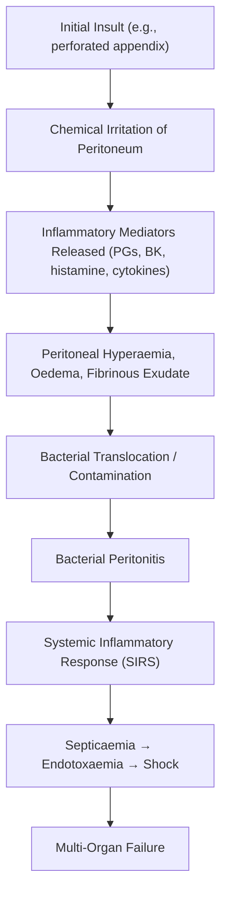

## Definition and Conceptual Framework

### What Is "Abdominal Pain"?

Abdominal pain is not a diagnosis — it is a **symptom** that reflects activation of nociceptive (pain-sensing) pathways originating from abdominal viscera, the parietal peritoneum, or structures that refer pain to the abdomen. Understanding abdominal pain requires understanding the **three fundamental pain mechanisms** at play:

| Pain Type                   | Mechanism                                                                                                                                                                                           | Character                                                      | Localisation                                                                                                                             | Example                                                                                            |
| --------------------------- | --------------------------------------------------------------------------------------------------------------------------------------------------------------------------------------------------- | -------------------------------------------------------------- | ---------------------------------------------------------------------------------------------------------------------------------------- | -------------------------------------------------------------------------------------------------- |
| **Visceral pain**           | Stretch, distension, ischaemia or spasm of hollow viscus walls activating unmyelinated C-fibre afferents travelling with autonomic (sympathetic) nerves → poorly mapped in the somatosensory cortex | Dull, crampy, colicky, poorly localised, midline               | Referred to the **dermatome of embryological origin** (foregut → epigastrium; midgut → periumbilical; hindgut → suprapubic/hypogastrium) | Early appendicitis (periumbilical), biliary colic (epigastric)                                     |
| **Parietal (somatic) pain** | Direct irritation of the **parietal peritoneum** activating myelinated Aδ-fibre afferents in somatic intercostal nerves → well-represented in cortex                                                | Sharp, constant, well-localised, worsened by movement/coughing | Localises to the **exact quadrant** of the inflamed peritoneum                                                                           | Late appendicitis (RLQ), perforated peptic ulcer (epigastric → generalised)                        |
| **Referred pain**           | Visceral afferents converge on the same spinal cord dorsal horn neurons as somatic afferents from a distant dermatome → brain "misinterprets" the source                                            | Felt at a site **distant** from the pathology                  | Predictable dermatomal pattern                                                                                                           | Diaphragmatic irritation → shoulder tip (C3-C5 via phrenic nerve); biliary → right scapula (T6-T9) |

> Why does early appendicitis cause periumbilical pain? Because the appendix is a midgut structure; visceral afferents from the midgut enter the spinal cord at T10 — the same dermatome as the umbilicus. Only when the inflamed appendix irritates the **parietal peritoneum** of the RLQ does pain shift there (somatic pain).

---

## Epidemiology

- **Abdominal pain accounts for ~5-10% of all Emergency Department presentations** worldwide and is the **single most common chief complaint** in EDs [1][2].
- In Hong Kong, acute abdominal pain is among the top 5 presenting complaints in public hospital A&E departments.
- Approximately **30-40%** of patients presenting with acute abdominal pain will have a **non-specific** or self-limiting cause after full workup.
- **Age distribution matters enormously**:
  - Young adults (20-40): appendicitis, ovarian pathology, ectopic pregnancy, peptic ulcer disease
  - Middle-aged (40-60): biliary disease, pancreatitis, diverticulitis, malignancy
  - Elderly ( > 60): mesenteric ischaemia, AAA, malignancy, bowel obstruction, diverticulitis
- **Sex matters**: In women of reproductive age, always rule out **ectopic pregnancy** — it is a life-threatening cause of abdominal pain. Ovarian torsion, ruptured ovarian cyst, and PID are additional considerations [1].
- **_Key Hong Kong epidemiological points_**: **Right-sided diverticular disease** is significantly more common in the Asian population compared to the Western sigmoid predominance, and is frequently confused with acute appendicitis [3].

---

## Anatomy and Function Relevant to Abdominal Pain

### Abdominal Wall and Peritoneum

The abdominal cavity is lined by **peritoneum** — a serous membrane with two layers:

- **Parietal peritoneum**: lines the abdominal wall. Innervated by **somatic nerves** (intercostal and subcostal nerves T7-L1). This is why parietal peritoneal irritation produces **sharp, well-localised** pain.
- **Visceral peritoneum**: covers the abdominal organs. Innervated by **autonomic (visceral) afferents** only — hence **dull, poorly localised** pain.

### Embryological Basis of Visceral Pain Referral

This is the single most important concept for understanding abdominal pain localisation:

| Embryological Division | Structures                                                                                            | Arterial Supply                      | Spinal Segments        | Pain Referral Zone            |
| ---------------------- | ----------------------------------------------------------------------------------------------------- | ------------------------------------ | ---------------------- | ----------------------------- |
| **Foregut**            | Oesophagus (lower), Stomach, Duodenum (D1-D2), Liver, Gallbladder, Pancreas (head), Spleen            | **Coeliac trunk**                    | T5-T9                  | **Epigastrium**               |
| **Midgut**             | Duodenum (D3-D4), Jejunum, Ileum, Caecum, Appendix, Ascending colon, Proximal 2/3 of transverse colon | **Superior mesenteric artery (SMA)** | T8-T12 (primarily T10) | **Periumbilical**             |
| **Hindgut**            | Distal 1/3 of transverse colon, Descending colon, Sigmoid, Rectum (upper)                             | **Inferior mesenteric artery (IMA)** | T11-L1                 | **Suprapubic / Hypogastrium** |

> **Why does cholecystitis cause epigastric pain first?** The gallbladder is a foregut derivative. Visceral afferents travel via the coeliac plexus to T5-T9, so early gallbladder distension is felt as epigastric/RUQ discomfort. Only when the inflamed gallbladder irritates the parietal peritoneum does the pain become sharply localised to the RUQ with Murphy's sign.

### Key Vascular Anatomy (Relevant to Ischaemic Causes)

- **Coeliac trunk** → foregut organs
- **SMA** → midgut; major branches include the ileocolic artery (which gives off the **appendiceal artery** — an **end-artery**, meaning thrombosis leads to appendiceal necrosis) [3]
- **IMA** → hindgut
- **Watershed areas** (vulnerable to ischaemia):
  - **_Griffiths' point_**: **splenic flexure** — junction of SMA and IMA territories via the marginal artery of Drummond [2][4]
  - **_Sudeck's point_**: **rectosigmoid junction** — junction of IMA (left colic/superior rectal arteries) and internal iliac artery (middle rectal artery) territories [2][4]

> These watershed areas explain why ischaemic colitis classically affects the **splenic flexure** and **rectosigmoid junction** — they are the "last meadows" between two irrigation systems.

### Peritoneal Cavity Key Recesses

Knowing the anatomy of peritoneal recesses explains how fluid/pus tracks:

- **Right paracolic gutter** communicates directly with the **right subphrenic and subhepatic (Morrison's pouch)** spaces — a perforated duodenal ulcer leaks gastric content down the right paracolic gutter, causing RIF pain (mimicking appendicitis) and right shoulder tip pain (diaphragmatic irritation → phrenic nerve C3-C5).
- **Left paracolic gutter** is partially obstructed by the **phrenicocolic ligament**, so fluid tracks less freely to the left subphrenic space.
- **Pouch of Douglas** (rectouterine/rectovesical pouch) is the most **dependent part** of the peritoneal cavity in the upright position — fluid/pus accumulates here.

### Nerve Supply Summary

| Structure                                    | Nerve Supply                                | Clinical Relevance                                                         |
| -------------------------------------------- | ------------------------------------------- | -------------------------------------------------------------------------- |
| Parietal peritoneum (anterior)               | Intercostal nerves (T7-T12), subcostal (L1) | Sharp, localised pain; guarding, rigidity, rebound tenderness              |
| Parietal peritoneum (diaphragmatic, central) | **Phrenic nerve (C3-C5)**                   | Referred **shoulder tip pain** (e.g., ruptured spleen, subphrenic abscess) |
| Visceral peritoneum & abdominal viscera      | Autonomic afferents (sympathetic chain)     | Dull, midline, poorly localised pain                                       |

---

## Etiology (Focus on Hong Kong)

The causes of abdominal pain are vast. A structured approach by **anatomical location** and **acuity** is most practical for clinical reasoning.

### By Anatomical Quadrant

This is the classic approach taught at the bedside [1][2]:

**Right Upper Quadrant (RUQ)**

- **_Biliary colic_** — gallstone impacted in cystic duct causing smooth muscle spasm (actually a "false colic" because it is constant, not truly waxing/waning) [2]
- **_Acute cholecystitis_** — cystic duct obstruction → gallbladder distension → secondary inflammation/infection [2][5]
- **_Acute cholangitis_** — CBD obstruction → biliary stasis → ascending infection (Charcot's triad: RUQ pain, fever, jaundice; Reynold's pentad adds hypotension + confusion) [2]
- **_Hepatitis_** — liver capsule (Glisson's capsule) distension from hepatocellular swelling
- **_Liver abscess_** — pyogenic (Klebsiella pneumoniae particularly common in **Hong Kong and Asia**, especially in diabetics) [5] or amoebic (Entamoeba histolytica — consider in travellers)
- **_Ruptured HCC_** — **important in Hong Kong** given high prevalence of hepatitis B; presents with sudden RUQ pain + haemodynamic instability

**Epigastric**

- **_Peptic ulcer disease (PUD)_** — H. pylori (92% DU, 70% GU), NSAIDs, stress ulcers; imbalance between aggressive factors (acid, pepsin) and protective factors (mucus, bicarbonate, prostaglandins, mucosal blood flow) [2][6]
- **_Acute gastritis/duodenitis_**
- **_Acute pancreatitis_** — premature intracellular activation of trypsin → pancreatic autodigestion → NF-κB mediated systemic inflammation [7]
- **_Perforated peptic ulcer (PPU)_** — chemical peritonitis followed by bacterial peritonitis [2]
- **_GERD/Oesophagitis_** — reflux of gastric acid onto squamous oesophageal epithelium [8]
- **_Abdominal aortic aneurysm (AAA)_** — can present with epigastric/back pain ± pulsatile mass [9]

**Left Upper Quadrant (LUQ)**

- Splenic pathology (infarction, rupture, abscess)
- Gastric ulcer (lesser curvature)
- Pancreatitis (tail of pancreas)
- Left lower lobe pneumonia (referred)

**Right Lower Quadrant (RLQ)**

- **_Acute appendicitis_** — luminal obstruction (faecolith, lymphoid hyperplasia, tumour, parasites) → venous congestion → ischaemia → gangrene/perforation [3][10]
- **_Right-sided diverticulitis_** — **significantly more common in Asian populations** including Hong Kong; frequently confused with appendicitis [3][11]
- **_Mesenteric lymphadenitis_** — especially in children/young adults; viral
- **_Crohn's disease_** — terminal ileum is the commonest site
- **_Ectopic pregnancy_** (women of reproductive age — always check β-hCG)
- **_Ovarian torsion / Ruptured ovarian cyst_**
- **_Ureteric colic_** (right distal ureter)

**Right Iliac Fossa (RIF) / Left Iliac Fossa (LIF) overlap**: caecal pathology (right) vs sigmoid pathology (left)

**Left Lower Quadrant (LLQ)**

- **_Sigmoid diverticulitis_** — "left-sided appendicitis" in Western populations (but remember right-sided predominance in Asia) [3][11]
- **_Colorectal carcinoma_** — sigmoid is a common site
- Left ureteric colic
- Ovarian pathology (left)
- IBD (ulcerative colitis — continuous from rectum, often involves sigmoid)

**Suprapubic / Hypogastric**

- **_Urinary retention (AROU)_**
- **_Cystitis / UTI_**
- **_Pelvic inflammatory disease (PID)_**
- **_Degenerating fibroid_**
- **_Endometriosis / Adenomyosis_**

**Diffuse / Non-specific Abdominal Pain** [1]

- **_Gastroenteritis_**
- **_Constipation_**
- **_Intestinal obstruction_** (mechanical or functional)
- **_Generalised peritonitis_** (from any perforated viscus)
- **_Intra-abdominal haemorrhage_**
- **_Medical causes_**: **DKA, hypercalcaemia, herpes zoster, anaphylaxis, porphyria** [1]

<Callout title="Life-Threatening Causes of Acute Abdomen — Must Know" type="error">

**_The following must NEVER be missed_** [1]:

- **Perforated viscus** (e.g., PPU)
- **Ruptured AAA**
- **Acute mesenteric ischaemia**
- **Acute intestinal obstruction** (especially closed-loop with strangulation)
- **Severe acute pancreatitis**
- **Ruptured HCC** (especially relevant in Hong Kong due to hepatitis B)
- **Medical conditions**: DKA, acute MI, Addisonian crisis
- **Obstetric conditions**: ruptured ectopic pregnancy, placental abruption

</Callout>

### By Pathophysiological Mechanism

| Mechanism                    | Examples                                                                                          | Pathophysiology of Pain                                                                                                                                                            |
| ---------------------------- | ------------------------------------------------------------------------------------------------- | ---------------------------------------------------------------------------------------------------------------------------------------------------------------------------------- |
| **Inflammation**             | Appendicitis, cholecystitis, pancreatitis, diverticulitis, PID, IBD                               | Inflammatory mediators (prostaglandins, bradykinin, histamine) sensitise nociceptors → lower pain threshold. Peritoneal inflammation adds parietal component.                      |
| **Obstruction / Distension** | Biliary colic, ureteric colic, intestinal obstruction, urinary retention                          | Smooth muscle spasm or luminal distension stretches wall → activates mechanoreceptors and nociceptive C-fibres in visceral wall                                                    |
| **Ischaemia**                | Mesenteric ischaemia, strangulated hernia, ischaemic colitis, ovarian torsion, testicular torsion | Tissue hypoxia → anaerobic metabolism → lactate + H⁺ accumulation → direct nociceptor activation. Often pain "out of proportion" to examination (classic for mesenteric ischaemia) |
| **Perforation**              | PPU, perforated diverticulum, perforated appendix                                                 | Leakage of irritant contents (acid, bile, faeces) onto peritoneum → intense chemical peritonitis → parietal pain                                                                   |
| **Haemorrhage**              | Ruptured AAA, ruptured ectopic pregnancy, ruptured HCC, splenic rupture                           | Peritoneal irritation by blood + haemodynamic instability                                                                                                                          |
| **Functional**               | IBS, functional dyspepsia                                                                         | Visceral hypersensitivity, altered motility, dysregulated brain-gut axis, serotonergic imbalance [12]                                                                              |

---

## Pathophysiology of Pain Generation (Deep Dive)

### Visceral Nociception

1. **Noxious stimuli** (distension, ischaemia, inflammation, chemical irritation) activate **nociceptors** on visceral afferent nerve endings in the gut wall.
2. These are predominantly **unmyelinated C-fibres** that travel alongside sympathetic nerves through the **coeliac, superior mesenteric, and inferior mesenteric plexuses** → enter the spinal cord via dorsal root ganglia at specific spinal levels (T5-L1).
3. In the dorsal horn, visceral afferents **converge** with somatic afferents from the corresponding dermatome → this is the basis of **referred pain** and the reason visceral pain is poorly localised.
4. Signal ascends via **spinothalamic tract** to thalamus and then somatosensory cortex.

### Visceral Hyperalgesia

In chronic conditions (IBS, functional dyspepsia), there is **peripheral sensitisation** (lowered threshold of visceral nociceptors) and **central sensitisation** (amplification of pain signals in the dorsal horn) → patients feel pain at lower thresholds of distension/stimulation. This explains why IBS patients report pain with normal bowel gas volumes.

### Peritonitis — The Progression

Understanding the pathophysiology of peritonitis is crucial:

- **Peritoneum becomes hyperaemic, oedematous and covered with fibrinous exudate** → fluid shifts into the peritoneal cavity (third-spacing) → **hypovolaemia** [13].
- This leads to **septicaemia, endotoxaemia, shock, hypovolaemia and multi-organ failure** [13].

<Callout title="Classification of Peritonitis" type="idea">

| Type            | Definition                                                                        | Key Points                                                                                                                                                                                                                                                                                                                                                                                                         |
| --------------- | --------------------------------------------------------------------------------- | ------------------------------------------------------------------------------------------------------------------------------------------------------------------------------------------------------------------------------------------------------------------------------------------------------------------------------------------------------------------------------------------------------------------ |
| **_Primary_**   | Ascitic fluid infection **without** a surgically treatable intra-abdominal source | Common in **liver cirrhosis** (SBP); also CAPD peritonitis, TB peritonitis [13]                                                                                                                                                                                                                                                                                                                                    |
| **_Secondary_** | Infection with a surgically treatable intra-abdominal source                      | **Chemical irritation first** (gastric juice, bile, pancreatic juice, urine, blood) **then bacterial** [13]. Causes: **Perforation** (PPU, perforated bowel/diverticulum), **Ischaemia** (bowel ischaemia), **Infection** (appendiceal/perinephric abscess), **Inflammation** (cholecystitis, cholangitis, appendicitis, pancreatitis, diverticulitis), **Others** (incarcerated hernia, anastomotic leakage) [13] |
| **_Tertiary_**  | Opportunistic infection with normally non-pathogenic flora                        | Associated with **prolonged antibiotic use** in persistent intra-abdominal infection; organisms include Staphylococcus, Enterococcus, Candida [13]                                                                                                                                                                                                                                                                 |

</Callout>

---

## Relevant Classification Systems

### By Acuity

- **Acute abdominal pain** ( < 1 week, often < 48 hours): surgical emergency until proven otherwise
- **Chronic abdominal pain** ( > 3 months): more likely functional, malignant, or chronic inflammatory
- **Acute-on-chronic**: e.g., IBD flare, recurrent biliary colic

### By Surgical vs Medical

- **Surgical abdomen**: requires operative intervention (e.g., perforated viscus, strangulated obstruction, ruptured AAA)
- **Medical abdomen**: managed non-operatively (e.g., DKA, acute pancreatitis [initially], acute MI, porphyria)

### Specific Disease Classification Systems

**Acute Appendicitis Severity (Disease Severity Score)** [3]:
| Grade | Description |
|---|---|
| 1 | Inflamed |
| 2 | Gangrenous |
| 3 | Perforated with localised free fluid |
| 4 | Perforated with regional abscess |
| 5 | Perforated with diffuse peritonitis |

**Hinchey Classification (Complicated Diverticulitis)** [11]:
| Stage | Description | Treatment |
|---|---|---|
| I | Pericolic or mesenteric abscess | Conservative: antibiotics, bowel rest, monitoring (outpatient if stable) |
| II | Walled-off pelvic abscess | IV antibiotics + bowel rest + image-guided drainage ± surgery |
| III | Generalised purulent peritonitis | IV antibiotics + bowel rest + **surgery** |
| IV | Generalised faecal peritonitis | IV antibiotics + bowel rest + **surgery** |

**Los Angeles Classification (GERD/Oesophagitis)** [8] — Grades A-D based on extent of mucosal breaks.

---

## Clinical Features

### Approach to History Taking

The history is the **most powerful diagnostic tool** in abdominal pain. Use the **SOCRATES** framework but expand it with system-specific questions [1][2]:

**S — Site**: Which quadrant? Localised or diffuse?

- _Localised → somatic/parietal pain (think peritoneal irritation)_
- _Diffuse/midline → visceral pain (think hollow organ distension/ischaemia)_
- **_Any shifting_**: e.g., appendicitis shifts from periumbilical to RLQ; pancreatitis epigastric to back [2]

**O — Onset**: Sudden (seconds) → perforation, rupture, torsion, vascular event. Gradual (hours) → inflammation, obstruction.

**C — Character**:

- **_Colicky_** (waxing and waning) → obstruction of a hollow tube (bowel, ureter, bile duct) — because smooth muscle contracts in peristaltic waves against the obstruction
- **_Constant_** → inflammation (appendicitis, cholecystitis), ischaemia, or peritonitis
- **_Burning_** → mucosal inflammation (PUD, GERD)

**R — Radiation** [2]:
| Radiation Pattern | Suggests |
|---|---|
| **_Back_** | Pancreatitis, AAA, aortic dissection, posterior peptic ulcer |
| **_Shoulder tip_** | Haemoperitoneum (ruptured ectopic, splenic rupture) — diaphragmatic irritation → phrenic nerve C3-C5 |
| **_Right scapula / Scapular spine_** | Gallbladder disease (T6-T9 dermatomal referred pain) |
| **_Loin to groin_** | Renal/ureteric colic |
| **_Testicles to flank_** | Testicular torsion |
| **_Flanks_** | Pyelonephritis, retroperitoneal haematoma, AAA |

**A — Associations**: System-specific screening [1][2]:

- **_GI_**: nausea/vomiting, bowel habit changes, melaena/haematemesis, PR bleeding
- **_Hepatobiliary/Pancreatic_**: jaundice, tea-coloured urine, pale stools
- **_Genitourinary_**: dysuria, haematuria, frothy urine
- **_Gynaecological_**: vaginal discharge, PV bleeding, **LMP**, possibility of pregnancy
- **_Constitutional_**: fever, weight loss, night sweats, anorexia

**T — Time course** [2]:

- **_Constant_**: ulcers, peritonitis
- **_Colicky with pain-free intervals_**: intestinal, renal, biliary colic
- **_Steady increase then constant_**: biliary colic ("false colic"), pancreatitis
- **_Progressive_**: appendicitis, diverticulitis
- **_Catastrophic onset_**: ruptured AAA, perforated viscus

**E — Exacerbating / Relieving factors** [1][2]:

- **_Peritonitis_**: ↑ by movement → patient lies still (PPU classic: patient motionless on bed)
- **_Colic_**: often ↓ by movement (patient writhes around)
- **_Food_**: GU pain exacerbated by eating; DU pain relieved by eating (food buffers acid in duodenum but stimulates acid secretion in stomach) [2]
- **_Fatty meals_**: exacerbate biliary colic and pancreatitis (CCK release → gallbladder contraction)
- **_Position_**: GERD, pancreatitis, and pancreatic cancer relieved by leaning forward (reduces pressure on retroperitoneal pancreas); PPU worsened by movement [1]
- **_Defecation_**: IBS pain characteristically associated with and relieved by defecation [12]
- **_Vomiting_**: gastric ulcer pain ↓ by vomiting (decompresses the stomach); intestinal obstruction pain ↓ by vomiting (decompresses proximal dilated bowel) [2]

**S — Severity**: Use numerical rating scale; "worst pain of life" → think perforation, torsion, ruptured AAA, renal colic

### Drug History [1]

**_Always ask about:_**

- **_NSAIDs_** (peptic ulcer, NSAID gastropathy, diverticular complications, colitis)
- **_Aspirin_** (mucosal ulceration)
- **_Steroids_** (mask peritoneal signs, increase perforation risk)
- **_Bisphosphonates_** (oesophageal ulceration)
- **_Opiates_** (constipation, paralytic ileus)
- **_Anticholinergics_** (constipation, paralytic ileus)
- **_Anticoagulants_** (retroperitoneal haematoma, intramural haematoma)

### Red Flags in Abdominal Pain [1]

> **_Red flags that mandate urgent investigation:_**
>
> - **Age > 55 with new-onset dyspepsia** (risk of gastric/oesophageal malignancy)
> - **Family history of upper GI cancer**
> - **Significant unintentional weight loss**
> - **Dysphagia / early satiety** (obstruction or malignancy)
> - **GI bleeding**: coffee-ground vomiting, fresh haematemesis, melaena, PR bleeding
> - **Unexplained iron-deficiency anaemia**
> - **Persistent vomiting**
> - **Palpable mass or lymphadenopathy**
> - **Jaundice**

---

### Symptoms with Pathophysiological Basis

#### 1. Pain Characteristics by Condition

**Acute Appendicitis** [3][10]:

- **_Classical course_**: periumbilical pain (visceral, midgut → T10) → **low-grade fever**, **vomiting**, **anorexia** (note: in appendicitis, pain precedes vomiting; in gastroenteritis, vomiting precedes pain — a useful differentiator) → pain **migrates to RLQ** after 12-24h (parietal peritoneum of RLQ becomes involved → somatic pain)
- **Why anorexia?** Vagal afferents from the inflamed appendix stimulate the vomiting centre and suppress appetite via the nucleus tractus solitarius.
- Peak incidence: **20s-30s**, M:F = 1.4:1 [3]
- Pelvic appendix may cause **suprapubic pain** and **diarrhoea** (irritation of rectum/bladder) — can be confusing [3]
- Retrocaecal appendix may cause **flank/back pain** and have **minimal anterior abdominal signs** (because it is shielded from the anterior parietal peritoneum by the caecum) [3]

**Biliary Colic** [2]:

- Risk factors: **_Fat, Female, Fertile, Forty_** (cholesterol gallstones)
- **_Intense, dull discomfort in RUQ or epigastrium_** — actually a misnomer ("colic") because the pain is **constant** (smooth muscle in sustained spasm), though it has excruciating **exacerbations** [2]
- **_Usually lasts ≥ 30 minutes, plateaus within 1 hour, resolves ≤ 6 hours_** if uncomplicated [2]
- Associated with **nausea, vomiting, diaphoresis** (vagal response) ± jaundice (if CBD stone)
- **Why "colic" is actually constant**: the gallbladder contracts against an impacted stone; unlike intestinal peristalsis (which has rhythmic contractions with rest periods), gallbladder contraction is sustained tetanic spasm.

**Acute Cholecystitis** [2][5]:

- **_Sudden, prolonged RUQ or epigastric pain_** > 4-6 hours (distinguishes from biliary colic which resolves < 6h)
- May radiate to **back or tip of right scapula** (T6-T9 dermatomal referral)
- **_Exacerbated by moving and breathing_** (parietal peritoneal irritation)
- Associated with **fever** (secondary bacterial infection of obstructed, distended gallbladder)
- **Murphy's sign**: arrest of inspiration on palpation of RUQ — the inflamed gallbladder descends with the diaphragm during inspiration and contacts the examiner's fingers → pain → patient stops breathing in.

**Acute Cholangitis** [2]:

- **_Charcot's triad_**: RUQ pain + fever (intermittent with rigors) + obstructive jaundice
- **_Reynold's pentad_**: adds **hypotension** + **mental obtundation** (indicating septic shock with biliary sepsis)
- Pathophysiology: CBD obstruction (stone, stricture, tumour) → biliary stasis → ascending bacterial infection → bacteraemia → sepsis

**Peptic Ulcer Disease** [2][6]:

- **_Gastric ulcer_**: pain **immediately after meal** → patients are often **afraid of eating** → weight loss. Pain ↓ by vomiting (decompresses stomach). Why? Food stimulates acid secretion which bathes the ulcer.
- **_Duodenal ulcer_**: pain **2h after meal** (when gastric contents including acid enter the duodenum), **↓ by eating** (food buffers acid in the duodenum → patients often have good appetite). Classic "hunger pain" or nocturnal pain (no food to buffer overnight acid).
- Drug history: **_ask about ANY drug ingested — especially aspirin, NSAIDs, alendronate_** [2]

**Perforated Peptic Ulcer (PPU)** [2]:

- **_Sudden severe and constant epigastric pain_** that quickly reaches maximum intensity and remains severe for hours
- Gradually **extends to the whole abdomen** (as gastric acid and duodenal contents spread throughout the peritoneal cavity)
- **_↑ by movement_** → patient **lies completely still** on bed (parietal peritoneal irritation)
- **Important**: pain and guarding may **_decrease after 4-6h_** as the acid gets diluted — **_but the peritonitis is still progressing!_** This is a classic trap [2].
- History of previous dyspepsia, steroids, NSAIDs

**Acute Pancreatitis** [7]:

- **_Epigastric pain_** (can be RUQ or rarely LUQ) — **_radiates to the back_** (pancreas is retroperitoneal; pain transmitted through the retroperitoneum)
- **_Rapid onset_** (gallstone-related) or **_less abrupt_** (alcohol-related)
- **_Severe, persistent_** for hours to days
- **_Relieved by sitting up or leaning forward_** (reduces tension on the retroperitoneal pancreas by allowing it to fall away from the posterior abdominal wall)
- Associated with **_nausea and vomiting_** (visceral autonomic response + paralytic ileus)
- **_Dyspnoea_** may occur due to diaphragmatic inflammation, pleural effusions (especially left-sided), or ARDS [7]

**Intestinal Obstruction** [14]:

- **_Colicky abdominal pain_** (peristalsis against obstruction causes rhythmic cramping — spasm → partial relaxation → spasm)
- **_Abdominal distension_** (proximal bowel dilates with gas and fluid)
- **_Vomiting_** (early in proximal/SBO; late in distal/LBO). Faeculent vomiting in late LBO (bacterial overgrowth in stagnant intestinal contents).
- **_Absolute constipation_** (obstipation — no passage of faeces OR flatus) — indicates complete obstruction
- **_High-pitched tinkling bowel sounds_** (proximal hyperperistalsis trying to overcome obstruction)
- Common causes: **adhesions** (post-surgical — #1 cause of SBO), **hernias** (#2 cause), **malignancy** (#1 cause of LBO), **volvulus**

**Mesenteric Ischaemia** [4]:

- **_Pain out of proportion to physical findings_** — the hallmark! (early visceral ischaemia activates nociceptors intensely but there is minimal peritoneal inflammation initially)
- **_Sudden onset_** (embolic) or **_more gradual_** (thrombotic on pre-existing atherosclerosis)
- Associated with **AF** (source of emboli), **peripheral vascular disease**, **cardiac disease** [4]
- Late features: **bloody diarrhoea**, **peritonitis**, **metabolic acidosis**, **elevated lactate** — indicate bowel infarction (irreversible)

**Ischaemic Colitis** [4][15]:

- **_Sudden onset cramping abdominal pain_** — milder and more lateral than mesenteric ischaemia
- **_Mild-to-moderate rectal bleeding within 24h_** of pain onset
- Typically in **_elderly women ( > 60)_**
- Usually **_non-occlusive_** (transient low-flow states) affecting **_watershed areas_** [4][15]

**Acute Diverticulitis** [3][11]:

- **_Clinical triad_**: **lower abdominal pain + fever + leucocytosis** [11]
- Pathophysiology: obstruction of diverticulum by faecolith → stasis and bacterial overgrowth → inflammation [11]
- In Western populations: LLQ pain (sigmoid diverticulitis)
- **_In Asian populations (including Hong Kong)_**: **RLQ pain** (right-sided diverticulosis) — **_frequently confused with acute appendicitis_** [3][11]
- Mean age of diagnosis: **63 years** [11]

**Inflammatory Bowel Disease — Ulcerative Colitis** [16]:

- **_Abdominal pain_** — typically LLQ/left-sided (sigmoid and rectal involvement)
- **_Bloody diarrhoea_** — shallow mucosal ulceration → bleeding
- **_Urgency, tenesmus_** — rectal inflammation
- Occurs between 30-70s, no gender predominance [16]
- Protective factors: prior appendicectomy, smoking [16]

**Volvulus** [17]:

- **Sigmoid volvulus**: older males (mean age 70), constipation history, "bent inner-tube" sign on AXR
- **Caecal volvulus**: younger females (mean age 33-53), congenital failure of right colon fixation
- **_Acute onset abdominal pain + distension + obstipation_**

**IBS** [12]:

- **_Recurrent abdominal pain with variable intensity_**
- **_Cramping/colicky pain ± bloating, flatulence, belching_**
- **_Characteristically associated with defecation_** (relieved or worsened)
- **_↑ by emotional stress, meals, and throughout the day_**
- **No red flag features** (no weight loss, no bleeding, no nocturnal symptoms)
- Epidemiology: ~15% in US, up to 25% in East Asia, 3.7% in HK (Rome II criteria); more common in younger ( < 50y) and females [12]

#### 2. Gynaecological Causes — Special Considerations [1]

**_The pain should be linked with the menstrual history, coitus and the possibility of an early pregnancy_** [1].

- **IUCD** → increases risk of salpingitis, ectopic pregnancy [1]
- **Infertility history** → think endometriosis, salpingitis [1]
- **Tubal surgery** → ectopic pregnancy [1]
- For **_recurrent and chronic pain_**, instruct the patient to keep a **diary over two menstrual cycles** [1]

| Condition                 | Pain Character                                                                                                   | Pathophysiology                                                                             |
| ------------------------- | ---------------------------------------------------------------------------------------------------------------- | ------------------------------------------------------------------------------------------- |
| **Ectopic pregnancy**     | Sudden unilateral lower abdominal pain ± vaginal bleeding ± shoulder tip pain (if ruptured with haemoperitoneum) | Implantation in fallopian tube → tubal distension → rupture → haemoperitoneum               |
| **Ruptured ovarian cyst** | Sudden onset unilateral lower abdominal pain                                                                     | Cyst rupture → peritoneal irritation by cyst contents/blood                                 |
| **Ovarian torsion**       | Severe, sudden, unilateral lower abdominal pain ± nausea/vomiting                                                | Torsion of ovarian pedicle → venous then arterial occlusion → ischaemia                     |
| **PID**                   | Bilateral lower abdominal pain, fever, vaginal discharge                                                         | Ascending infection from cervix → endometritis → salpingitis → tubo-ovarian abscess         |
| **Endometriosis**         | Cyclical pain (dysmenorrhoea), dyspareunia, dyschezia                                                            | Ectopic endometrial tissue responds to hormonal cycling → bleeding, inflammation, adhesions |
| **Degenerating fibroid**  | Acute lower abdominal pain ± fever                                                                               | Fibroid outgrows its blood supply → central necrosis ("red degeneration" in pregnancy)      |

---

### Signs with Pathophysiological Basis

#### General Inspection

- **Lying perfectly still** → peritonitis (any movement irritates inflamed parietal peritoneum)
- **Writhing, unable to get comfortable** → colic (ureteric, biliary, intestinal — visceral pain without peritoneal irritation)
- **Tachycardia, hypotension** → hypovolaemia (haemorrhage, third-spacing in obstruction/pancreatitis/peritonitis), sepsis
- **Shallow respiration** → peritonitis (patient avoids diaphragmatic excursion to minimise peritoneal movement) [2]
- **Jaundice** → biliary/hepatic pathology
- **Pallor** → anaemia from chronic/acute GI bleeding

#### Abdominal Inspection

- **Distension** → obstruction (gas + fluid proximal to obstruction), ascites, ileus
- **Visible peristalsis** → intestinal obstruction (hypertrophied bowel contracting against obstruction)
- **Surgical scars** → adhesive obstruction, hernia
- **Hernia orifices** → always examine! Incarcerated hernia is a common missed cause of obstruction [14]

#### Palpation

- **Guarding**: voluntary contraction of abdominal wall muscles in response to palpation — indicates underlying **peritoneal inflammation**. Why? The patient (and reflexly the nervous system) contracts the muscles to splint and protect the inflamed area.
- **Rigidity (involuntary guarding / "board-like rigidity")**: reflex, involuntary spasm of abdominal wall muscles. Indicates **severe peritonitis** (e.g., generalised peritonitis from PPU) [2]. The afferent limb is via peritoneal somatic nerves → reflex arc at spinal cord level → efferent limb via motor nerves to rectus abdominis.
- **Rebound tenderness**: pain on sudden release of pressure (as the parietal peritoneum snaps back to its original position → stretches inflamed peritoneum). Indicates **peritonitis**.
- **Murphy's sign**: arrest of inspiration during RUQ palpation → inflamed gallbladder descends on inspiration and contacts examiner's hand → pain → patient catches breath. **Positive in acute cholecystitis** [2].
- **McBurney's point tenderness**: maximal tenderness at **_1/3 distance from ASIS to umbilicus_** → overlies the base of the appendix [3][10].
- **Rovsing's sign**: RLQ pain upon palpation of LLQ → displacement of peritoneal gas/fluid transmits pressure to the inflamed RLQ peritoneum [10].
- **Psoas sign**: increased RLQ pain upon extending the hip against resistance → inflamed retrocaecal appendix overlying the psoas muscle is stretched [10].
- **Obturator sign**: pain on internal rotation of flexed right hip → inflamed pelvic appendix irritates the obturator internus muscle.
- **Pulsatile abdominal mass** → AAA [9].

#### Percussion

- **Loss of liver dullness** → **pneumoperitoneum** (free gas from perforated viscus replaces the normally dull liver → tympanic note) [2].
- **Shifting dullness** → ascites
- **Tympany** → distended gas-filled bowel (obstruction, ileus)

#### Auscultation

- **High-pitched tinkling bowel sounds** → mechanical obstruction (bowel trying to overcome obstruction)
- **Absent bowel sounds** → paralytic ileus or late/severe peritonitis (bowel has "given up")
- **Borborygmi** → increased gut motility (gastroenteritis, early obstruction)

#### Per Rectal Examination

- **_Always_** perform in acute abdomen
- **Empty rectum** → obstruction proximal to rectum
- **Melaena** → upper GI bleeding
- **Blood on glove** → lower GI pathology (malignancy, IBD, ischaemic colitis)
- **Tenderness in Pouch of Douglas** → pelvic abscess, collection
- **Boggy mass** → pelvic abscess

#### Per Vaginal Examination (Women) [1]

- **_Speculum (preferably bivalve type) and bimanual palpation_** [1]
- **Cervical excitation (chandelier sign)** → ectopic pregnancy, PID
- **Adnexal mass** → ovarian cyst, ectopic pregnancy, tubo-ovarian abscess
- **Uterine tenderness** → endometritis, PID

<Callout title="Key Examination Approach" type="idea">

**_In the assessment of abdominal pain in women_**, use the traditional abdominal and pelvic examination to identify the site of tenderness, rebound tenderness, and any abdominal or pelvic masses. The pelvis should be examined by **speculum** and **bimanual palpation**. Proper assessment can be difficult if the patient cannot relax, if there is abdominal scarring or obesity, or if extreme tenderness is present — so a **_gentle, caring vaginal examination with appropriate explanation and reassurance_** is critical, especially in the younger and apprehensive patient [1].

</Callout>

### Key Investigations (Brief, for context — detailed workup in Part 2)

As mentioned in the lecture slides [1]:

- **FBE / ESR / CRP**
- **Urine MC&S**
- **Chlamydia PCR** (in women with lower abdominal pain / PID suspected)
- **β-hCG** (all women of reproductive age)
- Additional based on clinical suspicion: LFTs, amylase/lipase, lactate, blood gas, imaging (AXR, erect CXR, USG, CT)

### Masquerades Checklist [1]

**_Always consider non-abdominal causes of abdominal pain_** [1]:

- **_Depression_** (somatic presentation of depression can present as chronic abdominal pain)
- **_Drugs_** (NSAIDs, opiates, etc.)
- **_Spinal dysfunction_** (referred pain from thoracolumbar spine to abdomen — T7-L1 dermatomal distribution)
- **_UTI_** (lower abdominal/suprapubic pain)
- **_"Is the patient trying to tell me something?"_** — **_can be very relevant. Consider various problems and sexual dysfunction_** [1].

<Callout title="Nerve Entrapment and Referred Pain to Pelvis" type="idea">

The lecture slides specifically mention **_nerve entrapment_** as a cause of pelvic pain, and **_referred pain to the pelvis_** from: **appendicitis, cholecystitis, diverticulitis, UTI** [1]. Don't forget these — a patient with "pelvic pain" may actually have appendicitis!

</Callout>

---

## Summary of Pain Patterns by Condition

| Condition            | Site                     | Character                       | Radiation              | Timing                  | Exacerbating/Relieving               | Key Associated Features                          |
| -------------------- | ------------------------ | ------------------------------- | ---------------------- | ----------------------- | ------------------------------------ | ------------------------------------------------ |
| Appendicitis         | Periumbilical → RLQ      | Dull → sharp                    | None typical           | Progressive over 12-24h | ↑ movement                           | Anorexia, low-grade fever, vomiting (after pain) |
| Biliary colic        | RUQ/epigastric           | Constant, intense (false colic) | Right scapula          | ≥30min, &lt;6h             | ↑ fatty meals                        | N/V, diaphoresis                                 |
| Cholecystitis        | RUQ                      | Constant, severe                | Back, right scapula    | >4-6h                   | ↑ movement, breathing                | Fever, Murphy's sign                             |
| Cholangitis          | RUQ                      | Constant                        | —                      | Persistent              | —                                    | Charcot's triad/Reynold's pentad                 |
| PPU                  | Epigastric → generalised | Sudden, severe, constant        | —                      | Maximal immediately     | ↑ movement                           | Board-like rigidity, ↓liver dullness             |
| Gastric ulcer        | Epigastric               | Burning                         | —                      | With meals              | ↑ eating, ↓ vomiting                 | Weight loss, afraid of eating                    |
| Duodenal ulcer       | Epigastric               | Burning, "hunger pain"          | Back (posterior ulcer) | 2h post-meal, nocturnal | ↓ eating                             | Good appetite                                    |
| Pancreatitis         | Epigastric               | Severe, constant                | Back                   | Hours to days           | ↓ leaning forward                    | N/V, dyspnoea                                    |
| SBO                  | Periumbilical            | Colicky                         | —                      | Intermittent            | ↓ vomiting                           | Distension, vomiting, constipation               |
| LBO                  | Lower abdomen            | Colicky                         | —                      | Intermittent            | —                                    | Distension ++, late vomiting                     |
| Mesenteric ischaemia | Diffuse/periumbilical    | Severe, constant                | —                      | Sudden or subacute      | —                                    | Pain >> signs, AF history, lactic acidosis       |
| Diverticulitis       | LLQ (West) / RLQ (Asia)  | Constant                        | —                      | Progressive             | —                                    | Fever, leucocytosis                              |
| Renal colic          | Loin → groin             | Colicky, severe                 | Loin to groin          | Paroxysmal              | ↓ movement is NOT helpful (writhing) | Haematuria, N/V                                  |
| AAA rupture          | Abdominal/back           | Severe, sudden                  | Back                   | Catastrophic            | —                                    | Hypotension, pulsatile mass                      |

---

<Callout title="High Yield Summary">

1. **Three pain types**: Visceral (dull, midline, autonomic afferents), Parietal/Somatic (sharp, localised, somatic nerves), Referred (distant site, convergence in dorsal horn).

2. **Embryological pain referral**: Foregut → epigastrium; Midgut → periumbilical; Hindgut → suprapubic.

3. **Life-threatening causes NEVER to miss**: PPU, ruptured AAA, mesenteric ischaemia, strangulated obstruction, severe pancreatitis, ruptured HCC/ectopic, DKA, acute MI, Addisonian crisis.

4. **Appendicitis**: Midgut visceral pain (periumbilical T10) → shifts to RLQ (parietal peritoneal irritation). Appendiceal artery is an END-ARTERY → thrombosis = necrosis. Peak 20s-30s, M > F.

5. **Biliary colic**: "False colic" — actually constant. ≥30min, &lt;6h. Risk factors: Fat, Female, Fertile, Forty.

6. **PPU**: Sudden maximal epigastric pain → generalised. Board-like rigidity. ↓Liver dullness (pneumoperitoneum). Pain may transiently ↓ after 4-6h as acid dilutes — BUT peritonitis is still progressing!

7. **Pancreatitis**: Epigastric → back. Relieved by leaning forward. Autodigestion by premature trypsin activation.

8. **Mesenteric ischaemia**: Pain out of proportion to findings. Think AF, atherosclerosis. Lactate↑.

9. **Asian diverticular disease**: Right-sided predominance; confused with appendicitis.

10. **Peritonitis classification**: Primary (SBP in cirrhosis), Secondary (surgically treatable), Tertiary (opportunistic after prolonged antibiotics).

11. **Watershed areas**: Griffiths' point (splenic flexure), Sudeck's point (rectosigmoid junction).

12. **Women of reproductive age**: ALWAYS check β-hCG. Link pain with menstrual history, coitus, pregnancy possibility. Examine speculum + bimanual.

13. **Masquerades**: Depression, Drugs, Spinal dysfunction (referred), UTI. "Is the patient trying to tell me something?"

</Callout>

---

<ActiveRecallQuiz
  title="Active Recall - Abdominal Pain (Definition to Clinical Features)"
  items={[
    {
      question:
        "A 25-year-old male presents with periumbilical pain that has migrated to the RLQ over 12 hours. Explain the pathophysiological basis for this pain migration in acute appendicitis.",
      markscheme:
        "Appendix is midgut structure. Early visceral pain travels via sympathetic afferents to T10 (periumbilical dermatome). As inflammation progresses to involve parietal peritoneum of RLQ, somatic Adelta-fibres in intercostal nerves produce sharp, well-localised RLQ pain. This is the transition from visceral to parietal pain.",
    },
    {
      question:
        "Name the two watershed areas of the colon vulnerable to ischaemic colitis, and explain why they are vulnerable.",
      markscheme:
        "1. Griffiths point at splenic flexure (junction of SMA and IMA territories via marginal artery of Drummond). 2. Sudeck point at rectosigmoid junction (junction of IMA left colic/superior rectal artery and internal iliac middle rectal artery). These are watershed zones receiving terminal branches from two different arterial supplies with limited collateralisation, making them vulnerable during systemic hypoperfusion.",
    },
    {
      question:
        "A patient with PPU initially has severe epigastric pain that seems to improve after 4-6 hours. Should you be reassured? Explain why or why not.",
      markscheme:
        "No. The apparent improvement occurs because gastric acid becomes diluted by peritoneal fluid. However, bacterial peritonitis is still progressing. This is a classic trap — the peritonitis is worsening despite temporary pain relief. Continued monitoring and surgical intervention remain necessary.",
    },
    {
      question:
        "Classify peritonitis into three types and give one example and one defining feature for each.",
      markscheme:
        "Primary: ascitic fluid infection without surgically treatable source (e.g., SBP in liver cirrhosis). Secondary: infection with surgically treatable source preceded by chemical irritation then bacterial infection (e.g., PPU, perforated appendix). Tertiary: opportunistic infection with non-pathogenic flora after prolonged antibiotics (e.g., Candida, Enterococcus).",
    },
    {
      question:
        "In Hong Kong, right-sided diverticular disease is more common than in Western populations. Why is this clinically important?",
      markscheme:
        "Right-sided diverticulitis presents with RLQ pain, fever, and leucocytosis — the same triad as acute appendicitis. This makes it a common mimicker and important differential diagnosis in Asian patients presenting with RLQ pain. Misdiagnosis can lead to unnecessary appendicectomy or missed diverticular complications.",
    },
    {
      question:
        "List at least four masquerade causes of abdominal pain that are non-abdominal in origin.",
      markscheme:
        "Depression (somatic presentation), Drugs (NSAIDs, opiates), Spinal dysfunction (referred pain from T7-L1), UTI, lower lobe pneumonia, acute MI (inferior), DKA, herpes zoster, porphyria. Need at least 4.",
    },
  ]}
/>

## References

[1] Lecture slides: murtagh merge.pdf (Abdominal pain in women section)
[2] Senior notes: Ryan Ho Fundamentals.pdf (p268-276, Causes of Upper Abdominal Pain, Abdominal Pain History)
[3] Senior notes: felixlai.md (Acute appendicitis section)
[4] Senior notes: felixlai.md (Mesenteric ischaemia / ischaemic colitis section)
[5] Senior notes: felixlai.md (Cholecystitis, Liver abscess sections)
[6] Senior notes: Ryan Ho GI.pdf (p76, Peptic Ulcer Disease)
[7] Senior notes: felixlai.md (Acute pancreatitis section)
[8] Senior notes: felixlai.md (GERD section)
[9] Senior notes: Ryan Ho Cardiology.pdf (p222, Abdominal Aortic Aneurysms)
[10] Senior notes: maxim.md (Acute appendicitis section)
[11] Senior notes: felixlai.md (Diverticular disease section); maxim.md (Diverticular disease section)
[12] Senior notes: Ryan Ho GI.pdf (p118, Irritable Bowel Syndrome)
[13] Senior notes: felixlai.md (Peritonitis section)
[14] Senior notes: felixlai.md (Bowel obstruction section)
[15] Senior notes: Ryan Ho GI.pdf (p146, Ischaemic Colitis)
[16] Senior notes: felixlai.md (Ulcerative colitis section)
[17] Senior notes: felixlai.md (Volvulus section)
