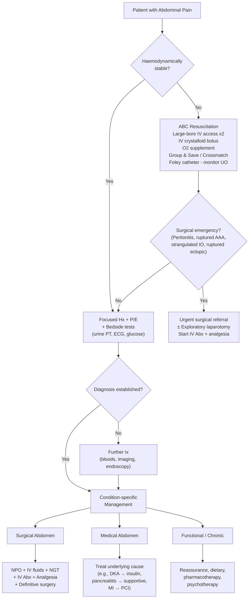
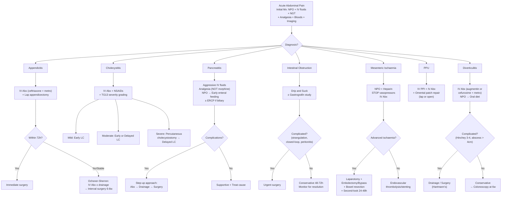

## Management of Abdominal Pain

### Overarching Principles

The management of abdominal pain follows a universal framework before branching into condition-specific treatment. Think of it as a **pyramid**: stabilise the patient first, then diagnose, then treat the specific condition.

---

### Initial Management — Universal for ALL Acute Abdominal Pain

This is the **"Schema for all surgical Mx"** framework [2]:

> **D**iet — **A**ctivity — **V**itals — **I**nvestigations — **D**rugs (mnemonic: **DAVID**)

| Component | Detail | Rationale |
|---|---|---|
| ***Diet: NPO*** [2][25] | All patients with acute abdominal pain should be kept nil by mouth initially | Prevents aspiration during potential anaesthesia induction; reduces bowel stimulation; prepares for possible surgery |
| ***IV Fluids*** [2][25] | Secure IV access (large bore if resuscitation required). Routine: ***2D1S Q8h*** (2 bags dextrose 5% : 1 bag NS 0.9%, one 500 mL bag every 8 hours ≈ 1.5 L/day) [2]. If clinically dehydrated: ***500 mL bolus crystalloid then reassess by UO*** [2]. Replace losses: vomiting (hypochloraemic hypokalaemic metabolic alkalosis), third-spacing (peritonitis, IO, pancreatitis) | Restores intravascular volume depleted by vomiting, third-space losses, and reduced oral intake. Crystalloids (NS, Ringer's lactate, Hartmann's) are first-line [25] |
| ***NG tube*** | Placed on free drainage with 4-hourly aspiration or continuous suction [25][26] | Decompresses proximal bowel (IO); reduces aspiration risk during anaesthesia; achieves "gastric rest" in pancreatitis. Functions: **decompression + prevention of aspiration** [25] |
| ***Activity*** | Bed rest; haemodynamic monitoring | Minimise metabolic demand; allow serial examination |
| ***Vitals*** | BP/Pulse, Temperature, Fluid balance (Foley catheter → ***keep UO > 0.5 mL/kg/h*** [2]), ± CVP if severe [2] | Early detection of deterioration; guides fluid resuscitation |
| ***Investigations*** | Serial abdominal examination to assess changes [2]; bloods and imaging as per diagnostic algorithm | Ongoing reassessment is critical — a "benign" abdomen can evolve into peritonitis |
| ***Drugs*** | **IV broad-spectrum antibiotics** if infective aetiology [2]; **Analgesics** as indicated [2] | Treat infection; control pain (see below) |

<Callout title="Analgesia in Acute Abdominal Pain" type="idea">

There is an old surgical myth that giving analgesia "masks" peritoneal signs and impairs diagnosis. This has been **comprehensively debunked**. ***Opioid analgesia is usually NOT associated with decreased diagnostic accuracy*** [2]. Withholding pain relief is inhumane and counterproductive — a patient in severe pain cannot cooperate with examination. Give analgesia early and reassess.

**Analgesic choices**:
- **Paracetamol IV** — safe first-line; no GI effects
- **NSAIDs** (e.g., ketorolac, diclofenac) — excellent for renal colic (1st line for ureteric stones [27]) and biliary colic; ***avoid in pancreatitis*** (can worsen and cause renal failure) [22] and PUD
- **Opioids** (fentanyl, tramadol, morphine, pethidine) — for severe pain; ***in pancreatitis, prefer fentanyl/hydromorphone/tramadol/pethidine; avoid morphine*** because morphine increases sphincter of Oddi pressure [22]

</Callout>

---

### Condition-Specific Management

Below is detailed management for the major causes of abdominal pain, organised by the conditions most likely to appear in exams.

---

#### 1. Acute Appendicitis [3][10][23]

**General principles**: ***Resuscitation, NPO, IV fluids, analgesics*** [10]

**Antibiotics** [10][23]:
- ***Prophylactic IV antibiotics*** with ***anaerobic coverage*** [10]
- Regimen: ***IV ceftriaxone + metronidazole*** [10] (alternatives: cefoxitin/cefotetan/cefazolin 2g + metronidazole 500mg IV [23])
- ***Non-complicated: continue until 24h post-op*** [10]
- ***Complicated (e.g., abscess, phlegmon): continue 3-7 days post-op*** [10]

**Definitive treatment**: ***Laparoscopic appendicectomy (first line!)*** [10]

| Scenario | Approach | Details |
|---|---|---|
| ***Present within 72h and fit for surgery*** [10] | ***Immediate surgery*** | ***Laparoscopic preferred*** (↓infection risk, ↓post-op pain, ↓hospital stay) [10][23]. ***Open*** if gross sepsis [10]. A short delay of < 12-24h for preparation is NOT associated with ↑risk of perforation [23]. |
| ***Present > 72h and stable*** [10] | ***Interval surgery (Ochsner-Sherren regimen)*** | By > 72h, inflammation has often become walled-off (appendiceal mass/phlegmon). ***IV antibiotics*** (~90% success rate [10]) ± ***image-guided drainage of abscess***. ***Laparoscopic appendicectomy 6-8 weeks later***. ***Colonoscopy if > 40 years old to exclude CA*** [10][23]. |
| ***Complicated and unstable*** | ***Urgent surgery*** | Consider open approach if gross sepsis [10] |

**Non-operative (conservative) management** [10]:
- Can be considered if ***uncomplicated*** (no perforation/abscess) and ***not fit for surgery***
- Bowel rest + IV ceftriaxone + metronidazole
- Compared to surgery: shorter disability but ***risk of complications and recurrence*** (recurrence rate: ***30% at 3 months, 40% at 1 year, 50% at 3 years***) [10]
- The CODA trial (2020) showed 10-day antibiotics non-inferior to appendicectomy, but 30% chance of appendicectomy within 90 days [10]

**Operative details** [10][23]:
- ***Positioning***: supine ± Trendelenburg and right side up (allows small bowel to fall away from operative field) [10]
- ***Open incisions***:
  - ***Lanz*** (more popular): transverse incision ~2 cm below umbilicus, centred on mid-clavicular line — follows Langer's lines, more cosmetically pleasing [10]
  - ***Gridiron***: perpendicular to line joining ASIS to umbilicus at McBurney's point [10]
  - ***Rutherford-Morrison***: extends Gridiron obliquely upwards and laterally (for paracaecal/retrocaecal appendix) [10]
- ***Unexpected findings*** [23]: Normal appendix → still remove (↓diagnostic confusion), exclude terminal ileitis, Meckel's, tubo-ovarian pathology. Appendicular tumour: carcinoid < 2 cm → simple appendicectomy; > 2 cm → R hemicolectomy. Adenocarcinoma → R hemicolectomy [23].

**Risks (for consent)** [10]:
- *Immediate*: conversion to open, normal appendix (still removed), malignancy requiring R hemicolectomy ± stoma, injury to surrounding organs, bleeding
- *Early*: wound infection (5-10%), intra-abdominal/pelvic abscess (spiking fever), post-op ileus
- *Late*: incisional hernia, adhesions, recurrent/stump appendicitis

---

#### 2. Acute Cholecystitis [5][22]

**Medical treatment** [5]:
- ***NPO*** + continuous monitoring of vitals + blood tests including crossmatch [5]
- ***IV fluids***
- ***Analgesics***: ***Pain control with NSAIDs*** (effective for biliary pain; inhibit prostaglandins that mediate gallbladder inflammation) [5]
- ***IV Antibiotics*** [5]: Secondary bacterial infection occurs in 15-30% of cholecystitis cases. Empirical antibiotics should cover ***Gram-negative aerobes and anaerobes***:
  - ***Ampicillin-sulbactam / Piperacillin-tazobactam / Ticarcillin-clavulanate*** (OR)
  - ***Metronidazole + 3rd-generation cephalosporin (e.g., Ceftriaxone)*** (OR)
  - ***Metronidazole + Fluoroquinolone (e.g., Ciprofloxacin/Levofloxacin)*** [5]

**Surgical treatment** — ***Laparoscopic cholecystectomy*** [5]:

Guided by ***TG13 severity grading*** [5][24]:

| Severity | Criteria | Management |
|---|---|---|
| ***Mild (Grade I)*** | Does not meet criteria for moderate or severe | ***Early laparoscopic cholecystectomy*** (within 72h of admission — early is better than delayed) |
| ***Moderate (Grade II)*** | WBC > 18,000, palpable RUQ mass, duration > 72h, marked local inflammation (gangrenous, emphysematous, pericholecystic abscess, hepatic abscess, biliary peritonitis) | ***Either early LC OR antibiotics followed by delayed LC*** [5] |
| ***Severe (Grade III)*** | Organ dysfunction (cardiovascular, neurological, respiratory, renal, hepatic, haematological) | ***Antibiotics + gallbladder drainage by percutaneous cholecystostomy*** (patient too unfit for surgery) ***followed by delayed LC*** once medically optimised [5] |

> **Why early cholecystectomy?** Performing LC within 72h of admission (during the same admission) reduces total hospital stay and is safe. Waiting for the inflammation to "cool down" was the traditional approach but has been shown to be inferior — the inflammation actually gets worse over time, making delayed surgery technically more difficult.

**Acalculous cholecystitis** [5]: Occurs in critically ill patients (TPN, burns, sepsis, major surgery). Requires ***urgent intervention*** — ***percutaneous USG/CT-guided cholecystostomy*** is treatment of choice (diagnostic and therapeutic — decompresses infected gallbladder). Definitive treatment: ***interval cholecystectomy*** [5].

---

#### 3. Acute Pancreatitis [7][21][22]

**Approach**: ***Generally supportive: fluid replacement, nutritional support, antibiotics, analgesics + management of complications + management of underlying cause*** [22]

**Supportive management** [22]:

| Component | Detail | Rationale |
|---|---|---|
| ***Organ support*** | ICU/HDU if severe; arterial line, vasopressor, RRT, mechanical ventilation as needed [22] | Severe pancreatitis causes SIRS → organ failure |
| ***Aggressive IV fluid resuscitation*** | ***5-10 mL/kg/h isotonic crystalloids*** initially [22]; adjust by clinical assessment, haematocrit, urea. ***Hct > 44% = intravascular fluid depletion*** (independent RF for pancreatic necrosis) [22] | Massive third-space losses from peritoneal/retroperitoneal inflammation; maintains pancreatic perfusion and prevents necrosis |
| ***Nutritional management*** | ***NPO + NGT aspiration*** if persistent vomiting/ileus [22]. ***Early enteral feeding ( < 48-72h)*** is preferred over parenteral — associated with ***↓mortality, ↓organ failure, ↓infection, ↓surgery*** [22]. ***Oral feeding can be initiated ≤ 24h*** if mild and no ileus/N/V [22]. ***Parenteral feeding only if cannot tolerate enteral*** [22] | Gastric rest reduces pancreatic stimulation; but early enteral feeding maintains gut mucosal barrier integrity, reducing bacterial translocation |
| ***Analgesics*** | ***Opioids preferred***: fentanyl, hydromorphone, tramadol, pethidine. ***NOT morphine*** (↑sphincter of Oddi pressure → worsens biliary pancreatitis) [22]. ***NSAIDs NOT preferred*** (worsen pancreatitis and cause renal failure) [22] | Uncontrolled pain → haemodynamic instability; morphine causes Oddi spasm |
| ***Antibiotics*** | ***Routine in HK*** due to ↑proportion of biliary pancreatitis [22]. Prophylactic Abx NOT routinely recommended in guidelines but commonly given. ***Amoxicillin*** for interstitial oedematous pancreatitis (cover cholangitis); ***Imipenem*** for necrosis [22]. Therapeutic Abx for ***infected necrosis***: imipenem, quinolone, ceftazidime/cefepime + metronidazole [22] | Prophylactic Abx controversial globally but pragmatic in HK given biliary predominance |
| ***Monitoring*** | HDU care if severe; serial vitals, electrolytes, glucose, ABG [22]. ***Contrast CT at day 3*** for severe pancreatitis to assess complications [22] | Early CT will not show necrosis (takes ≥ 3 days to demarcate) |
| ***Others*** | Stress ulcer prophylaxis (PPI) [22] | Critically ill patients at risk of stress ulcers |

**Management of complications** [22]:

| Complication | Timing | Management |
|---|---|---|
| ***Acute peripancreatic fluid collection*** | Early | ***None needed*** — majority resolve spontaneously [22] |
| ***Acute necrotic collection*** | Early | ***Sterile necrosis***: conservative Mx for ≥ 4 weeks [22]. ***Infected necrosis***: empirical Abx → ***percutaneous/endoscopic drainage*** → ***surgical debridement (necrosectomy)*** if drainage fails (step-up approach) [22]. Delay all interventions to > 4 weeks when collection is walled off — early debridement has poor outcomes [22] |
| ***Walled-off necrosis*** | Late ( > 4 weeks) | ***Drainage/debridement if symptomatic, infected, ongoing organ failure*** [22] |
| ***Pseudoaneurysm*** | Variable | ***Angiographic embolisation*** (endoscopic drainage of collection absolutely contraindicated!) [22] |
| ***Abdominal compartment syndrome*** | Variable | Intra-abdominal pressure > 20 mmHg + new organ failure → ***surgical decompression*** [22] |
| ***Splanchnic venous thrombosis*** | Variable | Treat underlying pancreatitis; anticoagulate if extends into portal/SMV [22] |

**Management of underlying cause** [22]:
- ***Gallstone pancreatitis***: ***ERCP for stone clearance*** (low threshold in HK; early ERCP ≤ 72h especially if cholangitis or CBD obstruction) [22]. ***Interval cholecystectomy*** during same admission if mild, or 6 weeks later if severe.
- ***Alcohol***: cessation counselling, multivitamins
- ***Hypertriglyceridaemia***: if TG > 11.3 mmol/L → insulin infusion, plasmapheresis
- ***Hypercalcaemia***: treat underlying cause (e.g., primary hyperparathyroidism)

---

#### 4. Intestinal Obstruction [25][26]

**General approach** [25]:

***Conservative (non-operative) management*** [25]:
- IV and electrolyte rehydration + NGT decompression may be **curative** — ***70% of SBO (especially adhesive) recover with bowel rest and decompression*** [26]
- ***Exclusion of complicated obstruction is required*** before conservative management [25]
- ***Duration of observation: 48-72 hours*** [25]. If no improvement → surgical exploration
- ***Monitor for resolution***: ↓abdominal distension, ↓NGT output, passage of flatus/stool, resolution on AXR [25]

***Supportive management ("Drip and Suck")*** [25]:

| Component | Detail |
|---|---|
| ***NPO*** | Limit further bowel distension [25] |
| ***IV fluids*** | Replace external (vomiting) and internal (third-space sequestration) losses; crystalloids (NS, Ringer's, Hartmann's); K⁺ replacement cautiously (risk of AKI from dehydration) [25] |
| ***NGT decompression*** | Non-vented (Ryle) or vented (Salem Sump); free drainage with 4-hourly aspiration [25] |
| ***Pain relief*** | Opioids reasonable though mechanical pain often poorly responsive to analgesics [25] |
| ***Antibiotic prophylaxis*** | Broad-spectrum Abx due to bacterial overgrowth; mandatory for all surgical patients [25] |

***Gastrografin (water-soluble contrast) meal and follow-through*** [25][26]:
- ***Both diagnostic AND therapeutic*** [25][26]
- **Diagnostic**: detects level of obstruction; whether partial or complete. X-ray taken every 30 min until 4 hours. ***GGF reaching colon ≤ 24h is highly predictive of resolution with conservative Mx*** [26].
- **Therapeutic**: ***Hyperosmolar → draws fluid into bowel lumen → decreases intestinal wall oedema → stimulates peristalsis*** ("laxative-like" effect) [25][26]. Demonstrated to ***shorten hospital stay*** and believed to ***reduce operation rate from 30% to 10%*** [26].
- ***Indication***: adhesive IO unresponsive to conservative treatment at 48h [26]

**Indications for urgent surgery** [25][26]:
- ***Strangulated (complicated) obstruction***
- ***Closed-loop obstruction***
- ***Peritonitis***
- ***Incarcerated or strangulated hernia***
- Complete obstruction with failure to resolve

**Surgical management** [26]:

| Procedure | Indication |
|---|---|
| ***Operative decompression*** | Milk SB content retrograde to stomach → orogastric aspiration [26] |
| ***Bowel resection*** | Non-viable bowel (gangrenous, necrotic, perforated) [26] |
| ***Adhesiolysis (enterolysis)*** | Adhesive IO [26] |
| ***Stricturoplasty*** | Strictures (e.g., Crohn's) [26] |
| ***Hernia repair*** | Incarcerated hernia [26] |
| ***Surgical reduction of intussusception*** | Intussusception failing non-operative reduction |

**Large bowel obstruction** [26]:

***Majority of LBO are managed surgically*** (unlike SBO which often resolves conservatively) [26]:

| Scenario | Management |
|---|---|
| ***Sigmoid volvulus*** | ***Non-operative decompression by sigmoidoscopy or Ryle's tube*** (initial detorsion). Note: ***requires interval sigmoidectomy because 50% recur*** [26] |
| ***Malignant obstruction*** | ***Endoscopic stenting*** (self-expanding metallic stent) as bridge to surgery (definitive OT 1-2 weeks after stenting) or as palliative treatment in unresectable disease [26]. Advantages: avoids emergency surgery (↑↑morbidity/mortality > 10%), allows bowel prep for elective surgery, better staging. C/I: perforated/strangulated, coagulopathy, distal rectal lesion ≤ 5 cm from anal verge [26] |
| ***Complicated LBO (peritonitis, perforation)*** | ***Emergency surgery***: Hartmann's procedure (usually procedure of choice — sigmoid resection + end colostomy + rectal stump closure) [26] or primary anastomosis ± diverting ileostomy in selected patients [26] |

---

#### 5. Acute Diverticulitis [11][26]

**Conservative treatment** (majority of uncomplicated cases) [26]:
- ***NPO → clear fluid diet → high-fibre low-residual diet***
- ***IV fluids + analgesics***
- ***Antibiotics***: ***IV augmentin or cefuroxime + metronidazole × 10-14 days → IV tazocin if severe*** [26]. Clinical resolution expected in 3-5 days → switch to PO antibiotics [26].
  - Note: per WSES 2016, antibiotics may not be indicated in immunocompetent patients with uncomplicated diverticulitis and no systemic signs of infection — but this practice is still **controversial and not standard in HK** [26].

**Follow-up** [26]:
- ***Elective colonoscopy at 6 weeks***: CRC can present similarly to diverticulitis on CT (***2.8% positive rate for malignancy***) [26]
- ***Interval colectomy***: usually NOT required (recurrence rate is low). Possible indications: high-risk (immunocompromised), complicated (stenosis, fistulae, recurrent bleeding), persistent symptoms [26]. ***Number of recurrent attacks (traditionally ≥ 2) is no longer an indication for interval colectomy*** [26].

**Percutaneous CT-guided drainage** [26]:
- Indication: ***large abscesses > 4-5 cm*** with favourable location

**Surgical management** (required in ~15%) [26]:
- Indications: ***diffuse peritonitis (Hinchey 3-4)***, failure of medical treatment in 3-5 days, chronic diverticulitis, obstruction (r/o CA), fistula [26]
- ***Hartmann's procedure***: usually procedure of choice for emergency (sigmoid resection + end colostomy). Subsequent reversal is technically difficult and done in only ~50-60% [26].
- ***Primary anastomosis ± diverting ileostomy***: advocated in some cases with similar mortality/morbidity but ↓length of stay and ↑stoma reversal rate [26]

---

#### 6. Mesenteric Ischaemia [4][26]

**Initial management** [4]:
- ***Supportive***: NPO, NGT decompression, IV fluids, O₂ supplement
- ***Stop ALL vasopressors*** [4] — vasopressors worsen splanchnic vasoconstriction
- ***Systemic anticoagulation by unfractionated heparin*** [4] — prevents clot propagation
- ***Empirical broad-spectrum antibiotics*** [4]
- ***PPI*** [4]

**Subsequent management** [4]:

| Clinical Scenario | Intervention |
|---|---|
| ***Stable, no features of advanced ischaemia*** | ***Endovascular intervention***: pharmacomechanical thrombolysis if within 8h of pain onset (but majority diagnosed late); angioplasty with stenting as alternative [4] |
| ***Features of advanced ischaemia*** (peritonitis, sepsis, pneumatosis intestinalis) | ***Immediate surgery***: exploratory laparotomy → ***revascularisation*** (open SMA embolectomy or SMA bypass) → ***resection of non-viable segments*** → ***delayed closure with second-look laparotomy 24-48h post-op*** to reassess viability [4] |

> **Why second-look laparotomy?** Bowel viability is difficult to assess intraoperatively. Marginally perfused bowel may look viable initially but declare itself non-viable over the next 24-48h. A planned re-look avoids leaving behind necrotic bowel that will cause sepsis and death.

**Ischaemic colitis** [26]:
- ***Majority resolve with supportive care*** (non-occlusive, transient)
- ***Conservative for low/moderate risk***: NPO, NGT, IV fluids, broad-spectrum Abx ± TPN, rectal tube decompression ± antithrombotics if occlusive [26]
- ***Abdominal exploration*** for high-risk individuals or those with infarction/necrosis: emergency laparotomy → resection of ischaemic segments ± primary anastomosis → second-look procedure [26]
- Prognosis: mortality < 5% non-gangrenous; ***50-75% if gangrene develops*** [26]

---

#### 7. Perforated Peptic Ulcer (PPU)

**Initial management**: Resuscitation, NPO, IV fluids, NGT decompression, IV PPI (omeprazole 80 mg bolus then 8 mg/h infusion), broad-spectrum IV antibiotics (cover Gram-negatives and anaerobes).

**Definitive surgery**:
- ***Omental patch repair (Graham patch)*** — the standard: the perforation is closed with a plug of omentum sutured over the defect
- ***Laparoscopic repair*** is increasingly preferred where expertise is available
- ***Gastric ulcer***: requires **biopsy** (may be malignant) → simple plication + biopsy, or ulcerectomy/partial gastrectomy [2]
- ***Post-operative***: test and treat H. pylori; discontinue NSAIDs; PPI

---

#### 8. Liver Abscess [5]

**Approach** [5]:
- ***Supportive***: resuscitation if necessary, monitor vitals
- ***Percutaneous drainage***: diagnostic + therapeutic — ***indicated for ALL liver abscesses*** (some studies show small abscesses < 3 cm can be treated by antibiotics alone) [5]
  - Needle aspiration if small (≤ 5 cm); catheter placement if large ( > 5 cm)
  - USG-guided (small/superficial) or CT-guided
- ***Antibiotics***:
  - Pyogenic: broad-spectrum (cover Gram-negatives, anaerobes) — empirical then targeted by culture
  - Amoebic: ***metronidazole*** (highly effective; drainage only if fails or imminent rupture)
- ***Surgical drainage***: seldom done now; indicated if failed percutaneous drainage, multiloculated abscess, concomitant surgical pathology

---

#### 9. Ruptured AAA [9]

- **Emergency resuscitation**: IV access × 2 large bore, crossmatch, **permissive hypotension** (SBP ~80-90 mmHg) to avoid dislodging clot
- **Immediate surgery**: ***Open repair*** (traditional) or ***EVAR (endovascular aneurysm repair)*** where anatomy is suitable and resources available [9]
- For ***uncomplicated AAA***: indications for elective repair include ***all AAA > 5 cm (5.5 cm in Caucasians)***, ***symptomatic aneurysm of any size***, ***rapidly expanding > 1 cm/year or > 0.5 cm/6 months***, ***saccular aneurysm*** [9]

---

#### 10. Renal/Ureteric Colic [27]

**Supportive** [27]:
- ***Pain control***: ***NSAIDs are first-line*** (e.g., diclofenac, ketorolac) — highly effective because they reduce prostaglandin-mediated ureteric smooth muscle spasm and renal pelvic pressure. Opioids (hydromorphone, tramadol) as second-line.
- ***α-blockers*** (e.g., tamsulosin) can reduce recurrent colic and facilitate spontaneous stone passage (medical expulsive therapy — MET)
- ***Antibiotics if complicated by infection***

**Urgent decompression** [27]:
- ***Indications***: uncontrolled sepsis, progressively worsening renal function, intractable pain
- ***JJ stent*** (under fluoroscopy) or ***percutaneous nephrostomy (PCN)***
  - PCN: quicker (preferred in septic shock); C/I: bleeding tendency, distorted anatomy, obesity
  - JJ stent: more comfortable; not possible in BPH, incompliant bladder, impacted stone

**Definitive management** (by stone size and location) [27]:
- Conservative (most stones < 5 mm pass spontaneously)
- ***ESWL*** (extracorporeal shockwave lithotripsy) — for renal/proximal ureteral stones < 20 mm
- ***RIRS*** (retrograde intrarenal surgery) — flexible ureteroscopy with laser lithotripsy
- ***PCNL*** (percutaneous nephrolithotomy) — for large renal stones > 20 mm
- ***Ureteroscopy*** — for ureteral stones

---

#### 11. Gastroenteritis [2]

- ***Dietary changes***: avoid dairy (secondary lactose malabsorption) [2]
- ***ORS***: replace established deficits + ongoing losses + daily requirement. IV fluids if shock, unconscious, ileus, or failed oral rehydration [2]
- ***Antibiotics***: ***NOT indicated*** unless inflammatory, severe watery diarrhoea, or high-risk patients [2]. Empirical: azithromycin (inflammatory) or fluoroquinolones. Specific: metronidazole (C. difficile), amoxicillin/co-trimoxazole (Listeria) [2].
- ***Anti-diarrhoeal (loperamide)***: use with caution in inflammatory diarrhoea (may prolong illness) [2]

---

#### 12. IBS [12]

***Multifaceted approach*** [12]:
- ***Reassurance and education*** may already be sufficient [12]
- ***Dietary changes***: ***low FODMAP diet*** [12]; high dietary fibre for constipation-predominant

**Pharmacotherapy directed towards predominant symptom** [12]:

| Predominant Symptom | Treatment Options |
|---|---|
| ***Diarrhoea (IBS-D)*** | Opioid agonist (***loperamide***); bile salt sequestrants (cholestyramine); probiotics; rifaximin [12] |
| ***Constipation (IBS-C)*** | Dietary fibre (psyllium); laxative (PEG); chloride channel activator (lubiprostone); guanylate cyclase C agonist (linaclotide) [12] |
| ***Abdominal pain*** | Peppermint oil; antispasmodics (otilonium, mebeverine); ***TCA (amitriptyline, desipramine)***; ***SSRI (citalopram, paroxetine, sertraline)*** [12] |

- ***Psychological treatment*** if refractory to medications [12]

> **Why do TCAs work in IBS?** Tricyclic antidepressants modulate the brain-gut axis through central and peripheral mechanisms: they ↓visceral hypersensitivity (by modulating descending pain inhibitory pathways), have anticholinergic effects (↓motility — useful in IBS-D), and improve mood/anxiety. They work at **low doses** (10-25 mg) — much lower than antidepressant doses.

---

#### 13. Paediatric Intussusception [28]

- ***Non-operative reduction preferred*** (high success rate) [28]
- ***Preparation***: stabilisation + IV fluid resuscitation + prophylactic antibiotics (risk of perforation) [28]
- ***Method***: ***Pneumatic technique (air/CO₂) is preferred*** over hydrostatic (NS) — reduces intussusception more easily and advantageous if perforation occurs [28]. ***Ultrasound guidance preferred*** over fluoroscopic [28].
- ***Successful reduction indicators***: appearance of water/bubbles in terminal ileum, free flow of contrast/air into terminal ileum, relief of symptoms, disappearance of mass [28]
- ***Post-reduction***: observation with hospitalisation for 12-24h (fever common from bacterial translocation; risk of recurrence from residual inflammation) [28]
- ***Surgical treatment indications***: critically ill, suspected perforation, refractory to non-operative reduction [28]. Manual reduction at surgery; resection with primary anastomosis if irreducible or lead point identified [28].

---

### Specific Drug Considerations and Contraindications

| Drug Class | Indications in Abdominal Pain | Contraindications / Cautions |
|---|---|---|
| ***NSAIDs*** | Biliary colic (1st line for cholecystitis pain [5]), renal colic (1st line [27]) | ***Avoid in PUD*** (exacerbates); ***avoid in pancreatitis*** (worsens + renal failure) [22]; caution in renal impairment, bleeding risk |
| ***Morphine*** | Severe pain (general) | ***Avoid in biliary/pancreatic pain*** (↑sphincter of Oddi pressure) [22] |
| ***Fentanyl / Tramadol / Pethidine*** | Severe pain in pancreatitis and biliary disease [22] | Respiratory depression (fentanyl); seizure risk (tramadol, pethidine in high doses) |
| ***Metronidazole*** | Anaerobic coverage in appendicitis, diverticulitis, peritonitis, C. difficile, amoebic abscess | Disulfiram-like reaction with alcohol; peripheral neuropathy with prolonged use |
| ***3rd-gen Cephalosporins (Ceftriaxone)*** | Gram-negative coverage in appendicitis, cholecystitis, peritonitis | Allergy; biliary sludge with prolonged use (ceftriaxone) |
| ***Piperacillin-tazobactam (Tazocin)*** | Broad-spectrum for severe intra-abdominal infections [26] | Allergy; interstitial nephritis |
| ***Imipenem*** | Infected pancreatic necrosis [22] | Seizures at high doses; allergy |
| ***PPI (Omeprazole, Pantoprazole)*** | PUD, PPU, stress ulcer prophylaxis, GERD | Long-term: ↓Mg, ↓Ca absorption, C. difficile risk, fundic gland polyps |
| ***Gastrografin*** | Diagnostic + therapeutic in adhesive SBO [25][26] | Aspiration risk if not given via NGT in obtunded patients; not for suspected complete LBO |

---

### Summary Management Algorithm by Condition

---

<Callout title="High Yield Summary">

1. **Universal initial Mx**: NPO + IV fluids (2D1S Q8h; bolus if dehydrated) + NGT if IO/vomiting + analgesia + IV Abx if infective + serial examination. Keep UO > 0.5 mL/kg/h.

2. **Appendicitis**: Lap appendicectomy is 1st line. Within 72h → immediate surgery. > 72h stable → Ochsner-Sherren (IV Abx → interval surgery 6-8 weeks). Prophylactic IV ceftriaxone + metronidazole.

3. **Cholecystitis**: TG13 severity guides Mx. Mild → early LC. Moderate → early or delayed LC. Severe → percutaneous cholecystostomy → delayed LC. IV Abx cover Gram-negatives + anaerobes.

4. **Pancreatitis**: Aggressive fluids (5-10 mL/kg/h). Analgesia (fentanyl/tramadol — NOT morphine). Early enteral feeding < 48-72h. ERCP if biliary cause. Infected necrosis → step-up (Abx → drainage → necrosectomy). Delay interventions > 4 weeks.

5. **IO**: 70% SBO resolves with "drip and suck". Gastrografin study at 48h is diagnostic AND therapeutic. Urgent surgery if strangulation, closed-loop, peritonitis, incarcerated hernia. LBO: mostly surgical.

6. **Mesenteric ischaemia**: STOP vasopressors. Heparin. IV Abx. Stable → endovascular. Unstable/advanced → laparotomy + revascularisation + resection + second-look 24-48h.

7. **PPU**: IV PPI + IV Abx + omental patch repair. Always biopsy gastric ulcers.

8. **Diverticulitis**: Conservative majority. IV augmentin or cefuroxime + metro. Colonoscopy at 6 weeks to exclude CRC. Surgery for Hinchey 3-4.

9. **Drug pearls**: NSAIDs 1st line for renal/biliary colic but AVOID in pancreatitis and PUD. Morphine AVOID in biliary/pancreatic pain. Gastrografin is diagnostic + therapeutic in adhesive SBO.

10. **IBS**: Low FODMAP diet. Pharmacotherapy by predominant symptom. TCAs for pain. Psychological treatment if refractory.

</Callout>

---

<ActiveRecallQuiz
  title="Active Recall - Management of Abdominal Pain"
  items={[
    {
      question: "A patient with acute pancreatitis requires analgesia. Why is morphine avoided and what alternatives are preferred?",
      markscheme: "Morphine increases sphincter of Oddi pressure, which can worsen biliary pancreatitis by obstructing pancreatic duct drainage. Preferred alternatives: fentanyl, hydromorphone, tramadol, or pethidine. NSAIDs are also avoided as they can worsen pancreatitis and cause renal failure."
    },
    {
      question: "Describe the Ochsner-Sherren regimen for appendicitis. When is it indicated and what are its components?",
      markscheme: "Indicated when patient presents more than 72 hours after symptom onset and is stable (walled-off appendiceal mass/phlegmon where immediate surgery is difficult due to adhesions). Components: IV antibiotics (~90% success rate) plus/minus image-guided drainage of abscess, followed by laparoscopic appendicectomy 6-8 weeks later. Colonoscopy if patient older than 40 to exclude carcinoma."
    },
    {
      question: "What is a Gastrografin study in adhesive SBO and why is it both diagnostic and therapeutic?",
      markscheme: "Gastrografin (water-soluble contrast) is given orally or via NGT at 48h if adhesive SBO not resolving. Diagnostic: determines level of obstruction and whether partial or complete. If GGF reaches colon within 24h, highly predictive of resolution with conservative management. Therapeutic: hyperosmolar contrast draws fluid into bowel lumen by osmosis, decreases intestinal wall oedema, and stimulates peristalsis, reducing operation rate from 30% to 10%."
    },
    {
      question: "Using TG13 severity grading, how would you manage Grade III (severe) acute cholecystitis? Why not immediate surgery?",
      markscheme: "Grade III involves organ dysfunction (cardiovascular, renal, respiratory, neurological, hepatic, haematological). Management: IV antibiotics plus gallbladder drainage by percutaneous cholecystostomy (to decompress and drain the infected gallbladder), followed by delayed laparoscopic cholecystectomy once medically optimised. Immediate surgery is avoided because the patient is too physiologically unstable for general anaesthesia and surgery, with unacceptable perioperative mortality risk."
    },
    {
      question: "In acute mesenteric ischaemia, why must vasopressors be stopped and systemic anticoagulation started?",
      markscheme: "Vasopressors cause splanchnic vasoconstriction, which further reduces mesenteric blood flow and worsens ischaemia. Systemic anticoagulation with unfractionated heparin prevents clot propagation in the mesenteric vessels and reduces further thrombosis and ischaemic extension. These two measures are fundamental to halt the progression of bowel ischaemia."
    },
    {
      question: "State 4 indications for urgent surgery in intestinal obstruction.",
      markscheme: "1. Strangulated (complicated) obstruction. 2. Closed-loop obstruction. 3. Peritonitis. 4. Incarcerated or strangulated hernia. Also acceptable: complete obstruction failing to resolve with conservative management, evidence of bowel ischaemia/necrosis/perforation."
    }
  ]}
/>

## References

[2] Senior notes: Ryan Ho Fundamentals.pdf (p257, p280, p289, Initial Management, Schema for Surgical Mx, Mx of GE)
[3] Senior notes: felixlai.md (Acute appendicitis section)
[4] Senior notes: felixlai.md (Mesenteric ischaemia section); Ryan Ho GI.pdf (p145, Initial and Subsequent Mx of mesenteric ischaemia)
[5] Senior notes: felixlai.md (Cholecystitis — Treatment section)
[9] Senior notes: felixlai.md (AAA — Treatment section); Ryan Ho Cardiology.pdf (p222, AAA)
[10] Senior notes: maxim.md (Acute appendicitis — Management section)
[11] Senior notes: felixlai.md (Diverticular disease section)
[12] Senior notes: Ryan Ho GI.pdf (p118-119, IBS — Management)
[22] Senior notes: Ryan Ho GI.pdf (p344-346, Acute pancreatitis — Management, Complications)
[23] Senior notes: Ryan Ho GI.pdf (p150-152, Appendicitis — Approach to management, Appendicectomy)
[24] Senior notes: Ryan Ho GI.pdf (p248, TG13 severity assessment)
[25] Senior notes: felixlai.md (Intestinal obstruction — Treatment section)
[26] Senior notes: Ryan Ho GI.pdf (p137-139, IO Management; p147, Ischaemic colitis Mx; p158-159, Diverticulitis Mx)
[27] Senior notes: Ryan Ho Urogenital.pdf (p140, Renal colic — Acute management)
[28] Senior notes: felixlai.md (Intussusception — Treatment section)
