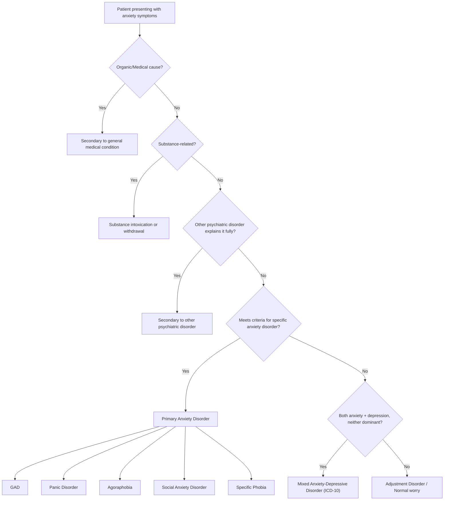

## Differential Diagnosis of Anxiety

The differential diagnosis of anxiety is one of the most important clinical exercises in psychiatry — and indeed in all of medicine — because anxiety is a **symptom that cuts across virtually every diagnostic category**. The patient who presents with anxiety could have a primary anxiety disorder, a mood disorder, a psychotic illness, a medical condition, or a substance-related problem. Your job is to systematically work through these possibilities before settling on a diagnosis.

The approach taught in HKU follows a hierarchical structure: first exclude organic/medical causes, then substance-related causes, then other psychiatric disorders, before diagnosing a primary anxiety disorder [1][2].

---

### Hierarchical Approach to Differential Diagnosis

<Callout title="The Golden Rule of Psychiatric Differential Diagnosis">
***Anxiety disorders are generally not diagnosed if the anxiety can be fully explained by other mental disorders, and does not occur outside of the duration of other psychopathologies*** [2]. Always work from "organic" → "substance" → "other psychiatric" → "primary anxiety disorder." This hierarchy prevents you from slapping a GAD label on someone whose anxiety is actually driven by an undiagnosed thyrotoxicosis or a psychotic illness.
</Callout>

---

### A. Primary Anxiety Disorders — Distinguishing Between Them

The first step once you've established that this is a *primary* anxiety disorder is to determine *which* one. The key discriminating features are: **(1) Is the anxiety continuous or episodic? (2) If episodic, is it situational or unprovoked? (3) What is the content/focus of the anxiety?**

| Diagnosis | Nature of Anxiety | Focus/Content | Key Differentiating Features |
|---|---|---|---|
| ***GAD*** | ***Continuous, free-floating*** | ***Widespread, not focused on a specific issue ('trivial' worries)*** [1] | ***NOT markedly increased by or restricted to any particular set of circumstances*** [1]. Worry is about *possible future events* across multiple life domains |
| ***Panic disorder*** | ***Intermittent, unpredictable*** | ***Fear of dying, going mad, or catastrophic consequences of attacks*** | ***Occurs unpredictably (not restricted to particular circumstances)*** [1]. May develop ***anticipatory anxiety*** and ***concurrent agoraphobia*** [1] |
| ***Agoraphobia*** | Intermittent, situational | Fear of panic/unavailable help/escape | ***Usually triggered by circumstances that are (1) away from home (2) crowded (3) confined with difficulty for immediate escape*** [1]. ***Often has prior Hx of panic attacks (95%)*** and ***often feel ↓anxious when accompanied*** [1] |
| ***Social phobia*** | Intermittent, situational | ***Fear of scrutiny, humiliation or embarrassment*** | ***May be isolated (e.g., public speaking, performance) or generalized (all situations)*** [1]. ***Cf usual shyness: excessive, severe and a/w significant impairment*** [1] |
| ***Specific phobia*** | Intermittent, situational | Fear of specific object/situation | ***Often a/w anticipatory anxiety and subsequently avoidance*** [1] |
| ***MADD*** | Mixed | Both anxiety and depressive features | ***Symptoms of both anxiety + depression are present, a/w some autonomic symptoms*** [1]. ***Consider which symptoms were dominant/first → dx of depression should take precedence if anxiety symptoms only present in context of depressive episode*** [1] |

---

### B. Differentiating GAD from Other Conditions

This is the bread and butter of the exam. Each differential has specific *discerning features* that you need to articulate clearly [3][4].

#### B1. GAD vs Depressive Disorder

| Feature | GAD | Depression |
|---|---|---|
| ***Content of rumination*** | ***GAD pt tends to worry about possible future events*** [3] | ***Depressive pt tends to brood self-critically on previous events and circumstances*** [3] |
| Temporal sequence | Anxiety often primary, persistent | If anxiety only in context of depressive episode → depression |
| Somatic features | Autonomic arousal, muscle tension | ***Early am wakening, diurnal variation in mood, suicidal thoughts are uncommon in GAD*** [3] |
| Course | Chronic, fluctuating | Episodic (weeks to months) |
| Comorbidity | ***GAD + depression can co-exist*** [3] | — |

Why this matters pathophysiologically: GAD and depression share serotonergic and noradrenergic dysfunction, which is why they co-occur so frequently and both respond to SSRIs/SNRIs. The shared genetic vulnerability (5-HT transporter polymorphism) explains the massive overlap.

<Callout title="High Yield Exam Point" type="error">
***Early morning wakening is NOT a feature of GAD and strongly suggests depressive disorders*** [1]. If a patient with apparent anxiety is waking at 3–4 AM and cannot return to sleep, think depression. In GAD, sleep disturbance is typically ***difficulty falling asleep with persistent worrying thoughts*** [1].
</Callout>

#### B2. GAD vs Panic Disorder

| Feature | GAD | Panic Disorder |
|---|---|---|
| Nature of anxiety | ***Continuous*** | ***Episodic, intermittent*** |
| Panic attacks | ***Can occur from escalating worry, but unexpected (uncued) panic attacks are unusual in GAD*** [3] | ***Recurrent, unexpected panic attacks*** [5] — by definition not cued by a specific trigger |
| Content of fear | ***More persistent, less specific chronic complaints involving multiple organ systems or concerning usual life circumstances*** [3] | ***Episodic and calamitous thoughts about presumed life-threatening acute illnesses ('fear of dying, going mad')*** [3] + ***anticipatory anxiety about the next attack*** |
| ICD-10 rule | ***GAD is not diagnosed if criteria for panic disorder were met*** [3] | Takes diagnostic precedence |
| DSM-5 rule | ***Both can be diagnosed simultaneously*** [3] | — |

The underlying mechanism: In panic disorder, there is a sudden, massive surge of sympathetic activation (likely originating from brainstem locus coeruleus and parabrachial nucleus) that triggers the full "fight-or-flight" cascade. In GAD, the amygdala-VMPFC circuit is chronically dysregulated, producing a *tonic* rather than *phasic* anxiety state.

#### B3. GAD vs Social Anxiety Disorder

***In social anxiety disorder, the worry is mainly concerning social situations in which they must perform or be evaluated by others. The individual often has anticipatory anxiety focused upon upcoming social situations.*** [4]

***In GAD, the individual worries whether or not they are being evaluated.*** [4]

***In ICD-10, GAD is not diagnosed if criteria for phobic anxiety were met, but this is possible in DSM-5.*** [4]

So the critical question is: *Does the anxiety persist outside of social situations?* If yes → more likely GAD. If the anxiety is exclusively about social performance and evaluation → social anxiety disorder.

#### B4. GAD vs OCD

| Feature | GAD | OCD |
|---|---|---|
| ***Content of intrusive thoughts*** | ***Tends to be more day-to-day worries (finances, work, health, family)*** [4] | ***Concerning more primal fears (e.g., contamination or harm)*** [4] |
| Compulsions | Checking may occur but ***usually directly related to preventing feared outcome and is not usually excessive/time consuming*** [4] | ***Typically ritualistic/rule driven (to be done in a certain way) and may be unrelated to the feared outcome they are intended to prevent and/or clearly excessive*** [4] |
| ICD-10 rule | ***GAD is not diagnosed if criteria for OCD were met*** [4] | Takes diagnostic precedence |

Why this distinction matters: OCD involves a specific dysfunction in the cortico-striato-thalamo-cortical (CSTC) loop — particularly the orbitofrontal cortex and caudate nucleus — producing stereotyped, repetitive thought-behaviour patterns. GAD involves more diffuse prefrontal-amygdala dysregulation. Different circuits, different phenomenology, different treatment nuances.

#### B5. GAD vs Stress-Related Disorders (PTSD, Adjustment Disorder)

***Prominent anxiety symptoms may be present in PTSD/adjustment disorder. However, a diagnosis of PTSD takes precedence if they can explain the anxiety symptoms, and the diagnosis of adjustment disorder is only made when other diagnoses (including GAD) cannot be made.*** [4]

For adjustment disorder specifically:
- There must be a ***clear temporal relationship to a stressor (onset ≤3 months)*** [8]
- Severity is ***out of proportion to original stressor*** [8]
- It is a ***residual category*** — should NOT be diagnosed if another specific disorder (including GAD) can be diagnosed [8]

For PTSD:
- The stressor must be *traumatic* in nature
- ***Characterized by re-experiencing (flashbacks, nightmares, intrusive images), avoidance, and hyperarousal*** [1]
- Anxiety is part of the hyperarousal cluster but is accompanied by the characteristic re-experiencing and avoidance features

#### B6. GAD vs Hypochondriacal Disorder (Illness Anxiety Disorder)

***GAD is commonly associated with concerns about medically unexplained symptoms, but GAD is usually characterized by worries about multiple different things, whereas hypochondriacal pt worry principally about illness.*** [4]

The key distinction: In GAD, health worry is *one of many* worries (alongside work, finances, relationships). In hypochondriasis/illness anxiety disorder, the *dominant* preoccupation is with having or acquiring a serious illness.

#### B7. GAD vs Somatic Symptom Disorder

***Both are marked by high levels of anxiety and somatic symptoms, but anxiety is pervasive over multiple aspects of life in GAD*** [9]. In somatic symptom disorder, the excessive thoughts, feelings, and behaviours are specifically directed toward the somatic symptoms themselves.

---

### C. Secondary Causes — Must-Exclude Differentials

These are conditions that *mimic* primary anxiety disorders and must be ruled out before making a psychiatric diagnosis.

#### C1. Secondary to General Medical Conditions

***Anxiety may be secondary to distressing symptoms of medical conditions. Mis-attributing these symptoms to anxiety may lead to failure to recognize medical conditions.*** [2]

| Condition | Mechanism | Key Features |
|---|---|---|
| ***Thyrotoxicosis*** | Excess T3/T4 → ↑basal metabolic rate, ↑β-adrenergic receptor sensitivity → mimics chronic sympathetic activation | ***Associated with constant anxiety but other signs should be obvious*** [2]: weight loss, heat intolerance, tremor, goitre, lid lag, AF |
| ***Phaeochromocytoma*** | Catecholamine-secreting tumour (from chromaffin cells of adrenal medulla) → episodic adrenaline/NA surges | ***Associated with episodic anxiety → more likely to mimic phobic disorder or panic disorder*** [2]. ***Classic triad: paroxysmal headache, sweating, palpitations*** [10]. ***5Ps: Pressure (HTN), Pain (headache), Palpitation, Perspiration, Pallor (vasoconstriction)*** [10][11] |
| ***Hypoglycaemia*** | ↓Blood glucose → adrenergic counter-regulatory response (adrenaline release) → sympathetic symptoms | ***Associated with episodic anxiety → more likely to mimic phobic disorder or panic disorder*** [2]. ***Adrenergic symptoms: palpitation, sweating, anxiety, tremor, tachycardia*** [12] |
| Cardiac arrhythmias (SVT, AF) | Sudden change in heart rate/rhythm → palpitations, haemodynamic compromise | Episodic palpitations, may have syncope; ECG diagnostic |
| ***Heart failure, PE, COPD, asthma*** | ***Dyspnoea → anxiety secondary to respiratory distress*** [2] | Look for orthopnoea, PND, wheeze, pleuritic pain, hypoxia |
| ***Temporal lobe epilepsy (TLE)*** | Ictal fear from amygdala focus | Episodic fear/anxiety with automatisms, déjà vu; EEG diagnostic |
| ***Cushing's disease*** | Chronic hypercortisolism → mood/anxiety symptoms | Cushing's facies, striae, proximal myopathy, buffalo hump |
| ***BPSD of dementia*** | Neurodegeneration of prefrontal-limbic circuits → anxiety, agitation | ***Dementia may present with anxiety as first presentation (BPSD)*** [1]. Cognitive decline on formal testing |
| ***Cerebral trauma, malignancies*** | Direct structural brain damage → disruption of fear circuitry | Focal neurology, history of trauma, constitutional symptoms |

<Callout title="Phaeochromocytoma vs Panic Disorder" type="idea">
Both present with episodic anxiety, palpitations, sweating, and pallor. The key distinguishing features of phaeochromocytoma: ***young-onset paroxysmal HT + postural hypotension*** [10], ***pressor response during procedures or with certain drugs (e.g., TCA, IV contrast) or food (cheese)*** [10], and *pallor* during attacks (panic patients tend to flush, not go pale — phaeochromocytoma patients go pale due to vasoconstriction from excess catecholamines). ***Phaeochromocytoma: sweat but do not flush*** [11].
</Callout>

#### C2. Secondary to Substances/Medications

***Anxiety that occurs only in the context of substance/medication use and that are present most severely in the morning (when withdrawal is typically most severe) may be due to effects of a substance.*** [4]

| Category | Examples | Mechanism |
|---|---|---|
| ***Intoxication*** | ***Alcohol, stimulants (amphetamines, cocaine, caffeine), cannabis, inhalants, hallucinogens (phencyclidine)*** [2] | Direct CNS stimulation, sympathomimetic effects, psychotomimetic effects |
| ***Withdrawal*** | ***Alcohol, sedatives/hypnotics (BZDs, opiates), caffeine, cocaine, nicotine*** [2] | Loss of CNS depressant effect → rebound excitation; GABA withdrawal → neuronal hyperexcitability |
| ***Side effects of drugs*** | ***Antidepressants (esp first 2 weeks), corticosteroids, sympathomimetics, T4, compound analgesics with caffeine, anticholinergics, antipsychotics (akathisia)*** [2] | Various — e.g., SSRIs initially increase 5-HT which paradoxically worsens anxiety before adaptation; akathisia from dopamine blockade produces subjective restlessness misdiagnosed as anxiety |

<Callout title="Akathisia vs Anxiety" type="error">
***Akathisia*** (from Greek *a-* = without, *kathisis* = sitting) is a medication side effect — most commonly from antipsychotics — that causes intense inner restlessness and a compelling need to move. It is frequently **misdiagnosed as anxiety** or agitation, leading to dose escalation of the very drug causing it. Always ask about recent medication changes in any patient presenting with new-onset anxiety. The key clue: akathisia involves a prominent *motor* component (inability to sit still, pacing, rocking) that is specifically related to medication timing.
</Callout>

#### C3. Secondary to Other Psychiatric Disorders

***Anxiety often occurs secondary to other psychopathologies*** [2]. The diagnostic principle: identify the *theme* of the anxiety to find the underlying disorder.

***Noting the theme/focus of anxiety may be helpful in reaching diagnosis*** [2]:

| Focus of Anxiety | Suggested Diagnosis |
|---|---|
| ***Worry about gaining weight*** | ***Eating disorder*** [2] |
| ***Worry about having serious illness*** | ***Hypochondriacal disorder*** [2] |
| ***Fear of being poisoned or killed*** | ***Delusional beliefs in paranoid schizophrenia*** [2] |
| ***Ruminatory thoughts of guilt or worthlessness*** | ***Depression*** [2] |
| ***Associated with obsessional thoughts or resisting a compulsion*** | ***OCD*** [2] |
| ***Separation or abandonment*** | ***Borderline, dependent personality disorder*** [2] |
| ***Being rejected or inadequate*** | ***Avoidant personality disorder*** [2] |

This is an extraordinarily useful clinical framework. When a patient presents with anxiety, always ask: **"What are you anxious about?"** The *content* of the worry often points to the correct diagnosis.

---

### D. Panic Disorder — Specific Differential Diagnoses

Since panic disorder has its own distinct differential [5][6], it deserves separate elaboration:

| D/dx | ***Discerning Features*** |
|---|---|
| ***Other anxiety disorders*** | ***Panic attacks tend to be expected, e.g., triggered by social situations in social phobia, phobic situations in phobic anxiety disorder, worry in GAD, separation in separation anxiety disorder*** [5]. ***There must be at least one full-blown panic attack occurring over one month in panic disorder. Panic disorder is a/w persistent marked concern about having further attacks (anticipatory fear) and about catastrophic consequences of such attacks.*** [5] |
| ***Agoraphobia*** | ***If panic attacks occur with agoraphobia, then the diagnosis should be agoraphobia with panic attacks instead of both disorders under ICD-10*** [5] |
| ***Cardiac conditions*** | ***Chest pain + palpitations in panic attack vs ACS*** — ECG, troponin essential. ***One must be careful to attribute a chest pain to psychogenic causes merely basing on features of anxiety, as the prospect of a heart disease is a frightening experience and organic heart diseases may coexist with anxiety*** [13][14] |
| ***Phaeochromocytoma/hypoglycaemia*** | Episodic sympathetic surges — see above |

---

### E. Social Anxiety Disorder — Specific Differential Diagnoses

| D/dx | ***Discerning Features*** |
|---|---|
| ***Agoraphobia*** | ***Focus of fear concerns the event of panic attacks and unavailability of help/escape rather than fearful of scrutiny. Also tends to persist when left alone in phobic situations*** [6] |
| ***Panic disorder*** | ***Fear concerns the embarrassment due to panic attacks rather than the social situation itself*** [6] |
| ***GAD*** | ***May have social worries but the focus is on the nature of ongoing relationships rather than scrutiny*** [6] |
| ***Normal shyness*** | ***Tends to be less severe and pervasive, and a/w little distress and functional impairment*** [6] |
| ***Avoidant personality disorder*** | ***Usually does not have a recognizable onset and have a broader avoidance pattern outside of social situations*** [6] |
| ***Lack of social skills, schizophrenia-spectrum, ↓IQ, ASD*** | ***Primarily due to lack of social skills vs social phobia pts usually have adequate social skills*** [6] |
| ***Depression and delusions related to negative evaluation*** | ***May have fears of being negatively evaluated but are usually arising from beliefs that they are bad or not worthy of being liked (cf from social behaviours or physical symptoms in social phobia)*** [6] |

---

### F. Other Features That Help Distinguish Diagnoses

***Other features in GAD that are NEVER the most prominent feature and should suggest other diagnosis if present*** [1]:

- **Tiredness** (if dominant → depression, CFS)
- **Depressive mood** (if dominant → depressive disorder)
- **Obsessional symptoms** (if dominant → OCD)
- **Depersonalisation** (if dominant → dissociative disorder, panic disorder)

***In ICD-10, GAD is not diagnosed if criteria for panic disorder, phobic anxiety, or OCD were met*** [3][4]. This is an important diagnostic hierarchy: these disorders take precedence over GAD.

---

### G. Differential Diagnosis Summary Table

| Category | Condition | Key Feature That Distinguishes from GAD |
|---|---|---|
| **Primary anxiety disorders** | Panic disorder | Unexpected, episodic panic attacks; fear of dying/going mad |
| | Agoraphobia | Situational — crowded/confined/away from home; ↓anxiety when accompanied |
| | Social phobia | Anxiety restricted to social/performance situations |
| | Specific phobia | Anxiety restricted to specific object/situation |
| | OCD | Ritualistic compulsions; primal fears (contamination, harm) |
| **Mood disorders** | Depression | Broods on past; early morning wakening; diurnal variation; suicidal ideation |
| | MADD | Neither anxiety nor depression dominant; both present |
| | Bipolar disorder | Anxiety may accompany depressive or mixed episodes |
| **Stress-related** | PTSD | Traumatic stressor; re-experiencing; avoidance; hyperarousal |
| | Adjustment disorder | Residual category; onset ≤3 months of stressor; doesn't meet other criteria |
| **Somatoform** | Hypochondriasis | Worry principally about *having* illness; symptoms often minimal |
| | Somatic symptom disorder | Excessive attention to somatic symptoms specifically |
| **Organic** | Thyrotoxicosis | Constant anxiety + weight loss, heat intolerance, goitre |
| | Phaeochromocytoma | Episodic anxiety + paroxysmal HTN + pallor |
| | Hypoglycaemia | Episodic anxiety relieved by glucose |
| | TLE | Ictal fear, automatisms, EEG abnormalities |
| | Dementia (BPSD) | Progressive cognitive decline on formal testing |
| | Cardiac (arrhythmia, HF) | ECG abnormalities, haemodynamic signs |
| **Substance-related** | Intoxication | Temporal relationship to substance use |
| | Withdrawal | Worst in morning (especially alcohol, BZDs); improves through day |
| | Drug side effects | Temporal relationship to new medication (especially antidepressants, antipsychotics) |

---

<Callout title="High Yield Summary">

**Approach**: Organic → Substance → Other psychiatric → Primary anxiety disorder. Always work hierarchically.

**Key differentiators for GAD**: (1) Anxiety is continuous, not episodic. (2) Free-floating, not situational. (3) Multiple trivial worries, not focused on one theme. (4) Early morning wakening is NOT GAD — think depression. (5) ICD-10 hierarchy: panic disorder, phobic anxiety, and OCD all take precedence over GAD.

**Must-exclude organic causes**: Thyrotoxicosis (constant anxiety), phaeochromocytoma and hypoglycaemia (episodic anxiety mimicking panic), TLE, BPSD of dementia, cardiac conditions.

**Substance clue**: Anxiety worst in the morning → think substance withdrawal (alcohol, benzodiazepines).

**Theme of anxiety guides diagnosis**: Weight → eating disorder. Illness → hypochondriasis. Poisoned/killed → paranoid schizophrenia. Guilt → depression. Obsessions + compulsions → OCD. Abandonment → borderline PD. Inadequacy → avoidant PD.

**Never forget**: Organic heart disease can coexist with anxiety — never dismiss chest pain as psychogenic purely because the patient is anxious.

</Callout>

---

<ActiveRecallQuiz
  title="Active Recall - Differential Diagnosis of Anxiety"
  items={[
    {
      question: "Describe the hierarchical approach to the differential diagnosis of anxiety. What must be excluded before diagnosing a primary anxiety disorder?",
      markscheme: "Step 1: Exclude organic/general medical conditions (thyrotoxicosis, phaeochromocytoma, hypoglycaemia, TLE, cardiac, dementia). Step 2: Exclude substance-related causes (intoxication, withdrawal, drug side effects). Step 3: Exclude other psychiatric disorders that fully explain the anxiety (depression, psychosis, OCD, PTSD). Step 4: Only then diagnose a primary anxiety disorder. ICD-10 hierarchy: panic disorder, phobic anxiety, OCD take precedence over GAD.",
    },
    {
      question: "How do you differentiate GAD from depressive disorder based on the content of rumination and sleep disturbance?",
      markscheme: "Content: GAD patients worry about possible future events; depressive patients brood self-critically on previous events/circumstances. Sleep: GAD has difficulty falling asleep with persistent worrying thoughts; early morning wakening is NOT a feature of GAD and strongly suggests depression. Other depression clues: diurnal variation in mood, suicidal thoughts (uncommon in GAD).",
    },
    {
      question: "List the themes/focus of anxiety and the psychiatric diagnosis each suggests.",
      markscheme: "Weight gain: eating disorder. Having serious illness: hypochondriasis. Being poisoned/killed: paranoid schizophrenia. Guilt/worthlessness: depression. Obsessional thoughts/resisting compulsions: OCD. Separation/abandonment: borderline or dependent PD. Being rejected/inadequate: avoidant PD. Social scrutiny: social anxiety disorder.",
    },
    {
      question: "A patient presents with episodic anxiety, palpitations, sweating, and pallor. How would you distinguish phaeochromocytoma from panic disorder?",
      markscheme: "Phaeochromocytoma: paroxysmal hypertension (may have postural hypotension between episodes), pallor during attacks (not flushing), pressor response to procedures/drugs (TCA, IV contrast)/food (cheese), headache. 5Ps: Pressure, Pain, Palpitation, Perspiration, Pallor. Confirmed by 24h urine fractionated metanephrines. Panic disorder: normotensive, may flush rather than go pale, no pressor triggers, fear of dying/going mad dominant.",
    },
    {
      question: "What temporal clue suggests substance-induced anxiety rather than a primary anxiety disorder?",
      markscheme: "Anxiety that is present most severely in the morning (when withdrawal is typically most severe) suggests substance withdrawal, especially alcohol or benzodiazepines. The anxiety occurs only in the context of substance use and improves as the day progresses or after re-dosing.",
    },
    {
      question: "Explain why unexpected panic attacks are unusual in GAD but can still occur, and how ICD-10 vs DSM-5 handle the co-diagnosis of GAD and panic disorder.",
      markscheme: "In GAD, panic attacks can occur from escalating uncontrollable worry, but these are expected (cued by worry), not unexpected. Unexpected (uncued) panic attacks are the hallmark of panic disorder. ICD-10: GAD is NOT diagnosed if criteria for panic disorder are met (panic disorder takes precedence). DSM-5: Both GAD and panic disorder can be diagnosed simultaneously as comorbidities.",
    },
  ]}
/>

## References

[1] Senior notes: Ryan Ho Psychiatry.pdf (p173 — GAD classification, epidemiology, clinical features, somatic features)
[2] Senior notes: Ryan Ho Psychiatry.pdf (p171 — Secondary causes of anxiety: medical conditions, substances, other psychiatric disorders, theme of anxiety)
[3] Senior notes: Ryan Ho Psychiatry.pdf (p174 — GAD differential diagnosis: depression, panic disorder)
[4] Senior notes: Ryan Ho Psychiatry.pdf (p175 — GAD differential diagnosis: social anxiety, OCD, stress-related disorders, hypochondriasis, substance-induced, physical illness)
[5] Senior notes: Ryan Ho Psychiatry.pdf (p178–179 — Panic disorder clinical features, diagnostic criteria, differential diagnosis)
[6] Senior notes: Ryan Ho Psychiatry.pdf (p184 — Social anxiety disorder and specific phobia differential diagnosis)
[8] Senior notes: Ryan Ho Psychiatry.pdf (p197–198 — Adjustment disorder clinical features, differential diagnosis)
[9] Senior notes: Ryan Ho Psychiatry.pdf (p203 — Somatic symptom disorder differential diagnosis)
[10] Senior notes: maxim.md (section 435 — Phaeochromocytoma clinical features, 5Ps)
[11] Senior notes: Ryan Ho Endocrine.pdf (p66 — Phaeochromocytoma, 5Ps, d/dx of episodic sweating/flushing)
[12] Senior notes: Ryan Ho Endocrine.pdf (p94 — Hypoglycaemia clinical features: adrenergic and neuroglycopenic symptoms)
[13] Senior notes: Ryan Ho Cardiology.pdf (p56 — Anxiety/psychogenic chest pain differential)
[14] Senior notes: Ryan Ho Fundamentals.pdf (p201 — Anxiety/psychogenic chest pain)
