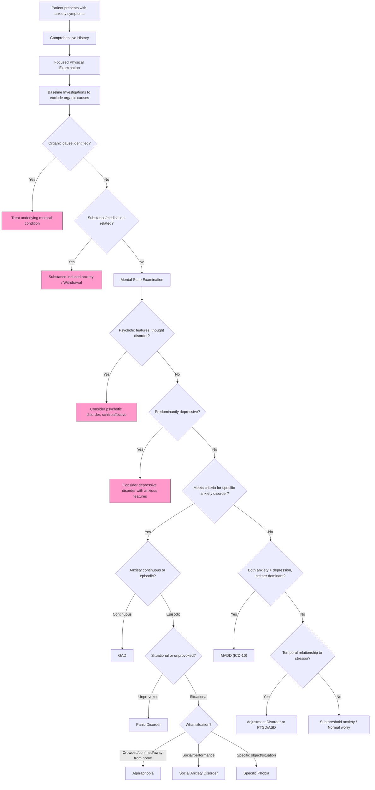
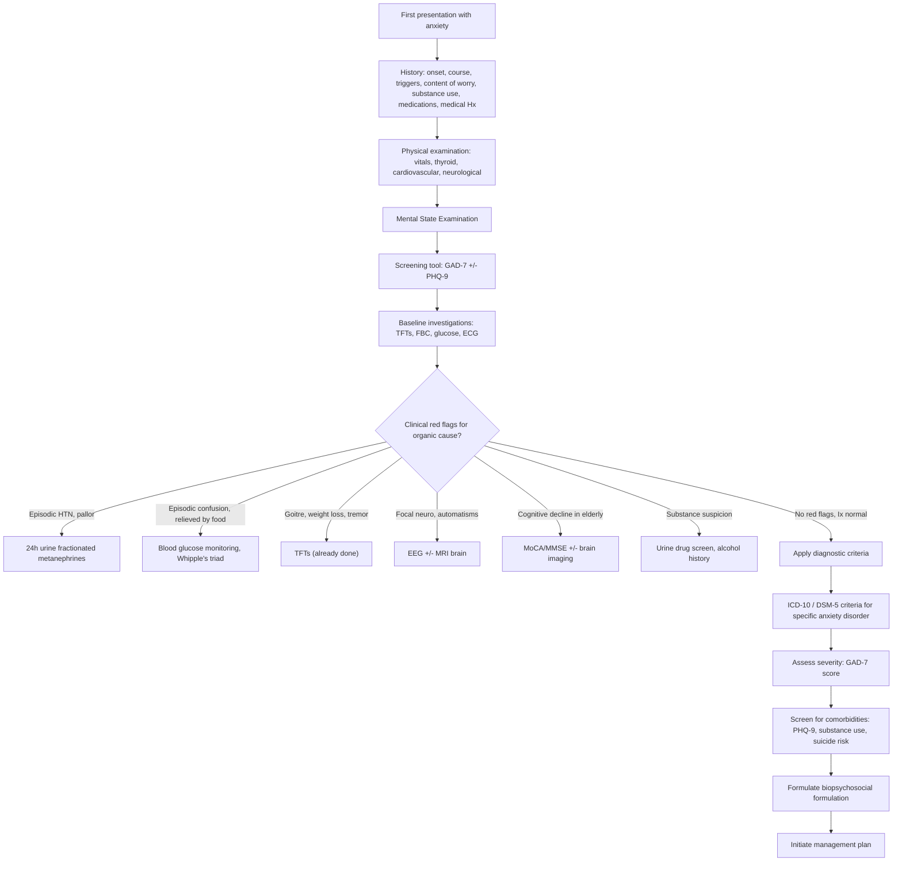

## Diagnostic Criteria, Diagnostic Algorithm, and Investigations for Anxiety Disorders

### 1. Diagnostic Criteria

Anxiety disorders are **clinical diagnoses** — there is no blood test, no imaging finding, and no biomarker that confirms the diagnosis. The diagnosis rests entirely on **history, mental state examination, and meeting standardised criteria** after excluding organic and substance-related causes. Investigations exist *only* to rule out mimics, not to "confirm" anxiety.

Let's walk through the formal criteria for the two most important anxiety disorders: GAD and Panic Disorder.

---

#### 1.1 Generalised Anxiety Disorder (GAD)

Both ICD-10 and DSM-5 criteria are used in HKU teaching. You need to know both.

##### ICD-10 Criteria [1]

***Suffer primary symptoms of anxiety for most days for at least several weeks at a time, and usually for several months.***

***Symptoms should involve elements of:***
- ***(a) Apprehension (worries about future misfortunes, feeling 'on edge', difficulty in concentrating, etc.)***
- ***(b) Motor tension (restless fidgeting, tension headaches, trembling, inability to relax)***
- ***(c) Autonomic overactivity (lightheadedness, sweating, tachycardia/tachypnoea, epigastric discomfort, dizziness, dry mouth, etc.)***

***In children, frequent need for reassurance and recurrent somatic complaints may be prominent.***

***The transient appearance (for a few days at a time) of other symptoms (esp depression) does not r/o GAD as main diagnosis, but sufferer must not meet full criteria for depressive episode, phobic anxiety, panic disorder or OCD.*** [1]

##### DSM-5 Criteria [1][3]

| Criterion | Detail |
|---|---|
| ***A*** | ***Excessive anxiety and worry (apprehensive expectation), occurring more days than not for at least 6 months, about a number of events or activities (such as work or school performance)*** |
| ***B*** | ***The individual finds it difficult to control the worry*** |
| ***C*** | ***The anxiety and worry are a/w ≥3 of 6 symptoms (≥1 in children), with at least some symptoms having been present for more days than not for the past 6 months:*** |
| | ***(1) restlessness or feeling keyed up or on edge*** |
| | ***(2) being easily fatigued*** |
| | ***(3) difficulty concentrating or mind going blank*** |
| | ***(4) irritability*** |
| | ***(5) muscle tension*** |
| | ***(6) sleep disturbance (difficulty falling or staying asleep, or restless, unsatisfying sleep)*** |
| ***D*** | ***The anxiety, worry or physical symptoms cause significant distress or impairment in social, occupational or other important areas of functioning*** |
| ***E*** | ***Not attributable to SA or another medical condition*** |
| ***F*** | ***Not better explained by another mental disorder*** |

<Callout title="Understanding the DSM-5 Criteria — Why These 6 Symptoms?">
The 6 symptoms in Criterion C all reflect different facets of sustained arousal:
- **Restlessness** = motor manifestation of sympathetic drive
- **Fatigue** = exhaustion from chronic arousal (the body cannot sustain fight-or-flight indefinitely)
- **Poor concentration** = attentional resources consumed by threat monitoring (prefrontal "bandwidth" hijacked)
- **Irritability** = lowered frustration threshold from chronic amygdala hyperactivation
- **Muscle tension** = sustained motor neuron firing from chronic sympathetic activation
- **Sleep disturbance** = arousal system (locus coeruleus, reticular activating system) fails to deactivate at bedtime

The mnemonic **"RIMISC"** or **"WRIST-FM"** (Worry, Restlessness, Irritability, Sleep disturbance, Tension, Fatigue, Mind going blank/poor concentration) can help remember these.
</Callout>

<Callout title="ICD-10 vs DSM-5 — Key Differences" type="idea">
| Feature | ICD-10 | DSM-5 |
|---|---|---|
| Duration | "Several weeks... usually several months" (vague) | ***≥6 months*** (strict) |
| Symptom domains | 3 domains: apprehension, motor tension, autonomic overactivity | 6 specific symptoms (≥3 required) |
| Hierarchy | ***Must not meet criteria for depression, phobic anxiety, panic disorder, or OCD*** [1] | ***Not better explained by another mental disorder*** — can be comorbid |
| Comorbid diagnosis | More restrictive — GAD excluded if other criteria met | More permissive — allows comorbidity |

In practice, DSM-5 is the more commonly used system for research and clinical trials. ICD-10/11 is the official coding system in Hong Kong.
</Callout>

---

#### 1.2 Panic Disorder

##### ICD-10 Criteria [5]

***Several severe attacks of autonomic anxiety occurred within a period of about 1 month:***
- ***(a) In circumstances where there is no objective danger***
- ***(b) Without being confined to known or predictable situations***
- ***(c) With comparable freedom from anxiety symptoms between attacks (although anticipatory anxiety is common)***

***Should not be diagnosed when secondary to phobic disorders or depressive disorders.*** [5]

##### DSM-5 Criteria [5]

| Criterion | Detail |
|---|---|
| ***A*** | ***Recurrent unexpected panic attack, i.e. an abrupt surge of intense fear/discomfort that reaches a peak within minutes and during which time ≥4 of following symptoms occur:*** |
| | ***(1) Palpitations, pounding heart or ↑HR*** |
| | ***(2) Sweating*** |
| | ***(3) Trembling or shaking*** |
| | ***(4) Sensations of SOB or smothering*** |
| | ***(5) Feelings of choking*** |
| | ***(6) Chest pain or discomfort*** |
| | ***(7) Nausea or abdominal distress*** |
| | ***(8) Feeling dizzy, unsteady, light-headed, or faint*** |
| | ***(9) Chills or heat sensations*** |
| | ***(10) Paraesthesias (numbness or tingling sensations)*** |
| | ***(11) Derealization or depersonalization*** |
| | ***(12) Fear of losing control or 'going crazy'*** |
| | ***(13) Fear of dying*** |
| ***B*** | ***≥1 attacks has been followed by ≥1mo of ≥1 of following: (1) persistent concern/worry about additional panic attacks or their consequences; (2) a significant maladaptive change in behaviour related to the attacks*** |
| ***C*** | ***Not attributable to substance or another medical condition*** |
| ***D*** | ***Not better explained by another mental disorder*** |

<Callout title="The 13 Panic Symptoms — Mechanism Map">
Every single symptom is a direct consequence of acute, massive sympathetic activation:
- Symptoms 1–3 (palpitations, sweating, trembling) = catecholamine surge on heart (β1), sweat glands (sympathetic cholinergic), skeletal muscle (β2)
- Symptoms 4–6 (SOB, choking, chest pain) = respiratory centre stimulation + intercostal/chest wall muscle spasm
- Symptom 7 (nausea) = blood diverted from gut (sympathetic splanchnic vasoconstriction)
- Symptoms 8–10 (dizziness, chills/heat, paraesthesiae) = hyperventilation → ↓pCO2 → respiratory alkalosis → cerebral vasoconstriction + ↓ionised Ca²⁺
- Symptoms 11–13 (derealisation, fear of losing control, fear of dying) = prefrontal cortex overwhelmed by amygdala signals → catastrophic cognitive appraisal
</Callout>

---

#### 1.3 Other Anxiety Disorder Criteria (Brief Summary)

| Disorder | Core Diagnostic Requirement |
|---|---|
| **Agoraphobia** | Marked fear/anxiety about ≥2 of: public transport, open spaces, enclosed places, standing in line/being in a crowd, being outside the home alone. The situations are avoided, require a companion, or endured with intense anxiety. ≥6 months. |
| **Social Anxiety Disorder** | Marked fear/anxiety about social situations where scrutiny is possible. Fear of acting in a way that will be negatively evaluated. ≥6 months. Specify if performance only. |
| **Specific Phobia** | Marked fear/anxiety about a specific object or situation. Phobic stimulus almost always provokes immediate anxiety. Avoidance or endured with intense fear. ≥6 months. |

---

### 2. Diagnostic Algorithm

The following algorithm represents the structured clinical approach to diagnosing anxiety — from initial presentation through to final diagnosis. The key principle: **exclude organic → exclude substance → exclude other psychiatric → classify the primary anxiety disorder**.

---

### 3. Clinical Assessment Components

Before any laboratory investigation, the clinical assessment is paramount. Anxiety is a **clinical diagnosis** — investigations serve only to exclude mimics.

#### 3.1 History

The psychiatric history for anxiety should cover:

| Component | Specific Points |
|---|---|
| **Presenting complaint** | Nature of anxiety (continuous vs episodic), content of worry, triggers, duration |
| **Somatic symptoms** | System-by-system review: cardiovascular (palpitations, chest pain), respiratory (SOB), GI (nausea, diarrhoea), neurological (dizziness, paraesthesiae), musculoskeletal (tension, tremor) |
| **Panic attacks** | Frequency, triggers (or lack thereof), peak timing, associated symptoms (≥4 of 13) |
| **Avoidance behaviour** | Agoraphobic situations, social situations, specific phobias |
| **Functional impact** | Work, relationships, social life, self-care |
| **Comorbid psychiatric symptoms** | Depression screen (PHQ-9), suicidal ideation, OCD features, PTSD features |
| **Substance history** | Alcohol, caffeine, recreational drugs, prescription medications. ***Anxiety worst in the morning → think withdrawal*** [4] |
| **Medical history** | Thyroid disease, cardiac conditions, asthma/COPD, epilepsy, diabetes (hypoglycaemia) |
| **Drug history** | ***Antidepressants (esp first 2 weeks), corticosteroids, sympathomimetics, T4, compound analgesics with caffeine, anticholinergics, antipsychotics (akathisia)*** [2] |
| **Family history** | Anxiety disorders, depression, substance use |
| **Developmental/social history** | Childhood adversity, personality traits, current stressors |

#### 3.2 Screening Tools

Validated rating scales serve two purposes: (1) structured screening in primary care, (2) monitoring treatment response.

| Tool | What It Measures | Details |
|---|---|---|
| **GAD-7** | GAD severity | 7 items, scores 0–21. Cut-offs: 5 (mild), 10 (moderate), 15 (severe). Sens 89%, Spec 82% for GAD at cut-off ≥10. |
| **GAD-2** | Ultra-brief screen | First 2 items of GAD-7. Score ≥3 → warrants full assessment. |
| **PHQ-9** | Depression severity | Essential for comorbidity screening — always pair with GAD-7. |
| **HADS** (Hospital Anxiety and Depression Scale) | Both anxiety and depression | 14 items (7 anxiety, 7 depression). Widely used in medical settings. Score ≥8 on anxiety subscale suggests possible anxiety disorder. |
| **Beck Anxiety Inventory (BAI)** | Anxiety severity | 21 items, focuses heavily on somatic symptoms — useful for distinguishing anxiety from depression. |
| **Panic Disorder Severity Scale (PDSS)** | Panic disorder severity | 7 items assessing panic frequency, distress, avoidance, impairment. |
| **Liebowitz Social Anxiety Scale (LSAS)** | Social anxiety severity | 24 items rating fear and avoidance across social and performance situations. |
| **SPIN** (Social Phobia Inventory) | Social anxiety screen | 17 items, self-report. |
| **Y-BOCS** | OCD severity | Used when OCD features are present |

<Callout title="GAD-7: The Workhorse Screening Tool">
The **GAD-7** asks about the past 2 weeks:
1. Feeling nervous, anxious, or on edge
2. Not being able to stop or control worrying
3. Worrying too much about different things
4. Trouble relaxing
5. Being so restless that it's hard to sit still
6. Becoming easily annoyed or irritable
7. Feeling afraid as if something awful might happen

Each scored 0 (not at all) to 3 (nearly every day). Total 0–21. This maps directly onto DSM-5 Criterion C symptoms. It's quick, validated, and should be used in every primary care setting.
</Callout>

#### 3.3 Mental State Examination (MSE)

| MSE Domain | Expected Findings in Anxiety | What to Look For |
|---|---|---|
| Appearance/Behaviour | Restless, fidgeting, tense posture, poor eye contact, hand wringing | Motor tension reflects sustained sympathetic drive |
| Speech | May be rapid/pressured or hesitant | Pressured speech from arousal; hesitancy from social anxiety |
| Mood (subjective) | "Anxious," "worried," "nervous," "on edge" | Patient's own words |
| Affect (objective) | Anxious, apprehensive, labile | Observe for tremor, sweating, tears |
| Thought content | Multiple worries (GAD), catastrophic fears (panic), specific fears (phobia) | ***Content guides diagnosis*** [2] |
| Thought form | Circumstantiality (circling same worries), rumination | Usually not formally disordered |
| Perception | Usually normal; derealisation/depersonalisation may occur in panic | If hallucinations → consider psychotic disorder |
| Cognition | Subjectively impaired concentration; formal testing usually normal | ***If abnormal formal testing → consider dementia*** [1] |
| Insight | Usually preserved — patients recognise worry is excessive | If insight absent and beliefs delusional → consider psychotic disorder |
| Judgement | May be impaired by avoidance behaviours | Avoidance reflects severity |

---

### 4. Investigations

Repeat the core principle: **investigations in anxiety disorders exist to exclude organic mimics, NOT to confirm the psychiatric diagnosis.** The depth of investigation depends on clinical suspicion based on history and examination.

#### 4.1 Routine Baseline Investigations (All First Presentations)

Every patient presenting with significant anxiety symptoms for the first time should have a **basic organic screen**:

| Investigation | Rationale | Key Findings / Interpretation |
|---|---|---|
| **Thyroid function tests (TFTs)** | ***Thyrotoxicosis is a/w constant anxiety*** [4] — excess T3/T4 upregulates β-adrenergic receptors → mimics chronic sympathetic activation | ↓TSH, ↑free T4/T3 → thyrotoxicosis. Note: subclinical hyperthyroidism (low TSH, normal T4) can also cause anxiety symptoms |
| **Full blood count (FBC)** | Anaemia → fatigue, tachycardia, SOB mimicking anxiety; infection → delirium with agitation | Low Hb → investigate cause. ↑WCC → consider infection |
| **Renal function tests (RFT)** | Uraemia can cause agitation/confusion; electrolyte disturbance (esp hypocalcaemia) can mimic anxiety | ↑Urea/creatinine → uraemia. ↓Ca²⁺ → tetany, paraesthesiae (mimics hyperventilation syndrome) |
| **Liver function tests (LFT)** | Hepatic encephalopathy; also screens for alcohol-related liver disease in suspected substance misuse | ↑GGT disproportionate to ALP → alcohol. Deranged LFTs + confusion → hepatic encephalopathy |
| **Random/fasting glucose** | ***Hypoglycaemia is a/w episodic anxiety → more likely to mimic phobic disorder or panic disorder*** [4] | Low glucose coinciding with symptoms → Whipple's triad. Also screen for diabetes (can cause hypoglycaemia if overtreated) |
| **ECG (12-lead)** | Cardiac arrhythmias (SVT, AF, VT) cause palpitations mimicking panic; long QT is relevant if considering psychotropic medication | Irregularly irregular → AF. Short PR + delta wave → WPW. Prolonged QTc → caution with SSRIs/antipsychotics. Normal ECG reassures both clinician and patient |
| **Urine drug screen** | ***Intoxication (stimulants, cannabis) and withdrawal (BZDs, opiates, alcohol) cause anxiety*** [2] | Positive for amphetamines, cocaine, cannabis, benzodiazepines → substance-related anxiety |

<Callout title="The Minimum Screen">
For exam purposes, the **essential baseline investigations** for a first presentation of anxiety are: **TFTs, FBC, glucose, ECG**. These cover the most common and dangerous organic mimics (thyrotoxicosis, anaemia, hypoglycaemia, arrhythmia). Add LFT/RFT and urine drug screen based on clinical suspicion.
</Callout>

#### 4.2 Targeted Investigations (Based on Clinical Suspicion)

These are NOT routine but should be ordered when specific clinical features raise suspicion for particular organic causes.

| Investigation | When to Order | Key Findings / Interpretation |
|---|---|---|
| **24h urine fractionated metanephrines** | Suspected ***phaeochromocytoma***: episodic anxiety + paroxysmal hypertension + pallor + headache + sweating | ***Sens 98%, Spec 98%*** [11]. Elevated metanephrines/normetanephrines confirm catecholamine excess. ***Precaution: stop drugs affecting catecholamine secretion, e.g., TCAs, levodopa, α-agonist, amphetamine*** [11] |
| **Plasma fractionated metanephrines** | Alternative to 24h urine when urine collection impractical | ***Sens 96–100%, Spec 85–89%*** [11]. Higher sensitivity but lower specificity than urine (more false positives) |
| **Serum calcium + PTH** | Suspected hyperparathyroidism (anxiety, bone pain, renal stones, constipation) | ↑Ca²⁺ + ↑PTH → primary hyperparathyroidism. ↓Ca²⁺ → consider hypoparathyroidism (paraesthesiae mimicking hyperventilation) |
| **24h urinary cortisol / overnight dexamethasone suppression test** | Suspected ***Cushing's disease***: anxiety, weight gain, moon face, striae, proximal myopathy [2] | Elevated 24h urine cortisol; failure to suppress cortisol after 1mg dexamethasone → Cushing's syndrome |
| **Urine 5-HIAA** | Suspected carcinoid syndrome: episodic flushing + diarrhoea + wheeze [11] | Elevated → carcinoid tumour |
| **Serum tryptase** | Suspected systemic mastocytosis: episodic flushing, urticaria, anaphylaxis-like episodes [11] | Elevated → mastocytosis |
| **Echocardiography** | Suspected cardiac cause: murmur, signs of heart failure | Valvular disease, reduced LVEF, structural abnormalities |
| **Pulmonary function tests (PFTs)** | Suspected asthma/COPD causing dyspnoea misattributed to anxiety | Obstructive pattern; bronchodilator reversibility in asthma |
| **EEG** | Suspected ***temporal lobe epilepsy*** [2]: episodic fear, automatisms, déjà vu | Temporal spikes, sharp waves. Normal interictal EEG does not exclude TLE |
| **CT/MRI brain** | Suspected structural brain lesion: focal neurology, new-onset personality change, ***cerebral trauma*** [2] | Mass lesion, temporal lobe pathology, post-traumatic changes |
| **MoCA / MMSE** | ***Dementia may present with anxiety as first presentation (BPSD)*** [1] | Score < 26/30 on MoCA → cognitive impairment warranting further evaluation |

<Callout title="Phaeochromocytoma Investigation" type="idea">
***24h urine for vanillylmandelic acid (VMA): now superseded as less accurate*** [11]. The gold standard is now **24h urine fractionated metanephrines** or **plasma fractionated metanephrines**. Remember: metanephrines are the *methylated metabolites* of catecholamines (adrenaline → metanephrine; noradrenaline → normetanephrine) — they are more stable and have a longer half-life than the parent catecholamines, making them a more reliable biomarker.
</Callout>

#### 4.3 Investigations for Treatment Monitoring

Before initiating pharmacotherapy, certain baseline investigations are recommended:

| Investigation | Reason |
|---|---|
| **Baseline ECG** | QTc assessment before SSRIs (especially citalopram/escitalopram which have dose-dependent QTc prolongation) or any antipsychotic |
| **FBC** | Baseline before certain medications |
| **LFT** | Baseline hepatic function before medications metabolised hepatically |
| **RFT + electrolytes** | Baseline before medications; hyponatraemia risk with SSRIs (SIADH) — particularly in elderly |
| **Weight, BMI, BP** | Baseline metabolic parameters; some medications (mirtazapine, pregabalin) cause weight gain |
| **Pregnancy test** | If woman of childbearing age — many anxiolytics are teratogenic (especially benzodiazepines in first trimester) |

---

### 5. Putting It All Together — The Clinical Pathway

---

### 6. Clinical Course and Prognosis (Informing Diagnosis)

Understanding the natural history is important because it distinguishes GAD from transient anxiety or adjustment reactions [1]:

- ***Onset: usually gradual (full syndrome emerges after prolonged subsyndromal symptoms)*** [1]
- ***Early onset a/w more protracted course and usually a/w comorbid depression*** [1]
- ***Late onset usually more a/w demographic/psychosocial RFs*** [1]
- ***Course: usually chronic fluctuating, with ↓rates of remission in short/medium term*** [1]
- ***Prognosis: generally poor if disease lasts > 6mo (diagnostic cutoff in DSM-5), with only 60% having complete recovery after 12y and 50% of those recovering having subsequent relapses*** [1]
- ***Impact: a/w functional impairment and ↑CVS mortality*** [1]

<Callout title="Why Does GAD Increase Cardiovascular Mortality?" type="idea">
Chronic anxiety → sustained HPA axis activation → chronic cortisol elevation → metabolic syndrome (insulin resistance, visceral adiposity, dyslipidaemia), endothelial dysfunction, pro-inflammatory state, and sympathetic overdrive (↑HR, ↑BP) → accelerated atherosclerosis → ↑risk of MI and stroke. Additionally, anxious patients are more likely to smoke, drink excessively, and be physically inactive — all independent cardiovascular risk factors.
</Callout>

---

<Callout title="High Yield Summary">

**Diagnostic criteria**: GAD requires ≥6 months (DSM-5) of excessive worry + ≥3/6 symptoms (restlessness, fatigue, poor concentration, irritability, muscle tension, sleep disturbance) + functional impairment + exclusion of organic/substance/other psychiatric causes. ICD-10 requires apprehension + motor tension + autonomic overactivity, with stricter hierarchy (cannot diagnose if panic/phobia/OCD/depression criteria met).

**Panic disorder**: Recurrent UNEXPECTED panic attacks (≥4 of 13 symptoms peaking within minutes) + ≥1 month of concern about further attacks or maladaptive behaviour change.

**Investigations are to EXCLUDE mimics, not confirm diagnosis**: Minimum screen = TFTs, FBC, glucose, ECG. Targeted: 24h urine fractionated metanephrines (phaeochromocytoma, Sens 98% Spec 98%), EEG (TLE), MoCA (dementia), cortisol (Cushing's).

**Screening tools**: GAD-7 (cut-off ≥10), always pair with PHQ-9 for depression comorbidity.

**Prognosis**: Chronic fluctuating course. Only 60% recover after 12 years. 50% of those who recover relapse. Associated with ↑CVS mortality.

</Callout>

---

<ActiveRecallQuiz
  title="Active Recall - Diagnostic Criteria, Algorithm, and Investigations"
  items={[
    {
      question: "List the 6 DSM-5 Criterion C symptoms for GAD and state how many are required for diagnosis in adults vs children.",
      markscheme: "Six symptoms: (1) Restlessness/on edge, (2) Easily fatigued, (3) Difficulty concentrating/mind going blank, (4) Irritability, (5) Muscle tension, (6) Sleep disturbance. Adults require 3 or more; children require only 1 or more. Must be present more days than not for at least 6 months.",
    },
    {
      question: "What are the key differences between ICD-10 and DSM-5 criteria for diagnosing GAD?",
      markscheme: "Duration: ICD-10 = several weeks to months (vague); DSM-5 = at least 6 months (strict). Symptom structure: ICD-10 requires 3 domains (apprehension, motor tension, autonomic overactivity); DSM-5 requires 3 of 6 specific symptoms. Hierarchy: ICD-10 excludes GAD if criteria met for depression, phobic anxiety, panic disorder, or OCD; DSM-5 allows comorbid diagnoses (Criterion F: not better explained by another mental disorder).",
    },
    {
      question: "For a first presentation of anxiety, list the minimum baseline investigations you would order and the specific organic mimic each excludes.",
      markscheme: "TFTs - excludes thyrotoxicosis (constant anxiety). FBC - excludes anaemia (fatigue, tachycardia). Random/fasting glucose - excludes hypoglycaemia (episodic anxiety). 12-lead ECG - excludes cardiac arrhythmia (palpitations). Consider also: LFT/RFT, urine drug screen based on clinical suspicion.",
    },
    {
      question: "A patient has episodic anxiety with paroxysmal hypertension and pallor. What is the most appropriate investigation and what precautions must be taken?",
      markscheme: "24h urine fractionated metanephrines (Sens 98%, Spec 98%) for suspected phaeochromocytoma. Precaution: must stop drugs affecting catecholamine secretion before testing, including TCAs, levodopa, alpha-agonists, and amphetamines. Alternative: plasma fractionated metanephrines (Sens 96-100%, Spec 85-89%). VMA is now superseded as less accurate.",
    },
    {
      question: "State the DSM-5 diagnostic criteria for Panic Disorder (Criteria A through D).",
      markscheme: "A: Recurrent unexpected panic attacks with 4 or more of 13 symptoms peaking within minutes. B: At least 1 attack followed by 1 or more months of either persistent concern about further attacks/consequences OR significant maladaptive behavioural change. C: Not attributable to substance or another medical condition. D: Not better explained by another mental disorder.",
    },
    {
      question: "Describe the clinical course and prognosis of GAD according to Ryan Ho notes.",
      markscheme: "Onset: usually gradual, early onset associated with more protracted course and comorbid depression, late onset associated with demographic/psychosocial risk factors. Course: chronic fluctuating with low remission rates. Prognosis: poor if disease lasts more than 6 months; only 60% complete recovery after 12 years; 50% of those who recover have subsequent relapses. Impact: functional impairment and increased cardiovascular mortality.",
    },
  ]}
/>

## References

[1] Senior notes: Ryan Ho Psychiatry.pdf (p173–174 — GAD classification, clinical features, diagnostic criteria ICD-10 and DSM-5, clinical course)
[2] Senior notes: Ryan Ho Psychiatry.pdf (p171 — Secondary causes of anxiety: substances, medications)
[3] Senior notes: Ryan Ho Psychiatry.pdf (p174 — DSM-5 criteria Criterion C symptoms)
[4] Senior notes: Ryan Ho Psychiatry.pdf (p175 — Differential diagnosis: substance-induced, physical illness)
[5] Senior notes: Ryan Ho Psychiatry.pdf (p179 — Panic disorder diagnostic criteria ICD-10 and DSM-5)
[11] Senior notes: Ryan Ho Endocrine.pdf (p66 — Phaeochromocytoma investigation: urine/plasma metanephrines, VMA, precautions, d/dx episodic sweating/flushing)
