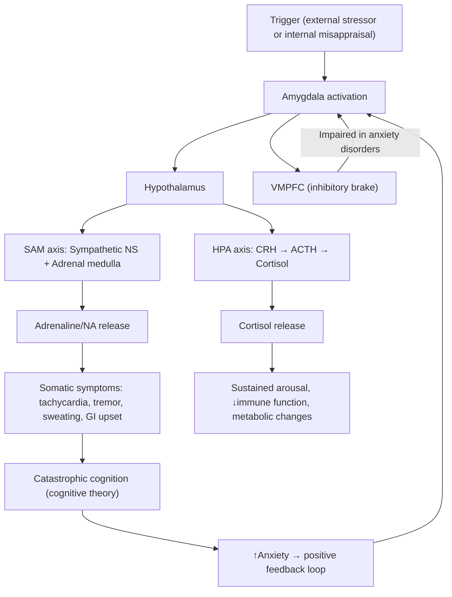

# Generalized Anxiety Disorder (GAD) & Anxiety Disorders

## 1. Definition

**Anxiety** is a normal emotional response characterised by a subjective sense of unease, dread, or apprehension accompanied by a constellation of autonomic and somatic symptoms. It becomes pathological — an **anxiety disorder** — when it is **excessive in degree, prolonged in duration, and causes significant functional impairment or distress** disproportionate to any actual threat [1][2].

Breaking down the terminology:
- "Anxiety" derives from Latin *anxietas* ("to choke, to distress") — quite literally the feeling of being squeezed or suffocated.
- "Generalised" means the anxiety is **continuous and not restricted to particular circumstances** (contrast with phobic anxiety, which is intermittent and situational).

***Generalised Anxiety Disorder (GAD)*** is specifically defined as a condition characterised by **excessive, uncontrollable worry about a variety of everyday topics** (often described as "free-floating anxiety"), persisting for **most days over at least 6 months** (DSM-5) or a period of weeks (ICD-10/11), accompanied by psychological and somatic symptoms of arousal [1][2].

<Callout title="Key Distinction">
There is ***no clear dividing line between GAD and normal anxiety*** [2]. The diagnosis rests on the anxiety being **more severe (extent), more prolonged (duration), and causing significant impairment or distress** compared with usual worry. This is a clinical judgement, not a binary cut-off.
</Callout>

---

## 2. Epidemiology

### 2.1 Prevalence and Burden

- ***Lifetime prevalence ~4.3–5.9%*** in European populations [1].
- In Hong Kong, community studies suggest anxiety disorders collectively affect ~4–8% of the adult population, with GAD being one of the most common presentations in primary care and psychiatric outpatient clinics.
- GAD is one of the **most common psychiatric disorders encountered in general practice** — patients often present with somatic complaints rather than declaring "I'm anxious."

### 2.2 Demographics

- ***M:F ≈ 1:2*** — females are roughly twice as likely to be affected [1].
- ***Median age of onset ~30 years*** — notably **later than other anxiety disorders** (specific phobias typically onset in childhood, social phobia in adolescence, panic disorder in early adulthood) [1].
- ***More common in socially disadvantaged groups***: including those with **↓income, unemployment, divorce, separation** [1].
- In Hong Kong specifically, contributing social stressors include high housing costs, academic pressure, long working hours, and the cultural stigma surrounding mental health help-seeking.

### 2.3 Associated Comorbidities

This is extremely high yield. GAD rarely travels alone:

- ***Depression***: The most important comorbidity. May present as mixed anxiety-depressive disorder (MADD) or comorbid major depressive disorder (MDD). Comorbid depression is ***associated with ↑severity, ↑functional impairment, and ↑duration of illness*** [1].
- ***Other anxiety disorders*** [1]:
  - Social phobia: **23.2–34.4%** comorbidity
  - Specific phobia: **24.5–35.1%** comorbidity
  - Panic disorder: **22.6–23.5%** comorbidity
- ***Other associations: substance abuse (SA), OCD, PTSD, chronic physical illness, medically unexplained symptoms*** [1].

<Callout title="Clinical Pearl" type="idea">
When you diagnose GAD, always screen for depression (and vice versa). The two conditions share genetic vulnerability and neurotransmitter pathways. Up to 60–70% of GAD patients will have a lifetime episode of MDD.
</Callout>

---

## 3. Relevant Neuroanatomy and Function

Understanding anxiety requires understanding the **fear circuitry** — the neural architecture that evolved to detect and respond to threat.

### 3.1 The Amygdala — The "Alarm System"

- The **amygdala** is a bilateral almond-shaped nucleus (*amygdala* = Greek for "almond") in the medial temporal lobe.
- It is the **central hub that activates the anxiety/fear response** via several downstream pathways [3]:
  - **→ Hypothalamus** (autonomic activation: tachycardia, sweating, GI disturbance)
  - **→ Periaqueductal grey** (freezing behaviour, pain modulation)
  - **→ Locus coeruleus** (noradrenaline release → arousal, hypervigilance)
  - **→ Cortical areas** (conscious perception of fear)

### 3.2 The Hypothalamus — The "Command Centre"

- ***Dorsomedial hypothalamus/perifornical region*** coordinates rapid mobilisation of **behavioural, autonomic, respiratory, and endocrinological responses to stress** [3].
- Activates the **HPA axis** (hypothalamic–pituitary–adrenal):
  - Hypothalamus releases CRH → anterior pituitary releases ACTH → adrenal cortex releases **cortisol**
  - Cortisol sustains the stress response, increases blood glucose, suppresses immune function.
- Also activates the **sympatho-adrenal-medullary (SAM) axis**:
  - Sympathetic nervous system → adrenal medulla releases **adrenaline and noradrenaline**
  - This produces the classic "fight-or-flight" response.

### 3.3 Other Key Structures

- ***Insula***: Interoceptive awareness — processes internal body signals (heartbeat, gut feelings). Hyperactivity here may explain why anxious patients are excessively aware of bodily sensations [3].
- ***Dorsal anterior cingulate cortex (dACC)***: Conflict monitoring and error detection — drives the "something is wrong" feeling [3].
- ***Ventromedial prefrontal cortex (VMPFC)***: Acts as a **regulatory inhibitory role** — essentially the "brake" on the amygdala. When VMPFC function is impaired, the amygdala runs unchecked → persistent anxiety [3].

### 3.4 Key Neurotransmitters

| Neurotransmitter | Role in Anxiety | Clinical Relevance |
|---|---|---|
| ***Serotonin (5-HT)*** | Modulates mood, anxiety, fear circuits | SSRIs increase 5-HT → first-line treatment |
| ***Noradrenaline (NA)*** | Drives arousal, hypervigilance, fight-or-flight | SNRIs target NA; beta-blockers block peripheral NA effects |
| ***GABA*** | Major inhibitory neurotransmitter — "calms" neural activity | Benzodiazepines enhance GABA → rapid anxiolysis |
| ***Glutamate*** | Major excitatory neurotransmitter | Imbalance may contribute to anxiety pathophysiology |
| ***CRH/Cortisol*** | Stress hormone axis | Chronic cortisol elevation → hippocampal atrophy, sustained anxiety |

<Callout title="First Principles: Why Does Anxiety Cause Physical Symptoms?">
The amygdala activates the hypothalamus → SAM axis and HPA axis → adrenaline/cortisol release → **tachycardia** (β1 cardiac stimulation), **tremor** (β2 skeletal muscle), **sweating** (sympathetic cholinergic), **dry mouth** (sympathetic vasoconstriction of salivary glands), **GI upset** (parasympathetic withdrawal reduces peristalsis, blood diverted away from gut), **urinary frequency** (detrusor hyperactivity), **hyperventilation** (respiratory centre stimulation → respiratory alkalosis → paraesthesiae, light-headedness). Every somatic symptom of anxiety traces back to autonomic activation.
</Callout>

---

## 4. Aetiology (with Hong Kong Focus)

The aetiology of anxiety disorders follows the classic **biopsychosocial model**. Think of it as a matrix of predisposing, precipitating, and perpetuating factors across biological, psychological, and social domains.

### 4.1 Biological Factors

#### 4.1.1 Genetics

- ***Genes play a significant yet moderate role*** in GAD aetiology [2].
- ***Twin studies: MZ > DZ concordance rate***, but results are inconsistent — heritability estimated at ~30–40% [2][3].
- For **panic disorder**, the inherited risk is approximately ***40%*** with a ***5× risk in first-degree relatives*** [3].
- ***GAD shares heritability with other anxiety disorders, major depression, and neurotic personality*** [2] — this explains the massive comorbidity overlap.
- **Specific gene candidates** [2][3]:
  - **5-HT transporter polymorphism** (SLC6A4): short allele → ↓serotonin reuptake capacity → ↑vulnerability to stress
  - **Glutamic acid decarboxylase (GAD) polymorphism**: GAD enzyme converts glutamate → GABA; variants may lead to ↓GABA production → ↑excitatory tone
  - **COMT** (catechol-O-methyltransferase): degrades catecholamines; Val/Met polymorphism affects dopamine/NA clearance in prefrontal cortex [3]
  - **TMEM132D**: transmembrane protein implicated in panic disorder [3]

#### 4.1.2 Neurobiological Changes in Anxiety Disorders

For GAD:
- Functional neuroimaging shows **hyperactivity of amygdala and insula** with **reduced VMPFC inhibitory control**.
- ↓GABA levels in cortex on MR spectroscopy.

For **panic disorder** specifically [3]:
- ***Structural: inconsistent changes in volumes of amygdala and cingulate cortex***
- ***Functional: abnormalities in baseline perfusion and during panic provocation in various elements of fear-related circuitry***
- ***Neurotransmitters: ↓cortical 5-HT1A binding, ↓cortical GABA levels***

### 4.2 Psychological Factors

#### 4.2.1 Personality Factors

- ***Neuroticism***: associated with ***poor stress resilience, manifests as ↑reactivity to life stressors*** [3]. Neuroticism is the single strongest personality predictor of anxiety disorders.
- ***↑Anxiety sensitivity***: the ***fear of anxiety symptoms and catastrophic cognition regarding bodily sensations*** (e.g., ***misattribution of rapid heartbeat as heart attack***) [3]. This is particularly relevant in panic disorder but also plays a role in GAD.
- Trait worry and intolerance of uncertainty are core psychological vulnerabilities in GAD.

#### 4.2.2 Cognitive Theories

***Cognitive theory of a downward spiral of anxiety in panic attacks*** [3]:
1. ***Fears about serious physical or mental illness are more frequent among patients who experience panic attacks than among anxious patients who do not have panic attacks***
2. ***Anxiety → physical symptoms of anxiety → activates fears of illness → generates ↑anxiety***
3. ***'Safety behaviours' (e.g., avoidance) prevent disconfirmation of these fears*** — the patient never learns that the feared catastrophe does not actually occur.

For GAD specifically, **Dugas's Intolerance of Uncertainty Model** proposes that GAD patients have a core inability to tolerate ambiguity → they engage in chronic worry as a (maladaptive) coping strategy to "prepare" for potential negative outcomes.

**Borkovec's Avoidance Theory of Worry**: Worry is actually a *cognitive avoidance* strategy — by worrying in words/thoughts, patients avoid the more distressing somatic and imagistic components of anxiety. This paradoxically maintains the disorder.

#### 4.2.3 Behavioural Theories

- **Classical conditioning**: A neutral stimulus becomes associated with fear (e.g., a supermarket where a panic attack occurred becomes a conditioned stimulus).
- **Operant conditioning**: Avoidance of the feared situation reduces anxiety (negative reinforcement), strengthening avoidance behaviour.
- **Mowrer's Two-Factor Theory**: Combines classical conditioning (acquisition of fear) and operant conditioning (maintenance through avoidance).

### 4.3 Social Factors

#### 4.3.1 Developmental Factors

- ***Early adverse experience is more common in panic disorder*** [3].
- Examples: ***History of physical or sexual abuse, smoking in childhood, asthma*** [3].
- Childhood adversity (neglect, emotional abuse, parental psychopathology) is strongly associated with GAD.
- **Attachment theory**: Insecure attachment styles (anxious-preoccupied) predispose to anxiety disorders.

#### 4.3.2 Life Stress

- ***Life stress*** is a significant precipitant [3].
- Acute stressors (job loss, bereavement, relationship breakdown) can precipitate GAD onset.
- Chronic stressors (financial difficulties, caregiving burden, chronic illness) are particularly relevant for maintaining GAD.

#### 4.3.3 Hong Kong–Specific Social Factors

- **Academic pressure**: Hong Kong's education system is highly competitive — anxiety is extremely prevalent among secondary school and university students.
- **Housing stress**: Among the world's least affordable housing → chronic financial and spatial stress.
- **Work culture**: Long working hours, job insecurity in certain sectors, high cost of living.
- **Cultural factors**: Mental health stigma remains significant in Chinese culture — patients often present with somatic complaints ("somatisation") rather than psychological symptoms. The term "neurasthenia" (神經衰弱) is still culturally recognised and may be a more acceptable way for patients to express anxiety/depression.
- **COVID-19 legacy**: Pandemic-related anxiety, social isolation, and economic uncertainty have contributed to increased anxiety disorder prevalence.
- **Political and social stressors**: Events since 2019 have been associated with increased population-level anxiety and depression in Hong Kong.

<Callout title="Hong Kong Clinical Pearl" type="idea">
In Hong Kong, always consider the presentation of anxiety through a **somatisation lens**. Patients may describe chest tightness (胸悶), dizziness (頭暈), insomnia (失眠), poor appetite (食慾不振), or generalised aches without volunteering psychological symptoms. Ask specifically about worry and psychological distress — it may not be offered spontaneously.
</Callout>

---

## 5. Classification of Anxiety Disorders

### 5.1 ICD-10 Classification (Referenced in HKU Teaching)

***Classification of anxiety disorders (ICD-10)*** [1]:

**A. Phobic Anxiety Disorders** — anxiety is ***intermittent and arising in particular circumstances***:
- ***Agoraphobia***: triggered by ***situations where escape is difficult, e.g., away from home, crowded, confined***
  - ***ICD-10: specified with or without panic disorder***
  - ***DSM-5: panic disorder, if present, is coded as comorbidity***
- ***Social phobia***: triggered by ***social situations***
- ***Specific phobia***: triggered by ***specific objects/situations***

**B. Other Anxiety Disorders** — anxiety is ***not related to particular circumstances***:
- ***Panic disorder***: anxiety is ***intermittent but not related to particular circumstances***
- ***GAD***: anxiety is ***continuous***
- ***Mixed anxiety-depressive disorder (MADD)***: ***both anxiety and depressive features are present and similarly prominent***
  - ***Only present in ICD-10, diagnosed when not meeting criteria for both conditions***

### 5.2 ICD-11 / DSM-5 Updates (2025 Framework)

The ICD-11 (implemented from 2022) has restructured anxiety disorders:
- **Separation Anxiety Disorder** and **Selective Mutism** now included under anxiety disorders (previously under childhood disorders).
- **OCD** and **PTSD** have been removed from anxiety disorders and placed in their own categories.
- **Agoraphobia** is no longer subordinate to panic disorder in DSM-5/ICD-11.

| Disorder | Nature of Anxiety | Key Feature |
|---|---|---|
| GAD | Continuous, free-floating | Excessive worry about multiple topics |
| Panic Disorder | Episodic, unprovoked | Recurrent unexpected panic attacks |
| Agoraphobia | Situational | Fear of situations where escape is difficult |
| Social Anxiety Disorder | Situational (social) | Fear of scrutiny/embarrassment in social situations |
| Specific Phobia | Situational (specific) | Fear of specific object or situation |
| Separation Anxiety Disorder | Situational | Excessive fear of separation from attachment figures |

---

## 6. Clinical Features

### 6.1 Symptoms

Clinical features of GAD are classically divided into **psychological** and **somatic** (physical) symptoms. The key teaching point: *every somatic symptom can be traced to autonomic nervous system activation*.

#### 6.1.1 Psychological Symptoms

| Symptom | Pathophysiological Basis |
|---|---|
| ***Worry/apprehension: generally excessive and persistent compared with normal people*** [1] | Prefrontal cortex overactivity with rumination; ↓VMPFC inhibition of amygdala |
| ***Content: generally widespread and not focused on a specific issue ('trivial' worries)*** [1] | "Free-floating" anxiety — not anchored to a specific threat; reflects generalised threat appraisal |
| ***Irritability*** [1] | Chronic autonomic arousal → ↓frustration tolerance; amygdala hyperactivity lowers threshold for negative emotional responses |
| ***Poor concentration*** [1] | Attentional resources hijacked by worry; prefrontal "bandwidth" consumed by threat monitoring |
| ***Sensitivity to noise*** [1] | Heightened sensory processing due to locus coeruleus–noradrenaline system hyperactivation → hypervigilance |
| Feeling on edge / restlessness | Sustained sympathetic activation → inability to relax |
| Sleep disturbance (initial insomnia, frequent waking) | Arousal system (reticular activating system, noradrenaline) remains active → difficulty transitioning to sleep |
| Fear of losing control or "going crazy" | Catastrophic misinterpretation of anxiety symptoms (cognitive model) |

<Callout title="Important Distinction" type="error">
***Try to distinguish between poor concentration vs poor memory*** [1]. ***Dementia may present with anxiety as first presentation (BPSD)*** [1]. In an elderly patient presenting with anxiety and apparent cognitive complaints, always consider whether the primary problem is actually a neurodegenerative process. A formal cognitive assessment (e.g., MoCA) is essential.
</Callout>

#### 6.1.2 Somatic (Physical) Symptoms

These are the symptoms that bring patients to the GP or ED rather than to psychiatry. They are mediated by **sympathetic nervous system activation** and **HPA axis hyperactivation**.

***Somatic features of GAD*** [1]:

| System | Symptom | Pathophysiological Mechanism |
|---|---|---|
| **Cardiovascular** | Palpitations, tachycardia | β1-adrenergic stimulation of sinoatrial node → ↑heart rate |
| | Chest pain/tightness | Intercostal muscle tension; oesophageal spasm; hyperventilation-induced coronary vasospasm |
| **Respiratory** | Dyspnoea, sighing | Medullary respiratory centre stimulation → ↑respiratory rate |
| | Hyperventilation | ↑Respiratory rate → ↓pCO2 → respiratory alkalosis → cerebral vasoconstriction → dizziness, paraesthesiae |
| **GI** | Dry mouth | Sympathetic activation → vasoconstriction of salivary gland blood supply; ↓parasympathetic salivation |
| | Nausea, "butterflies" | Vagal activation; blood diversion away from splanchnic circulation |
| | Diarrhoea / frequency | ↑Gut motility from parasympathetic activation (NB: GI system has complex dual innervation — both sympathetic inhibition and parasympathetic stimulation can occur) |
| | Difficulty swallowing ("globus") | Pharyngeal muscle tension |
| **Musculoskeletal** | Muscle tension, aches | Sustained motor neuron activation → chronic muscle contraction → pain |
| | Tremor | β2-adrenergic stimulation of skeletal muscle |
| | Tension headache | Sustained contraction of temporalis, frontalis, and cervical muscles |
| **Neurological** | Dizziness, light-headedness | Hyperventilation → ↓pCO2 → cerebral vasoconstriction |
| | Paraesthesiae (tingling, numbness) | Respiratory alkalosis → ↓ionised calcium (more calcium binds to albumin at alkalotic pH) → neuronal hyperexcitability |
| | Blurred vision | Sympathetic mydriasis; ciliary muscle tension |
| **Genitourinary** | Urinary frequency | Detrusor muscle irritability from autonomic dysregulation |
| | Erectile dysfunction | Sympathetic dominance inhibits parasympathetic-mediated erection |
| **Autonomic** | Sweating | Sympathetic cholinergic fibres to eccrine sweat glands |
| | Hot flushes / cold chills | Vasomotor instability from autonomic dysregulation |
| **General** | Fatigue | Chronic arousal → sympathetic exhaustion; cortisol dysregulation; poor sleep quality |

<Callout title="Why Hyperventilation Causes Paraesthesiae — First Principles">
Anxiety → hyperventilation → blows off CO2 → respiratory alkalosis (↑pH) → at higher pH, more H+ dissociates from albumin → albumin has increased negative charge → albumin binds more Ca²⁺ → ↓free ionised calcium → neuronal membrane hyperexcitability → paraesthesiae (especially perioral and distal extremities) and even tetany (Trousseau's sign, Chvostek's sign in severe cases). This is why anxious patients get tingling in their fingers and around their lips.
</Callout>

### 6.2 Signs (On Examination)

| Sign | Mechanism |
|---|---|
| Tachycardia (resting HR > 100) | Sympathetic β1 stimulation |
| Elevated blood pressure | Sympathetic vasoconstriction + ↑cardiac output |
| Tremor (fine, postural) | β2-adrenergic stimulation of skeletal muscle |
| Sweating (palms, axillae) | Sympathetic cholinergic activation of eccrine glands |
| Hyperreflexia | Generalised CNS hyperexcitability |
| Sighing respiration | Attempt to "reset" breathing pattern during hyperventilation |
| Restlessness / fidgeting | Motor manifestation of arousal — unable to sit still |
| Tense, furrowed brow / anxious facies | Sustained frontalis/corrugator muscle contraction |
| Dry mouth (if examined) | Sympathetic-mediated salivary gland vasoconstriction |
| Cold, clammy hands | Peripheral vasoconstriction + sweating |

On **mental state examination (MSE)**:
- **Appearance/Behaviour**: Restless, fidgeting, poor eye contact, tense posture, wringing hands
- **Speech**: May be rapid, pressured, or hesitant
- **Mood**: "Anxious," "worried," "on edge" (subjective); objectively anxious
- **Thought**: Content — worries about multiple domains (health, finances, family, work); Form — may show circumstantiality (going round and round the same worries)
- **Perception**: Usually normal (distinguish from psychotic anxiety); may report depersonalisation/derealisation during panic
- **Cognition**: Subjectively impaired concentration; formal testing usually normal (distinguishing from dementia)
- **Insight**: Usually preserved — patients recognise their worry is excessive but cannot control it

---

## 7. Panic Attacks — A Special Note

A **panic attack** is a discrete episode of intense fear or discomfort that reaches a peak within minutes, accompanied by ≥4 of 13 characteristic symptoms (DSM-5):

1. Palpitations
2. Sweating
3. Trembling
4. Shortness of breath
5. Choking sensation
6. Chest pain
7. Nausea
8. Dizziness
9. Chills or hot flushes
10. Paraesthesiae
11. Derealisation/depersonalisation
12. Fear of losing control
13. Fear of dying

**Panic attacks can occur in any anxiety disorder (and indeed in other psychiatric and medical conditions)**. A panic attack is NOT the same as panic disorder.

***Panic disorder*** requires **recurrent, unexpected** panic attacks + persistent concern about future attacks or maladaptive behavioural change (e.g., avoidance) for ≥1 month.

---

## 8. Physical Illness Mimicking Anxiety

This is a critical clinical point. ***Some physical illnesses tend to have anxiety as part of their symptomatology*** [2]:

| Condition | Key Features | Distinction from Primary Anxiety |
|---|---|---|
| ***Thyrotoxicosis*** | ***Associated with constant anxiety*** but ***other signs should be obvious*** (weight loss, heat intolerance, tremor, exophthalmos, goitre, tachycardia/AF) [2] | Check TFTs |
| ***Phaeochromocytoma*** | ***Associated with episodic anxiety*** → ***more likely to mimic phobic disorder or panic disorder*** [2] | Episodic hypertension, headache, sweating, pallor; 24h urine catecholamines |
| ***Hypoglycaemia*** | ***Associated with episodic anxiety*** → ***more likely to mimic phobic disorder or panic disorder*** [2] | Tremor, sweating, confusion, relieved by glucose; check capillary glucose |
| Cardiac arrhythmias (SVT, AF) | Palpitations, dizziness, chest discomfort | ECG |
| Temporal lobe epilepsy | Episodic fear, déjà vu, automatisms | EEG |
| Asthma/COPD | Dyspnoea, chest tightness | PFTs, SpO2 |
| Substance use/withdrawal | Alcohol withdrawal, caffeine excess, stimulant use, benzodiazepine withdrawal | Drug history, toxicology |

<Callout title="Clinical Pearl" type="error">
***Anxiety may be secondary to distressing symptoms of medical conditions. Mis-attributing these symptoms to anxiety may lead to failure to recognize medical conditions*** [2]. Always perform a basic medical screen (TFTs, FBC, glucose, ECG) before diagnosing a primary anxiety disorder, especially in first presentations or atypical features.
</Callout>

***A useful clinical trick: asking whether anxious patients with physical symptoms know anyone who has had similar symptoms is a useful way to distinguish between anxiety-induced and genuine physical symptoms*** [2]. If the patient says "My uncle had a heart attack with similar chest pain," their anxiety may be driven by catastrophic cognition rather than organic disease — but you still need to rule out the organic cause.

---

## 9. Distinguishing Anxiety from Other Mental Illnesses

***Anxiety may be secondary to distress due to other psychopathologies, e.g., manic symptoms, psychotic symptoms, or as part of symptomatology of other mental illnesses, e.g., psychotic disorder, dementia*** [2].

***Anxiety disorders are generally not diagnosed if it can be fully explained by other mental disorders, and does not occur outside of duration of other psychopathologies*** [2].

For example:
- A patient with schizophrenia may be anxious due to persecutory delusions → this is not GAD.
- A patient with mania may appear agitated and restless → this is not an anxiety disorder.
- A patient experiencing alcohol withdrawal with tremor and tachycardia → this is substance-induced anxiety.

***Substance/medication-induced anxiety symptoms that are present most severely in the morning (when withdrawal is typically most severe) may be due to effects of a substance*** [2]. This is a useful temporal clue — ask when the anxiety is worst. Morning anxiety → consider substance withdrawal (especially alcohol, benzodiazepines).

---

## 10. Summary of the "Anxiety Pathway"

---

<Callout title="High Yield Summary">

**Definition**: GAD = excessive, persistent, free-floating worry about multiple topics, continuous (not situational), lasting ≥6 months (DSM-5), with psychological + somatic symptoms of arousal.

**Epidemiology**: Lifetime prevalence ~5%, F:M = 2:1, median onset ~30y, associated with social disadvantage. High comorbidity with depression (most important), other anxiety disorders, SA.

**Neuroanatomy**: Amygdala (alarm) → Hypothalamus (coordinator) → SAM + HPA axes. Insula (interoception), dACC (error detection), VMPFC (brake). Key neurotransmitters: 5-HT, NA, GABA.

**Aetiology**: Biopsychosocial — genetics (~30-40% heritability, shared with depression), neuroticism, anxiety sensitivity, cognitive catastrophising, safety behaviours (avoidance), life stress, early adversity.

**Classification (ICD-10)**: Phobic (agoraphobia, social, specific) vs Other (panic disorder, GAD, MADD).

**Clinical features**: Psychological (worry, irritability, poor concentration, noise sensitivity) + Somatic (every system — cardiovascular, respiratory, GI, MSK, neuro, GU, autonomic). All somatic symptoms trace to autonomic activation.

**Critical points**: (1) No clear line between normal anxiety and GAD — clinical judgement. (2) Always rule out physical causes (thyrotoxicosis = constant anxiety; phaeochromocytoma/hypoglycaemia = episodic anxiety mimicking panic). (3) Distinguish poor concentration (anxiety) from poor memory (dementia). (4) Morning anxiety → think substance withdrawal.

</Callout>

---

<ActiveRecallQuiz
  title="Active Recall - Anxiety (Definition, Epidemiology, Aetiology, Clinical Features)"
  items={[
    {
      question: "Name the ICD-10 classification of anxiety disorders, distinguishing the two main groups and listing the disorders within each.",
      markscheme: "Group 1 - Phobic anxiety disorders (intermittent, situational): agoraphobia (with/without panic), social phobia, specific phobia. Group 2 - Other anxiety disorders (not situational): panic disorder (intermittent, unprovoked), GAD (continuous), mixed anxiety-depressive disorder (ICD-10 only).",
    },
    {
      question: "Explain the cognitive theory of the panic attack 'downward spiral' and the role of safety behaviours.",
      markscheme: "Anxiety produces physical symptoms (e.g., tachycardia). Patient catastrophically misinterprets symptoms (e.g., believes they are having a heart attack). This generates more anxiety, creating a positive feedback loop. Safety behaviours (e.g., avoidance, carrying medications) prevent disconfirmation of feared catastrophe, perpetuating the cycle.",
    },
    {
      question: "Why does hyperventilation in anxiety cause perioral and digital paraesthesiae? Explain from first principles.",
      markscheme: "Hyperventilation blows off CO2 causing respiratory alkalosis (raised pH). At higher pH, H+ dissociates from albumin, increasing albumin negative charge which binds more ionised Ca2+. Decreased free ionised calcium causes neuronal membrane hyperexcitability, manifesting as paraesthesiae especially perioral and distal extremities.",
    },
    {
      question: "Name 3 physical illnesses that can mimic anxiety and describe how each typically presents.",
      markscheme: "1. Thyrotoxicosis: constant anxiety with weight loss, heat intolerance, tremor, goitre, AF. 2. Phaeochromocytoma: episodic anxiety mimicking panic disorder with hypertension, headache, sweating, pallor. 3. Hypoglycaemia: episodic anxiety mimicking panic with tremor, sweating, confusion, relieved by glucose. Others acceptable: cardiac arrhythmias, TLE, substance withdrawal.",
    },
    {
      question: "Describe the key neuroanatomical structures in the fear circuit and their specific roles in generating and modulating anxiety.",
      markscheme: "Amygdala: central alarm, activates fear response. Hypothalamus (dorsomedial/perifornical): coordinates behavioural, autonomic, respiratory, endocrine stress responses. Insula: interoceptive awareness of body signals. Dorsal ACC: conflict monitoring/error detection. VMPFC: inhibitory brake on amygdala - impaired in anxiety disorders. Locus coeruleus: noradrenaline release for arousal.",
    },
    {
      question: "What clinical feature helps distinguish anxiety-related cognitive complaints from early dementia, and why is this important?",
      markscheme: "Distinguish poor concentration (anxiety - attentional resources diverted by worry, formal testing usually normal) from poor memory (dementia - genuine encoding/retrieval deficit, abnormal on cognitive screening e.g. MoCA). Important because dementia may present with anxiety as first presentation (BPSD). Formal cognitive assessment is essential in elderly patients presenting with anxiety.",
    },
  ]}
/>

## References

[1] Senior notes: Ryan Ho Psychiatry.pdf (p173 — GAD classification, epidemiology, clinical features)
[2] Senior notes: Ryan Ho Psychiatry.pdf (p175 — Aetiology of GAD, physical illness mimicking anxiety, distinguishing from other mental illnesses)
[3] Senior notes: Ryan Ho Psychiatry.pdf (p180 — Aetiology of panic disorder, neurobiological factors, cognitive theories)
