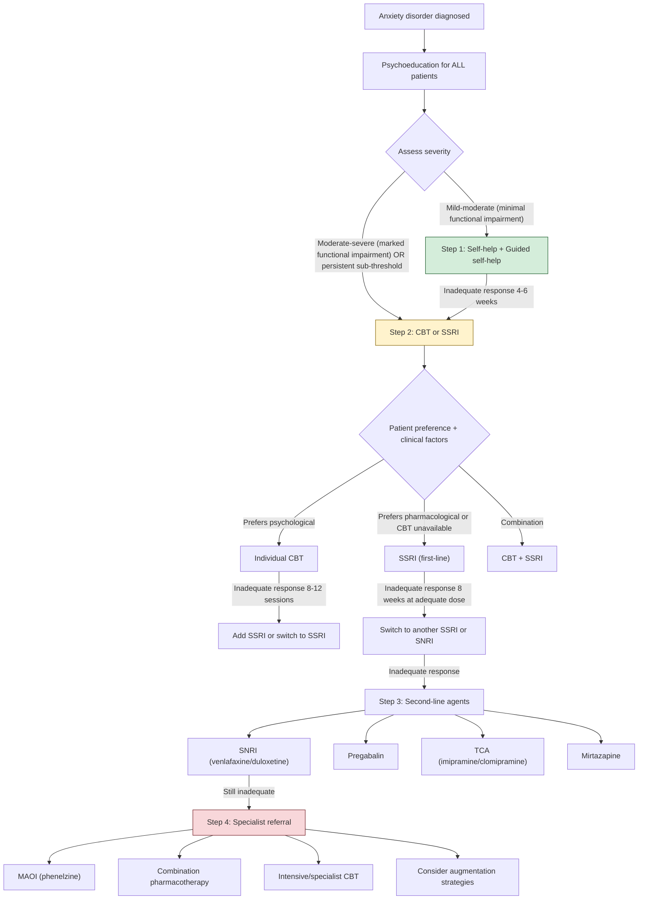

## Management of Anxiety Disorders

### 1. Principles of Management

Before diving into specific treatments, let's establish the fundamental principles that guide anxiety management. Think of it as a framework with three layers:

1. **Psychoeducation** — the foundation of everything. If the patient doesn't understand what's happening in their body and brain, no treatment will stick.
2. **Psychological therapy** — the definitive treatment that addresses the *maintaining mechanisms* (cognitive distortions, avoidance, safety behaviours).
3. **Pharmacotherapy** — modulates the neurochemical imbalance, particularly useful when severity precludes engagement with therapy or when therapy alone is insufficient.

The management approach follows a **stepped-care model** — start with the least intensive intervention appropriate to severity, and step up if insufficient response.

---

### 2. Management Algorithm — Overview

***Approach to management*** [15]:
- ***First-line: usually either CBT or SSRIs with various self-help strategies***
- ***Other drugs: other antidepressants (SNRIs, TCAs, MAOIs, mirtazapine), BZDs (alprazolam)***
- ***Other psychotherapy: anxiety management (relaxation training)***

The following algorithm integrates NICE (2020 updated), APA, and local HKU teaching [15][16]:

***Consider referral to secondary care if: risk of self-harm or suicide, marked self-neglect, non-response to at least two treatments, significant co-morbidity (e.g., substance use, physical health problems)*** [16]

---

### 3. Management by Specific Anxiety Disorder

The following table summarises the disorder-specific approach, derived from the lecture slides [16]:

| Disorder | Mild-Moderate | Moderate-Severe | Notes |
|---|---|---|---|
| ***GAD*** | ***Self-help*** | ***SSRI, individual CBT*** | ***2nd line: SNRI, pregabalin, TCA*** |
| ***Panic Disorder*** | ***Self-help*** | ***SSRI, individual CBT (with ERP)*** | ***2nd line: imipramine, phenelzine. PRN benzodiazepine can be considered*** [16] |
| ***Social Phobia*** | ***Self-help*** | ***SSRI, individual CBT*** | ***2nd line: SNRI, MAOI*** |
| ***Specific Phobia*** | ***Self-help*** | ***CBT (desensitisation, flooding, modelling)*** | Pharmacotherapy generally NOT effective for specific phobias |
| ***PTSD*** | — | ***Trauma-focused CBT, EMDR*** | ***Pharmacotherapy as augmentation or 2nd line: SSRIs, SNRIs, SGAs, prazosin*** [17] |
| ***OCD*** | ***Self-help*** | ***SSRI (higher doses), individual CBT with ERP*** | SSRIs often needed at higher doses than for depression |

---

### 4. Pharmacotherapy — Detailed

#### 4.1 First-Line: SSRIs (Selective Serotonin Reuptake Inhibitors)

**How SSRIs work — from first principles** [18]:

"SSRI" → "Selective Serotonin Reuptake Inhibitor" — the name tells you the mechanism:
- **Selective** = primarily targets serotonin (not noradrenaline or dopamine)
- **Reuptake** = the process by which serotonin is pumped back into the presynaptic neuron by the serotonin transporter (SERT)
- **Inhibitor** = blocks SERT → serotonin stays in the synaptic cleft longer → enhanced serotonergic neurotransmission

***Serotonin: blocking SERT to ↑synaptic availability, modulating actions of 5HT1-3, 7 receptors*** [18]

The therapeutic effect in anxiety is mediated primarily through:
- ***5HT1A receptor***: ***Regulates mood (primary target of antidepressants). Regulates adaptive response to stress*** [18]. Presynaptic 5HT1A autoreceptors at the raphe nucleus initially *downregulate* downstream 5HT release → ***slowly desensitized → accounts for delayed action of antidepressants*** [18]
- ***5HT2C receptor***: ***Regulates anxiety and feeding*** [18]

| SSRI | Typical Dose for Anxiety | Key Pharmacological Features |
|---|---|---|
| **Sertraline** | 50–200 mg/day | Preferred first choice; mild dopamine reuptake inhibition; safest in cardiac patients |
| **Escitalopram** | 10–20 mg/day | Most selective SSRI; dose-dependent QTc prolongation — max 20 mg (10 mg in elderly) |
| **Fluoxetine** | 20–60 mg/day | Longest half-life (active metabolite norfluoxetine ~7 days); potent CYP2D6 inhibitor → drug interactions |
| **Paroxetine** | 20–50 mg/day | Most potent SERT inhibition; worst withdrawal syndrome (shortest half-life among SSRIs); anticholinergic; weight gain |
| **Citalopram** | 20–40 mg/day | Dose-dependent QTc prolongation — max 40 mg (20 mg in elderly, hepatic impairment) |
| **Fluvoxamine** | 50–300 mg/day | Particularly used in OCD; potent CYP1A2 inhibitor |

**Practical prescribing points for anxiety:**

- ***Initiation: most result in ↑anxiety symptoms (apprehension, sleeplessness, palpitations) initially → dose should be increased very slowly*** [15]. This paradoxical initial worsening is because:
  - Early SERT blockade → ↑5HT in synapse → stimulates 5HT2A and 5HT2C receptors → ***mediates 5HT-related S/Es (sexual dysfunction, insomnia, activation, anxiety)*** [18]
  - The therapeutic effect requires desensitisation of presynaptic 5HT1A autoreceptors, which takes 2–4 weeks
  - **Start low, go slow**: In panic disorder particularly, start at half the usual dose (e.g., sertraline 25 mg, escitalopram 5 mg) and titrate up over 1–2 weeks
- ***Duration: usually maintained for ≥6 months to prevent relapse*** [15]. In practice, 12–18 months is recommended, and patients with recurrent anxiety may need long-term maintenance.
- **Onset of action**: 2–4 weeks for initial effect, 8–12 weeks for full effect. Warn patients.
- **Discontinuation**: Taper slowly over weeks to months to avoid discontinuation syndrome (dizziness, nausea, electric shock sensations "brain zaps," irritability, insomnia).

<Callout title="Why Do SSRIs Initially Worsen Anxiety?" type="error">
This is a classic exam question and a common clinical pitfall. When you first block SERT, serotonin floods the synapse. But not all serotonin receptors are "good." 5HT2A and 5HT2C activation causes anxiety, insomnia, and agitation. It takes 2–4 weeks for the presynaptic 5HT1A autoreceptors to desensitise, which then allows proper downstream serotonergic regulation. **Always warn patients** about this initial worsening and **consider short-term benzodiazepine cover** for the first 2 weeks if needed.
</Callout>

**SSRI Side Effects** (mechanism-based):

| Side Effect | Mechanism | Management |
|---|---|---|
| Nausea, GI upset | 5HT3 stimulation in GI tract (90% of body's 5HT is in gut) | Take with food; usually resolves in 1–2 weeks |
| Insomnia, agitation | 5HT2A/2C stimulation | Take in morning; short-term BZD cover |
| Sexual dysfunction | 5HT2A-mediated ↓DA in mesolimbic pathway; spinal 5HT effects on ejaculation | Common and persistent; consider switch to mirtazapine or bupropion augmentation |
| Weight gain | 5HT2C (long-term); histamine effects (paroxetine) | Monitor; dietary advice |
| Hyponatraemia (SIADH) | ↑ADH release; more common in elderly | Monitor Na⁺ in elderly; stop if symptomatic |
| QTc prolongation | Direct cardiac ion channel effect (citalopram, escitalopram) | Baseline ECG; dose limits |
| Serotonin syndrome | Excess serotonergic stimulation (especially with MAOIs, tramadol, triptans) | Avoid combination with MAOIs (washout ≥2 weeks); supportive treatment if occurs |
| GI bleeding | ↓platelet serotonin → impaired aggregation | Caution with NSAIDs/anticoagulants; consider PPI cover |

**Contraindications/Cautions:**
- **Absolute**: concurrent MAOI use (serotonin syndrome risk — potentially fatal)
- **Relative**: active GI bleeding, severe hepatic impairment, QTc > 500ms (for citalopram/escitalopram), pregnancy (paroxetine — teratogenic; others generally safer but risk-benefit analysis needed), breastfeeding

---

#### 4.2 Second-Line: SNRIs, Pregabalin, TCAs, Mirtazapine

##### 4.2.1 SNRIs (Serotonin-Noradrenaline Reuptake Inhibitors)

"SNRI" = blocks both SERT (serotonin transporter) and NET (noradrenaline transporter) → enhances both 5HT and NA neurotransmission.

| Drug | Dose | Key Features |
|---|---|---|
| **Venlafaxine** | 75–225 mg/day (XR formulation) | At lower doses mainly serotonergic; at higher doses (≥150 mg) dual action. Monitor BP (NA-mediated ↑BP in ~5%). Worst discontinuation syndrome of all antidepressants |
| **Duloxetine** | 60–120 mg/day | Balanced SNRI; also indicated for neuropathic pain, fibromyalgia. Lower risk of hypertension than venlafaxine |

**Why add noradrenaline?** Some patients with GAD have prominent fatigue, poor concentration, and psychomotor retardation that respond better to noradrenergic augmentation. NA also modulates the prefrontal cortex "top-down" inhibitory control of the amygdala.

##### 4.2.2 Pregabalin

- **Mechanism**: Binds to the α2δ subunit of voltage-gated calcium channels → ↓release of excitatory neurotransmitters (glutamate, noradrenaline, substance P) from hyperexcited neurons. It does NOT directly affect GABA receptors despite the name ("pre-gabalin").
- **Dose**: 150–600 mg/day in divided doses
- **Evidence**: Licensed for GAD in Europe (but not FDA-approved for GAD in the US). Rapid onset of anxiolytic effect (within 1 week, faster than SSRIs).
- **Side effects**: Dizziness, somnolence, weight gain, peripheral oedema, cognitive dulling.
- **Caution**: Abuse potential (now a controlled substance in UK since 2019); dose adjustment in renal impairment (renally excreted).

##### 4.2.3 TCAs (Tricyclic Antidepressants)

***Choice: SSRIs as 1st line, alternatives include TCAs (esp imipramine/clomipramine), MAOIs, mirtazapine, SNRI*** [15]

"TCA" = Tricyclic Antidepressant — named for the three-ring chemical structure. They block reuptake of both serotonin and noradrenaline (like SNRIs) but also have significant effects on histamine (H1), muscarinic (M1), and alpha-1 adrenergic receptors → more side effects.

| Drug | Specific Use | Key Features |
|---|---|---|
| ***Imipramine*** | ***Panic disorder (2nd line)*** [16] | Tertiary amine TCA; balanced 5HT/NA reuptake inhibition |
| ***Clomipramine*** | OCD, panic disorder | Most serotonergic TCA; particularly effective in OCD |

**Side effects** (mechanism-based):
- Anticholinergic (M1 blockade): dry mouth, constipation, urinary retention, blurred vision, cognitive impairment
- Antihistaminergic (H1 blockade): sedation, weight gain
- Anti-α1 adrenergic: postural hypotension, dizziness
- Cardiac: QTc prolongation, conduction abnormalities (Na⁺ channel blockade) → **lethal in overdose** (this is the critical reason TCAs are not first-line — a 2-week supply can be fatal if ingested at once)

**Contraindications**: Recent MI, heart block, mania, severe hepatic impairment. Use with extreme caution in patients with suicidal ideation (overdose lethality).

##### 4.2.4 Mirtazapine

- **Mechanism**: Noradrenergic and specific serotonergic antidepressant (NaSSA). Blocks presynaptic α2-autoreceptors (→ ↑NA and 5HT release) + blocks 5HT2A, 5HT2C, 5HT3 receptors + potent H1 antagonist.
- **Dose**: 15–45 mg at night
- **Why useful in anxiety**: Blocks 5HT2A/2C (the receptors responsible for SSRI-related anxiety and insomnia) → anxiolytic without initial worsening; potent H1 antagonism → sedation → excellent for patients with prominent insomnia.
- **Side effects**: Sedation (paradoxically *more* at lower doses because at 15 mg H1 blockade dominates; at higher doses noradrenergic effects counteract sedation), weight gain (H1 + 5HT2C blockade), ↑appetite, dry mouth. Rarely: agranulocytosis.
- **Advantage**: No sexual dysfunction (blocks 5HT2A); no initial anxiety worsening; good for underweight/anorexic patients.

##### 4.2.5 MAOIs (Monoamine Oxidase Inhibitors)

***2nd line: phenelzine*** [16]

- **Mechanism**: Irreversibly inhibits monoamine oxidase A and B → ↓degradation of 5HT, NA, DA → ↑synaptic availability of all monoamines.
- ***MAO: inhibiting MAO to ↑synaptic availability of all monoamines*** [18]
- **Drug**: **Phenelzine** — the MAOI most commonly used for anxiety, particularly social anxiety disorder and treatment-resistant panic disorder.
- **Side effects**: Postural hypotension, weight gain, sexual dysfunction, insomnia, peripheral neuropathy (pyridoxine deficiency).
- **Critical danger — Hypertensive crisis**: Tyramine in foods (cheese, red wine, cured meats, fermented products) is normally degraded by MAO-A in the gut wall. With MAO inhibition, ingested tyramine enters the systemic circulation → massive noradrenaline release → hypertensive crisis (severe headache, hypertension, potential stroke/death). This is known as the **"cheese reaction."**
- **Drug interactions**: Serotonin syndrome with SSRIs/SNRIs/TCAs/opioids (especially pethidine, tramadol). **Mandatory 2-week washout** between SSRI and MAOI (5 weeks for fluoxetine due to long-acting metabolite).
- **Contraindications**: Concurrent serotonergic drugs, phaeochromocytoma, hepatic impairment, cerebrovascular disease. Dietary restrictions make adherence difficult.

<Callout title="MAOI Dietary Restrictions — The Cheese Reaction">
Why cheese specifically? Tyramine is produced by bacterial decarboxylation of tyrosine during fermentation/ageing. MAO-A in the gut wall normally metabolises tyramine before it enters the systemic circulation. When MAO-A is inhibited: tyramine → enters circulation → displaces noradrenaline from vesicles in sympathetic nerve terminals → massive NA release → hypertensive crisis. Patients must avoid: aged cheese, red wine, cured/smoked meats, fermented soy products (soy sauce, miso — particularly relevant in Hong Kong), broad bean pods, yeast extracts (Marmite).
</Callout>

---

#### 4.3 Benzodiazepines — The Short-Term Option

***BZDs: effective in controlling panic attacks when given at ↑↑doses*** [15]

***NOT as primary treatment (usually an antidepressant), only as short-term Tx not more than 1 month*** [19]

**Mechanism** [19]:
- ***Work at GABAA-BDZ receptor complex on neuronal membrane***
- ***GABA-binding site at interface between α and β subunits***
- ***BDZ-binding site at interface between α and γ subunits***
- BZDs are **positive allosteric modulators** — they don't activate the GABA-A receptor themselves but increase the *frequency* of chloride channel opening when GABA binds → ↑Cl⁻ influx → neuronal hyperpolarisation → ↓neuronal excitability → anxiolysis, sedation, muscle relaxation, anticonvulsion.

| BZD | Half-Life | Use in Anxiety |
|---|---|---|
| ***Alprazolam*** | Short (~6–12h) | ***Most have sedative effect except alprazolam → commonly used to treat panic disorder in US*** [15]. High potency → effective for panic attacks but highest abuse potential and worst rebound anxiety |
| **Clonazepam** | Long (~18–50h) | Used for panic disorder; longer half-life → smoother anxiolysis with less interdose rebound |
| **Diazepam** | Long (~20–100h) | Classic anxiolytic; long half-life useful for smooth coverage but prolonged sedation in elderly |
| **Lorazepam** | Intermediate (~10–20h) | Preferred in hepatic impairment (no hepatic oxidative metabolism — only glucuronidated) |

***Effective to ↓pathological anxiety, agitation and tension*** [19]
***Prefer long-acting drugs to ↓withdrawal*** [19]
***Panic attacks may require high-potency agents (e.g., alprazolam, clonazepam)*** [19]

**Side effects:**
- Sedation, drowsiness, psychomotor impairment
- Cognitive impairment, amnesia
- Dependence (tolerance and withdrawal develop within 2–4 weeks of regular use)
- Withdrawal syndrome: rebound anxiety, insomnia, irritability, tremor, seizures (in severe cases)
- ***Paradoxical reaction ( < 1%): esp in ↓IQ, neurological disease, extremes of age and with Hx of aggression → may have unexpected ↑aggressive or impulsive behaviour*** [19]
- Respiratory depression (especially when combined with opioids or alcohol)

**Contraindications:**
- Acute narrow-angle glaucoma (anticholinergic-like effect on ciliary muscle)
- Severe respiratory insufficiency (respiratory depression)
- Sleep apnoea (worsens upper airway obstruction)
- Severe hepatic impairment (except lorazepam)
- Myasthenia gravis (worsens weakness)
- History of substance use disorder (high abuse potential)
- Pregnancy (teratogenic — cleft palate risk in first trimester; floppy infant syndrome in third trimester)

<Callout title="BZDs: The Clinical Rules" type="error">
***BZDs are NOT primary treatment for anxiety disorders*** [19]. They are a **bridge** — used for 2–4 weeks maximum while waiting for SSRIs to take effect, or for acute crisis management. The reasons:
1. **Tolerance**: anxiolytic effect diminishes within weeks
2. **Dependence**: physical dependence develops rapidly
3. **Cognitive impairment**: impairs new learning, which is essential for CBT to work
4. **Does not address maintaining factors**: masks symptoms without addressing the underlying cognitive/behavioural patterns
5. **Withdrawal**: can be worse than the original anxiety, creating a vicious cycle
In Hong Kong, BZD overuse in primary care is a recognised problem. Always have an exit strategy when prescribing.
</Callout>

---

#### 4.4 Other Pharmacological Options

| Drug | Mechanism | Role | Notes |
|---|---|---|---|
| **Buspirone** | 5HT1A partial agonist | GAD (particularly in patients who cannot tolerate SSRIs) | Slow onset (2–4 weeks); no sedation, no dependence, no withdrawal. Not effective for panic disorder. |
| **Hydroxyzine** | H1 antihistamine | Short-term anxiolysis in GAD | Sedating; useful for insomnia component. No dependence. QTc prolongation risk. |
| **Beta-blockers (propranolol)** | β-adrenergic blockade | Performance anxiety (e.g., public speaking); somatic symptoms of anxiety (tremor, palpitations) | Does NOT treat the *cognitive* component of anxiety — only blocks peripheral sympathetic manifestations. Not effective for GAD or panic disorder as monotherapy. |
| **Quetiapine (low dose)** | D2/5HT2A antagonist + H1 antagonist | Augmentation in treatment-resistant GAD | Off-label; metabolic side effects limit use. Evidence supports efficacy but not first/second line. |
| ***Prazosin*** | ***α1-adrenergic antagonist*** | ***Can ↓PTSD symptoms, nightmares, sleep disturbance*** [17] | Blocks NA-mediated hyperarousal during sleep. Monitor for first-dose hypotension. |

---

### 5. Psychological Therapies — Detailed

#### 5.1 Cognitive Behavioural Therapy (CBT)

CBT is the **gold standard psychological treatment** for all anxiety disorders [15][16][20].

***CBT: targets fears of physical effects of anxiety*** [15]
***Involves: pointing out sequence of physical symptoms leading to fear → question patient's belief in feared outcome*** [15]
***Efficacy: as effective as antidepressants in Tx of panic disorders, combination Tx may give better response in early stages but long-term results are uncertain*** [15]

**How CBT works in anxiety — First Principles:**

The cognitive-behavioural model of anxiety posits that anxiety is maintained by:
1. **Cognitive distortions**: Overestimation of threat probability and severity; underestimation of coping ability
2. **Avoidance/safety behaviours**: Prevent disconfirmation of feared catastrophe → anxiety never extinguishes
3. **Physiological hyperarousal**: Misinterpreted as evidence of danger → feeds the cycle

CBT directly targets all three:

| CBT Component | What It Does | Example in GAD | Example in Panic Disorder |
|---|---|---|---|
| **Psychoeducation** | Explains the anxiety cycle | "Your worry is your brain's alarm system being too sensitive — not a sign of danger" | "Your palpitations are adrenaline, not a heart attack" |
| **Cognitive restructuring** | Identifies and challenges catastrophic thoughts | "What is the evidence that you will lose your job?" → Socratic questioning | "What actually happened the last 50 times you had palpitations? You didn't die." |
| **Behavioural experiments** | Tests predictions in real-world situations | Gradually reducing "checking" behaviours | Deliberately inducing somatic sensations (interoceptive exposure) to demonstrate they are harmless |
| **Graded exposure** | Systematic confrontation of feared situations | Engaging with previously avoided activities | Entering crowded places without escape plan |
| **Relaxation/breathing training** | ↓Physiological arousal | Progressive muscle relaxation, diaphragmatic breathing | Controlled breathing to counteract hyperventilation |

**Format**: Typically 12–16 sessions of individual CBT, delivered weekly.

#### 5.2 Exposure-Based Techniques (Specific to Phobic Disorders)

***CBT (desensitisation, flooding, modelling)*** [16]:

| Technique | Description | Mechanism |
|---|---|---|
| **Systematic desensitisation** | Gradual exposure to feared stimulus in a hierarchy (least to most anxiety-provoking) while maintaining relaxation | Classical counter-conditioning (Wolpe) — relaxation is incompatible with anxiety. Also: habituation — repeated non-reinforced exposure → extinction of conditioned fear response |
| **Flooding** | Prolonged, intense exposure to the most feared stimulus without escape | Habituation — if you stay long enough, anxiety *must* come down (the autonomic system cannot sustain peak arousal indefinitely). Demonstrates that feared catastrophe does not occur |
| **Modelling** | Therapist or model demonstrates non-fearful interaction with feared stimulus | Vicarious learning (Bandura) — observing that no harm occurs to another reduces fear |
| ***Exposure and Response Prevention (ERP)*** | Exposure to obsessional trigger + prevention of compulsive response | Specific to OCD — breaks the reinforcement cycle of compulsion → anxiety relief |

#### 5.3 EMDR (Eye Movement Desensitisation and Reprocessing)

***Involves: pt imagines a scene from trauma, focusing on accompanying cognition and arousal, while the therapist moves two fingers across the patient's visual field and instructs the patient to track fingers → sequence repeated until anxiety decreases, with patient instructed to generate a more adaptive thought*** [17]

***Efficacy: most studies show that it is efficacious in PTSD, superior to other less specific psychotherapy*** [17]

#### 5.4 Other Psychological Approaches

| Approach | Description | Indication |
|---|---|---|
| ***Anxiety management techniques, e.g., relaxation training*** [15] | Progressive muscle relaxation, diaphragmatic breathing, mindfulness | Adjunctive to all anxiety disorders |
| ***Mindfulness-based cognitive therapy (MBCT)*** | ***Utilizes traditional CBT methods in conjunction with mindfulness and meditation. Mindfulness focuses on becoming aware of thoughts and feelings and accepting them, rather than reacting to them*** [20] | GAD, relapse prevention |
| **Applied relaxation** | Taught to identify early signs of anxiety and apply rapid relaxation techniques | GAD (comparable efficacy to CBT) |
| **Interpersonal therapy** | Focuses on improving interpersonal relationships and communication | When interpersonal stressors are primary |
| ***Counselling*** | ***For stressful life events, illnesses, bereavements*** [20] | Adjustment difficulties, mild anxiety |

---

### 6. Self-Help and Lifestyle Interventions

These form **Step 1** of the stepped-care model and should be offered to *all* patients regardless of severity:

| Intervention | Mechanism / Rationale |
|---|---|
| **Psychoeducation** | Understanding that anxiety is a *normal alarm system gone overboard* reduces the catastrophic interpretation of symptoms |
| **Guided self-help** (bibliotherapy, online CBT programs) | Structured CBT techniques delivered in workbook/digital format. Evidence supports efficacy for mild-moderate GAD. |
| **Regular aerobic exercise** | ↑Endorphins, ↑BDNF (neuroplasticity), ↓cortisol, ↑serotonin. Meta-analyses show moderate effect size for anxiety reduction. 30 min, 3–5×/week. |
| **Sleep hygiene** | Consistent sleep-wake times, avoiding screens before bed, limiting caffeine after noon. Poor sleep worsens anxiety (bidirectional relationship). |
| **Caffeine reduction** | Caffeine is an adenosine receptor antagonist → ↑sympathetic activation → ↑anxiety. Particularly important in panic disorder. |
| **Alcohol reduction** | Alcohol initially anxiolytic (GABA enhancement) but rebound anxiety on withdrawal. Chronic use → GABA-A receptor downregulation → worsens baseline anxiety. |
| **Breathing exercises** | Diaphragmatic breathing → activates vagus nerve → parasympathetic activation → ↓HR, ↓BP, ↓arousal. Directly counteracts hyperventilation-alkalosis-paraesthesiae cycle. |
| **Mindfulness meditation** | Strengthens VMPFC inhibition of amygdala → improved emotional regulation. Neuroimaging shows ↑VMPFC grey matter density after 8-week mindfulness programs. |

---

### 7. Special Populations

| Population | Considerations |
|---|---|
| **Elderly** | ↑Risk of hyponatraemia with SSRIs. ↓BZD metabolism → prolonged sedation, falls, cognitive impairment. Start at lower doses. Dementia must be excluded. |
| **Children/Adolescents** | CBT is first-line. If SSRI needed, fluoxetine or sertraline preferred. Monitor closely for suicidal ideation (FDA black box warning for under-25s). |
| **Pregnancy** | CBT is first-line. If medication needed, sertraline has best safety data. Avoid paroxetine (cardiac malformations), BZDs (teratogenic in T1, floppy infant in T3), MAOIs. |
| **Comorbid depression** | Treat both simultaneously. SSRIs/SNRIs treat both conditions. Combine with CBT. Actively assess suicide risk. |
| **Comorbid substance use** | Treat concurrently. Avoid BZDs (cross-dependence risk, especially with alcohol). SSRIs preferred. |

---

### 8. Treatment Monitoring and Duration

| Phase | Duration | Action |
|---|---|---|
| **Acute phase** | 0–12 weeks | Titrate SSRI to therapeutic dose; review at 2, 4, 8, 12 weeks; monitor side effects; assess with GAD-7 |
| **Continuation phase** | 6–12 months after remission | Maintain effective dose to prevent relapse |
| **Maintenance/tapering** | After continuation phase | Gradual taper over 1–3 months. If relapse → restart and consider longer-term maintenance. Patients with ≥3 episodes or chronic course may need indefinite treatment |

---

### 9. Treatment-Resistant Anxiety

If a patient has failed ≥2 adequate trials of first-line treatments (SSRIs/SNRIs at adequate doses for adequate duration, and/or CBT):

1. **Re-assess the diagnosis**: Is there an unrecognised comorbidity (depression, substance use, personality disorder, medical condition)?
2. **Re-assess adherence**: Is the patient taking the medication? Is there avoidance that prevents CBT engagement?
3. **Optimise current treatment**: Ensure adequate dose and duration before switching
4. **Augmentation strategies**: Add pregabalin, low-dose quetiapine, buspirone, or mirtazapine to SSRI/SNRI
5. **Switch class**: TCA (imipramine), MAOI (phenelzine) for treatment-resistant cases
6. **Specialist referral**: Intensive CBT, combined pharmacotherapy, inpatient treatment if severe functional impairment

---

<Callout title="High Yield Summary">

**Management principle**: Stepped care — psychoeducation/self-help → CBT or SSRI → SNRI/pregabalin/TCA → MAOI/specialist.

**First-line**: CBT and/or SSRI. ***First-line is usually either CBT or SSRIs with various self-help strategies*** [15].

**SSRIs in anxiety**: Start low, go slow (initial anxiety worsening due to 5HT2A/2C stimulation before 5HT1A desensitisation). Full effect takes 8–12 weeks. Maintain ≥6 months (ideally 12–18 months).

**BZDs**: Short-term bridge only (≤1 month). ***NOT as primary treatment*** [19]. Risk: tolerance, dependence, cognitive impairment, paradoxical aggression. Contraindicated in substance use disorders, respiratory insufficiency, pregnancy.

**Specific phobias**: CBT (desensitisation, flooding) is the mainstay. Medications generally NOT effective.

**PTSD**: Trauma-focused CBT or EMDR first-line. Pharmacotherapy is augmentation/second-line.

**CBT mechanism**: Targets cognitive distortions (catastrophising), safety behaviours (avoidance), and physiological arousal (relaxation). As effective as pharmacotherapy in panic disorder.

**MAOIs**: Last resort. Cheese reaction (tyramine → hypertensive crisis). Mandatory 2-week SSRI washout. Serotonin syndrome risk.

</Callout>

---

<ActiveRecallQuiz
  title="Active Recall - Management of Anxiety Disorders"
  items={[
    {
      question: "Explain why SSRIs initially worsen anxiety symptoms and how you manage this in clinical practice.",
      markscheme: "Initial SERT blockade increases synaptic serotonin which stimulates 5HT2A and 5HT2C receptors, causing anxiety, insomnia, and agitation. Therapeutic effect requires desensitisation of presynaptic 5HT1A autoreceptors at the raphe nucleus, which takes 2-4 weeks. Management: start at half the usual dose and titrate slowly; warn the patient; consider short-term benzodiazepine cover for 2 weeks.",
    },
    {
      question: "Describe the mechanism of action of benzodiazepines at the GABA-A receptor and explain why they are limited to short-term use in anxiety.",
      markscheme: "BZDs are positive allosteric modulators at the GABA-A/BZD receptor complex, binding at the interface of alpha and gamma subunits. They increase the frequency of chloride channel opening when GABA binds, causing neuronal hyperpolarisation and reduced excitability. Limited to short-term (no more than 1 month) because of: tolerance (anxiolytic effect diminishes), physical dependence, cognitive impairment (interferes with CBT), does not address maintaining cognitive/behavioural factors, and withdrawal can be worse than original anxiety.",
    },
    {
      question: "For each major anxiety disorder, state the first-line treatment approach for moderate-severe presentations.",
      markscheme: "GAD: SSRI or individual CBT. Panic disorder: SSRI or individual CBT with ERP. Social phobia: SSRI or individual CBT. Specific phobia: CBT (desensitisation/flooding) - pharmacotherapy NOT effective. PTSD: Trauma-focused CBT or EMDR; pharmacotherapy is augmentation/2nd line. OCD: SSRI (higher doses) or CBT with ERP.",
    },
    {
      question: "What is the cheese reaction associated with MAOIs? Explain the mechanism from first principles and name foods to avoid relevant to Hong Kong.",
      markscheme: "MAOIs inhibit MAO-A in the gut wall which normally degrades dietary tyramine. Unmetabolised tyramine enters systemic circulation, displaces noradrenaline from vesicles in sympathetic nerve terminals, causing massive NA release and hypertensive crisis (severe headache, hypertension, risk of stroke/death). Foods to avoid: aged cheese, red wine, cured/smoked meats, fermented soy products (soy sauce, miso, fermented tofu), broad bean pods, yeast extracts.",
    },
    {
      question: "Describe the three components of CBT for panic disorder and explain how each targets the panic cycle.",
      markscheme: "1. Psychoeducation: explains that somatic symptoms are adrenaline-driven, not signs of serious illness, breaking catastrophic misinterpretation. 2. Cognitive restructuring: identifies and challenges catastrophic thoughts (e.g. 'palpitations = heart attack') using Socratic questioning and evidence review. 3. Behavioural experiments/interoceptive exposure: deliberately inducing feared somatic sensations (e.g. hyperventilation, spinning) to demonstrate they are harmless, preventing avoidance/safety behaviours that maintain the cycle.",
    },
    {
      question: "List 3 contraindications to benzodiazepine use and explain the pharmacological basis for each.",
      markscheme: "1. Severe respiratory insufficiency: BZDs cause respiratory depression via GABA-mediated CNS depression of medullary respiratory centres. 2. History of substance use disorder: BZDs have high abuse potential due to rapid anxiolysis and euphoria; cross-dependence with alcohol (both act on GABA-A). 3. Pregnancy: teratogenic (cleft palate risk in first trimester from impaired palatal fusion); floppy infant syndrome in third trimester (neonatal CNS depression). Others acceptable: myasthenia gravis (worsens weakness), severe hepatic impairment (except lorazepam), acute narrow-angle glaucoma.",
    },
  ]}
/>

## References

[15] Senior notes: Ryan Ho Psychiatry.pdf (p181 — Panic disorder management: approach, pharmacotherapy, psychotherapy)
[16] Senior notes: Ryan Ho Psychiatry.pdf (p186 — Management of anxiety disorders table: stepped care by disorder and severity)
[17] Senior notes: Ryan Ho Psychiatry.pdf (p197 — PTSD management: trauma-focused CBT, EMDR, pharmacotherapy including prazosin)
[18] Senior notes: Ryan Ho Psychiatry.pdf (p35 — Antidepressant pharmacology: monoamine hypothesis, serotonin receptor subtypes, SERT blockade)
[19] Senior notes: Ryan Ho Psychiatry.pdf (p57 — Benzodiazepines: indications, mechanism of action, GABA-A receptor complex)
[20] Senior notes: Ryan Ho Psychiatry.pdf (p71 — Psychological therapies: CBT, EMDR, MBCT, indications table)
