## Differential Diagnosis of Back Pain

The differential diagnosis of back pain is broad. The clinical challenge is not to pinpoint every mechanical cause — it is to **triage** effectively: separate the benign from the dangerous, the mechanical from the inflammatory, and the spinal from the extra-spinal. Murtagh's diagnostic strategy framework provides an excellent scaffold for this [1].

---

### Murtagh's Diagnostic Strategy Framework

This is a structured approach to differential diagnosis used widely in general practice and clinical exams. It forces you to think in **layers of probability and danger** rather than just listing diseases randomly.

```mermaid
graph TD
    A["Back Pain Differential Diagnosis"] --> B["Probability Diagnosis<br/>~90% of cases"]
    A --> C["Serious Disorders<br/>Not to Be Missed"]
    A --> D["Pitfalls<br/>Often Missed"]
    A --> E["Masquerades Checklist"]
    A --> F["Is the Patient Trying<br/>to Tell Me Something?"]
    
    B --> B1["Vertebral dysfunction<br/>facet joint and disc"]
    B --> B2["Musculoligamentous<br/>strain/sprain"]
    B --> B3["Spondylosis<br/>degenerative OA"]
    
    C --> C1["Cardiovascular"]
    C --> C2["Neoplasia / Cancer"]
    C --> C3["Infection"]
    C --> C4["Other serious"]
    
    C1 --> C1a["Ruptured AAA"]
    C1 --> C1b["Retroperitoneal haemorrhage"]
    C2 --> C2a["Myeloma"]
    C2 --> C2b["Pancreatic cancer"]
    C2 --> C2c["Metastases"]
    C3 --> C3a["Vertebral osteomyelitis"]
    C3 --> C3b["Epidural / subdural abscess"]
    C3 --> C3c["Septic discitis"]
    C3 --> C3d["TB spondylitis"]
    C3 --> C3e["Pelvic abscess / PID"]
    C3 --> C3f["Pyelonephritis"]
    C4 --> C4a["Osteoporotic compression fracture"]
    C4 --> C4b["Cauda equina compression"]
    
    D --> D1["Spondyloarthropathies"]
    D --> D2["Sacroiliac dysfunction"]
    D --> D3["Spondylolisthesis"]
    D --> D4["Spinal canal stenosis"]
    D --> D5["Paget disease"]
    D --> D6["Prostatitis"]
    D --> D7["Endometriosis"]
    
    E --> E1["Depression"]
    E --> E2["Spinal dysfunction"]
    E --> E3["UTI"]
    
    F --> F1["Lifestyle / stress /<br/>work problems"]
    F --> F2["Malingering"]
    F --> F3["Conversion reaction"]
```

---

### 1. Probability Diagnosis (~90%)

These are the diagnoses you will encounter most frequently. They are "bread-and-butter" general practice.

#### ***a. Vertebral dysfunction especially facet joint and disc (mechanical pain)*** [1]

- This encompasses the vast majority of acute and chronic back pain presentations
- **Facet joint arthropathy**: synovial joint degeneration → local inflammation, capsular stretching → axial back pain, typically worse with extension and rotation, localised to one side
- **Discogenic pain**: internal disc disruption (annular tears, disc bulging) without frank herniation → pain from stimulation of nociceptors in the outer annulus fibrosus
- Pain is **provoked by activity and relieved by rest** — this is the hallmark of mechanical pain [1]

#### ***b. Musculoligamentous strain/sprain*** [1]

- Acute overloading of paraspinal muscles or spinal ligaments → micro-tears → localised inflammation → protective muscle spasm
- History of precipitating event (lifting, twisting, unaccustomed activity) is typical
- Examination shows paraspinal tenderness and spasm, no neurological deficit, full recovery expected within 2–6 weeks

#### ***c. Spondylosis (degenerative OA)*** [1][2]

- ***Degeneration (spondylosis): e.g. OA spine, facet joint arthritis*** [2]
- Age-related disc desiccation → loss of disc height → increased facet joint loading → cartilage degeneration and osteophyte formation
- Remember: radiological spondylosis is nearly universal in people over 60, but **imaging findings do NOT correlate well with symptoms** — many people with severe degenerative changes are asymptomatic

<Callout title="Key Diagnostic Tip from Lecture" type="idea">
***"Pain provoked by activity with relief at rest indicates mechanical (vertebral) dysfunction."*** [1]

This single principle helps you identify the ~90% of patients with a probability diagnosis. If the pain behaves mechanically, and there are no red flags or neurological deficits, you can be reasonably confident it is benign mechanical back pain.
</Callout>

---

### 2. Serious Disorders Not to Be Missed

These are the conditions that will harm or kill your patient if you miss them. They account for only ~5–10% of back pain presentations, but they are the reason we screen for **red flags** in every patient.

#### ***Cardiovascular*** [1]

##### ***Ruptured aortic aneurysm*** [1]
- **Why it presents as back pain**: the aorta lies on the anterior surface of the lumbar vertebral bodies; an expanding or ruptured AAA stretches the retroperitoneal tissues and directly irritates the lumbar periosteum and paraspinal structures → severe back and/or abdominal pain
- ***Classical triad: severe abdominal and/or back pain + hypotension + pulsatile abdominal mass*** [7]
- ***Can mimic a variety of diseases (30% misdiagnosed)*** [7]
- **Why it's dangerous**: if missed, mortality approaches 80–90% for ruptured AAA
- Think of it in any patient > 60 years, male, smoker, hypertensive with sudden-onset severe back/abdominal pain

##### ***Retroperitoneal haemorrhage (anticoagulants)*** [1]
- Patients on warfarin or DOACs can develop spontaneous bleeding into the retroperitoneal space → irritates lumbar plexus and paraspinal structures → back pain ± psoas sign (pain on hip extension)
- May present with acute back pain, falling haemoglobin, and haemodynamic instability
- Critical to check INR / coagulation profile in any anticoagulated patient with new back pain

#### ***Neoplasia / Cancer*** [1]

##### ***Myeloma*** [1]
- Most common primary bone malignancy in adults; median age ~70 years
- **Why it causes back pain**: malignant plasma cells infiltrate bone marrow → produce osteoclast-activating factors (RANKL, MIP-1α, TNF-β) → lytic bone destruction → pathological fractures → pain
- Suspect if: elderly patient + back pain + anaemia + elevated ESR/CRP + hypercalcaemia + renal impairment
- Vertebral body is the most common site of skeletal involvement

##### ***Pancreatic cancer*** [1]
- **Why it causes back pain**: the pancreas lies retroperitoneally against the lumbar spine; posterior pancreatic tumours (especially body/tail) directly invade or compress the coeliac/lumbar nerve plexus → deep, boring, constant back pain
- Often a late presentation → pain is ominous and usually signifies advanced/unresectable disease
- Associated features: weight loss, jaundice (if head of pancreas), new-onset diabetes

##### ***Metastases (e.g. lung, breast, prostate)*** [1][2]
- ***Tumor: primary, metastases (e.g. lung, breast, prostate)*** [2]
- The spine is the most common site for bone metastases because:
  1. Vertebral bodies have rich cancellous bone with high blood flow → ideal for tumour seeding
  2. **Batson's venous plexus** — a valveless venous network connecting pelvic/thoracic veins to the vertebral venous plexus — allows retrograde tumour emboli to bypass the caval/portal systems and directly reach the spine
- **Clinical pattern**: ***continuous pain (day and night) points to neoplasm (especially malignancy) or infection*** [1]
- Progressive, unrelenting, worse at night, not relieved by rest or positional changes

#### ***Infection*** [1][2]

##### ***Vertebral osteomyelitis*** [1]
- Haematogenous seeding of vertebral body (usually *Staphylococcus aureus*) → bone destruction → pain
- Risk factors: diabetes, immunosuppression, IVDU, recent bacteraemia, recent spinal procedure
- Presents with insidious back pain, fever, elevated inflammatory markers

##### ***Epidural / subdural abscess*** [1]
- Collection of pus in the epidural (or rarely subdural) space → mass effect on cord/cauda equina
- Progressive triad: back pain → radiculopathy → neurological deficit
- ***Red flags: fever, immunosuppression*** [2]
- A neurosurgical emergency — hours matter

##### ***Septic discitis*** [1]
- Infection of the intervertebral disc space, usually haematogenous
- In adults: disc is avascular → infection reaches disc via vertebral endplate → early endplate destruction (cf TB which is initially disc-sparing) [12]
- Presents with severe, constant back pain, localised tenderness, fever, elevated ESR/CRP

##### ***Tuberculosis (TB spondylitis / Pott disease)*** [1][12]
- ***Most common form of skeletal TB*** [12]
- ***Site: most commonly lower thoracic and upper lumbar spine*** [12]
- ***Pathogenesis: begins as infection at anterior metaphysis of vertebral body (initially disc sparing) → spread under anterior longitudinal ligament → involvement of adjacent vertebral bodies → late disc involvement → chronic collapse and disc destruction → kyphosis (Gibbus deformity) ± cord compression with paraplegia*** [12]
- ***Classically disc-sparing when early (cf pyogenic spondylitis which starts in the discs)*** [12] — this is a key differentiating feature on MRI
- **Hong Kong relevance**: TB remains endemic (incidence ~50–60/100,000) → TB spine must always be in your differential for subacute back pain with constitutional symptoms in HK

##### ***Pelvic abscess / PID*** [1]
- Pelvic inflammatory disease or tubo-ovarian/pelvic abscess can refer pain to the lower back via shared sacral plexus innervation
- Clues: female patient, vaginal discharge, fever, lower abdominal tenderness, cervical motion tenderness on bimanual exam

##### ***Pyelonephritis*** [1]
- **Why it causes back pain**: the kidneys lie retroperitoneally against the posterior abdominal wall at T12–L3 level; renal capsular distension and inflammation irritates paraspinal and retroperitoneal structures → loin/back pain
- Unilateral CVA tenderness, fever, dysuria, pyuria, bacteriuria [14]

#### ***Other Serious Causes*** [1]

##### ***Osteoporotic compression fracture*** [1]
- Already discussed in Part 1 — axial loading on osteoporotic vertebral body → anterior wedge fracture → acute localised midline back pain
- ***Risk factors: chronic steroid use, osteoporosis / metabolic bone disease*** [2]
- Hong Kong: very common in elderly Chinese women [3]

##### ***Cauda equina compression*** [1][2]
- ***Cauda equina syndrome (most important to r/o!): faecal incontinence, painless urinary retention ± incontinence, saddle anaesthesia*** [2]
- Central disc herniation, tumour, epidural abscess, or haematoma compressing sacral nerve roots → loss of S2–S4 function
- **SURGICAL EMERGENCY** — must be excluded in every patient with back pain

<Callout title="Continuous Pain = Danger" type="error">
***"Continuous pain (day and night) points to neoplasm (especially malignancy) or infection."*** [1]

Mechanical pain has a clear on-off pattern related to activity and rest. If the pain is **constant, unremitting, present through the night, and wakes the patient from sleep**, you must actively exclude cancer and infection. This is one of the most important clinical pearls in back pain assessment.
</Callout>

---

### 3. Pitfalls (Often Missed) [1]

These are conditions that are commonly overlooked because they don't fit neatly into the "mechanical" or "red flag" categories, or because clinicians don't think of them.

#### ***Spondyloarthropathies*** [1]

This group includes ***ankylosing spondylitis, reactive arthritis, psoriasis*** (psoriatic arthritis), and ***bowel inflammation*** (enteropathic arthritis) [1].

- ***Spondyloarthritis (SpA): a group of related inflammatory joint disorders*** [13]
- ***HLA-B27-associated with tendency for familial aggregation*** [13]
- ***RF- and anti-CCP negative*** [13]
- **Why they're missed**: young patients with back pain are often labelled as "mechanical" without considering inflammatory causes; the insidious onset and fluctuating course mimics simple mechanical pain
- **How to distinguish**: ask about ***inflammatory back pain*** pattern:
  - Age < 40, insidious onset, morning stiffness > 30 minutes improving with exercise, night pain (second half), alternating buttock pain
  - ***Pain (and stiffness) at rest, relief with activity indicates inflammation (e.g. spondyloarthropathy)*** [1]
- ***Prominent extrasynovial inflammation including dactylitis and enthesitis; mucosal inflammation: conjunctivitis, buccal ulceration, urethritis, prostatitis, IBD; anterior uveitis, aortic root fibrosis*** [13]
- **Differential diagnoses of AS** [13]:
  - ***Musculoskeletal back pain: usually more acute, last shorter and may be a/w trauma/injury*** [13]
  - ***Spinal spondylosis and other changes: generally readily differentiated on imaging*** [13]
  - ***Fibromyalgia: back pain usually not typical inflammatory type with modest response to NSAIDs, tender points may be useful*** [13]

#### ***Sacroiliac dysfunction*** [1]
- SI joint is a true synovial joint that can develop arthropathy from degeneration, trauma, pregnancy-related ligamentous laxity, or crystal arthropathy
- Often presents as unilateral buttock pain that may radiate to the posterior thigh (mimicking sciatica)
- Diagnosed by provocative tests (FABER/Patrick's test, sacral compression, distraction test)

#### ***Spondylolisthesis*** [1][2]
- ***Fractures / injuries: compression fractures, spondylolysis / spondylolisthesis*** [2]
- Forward slippage of one vertebra on another, most commonly L5 on S1
- Often missed because standing lateral X-ray is needed (may not be visible on supine imaging)
- Can cause chronic mechanical back pain ± radiculopathy ± neurogenic claudication if associated spinal stenosis develops

#### ***Spinal canal stenosis*** [1]
- ***Neurogenic claudication*** is the hallmark — leg pain, heaviness, and paraesthesia on walking, relieved by flexion [5]
- ***Congenitally narrow lumbar spinal canal exacerbated by age-related degeneration e.g. spondylolisthesis*** [5]
- ***Neurogenic claudication due to local vascular compromise by narrow canal → ischaemic nerve roots upon ↑ demand by exercise*** [5]
- Often missed because the back pain itself may be minimal — the predominant complaint is leg symptoms with walking

| Feature | Clue to Distinguish |
|---------|-------------------|
| Pain only on walking, relieved by sitting/flexion | Neurogenic claudication (stenosis) |
| Pain only on walking, relieved by standing still | Vascular claudication (PAD) |
| Constant radicular pain, worse with Valsalva | Disc herniation |

#### ***Claudication: vascular vs neurogenic*** [1]
Both are listed as pitfalls [1]. The key differentiating features were covered in Part 1 and are reiterated by Murtagh. ***Pain in the periphery of the limb can be discogenic causing radicular pain or spinal cord stenosis causing neurogenic claudication or vascular causing intermittent claudication.*** [1]

***Sciatica*** can also mimic claudication [15]:
- ***Non-specific term that describes variety of leg and back symptoms*** [15]
- ***Radiculopathy (nerve root compression) at L5–S1 from a herniated (prolapsed) disc*** [15]
- ***Sharp or burning pain that radiates down the posterior or lateral aspect of leg usually to foot or ankle*** [15]

#### ***Paget disease*** [1][3]
- ***Predilection for skull, T-L spine, pelvis, LL long bones*** [3]
- ***Spine: spinal stenosis (at any level), bone pain, radiculopathy, spinal cord dysfunction due to vascular steal, compression fracture*** [3]
- Commonly missed because the majority are asymptomatic and the elevated ALP may be attributed to other causes
- ***Workup: ↑ALP (correlate with activity), normal CaPO4; XR: osteolytic (early) → mixed → dense bone formation (late)*** [3]

#### ***Prostatitis*** [1]
- ***Chronic prostatitis can be subtle, a/w recurrent UTI symptoms, low-grade fever, deep pain (in pelvis, perineum, scrotum, and especially during ejaculation)*** [14]
- Chronic pelvic/perineal pain can radiate to the lower back and is frequently overlooked in men presenting with isolated back pain
- Always ask about urinary and ejaculatory symptoms in males

#### ***Endometriosis*** [1]
- Ectopic endometrial tissue on uterosacral ligaments or within the pouch of Douglas → cyclical inflammation → adhesions → back pain that classically fluctuates with the menstrual cycle
- **Key clue**: cyclical back pain in a premenopausal woman, dysmenorrhoea, dyspareunia, subfertility

---

### 4. ***Masquerades Checklist*** [1]

Murtagh's masquerades are conditions that "masquerade" as other diseases — they are non-obvious causes that should be actively excluded:

#### ***Depression*** [1]
- Somatisation of depressive symptoms is extremely common — back pain is one of the most frequent somatic presentations of depression [9]
- ***Pain: joint pain, leg/arm pain, back pain, headache, chest pain, abdominal pain*** are listed somatic presentations of somatic symptom disorder [9]
- **Mechanism**: depression → altered central pain processing (reduced descending inhibition via serotonergic and noradrenergic pathways in the dorsolateral funiculus) → amplification of nociceptive signals → chronic pain
- **Clues**: pain disproportionate to examination findings, multiple pain sites, sleep disturbance, anhedonia, low mood, negative investigations

#### ***Spinal dysfunction*** [1]
- Minor segmental vertebral dysfunction not captured by imaging — essentially functional/biomechanical derangement of the motion segment
- Responds to mobilisation/manipulation and physiotherapy

#### ***UTI*** [1]
- Lower UTI with suprapubic discomfort and referred pain to the lower back, or upper UTI (pyelonephritis) with true loin pain [14]
- Always perform **urinalysis** as part of the basic screen [1]

---

### 5. ***"Is the Patient Trying to Tell Me Something?"*** [1]

***"Quite likely. Consider lifestyle, stress, work problems, malingering, conversion reaction."*** [1]

This is Murtagh's reminder to consider the **biopsychosocial** dimension:

| Consideration | Explanation |
|--------------|-------------|
| **Lifestyle / stress** | Work-related stress, relationship problems, financial worries can all manifest as somatic complaints including back pain |
| **Work problems** | Occupational dissatisfaction, compensation claims — "yellow flags" for chronification |
| **Malingering** | Deliberate fabrication of symptoms for external gain (financial compensation, avoiding work/military service). Distinguished from factitious disorder where the motivation is to assume the sick role |
| **Conversion reaction** | Now termed ***functional neurological symptom disorder (DSM-5)*** [9] — neurological symptoms (weakness, sensory loss) not explained by neurological disease, often in the context of psychological stress. May present as back pain with dramatic but non-anatomical neurological findings |

---

### Comprehensive Differential Diagnosis Table

Organised by the Murtagh framework with key distinguishing features:

| Category | ***Condition*** | Key Distinguishing Features |
|----------|---------------|---------------------------|
| **Probability** | ***Vertebral / facet joint dysfunction*** [1] | Mechanical pain: worse with activity, better with rest; localised; no neurological deficit |
| **Probability** | ***Musculoligamentous strain*** [1][2] | Precipitating event; paraspinal tenderness and spasm; self-limiting |
| **Probability** | ***Spondylosis (degenerative OA)*** [1][2] | Age > 50; chronic, fluctuating; radiological changes often incidental |
| **Probability** | ***Prolapsed intervertebral disc*** [2][5] | Radicular pain > back pain; positive SLR; dermatomal neurological deficit |
| **Serious** | ***Ruptured AAA*** [1][7] | Acute onset; abdominal/back pain + hypotension + pulsatile mass; age > 60, male, smoker |
| **Serious** | ***Retroperitoneal haemorrhage*** [1] | Anticoagulant use; acute back pain; falling Hb; haemodynamic instability |
| **Serious** | ***Myeloma*** [1] | Elderly; back pain + anaemia + ↑ESR + hypercalcaemia + renal impairment |
| **Serious** | ***Pancreatic cancer*** [1] | Deep, boring, constant pain; weight loss; jaundice; new-onset DM |
| **Serious** | ***Metastases*** [1][2] | Known cancer; progressive night pain; weight loss; not relieved by rest |
| **Serious** | ***Vertebral osteomyelitis*** [1] | Fever; ↑ESR/CRP; IVDU or immunosuppression; localised vertebral tenderness |
| **Serious** | ***Epidural abscess*** [1][2] | Progressive triad: back pain → radiculopathy → neurological deficit; fever; immunosuppression |
| **Serious** | ***Septic discitis*** [1] | Severe constant pain; fever; early endplate destruction on MRI |
| **Serious** | ***TB spondylitis*** [1][2][12] | Subacute; constitutional symptoms; disc-sparing early; gibbus; paraspinal abscess; HK endemic |
| **Serious** | ***Pyelonephritis*** [1][14] | Loin/CVA tenderness; fever; dysuria; pyuria; turbid urine |
| **Serious** | ***PID / pelvic abscess*** [1] | Female; vaginal discharge; fever; pelvic tenderness; cervical motion tenderness |
| **Serious** | ***Osteoporotic compression fracture*** [1][2][3] | Elderly female; steroid use; sudden onset after minimal trauma; localised midline tenderness |
| **Serious** | ***Cauda equina syndrome*** [1][2] | Saddle anaesthesia; urinary retention; faecal incontinence; bilateral leg weakness; EMERGENCY |
| **Pitfall** | ***Ankylosing spondylitis*** [1][13] | Young male; inflammatory back pain; HLA-B27; sacroiliitis on imaging |
| **Pitfall** | ***Reactive arthritis*** [1][13] | Post-infectious (urethritis/diarrhoea); asymmetric oligoarthritis; HLA-B27 |
| **Pitfall** | ***Psoriatic arthritis*** [1][13] | Psoriasis; dactylitis; nail changes; asymmetric arthritis; RF-negative |
| **Pitfall** | ***Enteropathic arthritis*** [1][13] | IBD (Crohn's/UC); sacroiliitis; peripheral arthritis parallels bowel activity |
| **Pitfall** | ***Sacroiliac dysfunction*** [1] | Unilateral buttock pain; pregnancy; positive FABER test |
| **Pitfall** | ***Spondylolisthesis*** [1][2] | Palpable step deformity; worse with extension; may need standing lateral XR |
| **Pitfall** | ***Spinal canal stenosis*** [1][5] | Neurogenic claudication; variable distance; relieved by flexion; normal pulses |
| **Pitfall** | ***Paget disease*** [1][3] | Age > 55; ↑ALP; deep rest pain; characteristic XR changes; bone enlargement |
| **Pitfall** | ***Prostatitis*** [1][14] | Male; perineal/pelvic pain; dysuria; pain on ejaculation; recurrent UTI symptoms |
| **Pitfall** | ***Endometriosis*** [1] | Premenopausal female; cyclical back pain; dysmenorrhoea; dyspareunia |
| **Masquerade** | ***Depression*** [1][9] | Pain disproportionate to findings; multiple pain sites; low mood; anhedonia; sleep disturbance |
| **Masquerade** | ***Spinal dysfunction*** [1] | Functional/biomechanical; responds to mobilisation; normal investigations |
| **Masquerade** | ***UTI*** [1][14] | Dysuria; frequency; suprapubic pain; positive urinalysis |
| **Psychosocial** | ***Malingering / conversion*** [1][9] | Non-anatomical findings; Waddell's signs; secondary gain; psychological stressor |

---

### Additional Differentials for Leg Pain Mimicking Sciatica [15]

When a patient presents with leg pain and you're considering sciatica/radiculopathy, also think about these non-spinal causes:

| Condition | Key Feature |
|-----------|------------|
| ***Arthritis of hip or foot*** [15] | Pain localised to joint, worse with weight-bearing, limited ROM on joint examination |
| ***Chronic compartment syndrome*** [15] | ***Typically affects young heavy-muscled athletes; reversible form; pain with exercise that resolves with rest*** |
| ***Baker's cyst*** [15] | ***Posterior knee pain and stiffness and a mass or swelling behind the knee; associated with underlying joint disease*** |
| **Piriformis syndrome** | Deep buttock pain; sciatic nerve compressed by piriformis muscle; SLR may be negative; pain on internal rotation of hip |
| **Trochanteric bursitis** | Lateral hip pain; tender over greater trochanter; worse lying on affected side |
| **Meralgia paraesthetica** | Lateral thigh numbness/burning; compression of lateral cutaneous nerve of thigh (L2/3); common in obesity, pregnancy, tight belts |

---

### Approach to Narrowing the Differential — Pattern Recognition

The key clinical patterns that help you sort through the differential [1]:

| Clinical Pattern | Likely Category | Examples |
|-----------------|----------------|----------|
| ***Pain provoked by activity, relieved by rest*** [1] | **Mechanical** | Vertebral dysfunction, strain, spondylosis |
| ***Pain and stiffness at rest, relief with activity*** [1] | **Inflammatory** | AS, reactive arthritis, PsA, enteropathic |
| ***Continuous pain, day and night*** [1] | **Malignancy or infection** | Metastases, myeloma, osteomyelitis, TB |
| ***Pain in periphery of limb*** [1] | **Radicular, neurogenic, or vascular** | Disc herniation, spinal stenosis, PAD |
| Acute onset + trauma | **Fracture or strain** | Compression fracture, muscle strain |
| Constitutional symptoms | **Systemic disease** | Infection, malignancy |
| Cyclical pattern | **Gynaecological** | Endometriosis |
| Urinary symptoms | **Urological** | UTI, prostatitis, pyelonephritis |

---

### Investigations to Aid Differential Diagnosis [1]

***"Key investigations — this should be conservative, especially in the absence of red flags."*** [1]

***"Basic screening is:"*** [1]
- ***FBE*** (anaemia → myeloma, chronic disease; leucocytosis → infection) [1]
- ***ESR/CRP*** (elevated → infection, malignancy, inflammation) [1]
- ***Urinalysis*** (UTI, haematuria → renal pathology) [1]
- ***Serum alkaline phosphatase*** (elevated → Paget's, metastases, osteomalacia) [1]
- ***PSA in males 50–75 years*** (prostate cancer screening — prostate is a common source of bony metastases) [1]
- ***Plain X-ray if chronic pain and red flags*** [1]

***"Reserve CT scan, MRI or radionuclide scan for suspected serious disease (malignancy and infection)."*** [1]

<Callout title="Don't Over-Investigate" type="error">
One of the commonest mistakes in managing back pain is reflexively ordering an MRI for every patient. In the absence of red flags, imaging within the first 4–6 weeks is NOT recommended — it often reveals incidental degenerative changes that have nothing to do with the patient's symptoms and can lead to unnecessary anxiety, further investigations, and even unnecessary surgery. The basic blood screen and urinalysis are usually sufficient to exclude serious pathology.
</Callout>

---

<Callout title="High Yield Summary">

1. **Murtagh's framework**: Probability diagnosis (mechanical ~90%) → Serious disorders not to be missed (vascular, cancer, infection, fracture, cauda equina) → Pitfalls (spondyloarthropathies, stenosis, spondylolisthesis, Paget, prostatitis, endometriosis) → Masquerades (depression, spinal dysfunction, UTI) → Psychosocial

2. **Three key pain patterns**: Mechanical = worse with activity, better with rest. Inflammatory = worse at rest, better with activity. Sinister = continuous day and night.

3. ***Cauda equina syndrome is the #1 "must not miss"*** — saddle anaesthesia, urinary retention, faecal incontinence → emergency MRI + surgical decompression

4. **TB spondylitis** is high-yield in Hong Kong — disc-sparing early (cf pyogenic discitis which starts in the disc), gibbus deformity, paravertebral/psoas abscess

5. **Spondyloarthropathies** are the most commonly missed diagnoses in young patients with back pain — always ask about inflammatory pain pattern, HLA-B27 association, extra-articular features

6. **Basic screening investigations** (FBE, ESR/CRP, urinalysis, ALP, PSA in males) are sufficient in the absence of red flags — don't rush to MRI

7. ***Neurogenic vs vascular claudication***: stenosis = variable distance, relieved by flexion, normal pulses; PAD = constant distance, relieved by standing, absent pulses

8. Always consider **referred pain** from visceral sources (AAA, pancreatitis, pyelonephritis, endometriosis, prostatitis) and **depression** as a masquerade

</Callout>

---

<ActiveRecallQuiz
  title="Active Recall - Back Pain Differential Diagnosis"
  items={[
    {
      question: "Using Murtagh's diagnostic strategy, list the three 'probability diagnoses' for lower back pain and the key clinical feature that unifies them.",
      markscheme: "1. Vertebral dysfunction (facet joint and disc / mechanical pain), 2. Musculoligamentous strain/sprain, 3. Spondylosis (degenerative OA). All are unified by the mechanical pain pattern: pain provoked by activity and relieved by rest."
    },
    {
      question: "A 68-year-old man on warfarin presents with sudden severe back pain and a dropping haemoglobin. What is the likely diagnosis and why does this cause back pain?",
      markscheme: "Retroperitoneal haemorrhage (listed under serious cardiovascular causes in Murtagh). Anticoagulation causes spontaneous bleeding into the retroperitoneal space which irritates the lumbar plexus and paraspinal structures, causing acute back pain. May also cause psoas sign (pain on hip extension due to psoas haematoma)."
    },
    {
      question: "How does TB spondylitis (Pott disease) differ from pyogenic vertebral osteomyelitis/discitis on early MRI?",
      markscheme: "TB spondylitis is classically disc-sparing early on — it begins at the anterior metaphysis of the vertebral body and spreads under the anterior longitudinal ligament to adjacent vertebral bodies before late disc involvement. Pyogenic discitis starts in the disc and causes early endplate destruction. This difference is due to the haematogenous seeding pattern: TB seeds the vertebral body while pyogenic organisms preferentially infect the relatively vascular endplate-disc interface."
    },
    {
      question: "List the basic screening investigations recommended by Murtagh for back pain and explain the rationale for each.",
      markscheme: "1. FBE (anaemia suggests myeloma or chronic disease; leucocytosis suggests infection). 2. ESR/CRP (elevated in infection, malignancy, inflammatory conditions). 3. Urinalysis (screen for UTI, haematuria suggesting renal pathology). 4. Serum alkaline phosphatase (elevated in Paget disease, bone metastases, osteomalacia). 5. PSA in males 50-75 (screen for prostate cancer which commonly metastasises to spine). 6. Plain X-ray only if chronic pain and red flags."
    },
    {
      question: "Name three conditions on Murtagh's 'Pitfalls (often missed)' list for back pain and explain why each is commonly missed.",
      markscheme: "Any 3 of: 1. Spondyloarthropathies — missed because young patients are labelled as mechanical; inflammatory pattern not enquired about. 2. Spinal canal stenosis — missed because back pain may be minimal, predominant complaint is leg symptoms with walking (neurogenic claudication). 3. Paget disease — missed because majority are asymptomatic and elevated ALP attributed to other causes. 4. Spondylolisthesis — missed because standing lateral XR is needed and may not be apparent on supine imaging. 5. Prostatitis — missed because urinary and ejaculatory symptoms not asked in males with back pain. 6. Endometriosis — missed because cyclical pattern and gynaecological history not elicited."
    },
    {
      question: "A patient presents with back pain that is continuous, present day and night, and progressive. What diagnoses should you consider and what investigations would you prioritise?",
      markscheme: "Continuous day-and-night pain points to malignancy (metastases, myeloma, pancreatic cancer) or infection (vertebral osteomyelitis, TB spondylitis, epidural abscess). Prioritise: FBE (anaemia), ESR/CRP (elevated), serum ALP (bone involvement), calcium (hypercalcaemia in myeloma/metastases), serum protein electrophoresis and urine Bence Jones protein (myeloma), PSA (prostate metastases), plain XR (lytic/blastic lesions, endplate erosion), and urgent MRI of the spine if red flags are present."
    }
  ]}
/>

## References

[1] Lecture slides: murtagh merge.pdf (p22–24 — Back pain, lower)
[2] Senior notes: maxim.md (Section 2.3 — Approach to spine diseases)
[3] Senior notes: Ryan Ho Endocrine.pdf (p49, p53 — Osteoporosis; Paget's Disease of Bone)
[5] Senior notes: Ryan Ho Neurology.pdf (p173–174 — Lumbar spondylosis, disc herniation, lumbar canal stenosis)
[7] Senior notes: Ryan Ho Cardiology.pdf (p222 — Abdominal aortic aneurysm)
[9] Senior notes: Ryan Ho Psychiatry.pdf (p199, p202–203 — Somatoform disorders, Somatic symptom disorder)
[12] Senior notes: Ryan Ho Respiratory.pdf (p80 — Skeletal TB / Pott disease)
[13] Senior notes: Ryan Ho Rheumatology.pdf (p57, p61, p63 — Spondyloarthritis)
[14] Senior notes: Ryan Ho Urogenital.pdf (p94, p121 — Dysuria, Prostatitis, Pyelonephritis)
[15] Senior notes: felixlai.md (Differential diagnosis of intermittent claudication / sciatica mimics)
