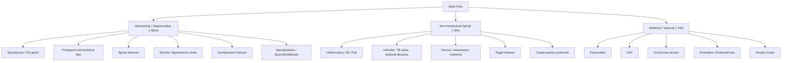

## Definition

**Back pain** refers to pain, muscle tension, or stiffness localised to the region of the spine between the inferior costal margin and the gluteal folds (lower back / lumbar region), with or without radiation to the lower limbs (sciatica). It is one of the most common presenting complaints in primary care and emergency departments worldwide.

The term is descriptive, not a diagnosis — it encompasses a broad spectrum of pathology from benign mechanical causes to sinister systemic disease.

Breaking down key terminology:
- **Lumbago** → from Latin *lumbus* = loin; refers to low back pain specifically
- **Sciatica** → from Latin *ischiadicus* = relating to the hip; pain radiating along the sciatic nerve distribution (posterior thigh, calf, foot)
- **Radiculopathy** → *radix* = root + *pathos* = disease; disease of a nerve root
- **Spondylosis** → *spondylos* (Greek) = vertebra + *-osis* = degenerative condition; degenerative disease of the spine
- **Spondylolisthesis** → *spondylos* = vertebra + *olisthesis* = slipping; forward slip of one vertebra on another
- **Spondylolysis** → *spondylos* = vertebra + *lysis* = loosening/dissolution; defect in the pars interarticularis

<Callout title="Clinical Framing">
Back pain is overwhelmingly mechanical and self-limiting (~90% of cases). Your job as a clinician is not to diagnose the exact mechanical cause in every patient — it is to **identify the dangerous minority** (red flags) who need urgent investigation, and to **manage symptoms and function** in the rest.
</Callout>

---

## Epidemiology

### Global and Hong Kong Burden
- **Lifetime prevalence**: 60–80% of adults will experience significant low back pain at some point [1][2]
- **Point prevalence**: approximately 15–20% at any given time
- **Leading cause of years lived with disability (YLD)** globally according to the Global Burden of Disease Study (GBD 2019)
- In Hong Kong, low back pain is one of the top reasons for primary care consultation and orthopaedic referral, particularly in the ageing population
- **Prevalence of osteoporosis in HK women** (relevant because vertebral compression fractures are a major cause of back pain in the elderly): ***60–69y: 1:6; 70–79y: 1:5; ≥80y: 1:4*** [3]

### Demographics
- **Age**: bimodal — young adults (20–40y, disc pathology) and elderly (> 60y, degenerative/osteoporotic)
- **Sex**: roughly equal overall, but certain aetiologies have sex predilection:
  - **Ankylosing spondylitis**: M > F (3:1)
  - **Osteoporotic compression fractures**: F > > M (postmenopausal oestrogen loss)
  - **Mechanical back pain**: slightly more common in occupational settings dominated by men (manual labour)

### Natural History
- ~90% of acute low back pain episodes resolve within 6 weeks regardless of treatment
- ~5–10% develop chronic low back pain ( > 12 weeks), which accounts for the vast majority of disability and healthcare costs
- **Recurrence rate**: high — up to 50% will have a recurrence within 12 months

---

## Risk Factors

***Risk factors*** for developing back pain can be conceptualised in three domains [2][4]:

### 1. Patient Factors
- ***Aging***: disc degeneration, facet joint arthropathy, osteoporosis all increase with age
- ***Male sex***: for occupational and mechanical causes
- ***Smoking***: impairs disc nutrition (discs are avascular — rely on diffusion; smoking reduces vertebral endplate blood flow → accelerates disc degeneration)
- **Obesity**: increased axial loading on the lumbar spine
- **Deconditioning / sedentary lifestyle**: weak paraspinal and core muscles → poor dynamic spinal stability
- **Genetic factors**: disc degeneration has a significant heritable component (~60–70%); HLA-B27 for ankylosing spondylitis
- **Psychological factors** (especially for chronification): depression, anxiety, catastrophising, fear-avoidance behaviour

### 2. ***Mechanical Factors***
- ***Posture***: prolonged sitting, slouching, loss of lumbar lordosis
- ***Weak paraspinal muscles***: inability to maintain neutral spine during loading
- Poor lifting biomechanics (flexion + rotation under load is the classic disc-injury mechanism)

### 3. ***Occupational Factors***
- ***Heavy lifting***: repetitive axial loading
- Whole-body vibration (e.g., truck drivers, heavy machinery operators)
- Prolonged static postures (e.g., desk work, surgeons)

### 4. Psychosocial Factors (Yellow Flags — Risk for Chronification)
- Belief that pain = harm and that activity should be avoided
- Tendency to catastrophise and low mood
- Work dissatisfaction, compensation claims, ongoing litigation
- Social withdrawal and passive coping strategies

> ***Key distinction***: **Red flags** = features suggesting serious pathology. **Yellow flags** = psychosocial risk factors for chronification of pain.

---

## Anatomy and Function

Understanding back pain requires a solid grasp of the anatomy because the *site and nature of the pain tells you which structure is involved*.

### The Vertebral Column

The lumbar spine consists of **5 lumbar vertebrae (L1–L5)** plus the **sacrum (S1–S5, fused)** and **coccyx**. It supports the upper body and transmits load to the pelvis.

**Normal curvatures**:
- Cervical: lordosis (concave posteriorly)
- Thoracic: kyphosis (convex posteriorly)
- **Lumbar: lordosis** — this is critical; loss of lumbar lordosis is a clinical sign of paraspinal muscle spasm or disc pathology
- Sacral: kyphosis

### Functional Spinal Unit (Motion Segment)

The basic biomechanical unit consists of:
1. **Two adjacent vertebral bodies**
2. **The intervertebral disc** between them
3. **Two facet (zygapophyseal) joints** posteriorly
4. **Supporting ligaments and muscles**

This forms a "three-column" model (Denis classification):
- **Anterior column**: anterior longitudinal ligament (ALL) + anterior half of vertebral body + anterior annulus
- **Middle column**: posterior half of vertebral body + posterior annulus + posterior longitudinal ligament (PLL)
- **Posterior column**: pedicles, facet joints, laminae, spinous processes, interspinous ligaments, ligamentum flavum

> The **middle column** is the key determinant of stability. Disruption of ≥2 columns = **mechanically unstable**.

### The Intervertebral Disc

- **Nucleus pulposus**: gel-like core, composed of type II collagen and proteoglycans (especially aggrecan) that trap water → acts as a hydraulic shock absorber
- **Annulus fibrosus**: concentric lamellae of type I collagen fibres oriented at alternating 30° angles → resists torsion and compression
- **Vertebral endplates**: thin cartilaginous plates that interface between disc and vertebral body; the main route for nutrient diffusion into the avascular disc

*Why do discs degenerate?*
- Discs are the **largest avascular structures** in the body — they rely entirely on diffusion through the vertebral endplates for nutrition
- With ageing: endplate calcification → reduced diffusion → loss of proteoglycans → disc desiccation → loss of height → annular tears → disc herniation
- This is why **smoking** (reduces endplate blood flow) and **sedentary lifestyle** (loading promotes diffusion; static postures do not) accelerate degeneration

### Facet (Zygapophyseal) Joints

- True synovial joints between the superior and inferior articular processes
- Orientation changes down the spine: cervical (45° coronal) → thoracic (60° coronal) → lumbar (90° sagittal)
- In the lumbar spine, facet joints are oriented in the **sagittal plane** → they primarily resist **rotation and anterior translation** but allow flexion/extension
- Facet joint arthropathy is a common cause of back pain in the elderly (essentially OA of the spine)

### Spinal Canal Contents

- **Spinal cord**: terminates at the **conus medullaris** at approximately **L1–L2** in adults (L3 in neonates)
- Below L1–L2: the **cauda equina** (Latin: "horse's tail") — a bundle of lumbar and sacral nerve roots floating in CSF within the thecal sac
- This is clinically vital: lumbar disc herniations below L1–L2 compress **nerve roots** (LMN), not the **spinal cord** (UMN)

### Nerve Root Anatomy

Each lumbar nerve root exits **below** its corresponding vertebral pedicle (e.g., L4 root exits below L4 pedicle). This is the **"MATCH"** principle for the lumbar spine [2]:

***"Lumbar Spine: Pedicle/Nerve Root MATCH"*** — the nerve root exiting below the pedicle matches the vertebral number [2].

In contrast, the cervical spine has a **MISMATCH** (C6 root exits above C6 pedicle) because there are 8 cervical roots but only 7 cervical vertebrae. The extra C8 nerve root (without a C8 pedicle) allows the transition from mismatch to match at the T1 level.

**Disc herniation and nerve root compression** [2]:
- ***Posterolateral herniation*** (most common in lumbar spine): compresses the nerve root **below** the level of the disc
  - e.g., L4/5 posterolateral disc → compresses **L5** nerve root
- ***Far lateral herniation***: compresses the nerve root **at** the level of the disc
  - e.g., L4/5 far lateral disc → compresses **L4** nerve root
- ***Central herniation***: compresses the **cauda equina** → cauda equina syndrome

This is because posterolateral herniations push into the lateral recess where the traversing (next lower) root sits, while far lateral herniations push into the foramen where the exiting (same level) root sits.

> ***In the cervical spine, both central and foraminal discs at the same level affect the SAME nerve root*** because of the mismatch anatomy [2].

### Key Paraspinal Muscles

| Muscle | Function | Clinical Relevance |
|--------|----------|--------------------|
| **Erector spinae** (iliocostalis, longissimus, spinalis) | Extension of spine | Spasm → loss of lumbar lordosis; tenderness in mechanical pain |
| **Multifidus** | Segmental stabilisation | Atrophy in chronic LBP; key rehabilitation target |
| **Quadratus lumborum** | Lateral flexion, stabilisation | Trigger points → referred pain to buttock/hip |
| **Psoas major** | Hip flexion, lumbar spine stability | Psoas abscess (TB!) → hip flexion deformity |
| **Core abdominal muscles** (transversus abdominis, internal oblique) | Intra-abdominal pressure → spinal stabilisation | Weakness → spinal instability → chronic LBP |

### Dermatomes and Myotomes — The Clinical Map

This table is essential for localising radiculopathy:

| Root | Disc Level | Motor (Myotome) | Sensory (Dermatome) | Reflex |
|------|-----------|------------------|---------------------|--------|
| **L2** | L1/2 | Hip flexion (iliopsoas) | Anterior thigh | Cremasteric |
| **L3** | L2/3 | Knee extension (quadriceps) | Medial thigh/knee | Knee jerk (L3/4) |
| **L4** | L3/4 | Knee extension, ankle dorsiflexion (tibialis anterior) | Medial leg/medial malleolus | **Knee jerk** |
| **L5** | L4/5 | Great toe dorsiflexion (EHL), ankle dorsiflexion, hip abduction | Lateral leg, dorsum of foot, 1st web space | None (or medial hamstring) |
| **S1** | L5/S1 | Ankle plantarflexion (gastrocnemius/soleus), ankle eversion | Lateral foot, sole, posterior calf | **Ankle jerk** |
| **S2–S4** | — | Bladder/bowel sphincters | Perianal ("saddle") area | Anal wink, bulbocavernosus |

<Callout title="Exam Pearl" type="idea">
To remember L4 vs L5 vs S1:
- **L4** = **Knee** jerk, knee extension, medial leg
- **L5** = **Big toe** up (EHL), dorsum of foot — **no reflex** (this is the "silent" root)
- **S1** = **Ankle** jerk, standing on tiptoes (plantarflexion), lateral/sole of foot
</Callout>

---

## Aetiology (with Pathophysiology)

The differential diagnosis of back pain is broad. Here we present the major aetiological categories with their respective pathophysiology, with a focus on conditions relevant to the **Hong Kong** population.

### Classification by Mechanism

A practical framework [1][2]:

### 1. Mechanical / Degenerative Causes (~90%)

#### a. ***Muscle Strain*** (Most Common)

- **Pathophysiology**: overuse or acute overloading of paraspinal muscles and ligaments → micro-tears → local inflammation → pain and spasm
- Typically precipitated by unaccustomed physical activity, poor lifting technique, or prolonged awkward posture
- Self-limiting; the paraspinal muscles go into **protective spasm** → loss of lumbar lordosis on examination
- No neurological deficit

#### b. ***Spondylosis*** (Degenerative Disc Disease / OA Spine) [2]

- **Definition**: degenerative changes of the spine including disc degeneration, facet joint arthropathy, and osteophyte formation
- **Pathophysiology**:
  1. Disc desiccation and loss of height → altered biomechanics → increased load on facet joints
  2. Facet joint cartilage wear → osteoarthritis → osteophyte formation
  3. Osteophytes can encroach on the spinal canal or intervertebral foramen → secondary spinal stenosis or radiculopathy
  4. Disc space narrowing → laxity of longitudinal ligaments → segmental instability
- Almost universal after age 60 — but **radiological degeneration does NOT equal clinical symptoms** (many asymptomatic elderly have severe degenerative changes on imaging)
- Pain is typically axial, worse with activity, relieved by rest

#### c. Prolapsed (Herniated) Intervertebral Disc [5]

- **Pathophysiology**: disc degeneration → annular tear → ***nucleus pulposus herniates through the annulus fibrosus*** → compresses nerve root or cauda equina
  - Often precipitated by ***trauma (e.g., lifting heavy weights while spine is flexed)*** [5]
  - The herniated nucleus pulposus causes both **mechanical compression** and **chemical irritation** (the nucleus pulposus triggers an inflammatory cascade with TNF-α, IL-1, IL-6, and prostaglandins)
- ***Types by direction*** [2][5]:
  - ***Posterolateral herniation (most common)***: nerve root **below** the level is compressed
  - ***Central herniation***: compresses **cauda equina**
  - ***Far lateral / foraminal herniation***: nerve root **at** the level is compressed
- Most commonly affects **L4/5** and **L5/S1** discs (because these bear the most load and have the most movement)
- **Clinical features of posterolateral herniation** [5]:
  - ***Back pain***: constant aching pain in lumbar region
  - ***Leg pain***: pain in distribution of affected root, usually more severe than the back pain; ***↑ by coughing, sneezing, straining*** (Valsalva manoeuvre increases intraspinal pressure → pushes disc further against root)
  - ***Paraesthesia***: in distribution of affected root
  - ***Neurological deficits (root signs)***: sensory loss, LMN weakness, reflex loss — if severe destruction of root [5]

<Callout title="Why Does Valsalva Worsen Radicular Pain?">
Coughing, sneezing, and straining increase intra-abdominal and intrathoracic pressure → transmitted to the epidural venous plexus (Batson's plexus) → transient increase in intraspinal pressure → pushes the herniated disc further against the nerve root → exacerbates radicular pain.
</Callout>

#### d. Spinal Stenosis

- **Definition**: narrowing of the spinal canal, lateral recesses, or intervertebral foramina
- **Aetiology**: usually degenerative (acquired) — combination of disc bulging, facet joint hypertrophy, ligamentum flavum thickening, and osteophyte formation. Less commonly congenital (short pedicles, eg. achondroplasia)
- **Pathophysiology**: compression of the cauda equina (in lumbar stenosis) → **neurogenic claudication**
  - *Why neurogenic claudication?*: Standing upright and walking → lumbar extension → further narrowing of the already stenotic spinal canal → compression of cauda equina → ischaemia of nerve roots
  - Flexion of the spine (sitting, bending forward, leaning on a shopping trolley) → opens up the spinal canal → relieves symptoms

***Vascular claudication vs Neurogenic claudication*** [6]:

| Feature | ***Vascular Claudication*** | ***Neurogenic Claudication*** |
|---------|---------------------------|------------------------------|
| **Cause** | ***Chronic arterial insufficiency → exercise-induced muscle ischaemia*** | ***Prolapsed IVD or OA spine → spinal stenosis → compression on spinal arteries → lumbosacral root ischaemia*** |
| **Nature** | ***LL discomfort on exertion*** | ***LL discomfort on exertion*** |
| **Precipitation** | ***Claudication distance constant*** | ***Claudication distance variable*** |
| **Relief** | ***"Shop window to shop window" (relief upon standing still)*** | ***"Park bench to park bench" (relief upon flexion of spine)*** |
| **Pain at rest** | ***None*** | ***May be present (prefer to stand in slight flexion)*** |
| **Other complaints** | ***Nil*** | ***Paraesthesia, numbness, weakness*** |
| **Going stairs** | Upstairs worse (more effort) | ***Going downstairs > upstairs*** (downstairs = lumbar extension; upstairs = flexion) |
| **Pulses** | Absent/reduced | Normal |

#### e. Compression Fractures

- **Pathophysiology**: vertebral body failure under axial load, most commonly in the setting of **osteoporosis** (low bone density → vertebral body cannot withstand normal loading)
- **Hong Kong relevance**: very common in elderly Chinese women given the high prevalence of osteoporosis [3]
- Other causes: trauma (high-energy in young, low-energy in osteoporotic elderly), ***chronic steroid use***, malignancy (pathological fracture)
- Classically sudden onset of well-localised midline back pain after minimal trauma (e.g., bending, lifting, coughing) or even spontaneous
- Thoracolumbar junction (T12–L1) is the most common site (transition zone between rigid thoracic kyphosis and mobile lumbar lordosis)
- Progressive anterior wedging → kyphotic deformity ("dowager's hump")

#### f. ***Spondylolysis / Spondylolisthesis*** [1]

- **Spondylolysis**: defect in the **pars interarticularis** (the bony bridge between superior and inferior articular processes)
  - Usually a **stress fracture** from repetitive hyperextension (common in gymnasts, cricket fast bowlers, ballet dancers)
  - Most common at **L5**
- **Spondylolisthesis**: **forward slip** of one vertebra on the one below, often as a consequence of bilateral spondylolysis
  - Graded by Meyerding classification (Grade I: < 25% slip, up to Grade V: complete slip / spondyloptosis)
  - May compress the exiting nerve root in the foramen or the cauda equina

### 2. Non-Mechanical Spinal Causes (~5%)

#### a. Inflammatory — ***Ankylosing Spondylitis (AS)*** [1]

- **Epidemiology**: young males (typical onset 15–35y), strong association with **HLA-B27** (> 90%)
- In Hong Kong, HLA-B27 prevalence is ~6–8% in Chinese, lower than Caucasians (~8%) but AS is still a significant cause of back pain in young males
- **Pathophysiology**: enthesitis (inflammation at sites where tendons/ligaments insert into bone) → erosion → reactive new bone formation → syndesmophyte formation → progressive ankylosis (fusion)
  - Starts at the **sacroiliac joints** (sacroiliitis) → ascends up the spine
  - "Bamboo spine" appearance on imaging in late disease
- **Clinical features**: ***inflammatory back pain*** pattern:
  - Insidious onset
  - Age < 40 years
  - Morning stiffness > 30 minutes (improves with activity)
  - Improves with exercise, NOT with rest
  - Night pain (especially second half of night)
  - Alternating buttock pain (sacroiliitis)

> **Inflammatory vs Mechanical Back Pain**: Inflammatory pain is **worse at rest and in the morning, improves with activity**. Mechanical pain is **worse with activity, improves with rest**. This is a fundamental distinguishing feature.

#### b. Inflammatory — ***Reactive Arthritis, Psoriatic Arthritis (PsA)*** [1]

- Part of the **seronegative spondyloarthropathies** (along with AS and ***bowel inflammation***-associated arthritis) [1]
- Can cause sacroiliitis and inflammatory back pain similar to AS
- ***Psoriasis*** and ***bowel inflammation*** should be specifically enquired about [1]

#### c. Infection — Tuberculous (TB) Spine (Pott's Disease)

- **Hong Kong relevance**: TB remains an important cause of spinal infection in Hong Kong and Southeast Asia. HK TB incidence is ~50–60 per 100,000 — much higher than Western countries
- **Pathophysiology**: haematogenous spread of *Mycobacterium tuberculosis* from a pulmonary or other primary focus → seeding of the vertebral body (via the vertebral venous plexus / Batson's plexus) → destruction of the vertebral body and disc → **cold abscess** formation (paravertebral / psoas abscess) → may cause kyphotic deformity (gibbus) or spinal cord compression
- Typically affects the **thoracolumbar spine** (anterior vertebral body)
- Insidious onset with constitutional symptoms (fever, night sweats, weight loss) + progressive back pain + potential neurological deficit

#### d. Infection — Epidural Abscess

- **Pathophysiology**: bacterial infection (most commonly *Staphylococcus aureus*) → collection of pus in the epidural space → mass effect on spinal cord or cauda equina
- Risk factors: IVDU, immunosuppression, recent spinal procedure, diabetes
- **Clinical triad**: back pain → radiculopathy → neurological deficit (progressive)
- A neurosurgical emergency — delay in treatment → irreversible paraplegia

#### e. Tumour

- **Primary spinal tumours**: rare (e.g., osteosarcoma, chordoma, giant cell tumour)
- **Metastatic disease**: ***much more common*** — the spine is the most common site for bony metastases
  - Common primaries metastasising to spine: ***lung, breast, prostate***, thyroid, kidney, multiple myeloma [2]
  - **Pathophysiology**: haematogenous spread to vertebral body (highly vascular cancellous bone) → osteolytic or osteoblastic destruction → pathological fracture, spinal cord compression
  - Pain is typically **progressive, unremitting, worse at night, not relieved by rest**, and may be accompanied by constitutional symptoms (weight loss, fatigue)
- **Myeloma**: most common primary bone malignancy overall; back pain + anaemia + renal failure + hypercalcaemia in elderly patient should ring alarm bells

#### f. ***Paget Disease of Bone*** [1][3]

- **Epidemiology**: prevalence 3–3.7% in adults > 40y, typically > 55y, more common in Caucasians [3]
- **Pathophysiology**: ***characterised by overgrowth of bone at selected sites with impaired integrity*** [3]
  - Excessive and disorganised osteoclast activity → rapid bone resorption → followed by exuberant but structurally abnormal bone formation → enlarged, deformed, mechanically weak bone
  - Predilection for ***skull, T-L spine, pelvis, LL long bones*** [3]
- **Spinal involvement** → ***spinal stenosis (at any level), bone pain, radiculopathy, spinal cord dysfunction due to vascular steal, compression fracture*** [3]
- ***Pain: mild-moderate, deep persistent rest pain, ↑ with weightbearing and at night*** [3]

#### g. ***Sacroiliac Dysfunction*** [1]

- Sacroiliac joint is a common source of back pain, especially in pregnancy (relaxin-mediated ligamentous laxity) and post-partum
- Can also occur in spondyloarthropathies, trauma, or degeneration

### 3. Referred / Visceral Causes (~5%) [1][2]

These are **extra-spinal causes** where pathology in another organ refers pain to the back. ***The masquerades checklist*** is helpful here [1]:

| Source | Condition | Clue |
|--------|-----------|------|
| Vascular | ***AAA*** (ruptured or expanding) | Pulsatile abdominal mass, hypotension, severe back/abdominal pain [7] |
| Pancreas | Pancreatitis | Epigastric pain radiating to back, worse after eating, elevated amylase/lipase [8] |
| Renal | Pyelonephritis, renal calculi | Loin to groin pain, haematuria, dysuria, CVA tenderness |
| Gynaecological | ***Endometriosis*** | Cyclical back pain, dysmenorrhoea, dyspareunia |
| Urological | ***Prostatitis*** | Perineal/lower back pain, urinary symptoms, tender prostate on DRE |
| GI | Posterior duodenal ulcer | Epigastric pain radiating to back |
| Neurological | ***Herpes zoster*** | Dermatomal pain preceding vesicular rash |
| Vascular | Aortic dissection | Tearing back pain, hypertension, pulse differential |

### 4. Psychosocial / Functional

***"Is the patient trying to tell me something? Quite likely. Consider lifestyle, stress, work problems, malingering, conversion reaction."*** [1]

- ***Depression*** is specifically listed on the ***masquerades checklist*** [1] — it can present as back pain (somatisation)
- **Somatic symptom disorder** can present with ***back pain*** as one of the prominent somatic symptoms [9]
- Always consider psychosocial factors especially when pain is disproportionate to findings, multiple negative investigations, and significant functional impairment

<Callout title="The Masquerades Checklist for Back Pain" type="idea">
From Murtagh's approach [1], always consider:
- ***Depression***
- ***Spinal dysfunction***
- ***UTI***
- And ask: ***"Is the patient trying to tell me something?"***
This reminds you to think beyond the mechanical spine and screen for psychosocial and referred causes.
</Callout>

---

## Classification

### By Duration
| Category | Duration |
|----------|----------|
| **Acute** | < 6 weeks |
| **Subacute** | 6–12 weeks |
| **Chronic** | > 12 weeks |

### By Mechanism
- **Mechanical** (~90%): related to spinal structures and loading
- **Non-mechanical / Systemic** (~5%): inflammatory, infectious, neoplastic
- **Referred / Visceral** (~5%): from abdominal/pelvic organs

### By Severity (Clinical Triage — The Traffic Light System)

This is the most clinically useful classification:

| Category | Features |
|----------|----------|
| **Simple / Non-specific back pain** (Green) | Mechanical pain, no red flags, no neurological deficit |
| **Radiculopathy / Nerve root pain** (Amber) | Dermatomal pain ± neurological deficit, SLR positive |
| **Serious spinal pathology** (Red) | Red flag features present → urgent investigation |

---

## Clinical Features

### A. History Taking — The ***SOCRATES*** Approach [1]

***"Routine analysis of pain (SOCRATES approach), especially intensity of pain and its relation to rest and activity and also diurnal variation. Ask about pain on standing, sitting and walking with types of claudication (if any)."*** [1]

***"Review family history, occupational history, drug history, psychosocial history and ask questions about red flags that are alarm symptoms of serious disease."*** [1]

#### SOCRATES Applied to Back Pain

| Element | What to Ask | Why It Matters |
|---------|------------|----------------|
| **S**ite | Localised midline vs paravertebral vs diffuse; unilateral vs bilateral | Midline = vertebral body/disc/spinous process; paravertebral = muscle/facet; unilateral radiation = radiculopathy |
| **O**nset | Acute (trauma, disc) vs insidious (degeneration, tumour, inflammation) | Sudden = disc herniation/fracture; gradual = degeneration/tumour/infection |
| **C**haracter | Aching/dull (mechanical), sharp/shooting/electric (radicular), burning (neuropathic), deep/boring (visceral/tumour) | Character maps to tissue type |
| **R**adiation | Buttock, posterior thigh, calf (sciatica); anterior thigh (L2/3/4); loin-to-groin (renal); no radiation (axial mechanical) | Radiation pattern localises the affected root or referred source |
| **A**ssociated | Neurological symptoms (numbness, weakness, incontinence), constitutional symptoms (fever, weight loss, night sweats), morning stiffness | Constitutional = infection/tumour; morning stiffness = inflammatory |
| **T**iming/Diurnal | Worse in AM + stiffness (inflammatory); worse at end of day (mechanical); constant/progressive/nocturnal (tumour) | ***Diurnal variation is key*** [1] |
| **E**xacerbating/Relieving | Worse with activity (mechanical); worse at rest/better with activity (inflammatory); worse with Valsalva (disc); better with flexion (stenosis) | Maps to pathology |
| **S**everity | VAS/NRS 0–10 | Guides urgency and treatment |

### B. Symptoms — with Pathophysiological Basis

#### 1. Axial (Local) Back Pain
- **Description**: dull, aching, poorly localised pain in the lumbar region
- **Mechanism**: pain arises from **nociceptive stimulation** of pain-sensitive spinal structures:
  - Vertebral periosteum, outer third of annulus fibrosus, facet joint capsule, posterior longitudinal ligament, paraspinal muscles, sacroiliac joint
  - The nucleus pulposus and inner annulus are **aneural** — they only cause pain when herniated material contacts pain-sensitive structures
- **Worse with loading/activity, better with rest** → mechanical
- **Worse at rest/in morning, better with activity** → inflammatory

#### 2. Radicular Pain (Sciatica)
- **Description**: sharp, shooting, electric-shock-like pain radiating from the back down the leg in a **dermatomal distribution**
- **Mechanism**: compression and/or inflammation of the nerve root → ectopic nerve impulse generation → pain perceived in the territory of the affected root
- ***Sciatica: shooting pain in hip radiating down posterior thigh and calf + limited straight leg raise + features of radiculopathy (e.g., diminished sensation over heel, absent ankle jerk, weakness of ankle plantarflexion)*** [4]
- ***↑ by coughing, sneezing, straining*** (Valsalva) [5] — because intraspinal pressure transiently increases

#### 3. Neurogenic Claudication
- **Description**: bilateral leg pain, heaviness, numbness, or weakness brought on by walking or prolonged standing; relieved by sitting or bending forward
- **Mechanism**: lumbar spinal stenosis → standing/walking → lumbar extension → further canal narrowing → cauda equina compression → nerve root ischaemia
- Distinguished from vascular claudication as above

#### 4. Cauda Equina Symptoms — ***Red Flag*** [2]
- ***Faecal incontinence***
- ***Painless urinary retention ± overflow incontinence***
- ***Saddle anaesthesia*** (numbness in the perineum/perianal region — S2–S4 dermatomes)
- **Mechanism**: central disc herniation or mass lesion compressing the cauda equina → damage to sacral nerve roots (S2–S4) which carry parasympathetic fibres to the bladder/bowel and somatic sensory fibres to the perineum

<Callout title="Cauda Equina Syndrome" type="error">
This is the **most important red flag to rule out** in any patient with back pain [2]. It is a **surgical emergency** — delay in decompression beyond 48 hours dramatically worsens prognosis. Always ask about bladder function, bowel function, and perineal sensation.
</Callout>

#### 5. ***Constitutional Symptoms***
- Fever, night sweats, unexplained weight loss
- **Mechanism**: systemic inflammatory/infective/malignant process
- Points towards: TB spine, epidural abscess, metastatic disease, myeloma, lymphoma

#### 6. Morning Stiffness
- **> 30 minutes**, improves with activity
- **Mechanism**: overnight, inflammatory cytokines accumulate in inflamed joints (sacroiliac, facet) → stiffness; movement increases blood flow → clears cytokines → improvement
- Points towards: **inflammatory spondyloarthropathy** (AS, PsA, reactive arthritis)

### C. RED FLAGS — Must Screen in Every Patient [1][2]

| Red Flag | Possible Cause |
|----------|---------------|
| Age < 20 or > 55 with new-onset back pain | Tumour, infection |
| ***Fever, immunosuppression*** | ***Infection*** [2] |
| History of cancer | Metastatic disease |
| Unexplained weight loss | Malignancy, TB |
| ***Chronic steroid use, osteoporosis / metabolic bone disease*** | ***Fracture*** [2] |
| Night pain (unrelenting, not relieved by position change) | Tumour, infection |
| Progressive neurological deficit | Cord compression, cauda equina syndrome |
| ***Saddle anaesthesia, urinary retention/incontinence, faecal incontinence*** | ***Cauda equina syndrome*** [2] |
| Thoracic pain | Higher risk of serious pathology |
| Structural deformity | Fracture, tumour |
| Pain that is constant, progressive, and non-mechanical | Tumour, infection |
| Recent significant trauma (or minor trauma in osteoporotic patient) | Fracture |
| IVDU | Epidural abscess, discitis |

### D. Physical Examination Signs — with Pathophysiological Basis

***"Follow the LOOK, FEEL, MOVE, MEASURE clinical approach with an emphasis on palpation — central and lateral."*** [1]

#### LOOK [4][10]

| Finding | Significance | Mechanism |
|---------|-------------|-----------|
| ***Gait: "half-shut knife position" — patient leans forward with a painful, partially flexed back*** [10] | Disc herniation / severe mechanical pain | Flexion opens up the intervertebral foramen and reduces disc-root contact → antalgic posture |
| ***Sciatic list: patient leans towards/away from lesion depending on whether prolapsed disc is medial/lateral to nerve root*** [10] | Disc herniation | Leaning away from the side of the herniation reduces root compression |
| **Loss of lumbar lordosis** (straight/flat back or reversal to kyphosis) | Paraspinal muscle spasm, disc pathology | Spasm of erector spinae "splints" the spine in a neutral/flexed position to minimise movement and pain |
| Scoliosis | Structural (leg length discrepancy, congenital), functional (antalgic) | Antalgic scoliosis = protective posture to unload the affected side |
| **Scars, sinuses** | Previous surgery, chronic infection (TB sinus) | — |
| Skin: café-au-lait spots, hairy patch, dimple, pigmented naevus over lumbosacral region | Neurofibromatosis, spinal dysraphism / tethered cord [11] | Cutaneous stigmata suggest underlying congenital spinal anomaly |
| Kyphosis / gibbus deformity | Compression fracture (osteoporotic or TB), Scheuermann's disease | Anterior vertebral body collapse → angular kyphosis |

#### FEEL [10]

| Finding | Significance | Mechanism |
|---------|-------------|-----------|
| ***Spasm/tenderness of paraspinal muscles*** [10] | Mechanical pain, muscle strain | Protective splinting by paraspinal muscles |
| Central (spinous process) tenderness | Fracture, infection, tumour | Direct pressure on diseased vertebral body |
| Lateral tenderness | Facet joint arthropathy, paraspinal muscle pathology | — |
| Step deformity (palpable "step" between spinous processes) | Spondylolisthesis | Forward slip of vertebra creates a palpable step |
| Sacroiliac joint tenderness | Sacroiliitis (AS, PsA), SI joint dysfunction | — |

#### MOVE [1][10]

***"The movements with normal ranges are:"*** [1]
- ***Extension 20°–30°*** [1]
- ***Forward flexion 75°–90°*** [1]

Additional normal ranges from examination framework [10]:
- ***Forward flexion: ask patient to touch toes → normally ≤5cm from floor*** [10]
- ***Extension: with support → normally 30°*** [10]
- ***Lateral flexion: ask patient to slide hand down outside of leg → normally 30° to each side*** [10]
- ***Rotation: ask patient to sit down (fix the pelvis) + fold arms across chest → rotate chest about pelvis → normally 40° to each side*** [10]

| Movement | Restriction Pattern | Significance |
|----------|-------------------|--------------|
| Flexion | Global restriction | Severe spasm, disc, AS (late) |
| Extension | Pain on extension | Facet joint arthropathy, spinal stenosis, spondylolisthesis |
| Lateral flexion | Asymmetric | Unilateral muscle spasm, facet pathology |
| Rotation | Reduced | Sacroiliac pathology if pain with rotation; AS |

**Schober's Test** (for lumbar spine flexion):
- Mark the midline at the level of the posterior superior iliac spines (approximately L5) and 10cm above
- Ask patient to flex forward maximally
- Normal: distance increases by ≥ 5cm (i.e., ≥ 15cm total)
- Reduced excursion = reduced lumbar flexion (seen in AS, severe mechanical restriction)

#### SPECIAL TESTS [10]

##### ***Straight Leg Raising (SLR) Test*** [10]
- ***Indicates L5/S1 root irritation*** [10]
- **Technique**: ***One hand behind heel, one hand above knee (keep knee in extension). Gradually passively flex the hip until symptoms are reproduced.*** [10]
- ***By definition, this means pain or paraesthesia BELOW THE KNEE*** [10]
- ***Positive SLR: reproduction of symptoms at 30–70°*** [10]
  - ***Report the dermatome and the symptoms experienced*** [10]
  - ***Anything above 70° can be due to other causes, e.g., hamstring tightness*** [10]
- **Mechanism**: raising the straightened leg → stretches the sciatic nerve → pulls on the L5 and S1 nerve roots → if these roots are compressed/irritated by a disc herniation, traction reproduces the patient's radicular symptoms
  - The nerve root starts moving at ~30° and is maximally taut at ~70°

##### ***Variants of SLR*** [10]
- ***Lasègue sign: lower the leg by 5° then symptoms reproduced by ankle dorsiflexion*** [10]
  - Ankle dorsiflexion further stretches the sciatic nerve / tibial nerve → confirms neural origin of pain
- ***Crossed SLR: contralateral SLR produces pain on the affected side*** [10]
  - ***Less sensitive but most specific*** for disc herniation [10]
  - Why? Raising the opposite leg pulls the nerve root medially → only significant disc herniations (usually large, central-lateral) will be caught by contralateral traction

##### Femoral Nerve Stretch Test (Reverse SLR)
- Tests L2/L3/L4 roots (femoral nerve territory)
- **Technique**: patient prone, flex the knee → then extend the hip → positive if reproduces anterior thigh pain
- **Mechanism**: stretches the femoral nerve → traction on upper lumbar roots

##### Neurological Examination (per Root)

As per the dermatome/myotome table above — systematically test:
- **Motor**: power (MRC grading) of key myotomes (hip flexion, knee extension, ankle dorsiflexion, great toe extension, ankle plantarflexion)
- **Sensory**: light touch and pinprick in key dermatomes (medial leg L4, dorsum of foot/1st web space L5, lateral foot/sole S1)
- **Reflexes**: knee jerk (L3/4), ankle jerk (S1)
- **Perianal sensation and anal tone**: MUST be tested if any suspicion of cauda equina syndrome (S2–S4)

> **Note on UMN vs LMN signs**: Lumbar pathology below L1–L2 causes **LMN signs** (hyporeflexia, flaccidity, fasciculations) because it affects the cauda equina (peripheral nerves). **UMN signs** in the legs (hyperreflexia, clonus, upgoing plantars, spasticity) suggest a lesion **above** L1 — i.e., thoracic or cervical spinal cord compression (myelopathy), which is a different clinical entity.

##### Cervical Myelopathy Signs (if suspecting cervical pathology) [5]
- ***Lhermitte phenomenon: shock-like sensation to whole body upon forced flexion of neck*** [5]
- ***Myelopathic hand signs: 10-second test, finger escape sign, Hoffman sign*** [5]
- UMN signs in legs: brisk reflexes, clonus, upgoing plantars, spastic gait

##### Waddell's Signs (Non-Organic / Psychogenic Signs)
If you suspect functional or psychosocial overlay, look for:
1. **Superficial tenderness**: widespread, non-anatomical
2. **Simulation tests**: axial loading on skull or passive rotation of shoulders and pelvis together (should not cause true spinal pain)
3. **Distraction tests**: SLR positive supine but negative when distracted (e.g., while sitting)
4. **Regional disturbances**: non-dermatomal sensory loss, "give-way" weakness
5. **Overreaction**: disproportionate verbalisation, facial expression, muscle tension

≥ 3 positive Waddell's signs suggest significant non-organic component.

---

## Manifestations of Spinal Cord Disease vs Nerve Root Disease [2]

This distinction is critical and frequently tested:

| Feature | **Myelopathy** (Cord compression) | **Radiculopathy** (Root compression) |
|---------|----------------------------------|--------------------------------------|
| Level | Above L1–L2 (cervical/thoracic) | Usually below L1–L2 (lumbar) |
| Motor | **UMN** below level (spasticity, hyperreflexia, clonus, Babinski +) | **LMN** at level (wasting, fasciculations, hyporeflexia) |
| Sensory | **Sensory level** (band of hyperaesthesia at level, loss below) | **Dermatomal** (specific root distribution) |
| Bladder/Bowel | Early feature in central cord/severe compression | Late (only if cauda equina involved) |
| Pain pattern | Deep, diffuse, poorly localised | Sharp, shooting, dermatomal |
| Examples | Cervical myelopathy, thoracic cord compression (tumour, epidural abscess) | Lumbar disc herniation, lumbar stenosis |

---

## ***Cauda Equina Syndrome*** [2]

Deserves special mention as the **#1 emergency** in back pain:

- **Definition**: compression of the cauda equina nerve roots (below the conus medullaris, typically L2 and below)
- **Causes**: central disc herniation (most common), tumour, epidural abscess, epidural haematoma, spinal stenosis (severe)
- **Clinical features** [2]:
  - ***Faecal incontinence***
  - ***Painless urinary retention ± overflow incontinence*** (because S2–S4 parasympathetic fibres to the detrusor are damaged → atonic bladder → retention → overflow)
  - ***Saddle anaesthesia*** (S2–S4 sensory territory)
  - Bilateral lower limb weakness (variable)
  - Bilateral sciatica
  - Reduced anal tone on PR examination
- **Urgency**: MRI within hours, surgical decompression within 24–48 hours for best outcomes

---

## Soft Tissue Rules (Cervical Spine Imaging) [2]

Although these are for the cervical spine specifically, they are relevant when assessing upper back/neck pain or trauma:

- ***3×7=21 rule***: prevertebral soft tissue thickness:
  - ***C1 ≤ 10mm***
  - ***C3 ≤ 7mm***
  - ***C7 ≤ 21mm***
- ***1-2-3-4-5-6 rule***: ***C1-2 less than dens, C3-4 < 3-4mm, C5-6 narrower than AP diameter of vertebral body***
- ***Vertebral body rule: mid-cervical level ≤ half of vertebral body thickness, lower cervical level < full vertebral body thickness*** [2]

---

<Callout title="High Yield Summary">

1. **Back pain is overwhelmingly mechanical (~90%)** — your job is to identify the dangerous minority with red flags
2. **Red flags**: age extremes, constitutional symptoms (fever, weight loss), night pain, neurological deficit, bladder/bowel dysfunction (cauda equina), history of cancer, osteoporosis/steroid use, immunosuppression, IVDU, trauma
3. **Cauda equina syndrome** = saddle anaesthesia + urinary retention/incontinence + faecal incontinence → **SURGICAL EMERGENCY** — do MRI urgently
4. **Radiculopathy** = dermatomal pain + LMN signs (weakness, numbness, hyporeflexia) in the affected root distribution
5. **Know your roots**: L4 = knee jerk + ankle dorsiflexion; L5 = great toe dorsiflexion + NO reflex; S1 = ankle jerk + plantarflexion
6. **Posterolateral disc** (most common) → compresses root BELOW the level; **far lateral** → root AT the level; **central** → cauda equina
7. **Vascular vs Neurogenic claudication**: vascular = constant distance, relieved by standing still, absent pulses; neurogenic = variable distance, relieved by flexion ("shopping trolley sign"), normal pulses
8. **Inflammatory back pain** (AS): age < 40, insidious onset, morning stiffness > 30min, improves with exercise, night pain
9. **TB spine** is important in Hong Kong — insidious back pain + constitutional symptoms + paravertebral/psoas abscess
10. **Always examine**: gait, lumbar spine movements (Schober's test), SLR, neurological exam (motor, sensory, reflexes), perianal sensation if any suspicion of cauda equina
11. ***Masquerades checklist: Depression, Spinal dysfunction, UTI, and "Is the patient trying to tell me something?"***

</Callout>

---

<ActiveRecallQuiz
  title="Active Recall - Back Pain (Part 1: Definition to Clinical Features)"
  items={[
    {
      question: "A 35-year-old man presents with 6 months of low back pain and morning stiffness lasting 45 minutes that improves with exercise. What is the most likely diagnosis and what investigation would you request first?",
      markscheme: "Ankylosing spondylitis (inflammatory back pain pattern: age less than 40, insidious onset, morning stiffness greater than 30 min, improves with exercise, night pain). First investigation: X-ray of sacroiliac joints (look for sacroiliitis) or MRI SI joints if X-ray normal."
    },
    {
      question: "An L4/5 posterolateral disc herniation compresses which nerve root? What would be the expected motor, sensory, and reflex findings?",
      markscheme: "L5 nerve root (posterolateral herniation compresses the root BELOW the disc level). Motor: weakness of great toe dorsiflexion (EHL) and ankle dorsiflexion. Sensory: numbness over lateral leg, dorsum of foot, 1st web space. Reflex: no reflex loss (L5 has no clinically testable reflex, though medial hamstring reflex may be reduced)."
    },
    {
      question: "List 4 clinical features of cauda equina syndrome and explain why urinary retention occurs.",
      markscheme: "Features: (1) Saddle anaesthesia (S2-S4 sensory loss), (2) Painless urinary retention with overflow incontinence, (3) Faecal incontinence, (4) Bilateral lower limb weakness or bilateral sciatica, (5) Reduced anal tone. Urinary retention occurs because S2-S4 parasympathetic fibres innervating the detrusor muscle are damaged, leading to an atonic bladder that cannot contract, causing retention then overflow."
    },
    {
      question: "Differentiate neurogenic claudication from vascular claudication in terms of cause, relief position, claudication distance consistency, and peripheral pulses.",
      markscheme: "Neurogenic: caused by lumbar spinal stenosis with cauda equina compression; relieved by spinal flexion (park bench to park bench or shopping trolley sign); claudication distance variable; pulses normal; may have paraesthesia and weakness. Vascular: caused by peripheral arterial disease with exercise-induced muscle ischaemia; relieved by standing still (shop window to shop window); claudication distance constant; pulses reduced or absent; no neurological symptoms."
    },
    {
      question: "Why does a positive crossed straight leg raise test have higher specificity for lumbar disc herniation than ipsilateral SLR?",
      markscheme: "Raising the contralateral leg only exerts a small traction force on the opposite nerve root by pulling it medially across the disc. Only a large or centrally placed disc herniation will be significant enough to irritate the contralateral root with this relatively small traction. Therefore, a positive crossed SLR indicates a more significant disc herniation, making it less sensitive but more specific."
    },
    {
      question: "A 70-year-old woman on long-term prednisolone presents with acute localised thoracolumbar back pain after bending to pick up groceries. What is the most likely diagnosis and why does the thoracolumbar junction (T12-L1) preferentially fracture?",
      markscheme: "Most likely diagnosis: osteoporotic vertebral compression fracture (risk factors: age, female, chronic steroid use). T12-L1 is the transition zone between the relatively rigid thoracic spine (stabilised by rib cage) and the mobile lumbar spine. This creates a biomechanical stress concentration point where flexion forces are maximal, predisposing to fracture."
    }
  ]}
/>

---

## References

[1] Lecture slides: murtagh merge.pdf (Back pain, lower)
[2] Senior notes: maxim.md (Section 2.3 — Approach to spine diseases)
[3] Senior notes: Ryan Ho Endocrine.pdf (Section 2.4 — Osteoporosis; Section 2.5 — Paget's Disease of Bone)
[4] Senior notes: maxim.md (Risk factors, Clinical features — Sciatica)
[5] Senior notes: Ryan Ho Neurology.pdf (p173 — Lumbar spondylosis, disc herniation)
[6] Senior notes: Ryan Ho Cardiology.pdf (p205 — Vascular vs Neurogenic claudication table)
[7] Senior notes: Ryan Ho Cardiology.pdf (p222 — Abdominal aortic aneurysm)
[8] Senior notes: Ryan Ho GI.pdf (p102 — Radiation of abdominal pain)
[9] Senior notes: Ryan Ho Psychiatry.pdf (p202 — Somatic symptom disorder)
[10] Senior notes: Ryan Ho Fundamentals.pdf (p148 — Sciatica examination)
[11] Senior notes: Ryan Ho Neurology.pdf (p175 — Spinal dysraphism)
