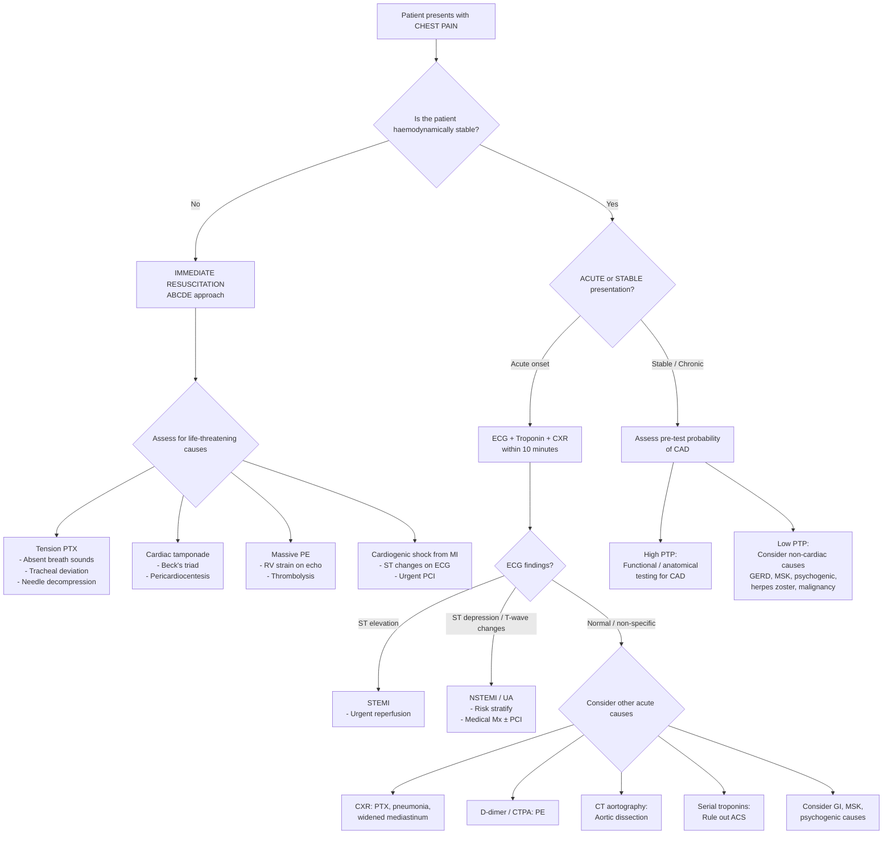

## Differential Diagnosis of Chest Pain

The differential diagnosis of chest pain is one of the broadest in clinical medicine. The key intellectual task is not to memorise a long list, but to **stratify by risk** (life-threatening vs benign), **categorise by system** (cardiac, pulmonary, GI, MSK, neuro, psych), and then use **specific discriminating features** (onset, quality, radiation, provocating/palliating factors, associated symptoms, risk factors) to narrow the field. Think of it as a funnel: start wide, risk-stratify immediately, then refine.

---

### Organising Framework

The single most useful framework for the exam (and for clinical practice) is **Murtagh's diagnostic strategy** [8], which forces you to think probabilistically:

> ***Probability diagnosis*** (commonest causes — account for the majority of presentations):
> - ***Musculoskeletal (chest wall) including costochondritis***
> - ***Psychogenic***
> - ***Angina***
>
> ***Serious disorders not to be missed*** (life-threatening — rule these out first):
> - ***Cardiovascular: myocardial infarction / unstable angina, aortic dissection, pulmonary embolism / infarction***
> - ***Neoplasia / cancer: lung cancer, tumours of spinal cord and meninges***
> - ***Infection: pneumonia / pleuritis (pleurisy), mediastinitis, pericarditis, myocarditis***
> - ***Pneumothorax***
>
> ***Pitfalls (often missed)***:
> - ***Mitral valve prolapse***
> - ***Oesophageal spasm***
> - ***Gastro-oesophageal reflux***
> - ***Biliary colic***
> - ***Peptic ulcer***
>
> Additional pitfalls from the slides [8]:
> - ***Herpes zoster***
> - ***Fractured rib (e.g. cough fracture)***
> - ***Spinal dysfunction***
> - ***Precordial catch ("stitch" in side)***
>
> ***Rarities***:
> - ***Pancreatitis***
> - ***Bornholm disease (pleurodynia)***
> - ***Cocaine inhalation (can increase ischaemia)***
> - ***Hypertrophic cardiomyopathy***
>
> ***Masquerades checklist*** [8]:
> - ***Depression (possible)***
> - ***Anaemia (indirect)***
> - ***Spinal dysfunction***
>
> ***Is the patient trying to tell me something?***
> - ***Consider functional causes, especially anxiety with hyperventilation, opioid dependency*** [8]

<Callout title="Why Use Murtagh's Framework?">
It mirrors real clinical thinking. You do not start by listing every possible cause — you start by asking: "What is most likely?" (probability diagnosis), then "What can kill the patient if I miss it?" (serious disorders), then "What do doctors commonly miss?" (pitfalls). This approach prevents both over-investigation and under-diagnosis.
</Callout>

---

### Differential Diagnosis Stratified by Clinical Setting

#### A. Acute Chest Pain

This is the emergency department scenario. The priority is to **rule out life-threatening causes** before considering benign ones.

***Potentially severe or life-threatening*** [1][2]:

| Diagnosis | Key Discriminating Features | Why It's Dangerous |
|---|---|---|
| ***Acute coronary syndrome (ACS)*** | ***Dull compressive central chest pain at rest, radiating to jaw/neck/left arm, lasts > 20–30 min with gradual onset*** [1]; autonomic features (diaphoresis, N/V); ***angina equivalents in elderly/DM*** [2] | Ongoing myocardial necrosis → cardiogenic shock, fatal arrhythmia |
| ***Aortic dissection*** | ***Sudden, excruciating, tearing/ripping pain at anterior chest, radiating to interscapular region/back/abdomen; may occur with heavy isometric exercise or extreme BP elevation*** [1]; pulse deficit, BP discrepancy between arms; ***Hx of HTN, connective tissue disorder*** [1] | Rupture → haemorrhagic death; coronary/cerebral malperfusion |
| ***Acute pulmonary embolism*** | ***Severe pleuritic pain with sudden onset; dyspnoea ± cyanosis and collapse if massive; S/S of DVT; a/w thrombophilia*** [1]; ***sinus tachycardia, RV strain pattern (RBBB, S1Q3T3)*** [6] | Massive PE → obstructive shock → cardiac arrest |
| ***Tension or massive pneumothorax*** | ***Unilateral, sharp, localised pleuritic pain with sudden onset; dyspnoea; Hx of trauma or underlying lung disease*** [1]; absent breath sounds + hyperresonance + tracheal deviation | Mediastinal shift → obstructive shock |
| ***Pneumonia*** | Pleuritic pain + productive cough + fever + dyspnoea; consolidation signs on exam | Sepsis, respiratory failure |
| ***Myopericarditis ± cardiac tamponade*** | ***Sharp, pleuritic pain of variable duration, positional (improves sitting forward); retrosternal, radiating to shoulder/neck; insidious onset, may be a/w prodromal viral illness*** [1]; friction rub; Beck's triad if tamponade | Tamponade → obstructive shock |
| ***Acute decompensated heart failure*** | Dyspnoea > pain; bilateral crackles, S3, raised JVP, peripheral oedema; Hx of cardiac disease | Pulmonary oedema, cardiogenic shock |

***Relatively benign causes*** [1][2]:

| Diagnosis | Key Discriminating Features |
|---|---|
| ***Episode of stable angina*** | Predictable with exertion, resolves with rest/GTN < 5 min, CCS grading ≤ III |
| ***GERD*** | ***Retrosternal burning pain a/w supine position and recent eating/drinking; may radiate to back; may be a/w dysphagia*** [1] |
| ***Small pneumothorax*** | Mild pleuritic pain, minimal SOB, haemodynamically stable |
| ***Musculoskeletal pain*** | ***Sharp intense pain ± local tenderness ± preceded by trauma; may vary with posture/movement*** [1]; reproducible on palpation |
| ***Panic attack*** | ***No predictable pattern of pain; ± hyperventilation features (dizziness, perioral/digital paraesthesia); Hx and features of anxiety*** [1] |

<Callout title="Important Exam Concept" type="error">
***"One must be careful to attribute a chest pain to psychogenic causes merely basing on features of anxiety, as the prospect of a heart disease is a frightening experience and organic heart diseases may coexist with anxiety"*** [1]. In other words, a patient with anxiety features can still have an ACS. Always rule out life-threatening causes FIRST.
</Callout>

#### B. Stable / Chronic Chest Pain

This is the outpatient or clinic scenario. The priority shifts towards identifying occult serious disease while managing common causes.

***Potentially severe*** [1][2]:

| Diagnosis | Key Discriminating Features |
|---|---|
| ***Stable ischaemic heart disease*** | Exertional chest discomfort with typical quality and duration; predictable threshold; relieved by rest/GTN |
| ***Subacute/chronic pulmonary embolism*** | Progressive exertional dyspnoea ± pleuritic pain; risk factors for VTE; may develop into CTEPH |
| ***Malignancy with pleural/chest wall involvement*** | Persistent, progressive pain; weight loss, haemoptysis, smoking Hx; may have bone pain (metastases) |
| ***Pulmonary hypertension*** | Exertional dyspnoea, exertional chest pain, exertional syncope; loud P2; progressive RV failure signs |

***Benign*** [1][2]:

| Diagnosis | Key Discriminating Features |
|---|---|
| ***GERD and other oesophageal pathologies*** | Postural aggravation, meal-related, burning quality; response to PPI trial |
| ***Musculoskeletal pain*** | Reproducible tenderness, movement-related, no cardiac risk factors |
| ***Psychogenic chest pain*** | Inconsistent patterns; hyperventilation features; Hx of anxiety/depression |
| ***Herpes zoster*** | ***Severe, unilateral dermatomal burning pain; ± rash (may come after pain or without pain → zoster sine herpete)*** [1] |

---

### Comprehensive System-by-System Differential Diagnosis Table

The table below is the master reference for differentiating every major cause. The key principle: **each diagnosis has a signature pattern** — learn the signature, and you can differentiate efficiently.

| System | Diagnosis | Quality | Onset | Duration | Provocation / Palliation | Radiation | Key Associated Features |
|---|---|---|---|---|---|---|---|
| **CVS** | ***ACS*** | Dull, constricting, crushing | Minutes to develop | > 20–30 min | Rest does NOT relieve; GTN may partially relieve | Jaw, neck, L arm, epigastrium | Diaphoresis, N/V, SOB, syncope |
| | ***Stable angina*** | Dull, constricting | Gradual with exertion | < 2–10 min | ***↑ by 4Es (eating, exertion, emotion, environment); ↓ by rest, GTN ≤ 5 min*** [2] | Same as ACS | None or mild SOB |
| | ***Aortic dissection*** | Tearing, ripping, knife-like | ***Sudden, maximal at onset*** | Persistent | NOT positional; may be a/w heavy lifting / extreme HTN | Back, abdomen (migratory) | Pulse deficit, BP discrepancy, neurological deficits, new AR murmur |
| | ***Pericarditis*** | Sharp, pleuritic | Subacute | Hours to days | ***Worse lying flat; better sitting forward*** | Trapezius ridge | Friction rub, preceding viral illness, fever |
| | ***Aortic stenosis*** | Exertional angina | Gradual with exertion | Minutes | Exertion, resolves with rest | Similar to angina | Syncope, SOB (classic triad); ESM radiating to carotids |
| | ***HCMP*** | Atypical or typical angina | Variable | Variable | Exertion | Variable | Palpitations, syncope; ***giant T-wave inversion if apical type*** |
| **Resp** | ***PE*** | Pleuritic (small); crushing (massive) | Sudden | Variable | Inspiration (if pleuritic) | Shoulder tip (if diaphragmatic) | Dyspnoea, haemoptysis, DVT signs, tachycardia |
| | ***Pneumothorax*** | Sharp, pleuritic | Sudden | Persistent until resolved | Inspiration | Ipsilateral shoulder | SOB; absent breath sounds + hyperresonance |
| | ***Pneumonia / pleurisy*** | Sharp, pleuritic | Over hours | Days | Inspiration, coughing | None specific | Productive cough, fever, rigors, consolidation signs |
| | ***Lung cancer*** | Dull/aching or pleuritic | Insidious | Weeks–months | May be constant | Shoulder/arm (Pancoast) | Weight loss, haemoptysis, clubbing, LN |
| **GI** | ***GERD*** | Burning, retrosternal | After meals / lying down | Minutes–hours | ***Bending, stooping, lying flat; ↓ by antacids/PPI*** | Throat | Heartburn, acid regurgitation, water brash |
| | ***Oesophageal spasm*** | Constricting, crushing (mimics angina) | Spontaneous or with meals | Seconds–minutes | May respond to GTN or warm water | Back | Dysphagia; ***corkscrew oesophagus on barium swallow*** [16] |
| | ***Peptic ulcer*** | Burning, gnawing, epigastric | Meal-related | Hours | ***GU: ↑ after meal; DU: ↓ after meal, ↑ 2h post-prandially*** [3] | Back (if posterior ulcer) | Haematemesis, melaena; NSAID/H. pylori Hx |
| | ***Biliary colic*** | Intense, dull, constant (NOT colicky despite the name) | After fatty meal | > 30 min to hours | ***NOT ↑ by movement; NOT ↓ by squatting or bowel movement*** [3] | Right scapula, right shoulder | Nausea, diaphoresis; Murphy's sign if cholecystitis |
| | ***Pancreatitis*** | Epigastric, boring | Acute | Hours–days | ***Worse supine; better leaning forward*** | Straight through to back | Nausea, vomiting; alcohol/gallstone Hx |
| **MSK** | ***Costochondritis*** | Sharp, localised | Gradual or after strain | Days–weeks | Palpation, movement, deep breathing | None | Reproducible tenderness at costochondral junctions |
| | ***Rib fracture*** | Sharp, well-localised | Post-trauma / cough | Days–weeks | Breathing, coughing, palpation | Along rib | ***Cough fracture*** in elderly/osteoporotic |
| | ***Spinal dysfunction*** | Dermatomal, aching/burning | Insidious | Chronic | Spinal movement, posture | Dermatomal distribution | May be a/w back pain |
| **Neuro** | ***Herpes zoster*** | Burning, lancinating | Pre-rash: 2–3 days before vesicles | Days–weeks | Touch (allodynia) | Along dermatome | Vesicular rash on erythematous base; dermatomal |
| **Psych** | ***Panic disorder*** | Variable; often sharp, atypical | Abrupt (minutes) | Minutes–hours | Unpredictable; ***unexpected; not confined to known situations*** [13] | Diffuse | ***≥ 4 autonomic symptoms: palpitations, sweating, trembling, SOB, choking, nausea, dizziness, paraesthesia, derealisation, fear of dying*** [13] |
| | ***Somatic symptom disorder*** | Variable, chronic, multiple | Insidious | Months–years | Disproportionate concern | Variable | ***High healthcare utilisation, doctor-shopping, repeated negative workups*** [14] |

---

### Differential Diagnosis in Specific Clinical Scenarios

#### Differentials of Aortic Dissection [5]

When a patient presents with sudden, severe chest/back pain — these are the diagnoses competing with aortic dissection:

- ***Pneumothorax*** [5]
- ***Pulmonary embolism*** [5]
- ***Pericarditis*** [5]
- ***Acute pancreatitis*** [5]
- ***Acute myocardial infarction (AMI)*** [5]

Why are these the key differentials? Because they share overlapping features:
- **ACS vs dissection**: Both cause severe chest pain, but ACS builds gradually while dissection is maximal at onset; ACS responds to GTN while dissection does not; dissection causes pulse deficit/BP discrepancy while ACS does not. **Crucial pitfall**: Dissection extending into coronary ostia CAN cause a genuine STEMI — giving thrombolytics in this scenario is catastrophic (→ haemorrhagic death). Always consider dissection before thrombolysis.
- **PE vs dissection**: Both cause sudden severe pain with haemodynamic compromise. PE is pleuritic (unless massive); dissection is tearing. PE has DVT risk factors; dissection has HTN/connective tissue risk factors.
- **Pneumothorax vs dissection**: Both are sudden onset. PTX is unilateral and pleuritic with absent breath sounds; dissection has tearing quality with vascular signs.

#### Differentials of PE [6]

When you suspect PE, consider:
- ***Stable angina or ACS*** [6]
- ***Pneumothorax*** [6]
- ***Aortic dissection*** [6]
- ***Gastrointestinal causes*** [6]
- ***Musculoskeletal causes*** [6]

#### Differentials in Chest Pain in Children [8]

> ***Probability diagnosis*** [8]:
> - ***Musculoskeletal chest wall pain: cough strain (10%), injury, muscle strain, costochondritis***
> - ***Precordial catch syndrome ("stitch" in side)***
> - ***Asthma***
> - ***Most cases are unknown (21%)***
>
> ***Serious disorders not to be missed*** [8]:
> - ***Vascular: ischaemic pain from structural cardiac conditions***
> - ***Arrhythmias (e.g. PSVT)***
> - ***Infection: pericarditis, myocarditis, pneumonia, herpes zoster***
> - ***Pneumothorax***
> - ***POTS syndrome***
>
> ***Pitfalls***: ***Kawasaki syndrome, breast disorders*** [8]
>
> ***Rarities***: ***Bornholm disease, oesophagitis or gastric pain*** [8]
>
> ***Psychogenic: stress, anxiety, depression (10%)*** [8]

<Callout title="Key Exam Tip: Chest Pain in Children" type="idea">
***Less than 5% of cases are caused by cardiac disease*** [8]. ***Myocardial ischaemia is rare in children but consider it in any child with exercise-induced pain, adolescents with longstanding diabetes, and children with sickle cell anaemia*** [8]. The vast majority is benign — musculoskeletal, idiopathic, or psychogenic. But never completely dismiss cardiac causes without asking the right questions (family history of sudden death, exercise-triggered symptoms, known structural heart disease).
</Callout>

---

### Clinical Approach to Narrowing the Differential

The approach is sequential and risk-stratified:

***Key history points*** [8]:
- ***Analyse the pain with the SOCRATES system*** (Site, Onset, Character, Radiation, Associations, Time course, Exacerbating/relieving factors, Severity)
- ***Note family history, drug history, psychosocial history and past history, especially if immunocompromised (e.g. diabetes or metabolic syndrome)*** [8]

***Key examination*** [8]:
- ***General appearance***
- ***Vital signs***
- ***Peripheral circulation***
- ***Careful examination of cardiovascular and respiratory systems***
- ***Upper abdominal palpation***

***Key investigations*** [8]:
- ***Base tests available are ECG, cardiac enzymes, and CXR — in most instances help confirm the diagnosis***
- ***Specialist investigations including imaging are confined to hospitals and cardiology centres***

---

### Discriminating Features: A Quick-Reference Table for the "Big Five" Life-Threatening Differentials

| Feature | ACS | Aortic Dissection | PE | Tension PTX | Pericarditis/Tamponade |
|---|---|---|---|---|---|
| **Onset** | Gradual (minutes) | ***Sudden, maximal at onset*** | Sudden | Sudden | Subacute (hours–days) |
| **Quality** | Dull, crushing | Tearing, ripping | Pleuritic (sharp) | Pleuritic (sharp) | Sharp, pleuritic |
| **Radiation** | L arm, jaw, neck | Back, abdomen (migratory) | Shoulder tip | Ipsilateral shoulder | Trapezius ridge |
| **Position** | No change | No change | No change | No change | ***Better sitting forward*** |
| **Respiration** | No change | No change | ***Worse on inspiration*** | ***Worse on inspiration*** | Worse on inspiration |
| **BP** | May be ↑ or ↓ | Discrepancy between arms | ↓ if massive | ↓ with tracheal deviation | Pulsus paradoxus |
| **ECG** | ST↑ / ST↓ / T changes | Often normal; may show ST↑ if coronary involved | Sinus tachy, ***S1Q3T3, RBBB*** | Low voltage (if tension) | ***Diffuse ST↑, PR↓*** |
| **CXR** | Usually non-diagnostic | ***Widened mediastinum*** | Hampton hump, Westermark sign | Absent lung markings, tracheal shift | ***Globular heart*** (if effusion) |
| **Key Hx** | CVD risk factors, prior angina | HTN, Marfan, bicuspid AV | Immobilisation, malignancy, OCP | Tall/thin, COPD, trauma | Recent viral illness |

<Callout title="Critical Pitfall: Aortic Dissection Mimicking STEMI" type="error">
Aortic dissection extending into the coronary ostia (usually the right coronary artery → inferior STEMI pattern) can present with genuine ST elevation on ECG. If you give thrombolytics without first excluding dissection, the patient bleeds out through the torn aorta. **Always consider dissection in the differential of STEMI, especially when the pain is tearing, maximal at onset, or there is BP discrepancy / pulse deficit.** A CT aortography or transoesophageal echo should be done urgently if clinical suspicion is high before committing to thrombolysis (but do not delay primary PCI if dissection is excluded).
</Callout>

---

### Psychological and Functional Differentials — Important but Under-Recognised

***Panic disorder*** [13] deserves special mention because it is a **very common** cause of chest pain presentations to the ED, and the **somatic symptoms** (palpitations, chest pain, SOB, sweating, trembling) **perfectly mimic** cardiac disease:
- ***Recurrent, unexpected panic attacks with abrupt surge of intense fear/discomfort peaking in minutes*** [13]
- ***≥ 4 of 13 symptoms required*** (DSM-5) including palpitations, sweating, trembling, SOB, choking, ***chest pain or discomfort***, nausea, dizziness, paraesthesia, derealisation, fear of losing control, fear of dying [13]
- ***Unexpected*** = no obvious trigger; this distinguishes panic disorder from panic attacks in other anxiety disorders where attacks are usually ***expected*** (e.g., triggered by social situations in social phobia, phobic stimuli in specific phobia) [13]
- ***Persistent concern/worry about additional attacks or maladaptive behaviour changes for ≥ 1 month*** [13]

***Somatic symptom disorder*** [14]:
- ***≥ 1 somatic symptom (chest pain, multiple pains, etc.) that is distressing or results in significant disruption***
- ***Excessive thoughts, feelings, or behaviours related to the somatic symptoms***
- ***High healthcare utilisation, doctor-shopping, repeated negative workups*** [14]

***Psychogenic hyperventilation*** [17] — features suggesting this:
- ***Subjective feeling of "inability to take a deep breath"***
- ***Frequent sighing / erratic ventilation at rest***
- ***Digital / perioral paraesthesiae***
- ***Light-headedness***
- ***Central chest discomfort***
- ***Occurs at rest, rarely disturbs sleep***

The pathophysiology: hyperventilation → ↓PaCO₂ → respiratory alkalosis → ↓ionised Ca²⁺ → neuromuscular excitability → paraesthesia and carpopedal spasm; also coronary vasoconstriction → genuine chest discomfort.

---

### Oesophageal Causes — The "Great Mimickers"

Oesophageal causes are listed under "pitfalls" [8] because they are so commonly missed:

1. ***GERD***: Retrosternal burning, meal-related, postural. Can respond to GTN (relaxes LES smooth muscle), further confusing the picture. ***Asian patients tend to present atypically with NCCP*** [3].
2. ***Oesophageal spasm***: May be indistinguishable from angina. Both are central, constricting, and may respond to GTN. The critical differentiator is often negative cardiac workup + positive oesophageal manometry (***simultaneous contractions of oesophageal body, intact LES relaxation***) [16].
3. ***Achalasia***: Retrosternal chest pain related to oesophageal spasm; associated with dysphagia for solids AND liquids (unlike mechanical obstruction which is solids > liquids initially) [16].

---

### Masquerades [8]

These are systemic conditions that present as or exacerbate chest pain:

- ***Depression***: Can present with somatic symptoms including chest pain; also ↓pain threshold and ↑health anxiety
- ***Anaemia (indirect)***: Does not cause chest pain directly, but ↓O₂-carrying capacity → unmasked angina in patients with co-existing (even subclinical) CAD. This is why ***anaemia is listed as a condition that may exacerbate angina*** [1][2]
- ***Spinal dysfunction***: Thoracic disc disease, facet joint arthropathy → dermatomal or referred chest wall pain

---

<Callout title="High Yield Summary">

**Framework**: Use Murtagh's five-box approach — Probability diagnosis (MSK, psychogenic, angina), Serious (ACS, dissection, PE, PTX, pneumonia, pericarditis, cancer), Pitfalls (MVP, oesophageal spasm, GERD, biliary colic, PUD), Rarities (pancreatitis, Bornholm, cocaine, HCMP), Masquerades (depression, anaemia, spinal dysfunction).

**Acute DDx priority**: ACS > aortic dissection > PE > tension PTX > tamponade > pneumonia. ECG + troponin + CXR within 10 minutes.

**Key discriminators**:
- Maximal at onset → dissection, PTX, PE (NOT ACS)
- Tearing to back + BP discrepancy → dissection
- Pleuritic + DVT signs → PE
- Absent breath sounds + hyperresonance → PTX
- Positional (better sitting forward) → pericarditis
- Reproducible on palpation → musculoskeletal
- Burning, postural, meal-related → GERD
- Responds to GTN → angina OR oesophageal spasm (pitfall!)

**Children**: < 5% cardiac; MSK and idiopathic predominate; consider cardiac in exercise-induced pain, longstanding DM, sickle cell.

**Never attribute chest pain to anxiety/psychogenic until life-threatening causes are excluded** — organic disease and anxiety coexist.

**Critical pitfall**: Dissection can mimic STEMI (coronary ostial involvement); thrombolysis in dissection is lethal.
</Callout>

---

<ActiveRecallQuiz
  title="Active Recall - Differential Diagnosis of Chest Pain"
  items={[
    {
      question: "Using Murtagh's framework, name the three probability diagnoses for chest pain in adults, and explain why they are the most common.",
      markscheme: "Musculoskeletal (chest wall) including costochondritis, psychogenic, and angina. They are commonest because musculoskeletal pain has high prevalence in the general population (somatic innervation of chest wall makes it susceptible to strain/inflammation), anxiety/depression is extremely prevalent and causes somatic symptoms via autonomic hyperarousal and central sensitisation, and coronary artery disease is the leading cardiovascular cause of chest pain in the ageing population."
    },
    {
      question: "A 55-year-old hypertensive man presents with sudden onset maximal-at-onset tearing chest pain radiating to the back. ECG shows inferior ST elevation. Why must you consider aortic dissection BEFORE giving thrombolytics?",
      markscheme: "Aortic dissection can extend into coronary ostia (especially RCA) causing genuine inferior STEMI. Thrombolytic therapy in the setting of aortic dissection causes uncontrollable haemorrhage through the torn aortic wall, leading to death. Must perform CT aortography or TOE to exclude dissection before thrombolysis. Features favouring dissection over primary ACS: tearing quality, maximal at onset, BP discrepancy or pulse deficit, widened mediastinum on CXR."
    },
    {
      question: "List five key differential diagnoses of aortic dissection as presented in the senior notes, and for each, state one feature that distinguishes it from dissection.",
      markscheme: "1. Pneumothorax (unilateral absent breath sounds + hyperresonance, no vascular signs). 2. Pulmonary embolism (pleuritic, DVT risk factors, S1Q3T3 on ECG). 3. Pericarditis (positional - better sitting forward, friction rub, diffuse ST elevation). 4. Acute pancreatitis (epigastric boring pain better leaning forward, amylase/lipase elevation, no pulse deficit). 5. Acute myocardial infarction (gradual onset not maximal at onset, no BP discrepancy, troponin rise, specific ST territory)."
    },
    {
      question: "Why is oesophageal spasm classified under 'pitfalls often missed' in chest pain? Explain the neuroanatomical basis for the diagnostic confusion and one clinical feature that helps differentiate it from angina.",
      markscheme: "Oesophageal spasm mimics angina because the oesophagus and heart share visceral afferent pathways at T1-T5 spinal cord levels (convergence-projection). Both can cause crushing central chest pain and both can respond to GTN (which relaxes smooth muscle in both coronary arteries and oesophagus). Differentiating feature: oesophageal spasm may be associated with transient dysphagia, relieved by warm water, and cardiac workup (ECG, troponin, stress test) is negative. Definitive differentiation requires oesophageal manometry showing simultaneous contractions with intact LES relaxation."
    },
    {
      question: "A 19-year-old tall, thin male presents with sudden right-sided pleuritic chest pain and dyspnoea. What is the most likely diagnosis, and name three clinical signs you would expect?",
      markscheme: "Primary spontaneous pneumothorax. Signs: 1. Decreased or absent breath sounds on the right side (air in pleural space dampens sound transmission). 2. Hyperresonant percussion note on the right (air is more resonant than lung tissue). 3. Tachypnoea (compensatory for reduced gas exchange). Additional: reduced chest expansion on the right side. If tension PTX: tracheal deviation to the left, distended neck veins, hypotension."
    },
    {
      question: "What features of psychogenic hyperventilation help distinguish it from organic causes of chest pain?",
      markscheme: "Subjective inability to take a deep breath, frequent sighing or erratic ventilation at rest, digital or perioral paraesthesiae (due to respiratory alkalosis causing decreased ionised calcium), light-headedness, central chest discomfort, occurs at rest and rarely disturbs sleep. Also: no ECG changes, normal troponin, reproducible by voluntary hyperventilation. Context of anxiety, stress, or psychiatric history. However, must exclude organic disease first as anxiety can coexist with organic pathology."
    }
  ]}
/>

---

## References

[1] Senior notes: Ryan Ho Cardiology.pdf (p54–58, "Chest Pain", "Other Causes of Chest Pain", "Clinical Approach to Chest Pain")
[2] Senior notes: Ryan Ho Fundamentals.pdf (p199–203, "Chest Pain", "Other Causes of Chest Pain", "Clinical Approach to Chest Pain")
[3] Senior notes: Ryan Ho GI.pdf (p53, p56–57, "Dyspepsia", "GERD")
[5] Senior notes: felixlai.md (Acute Aortic Syndrome, Aortic Dissection — clinical manifestation, differential diagnosis)
[6] Senior notes: Ryan Ho Haemtology.pdf (p131, "VTE spectrum and differentials"); Ryan Ho Respiratory.pdf (p133, "PE")
[8] Lecture slides: murtagh merge.pdf (p25–26, "Chest pain in adults"; p28–29, "Chest pain in children")
[13] Senior notes: Ryan Ho Psychiatry.pdf (p170, p178–179, "Panic Disorder")
[14] Senior notes: Ryan Ho Psychiatry.pdf (p202–203, "Somatic Symptom Disorder")
[16] Senior notes: Ryan Ho GI.pdf (p68, "Diffuse Oesophageal Spasm"); felixlai.md (Achalasia differential diagnosis)
[17] Senior notes: Ryan Ho Respiratory.pdf (p20, "Psychogenic hyperventilation features")
