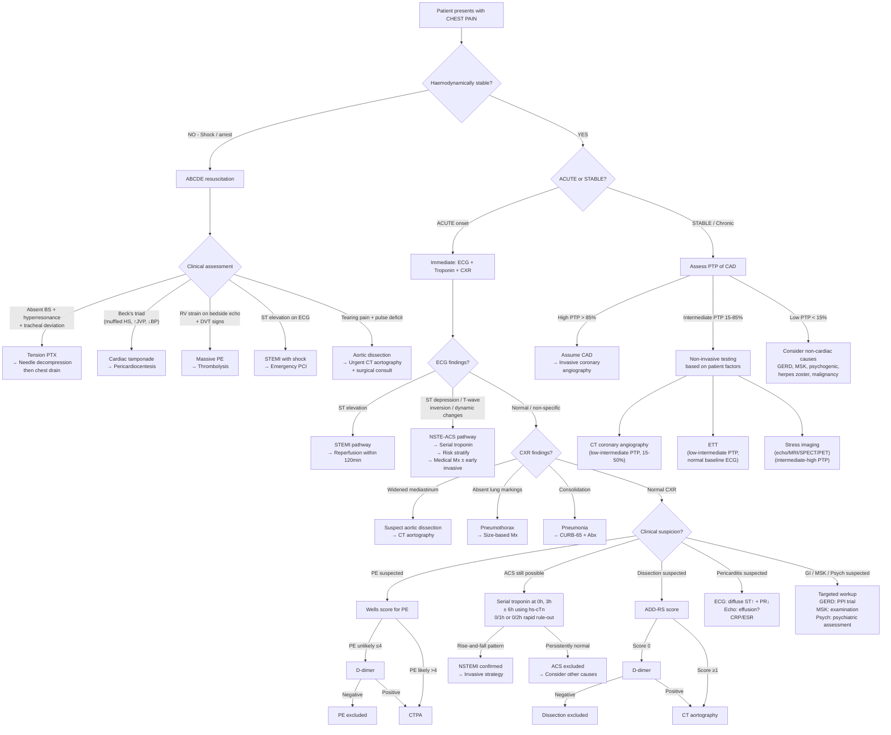

## Diagnostic Criteria for Key Aetiologies

Because "chest pain" is a symptom and not a single disease, there is no single set of diagnostic criteria for it. Instead, you apply the relevant diagnostic criteria for whichever aetiology you are trying to confirm or exclude. Below are the criteria for the most important causes you must know.

---

### 1. Acute Coronary Syndrome — Diagnostic Criteria

#### A. 4th Universal Definition of Myocardial Infarction (ESC/AHA 2018, updated from 3rd UD)

The fundamental concept: **MI = myocardial necrosis in a clinical setting consistent with acute myocardial ischaemia**. You need TWO things: (1) evidence of myocardial injury (troponin rise-and-fall) AND (2) evidence of ischaemia (symptoms, ECG, imaging, or angiographic findings).

***Detection of rise and/or fall of cardiac biomarker values (preferably cTn) with at least 1 value above the 99th percentile upper reference limit (URL); plus ≥1 of*** [1]:
1. ***Symptoms of ischaemia***
2. ***New or presumed new significant ST-T changes or new LBBB***
3. ***Development of pathological Q waves***
4. ***Imaging evidence of new loss of viable myocardium or new regional wall motion abnormality***
5. ***Identification of an intracoronary thrombus by angiography or post-mortem***

Why the 99th percentile? Because troponin can be mildly elevated in many non-ischaemic conditions (sepsis, renal failure, HF, myocarditis). The 99th percentile represents the threshold above which there is a statistically significant deviation from the normal population. With modern high-sensitivity troponin (hs-cTn) assays, the key is not just the absolute value but the **rise-and-fall pattern** — a delta (Δ) change ≥20% at 3–6 hours indicates acute myocardial injury rather than chronic elevation.

#### MI Types [1]

| ***Type*** | ***Description*** | ***Key Feature*** |
|---|---|---|
| ***Type 1*** | ***Spontaneous MI due to primary coronary event (plaque erosion/rupture, fissuring, dissection)*** | Atherothrombotic mechanism; needs coronary angiography ± intervention |
| ***Type 2*** | ***MI secondary to ischaemia due to supply-demand imbalance (coronary spasm, anaemia, hypotension, tachyarrhythmia)*** | Treat the underlying cause, not necessarily PCI |
| ***Type 3*** | ***Sudden cardiac death with symptoms of ischaemia + new ischaemic ECG changes/LBBB but death before biomarkers available*** | Post-mortem diagnosis or clinical presumption |
| ***Type 4a*** | ***MI associated with PCI (cTn > 5× 99th URL)*** | Procedural complication |
| ***Type 4b*** | ***MI associated with verified stent thrombosis*** | Stent thrombosis on angiography or autopsy |
| ***Type 5*** | ***MI associated with CABG (cTn > 10× 99th URL)*** | Peri-operative complication |

<Callout title="Why Distinguish Type 1 vs Type 2 MI?">
This matters enormously for management. Type 1 MI is driven by atherothrombosis → needs dual antiplatelet therapy + anticoagulation + revascularisation. Type 2 MI is driven by supply-demand mismatch (e.g., sepsis with tachycardia causing demand ischaemia in a patient with stable CAD) → treating the precipitant (e.g., fluids, blood transfusion, rate control) is more important than invasive coronary intervention.
</Callout>

#### B. ECG Classification of ACS

The ECG is the **single most important initial investigation** in chest pain because it divides ACS into pathways with different treatment urgency:

| ECG Pattern | Diagnosis | Implication |
|---|---|---|
| ***ST elevation*** (+ reciprocal depression) | ***STEMI*** | ***Significant arterial occlusion leading to transmural MI*** [1] → urgent reperfusion (PCI or thrombolysis) |
| ST depression / T-wave inversion / dynamic changes | NSTEMI (if troponin +ve) or UA (if troponin –ve) | Partial occlusion / microembolisation → risk-stratify → medical Mx ± early invasive strategy |
| Normal / non-specific | Possible ACS — serial ECGs + troponins needed | Cannot rule out ACS on single normal ECG |

***STEMI ECG features (sequential)*** [1]:
1. ***ST elevation + reciprocal ST depression*** (usually disappears after acute phase)
2. ***Pathological Q waves*** (***85% persist indefinitely***)
3. ***Inverted T waves*** (usually ↓ amplitude after acute phase)

> ***Persistent ST segment elevation after STEMI should raise suspicion for ventricular aneurysm*** [1].

#### C. Typical Angina Criteria (ESC 2019 Chronic Coronary Syndromes)

Three criteria must all be present for "typical angina":
1. Constricting discomfort in the chest, jaw, shoulder, or arm
2. Provoked by physical exertion or emotional stress
3. Relieved by rest and/or sublingual GTN within 5 minutes

- **Atypical angina**: 2 of 3 features
- **Non-anginal chest pain**: ≤ 1 of 3 features

This classification feeds directly into the **pre-test probability (PTP) of CAD**, which determines the choice of further diagnostic testing.

---

### 2. Pulmonary Embolism — Wells Score

***Wells score for PE — clinical assessment*** [18]:

| ***Description*** | ***Score*** |
|---|---|
| ***Clinical symptoms of DVT (leg swelling, pain with palpation)*** | ***3.0*** |
| ***Other diagnosis less likely than PE*** | ***3.0*** |
| ***Immobilisation ≥ 3 days or surgery in previous 4 weeks*** | ***1.5*** |
| ***Previous DVT/PE*** | ***1.5*** |
| ***Tachycardia (HR > 100)*** | ***1.5*** |
| ***Haemoptysis*** | ***1.0*** |
| ***Malignancy*** | ***1.0*** |

***Interpretation*** [18]:

| ***Traditional (3-level)*** | ***Score*** |
|---|---|
| ***High*** | *** > 6.0*** |
| ***Moderate*** | ***2.0 – 6.0*** |
| ***Low*** | *** < 2.0*** |

| ***Simplified (2-level, recommended by NICE)*** | ***Score*** |
|---|---|
| ***PE likely*** | *** > 4.0*** |
| ***PE unlikely*** | ***≤ 4.0*** |

Why does this work? Each item represents either a risk factor for VTE or a clinical finding that makes PE more likely relative to other diagnoses. The score is not diagnostic in itself — it determines the **pathway** (D-dimer first vs straight to CTPA).

---

### 3. Aortic Dissection — Aortic Dissection Detection Risk Score (ADD-RS)

There is no single validated "Wells-like" score universally adopted, but the **ADD-RS** (AHA/ACC 2010, updated ESC 2024) stratifies pre-test probability:

| Category | Feature | Score |
|---|---|---|
| **High-risk conditions** | Marfan / connective tissue disorder, family Hx of aortic disease, known aortic valve disease, known thoracic aortic aneurysm, previous aortic manipulation/surgery | 1 (if any present) |
| **High-risk pain features** | Chest/back/abdominal pain that is abrupt onset, severe intensity, or described as tearing/ripping/sharp | 1 (if any present) |
| **High-risk examination features** | Pulse deficit, BP discrepancy > 20 mmHg, focal neurological deficit + pain, new aortic diastolic murmur + pain, hypotension/shock | 1 (if any present) |

- **ADD-RS 0**: Low probability → D-dimer; if negative, dissection essentially ruled out
- **ADD-RS 1**: Intermediate → urgent imaging (CT aortography or TOE)
- **ADD-RS ≥ 2**: High probability → urgent imaging without delay

---

### 4. Pericarditis — Diagnostic Criteria (ESC 2015)

Diagnosis requires **≥ 2 of 4 criteria**:
1. **Pericarditic chest pain**: sharp, pleuritic, positional (better sitting forward), trapezius ridge radiation
2. **Pericardial friction rub**: pathognomonic but transient and may be missed
3. **ECG changes**: widespread concave-up ST elevation with PR depression (not in a coronary territory distribution — distinguishes from STEMI)
4. **New or worsening pericardial effusion** on echocardiography

Supporting features: elevated inflammatory markers (CRP, ESR, WCC), evidence of pericardial inflammation on cardiac CT or MRI.

---

### 5. Tension Pneumothorax — Clinical Diagnosis

***Tension pneumothorax is a clinical diagnosis (should NOT be diagnosed based on CXR → emergency)*** [7]. Criteria:
- Acute dyspnoea + pleuritic chest pain
- Absent breath sounds + hyperresonant percussion on affected side
- Tracheal deviation AWAY from affected side
- Haemodynamic compromise: marked tachycardia, hypotension, distended neck veins

**Do NOT wait for imaging** — proceed directly to needle decompression.

---

## Diagnostic Algorithm

### Master Algorithm: Approach to Chest Pain

---

## Investigation Modalities: Key Findings and Interpretations

### A. First-Line Investigations (Performed in ALL Acute Chest Pain)

#### 1. 12-Lead Electrocardiogram (ECG)

The ECG is the **most important first-line investigation** in acute chest pain. It should be performed ***within 10 minutes of presentation*** and is the gatekeeper to reperfusion therapy.

***Perform 12-lead ECG as soon as possible*** [1].

| Diagnosis | ECG Findings | Pathophysiological Explanation |
|---|---|---|
| **STEMI** | ***ST elevation + reciprocal ST depression → pathological Q waves → T-wave inversion*** [1] | Transmural ischaemia → injury current flowing from ischaemic to normal myocardium → ST vector points towards infarct zone. Pathological Q = electrical "window" through dead tissue |
| **NSTEMI / UA** | ST depression, T-wave inversion, or dynamic ST-T changes | Subendocardial ischaemia → injury current vector points away from leads → ST depression. T-wave inversion = repolarisation abnormality from ischaemic myocardium |
| **Pericarditis** | ***Diffuse concave-up ("saddle-shaped") ST elevation + PR depression*** in multiple leads, NOT in a single coronary territory | Epicardial inflammation → diffuse injury current. PR depression = atrial inflammation (atrial injury current). Key distinction from STEMI: diffuse (not territorial), concave-up (not convex), PR depression present |
| ***PE*** | ***Sinus tachycardia; massive: S1Q3T3 pattern, RBBB, right axis deviation, T-wave inversion V1–V4, AF*** [6][18] | Acute RV pressure overload → RV dilatation → altered cardiac axis → S1Q3T3. RV strain → T-wave inversion in right-sided leads. Tachycardia = compensatory for ↓CO |
| ***Aortic dissection*** | ***Often normal; may show ST elevation if coronary ostial involvement (typically inferior → RCA)*** [5] | Dissection extending to RCA ostium → genuine ischaemia. **PITFALL**: giving thrombolytics here is lethal |
| **Stable IHD** | ***Pathological Q waves (previous MI), LBBB, ST/T changes, LVH, arrhythmias*** [1][2] | Old infarct scar → permanent Q waves. LVH → repolarisation abnormality mimicking ischaemia |
| **Pneumothorax** | Low voltage, electrical alternans (if large), axis deviation away from PTX side | Air in pleural space insulates electrical signals. Mediastinal shift alters cardiac axis |

<Callout title="ECG Localisation of STEMI" type="idea">
The leads showing ST elevation tell you which coronary territory is involved:
- **Anterior (V1–V4)**: LAD occlusion
- **Lateral (I, aVL, V5–V6)**: LCx occlusion
- **Inferior (II, III, aVF)**: RCA (or sometimes LCx) occlusion
- **Posterior (tall R in V1–V2, ST depression V1–V3)**: Posterior descending artery (usually RCA)
- **Right ventricular (ST↑ in V4R)**: Proximal RCA occlusion

This localisation matters because it predicts complications (e.g., inferior MI → vagal stimulation → bradycardia; anterior MI → largest territory → worst LV function).
</Callout>

#### 2. Cardiac Biomarkers (Troponin)

***Cardiac enzymes daily × 3 days (repeat troponin 6–12h later if 1st Tn is normal)*** [1][2].

| Biomarker | Timing | Interpretation |
|---|---|---|
| **High-sensitivity troponin (hs-cTnT or hs-cTnI)** | Detectable from 1–3h after onset; peaks 12–24h; normalises 5–14 days | **Gold standard** for myocardial injury. Rise-and-fall pattern = acute injury. Persistently elevated = chronic (e.g., CKD, HF). Modern **rapid rule-out protocols** (0/1h or 0/2h) allow early exclusion of MI if both baseline and repeat hs-cTn are below specific thresholds with no significant delta change |
| **CK-MB** | Rises 3–6h; peaks 12–24h; normalises 2–3 days | Less specific than troponin (also ↑ in skeletal muscle injury). Mainly useful for detecting **re-infarction** (because it clears faster than troponin) |
| **Myoglobin** | Earliest to rise (1–2h); normalises < 24h | Very sensitive but very non-specific. Largely superseded by hs-cTn |

***Cardiac enzymes checked: cTnT, cTnI, CK-MB*** [5].

Why troponin and not CK-MB as the gold standard? Because troponins (cTnT and cTnI) are **structural proteins unique to cardiac myocytes** (not found in skeletal muscle in significant amounts), whereas CK-MB is also present in skeletal muscle (just in lower proportion). Troponin therefore has higher specificity for myocardial injury.

**Important causes of troponin elevation WITHOUT ACS** (Type 2 MI or non-ischaemic myocardial injury):
- Myocarditis, pericarditis
- Heart failure (myocyte stretch → troponin leak)
- Pulmonary embolism (RV strain)
- Sepsis/critical illness
- Renal failure (↓clearance + chronic myocardial stress)
- Takotsubo cardiomyopathy
- Aortic dissection (coronary malperfusion or aortic root haematoma)

#### 3. Chest X-Ray (CXR)

***CXR: usually non-diagnostic in ACS, look for other causes (e.g., aortic dissection, PE, pneumonia, or pneumothorax)*** [1][2].

| Diagnosis | CXR Findings | Pathophysiological Explanation |
|---|---|---|
| **ACS** | Usually normal; may show pulmonary oedema (bat-wing opacity, upper lobe diversion, Kerley B lines) if LVF | Acute LV failure → ↑LVEDP → ↑pulmonary venous pressure → pulmonary oedema |
| ***Aortic dissection*** | ***Irregular or wavy aortic outline; widening of aortic silhouette; widening of mediastinum (erect PA > 6 cm, supine AP > 8 cm); unable to see aortic knuckle and descending aorta*** [5] | False lumen expands aortic diameter → widened mediastinal shadow. Haemothorax if rupture into pleural space (usually left-sided) |
| **Pneumothorax** | Absent lung markings with visible visceral pleural line; lung collapse towards hilum. Tension: mediastinal shift to contralateral side | Air in pleural space separates visceral from parietal pleura. In tension: progressive air accumulation pushes mediastinum |
| **Pneumonia** | Lobar consolidation with air bronchograms; patchy infiltrates (bronchopneumonia); parapneumonic effusion | Alveolar filling with inflammatory exudate → opacification. Air bronchograms = patent bronchi surrounded by consolidated (airless) alveoli |
| ***PE*** | ***Often non-specific (normal in 12–22%); Hampton hump (peripheral wedge-shaped opacity); Westermark sign (focal oligaemia); enlarged pulmonary artery; blunted costophrenic angle (effusion); linear atelectasis*** [6] | Hampton hump = pulmonary infarction. Westermark = absent blood flow distal to embolus → focal lucency. Atelectasis = surfactant loss from ischaemic alveoli |
| **Pericardial effusion** | Globular "water-bottle" cardiac silhouette | Fluid surrounds heart → uniform enlargement of cardiac shadow |
| **HF / APO** | Cardiomegaly, upper lobe venous diversion, bilateral perihilar bat-wing opacities, Kerley B lines, pleural effusions (usually bilateral, R > L) | Raised pulmonary venous pressure → fluid transudation into interstitium (Kerley B lines) then alveoli (bat-wing) |

#### 4. Basic Blood Tests

***Basic bloods: CBC, L/RFT, lipid profile (≤ 24h), aPTT/INR (as baseline for heparin)*** [1][2].

| Test | What to Look For | Clinical Rationale |
|---|---|---|
| **CBC** | ***Anaemia (may exacerbate IHD), ↑WBC (infection, stress response), ↓PLT (bleeding risk)*** [19] | Anaemia → ↓O₂ delivery → unmasks subclinical CAD (Type 2 MI). Leucocytosis → pneumonia, sepsis, or stress response in MI |
| **L/RFT** | ***↑U/Cr (AKI from shock; baseline before contrast), ↑ALT/AST (shock liver), electrolytes*** [19] | Renal function essential before CT contrast. Hypokalaemia predisposes to arrhythmias in ACS |
| **Lipid profile** | LDL, HDL, TG, total cholesterol | Prognostic and guides long-term statin therapy. Must be done ***≤ 24h*** of presentation (lipids fall after acute MI) |
| **HbA1c / fasting glucose** | Screen for DM | DM = major CAD risk factor; also predicts worse outcomes in ACS |
| **TFT** | Thyrotoxicosis, hypothyroidism | Thyrotoxicosis → high-output state → may precipitate angina; hypothyroidism → dyslipidaemia |
| ***aPTT/INR*** | ***Baseline before heparin*** [1][2] | Essential before initiating anticoagulation |
| ***ABG + lactate*** | ***↓PaO₂ (PE, pneumonia, PTX); lactic acidosis (shock/poor tissue perfusion); metabolic acidosis*** [19] | Lactate is the best surrogate for tissue perfusion adequacy. Type 1 respiratory failure (↓PaO₂, N/↓PaCO₂) in PE [6] |
| ***D-dimer*** | ***↑ in PE, DVT, aortic dissection, DIC, sepsis*** [19] | Fibrin degradation product. ***Sensitive but not specific → high NPV in low-risk patients*** [6]. Used in PE and aortic dissection (ADD-RS 0) rule-out pathways |
| ***Cardiac enzymes / BNP*** | ***MI (cause or consequence of shock); BNP for HF*** [19] | BNP/NT-proBNP released from stretched ventricular myocytes → quantifies volume/pressure overload |

---

### B. Cause-Specific Investigations

#### For Suspected ACS — Beyond Initial ECG and Troponin

| Investigation | Indication | Key Findings / Interpretation |
|---|---|---|
| ***Serial 12-lead ECG*** | ***Repeat at least daily × 3 days (more frequently in severe cases)*** [1][2] | Dynamic ST-T changes on serial ECGs strongly suggest ongoing ischaemia. New Q waves = completed infarction |
| ***Serial troponin*** | ***Repeat troponin 6–12h later if 1st Tn is normal*** [1][2]; modern **0/1h or 0/2h rapid rule-out** with hs-cTn | Rule-in: hs-cTn above 99th URL with significant delta. Rule-out: both values very low with minimal delta |
| **Echocardiography** | ***Recommended by ESC 2013: evaluate (1) regional wall motion abnormalities (2) LVEF → important prognostic parameter (3) other structural cardiac conditions*** [1][2] | New RWMA = evidence of ischaemia/infarction. LVEF guides prognosis and determines need for ICD. Also detects mechanical complications (MR, VSD, free wall rupture, aneurysm) |
| **Invasive coronary angiography** | Gold standard for coronary anatomy; indicated in STEMI (primary PCI), high-risk NSTEMI, failed medical therapy | Direct visualisation of coronary stenosis. Allows simultaneous PCI if indicated |

#### For Stable Chest Pain — Diagnostic Testing for CAD

***Choice of investigation depends on pre-test probability (PTP) of CAD*** [1][2].

***Principle: different tests have different sensitivity and specificity → suitable for different groups. Diagnostic testing is only useful for PTP between 15% and 85%*** [1].
- ***If PTP > 85%: assume CAD → invasive angiography***
- ***If PTP < 15%: assume no CAD → look for non-cardiac causes***

| ***Test*** | ***Useful In*** | ***Not For*** | ***Interpretation*** |
|---|---|---|---|
| ***Coronary CT angiography (CTA)*** | ***Low-intermediate PTP (15–50%); adequate breath-holding; HR ≤ 65 bpm; Agatston score < 400; younger individuals; LVH (↑ risk of FP in stress testing)*** [1] | ***Severe obesity; CKD (calcification + contrast nephropathy); prior CABG; prior stenting (metal artefact); asymptomatic screening*** [1] | ***CT calcium (Agatston) score: > 130 HU = calcium, score > 100 → significant CAD risk. BUT poor correlation with degree of luminal stenosis → zero calcium cannot rule out stenoses in symptomatic patients. CT coronary angiogram: significant stenosis = ≥ 70%. Advantage: excellent NPV (99–100%) in low-intermediate PTP*** [1] |
| ***Exercise tolerance test (ETT)*** | ***Low-intermediate PTP (15–65%); normal baseline ECG; not on anti-ischaemic drugs*** [1] | ***Abnormal baseline ECG (LBBB, paced rhythm, WPW, AF, LVH, digoxin); limited exercise tolerance due to non-cardiac disease*** [1] | ***Positive test: horizontal or downsloping ST depression ≥ 0.1 mV (1 mm) 80 ms after J point during exercise*** [1]. Also note Duke Treadmill Score for prognosis. Exercise capacity itself is a powerful prognostic marker |
| **Stress imaging (echo, MRI, SPECT, PET)** | Intermediate-high PTP (50–85%); abnormal baseline ECG (where ETT is unreliable); unable to exercise (use pharmacological stress with dobutamine or adenosine) | — | Stress echo: new RWMA during stress = inducible ischaemia. Stress MRI: perfusion defect or new RWMA. SPECT/PET: reversible perfusion defect = ischaemia; fixed defect = scar |
| **Invasive coronary angiography** | High PTP ( > 85%); high-risk features on non-invasive testing; failed medical therapy; post-ACS for definitive anatomy | Low PTP (unnecessary risk) | Gold standard for coronary anatomy. Allows FFR (fractional flow reserve) to assess functional significance of intermediate stenoses (FFR ≤ 0.80 = haemodynamically significant) |

<Callout title="Exam Pearl: Why Not Just Do Coronary Angiography on Everyone?">
Invasive coronary angiography carries procedural risks (vascular access complications ~1–2%, contrast nephropathy, coronary dissection, stroke ~0.1%, radiation). In low PTP patients, the probability of finding significant disease is so low that the risks of the procedure outweigh the benefits. Non-invasive testing acts as a gatekeeper — only those with positive non-invasive tests (or very high clinical probability) proceed to the catheter lab.
</Callout>

#### For Suspected Pulmonary Embolism

***Modality of choice is highly dependent on haemodynamic stability and pre-test probability*** [6].

| Situation | Approach |
|---|---|
| ***Haemodynamically unstable (sBP < 90 or drop ≥ 40)*** | ***Definitive testing NOT indicated → bedside LL venous duplex (for DVT) or TTE (for RV strain/clot-in-transit) → treat empirically with parenteral anticoagulation + thrombolysis*** [6] |
| **Haemodynamically stable, PE likely (Wells > 4)** | ***Immediate CTPA*** [6]; if CTPA unavailable → ***start anticoagulant*** while waiting |
| **Haemodynamically stable, PE unlikely (Wells ≤ 4)** | ***D-dimer → if negative: PE excluded → if positive: CTPA*** [6] |

***CT pulmonary angiography (CTPA)*** [6]:
- ***First-line diagnostic test (Sens 91%, Spec 78%)***
- ***Contrast-enhanced spiral CT with contrast timed to highlight pulmonary arteries***
- ***Pulmonary embolus visible as filling defects*** within pulmonary arteries
- ***Sensitivity decreases for very peripheral subsegmental emboli***
- ***Contraindicated in renal impairment or contrast allergy***

***V/Q scan*** [6]:
- ***Indication: now limited to those contraindicated for CTPA (renal failure, contrast allergy, pregnancy)***
- ***Interpretation: normal scan essentially rules out PE; unmatched defects are diagnostic (Sens 41%, Spec 97%); matched defects may be due to underlying lung pathology***
- ***Most informative with otherwise normal lung and clear CXR***

***Supportive investigations*** [6]:
- ***Venous duplex of proximal leg veins***: incompressibility and filling defect (up to 50% –ve in acute PE)
- ***Echocardiography***: assessment of RV strain in acute massive PE (RV dilatation, D-shaped septum, McConnell's sign = akinesia of RV free wall with apical sparing)

#### For Suspected Aortic Dissection

***Diagnosis*** [5]:

| Investigation | Findings | Notes |
|---|---|---|
| ***CXR*** | ***Irregular/wavy aortic outline; widening of aortic silhouette; widening of mediastinum (erect PA > 6 cm, supine AP > 8 cm)*** [5] | Screening only; sensitivity ~60–70%. Normal CXR does NOT exclude dissection |
| ***ECG*** | ***Differentiate aortic dissection from AMI*** [5]; often normal or non-specific; may show ST elevation if coronary involvement | MUST do to identify co-existing coronary malperfusion |
| ***Echocardiogram*** | ***Look for aortic regurgitation, pericardial effusion, and presence of dissection flap*** [5] | TTE: sensitivity ~60% for ascending dissection. TOE: sensitivity ~98% — better for Type A. Can be done at bedside in unstable patients |
| ***CT angiography (CTA)*** | ***Indicated in haemodynamically stable patients. Diagnosis by identification of true and false lumens. Compressed true lumen is the key radiological finding. True lumen is usually smaller; false lumen is usually larger*** [5] | Gold standard in stable patients. Sensitivity and specificity both > 95%. Shows extent of dissection, branch vessel involvement, and complications |
| **MR angiography** | Similar accuracy to CTA; no radiation or iodinated contrast | Limited by availability and scan time — not for acute unstable patients |
| ***Cardiac enzymes (cTnT, cTnI, CK-MB)*** | ***Rule out concomitant MI*** [5] | Troponin may be elevated from coronary malperfusion or myocardial contusion |

#### For Suspected Pneumothorax

| Investigation | Findings | Notes |
|---|---|---|
| **CXR (erect PA)** | Visible visceral pleural edge with absent lung markings beyond it; lung collapse towards hilum; deep sulcus sign (supine film) | Size estimation: distance from chest wall to pleural line at hilum level. BTS: > 2 cm = large PTX |
| **CT thorax** | More sensitive than CXR for small pneumothoraces; quantifies size accurately | Usually reserved for complex cases, secondary PTX, or when CXR is equivocal |
| **Bedside ultrasound** | Absent lung sliding + absent comet-tail artefacts + lung point = diagnostic | Increasingly used in ED; faster than CXR; sensitivity ~90% |

***Tension PTX is a clinical diagnosis — do NOT delay treatment for imaging*** [7].

#### For Suspected Pericarditis

| Investigation | Findings |
|---|---|
| **ECG** | Diffuse concave-up ST elevation + PR depression (stage I); ST normalisation (stage II); T-wave inversion (stage III); normalisation (stage IV). Sinus tachycardia. Low voltage if effusion |
| **Echocardiography** | Pericardial effusion; diastolic collapse of RA/RV if tamponade |
| **Blood tests** | ↑CRP, ↑ESR; troponin may be ↑ if myopericarditis |
| **Cardiac MRI** | Pericardial enhancement with gadolinium = active inflammation; quantifies effusion |

#### For Suspected GI Causes

| Investigation | Findings |
|---|---|
| **PPI trial (empirical)** | Symptomatic improvement with 2-week PPI trial strongly supports GERD as cause of NCCP |
| **Upper endoscopy (OGD)** | Oesophagitis, Barrett's, ulcers; biopsy if indicated |
| **24-hour pH monitoring / impedance** | Gold standard for GERD diagnosis — quantifies acid exposure time |
| **Oesophageal manometry** | Diagnoses motility disorders: diffuse oesophageal spasm (simultaneous contractions), achalasia (absent peristalsis + failed LES relaxation) |
| **Barium swallow** | Corkscrew oesophagus (spasm); bird-beak sign (achalasia) |
| **Abdominal USG** | Gallstones, cholecystitis (thickened GB wall, pericholecystic fluid, Murphy's sign) |
| **Serum amylase/lipase** | ↑↑↑ (> 3× ULN) diagnostic of acute pancreatitis |

#### For Psychogenic / Functional Causes

Diagnosis of exclusion — must rule out organic causes first. Then apply formal diagnostic criteria:
- ***Panic disorder (DSM-5)***: recurrent unexpected panic attacks (≥ 4 of 13 symptoms) + ≥ 1 month of persistent concern or maladaptive behaviour [13]
- ***Somatic symptom disorder (DSM-5)***: ≥ 1 distressing somatic symptom + excessive thoughts/feelings/behaviours for ≥ 6 months [14]

---

### C. Summary: Investigation Checklist for Acute Chest Pain

> ***Key investigations available to the GP are ECG, cardiac enzymes, and CXR — in most instances help confirm the diagnosis*** [8]. ***Specialist investigations including imaging are confined to hospitals and cardiology centres*** [8].

***Acute chest pain initial workup*** [1][2]:
1. ***Admit CCU if high-risk (ongoing chest pain, ↓BP, APO, ventricular arrhythmia)***
2. ***Bed rest with continuous ECG monitoring***
3. ***12-lead ECG stat and repeat at least daily × 3 days***
4. ***Cardiac enzymes daily × 3 days (repeat troponin 6–12h if 1st Tn normal)***
5. ***Basic bloods: CBC, L/RFT, lipid profile (≤ 24h), aPTT/INR***
6. ***CXR: look for other causes***
7. ***If likely ACS → initiate anti-anginal, antiplatelet, anticoagulant, statin, ACEI/ARB***
8. ***Consider IV morphine if nitrates do not completely relieve pain***
9. ***Reperfusion therapy if indicated***

***For shock evaluation*** [19]:
- ***ECG: arrhythmia, ST changes (ischaemia, pericarditis), low-voltage (pericardial effusion), S1Q3T3/RV strain (PE)***
- ***CBC/D: anaemia with bleeding, ↑eosinophil (anaphylaxis), ↑/↓WCC (sepsis)***
- ***L/RFT: AKI, shock liver, electrolyte disturbance***
- ***ABG + lactate: lactic acidosis, ventilation assessment***
- ***Cardiac enzymes / BNP***
- ***Clotting + D-dimer: PE, DIC***
- ***CXR: pneumonia, PTX, pulmonary oedema, widened mediastinum***
- ***± Bedside USG: cardiac pathologies, PTX, effusion, DVT***

---

<Callout title="High Yield Summary">

**ACS diagnosis**: Rise-and-fall of troponin (preferably hs-cTn) above 99th URL + ≥1 of: ischaemic symptoms, new ST-T/LBBB, pathological Q, imaging RWMA, intracoronary thrombus. Type 1 (atherothrombotic) vs Type 2 (supply-demand mismatch) distinction is critical for management.

**ECG is king in acute chest pain**: STEMI → immediate reperfusion; diffuse ST↑ + PR↓ → pericarditis; S1Q3T3 → PE; widened mediastinum on CXR → dissection. Serial ECGs are essential — a single normal ECG does NOT exclude ACS.

**PE workup**: Wells score → if unlikely: D-dimer → if positive: CTPA. If likely: straight to CTPA. If unstable: bedside echo + empiric thrombolysis.

**Dissection workup**: CXR (widened mediastinum but sensitivity only 60–70%), ECG (to differentiate from AMI), echocardiogram (AR, effusion, flap), CT aortography (gold standard in stable patients — true vs false lumen, compressed true lumen is key finding).

**Stable CAD testing**: PTP-driven. Low-intermediate → CT coronary angiography (excellent NPV). Normal baseline ECG → ETT. Abnormal baseline ECG → stress imaging. High PTP → invasive angiography.

**Troponin interpretation**: Rise-and-fall = acute injury. Persistently elevated = chronic (CKD, HF). Many non-ACS causes exist. Modern 0/1h and 0/2h rapid rule-out protocols with hs-cTn allow early discharge of low-risk patients.

**Tension PTX**: Clinical diagnosis — do NOT wait for CXR. Needle decompression first.
</Callout>

---

<ActiveRecallQuiz
  title="Active Recall - Diagnostic Criteria, Algorithm and Investigations for Chest Pain"
  items={[
    {
      question: "State the 4th Universal Definition of MI. What two components are required for the diagnosis?",
      markscheme: "Two components: (1) Detection of rise and/or fall of cardiac biomarker (preferably cTn) with at least 1 value above the 99th percentile URL, plus (2) at least 1 of: symptoms of ischaemia, new significant ST-T changes or new LBBB, pathological Q waves, imaging evidence of new loss of viable myocardium or new RWMA, or intracoronary thrombus on angiography/autopsy."
    },
    {
      question: "A haemodynamically stable patient has a Wells score for PE of 3. Describe the next steps in the diagnostic algorithm.",
      markscheme: "Wells score 3 = PE unlikely (score ≤4 on simplified 2-level). Next step: D-dimer testing. If D-dimer negative: PE effectively excluded (high NPV in low-risk patients). If D-dimer positive: proceed to CTPA (first-line imaging, contrast-enhanced spiral CT timed to highlight pulmonary arteries, looking for filling defects). If CTPA contraindicated (renal failure, contrast allergy, pregnancy): V/Q scan."
    },
    {
      question: "List the CXR findings in aortic dissection and explain why CT aortography is the gold standard investigation.",
      markscheme: "CXR findings: irregular/wavy aortic outline, widening of aortic silhouette, widening of mediastinum (erect PA >6cm, supine AP >8cm), loss of aortic knuckle. However CXR sensitivity is only 60-70% so a normal CXR does NOT exclude dissection. CT aortography is gold standard in stable patients because it has >95% sensitivity and specificity, identifies true and false lumens (compressed true lumen = key finding, true lumen usually smaller), shows extent of dissection, branch vessel involvement, and complications."
    },
    {
      question: "Explain the principle of pre-test probability in choosing investigations for stable chest pain. Why should you NOT do CT coronary angiography in a patient with PTP above 85%?",
      markscheme: "Different tests have different sensitivity and specificity. Diagnostic testing is useful for PTP 15-85%. If PTP >85%, assuming all patients have CAD and proceeding directly to invasive coronary angiography is superior to non-invasive testing (which would have unacceptable false-negative rate at this high prevalence). CT coronary angiography has excellent NPV (99-100%) making it ideal for ruling OUT disease in low-intermediate PTP, but in high PTP its negative results would be unreliable. Also, high PTP patients likely need invasive angiography anyway for potential intervention."
    },
    {
      question: "Name three ECG features that distinguish pericarditis from STEMI.",
      markscheme: "1. Distribution: Pericarditis has diffuse ST elevation across multiple leads not confined to a single coronary territory; STEMI has territorial ST elevation with reciprocal depression. 2. ST morphology: Pericarditis ST elevation is concave-up (saddle-shaped); STEMI is typically convex-up. 3. PR segment: PR depression is present in pericarditis (from atrial inflammation) but absent in STEMI. Additional: pericarditis has no pathological Q waves and no reciprocal ST depression (except aVR and V1)."
    },
    {
      question: "What is the positive ETT criterion for myocardial ischaemia, and in which patients is ETT NOT appropriate?",
      markscheme: "Positive ETT: horizontal or downsloping ST depression of 0.1mV or more (1mm) measured 80ms after the J point during exercise. ETT is NOT appropriate in: abnormal baseline ECG (LBBB, paced rhythm, WPW syndrome, AF, LVH, digoxin use) because these conditions cause baseline ST-T abnormalities that make interpretation of exercise-induced changes unreliable. Also not appropriate in patients with limited exercise tolerance due to non-cardiac disease (cannot reach 85% of maximal predicted heart rate)."
    }
  ]}
/>

---

## References

[1] Senior notes: Ryan Ho Cardiology.pdf (p54–58, p115–117, p127–128, p142, "Chest Pain", "Stable Angina and IHD", "ACS", "Ventricular Aneurysm")
[2] Senior notes: Ryan Ho Fundamentals.pdf (p199–203, "Chest Pain")
[5] Senior notes: felixlai.md (Aortic Dissection — diagnosis, CXR findings, CT angiography)
[6] Senior notes: Ryan Ho Respiratory.pdf (p134–136, "PE — Investigations and Diagnosis")
[7] Senior notes: Ryan Ho Respiratory.pdf (p151–152, "Pneumothorax")
[8] Lecture slides: murtagh merge.pdf (p25–26, p29, "Chest pain in adults", "Chest pain in children")
[13] Senior notes: Ryan Ho Psychiatry.pdf (p178–179, "Panic Disorder")
[14] Senior notes: Ryan Ho Psychiatry.pdf (p202–203, "Somatic Symptom Disorder")
[18] Senior notes: felixlai.md (Wells score for PE)
[19] Senior notes: Ryan Ho Critical Care.pdf (p17, "Shock — early investigations")
[20] Senior notes: Ryan Ho Diagnostic Radiology.pdf (p43, "CT Angiography and Cardiac CT")
