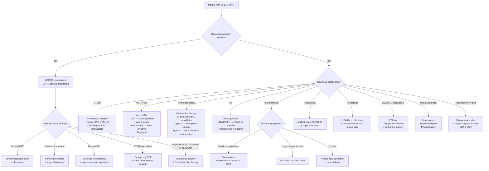

## Management Algorithm: Overview

The management of chest pain is entirely **aetiology-driven**. There is no "treatment for chest pain" — there is treatment for the specific cause of the chest pain. Your first job is to **risk-stratify and diagnose**, and then management flows logically from the diagnosis. The critical principle is: **treat the most dangerous cause first, even while working up the diagnosis**.

The mnemonic for the emergency approach is **"ABCDE then treat the cause"**.

---

### Master Management Algorithm

---

## Management by Specific Aetiology

### 1. Acute Coronary Syndrome (ACS)

ACS is the single most important cause to manage correctly because (a) it's common, (b) it's time-sensitive, and (c) every treatment decision has strong evidence behind it.

#### A. Initial Management (All ACS Patients)

***If likely ACS, then initiate anti-anginal (nitrates, β-blocker ±), antiplatelet (aspirin, clopidogrel), anticoagulant (LMWH), early statin and ACEI/ARB*** [1][2].

***Admit CCU if high-risk (ongoing chest pain, ↓BP, APO, ventricular arrhythmia)*** [1][2].

| Step | Treatment | Mechanism / Rationale | Key Details |
|---|---|---|---|
| ***Bed rest*** | ***Continuous ECG monitoring*** [1][2] | Reduces myocardial O₂ demand (↓HR, ↓BP, ↓contractility); monitoring detects arrhythmias early | CCU setting with defibrillator access |
| **Oxygen** | Supplemental O₂ only if SpO₂ < 90% | Corrects hypoxaemia. Routine high-flow O₂ is NOT recommended (DETO2X-AMI trial showed no benefit and potential harm from hyperoxia-induced coronary vasoconstriction) | Target SpO₂ 94–98% |
| **Pain relief** | ***IV morphine if nitrates do not relieve pain completely*** [1][2] | Opioid agonist → analgesia + anxiolysis + venodilation (↓preload → ↓O₂ demand). Give with antiemetic (metoclopramide) as morphine causes nausea via CTZ stimulation | 2.5–5 mg IV titrated; C/I: respiratory depression, hypotension |
| **Antiplatelet 1** | ***Aspirin*** (loading 300 mg then 75–100 mg daily) [1][2] | Irreversibly inhibits COX-1 → blocks thromboxane A₂ (TXA₂) synthesis → ↓platelet aggregation. TXA₂ is a potent platelet activator released from activated platelets | C/I: true aspirin allergy (not intolerance), active GI bleed |
| **Antiplatelet 2** | ***Clopidogrel*** (loading 300–600 mg then 75 mg daily) or ticagrelor (180 mg then 90 mg BD) or prasugrel (60 mg then 10 mg daily) [1][2] | P2Y₁₂ receptor antagonists → block ADP-mediated platelet activation. ADP is the second major pathway of platelet aggregation after TXA₂. **DAPT = Dual AntiPlatelet Therapy = aspirin + P2Y₁₂ inhibitor** | Ticagrelor preferred over clopidogrel in most ACS (PLATO trial); prasugrel for STEMI going to PCI (TRITON-TIMI 38). Clopidogrel if ticagrelor/prasugrel C/I or high bleeding risk |
| **Anticoagulant** | ***LMWH*** (enoxaparin 1 mg/kg SC BD) or UFH (bolus + infusion, target aPTT 1.5–2.5×) [1][2] | Potentiates antithrombin III → inhibits factor Xa (LMWH) or both factor Xa and thrombin (UFH). Prevents thrombus propagation on top of ruptured plaque. Fondaparinux (factor Xa inhibitor) is an alternative | LMWH preferred over UFH in NSTE-ACS (easier dosing, no monitoring). UFH preferred if PCI planned (easily reversible with protamine, can monitor with ACT) |
| **Anti-anginal** | ***Nitrates*** (sublingual GTN → IV GTN if pain persists) [1][2] | Nitric oxide donor → venodilation (↓preload → ↓wall stress → ↓O₂ demand) + coronary vasodilation. "nitro" = nitrogen, referring to the nitrate group that releases NO | C/I: hypotension (SBP < 90), recent PDE5 inhibitor use (sildenafil within 24h, tadalafil within 48h) → risk of severe hypotension |
| **Anti-anginal** | ***β-blocker*** (metoprolol, bisoprolol) [1][2] | Blocks β₁-adrenergic receptors on heart → ↓HR, ↓contractility, ↓BP → ↓myocardial O₂ demand. Also anti-arrhythmic (class II) | C/I: acute decompensated HF, cardiogenic shock, severe bradycardia, 2nd/3rd-degree AV block, severe asthma. Start early but cautiously in haemodynamically stable patients |
| ***Statin*** | ***Early high-intensity statin*** (atorvastatin 80 mg) [1][2] | HMG-CoA reductase inhibitor → ↓cholesterol synthesis → upregulates hepatic LDL receptors → ↓LDL. Also has **pleiotropic effects**: plaque stabilisation (↓inflammation, ↑endothelial function), antithrombotic | Start within 24h regardless of baseline LDL. Check lipid profile ≤ 24h (falls after acute MI) |
| ***ACEI/ARB*** | ***ACEI (ramipril, perindopril) or ARB if ACEI-intolerant*** [1][2] | Blocks RAAS → ↓afterload + prevents adverse ventricular remodelling (fibrosis, dilatation) post-MI. Proven mortality benefit particularly in anterior MI, LV dysfunction, HF, DM | C/I: bilateral renal artery stenosis, hyperkalaemia, pregnancy, severe hypotension. Start within 24h if stable |

<Callout title="The ACS Drug Cocktail — Memory Aid: MONA-B-SACH" type="idea">
**M**orphine, **O**xygen (if needed), **N**itrates, **A**spirin — **B**eta-blocker — **S**tatin, **A**CEI, **C**lopidogrel (or ticagrelor), **H**eparin (LMWH).
This covers the initial management of essentially all ACS patients. The order reflects urgency: pain relief first, then antiplatelet/anticoagulation to halt thrombus progression, then secondary prevention agents.
</Callout>

#### B. Reperfusion Therapy for STEMI

***Reperfusion therapy if indicated (most STE-ACS, selected NSTE-ACS)*** [1][2].

The goal: **restore blood flow through the occluded coronary artery as quickly as possible to salvage ischaemic myocardium**. Every minute of delay = more myocardial death. "Time is muscle."

| Modality | Indication | Details |
|---|---|---|
| **Primary PCI** (percutaneous coronary intervention) | **Preferred reperfusion strategy** for STEMI if available within 120 minutes of first medical contact | Catheter-based approach: coronary angiography → identify culprit lesion → balloon angioplasty + drug-eluting stent (DES) placement. Achieves TIMI-3 flow in ~90% (vs ~55% for thrombolysis). Door-to-balloon target: ≤ 90 min |
| **Fibrinolysis** | STEMI when PCI not available within 120 min | IV fibrinolytic agent (alteplase, tenecteplase, streptokinase) activates plasminogen → plasmin → dissolves fibrin clot. Must be given within 12h of symptom onset (ideally < 3h). Door-to-needle target: ≤ 30 min |

**Fibrinolytic agents**:
- **Alteplase** (tPA): fibrin-specific, short half-life, given as bolus + infusion. "alte" = altered form of tissue plasminogen activator
- **Tenecteplase** (TNK-tPA): single IV bolus, weight-adjusted — most convenient in pre-hospital setting
- **Streptokinase**: non-fibrin-specific, antigenic (cannot repeat within 6 months due to antibody formation), cheaper

***Contraindications to fibrinolysis*** [1]:

| ***Absolute*** | ***Relative*** |
|---|---|
| ***Previous haemorrhagic stroke at any time*** | ***Severe uncontrolled HTN on presentation (BP > 180/110)*** |
| ***Other strokes or CVA within 3 months (except acute ischaemic stroke within 4.5h)*** | ***History of chronic severe poorly controlled HTN*** |
| ***Known malignant intracranial neoplasm*** | ***History of prior ischaemic stroke > 3 months*** |
| ***Known structural cerebrovascular lesion (e.g., AVM)*** | ***Traumatic or prolonged ( > 10 min) CPR*** |
| ***Active bleeding or bleeding diathesis*** | ***Oral anticoagulant therapy*** |
| ***Suspected aortic dissection*** | ***Major surgery < 3 weeks*** |
| ***Significant closed head or facial trauma within 3 months*** | ***Non-compressible vascular punctures*** |
| ***Intracranial or intraspinal surgery within 2 months*** | ***Recent internal bleeding (within 2–4 weeks)*** |
| ***Severe uncontrolled HTN unresponsive to emergency therapy*** | ***Pregnancy*** |
| ***For streptokinase: prior treatment within previous 6 months*** | ***Active peptic ulcer*** |

<Callout title="Critical Exam Point: Aortic Dissection is an ABSOLUTE Contraindication to Fibrinolysis" type="error">
***Suspected aortic dissection*** is listed as an absolute contraindication [1]. This is because fibrinolysis would dissolve the thrombus that may be partially sealing the false lumen, leading to catastrophic haemorrhage. This is why you MUST consider dissection in the differential of every STEMI before giving thrombolytics — especially when the pain is tearing, maximal at onset, or there is pulse deficit / BP discrepancy.
</Callout>

***Successful fibrinolysis documented by*** [1]:
- ***Clinical: ↓ chest pain***
- ***ECG: accelerated nodal or idioventricular rhythm, resolution of ST elevation ≥ 50% in worst ECG lead at 60–90 min after fibrinolytic***
- ***Biochemical: early peaking of CK at 11–12h (cf normal 22–24h)*** — this paradoxical early enzyme peak reflects washout of enzymes from reperfused infarcted tissue

#### C. Risk Stratification and Invasive Strategy in NSTE-ACS

Not all NSTE-ACS patients need urgent catheterisation. The timing of invasive strategy depends on risk:

| Risk Category | Features | Timing of Invasive Strategy |
|---|---|---|
| **Very high risk** | Haemodynamic instability, cardiogenic shock, recurrent/ongoing chest pain despite medical Mx, life-threatening arrhythmias, mechanical complications | Immediate (within 2h) |
| **High risk** | Rise/fall in troponin, dynamic ST/T changes, GRACE score > 140 | Early invasive (within 24h) |
| **Intermediate risk** | DM, eGFR < 60, LVEF < 40%, early post-infarct angina, prior PCI/CABG, GRACE 109–140 | Invasive (within 72h) |
| **Low risk** | None of the above | Conservative medical management; consider non-invasive testing for ischaemia |

#### D. Post-MI and Long-Term Secondary Prevention

| Treatment | Rationale | Duration |
|---|---|---|
| **DAPT** (aspirin + P2Y₁₂ inhibitor) | Prevents stent thrombosis and recurrent atherothrombotic events | 12 months post-ACS (then aspirin indefinitely) |
| **High-intensity statin** | LDL target < 1.4 mmol/L (or ≥ 50% reduction) | Indefinite |
| **ACEI/ARB** | Ventricular remodelling prevention, BP control | Indefinite (especially if LVEF ↓, anterior MI, HF, DM) |
| **β-blocker** | ↓Sudden cardiac death, ↓reinfarction (especially if LVEF ↓) | At least 1 year; indefinite if HF |
| **Mineralocorticoid receptor antagonist** (eplerenone) | ↓Mortality in post-MI with LVEF ≤ 40% and HF or DM (EPHESUS trial) | Indefinite if LVEF ≤ 40% |
| **Lifestyle modification** | Smoking cessation, exercise rehabilitation, dietary changes, weight loss, BP control, glycaemic control | Lifelong |
| **Cardiac rehabilitation** | Exercise-based rehabilitation programme — ↓cardiovascular mortality by ~25% | Start early post-discharge |

---

### 2. Aortic Dissection

#### A. General Measures [5]

- ***Book CCU/ICU bed*** [5]
- ***Monitoring by ECG, BP, pulse, input and output*** [5]
- ***Complete bed rest*** [5]
- ***Nil per oral (NPO) with IV line*** [5]
- ***Morphine as analgesia*** [5] — pain relief is critical because pain drives sympathetic activation → ↑HR, ↑BP → propagation of dissection

#### B. Medical Treatment: Anti-Impulse Therapy

The core principle: **reduce the shearing force on the aortic wall** by lowering both **blood pressure** and **dP/dt** (the rate of rise of aortic pressure, which is proportional to the force of LV ejection). BP alone is insufficient — you must reduce the "impulse" of each heartbeat.

| Drug | Class | Target | Mechanism |
|---|---|---|---|
| ***Labetalol (IV)*** [5] | Combined α + β blocker | ***HR 60–70 bpm*** [5] | β-blockade → ↓HR, ↓contractility, ↓dP/dt. α-blockade → vasodilation → ↓BP. First-line because it addresses both targets simultaneously |
| ***Sodium nitroprusside (IV)*** [5] | Vasodilator | ***SBP 100–120 mmHg*** [5] | Direct NO donor → arterial + venous dilation → ↓BP. ***Must be given WITH a β-blocker first*** — otherwise reflex tachycardia from vasodilation increases dP/dt and worsens dissection |
| **Esmolol (IV)** | Ultra-short-acting β₁-selective blocker | HR 60–70 | Alternative to labetalol; very short half-life (9 min) allows rapid dose titration. Useful if concerned about tolerability |
| **IV GTN** | Nitrate vasodilator | Adjunct for BP | Similar role to nitroprusside but less potent; also requires β-blocker first |

<Callout title="Why β-Blocker BEFORE Vasodilator?">
***The higher the BP, the more blood going into the false lumen and the more extensive the dissection*** [5]. But pure vasodilation (without β-blockade) causes reflex tachycardia → ↑dP/dt → ↑shearing force → worse dissection. Always start β-blocker first to blunt the reflex, then add vasodilator to achieve target SBP.
</Callout>

#### C. Definitive Management

| Type | Management | Rationale |
|---|---|---|
| **Stanford Type A** (ascending aorta involved) | **Emergency surgery**: replacement of ascending aorta ± aortic root ± aortic valve ± coronary reimplantation (Bentall procedure if root involved) | Ascending dissection has extremely high mortality without surgery (~1–2% per hour in the first 48h). Risk of cardiac tamponade, severe AR, coronary malperfusion |
| **Stanford Type B** (descending aorta only) | **Medical management** (anti-impulse therapy) unless complicated | Uncomplicated Type B has lower mortality with medical therapy than surgery |
| **Complicated Type B** | **Thoracic endovascular aortic repair (TEVAR)** or open surgery | Complications: malperfusion syndrome (visceral, renal, limb ischaemia), rupture, persistent pain, uncontrolled HTN, rapid aortic expansion |

---

### 3. Pulmonary Embolism

***General measures: book CCU/ICU if haemodynamically unstable*** [6]:
- ***Secure central venous access***
- ***Supplemental O₂***
- ***Treatment of circulatory shock: IV fluid or plasma expander***
- ***Avoid inotropes, diuretics, and vasodilators → treat as hypovolemic shock*** [6]
- ***Opiates to relieve pain and distress*** [6]
- ***External cardiac massage may dislodge/break up large central embolus if moribund*** [6]

Why avoid inotropes initially and treat as hypovolemic? Because in massive PE, the RV is acutely dilated and struggling. The LV is under-filled (not enough blood getting past the pulmonary vascular bed). IV fluid loading (cautious, ~500 mL bolus) increases preload to the RV → may help push blood through the obstructed pulmonary circulation. Vasodilators would drop the already low systemic BP further.

| Severity | Treatment |
|---|---|
| **Massive PE** (haemodynamically unstable) | ***Thrombolysis*** (alteplase 10 mg IV bolus then 90 mg over 2h) + parenteral anticoagulation (UFH preferred). ***Surgical embolectomy or catheter-directed therapy*** if thrombolysis C/I or fails |
| **Submassive PE** (haemodynamically stable but RV dysfunction/elevated troponin) | Anticoagulation + close monitoring. Consider thrombolysis if clinical deterioration |
| **Non-massive PE** | Anticoagulation: ***LMWH bridge → DOAC*** (rivaroxaban or apixaban — can start without bridging) ***or warfarin*** (target INR 2–3, needs LMWH bridge until therapeutic). Duration: ≥ 3 months; longer if unprovoked or ongoing risk factors |

***Anticoagulation in special situations*** [6]:
- ***Cancer patients: prefer LMWH (or DOAC) over warfarin; continue > 6 months if active cancer*** [6]
- ***Pregnancy: LMWH throughout (warfarin crosses placenta → teratogenicity, fetal ICH)*** [6]
- ***HIT (heparin-induced thrombocytopenia): heparin C/I → non-heparin parenteral anticoagulants (argatroban, fondaparinux) → bridge to warfarin*** [6]

---

### 4. Pneumothorax

Management depends on **type (primary vs secondary), size, and symptoms** [7]:

| ***Presentation*** | ***Management*** | ***Details*** |
|---|---|---|
| ***Tension pneumothorax*** | ***Emergency needle decompression*** | ***Insert 14G angiocath into 5th ICS mid-axillary line (or 2nd ICS MCL). Listen for "hissing sound" → converts tension PTX into open PTX. Insert chest tube afterwards*** [7] |
| ***Asymptomatic PSP ≤ 2 cm*** or ***asymptomatic SSP ≤ 1 cm*** | ***Conservative: discharge with early CXR in 2–4 weeks ± high-flow O₂ (esp for SSP)*** [7] | High-flow O₂ rationale: nitrogen washout from blood → increases pleural-blood N₂ gradient → accelerates reabsorption of pleural air (normally ~1.25% per day; ↑ to ~4% with high-flow O₂) |
| ***Symptomatic or > 2 cm PSP***; ***asymptomatic 1–2 cm SSP*** | ***Aspiration*** [7] | ***Insert 14G needle/angiocath under LA. Withdraw air by syringe until resistance felt. Aspirate < 2.5 L. Repeat CXR in 4h*** |
| ***Symptomatic or > 2 cm PSP/SSP; failed aspiration*** | ***Chest drain insertion*** [7] | ***Inserted at safety triangle ± USG guidance. Connected to underwater seal without suction. Small bore ( < 14Fr) drains have similar success to larger drains while being less painful*** |

***Preventing recurrence*** [7]:
- ***Risk of recurrence: 10–30% at 1–5y (1st PSP), 50% at 3y (SSP)***
- ***Indications for surgical opinion: 2nd ipsilateral PTX, 1st contralateral PTX, bilateral PTX, persistent air leak > 5–7 days, spontaneous haemothorax, at-risk professions (pilots, divers), pregnancy***
- ***Surgical treatment: resection of bullae/blebs + pleurectomy or pleurodesis via VATS (5% recurrence) or open (1% recurrence)***
- ***Medical chemical pleurodesis if unfit for surgery: tetracyclines or talc***
- ***Avoid air travel until ≥ 1 week after full resolution; avoid diving permanently unless bilateral pleurodesis with normal post-op lung function***
- ***Stop smoking***

---

### 5. Pericarditis

| Severity | Treatment | Rationale |
|---|---|---|
| **Acute pericarditis** | **NSAIDs** (ibuprofen 600 mg TDS or aspirin 750–1000 mg TDS) × 1–2 weeks, tapered over weeks **+ colchicine** (0.5 mg BD × 3 months) | NSAIDs ↓inflammation. Colchicine inhibits microtubule assembly → ↓neutrophil chemotaxis and inflammasome activation → ↓recurrence by ~50% (COPE, ICAP trials). Colchicine is the single most important addition — halves recurrence rate |
| **Post-MI pericarditis (Dressler syndrome)** | Aspirin preferred over other NSAIDs (avoid ibuprofen as it may interfere with aspirin's antiplatelet effect). Colchicine added | Avoid corticosteroids if possible — impair myocardial scar healing → ↑risk of ventricular rupture |
| **Pericarditis with effusion + tamponade** | **Pericardiocentesis** (echo-guided subxiphoid approach) | Relieves life-threatening haemodynamic compromise. Send fluid for biochemistry, cytology, microbiology, ADA (TB) |
| **Recurrent pericarditis** | Colchicine long-term (≥ 6 months); if refractory: low-dose corticosteroids, azathioprine, anakinra (IL-1 receptor antagonist) | Anakinra targets the autoinflammatory component — very effective in recurrent/refractory cases (AIRTRIP trial) |
| **Constrictive pericarditis** | Pericardiectomy if haemodynamically significant | Removal of thickened, fibrosed pericardium to relieve diastolic restriction |

C/I for corticosteroids in pericarditis: **increase recurrence rate** (COPE trial showed ↑recurrence with steroids), and in post-MI setting they impair scar formation. Use only as last resort.

---

### 6. Pneumonia

Management follows **CURB-65** severity assessment and **empirical antibiotic** guidelines (local protocols prevail):

| CURB-65 Score | Severity | Management |
|---|---|---|
| **0–1** | Low severity | Outpatient oral antibiotics (amoxicillin ± macrolide) |
| **2** | Moderate | Hospital admission; IV amoxicillin/co-amoxiclav + macrolide |
| **3–5** | Severe | ICU consideration; IV co-amoxiclav + macrolide (or piperacillin-tazobactam ± macrolide) |

Key principle: always cover typical organisms (S. pneumoniae) AND atypical organisms (Mycoplasma, Legionella) in moderate-severe CAP.

---

### 7. GERD / Oesophageal Causes

***Patients with chest pain suspected due to GERD should exclude ischaemic heart disease before initiation of empirical PPIs*** [21].

| Component | Treatment | Details |
|---|---|---|
| **Lifestyle** | Weight loss, smoking cessation, ↓alcohol, avoid late meals, elevate head of bed, avoid trigger foods [21] | These address the mechanical causes of reflux (↓LES tone, ↑intra-abdominal pressure) |
| ***PPI*** | ***Empirical PPI trial (e.g., omeprazole 20 mg BD × 2–4 weeks)*** [21] | ***Only changes acidic reflux into non-acidic reflux (changes the pH) but does NOT prevent reflux itself. Relieves heartburn and oesophagitis by reducing acidity. Regurgitation usually remains uncorrected*** [21]. Administer 30–60 min before meals for maximal efficacy |
| **H₂RA** | Famotidine, cimetidine | ***Regular use leads to tolerance → use intermittently only*** [21]. Indicated for mild oesophagitis or NERD |
| ***Anti-reflux surgery*** | ***Laparoscopic Nissen fundoplication*** [21] | Indicated for refractory symptoms despite maximal medical therapy, or patient preference to avoid lifelong PPI |
| **Oesophageal spasm** | ***PPI when gastroesophageal reflux is present; oral/sublingual nitrates or nifedipine to relieve attacks*** | Smooth muscle relaxants ↓oesophageal spasm. Nitrates work by releasing NO → smooth muscle relaxation |

---

### 8. Musculoskeletal Chest Pain

| Treatment | Rationale |
|---|---|
| **Reassurance** | Most important step — explain the benign nature. Many patients fear cardiac disease |
| **Simple analgesia** (paracetamol, NSAIDs) | ↓Inflammation and pain at costochondral junctions or muscle strain sites |
| **Physiotherapy** | Stretching, postural correction for chronic musculoskeletal pain / spinal dysfunction |
| **Avoid provocating activities** temporarily | Allows healing of strained structures |

---

### 9. Psychogenic / Panic Disorder

| Treatment | Rationale |
|---|---|
| **Rule out organic causes first** | ***One must be careful to attribute chest pain to psychogenic causes merely basing on features of anxiety*** [1] |
| **Reassurance + psychoeducation** | Explaining the mechanism (hyperventilation → alkalosis → paraesthesia → more panic → vicious cycle) helps patients understand and break the cycle |
| ***CBT (Cognitive Behavioural Therapy)*** | ***To target underlying health beliefs and expectations*** [14]; first-line psychological treatment for panic disorder and somatic symptom disorder. ***Note: 70–90% decline psychotherapy*** [14] |
| ***SSRI*** (escitalopram, sertraline) | First-line pharmacotherapy for panic disorder. Modulates serotonin → ↓amygdala reactivity → ↓panic response. Takes 2–4 weeks for effect; may transiently worsen anxiety initially — warn patient |
| ***Relaxation training*** | ***Progressive muscle relaxation, diaphragmatic breathing*** [14] |
| **Avoid benzodiazepines** long-term | Risk of dependence. Short-term (PRN) may be used for acute panic attacks while waiting for SSRI to take effect |

---

### 10. Detection and Treatment of Arrhythmias in ACS [1]

This is high-yield for exams because arrhythmias are the most common early complication of MI.

| ***Type*** | ***Management*** |
|---|---|
| ***Symptomatic sinus bradycardia*** | ***Atropine 0.3–0.6 mg IV bolus; pacing if unresponsive*** [1] |
| ***AV block: 1° or Mobitz I (Wenckebach)*** | ***Conservative*** [1] — usually resolves spontaneously |
| ***AV block: Mobitz II or 3° (complete HB)*** | ***Pacing*** [1]. ***Conservative under monitoring as alternative if inferior MI with narrow QRS escape rhythm and adequate rate*** |
| ***PSVT*** | ***Cardioversion if haemodynamic compromise; ATP 10–20 mg IV bolus → verapamil 5–15 mg IV*** [1] |
| ***AF/AFl*** | ***Digoxin, diltiazem, or amiodarone for rate/rhythm control*** [1]. Common and frequently transient |
| ***Wide complex tachycardia (treat as VT)*** | ***Cardioversion if unstable; amiodarone 150 mg IV over 10 min for stable monomorphic VT; defibrillation for polymorphic VT/VF*** [1] |
| ***VF*** | ***Prompt defibrillation per ACLS algorithm*** [1] |

---

### Summary: Critical Management Timelines

| Diagnosis | Time-Critical Action | Target |
|---|---|---|
| **STEMI** | Primary PCI | Door-to-balloon ≤ 90 min |
| **STEMI** | Fibrinolysis (if PCI unavailable) | Door-to-needle ≤ 30 min |
| **Tension PTX** | Needle decompression | **Immediate** — clinical diagnosis, no imaging |
| **Cardiac tamponade** | Pericardiocentesis | **Immediate** |
| **Massive PE** | Thrombolysis + anticoagulation | **Immediate** |
| **Aortic dissection Type A** | Anti-impulse therapy + emergency surgery | Surgery within hours |
| **NSTE-ACS very high risk** | Invasive angiography | Within 2 hours |

---

<Callout title="High Yield Summary">

**ACS initial Mx**: MONA-B-SACH — Morphine, O₂ (if needed), Nitrates, Aspirin + Beta-blocker + Statin, ACEI, Clopidogrel/ticagrelor, Heparin (LMWH).

**STEMI reperfusion**: Primary PCI preferred (door-to-balloon ≤ 90 min). Fibrinolysis if PCI unavailable (door-to-needle ≤ 30 min). Aortic dissection is an **absolute contraindication** to fibrinolysis.

**Aortic dissection**: Anti-impulse therapy (β-blocker FIRST, then vasodilator; target HR 60–70, SBP 100–120). Type A = emergency surgery. Type B = medical unless complicated (→ TEVAR).

**PE**: Massive → thrombolysis + anticoagulation. Non-massive → anticoagulation (LMWH → DOAC or warfarin ≥ 3 months). Treat shock as hypovolaemic (IV fluid, avoid vasodilators).

**Pneumothorax**: Tension → needle decompression (clinical diagnosis, don't wait for CXR). Small asymptomatic → conservative. Large/symptomatic → aspiration or chest drain. Recurrence prevention: surgical pleurectomy/pleurodesis for 2nd ipsilateral or 1st contralateral PTX.

**Pericarditis**: NSAIDs + colchicine (↓recurrence by 50%). Avoid steroids (↑recurrence, impair scar healing post-MI). Tamponade → pericardiocentesis.

**GERD**: Exclude IHD first → PPI trial. PPI changes pH but does not prevent reflux. Anti-reflux surgery if refractory.

**Psychogenic**: Rule out organic causes → reassurance → CBT ± SSRI. Never attribute to anxiety without excluding life-threatening causes.
</Callout>

---

<ActiveRecallQuiz
  title="Active Recall - Management of Chest Pain by Aetiology"
  items={[
    {
      question: "List the components of initial ACS management using the MONA-B-SACH framework, and for each drug, state its mechanism of action.",
      markscheme: "Morphine (opioid agonist - analgesia, venodilation, reduces preload), Oxygen (only if SpO2 < 90%, corrects hypoxaemia), Nitrates (NO donor - venodilation reduces preload, coronary vasodilation), Aspirin (irreversible COX-1 inhibitor - blocks TXA2 - reduces platelet aggregation), Beta-blocker (blocks beta-1 receptors - reduces HR, contractility, BP - reduces O2 demand), Statin (HMG-CoA reductase inhibitor - reduces LDL, pleiotropic plaque stabilisation), ACEI (blocks RAAS - reduces afterload, prevents ventricular remodelling), Clopidogrel/ticagrelor (P2Y12 receptor antagonist - blocks ADP-mediated platelet activation), Heparin LMWH (potentiates antithrombin III - inhibits factor Xa - prevents thrombus propagation)."
    },
    {
      question: "Why must a beta-blocker be started BEFORE sodium nitroprusside in aortic dissection? What are the BP and HR targets?",
      markscheme: "Vasodilators like sodium nitroprusside cause a drop in BP which triggers reflex tachycardia via baroreceptor reflex. Reflex tachycardia increases dP/dt (rate of rise of aortic pressure), which increases the shearing force on the aortic wall and can propagate the dissection. Starting a beta-blocker first blunts the reflex tachycardia. Targets: HR 60-70 bpm, SBP 100-120 mmHg."
    },
    {
      question: "A patient presents with massive PE causing haemodynamic instability. Outline the immediate management steps and explain why you treat the shock as hypovolaemic rather than using inotropes.",
      markscheme: "Immediate: secure central venous access, supplemental O2, IV fluid/plasma expander (treat as hypovolaemic), opiates for pain, systemic thrombolysis (alteplase 10mg bolus then 90mg over 2h) + parenteral anticoagulation (UFH preferred). Treat as hypovolaemic because the LV is under-filled (blood cannot pass through obstructed pulmonary vasculature). Cautious IV fluid increases RV preload to help push blood past the obstruction. Inotropes are avoided initially as the RV is already maximally stressed; vasodilators would drop the already low systemic BP further."
    },
    {
      question: "List three absolute and three relative contraindications to fibrinolytic therapy in STEMI.",
      markscheme: "Absolute (any 3 of): previous haemorrhagic stroke at any time, other strokes/CVA within 3 months, known malignant intracranial neoplasm, known structural cerebrovascular lesion (AVM), active bleeding or bleeding diathesis, suspected aortic dissection, significant closed head/facial trauma within 3 months, intracranial/intraspinal surgery within 2 months, severe uncontrolled HTN unresponsive to emergency therapy, prior streptokinase within 6 months. Relative (any 3 of): severe uncontrolled HTN on presentation (>180/110), history of chronic poorly controlled HTN, prior ischaemic stroke >3 months, traumatic/prolonged CPR >10min, oral anticoagulant therapy, major surgery <3 weeks, non-compressible vascular punctures, recent internal bleeding 2-4 weeks, pregnancy, active peptic ulcer."
    },
    {
      question: "Describe the management of a first episode of primary spontaneous pneumothorax that is symptomatic and measures 3 cm from chest wall to pleural line. Include the steps for aspiration and what to do if it fails.",
      markscheme: "This is a symptomatic PSP >2cm so first attempt aspiration. Procedure: insert 14G needle/angiocath under local anaesthesia at 2nd/3rd ICS MCL or 5th/6th ICS MAL. Withdraw air by syringe until resistance felt (aim to aspirate <2.5L as persistent air leak likely if more). Keep catheter in situ and repeat CXR in 4 hours. If lung re-expanded: remove catheter and observe. If failed aspiration (lung not re-expanded): insert chest drain at safety triangle with USG guidance, connected to underwater seal without suction. Small bore (<14Fr) drains are preferred. If persistent air leak >5-7 days: surgical referral for VATS bullectomy + pleurectomy/pleurodesis."
    },
    {
      question: "Why is colchicine added to NSAIDs in the treatment of acute pericarditis, and why should corticosteroids generally be avoided?",
      markscheme: "Colchicine inhibits microtubule assembly in neutrophils, reducing chemotaxis and inflammasome activation. In the COPE and ICAP trials, colchicine reduced pericarditis recurrence by approximately 50%. It is continued for 3 months after the acute episode. Corticosteroids should be avoided because (1) they increase the recurrence rate of pericarditis (shown in COPE trial), (2) in post-MI pericarditis (Dressler syndrome) they impair myocardial scar healing and increase the risk of ventricular rupture, and (3) they cause dependency with difficulty weaning. Steroids are reserved only for refractory cases or when NSAIDs/colchicine are contraindicated."
    }
  ]}
/>

---

## References

[1] Senior notes: Ryan Ho Cardiology.pdf (p54–58, p127–128, p138–139, p142, "Chest Pain", "ACS", "Fibrinolysis contraindications", "Complications of MI")
[2] Senior notes: Ryan Ho Fundamentals.pdf (p199–203, "Chest Pain")
[5] Senior notes: felixlai.md (Aortic Dissection — treatment, medical management)
[6] Senior notes: Ryan Ho Respiratory.pdf (p135–136, "PE — Management"); Ryan Ho Haemtology.pdf (p131–132, "VTE management")
[7] Senior notes: Ryan Ho Respiratory.pdf (p153–155, "Pneumothorax — Management")
[8] Lecture slides: murtagh merge.pdf (p25–26, "Chest pain in adults")
[14] Senior notes: Ryan Ho Psychiatry.pdf (p202–204, "Somatic Symptom Disorder — Management")
[21] Senior notes: felixlai.md (GERD — medical and surgical treatment)
