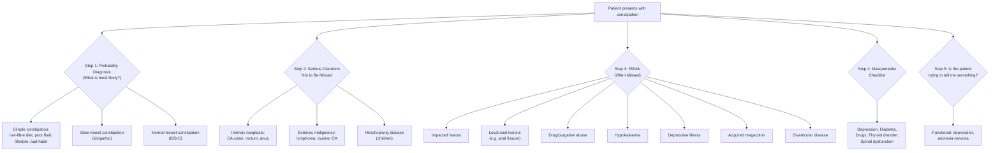
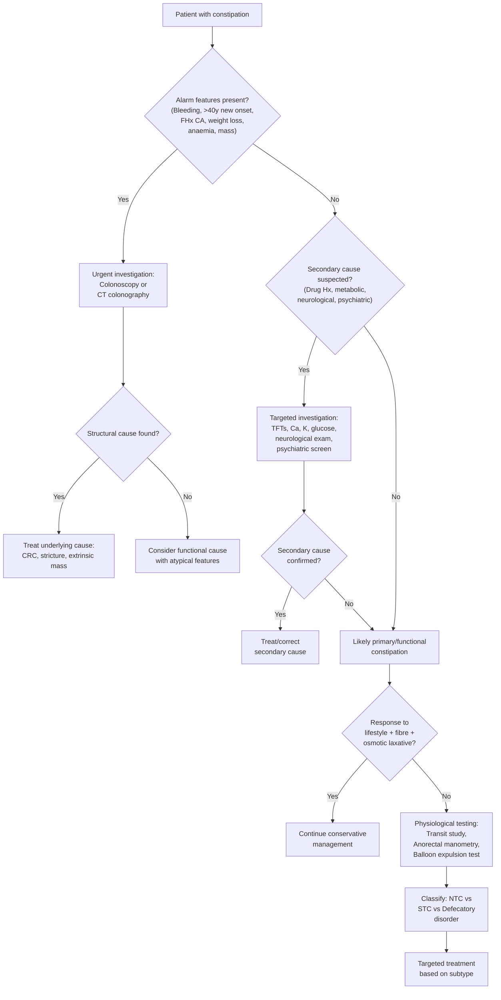

## Differential Diagnosis of Constipation

The approach to differential diagnosis of constipation is fundamentally about **sorting the common from the dangerous** and **the reversible from the irreversible**. The lecture slides provide a superb clinical reasoning framework using Murtagh's Diagnostic Strategy [1], which organises differentials by clinical probability rather than by organ system. Let's work through this systematically.

### Murtagh's Diagnostic Strategy for Chronic Constipation

This is a structured clinical reasoning tool that every HKU medical student should know. It forces you to think in layers of probability:

---

### 1. Probability Diagnosis (Most Common)

These are the diagnoses you will encounter **most frequently** in clinical practice. They account for the vast majority of constipation presentations.

#### ***Simple constipation: low-fibre diet, poor fluid intake, lifestyle and bad habit*** [1]

- **Why it's most common**: Modern diets (particularly in urban Hong Kong) are low in fibre. The average HK adult consumes approximately 10–15 g fibre/day vs the recommended 25–30 g/day. Combined with sedentary lifestyle and habitual suppression of the urge to defecate (e.g. busy office workers, school children), this is by far the most frequent cause.
- **Mechanism**: ↓fibre → ↓faecal bulk → ↓stimulation of colonic stretch receptors → ↓peristalsis → ↑colonic transit time → ↑water absorption → hard, dry stools. Poor fluid intake compounds this by reducing the water available for stool softening.
- **"Bad habit"** refers to **ignoring the call to stool** — when you repeatedly suppress the defecation reflex, rectal stretch receptors undergo **accommodation** (desensitisation), so over time the rectum tolerates larger volumes before signalling urgency. This leads to progressively harder, larger stools and a vicious cycle.

#### ***Slow transit (idiopathic) constipation*** [1]

- Also called **colonic inertia**
- **Mechanism**: ↓high-amplitude propagating contractions (HAPCs) → stool moves slowly through the colon → excessive water absorption → very infrequent, hard stools
- Pathology may involve reduced **interstitial cells of Cajal** (gut pacemaker cells) and reduced enteric neuronal density
- More common in **young women**
- Patients often report ↓urge to defecate (because stool rarely reaches the rectum)
- Diagnosed by **radio-opaque marker (Sitz marker) transit study** or **wireless motility capsule**

#### ***Normal transit (irritable bowel syndrome)*** [1]

- i.e. **IBS-C** (IBS with constipation) [3]
- Objective colonic transit is actually normal, but patients perceive difficulty
- **Key distinguishing feature**: IBS-C has **prominent abdominal pain** (≥1 day/week for 3 months) that is characteristically **associated with defecation** — either improved or worsened by it [3]
- Pathophysiology involves **visceral hypersensitivity**, altered brain-gut axis, psychosocial factors, and possibly ***↓5-HT release*** (serotoninergic imbalance — ↓serotonin in IBS-C vs ↑serotonin in IBS-D) [3]
- ***Rome IV criteria for IBS***: recurrent abdominal pain ≥1 day/week for 3 months, associated with ≥2 of: related to defecation, change in stool frequency, change in stool form [3]

> ***DDx of constipation from maxim.md: IBS, drugs (e.g. CCB), hypothyroidism, hyperCa, hypoK, cord compression, IO*** [2]

---

### 2. Serious Disorders Not to Be Missed

These are the diagnoses that, if missed, could lead to **significant morbidity or mortality**. They must be actively excluded in every patient.

#### ***Intrinsic neoplasia: colon, rectum or anus, especially colon cancer*** [1]

- **Colorectal cancer (CRC)** is the **#1 cancer in Hong Kong by incidence**. This cannot be overemphasised.
- **Why CRC causes constipation**: a growing tumour progressively narrows the colonic lumen → mechanical obstruction to stool passage. Left-sided/sigmoid/rectal cancers are more likely to cause constipation (because the lumen is narrower and stool is more formed at this point). Right-sided cancers more often present with iron-deficiency anaemia (occult bleeding) rather than obstruction.
- **Key red flags**: ***recent onset constipation in those > 40 years, rectal bleeding, family history of cancer*** [1 — from prior section], alternating constipation and diarrhoea, pencil-thin stools, tenesmus, weight loss, iron-deficiency anaemia [4]
- **Pencil-thin stools** → the tumour creates a narrow stricture, so stool must squeeze through a constricted lumen, producing thin, ribbon-like stools
- **Alternating constipation and diarrhoea** → the partial obstruction causes build-up of stool proximally (constipation), then when liquid stool eventually passes the obstruction, the patient has a burst of loose stool (diarrhoea)

#### ***Extrinsic malignancy (e.g. lymphoma, ovary)*** [1]

- **Mechanism**: extrinsic compression of the colon/rectum by a pelvic or abdominal mass
- **Ovarian cancer**: often presents late with vague abdominal symptoms — bloating, pelvic pressure, constipation. The mass compresses the rectosigmoid externally.
- **Lymphoma**: mesenteric or retroperitoneal lymphadenopathy can compress the bowel. Also consider lymphomatous infiltration of the bowel wall.

#### ***Hirschsprung (children)*** [1]

- "Hirschsprung" → named after Harald Hirschsprung, but the name can be broken down conceptually: it is a disease of **absent ganglion cells** (aganglionosis)
- **Pathophysiology**: congenital absence of **ganglion cells** in both Auerbach's (myenteric) and Meissner's (submucosal) plexuses in a segment of colon → the aganglionic segment **cannot relax** and **cannot propagate peristalsis** → functional obstruction [5]
- The aganglionic segment is always **distal** (starts at the internal anal sphincter and extends proximally for a variable distance — most commonly rectosigmoid ~75%)
- **Classic presentation**: neonate who **fails to pass meconium within 48 hours** of birth, bilious vomiting, abdominal distension [5]
- Can rarely present in older children/adults with chronic constipation (ultra-short segment or short-segment Hirschsprung)
- **Gold standard diagnosis**: full-thickness **rectal suction biopsy** showing absent ganglion cells + hypertrophied nerve trunks [5]
- **Anorectal manometry**: absence of the rectoanal inhibitory reflex (RAIR) — normally, rectal distension causes IAS relaxation; in Hirschsprung, this reflex is absent because the aganglionic segment cannot relay the inhibitory signal [5]

<Callout title="Why does the aganglionic segment not relax?">
Normal IAS relaxation during defecation depends on **inhibitory neurons** in the myenteric plexus that release **nitric oxide (NO)** and **vasoactive intestinal peptide (VIP)**. In Hirschsprung disease, these neurons are absent → the IAS and affected bowel segment remain tonically contracted → functional obstruction despite a structurally patent lumen. The bowel **proximal** to the aganglionic segment dilates massively (megacolon) because it has normal ganglion cells and is trying to overcome the downstream obstruction.
</Callout>

---

### 3. Pitfalls (Often Missed)

These are diagnoses that clinicians frequently overlook. They are the "gotcha" conditions on exams and in real clinical practice.

#### ***Impacted faeces*** [1]

- **Why it's a pitfall**: patients (especially elderly, demented, or bedbound) may present with paradoxical **"overflow diarrhoea"** — liquid stool leaks around a hard faecal mass in the rectum, and the inexperienced clinician treats it as diarrhoea instead of recognising the underlying impaction
- **Mechanism**: chronic constipation → large, hard faecal mass accumulates in the rectum → stretches the rectum beyond the point where normal defecation reflexes can expel it → liquid stool from above seeps around the mass
- **Diagnosis**: simple — **digital rectal examination** reveals a rock-hard mass in the rectum
- **Treatment**: manual disimpaction ± enemas, NOT anti-diarrhoeals

#### ***Local anal lesions (e.g. anal fissure)*** [1]

- **Why it's a pitfall**: the patient may not volunteer information about anal symptoms due to embarrassment; the clinician who doesn't examine the anus will miss this
- **Mechanism of constipation**: anal fissure causes **intense pain on defecation** → the patient **consciously avoids defecation** (fear-avoidance) → stool accumulates and hardens → even more painful to pass → vicious cycle. Additionally, the fissure causes **reflex spasm of the IAS**, creating a functional outlet obstruction [6]
- **Typical anal fissure**: single, posterior midline, with sentinel skin tag and hypertrophied anal papilla if chronic [6]

#### ***Drug/purgative abuse*** [1]

- **Two aspects**:
  1. **Drug-induced constipation**: as detailed in the prior section — opioids, anticholinergics, CCBs, iron, etc. [2]
  2. **Purgative (laxative) abuse**: paradoxically, chronic stimulant laxative use **causes** constipation. **Mechanism**: chronic stimulation of myenteric neurons by stimulant laxatives (e.g. senna, bisacodyl) → **enteric neuronal damage** and **melanosis coli** (brown-black pigmentation of colonic mucosa from lipofuscin-laden macrophages) → the colon becomes dependent on laxatives and loses intrinsic motility → **cathartic colon** (dilated, atonic colon)
  - This is particularly seen in patients with **eating disorders** (anorexia nervosa, bulimia nervosa) who abuse laxatives for weight control [7]
  - ***Stimulant laxative: hypoNa/K, metabolic acidosis, chronic constipation, melanosis coli*** [7]

<Callout title="Laxative Abuse — A Paradoxical Cause of Constipation" type="error">
This is a classic exam trap. A young woman with an eating disorder takes stimulant laxatives (senna/bisacodyl) daily for years → develops chronic constipation that is worse than before she started laxatives. On colonoscopy, you see melanosis coli (dark brown mucosa). The treatment is gradual laxative withdrawal and switch to osmotic agents (e.g. PEG/macrogol), NOT more stimulant laxatives.
</Callout>

#### ***Hypokalaemia*** [1]

- A classic pitfall, especially in the **elderly on diuretic therapy** [1 — from prior section]
- **Mechanism**: K⁺ depletion → smooth muscle cells remain relatively hyperpolarised (because the resting membrane potential becomes more negative when extracellular K⁺ is low) → ↓contractility of GI smooth muscle → ↓colonic motility → constipation
- Other causes of hypokalaemia to consider: vomiting, diarrhoea, hyperaldosteronism, renal tubular acidosis
- **ECG findings**: ↓T wave flattening, ↑U wave amplitude, prolonged QT interval [8]

#### ***Depressive illness*** [1]

- **Mechanism**: multifactorial — psychomotor retardation → ↓physical activity → ↓colonic motility; ↓appetite → ↓food intake → ↓faecal bulk; medications (TCAs, SSRIs) directly constipating; altered brain-gut axis via autonomic dysfunction
- A pitfall because patients may present with somatic complaints (constipation, fatigue, pain) without volunteering psychological symptoms
- Always screen for depression in chronic constipation, especially if no obvious secondary cause identified

#### ***Acquired megacolon*** [1]

- Distinguished from **congenital** megacolon (Hirschsprung)
- **Acquired megacolon** refers to chronic dilatation of the colon from long-standing constipation or other causes
- **Mechanism**: chronic faecal retention → progressive rectal/colonic dilatation → **rectal hyposensitivity** (stretch receptors accommodate to the chronically distended wall) → ever-larger volumes needed to trigger defecation urge → further distension → vicious cycle
- Causes include: chronic idiopathic constipation, psychiatric illness, neurological disease (Parkinson's, MS), Chagas disease
- Risk: **sigmoid volvulus** (elongated, dilated sigmoid with narrow mesenteric base can twist) [9], faecal impaction, stercoral ulceration, perforation

#### ***Diverticular disease*** [1]

- **Why it causes constipation**: symptomatic uncomplicated diverticular disease (SUDD) can cause altered bowel habits including constipation and/or diarrhoea. Complicated diverticulitis with **fibrotic stricture** can cause mechanical large bowel obstruction [10].
- **Mechanism of diverticula formation**: ***bowel weakening with aging + increased intraluminal pressure*** (from constipation) → outpouching at weakest points where ***vasa recta penetrate circular muscle*** [10]
- Constipation is both a **cause** of diverticular disease (chronic straining → ↑intraluminal pressure) and a **consequence** (stricture formation from chronic diverticulitis)
- Most common site: ***right-sided in Asia***, sigmoid in Western countries [10]

### Rarities Listed in Murtagh's [1]

| Rare Differential | Mechanism of Constipation |
|:------------------|:-------------------------|
| ***Lead poisoning*** | Lead inhibits smooth muscle contraction and damages the enteric nervous system → colicky abdominal pain ("lead colic") + constipation. Also causes basophilic stippling of RBCs, wrist/foot drop, and blue gum line (Burton's line). |
| ***Hypercalcaemia*** | Ca²⁺ stabilises cell membranes → ↓smooth muscle excitability → ↓colonic contraction. "Bones, stones, abdominal moans (constipation), and psychic groans." |
| ***Hyperparathyroidism*** | The most common cause of hypercalcaemia → constipation via the mechanism above |
| ***Dolichocolon / megarectum*** | "Dolicho-" from Greek *dolikhos* = long; an abnormally long colon → ↑transit time → ↑water absorption → constipation. Megarectum = abnormally dilated rectum → rectal hyposensitivity |
| ***Chagas disease*** | *Trypanosoma cruzi* infection destroys myenteric plexus neurons → acquired aganglionosis → megacolon/megaoesophagus. Endemic in South America, essentially absent in HK but important for differential diagnosis knowledge. |
| ***Systemic sclerosis (scleroderma)*** | Fibrosis and atrophy of GI smooth muscle (particularly the inner circular layer) + vascular damage → ↓colonic motility. Can affect the entire GI tract — oesophageal dysmotility is the most common GI manifestation, but colonic involvement causes severe constipation. |

---

### 4. Masquerades Checklist

The ***"Masquerades Checklist"*** [1] is Murtagh's systematic screen for common conditions that **masquerade** as many different presentations. For constipation, the relevant masquerades are:

| Masquerade | Relevance to Constipation |
|:-----------|:--------------------------|
| ***Depression*** [1] | As above — psychomotor retardation, ↓appetite, medications |
| ***Diabetes (rarely)*** [1] | Autonomic neuropathy → ↓colonic motility. "Rarely" because it is an uncommon presentation of DM; most diabetic patients with constipation have other contributing factors. |
| ***Drugs (opiates, iron, others)*** [1] | The most important masquerade — always check the medication list |
| ***Thyroid disorder (hypothyroidism)*** [1] | ↓T₃ → ↓basal metabolic rate → ↓GI smooth muscle contractility → slow transit |
| ***Spinal dysfunction (severe only)*** [1] | Disrupts extrinsic neural control of defecation; must be **severe** (e.g. cord compression, cauda equina) to cause constipation as a presenting complaint |

<Callout title="Masquerades — Don't Forget the Basics" type="idea">
When you're stuck with a patient whose constipation doesn't make sense, run through the masquerades: **Depression, Diabetes, Drugs, Thyroid, Spine**. These are conditions that "dress up" as other things and are easily missed if you don't actively look for them.
</Callout>

---

### 5. "Is the Patient Trying to Tell Me Something?"

> ***"May be functional (e.g. depression, anorexia nervosa)"*** [1]

This is Murtagh's reminder to consider the **psychosocial dimension**. Some patients use somatic complaints as a way to seek help for underlying psychological distress:

- **Depression**: constipation may be the "ticket of entry" to medical care for someone who is actually severely depressed but reluctant to discuss mood
- **Anorexia nervosa**: severe caloric restriction → ↓faecal bulk → constipation; also associated with laxative abuse (see above) [7]
- **Somatisation disorder**: multiple unexplained physical symptoms including constipation, in the context of psychological distress
- **Sexual abuse / trauma**: some patients (especially children, adolescents) with constipation/encopresis may have underlying abuse — always consider in the appropriate context

---

### 6. Additional Important Differentials Not Explicitly in Murtagh's

These deserve mention for completeness and exam preparation:

#### Intestinal obstruction (IO) [2]

- ***IO*** is listed in maxim.md's DDx of constipation [2]
- **Absolute constipation** (inability to pass both faeces AND flatus = obstipation) is a cardinal feature of **complete bowel obstruction** [11]
- Causes of large bowel obstruction: CRC (most common), diverticular stricture, volvulus (sigmoid > caecal)
- Causes of small bowel obstruction: adhesions (most common, 60%), hernia (10%), tumour (20%) [11]
- **Key distinguishing feature**: obstipation + colicky abdominal pain + abdominal distension + vomiting. The pattern differs between SBO and LBO (SBO: early vomiting, less distension; LBO: late vomiting, more distension) [11]

#### Cord compression / Cauda equina syndrome [2]

- ***Cord compression*** is listed in maxim.md's DDx [2]
- **Conus medullaris syndrome**: mixed UMN + LMN signs, saddle anaesthesia, early sphincter failure → painless AROU + constipation + incontinence [12]
- **Cauda equina syndrome**: pure LMN signs, saddle anaesthesia, sphincter failure → constipation + AROU + incontinence [12]
- **Why constipation occurs**: disruption of sacral parasympathetic outflow (S2–S4) → loss of the defecation reflex → inability to initiate coordinated colonic propulsion and rectal evacuation
- This is a **neurosurgical emergency** if acute — irreversible if not decompressed early

#### Pseudo-obstruction [13]

- **Ogilvie's syndrome** (acute colonic pseudo-obstruction): S/S of mechanical obstruction in the absence of a mechanical cause
- **Mechanism**: autonomic imbalance (↓parasympathetic / ↑sympathetic) → aperistalsis [13]
- Causes: metabolic disturbance (DM, hypoK, hypothyroidism, uraemia), drugs (opioids, CCB), post-operative, neurological disease (Parkinson's, MS) [13]
- **Key differentiating signs from mechanical obstruction**: normal bowel sounds, **dilated rectum on PR exam** (cf. collapsed rectum in mechanical obstruction) [13]

#### Parkinson's disease [14]

- Constipation is one of the most common **non-motor symptoms** of PD and may precede motor symptoms by years
- **Mechanism**: Lewy body pathology directly affects the **enteric nervous system** (alpha-synuclein deposits in myenteric plexus neurons) → ↓colonic motility. Also: ↓physical activity, anticholinergic medications
- ***Constipation: common, consider high-fibre diet, bulk/osmotic laxative, ↑fluid intake/exercise*** [14]

---

### Comprehensive Differential Diagnosis Table

| Category | Differential | Key Distinguishing Feature(s) |
|:---------|:------------|:------------------------------|
| **Probability** | ***Simple constipation (low fibre, poor fluid, lifestyle)*** [1] | No alarm features; dietary history reveals inadequate fibre/fluid; improves with lifestyle modification |
| | ***Slow-transit constipation*** [1] | Young women; ↓urge; prolonged transit on Sitz marker study |
| | ***IBS-C*** [1][3] | Prominent **abdominal pain** associated with defecation; Rome IV criteria; no alarm features |
| **Serious** | ***Colorectal cancer*** [1] | Age > 40; rectal bleeding; weight loss; anaemia; pencil-thin stools; alternating constipation/diarrhoea; palpable mass |
| | ***Extrinsic malignancy (lymphoma, ovarian CA)*** [1] | Pelvic mass; constitutional symptoms; lymphadenopathy |
| | ***Hirschsprung disease (children)*** [1][5] | Neonatal: failure to pass meconium; abdominal distension; absent RAIR on manometry; absent ganglion cells on biopsy |
| **Pitfalls** | ***Impacted faeces*** [1] | Overflow diarrhoea in elderly; hard mass on DRE |
| | ***Anal fissure*** [1][6] | Severe pain on defecation; bright red blood on paper; posterior midline tear on inspection |
| | ***Drug/purgative abuse*** [1][7] | Thorough drug Hx; melanosis coli on colonoscopy (stimulant laxative abuse); eating disorder Hx |
| | ***Hypokalaemia*** [1][8] | Elderly on diuretics; K⁺ < 3.5 mmol/L; ECG changes (flat T, prominent U wave) |
| | ***Depressive illness*** [1] | Low mood; anhedonia; sleep disturbance; psychomotor retardation; ↓appetite |
| | ***Acquired megacolon*** [1] | Chronic constipation Hx; massively dilated colon on AXR; rectal hyposensitivity |
| | ***Diverticular disease*** [1][10] | Colicky LLQ pain (or RLQ in Asia) relieved by defecation; stricture causing obstruction; history of diverticulitis |
| **Rare** | ***Lead poisoning, hypercalcaemia, hyperparathyroidism, dolichocolon, Chagas disease, systemic sclerosis*** [1] | Specific features of each condition (see table above) |
| **Masquerades** | ***Depression, Diabetes, Drugs, Thyroid disorder, Spinal dysfunction*** [1] | Systematic screening: mood, HbA1c, drug review, TFTs, neurological exam |
| **Psychosocial** | ***Depression, anorexia nervosa*** [1][7] | "Is the patient trying to tell me something?" — screen for psychiatric/eating disorders |
| **Mechanical IO** | ***Adhesions, hernia, volvulus, tumour*** [2][11] | Obstipation (no flatus); colicky pain; distension; vomiting; radiological evidence of obstruction |
| **Neurological** | ***Cord compression, cauda equina, Parkinson's*** [2][12][14] | Saddle anaesthesia, sphincter disturbance; TRAP signs in PD |
| **Functional IO** | ***Pseudo-obstruction (Ogilvie's)*** [13] | Features of obstruction but normal bowel sounds + dilated rectum on DRE; diagnosis of exclusion |

---

### Clinical Approach to Differential Diagnosis — Practical Algorithm

The key clinical question when evaluating constipation is: **Is this functional/primary, or is there a secondary cause I must identify and treat?**

<Callout title="The Two Critical Questions in Constipation DDx">
1. **Is there a dangerous cause I must not miss?** → CRC, cord compression, extrinsic malignancy → Look for alarm features
2. **Is there a reversible secondary cause?** → Drugs, hypothyroidism, hypercalcaemia, hypokalaemia, depression → Systematic screen

If the answer to both is "no," you are dealing with primary/functional constipation and can proceed with lifestyle modification and, if refractory, physiological testing to subclassify.
</Callout>

---

### Key Differentiating Features Between Important Differentials

| Feature | IBS-C | Slow-Transit | Defecatory Disorder | CRC | Mechanical IO |
|:--------|:------|:-------------|:-------------------|:----|:-------------|
| **Pain** | Prominent, related to defecation | Minimal | Straining-related | Progressive, may be colicky | Colicky, severe |
| **Stool frequency** | Variable | Very infrequent | Variable (often normal frequency but incomplete evacuation) | Progressive ↓ | Absent (obstipation) |
| **Bloating** | Prominent | Variable | Less prominent | Late | Prominent |
| **Rectal bleeding** | Absent | Absent | Possible (haemorrhoids from straining) | Common | Late (if ischaemia) |
| **DRE** | Normal | Empty rectum | Stool present, paradoxical contraction | Mass may be palpable | Empty rectum (distal collapse) |
| **Weight loss** | Absent | Absent | Absent | Common | Possible (late) |
| **Vomiting** | Absent | Absent | Absent | Late | Early (SBO) or late (LBO) |
| **Flatus** | Present (often excessive) | Present | Present | Present (early) | Absent (complete IO) |
| **Rome IV criteria** | Met | Not met for IBS | Not met for IBS | N/A | N/A |
| **Transit study** | Normal | Prolonged | Normal or prolonged | N/A | N/A |
| **Anorectal manometry** | Normal | Normal | Abnormal (↓rectal pressure, paradoxical contraction) | N/A | N/A |
| **Balloon expulsion** | Normal | Normal | Failed (cannot expel balloon) | N/A | N/A |

---

<Callout title="High Yield Summary — Differential Diagnosis of Constipation">

**Murtagh's Framework** [1]:
1. **Probability diagnosis**: Simple constipation (low fibre/fluid/lifestyle), slow-transit constipation, IBS-C
2. **Serious not to miss**: CRC (intrinsic neoplasia), extrinsic malignancy (lymphoma, ovarian CA), Hirschsprung (children)
3. **Pitfalls**: Impacted faeces (overflow diarrhoea!), anal fissure, drug/purgative abuse, hypokalaemia (elderly on diuretics!), depressive illness, acquired megacolon, diverticular disease
4. **Masquerades**: Depression, Diabetes, Drugs, Thyroid (hypothyroidism), Spinal dysfunction
5. **Psychosocial**: "Is the patient trying to tell me something?" — depression, anorexia nervosa

**Additional important DDx** [2]: IO (mechanical), cord compression/cauda equina, pseudo-obstruction (Ogilvie's), Parkinson's disease

**First priorities**: Exclude alarm features → investigate for CRC. Exclude reversible secondary causes (drugs, metabolic, neurological). Only then classify as primary/functional.

</Callout>

---

<ActiveRecallQuiz
  title="Active Recall - Differential Diagnosis of Constipation"
  items={[
    {
      question: "Using Murtagh's Diagnostic Strategy, list the 3 probability diagnoses, 3 serious disorders not to be missed, and 5 pitfalls for chronic constipation.",
      markscheme: "Probability: (1) Simple constipation - low fibre/fluid/lifestyle, (2) Slow-transit constipation, (3) IBS-C (normal transit). Serious: (1) Intrinsic neoplasia esp colon cancer, (2) Extrinsic malignancy (lymphoma, ovary), (3) Hirschsprung disease (children). Pitfalls: (1) Impacted faeces, (2) Local anal lesions (anal fissure), (3) Drug/purgative abuse, (4) Hypokalaemia, (5) Depressive illness, (6) Acquired megacolon, (7) Diverticular disease (any 5)."
    },
    {
      question: "Explain why chronic stimulant laxative abuse paradoxically causes constipation. What colonoscopic finding would you expect?",
      markscheme: "Chronic stimulant laxatives (e.g. senna, bisacodyl) damage enteric neurons in the myenteric plexus over time, leading to cathartic colon - a dilated, atonic colon that loses intrinsic motility and becomes dependent on laxatives. Colonoscopy shows melanosis coli - brown-black pigmentation from lipofuscin-laden macrophages in the colonic mucosa."
    },
    {
      question: "How would you differentiate pseudo-obstruction (Ogilvie syndrome) from mechanical large bowel obstruction on clinical examination?",
      markscheme: "Pseudo-obstruction: (1) Normal bowel sounds (vs high-pitched tinkling in mechanical IO), (2) Dilated rectum on PR exam (vs collapsed/empty rectum in mechanical IO because distal bowel decompresses). Also: absence of a discrete transition point on imaging, presence of gas in rectum on AXR."
    },
    {
      question: "A 72-year-old man on bendroflumethiazide and codeine phosphate presents with worsening constipation over 3 weeks plus 2 episodes of rectal bleeding. What are the top 3 differential diagnoses and the next investigation?",
      markscheme: "Top 3 DDx: (1) Colorectal cancer - age >40, new constipation, rectal bleeding (alarm features); (2) Drug-induced constipation - both codeine (opioid) and bendroflumethiazide (causing hypokalaemia) are constipating; (3) Diverticular disease - common in elderly, can cause PR bleeding and constipation. Next investigation: Colonoscopy (gold standard to exclude CRC given alarm features). Also check serum K+ and FBE."
    },
    {
      question: "What is the pathophysiological basis of Hirschsprung disease causing constipation, and what is the gold standard diagnostic test?",
      markscheme: "Congenital absence of ganglion cells in Auerbach (myenteric) and Meissner (submucosal) plexuses in a distal colonic segment. Without inhibitory neurons (which normally release NO and VIP), the aganglionic segment cannot relax and cannot propagate peristalsis, creating a functional obstruction. Proximal bowel dilates (megacolon). Gold standard: full-thickness rectal suction biopsy showing absent ganglion cells with hypertrophied nerve trunks."
    }
  ]}
/>

---

## References

[1] Lecture slides: murtagh merge.pdf (Chronic constipation — Murtagh's Diagnostic Strategies, p30–31)
[2] Senior notes: maxim.md (Section 4.6 — Constipation DDx: IBS, drugs e.g. CCB, hypothyroidism, hyperCa, hypoK, cord compression, IO)
[3] Senior notes: Ryan Ho GI.pdf (Section 3.2.1 — Irritable Bowel Syndrome, p118–119)
[4] Senior notes: Ryan Ho Fundamentals.pdf (p283 — Worrying signs of colorectal CA)
[5] Senior notes: felixlai.md (Hirschsprung disease — pathophysiology, clinical manifestation, diagnosis)
[6] Senior notes: felixlai.md (Anal fissure — clinical manifestation, differential diagnosis)
[7] Senior notes: Ryan Ho Psychiatry.pdf (p216 — Bulimia nervosa: stimulant laxative causing chronic constipation, melanosis coli)
[8] Senior notes: Ryan Ho Urogenital.pdf (p25 — Hypokalaemia clinical features: GI dysfunction, constipation, ECG changes)
[9] Senior notes: felixlai.md (Sigmoid volvulus — chronic faecal overloading predisposing to volvulus)
[10] Senior notes: maxim.md (Diverticular disease — pathophysiology, risk factors, complications)
[11] Senior notes: felixlai.md (Intestinal obstruction — cardinal features, aetiology)
[12] Senior notes: Ryan Ho Neurology.pdf (p53 — Conus medullaris and cauda equina syndrome: constipation, sphincter failure)
[13] Senior notes: maxim.md (Pseudo-obstruction — Ogilvie's syndrome, clinical features, differentiating signs)
[14] Senior notes: Ryan Ho Neurology.pdf (p121 — Parkinson's disease non-motor symptoms: constipation)
