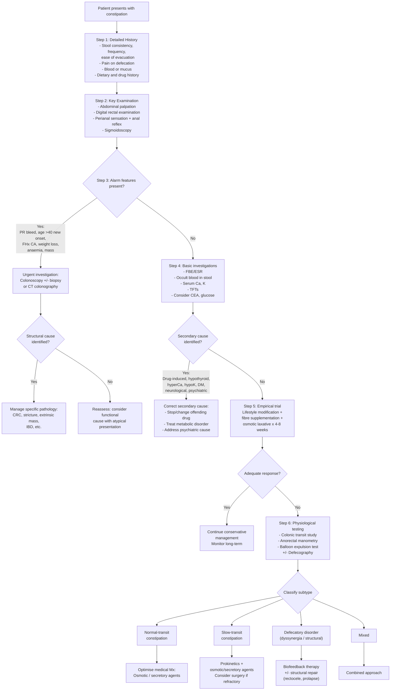

## Diagnostic Criteria, Algorithm and Investigations for Constipation

---

### 1. Diagnostic Criteria

The diagnosis of constipation operates on **two levels**: (1) establishing that the patient has constipation (which is primarily clinical, using standardised criteria), and (2) identifying the **underlying cause** (primary vs secondary). Let me walk through both.

#### 1.1 Rome IV Criteria for Functional Constipation (2016, still current in 2025–2026)

These are the internationally accepted criteria. "Rome" refers to the Rome Foundation, which periodically convenes to define functional GI disorders. The criteria exist because constipation is **subjective** — you need a standardised definition for clinical practice and research.

> **Rome IV Diagnostic Criteria for Functional Constipation:**
>
> Must include **≥2 of the following** (for the last 3 months, with symptom onset ≥6 months before diagnosis):
> 1. **Straining** during > 25% of defecations
> 2. **Lumpy or hard stools** (Bristol Stool Form Scale 1–2) in > 25% of defecations
> 3. **Sensation of incomplete evacuation** in > 25% of defecations
> 4. **Sensation of anorectal obstruction/blockage** in > 25% of defecations
> 5. **Manual manoeuvres** to facilitate defecation (e.g. digital evacuation, perineal/vaginal splinting) in > 25% of defecations
> 6. **Fewer than 3 spontaneous bowel movements per week**
>
> **AND:**
> - Loose stools are rarely present without the use of laxatives
> - Insufficient criteria for **IBS** (i.e. abdominal pain is NOT the predominant symptom)

**Why these specific criteria?** Each criterion maps onto a specific pathophysiological mechanism:
- Criteria 1, 4, 5 → suggest **defecatory disorder** (outlet obstruction/dyssynergia)
- Criterion 2 → suggests **slow transit** (excessive water absorption) or inadequate fibre
- Criterion 3 → suggests either defecatory disorder (residual stool) or rectal hyposensitivity
- Criterion 6 → suggests **slow transit** or severe outlet obstruction

<Callout title="Rome IV: Functional Constipation vs IBS-C">
The key distinction is **abdominal pain**. If the patient meets Rome IV criteria for IBS (recurrent abdominal pain ≥1 day/week for 3 months, associated with ≥2 of: related to defecation, change in stool frequency, change in stool form) [3], they have **IBS-C**, not functional constipation. In practice, patients often straddle the boundary, and the distinction matters mainly for treatment selection (IBS-C-specific therapies like linaclotide target both pain and constipation) [3].
</Callout>

#### 1.2 Bristol Stool Form Scale (BSFS)

The BSFS is incorporated into Rome IV as an objective measure of stool consistency. Constipation corresponds to **Type 1** (separate hard lumps) and **Type 2** (lumpy sausage-shaped). The scale is used because verbal descriptions of "hard" or "soft" vary enormously between patients — the visual scale standardises this.

#### 1.3 When to Apply Rome IV vs When to Investigate Further

Rome IV criteria are designed for **primary/functional constipation** in the **absence of alarm features**. The criteria should only be applied **after** excluding secondary causes and red flags:

> ***"Alarm symptoms are rectal bleeding, recent constipation in those > 40 years and family history of cancer"*** [1]

If alarm features are present, you **do not** apply Rome IV — you investigate immediately to exclude organic pathology (especially colorectal cancer).

---

### 2. Diagnostic Algorithm

The algorithm below integrates the lecture slides' approach [1] with current guidelines (AGA 2024, BSG 2023). The principle is: **exclude dangerous → exclude reversible → classify and treat**.

Let me elaborate on each step:

---

### 3. Investigation Modalities — Detailed

#### 3.1 Step 1–2: History and Physical Examination (The Most Important "Investigation")

Before ordering any test, the history and examination will direct your entire workup.

**History** — as stated in the lecture slides [1]:

> ***"Define what exactly the patient means by constipation. The history should include stool consistency, frequency, ease of evacuation, pain on defecation and the presence of blood or mucus. A dietary and drug history is important."*** [1]

| History Component | What to Ask | Why |
|:-----------------|:-----------|:----|
| **Stool consistency** | Use BSFS chart — show the patient | Determines if truly constipated (Type 1–2) vs just infrequent |
| **Frequency** | How many spontaneous BMs per week? | < 3/week = one of the Rome IV criteria |
| **Ease of evacuation** | Straining? How long on the toilet? | Suggests defecatory disorder if excessive straining |
| **Pain on defecation** | Sharp/tearing pain? Where exactly? | Suggests anal fissure [6] → fear-avoidance → worsening constipation |
| **Blood** | On paper? Mixed with stool? Dark? | ***"Bleeding suggests cancer, haemorrhoids, diverticular disorder and inflammatory bowel disease"*** [1] |
| **Mucus** | Mucus per rectum? | Suggests IBS, villous adenoma, rectal prolapse |
| **Digital manoeuvres** | Do you need to use fingers to help evacuate? Splint vagina/perineum? | Strongly suggests defecatory disorder or rectocele |
| **Dietary history** | Fibre intake? Fluid intake? | Low fibre/fluid = most common cause |
| ***Drug history*** [1] | Systematic review of all medications | ***"Drugs selected associated with constipation: analgesics, opioids esp. codeine, TCAs, antacids esp. aluminium hydroxide, Ca channel blockers, SSRIs, cough mixtures, anti-cholinergics, benzodiazepines"*** [1] |
| **Laxative use** | What type? How often? How long? | Chronic stimulant laxative abuse → cathartic colon |
| **Psychiatric screen** | Mood? Appetite? Sleep? Body image? | Depression, anorexia nervosa [1] |

**Physical Examination** — lecture slides emphasise three key components [1]:

> ***"The important aspects are abdominal palpation and rectal examination. Test perianal sensation and the anal reflex. Perform sigmoidoscopy."*** [1]

| Examination | Technique | Key Findings and Interpretation |
|:-----------|:----------|:-------------------------------|
| **Abdominal palpation** | Systematic palpation of all 9 regions | Palpable faecal masses (firm, indentable, follow colonic course — especially LIF along sigmoid); abdominal distension; tenderness (suggests complication — diverticulitis, obstruction); palpable mass (suspect malignancy if hard, irregular, fixed) |
| ***Digital rectal examination (DRE)*** [1] | Inspect perianal area first (fissure, skin tags, external haemorrhoids, prolapse); then digital examination assessing tone, squeeze, masses, stool | See detailed DRE interpretation table below |
| ***Perianal sensation*** [1] | Light touch with cotton wool in the perianal region (dermatomes S2–S4) | Absent/reduced sensation → sacral nerve lesion, cauda equina syndrome |
| ***Anal reflex*** [1] | Stroke perianal skin with orange stick → observe for reflex contraction of EAS ("anal wink") | Absent anal wink → disruption of S2–S4 reflex arc → neurosurgical emergency if acute (cauda equina) |
| ***Sigmoidoscopy*** [1] | Rigid or flexible sigmoidoscopy in the office | Visualise rectosigmoid mucosa for tumour, polyps, proctitis, melanosis coli (laxative abuse), solitary rectal ulcer |

**DRE — Detailed Interpretation:**

| DRE Finding | Interpretation | Significance |
|:-----------|:--------------|:------------|
| **Hard impacted stool** | Faecal impaction | Most common finding in chronic constipation; may cause overflow incontinence in elderly |
| **Empty rectum** | Stool has not reached rectum | Suggests slow-transit constipation (stool still in proximal colon) or recent evacuation |
| **Rectal mass** — hard, irregular, fixed | Suspect **rectal carcinoma** | Urgent colonoscopy + biopsy required |
| **Reduced resting tone** | IAS dysfunction or neurological cause | Consider neurogenic bowel (S2–S4 lesion) |
| **Reduced squeeze pressure** | EAS weakness | Pudendal neuropathy, obstetric injury |
| **Paradoxical contraction on bearing down** | Ask patient to "push" as if defecating; puborectalis should relax (felt as posterior release). If it contracts instead → **dyssynergia** | Strongly suggests **defecatory disorder** — the single most useful bedside test for this |
| **Rectocele** | Anterior bulge of rectal wall palpable through posterior vaginal wall | Stool can pocket into rectocele during evacuation |
| **Tenderness, fluctuance** | Abscess (perianal or ischiorectal) | May be causing reflex constipation from pain avoidance |
| **Smooth, symmetrically enlarged prostate** | BPH | Not directly causing constipation, but constipation can precipitate AROU in men with BPH [15] |

<Callout title="The DRE is Non-Negotiable" type="error">
A common mistake is to skip the DRE. In constipation, DRE provides critical information that no blood test or scan can give you: faecal impaction, rectal mass, anal tone, and dyssynergia. ***"Key examination: The important aspects are abdominal palpation and rectal examination"*** [1]. If you do nothing else, do a DRE.
</Callout>

---

#### 3.2 Step 4: Basic Laboratory Investigations

These are the ***"key investigations"*** from the lecture slides [1]:

> ***"Basic tests are FBE/ESR, occult blood in stool. Consider serum calcium, potassium, CEA and TFTs."*** [1]

| Investigation | What It Tests | Key Findings | Why / What It Excludes |
|:-------------|:-------------|:-------------|:----------------------|
| ***FBE (Full Blood Examination / CBC)*** [1] | Complete blood count with differential | **Microcytic hypochromic anaemia** (↓MCV, ↓MCH, ↓ferritin, ↑TIBC) = iron-deficiency anaemia | Occult GI blood loss from colorectal cancer (especially right-sided tumours that bleed insidiously). Also check for leukocytosis (infection, obstruction) and eosinophilia (parasitic, allergic) |
| ***ESR*** [1] | Erythrocyte sedimentation rate (acute phase reactant) | ↑ESR | Non-specific but elevated in malignancy, IBD, infection, inflammation. Helps identify if there's an underlying organic process vs purely functional |
| ***Occult blood in stool*** [1] | Faecal immunochemical test (FIT) or guaiac-based FOBT | Positive = occult GI bleeding | Screens for CRC and other mucosal lesions. FIT is preferred over guaiac FOBT because it is specific for **human haemoglobin** and does not require dietary restriction. A positive FIT mandates colonoscopy. |
| ***Serum calcium*** [1] | Total Ca²⁺ (always correct for albumin: corrected Ca = measured Ca + 0.02 × (40 − albumin in g/L)) | **Hypercalcaemia** ( > 2.6 mmol/L or corrected Ca > 10.5 mg/dL) | Ca²⁺ excess stabilises cell membranes → ↓smooth muscle excitability → constipation. ***"Stones, bones, groans, moans, thrones, psychiatric overtones"*** [16]. Causes: primary hyperPTH, malignancy (esp breast, lung, myeloma), granulomatous disease (TB, sarcoidosis) [16] |
| ***Serum potassium*** [1] | Serum K⁺ | **Hypokalaemia** ( < 3.5 mmol/L) | K⁺ depletion → smooth muscle hyperpolarisation → ↓contractility → constipation + ileus. ***"Beware of hypokalaemia causing constipation in the elderly patient on diuretic treatment"*** [1]. ECG: ***↓T wave flattening and ↑U wave amplitude*** [17] |
| ***TFTs (Thyroid Function Tests)*** [1] | TSH (± free T₄) | **↑TSH + ↓fT₄** = primary hypothyroidism | Hypothyroidism → ↓metabolic rate → ↓GI smooth muscle contractility → slow transit constipation. One of the classic "masquerades" [1] |
| ***CEA (Carcinoembryonic Antigen)*** [1] | Tumour marker | **↑CEA** ( > 4.7 ng/mL) | Low sensitivity (~50%) and low specificity for CRC — can be elevated in smoking, pregnancy, TB, IBD, other carcinomas [18]. NOT diagnostic alone, but useful for: (a) raising suspicion when elevated in context of alarm features, (b) baseline pre-treatment level for monitoring, (c) detection of recurrence post-operatively. False negatives common because CEA may be first-pass metabolised by the liver [18] |
| **Fasting glucose / HbA1c** | Screen for diabetes | ↑glucose or HbA1c ≥ 6.5% | Diabetic autonomic neuropathy → ↓colonic motility [1] |
| **RFT (Renal Function Tests)** | Creatinine, BUN, electrolytes | ↑Cr/BUN = uraemia | Uraemic toxins affect enteric neural function; also important for medication dosing |
| **CRP / Fecal calprotectin** | Inflammatory markers | ↑CRP or ↑fecal calprotectin | Fecal calprotectin is a 24kDa calcium-binding protein released by neutrophils; elevated in IBD, infection, and CRC [19]. A **negative** fecal calprotectin makes serious organic colonic pathology unlikely — excellent triage test |

<Callout title="Fecal Calprotectin — The Triage Workhorse" type="idea">
Fecal calprotectin is increasingly used as a first-line triage test in patients with altered bowel habits. It is stable at room temperature, cheap, and has a high negative predictive value for organic disease [19]. A normal fecal calprotectin ( < 50 μg/g) strongly argues against IBD or CRC and supports a functional diagnosis (IBS-C or functional constipation). However, it does NOT replace colonoscopy when alarm features are present.
</Callout>

---

#### 3.3 Endoscopic Investigations

> ***"If appropriate refer for sigmoidoscopy or colonoscopy and radiological studies (e.g. CT colonography, bowel transit studies)"*** [1]

| Investigation | Indications | Procedure | Key Findings | Limitations |
|:-------------|:-----------|:----------|:-------------|:-----------|
| ***Sigmoidoscopy*** [1] | Initial office evaluation in all constipation patients (rigid); screening in those with lower GI symptoms | Rigid: 25 cm reach; Flexible: 60 cm reach (to splenic flexure) | Rectal/sigmoid tumour, polyps, proctitis, melanosis coli (brown-black pigmentation = chronic stimulant laxative abuse), solitary rectal ulcer, internal haemorrhoids, fissure | Cannot visualise proximal colon — insufficient for excluding right-sided CRC |
| ***Colonoscopy*** [1] | **Gold standard** when alarm features present or when CRC needs to be excluded; age > 40–50 with new-onset constipation; positive FIT/FOBT; FHx CRC | Full colonoscopy to caecum with biopsy capability | Tumour (exophytic, ulcerated, circumferential → ***"apple core"*** on barium), polyps (synchronous polyps in 30–50% of CRC), IBD (mucosal inflammation, ulceration), diverticulosis, melanosis coli, stricture. **Biopsy** provides histological diagnosis [18][20] | Requires bowel preparation; procedural risk (perforation < 1/10,000, bleeding 3/10,000) [20]; contraindicated in suspected perforation, acute diverticulitis, toxic megacolon [20] |
| **Flexible sigmoidoscopy + colonoscopy for CRC workup** | ***Suspicious lower GI symptoms: PRB, abdominal pain, altered bowel habit, constipation, etc.*** [20] | See above | See above | If colonoscopy cannot reach caecum (11–12% incomplete), supplement with CT colonography [18] |

**Colonoscopy — Key Points for Constipation:**

- **When CRC is suspected**: colonoscopy is the **gold standard** investigation — it is both **diagnostic** (direct visualisation + biopsy) and **therapeutic** (polypectomy, stenting for malignant obstruction, decompression in volvulus) [18][20]
- **Important to scope the entire colon**: synchronous tumours occur in 3–5% of CRC patients, and synchronous polyps in 30–50% [18]
- If the tumour is small, **tattooing** (injection of ink/carbon) is used to mark the location for the surgeon during subsequent resection [18]
- **Melanosis coli**: if you see diffuse brown-black pigmentation of the colonic mucosa, this indicates chronic stimulant laxative use (senna, bisacodyl) — the pigment is lipofuscin deposited in macrophages within the lamina propria
- **After treatment of acute diverticulitis**: colonoscopy should be performed **after** resolution of the acute episode (usually 6–8 weeks) to exclude CRC (which can mimic diverticulitis on CT) [10]

---

#### 3.4 Radiological Investigations

| Investigation | Indications | Key Findings and Interpretation | When to Use |
|:-------------|:-----------|:-------------------------------|:-----------|
| ***CT colonography*** [1] | Alternative to colonoscopy when colonoscopy is incomplete, contraindicated, or unavailable; patient preference | Virtual fly-through of colon; detects masses > 1 cm with similar sensitivity to colonoscopy [18]; also provides extra-luminal information (liver mets, lymphadenopathy, pelvic masses). Requires mechanical bowel preparation. | When colonoscopy cannot be completed; in patients with significant comorbidities precluding sedation; CRC screening in some settings |
| **Abdominal X-ray (AXR)** | Suspected faecal impaction or bowel obstruction; baseline assessment | **Faecal loading**: multiple faecal densities throughout colon/rectum [15]. **Bowel obstruction**: dilated loops ( > 6 cm for LB, > 3 cm for SB, > 9 cm for caecum = ***"3-6-9 rule"***), air-fluid levels on erect film [15][21]. **Volvulus**: coffee bean sign (sigmoid), absent rectal gas. **Megacolon**: colonic dilatation > 6 cm. | First-line imaging if suspecting obstruction or impaction; NOT routine for simple chronic constipation |
| **CT abdomen/pelvis with contrast** | Suspected mechanical obstruction, complication (perforation, abscess), or when aetiology unclear on AXR | Identifies transition point (site of obstruction), cause (tumour, stricture, volvulus — ***"whirl sign"***), complications (pneumatosis intestinalis, portal venous gas = ischaemia; free air = perforation) [21]. For diverticulitis: bowel wall thickening, pericolic fat stranding, abscess [10] | When AXR is inconclusive; when complications suspected; staging of malignancy |
| ***Bowel transit studies (radio-opaque markers)*** [1] | Refractory chronic constipation not responding to empirical treatment; to differentiate slow-transit from normal-transit | **Sitz marker study**: patient swallows a capsule containing 24 radio-opaque markers (Sitz markers) on Day 0. AXR on Day 5. **Normal**: ≤5 markers retained ( < 20%). **Slow transit**: > 5 markers (≥20%) diffusely distributed throughout colon. **Outlet obstruction**: markers clustered in rectosigmoid. | After failure of 4–8 weeks empirical treatment; to guide subtype-specific treatment |
| **Wireless motility capsule (SmartPill)** | Alternative to Sitz markers; also assesses gastric emptying and small bowel transit | Ingestible capsule measures pH, pressure, and temperature throughout GI tract → calculates regional transit times. **Colonic transit time > 59 hours** = slow transit. | Specialist investigation; not widely available in HK |

<Callout title="The 3-6-9 Rule on AXR" type="idea">
On a supine AXR, bowel dilatation is defined as [15][21]:
- **Small bowel > 3 cm**
- **Large bowel > 6 cm**
- **Caecum > 9 cm** (at risk of perforation if > 12 cm)

This rule is essential for identifying bowel obstruction on plain film. In constipation, you may see faecal loading (multiple faecal densities) without significant dilatation — this is **faecal impaction**, not obstruction. If you see both faecal loading AND dilatation, think about **pseudo-obstruction** or **mechanical obstruction**.
</Callout>

---

#### 3.5 Physiological (Functional) Testing

These are **specialist investigations** performed when chronic constipation is **refractory to empirical treatment** and you need to **subclassify** the functional type to guide targeted therapy.

| Investigation | What It Measures | Technique | Key Findings | Interpretation |
|:-------------|:----------------|:----------|:-------------|:-------------|
| **Anorectal manometry (ARM)** | Anal sphincter pressures, rectal sensation, rectoanal reflexes, defecation dynamics | High-resolution catheter with pressure sensors inserted into anal canal and rectum; measures pressures at rest, during squeeze, and during simulated defecation (bearing down) | (1) **Resting anal pressure** (predominantly IAS tone): normal ~40–70 mmHg. (2) **Squeeze pressure** (EAS function): should ↑ above resting. (3) **Rectoanal inhibitory reflex (RAIR)**: rectal balloon inflation should cause IAS relaxation. (4) **Defecation dynamics**: rectal pressure should ↑ (push effort) while anal pressure ↓ (sphincter relaxation) | **Absent RAIR**: suggestive of Hirschsprung disease [5] (absent inhibitory neurons → IAS cannot relax). **Paradoxical ↑anal pressure during defecation**: diagnostic of **dyssynergic defecation** (Types I–IV — see below). **↓Rectal sensation thresholds**: rectal hyposensitivity (megarectum). |
| **Balloon expulsion test (BET)** | Ability to expel a simulated stool | Water-filled balloon (50 mL) placed in rectum; patient asked to expel it while sitting on a commode. **Normal**: expulsion within **1–3 minutes**. | **Failed expulsion** ( > 3 minutes or unable to expel) | Highly suggestive of **defecatory disorder**. Simple, cheap, and has good sensitivity. Often used as a screening test before formal defecography. |
| **Defecography (conventional or MR)** | Structural and dynamic anatomy of the rectum, pelvic floor, and anal canal during defecation | **Conventional**: barium paste inserted into rectum; fluoroscopic imaging during rest and simulated defecation. **MR defecography**: preferred where available — no radiation, better soft tissue contrast, can visualise all pelvic compartments simultaneously. | **Rectocele**: anterior bulge of rectum > 2 cm with contrast retention. **Rectal intussusception**: infolding of rectal wall. **Rectal prolapse**: full-thickness protrusion beyond anal canal. **Descending perineum syndrome**: perineum descends > 3 cm below pubococcygeal line. **Enterocele/sigmoidocele**: small bowel or sigmoid herniating into rectovaginal septum. **Non-relaxing puborectalis**: puborectalis impression persists during defecation (anorectal angle doesn't open). | Identifies **structural causes** of outlet obstruction that can be surgically corrected. Also confirms dyssynergia seen on manometry. MR defecography is increasingly the investigation of choice for pelvic floor disorders. |
| **Colonic transit study (Sitz markers)** | Colonic transit time and pattern | As described above (Section 3.4) | See above | Differentiates normal-transit from slow-transit constipation; also identifies outlet-pattern delay (markers clustered in rectosigmoid) |

**Dyssynergic Defecation — Manometric Subtypes (Rao Classification):**

| Type | Rectal Pressure (Push Effort) | Anal Pressure (Sphincter) | Interpretation |
|:-----|:-----------------------------|:--------------------------|:--------------|
| **Type I** | Adequate ↑ | Paradoxical ↑ (contraction) | Good push but sphincter contracts instead of relaxing |
| **Type II** | Inadequate ↑ | Paradoxical ↑ (contraction) | Poor push AND sphincter contracts — worst pattern |
| **Type III** | Adequate ↑ | Absent or incomplete ↓ (no relaxation) | Good push but sphincter fails to relax adequately |
| **Type IV** | Inadequate ↑ | Absent or incomplete ↓ (no relaxation) | Poor push and no relaxation |

All four types are amenable to **biofeedback therapy** — the most effective treatment for dyssynergic defecation (response rates 70–80%).

<Callout title="The RAIR and Hirschsprung Disease">
The **recto-anal inhibitory reflex (RAIR)** is the reflex relaxation of the internal anal sphincter when the rectum is distended (balloon inflation). This is mediated by **inhibitory neurons** in the myenteric plexus releasing NO and VIP. In **Hirschsprung disease**, these neurons are absent → the RAIR is absent. This makes anorectal manometry a useful **screening test** for Hirschsprung — if RAIR is present, Hirschsprung is excluded [5]. However, absence of RAIR requires confirmation by **rectal suction biopsy** (gold standard showing absent ganglion cells + hypertrophied nerve trunks) [5].
</Callout>

---

#### 3.6 Additional Specialist Investigations (Selected Cases)

| Investigation | Indication | What It Shows |
|:-------------|:----------|:-------------|
| **Colonic manometry** | Refractory slow-transit constipation being considered for surgery (subtotal colectomy) | Measures colonic motor activity; helps distinguish true colonic inertia (absent HAPCs even with bisacodyl provocation) from generalised GI dysmotility. Important because surgery will fail if the problem is pan-GI dysmotility rather than isolated colonic inertia. |
| **Electromyography (EMG) of pelvic floor** | Suspected pelvic floor dyssynergia or pudendal neuropathy | Confirms paradoxical puborectalis contraction; assesses pudendal nerve function |
| **Pudendal nerve terminal motor latency (PNTML)** | Suspected pudendal neuropathy (e.g. from obstetric injury, chronic straining) [6] | Prolonged latency = pudendal neuropathy → EAS weakness → may not benefit from standard biofeedback |
| **Full-thickness rectal biopsy** | Suspected Hirschsprung disease (children or rare adult cases) | **Gold standard** for HD: absent ganglion cells + hypertrophied nerve trunks + increased acetylcholinesterase staining [5]. Must be taken ≥2 cm above dentate line to avoid the 1–2 cm zone of physiological hypoganglionosis [5] |
| **Barium or water-soluble contrast enema** | Suspected Hirschsprung disease (to delineate transition zone) | **Transition zone**: change from narrow distal aganglionic segment to dilated proximal ganglionic colon. **Rectosigmoid index**: normally > 1 (rectum wider than sigmoid); reversal ( < 1) suggests HD [5]. Perform **unprepped** (without bowel cleanout) and obtain **24-hour delayed film** to look for retained contrast [5]. Limitation: lower sensitivity than biopsy — ***absence of transition zone does NOT entirely exclude HD*** [5] |

---

### 4. Putting It All Together — Investigation Pathway Summary

| Phase | Who | Investigations | Purpose |
|:------|:----|:--------------|:--------|
| **Phase 1: All patients** | Every patient with constipation | ***History (stool characteristics, diet, drugs, psych) + Examination (abdo palpation, DRE, perianal sensation, anal reflex) + Sigmoidoscopy*** [1] | Characterise the constipation; identify alarm features; detect obvious secondary causes; identify anal pathology |
| **Phase 2: Basic bloods** | All patients, especially those without obvious simple cause | ***FBE/ESR, occult blood in stool, serum Ca²⁺, K⁺, TFTs ± CEA, glucose, RFT*** [1] | Exclude secondary metabolic/endocrine causes; screen for occult GI blood loss |
| **Phase 3: Endoscopy/imaging** | Patients with alarm features OR age > 40–50 with new-onset constipation | ***Colonoscopy with biopsy (gold standard) or CT colonography*** [1] | Exclude CRC, IBD, stricture, and other structural causes |
| **Phase 4: Empirical treatment trial** | Patients without alarm features after secondary causes excluded | 4–8 week trial of lifestyle modification + fibre + osmotic laxative | Most patients will respond; non-responders proceed to Phase 5 |
| **Phase 5: Physiological testing** | Refractory chronic constipation not responding to empirical treatment | Colonic transit study (Sitz markers), anorectal manometry, balloon expulsion test, ± defecography | Subclassify into NTC vs STC vs defecatory disorder → guide targeted treatment |
| **Phase 6: Specialist** | Highly refractory or surgical candidates | Colonic manometry, EMG, PNTML, rectal biopsy (Hirschsprung) | Pre-surgical assessment; exclude pan-GI dysmotility; confirm rare diagnoses |

---

<Callout title="High Yield Summary — Diagnosis of Constipation">

1. **Rome IV criteria** define functional constipation: ≥2 of 6 symptoms for ≥3 months. Key exclusion: if prominent abdominal pain → consider IBS-C instead.

2. **History and examination are paramount**: ***"stool consistency, frequency, ease of evacuation, pain on defecation, blood or mucus, dietary and drug history"*** [1]. DRE is non-negotiable — it identifies impaction, mass, tone, and dyssynergia.

3. ***Basic investigations: FBE/ESR, occult blood in stool, serum Ca²⁺, K⁺, TFTs, ± CEA*** [1]. These exclude the common reversible secondary causes (hypothyroidism, hypercalcaemia, hypokalaemia, CRC).

4. **Colonoscopy** is the gold standard for excluding CRC — indicated when alarm features present, age > 40 with new-onset constipation, positive FIT, or FHx CRC.

5. **Physiological testing** (transit study + anorectal manometry + balloon expulsion test ± defecography) is reserved for **refractory cases** to subclassify into NTC, STC, or defecatory disorder.

6. **Anorectal manometry**: absent RAIR = Hirschsprung; paradoxical anal contraction during defecation = dyssynergia. **Balloon expulsion test**: failed expulsion > 3 min = defecatory disorder.

7. **Sitz marker transit study**: > 5/24 markers retained at Day 5 = slow transit. Markers clustered in rectosigmoid = outlet obstruction pattern.

</Callout>

---

<ActiveRecallQuiz
  title="Active Recall - Diagnostic Criteria, Algorithm and Investigations for Constipation"
  items={[
    {
      question: "List all 6 symptom criteria of Rome IV for functional constipation. What additional condition must be excluded before applying these criteria?",
      markscheme: "Rome IV criteria (need >=2 for >=3 months, onset >=6 months prior): (1) Straining >25% of defecations, (2) Lumpy/hard stools (BSFS 1-2) >25%, (3) Sensation of incomplete evacuation >25%, (4) Sensation of anorectal blockage >25%, (5) Manual manoeuvres >25%, (6) <3 spontaneous BMs/week. Must exclude IBS (i.e. abdominal pain is NOT the predominant symptom). Also must exclude secondary causes and alarm features before applying."
    },
    {
      question: "Name the 5 basic blood tests and 1 stool test recommended by the Murtagh lecture slides for investigating constipation. For each, state what secondary cause it is excluding.",
      markscheme: "FBE (iron-deficiency anaemia from occult CRC bleeding), ESR (inflammation: malignancy, IBD), serum calcium (hypercalcaemia), serum potassium (hypokalaemia esp elderly on diuretics), TFTs (hypothyroidism), + consider CEA (CRC marker). Stool test: occult blood/FIT (screen for CRC). Also consider fasting glucose for diabetes."
    },
    {
      question: "A patient with refractory chronic constipation undergoes anorectal manometry. During simulated defecation, rectal pressure increases adequately but anal canal pressure paradoxically increases instead of decreasing. What is the diagnosis and the manometric subtype? What is the first-line treatment?",
      markscheme: "Diagnosis: Dyssynergic defecation (pelvic floor dyssynergia). Manometric subtype: Type I (adequate rectal push pressure + paradoxical anal contraction). First-line treatment: Biofeedback therapy (response rate 70-80%)."
    },
    {
      question: "Describe the Sitz marker transit study technique. How do you interpret the Day 5 AXR? What patterns differentiate slow-transit from outlet obstruction?",
      markscheme: "Technique: Patient swallows capsule containing 24 radio-opaque markers on Day 0; AXR taken on Day 5. Interpretation: Normal = <=5 markers retained (<20%); Slow transit = >5 markers diffusely distributed throughout the colon; Outlet obstruction = >5 markers clustered in the rectosigmoid region."
    },
    {
      question: "What is the rectoanal inhibitory reflex (RAIR)? How is it tested? What does its absence indicate, and what is the gold standard confirmatory test?",
      markscheme: "RAIR = reflex relaxation of the internal anal sphincter when the rectum is distended by balloon inflation during anorectal manometry. Mediated by inhibitory neurons (NO/VIP) in the myenteric plexus. Absence of RAIR suggests Hirschsprung disease (absent ganglion cells cannot mediate the reflex). Gold standard confirmatory test: full-thickness rectal suction biopsy showing absent ganglion cells + hypertrophied nerve trunks + increased acetylcholinesterase staining. Biopsy must be taken >=2 cm above dentate line."
    },
    {
      question: "State the 3-6-9 rule for bowel dilatation on AXR. What is the clinical significance of caecal diameter exceeding 12 cm?",
      markscheme: "3-6-9 rule: Small bowel >3 cm, Large bowel >6 cm, Caecum >9 cm = dilated. Caecum >12 cm is at high risk of perforation (indicates need for urgent decompression). This is particularly relevant in large bowel obstruction with a competent ileocaecal valve (closed-loop obstruction) and in pseudo-obstruction (Ogilvie syndrome)."
    }
  ]}
/>

---

## References

[1] Lecture slides: murtagh merge.pdf (Chronic constipation, p30–31)
[3] Senior notes: Ryan Ho GI.pdf (Section 3.2.1 — Irritable Bowel Syndrome, p118–119)
[5] Senior notes: felixlai.md (Hirschsprung disease — diagnosis: rectal biopsy, barium enema, anorectal manometry)
[6] Senior notes: felixlai.md (Anal fissure — clinical manifestation; Rectal prolapse — pelvic physiology studies)
[10] Senior notes: maxim.md (Diverticular disease — investigations, CT abdomen, colonoscopy after resolution)
[15] Senior notes: Ryan Ho GI.pdf (p136 — Diagnostic evaluation of intestinal obstruction: AXR, 3-6-9 rule)
[16] Senior notes: Ryan Ho Chemical Path.pdf (p22 — Hypercalcaemia: stones, bones, groans, moans, thrones)
[17] Senior notes: Ryan Ho Urogenital.pdf (p25 — Hypokalaemia: ECG changes, GI dysfunction including constipation)
[18] Senior notes: maxim.md (CRC investigations — colonoscopy with biopsy gold standard, CEA, CT colonoscopy)
[19] Senior notes: Ryan Ho Fundamentals.pdf (p291 — Stool calprotectin: elevated in IBD, infection, CRC; stable at room temperature)
[20] Senior notes: maxim.md (Colonoscopy — indications including suspicious lower GI symptoms, contraindications)
[21] Senior notes: felixlai.md (Intestinal obstruction — CT findings, AXR findings)
