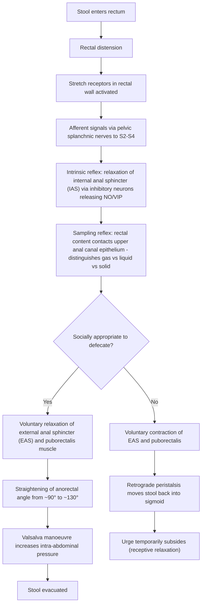

# Constipation

## 1. Definition

Constipation is not a disease but a **symptom** — a subjective complaint about unsatisfactory defecation. It is critically important to **define what exactly the patient means by constipation** [1], because the word means different things to different people:

- **Infrequent stools** (typically < 3 spontaneous bowel movements per week)
- **Hard or lumpy stool consistency** (Bristol Stool Form Scale types 1–2)
- **Straining** or excessive effort to evacuate
- **Sense of incomplete evacuation**
- **Sensation of anorectal obstruction/blockage**
- **Need for manual manoeuvres** (digital evacuation, splinting of perineum/vagina) to facilitate defecation

The word itself comes from Latin: *con-* (together) + *stipare* (to press/pack) — literally "packed together," which is a perfect description of the hard, compacted stool these patients experience.

> **Rome IV Criteria (2016, still the international standard in 2025–2026)** define **functional constipation** as the presence of ≥2 of the following for ≥3 months (onset ≥6 months prior), with insufficient criteria for IBS-C:
> 1. Straining in > 25% of defecations
> 2. Lumpy or hard stools (BSFS 1–2) in > 25% of defecations
> 3. Sensation of incomplete evacuation in > 25% of defecations
> 4. Sensation of anorectal obstruction/blockage in > 25% of defecations
> 5. Manual manoeuvres to facilitate defecation in > 25% of defecations
> 6. Fewer than 3 spontaneous bowel movements per week

<Callout title="Clinical Pearl">
***"Define what exactly the patient means by constipation"*** [1] — this is the first step. Many patients who complain of "constipation" actually have normal stool frequency but are bothered by straining or hard stools. Others may be worried about not going daily (a common lay misconception). Always clarify.
</Callout>

---

## 2. Epidemiology

### 2.1 Global Prevalence
- Functional constipation affects approximately **10–15%** of adults worldwide (varies by diagnostic criteria used)
- Up to **25%** of the population in some East Asian surveys report constipation symptoms [3]

### 2.2 Hong Kong Context
- A community-based study in Hong Kong found self-reported constipation prevalence of approximately **14%** using Rome III criteria
- More common in **older adults** — prevalence rises steeply after age 65 (up to 20–30% in elderly populations)
- ***Alarm symptom threshold*** is particularly important in Hong Kong, where **colorectal cancer (CRC)** is the **most common cancer** overall (males #1, females #2) — so new-onset constipation in anyone > 40 must trigger a high index of suspicion [1]

### 2.3 Demographics
- **Female predominance**: women are ~2–3× more likely to report constipation than men (related to hormonal effects on gut motility, pelvic floor anatomy, and psychosocial factors)
- **Elderly**: age-related decline in gut motility, polypharmacy, reduced mobility, reduced fluid and fibre intake
- **Institutionalised patients**: prevalence up to 50–75% in nursing homes
- **Pregnancy**: up to 40% of pregnant women experience constipation (progesterone-mediated smooth muscle relaxation + mechanical compression by gravid uterus)

### 2.4 Risk Factors

| Category | Risk Factors | Mechanism |
|:---------|:-------------|:----------|
| **Demographics** | Female sex, elderly age | Hormonal effects (progesterone relaxes smooth muscle); age-related enteric neuronal loss |
| **Dietary** | ***Low fibre diet***, inadequate fluid intake | Fibre adds bulk to stool and retains water → stimulates peristalsis; dehydration → harder stools |
| **Lifestyle** | Physical inactivity/immobility, ignoring urge to defecate | Physical activity stimulates colonic motility; habitual suppression → rectal hyposensitivity |
| **Drugs** | ***Opiates (esp. codeine), iron, TCAs, anticholinergics, calcium channel blockers (CCBs), SSRIs, aluminium-containing antacids, benzodiazepines, cough mixtures*** [1] | See detailed drug mechanisms below |
| **Metabolic/Endocrine** | ***Hypothyroidism***, ***hypercalcaemia***, ***hypokalaemia***, diabetes mellitus [1][2] | Thyroid hormone is needed for GI smooth muscle contractility; Ca²⁺ reduces smooth muscle excitability; K⁺ depletion impairs smooth muscle contraction; DM autonomic neuropathy |
| **Neurological** | ***Spinal dysfunction (severe only)***, Parkinson's disease, multiple sclerosis, spinal cord injury [1] | Disruption of extrinsic innervation to colon and/or pelvic floor dyssynergia |
| **Structural/Anorectal** | Rectocele, rectal prolapse, anal stricture, obstructing CRC | Physical obstruction to stool passage |
| **Psychosocial** | ***Depression***, anxiety, eating disorders (***anorexia nervosa***), somatisation [1] | Central-enteric nervous system cross-talk; reduced food intake; behavioural patterns |
| **Other** | Pregnancy, chronic constipation itself (vicious cycle), post-surgical, ICU patients | Progesterone effect; colonic dilatation from chronic faecal loading leads to further dysmotility |

<Callout title="High Yield – Drug-Induced Constipation" type="idea">
***"Drugs selected associated with constipation: analgesics, opioids esp. codeine, TCAs, antacids esp. aluminium hydroxide, Ca channel blockers, SSRIs, cough mixtures, anticholinergics, benzodiazepines"*** [1]. Always take a thorough drug history — **drug-induced constipation is extremely common** and is one of the most easily reversible causes.
</Callout>

<Callout title="Beware Hypokalaemia in the Elderly on Diuretics" type="error">
***"Beware of hypokalaemia causing constipation in the elderly patient on diuretic treatment"*** [1]. This is a classic exam pitfall. An elderly patient on thiazides or loop diuretics develops constipation → check K⁺! Hypokalaemia impairs smooth muscle contraction throughout the gut, and the fix is electrolyte correction, not laxatives.
</Callout>

---

## 3. Anatomy and Physiology of Normal Defecation

Understanding constipation requires understanding the anatomy and physiology of the colon, rectum, and pelvic floor — because constipation is essentially a failure of one or more parts of this coordinated system.

### 3.1 Colonic Anatomy

The colon is approximately 1.5 m long and is divided into:
- **Caecum** (with appendix)
- **Ascending colon** (right colon)
- **Transverse colon**
- **Descending colon** (left colon)
- **Sigmoid colon** — this is the narrowest segment → by **Laplace's law** (wall tension = pressure × radius / wall thickness), the narrowest lumen generates the **highest intraluminal pressure** [4]. This is why the sigmoid is the most common site of diverticulosis in Western populations and is particularly prone to the effects of chronic constipation.
- **Rectum** — approximately 12–15 cm long; the last reservoir before evacuation
- **Anal canal** — approximately 4 cm long; divided by the **dentate (pectinate) line** into upper 2/3 (autonomic innervation, columnar epithelium) and lower 1/3 (somatic innervation, stratified squamous epithelium) [5]

The colon has an outer longitudinal muscle layer condensed into three **taeniae coli** (taenia libera, omentalis, mesocolica) and an inner circular muscle layer. The rectum, by contrast, has a **complete outer longitudinal muscle coat** — which is why diverticula essentially never occur in the rectum [4].

### 3.2 Colonic Function

The primary functions relevant to constipation are:

1. **Water and electrolyte absorption**: The colon absorbs approximately 1–1.5 L of water per day from the ~1.5 L of chyme entering from the ileum. The longer stool stays in the colon, the more water is absorbed → harder, drier stool. This is the fundamental mechanism of slow-transit constipation.

2. **Propulsion**: Three types of colonic motility:
   - **Segmental contractions** (haustral churning): non-propulsive; mix contents and increase mucosal contact for absorption
   - **Peristaltic contractions**: propel content distally
   - **High-amplitude propagating contractions (HAPCs)**: mass movements that occur 1–3 times per day (often post-prandially due to the **gastro-colic reflex**); these are the main mechanism that moves stool from the transverse colon into the sigmoid/rectum, triggering the urge to defecate

3. **Storage**: The sigmoid colon and rectum serve as reservoirs. The rectum is normally empty or near-empty; stool entry into the rectum triggers the defecation reflex.

### 3.3 The Defecation Reflex — Step by Step

Key points:
- The **internal anal sphincter (IAS)** is smooth muscle under **autonomic (involuntary)** control — it provides ~70–80% of resting anal tone
- The **external anal sphincter (EAS)** is striated muscle under **somatic (voluntary)** control via the **pudendal nerve (S2–S4)**
- The **puborectalis muscle** (part of levator ani) forms a sling around the anorectal junction creating the **anorectal angle** (~90° at rest). When it relaxes, the angle opens to ~130°, straightening the path for stool evacuation. **Failure of puborectalis relaxation** (paradoxical contraction) = **dyssynergic defecation** (a key cause of functional outlet obstruction)

### 3.4 Neural Control

| Level | Structure | Function |
|:------|:----------|:---------|
| **Enteric Nervous System** (Auerbach's/myenteric plexus, Meissner's/submucosal plexus) | Intrinsic pacemaker of gut | Generates peristalsis independently; coordinates segmental and propulsive contractions |
| **Parasympathetic** (vagus for proximal colon up to splenic flexure; pelvic splanchnic nerves S2–S4 for distal colon/rectum) | Stimulatory | Increases motility and secretion; promotes defecation |
| **Sympathetic** (T10–L2 via inferior mesenteric ganglion, superior and inferior hypogastric plexuses) | Inhibitory | Decreases motility; contracts IAS (maintains continence) |
| **Somatic** (pudendal nerve S2–S4) | Voluntary control of EAS and puborectalis | Allows voluntary continence and voluntary defecation |
| **Supraspinal** (pontine defecation centre, cerebral cortex) | Coordination and voluntary override | Pontine centre coordinates detrusor-like reflex; cortex allows voluntary initiation/suppression |

**Why does this matter for constipation?** Because disruption at ANY level — from the enteric neurons (e.g. Hirschsprung disease, where ganglia are absent), to the parasympathetic outflow (e.g. spinal cord injury), to the voluntary pelvic floor control (e.g. dyssynergia), to the supraspinal centres (e.g. Parkinson's disease) — can cause constipation.

---

## 4. Aetiology and Pathophysiology

The causes of constipation can be broadly divided into **primary (functional/idiopathic)** and **secondary** causes. In clinical practice, **most constipation is primary/functional**, but the job of the clinician is to **exclude secondary causes**, especially dangerous ones like colorectal malignancy.

### 4.1 Primary (Functional) Constipation

Three pathophysiological subtypes — these are not mutually exclusive and often overlap:

#### A. Normal-Transit Constipation (NTC)
- The **most common subtype** (~60% of functional constipation)
- Objective colonic transit time is actually normal on testing
- Patients perceive difficulty with defecation — likely due to **visceral hypersensitivity**, altered perception, or psychosocial factors
- Often overlaps with **IBS-C** (IBS with constipation) [3] — the distinction is that IBS-C has **prominent abdominal pain** associated with defecation, whereas NTC may not

#### B. Slow-Transit Constipation (STC) / Colonic Inertia
- Reduced frequency of **high-amplitude propagating contractions (HAPCs)**
- Pathophysiology: may involve:
  - Reduced **interstitial cells of Cajal** (the "pacemaker" cells of the gut) in the colonic wall
  - Reduced enteric neurons in the myenteric plexus
  - Altered neurotransmitter balance (e.g. ↓serotonin, ↓substance P, ↑nitric oxide)
- Result: stool moves very slowly through the colon → excessive water absorption → very hard, infrequent stools
- More common in **young women**
- Diagnosed by **radio-opaque marker transit study** (Sitz markers) or **wireless motility capsule**

#### C. Defecatory Disorders (Outlet Obstruction / Dyssynergic Defecation)
- Also called **pelvic floor dyssynergia**, **anismus**, or **obstructed defecation**
- Pathophysiology: **failure of coordinated relaxation** of the pelvic floor muscles during attempted defecation:
  - **Paradoxical contraction of puborectalis** (the muscle contracts instead of relaxing → the anorectal angle does not open)
  - **Inadequate relaxation of EAS**
  - **Inadequate rectal propulsive force**
- Structural causes of outlet obstruction include:
  - **Rectocele** (herniation of rectum into vagina — stool gets trapped in the pouch)
  - **Rectal intussusception** / rectal prolapse [6]
  - **Enterocele** / sigmoidocele
  - **Descending perineum syndrome**
  - **Megarectum** (chronic rectal distension → ↓rectal sensation → ever-larger volumes needed to trigger urge)
- Diagnosed by **anorectal manometry**, **balloon expulsion test**, **defecography** (conventional or MR)

<Callout title="IBS-C vs Functional Constipation">
Both are **functional** (no structural cause), but:
- **IBS-C**: constipation + **predominant abdominal pain** related to defecation, ≥1 day/week for 3 months [3]
- **Functional constipation**: constipation criteria met but **insufficient criteria for IBS**

In practice, these exist on a spectrum and patients may shift between categories over time. ***IBS w/ constipation (IBS-C): hard stools ≥25% with loose/watery stools < 25% of bowel movements*** [3].
</Callout>

### 4.2 Secondary Causes of Constipation

This is the critical list to work through systematically. The mnemonic from the lecture slides is essentially a checklist:

> ***Key secondary causes from lecture slides [1]:***
> - ***Depression***
> - ***Diabetes (rarely)***
> - ***Drugs (opiates, iron, others) — see list***
> - ***Thyroid disorder (hypothyroidism)***
> - ***Spinal dysfunction (severe only)***
> - ***May be functional (e.g. depression, anorexia nervosa)***

Let's expand each systematically:

#### A. Drug-Induced Constipation

This is the **most common secondary cause** and the most reversible. Understanding mechanisms is key:

| Drug Class | Examples | Mechanism of Constipation |
|:-----------|:---------|:--------------------------|
| **Opioids** | ***Codeine***, morphine, tramadol, oxycodone, fentanyl | Bind μ-opioid receptors on myenteric and submucosal neurons → ↓ACh release → ↓peristalsis + ↑segmental contractions (non-propulsive) + ↑water absorption + ↑anal sphincter tone. Codeine is particularly constipating because it is a pro-drug of morphine with incomplete metabolism. |
| **Anticholinergics** | Atropine, ***anti-histamines***, ***anti-spasmodics***, ***anti-psychotics***, ***anti-depressants (TCAs)*** [7] | Block muscarinic M₃ receptors on colonic smooth muscle → ↓contractility → ↓propulsion |
| **Calcium channel blockers** | ***CCBs*** (verapamil worst, nifedipine, diltiazem) [2] | Block L-type Ca²⁺ channels in GI smooth muscle → ↓intracellular Ca²⁺ → ↓smooth muscle contraction |
| **Iron supplements** | Ferrous sulphate, ferrous fumarate | Unabsorbed iron in the gut lumen is directly toxic to intestinal mucosa + alters gut microbiota → ↓motility |
| **Aluminium-containing antacids** | ***Aluminium hydroxide*** [1] | Aluminium ions directly inhibit smooth muscle contraction |
| **SSRIs** | Fluoxetine, sertraline, paroxetine [1] | Paradoxically — while 5-HT usually promotes motility, SSRIs can desensitise 5-HT receptors over time in some patients, or cause anticholinergic-like effects |
| **Benzodiazepines** | Diazepam, lorazepam [1] | Central and peripheral GABA-mediated muscle relaxation → ↓colonic motility |
| **Cough mixtures** | Often contain codeine or dextromethorphan [1] | Opioid component as above |
| **Diuretics** | Thiazides, loop diuretics | Not directly constipating but cause **hypokalaemia** → impaired smooth muscle contraction [1] |
| **Others** | Clonidine, 5-HT₃ antagonists (ondansetron), bile acid sequestrants (cholestyramine) | Various mechanisms: ↓sympatholytic effect, ↓serotonin-mediated secretion, bile acid binding ↓colonic secretion |

#### B. Metabolic and Endocrine Causes

| Condition | Mechanism |
|:----------|:----------|
| ***Hypothyroidism*** [1] | Thyroid hormone (T₃) is required for normal GI smooth muscle contractility and metabolic rate. Deficiency → ↓basal metabolic rate → ↓gut motility → slow transit. Also may have myxoedematous infiltration of bowel wall. |
| ***Hypercalcaemia*** [1][2] | Ca²⁺ excess → ↓smooth muscle excitability (Ca²⁺ stabilises cell membranes, making them less likely to depolarise) → ↓colonic contraction. Causes: primary hyperparathyroidism, malignancy, sarcoidosis. Classic exam question! |
| ***Hypokalaemia*** [1][2] | K⁺ is essential for smooth muscle cell repolarisation. Depletion → smooth muscle cells remain relatively hyperpolarised → ↓contractility. Think of the elderly on diuretics. |
| ***Diabetes mellitus*** [1] | Autonomic neuropathy (particularly affecting vagal and sacral parasympathetic fibres) → ↓colonic propulsion. Also may have associated enteric neuropathy. |
| Uraemia | Uraemic toxins affect enteric neural function; also associated with reduced fluid intake and polypharmacy |
| Hypomagnasaemia | Mg²⁺ depletion → similar mechanism to hypokalaemia (both affect smooth muscle excitability) |
| Phaeochromocytoma (rare) | Catecholamine excess → sympathetic overdrive → ↓GI motility |

#### C. Neurological Causes

| Condition | Mechanism |
|:----------|:----------|
| ***Spinal cord injury/dysfunction*** [1] | Disrupts the descending control from pontine defecation centre and voluntary cortical control → loss of coordinated defecation reflex + pelvic floor dyssynergia [8] |
| **Parkinson's disease** | Lewy body pathology affects the enteric nervous system (even before motor symptoms appear) → ↓colonic motility. Also: ↓physical activity, anticholinergic medications |
| **Multiple sclerosis** | Demyelination of spinal cord pathways → neurogenic bowel (similar to SCI) |
| **Stroke** | Immobility, altered consciousness, medications, and direct disruption of cortical defecation control |
| **Hirschsprung disease** | Congenital absence of ganglion cells (Auerbach's and Meissner's plexuses) in a segment of colon → aganglionic segment cannot relax or propagate peristalsis → functional obstruction [6]. Almost always presents in neonates/infants but rare cases present in adults. |
| **Autonomic neuropathy** (DM, amyloidosis) | Loss of parasympathetic drive to the colon |
| **Chagas disease** (not in HK but worth knowing) | *Trypanosoma cruzi* destroys myenteric plexus neurons → megacolon |

#### D. Structural / Mechanical Causes

| Condition | Mechanism |
|:----------|:----------|
| **Colorectal cancer** | Physical obstruction of the lumen. ***Alarm symptom: recent constipation in those > 40 years*** [1] |
| **Diverticular stricture** | Chronic inflammation from diverticulitis → fibrosis → luminal narrowing [4] |
| **Anal stricture/fissure** | Pain on defecation → voluntary withholding → worsening constipation (vicious cycle). Fissure also causes IAS spasm (reflex) → further obstruction |
| **Rectocele** | Herniation of anterior rectal wall into vagina → stool pockets into the rectocele instead of being evacuated [6] |
| **Rectal prolapse** | Associated with constipation both as a cause (obstructed defecation) and a consequence (chronic straining) [6] |
| **Post-surgical adhesions** | Can cause partial obstruction → slow transit |
| **Extrinsic compression** | Pelvic masses (ovarian cyst, fibroid, pregnancy) compress the rectosigmoid |

#### E. Psychosocial / Functional Causes

| Condition | Mechanism |
|:----------|:----------|
| ***Depression*** [1] | ↓physical activity, ↓appetite/food intake, psychomotor retardation, medications (TCAs, SSRIs) all contribute. Also direct CNS-enteric nervous system interaction via the brain-gut axis |
| ***Anorexia nervosa*** [1] | Markedly ↓food intake → ↓faecal bulk → ↓stimulus for colonic motility. Also: electrolyte disturbances (hypokalaemia), laxative abuse paradoxically worsens constipation over time |
| **Anxiety/somatisation** | Sympathetic overdrive → ↓GI motility (fight-or-flight response diverts blood away from GI tract) |
| **Behavioural** | Habitual suppression of defecation urge (busy professionals, school children, patients in unfamiliar environments) → rectal hyposensitivity over time |

<Callout title="Is the patient trying to tell me something?" type="idea">
***"May be functional (e.g. depression, anorexia nervosa)"*** [1]. Constipation may be the presenting complaint of a psychiatric disorder. Always screen for mood and eating habits, especially in young women with chronic constipation and no obvious secondary cause.
</Callout>

### 4.3 Constipation as a Risk Factor for Other Conditions

Constipation is not just a standalone problem — it contributes to other pathology throughout the body:

| Condition | How constipation contributes |
|:----------|:---------------------------|
| **GERD** | ***Constipation*** → straining → ***↑intra-abdominal pressure*** → ↑gastro-oesophageal reflux [9] |
| **Haemorrhoids** | ***Constipation*** → straining → ***↑intra-abdominal pressure*** → engorgement of anal vascular cushions + shearing of supporting connective tissue [5][10] |
| **Anal fissure** | Hard, large stools → mechanical tearing of anoderm |
| **Rectal prolapse** | Chronic straining → pelvic floor weakening → all layers of rectum protrude through anus [6] |
| **Sigmoid volvulus** | ***Chronic faecal overloading from constipation*** → elongation and dilatation of sigmoid colon → predisposes to twisting around narrow mesenteric attachment [6][11] |
| **Diverticular disease** | ***Increased intraluminal pressure*** (from straining with constipation) at weakest points of colonic wall (where ***vasa recta penetrate circular muscle***) → mucosal herniation [4] |
| **Acute retention of urine (AROU)** | ***Constipation*** is a common **precipitating factor** for AROU (particularly in males with background BPH) — faecal loading compresses the bladder neck/prostatic urethra [7][8] |
| **Faecal impaction → overflow incontinence** | Paradoxical diarrhoea: liquid stool leaks around impacted mass |
| **Hernia** | Chronic straining → ***↑intra-abdominal pressure*** → abdominal wall weakening [12] |
| **Varicose veins** | ***Increased abdominal pressure such as chronic cough and constipation*** [13] → ↑venous pressure transmitted to lower limb veins |

---

## 5. Classification

### 5.1 By Duration
- **Acute constipation**: recent onset (days to weeks) — always consider **obstruction** (mechanical or functional), **new medication**, or **acute illness**
- **Chronic constipation**: ≥3 months duration (Rome IV) — more likely primary/functional

### 5.2 By Mechanism (Primary/Functional)

| Subtype | Mechanism | Key Features |
|:--------|:----------|:-------------|
| **Normal-transit constipation (NTC)** | Normal colonic transit; altered perception | Most common; often a/w IBS-C overlap |
| **Slow-transit constipation (STC)** | ↓colonic propulsive activity | Infrequent stools, ↓urge, often young women |
| **Defecatory disorder (outlet obstruction)** | Impaired rectal evacuation (functional or structural) | Straining, incomplete evacuation, need for digital manoeuvres |
| **Mixed** | Combination of STC + defecatory disorder | Common in practice |

### 5.3 By Aetiology
- **Primary** (functional/idiopathic): NTC, STC, defecatory disorder
- **Secondary**: drugs, metabolic/endocrine, neurological, structural, psychosocial (as detailed in Section 4.2)

### 5.4 Bristol Stool Form Scale (BSFS)

A practical clinical tool for categorising stool consistency:

| Type | Description | Clinical Significance |
|:-----|:------------|:---------------------|
| 1 | Separate hard lumps (like nuts) | Severe constipation |
| 2 | Sausage-shaped but lumpy | Mild constipation |
| 3 | Sausage-shaped with cracks on surface | Normal |
| 4 | Smooth, soft sausage or snake | Normal (ideal) |
| 5 | Soft blobs with clear-cut edges | Lacking fibre |
| 6 | Fluffy pieces with ragged edges | Mild diarrhoea |
| 7 | Watery, no solid pieces | Severe diarrhoea |

Constipation = predominantly Type 1–2.

---

## 6. Clinical Features

### 6.1 Symptoms

Every symptom should be understood in terms of **why** it occurs:

| Symptom | Pathophysiological Basis |
|:--------|:------------------------|
| **Infrequent defecation** (< 3/week) | Slow colonic transit → prolonged colonic water absorption → insufficient faecal mass to trigger defecation reflex |
| **Hard, lumpy stools** (BSFS 1–2) | Prolonged colonic transit → excessive water absorption from stool → dry, hard faecal pellets |
| **Straining** | Either: (a) hard stool requires more expulsive force, or (b) pelvic floor dyssynergia → paradoxical contraction of puborectalis/EAS → patient must generate very high intra-abdominal pressure to overcome outlet obstruction |
| **Sensation of incomplete evacuation** | Residual stool in rectum after defecation → persistent rectal distension → ongoing stretch receptor stimulation. Also seen in rectocele (stool pocketed in rectocele) |
| **Sensation of anorectal blockage** | Functional: dyssynergic defecation (puborectalis fails to relax). Structural: rectocele, rectal intussusception, large haemorrhoids |
| **Need for digital manoeuvres** | Patient may digitally evacuate stool or splint vaginal wall posteriorly (to support rectocele and redirect stool). This strongly suggests **defecatory disorder** |
| **Abdominal pain/discomfort/bloating** | Faecal distension of the colon → visceral afferent stimulation → crampy/colicky pain. Gas accumulation (bacterial fermentation of retained stool) → bloating. If pain is prominent and related to defecation, consider **IBS-C** [3] |
| **Nausea/anorexia** | Severe constipation with faecal loading → retrograde distension → reflex nausea via vagal afferents |
| **Rectal bleeding** | Hard stools cause mechanical trauma to anal mucosa → **anal fissure** (sharp pain on defecation + bright red blood on paper) or exacerbation of **haemorrhoids** (painless bright red blood coating stool) [5] |
| **Overflow incontinence** (paradoxical diarrhoea) | Severe faecal impaction in the rectum → liquid stool from above seeps around the impacted mass → patient reports "diarrhoea" when they are actually severely constipated. Classic in elderly/demented patients. |
| **Abdominal distension** | Gas and stool accumulation → visible and palpable distension, tympanitic on percussion |
| **Tenesmus** | Persistent urge to defecate despite incomplete or no evacuation → rectal mucosal irritation or residual stool. If persistent, consider **rectal pathology** (malignancy, proctitis) |

<Callout title="Red Flag — Overflow Incontinence in the Elderly" type="error">
A common exam scenario: an elderly nursing home resident presents with "diarrhoea." The inexperienced student prescribes anti-diarrhoeals. **Always do a rectal examination first** — this may be **overflow incontinence** from faecal impaction, and anti-diarrhoeals would be disastrous. The treatment is **disimpaction**, not loperamide.
</Callout>

### 6.2 Signs

| Sign | How to Elicit | Pathophysiological Basis |
|:-----|:-------------|:------------------------|
| **Abdominal distension** | Inspection | Faecal and gas accumulation in the colon |
| **Palpable faecal masses** | Palpation — typically in left iliac fossa and along the course of the descending/sigmoid colon | Firm, indentable masses that follow the course of the colon. Can be indented (unlike tumour, which is hard and non-indentable). The sigmoid colon is the most common site because it is the narrowest segment and the last "holding area" before the rectum. |
| **Tympanitic percussion** | Percussion over distended colon | Gas accumulation proximal to faecal loading |
| **Reduced or altered bowel sounds** | Auscultation | May be normal, or tinkling (if partial obstruction), or reduced (if adynamic ileus) |
| ***Rectal examination findings*** [1] | ***Key examination*** | **Must be performed in every patient with constipation:** |
| — Empty rectum | DRE | May suggest slow-transit constipation (stool hasn't reached the rectum), or proximal obstruction |
| — Loaded rectum with hard stool | DRE | Faecal impaction — the most common finding in chronic constipation |
| — Rectal mass | DRE | Suspect **colorectal cancer** — firm, irregular, fixed mass |
| — Anal stricture | DRE — finger cannot pass easily | Scarring from previous surgery, Crohn's disease, radiation, or chronic fissure |
| — Reduced anal tone | DRE | May indicate neurological cause (cauda equina, S2–S4 lesion) |
| — Paradoxical puborectalis contraction | DRE — ask patient to "bear down" / simulate defecation; the puborectalis should relax (examiner feels posterior pull releasing); if it contracts instead, this is paradoxical contraction | Suggests **dyssynergic defecation** |
| ***Perianal sensation and anal reflex*** [1] | Light touch perianally; pin-prick at anal margin should cause reflex EAS contraction ("anal wink") | Tests integrity of S2–S4 arc. Absent anal reflex suggests **cauda equina syndrome** or **sacral nerve lesion** — a neurological emergency if acute |
| **Signs of hypothyroidism** | General examination: dry skin, periorbital oedema, bradycardia, delayed relaxation of ankle jerks, goitre | Hypothyroidism is a secondary cause [1] |
| **Signs of hypercalcaemia** | Confusion, polyuria, polydipsia, muscle weakness, short QT on ECG | Hypercalcaemia → ↓smooth muscle excitability [2] |
| **Signs of Parkinson's disease** | Resting tremor, rigidity, bradykinesia, postural instability | Enteric Lewy body pathology → ↓colonic motility |
| **Abdominal scars** | Inspection | Previous surgery → adhesions → possible partial obstruction |

<Callout title="Key Examination Steps" type="idea">
***"The important aspects are abdominal palpation and rectal examination. Test perianal sensation and the anal reflex. Perform sigmoidoscopy."*** [1]

The rectal examination is the single most important physical examination in constipation. It can identify:
1. Faecal impaction
2. Rectal mass (cancer)
3. Rectocele
4. Anal fissure/stricture
5. Anal tone (neurological cause)
6. Pelvic floor dyssynergia (paradoxical contraction on bearing down)
</Callout>

### 6.3 Alarm Features ("Red Flags")

These are the features that should prompt **urgent investigation** (primarily to exclude colorectal cancer):

> ***"Alarm symptoms are rectal bleeding, recent constipation in those > 40 years and family history of cancer."*** [1]
>
> ***"Bleeding suggests cancer, haemorrhoids, diverticular disorder and inflammatory bowel disease."*** [1]

| Alarm Feature | Why It's Alarming |
|:-------------|:-----------------|
| ***Rectal bleeding*** | May indicate CRC, IBD, or advanced diverticular disease [1] |
| ***Recent onset constipation in age > 40*** | New-onset change in bowel habit in this age group has a significant risk of CRC [1] |
| ***Family history of colorectal cancer*** | Hereditary CRC syndromes (Lynch syndrome, FAP) significantly increase risk [1] |
| **Unintentional weight loss** | Suggests malignancy or systemic disease |
| **Iron-deficiency anaemia** | Occult GI blood loss — right-sided colon cancers classically present with anaemia rather than overt bleeding |
| **Palpable abdominal or rectal mass** | Direct evidence of tumour |
| **Progressive worsening** | Constipation that is steadily getting worse despite treatment suggests a progressive organic cause |
| **Narrow-calibre ("pencil-thin") stools** | Suggests distal colorectal/rectal lesion narrowing the lumen |

<Callout title="Hong Kong Context — CRC Screening" type="error">
Colorectal cancer is the **#1 cancer in Hong Kong by incidence** (both sexes combined). The HK government provides a **Colorectal Cancer Screening Programme** for those aged 50–75. Any new-onset constipation in this age group must have CRC excluded. ***"If appropriate refer for sigmoidoscopy or colonoscopy and radiological studies (e.g. CT colonography, bowel transit studies)"*** [1].
</Callout>

---

## 7. Key History Taking Framework

Based on the lecture slides and clinical approach:

> ***"The history should include stool consistency, frequency, ease of evacuation, pain on defecation and the presence of blood or mucus. A dietary and drug history is important."*** [1]

### Structured History:

1. **Characterise the constipation**:
   - Frequency of bowel movements per week
   - Stool consistency (use Bristol Stool Form Scale)
   - Straining? Sense of incomplete evacuation? Sensation of blockage?
   - Need for digital manoeuvres?
   - Duration: acute vs chronic
   - Progression: stable, improving, or worsening

2. **Associated symptoms**:
   - **Bleeding** (bright red per rectum? On paper? Mixed with stool? Dark/melaena?)
   - **Mucus** (may suggest IBS, villous adenoma, rectal prolapse)
   - **Pain on defecation** (anal fissure, thrombosed haemorrhoids)
   - **Abdominal pain** (location, character, relationship to defecation — colicky pain relieved by defecation → IBS-C)
   - **Weight loss, appetite change, fatigue** (alarm features)
   - **Nausea/vomiting** (suggests severe impaction or obstruction)

3. **Dietary history**:
   - Daily fibre intake (recommended 25–30 g/day)
   - Daily fluid intake (recommended ≥1.5–2 L/day)
   - Types of food (processed vs whole grain, fruits, vegetables)

4. ***Drug history*** [1]:
   - Go through the drug list systematically (opioids, anticholinergics, CCBs, iron, antacids, TCAs, SSRIs, benzodiazepines, diuretics)
   - Including OTC medications and supplements

5. **Medical history**:
   - Hypothyroidism, DM, hypercalcaemia, neurological disease, psychiatric history
   - Previous abdominal/pelvic surgery (adhesions)
   - Previous colonoscopy results

6. **Family history**:
   - CRC, IBD, polyposis syndromes

7. **Psychosocial history**:
   - Depression screen, eating disorder screen
   - Physical activity level
   - Impact on quality of life

8. **Obstetric/gynaecological history** (in women):
   - Multiparity, vaginal delivery (pelvic floor damage)
   - Pelvic organ prolapse symptoms

---

## 8. Key Investigation Points (Brief — Full Diagnostic Workup in Next Section)

> ***"Basic tests are FBE/ESR, occult blood in stool. Consider serum calcium, potassium, CEA and TFTs. If appropriate refer for sigmoidoscopy or colonoscopy and radiological studies (e.g. CT colonography, bowel transit studies)."*** [1]

| Investigation | What You're Looking For |
|:-------------|:-----------------------|
| **FBE (full blood examination)** | Iron-deficiency anaemia (microcytic, ↓ferritin) → occult GI blood loss → CRC |
| **ESR / CRP** | Elevated in IBD, malignancy, infection |
| **Occult blood in stool (FIT/FOBT)** | Occult GI bleeding → CRC screening |
| **Serum calcium** | Hypercalcaemia → constipation [1] |
| **Serum potassium** | Hypokalaemia → constipation [1] |
| **TFTs** | Hypothyroidism → constipation [1] |
| **CEA** | Tumour marker for CRC (not diagnostic alone, but useful in monitoring) |
| **Fasting glucose / HbA1c** | Diabetes (autonomic neuropathy) |
| **Renal function (Cr, BUN)** | Uraemia, also needed for medication dosing |
| ***Sigmoidoscopy*** [1] | Visualise rectosigmoid — common site of CRC, can identify mucosal disease |
| **Colonoscopy** | Gold standard for excluding CRC in patients with alarm features |
| **CT colonography** | Alternative to colonoscopy in those who cannot tolerate or have incomplete colonoscopy |
| **Bowel transit studies** (radio-opaque markers) | Differentiate slow-transit from normal-transit constipation |
| **Anorectal manometry + balloon expulsion test** | Diagnose defecatory disorders / dyssynergia |
| **Defecography (MRI or barium)** | Identify structural outlet obstruction (rectocele, intussusception, perineal descent) |

---

<Callout title="High Yield Summary">

**Key Points for Constipation (Pre-DDx/Dx/Mx):**

1. **Definition**: Always clarify what the patient means — constipation is subjective. Rome IV criteria define functional constipation (≥2 of 6 symptoms for ≥3 months).

2. **Epidemiology**: ~10–15% global prevalence; more common in females, elderly, institutionalised. In HK, CRC is the #1 cancer — always exclude malignancy in new-onset constipation > 40 years.

3. **Three functional subtypes**: Normal-transit (most common), slow-transit, and defecatory disorder (outlet obstruction). Often overlap.

4. **Secondary causes (must exclude)**: ***Drugs*** (most common reversible cause: opioids, anticholinergics, CCBs, iron, TCAs, SSRIs, benzodiazepines, aluminium antacids), ***hypothyroidism, hypercalcaemia, hypokalaemia, diabetes, spinal dysfunction, depression, anorexia nervosa, CRC***.

5. **Drug-induced constipation** is extremely common and reversible — always take a thorough drug history.

6. **Alarm features**: Rectal bleeding, new constipation > 40 years, family history of CRC, weight loss, anaemia, palpable mass, progressive worsening.

7. **Key examination**: Abdominal palpation + **rectal examination** (loaded rectum? mass? tone? dyssynergia?) + perianal sensation + anal reflex + sigmoidoscopy.

8. **Key basic investigations**: FBE, ESR, occult blood in stool, serum Ca²⁺, K⁺, TFTs, CEA. Colonoscopy if alarm features present.

9. **Constipation causes other problems**: ↑IAP → GERD, haemorrhoids, hernia, varicose veins, rectal prolapse; faecal loading → sigmoid volvulus, diverticular disease; precipitates AROU (especially in males with BPH).

</Callout>

---

<ActiveRecallQuiz
  title="Active Recall - Constipation: Definition, Epidemiology, Aetiology, Pathophysiology and Clinical Features"
  items={[
    {
      question: "Name the three pathophysiological subtypes of primary (functional) constipation and the key diagnostic test for each.",
      markscheme: "1. Normal-transit constipation (most common; diagnosed by normal transit on radio-opaque marker study). 2. Slow-transit constipation (diagnosed by radio-opaque marker study / wireless motility capsule showing delayed transit). 3. Defecatory disorder / dyssynergic defecation (diagnosed by anorectal manometry + balloon expulsion test +/- defecography)."
    },
    {
      question: "List 6 drug classes that commonly cause constipation and explain the mechanism for opioids.",
      markscheme: "Drug classes: opioids, anticholinergics, CCBs, iron, aluminium antacids, TCAs/SSRIs, benzodiazepines (any 6). Opioids bind mu-receptors on myenteric neurons causing decreased ACh release, decreased peristalsis, increased non-propulsive segmental contractions, increased water absorption, and increased anal sphincter tone."
    },
    {
      question: "What are the three alarm symptoms for constipation listed in the Murtagh lecture slides, and what diagnosis must be excluded?",
      markscheme: "Alarm symptoms: 1. Rectal bleeding, 2. Recent constipation in those over 40 years, 3. Family history of cancer. Must exclude colorectal cancer."
    },
    {
      question: "Why does hypokalaemia cause constipation? Give a classic clinical scenario.",
      markscheme: "Potassium depletion causes smooth muscle cells to remain relatively hyperpolarised, reducing contractility of colonic smooth muscle. Classic scenario: elderly patient on thiazide or loop diuretics presenting with new constipation - check serum K+."
    },
    {
      question: "Describe the mechanism of dyssynergic defecation (pelvic floor dyssynergia) and one key examination finding on DRE.",
      markscheme: "Paradoxical contraction of the puborectalis muscle and/or external anal sphincter during attempted defecation, preventing opening of the anorectal angle. On DRE, when asking the patient to bear down, the examiner feels the puborectalis contract (tighten) instead of relax."
    },
    {
      question: "How does chronic constipation predispose to sigmoid volvulus? Include the relevant anatomical basis.",
      markscheme: "Chronic faecal overloading causes elongation and dilatation of the sigmoid colon. The sigmoid already has a narrow mesenteric attachment. The combination of a long, redundant, loaded sigmoid with a narrow mesenteric base predisposes to torsion (twisting) around the mesenteric axis."
    }
  ]}
/>

---

## References

[1] Lecture slides: murtagh merge.pdf (Chronic constipation section, p31)
[2] Senior notes: maxim.md (Section 4.6 – Constipation DDx: IBS, drugs e.g. CCB, hypothyroidism, hyperCa, hypoK, cord compression, IO)
[3] Senior notes: Ryan Ho GI.pdf (Section 3.2.1 – Irritable Bowel Syndrome, p118)
[4] Senior notes: maxim.md (Diverticular disease section – pathophysiology, risk factors)
[5] Senior notes: felixlai.md (Hemorrhoids – anatomy of anal canal, risk factors including constipation)
[6] Senior notes: felixlai.md (Rectal prolapse, sigmoid volvulus – constipation as risk factor)
[7] Senior notes: felixlai.md (Acute retention of urine – constipation as outflow obstruction cause/precipitant)
[8] Senior notes: Ryan Ho Fundamentals.pdf (p349–350: AROU – constipation as precipitating factor)
[9] Senior notes: Ryan Ho GI.pdf (p57: GERD – constipation as cause of increased IAP)
[10] Senior notes: maxim.md (Haemorrhoids – risk factors including constipation)
[11] Senior notes: maxim.md (Volvulus – risk factors including chronic constipation)
[12] Senior notes: felixlai.md (Hernia – risk factors including chronic constipation)
[13] Senior notes: felixlai.md (Varicose veins – risk factors including constipation)
