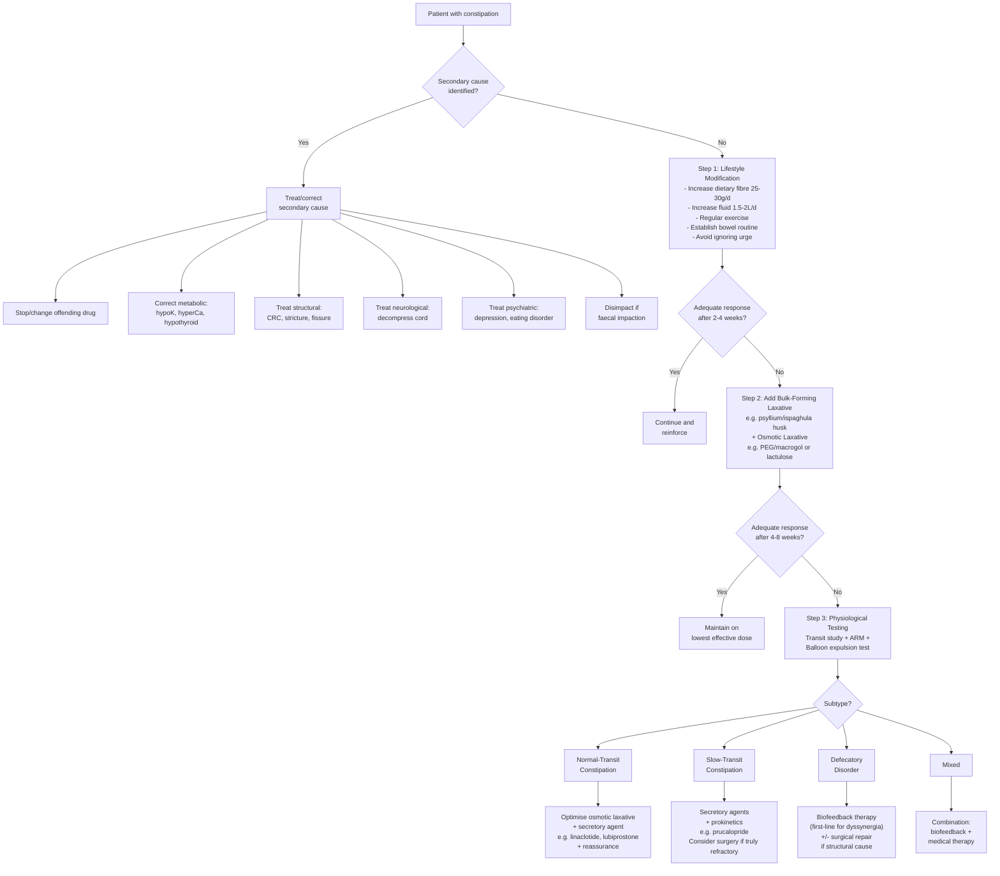
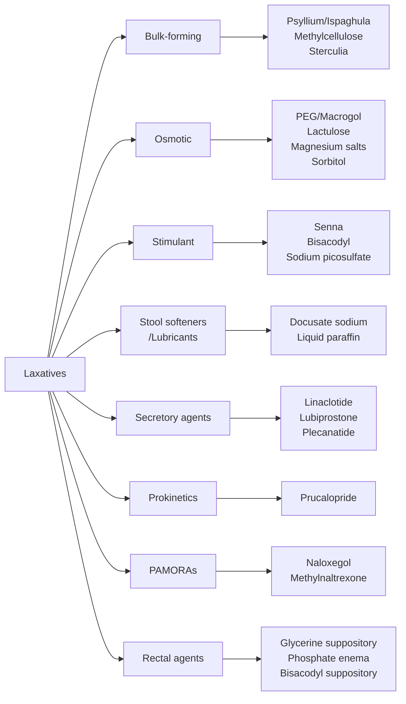

## Management of Constipation

The overarching principle is: **treat the cause first, then treat the symptom**. This sounds simple, but it structures every decision. A patient whose constipation is caused by codeine doesn't need laxatives — they need a different analgesic. A patient with dyssynergic defecation doesn't need stronger laxatives — they need biofeedback. Getting the management right depends entirely on getting the diagnosis right.

---

### 1. Management Algorithm

---

### 2. Step 0: Treat Secondary Causes First

Before reaching for any laxative, ask: **is there an identifiable and correctable cause?**

#### 2.1 Drug-Induced Constipation

> ***"Drugs selected associated with constipation: analgesics, opioids esp. codeine, TCAs, antacids esp. aluminium hydroxide, Ca channel blockers, SSRIs, cough mixtures, anti-cholinergics, benzodiazepines"*** [1]

| Drug | Management Approach |
|:-----|:-------------------|
| **Opioids** | Reduce dose if possible; rotate to less constipating opioid (e.g. fentanyl patch, tapentadol); add **peripherally-acting μ-opioid receptor antagonists (PAMORAs)** — naloxegol, methylnaltrexone (see below); co-prescribe laxatives prophylactically whenever starting opioids |
| **Anticholinergics** | Review necessity; switch to agents with less anticholinergic burden (e.g. switch amitriptyline to nortriptyline or SNRI; switch chlorpheniramine to cetirizine) |
| **CCBs** | Switch verapamil (worst) to dihydropyridine (amlodipine) or different antihypertensive class |
| **Iron** | Take with vitamin C (improves absorption → can ↓dose); switch to ferrous gluconate (less constipating) or IV iron if oral not tolerated |
| **Aluminium antacids** | Switch to magnesium-based antacid or PPI |

#### 2.2 Metabolic/Endocrine Causes

| Cause | Treatment |
|:------|:---------|
| ***Hypothyroidism*** [1] | Levothyroxine replacement — constipation resolves as euthyroid state is achieved |
| ***Hypercalcaemia*** [1] | IV normal saline hydration → loop diuretic (furosemide) → treat underlying cause (parathyroidectomy for primary hyperPTH, bisphosphonates for malignancy) |
| ***Hypokalaemia*** [1] | K⁺ replacement (oral KCl slow-release or IV if severe); treat underlying cause (adjust diuretic, treat hyperaldosteronism) |
| **Diabetes** | Optimise glycaemic control; prokinetics may help autonomic gastroparesis/colonic dysmotility |

#### 2.3 Faecal Impaction — A Special Case

***Impacted faeces*** [1] is a common pitfall that requires **active disimpaction before** any maintenance laxative regimen can work:

| Step | Intervention | Rationale |
|:-----|:------------|:---------|
| **1. Soften the mass** | Glycerine suppositories or mineral oil (liquid paraffin) enema | Lubricate and soften the hard faecal mass to facilitate passage |
| **2. Stimulate evacuation** | Phosphate enema (Fleet enema) or sodium citrate micro-enema | Osmotically draws water into the rectum → softens stool + distends rectum → triggers defecation reflex |
| **3. Manual disimpaction** | Digital manual disimpaction under sedation/analgesia if enemas fail | For rock-hard impaction that cannot be broken up by enemas alone — common in elderly/bedbound patients |
| **4. High-volume washout** | Oral PEG-based bowel preparation (e.g. GoLYTELY, Klean-Prep) at bowel-prep doses | Flushes out residual impacted stool from proximal colon after rectal disimpaction |
| **5. Maintenance** | Once clear, start maintenance regimen (osmotic laxative ± stimulant) to prevent re-impaction | Impaction is a recurrent problem if the underlying cause is not addressed |

<Callout title="Treat the Cause of AROU" type="idea">
Constipation is a common **precipitating factor** for acute retention of urine in men with BPH [22][23]. Management includes: ***"Treat reversible causes: stop offending drugs, treat constipation (e.g. fleet enema) and UTI"*** [22]. Relieving the faecal loading removes mechanical compression of the prostatic urethra and may allow the patient to void spontaneously.
</Callout>

---

### 3. Step 1: Lifestyle Modification (First-Line for All Patients)

This is the foundation of management for **all** patients, whether primary or secondary constipation.

| Intervention | Target | Mechanism | Evidence/Notes |
|:------------|:-------|:----------|:--------------|
| **↑Dietary fibre** | 25–30 g/day | Fibre is either soluble (absorbs water → gel → softens stool) or insoluble (adds bulk → stimulates colonic stretch receptors → ↑peristalsis). Both ↑faecal mass and ↓transit time. | Effective for mild-moderate constipation. Must be increased **gradually** to avoid bloating and flatulence. Ineffective in severe slow-transit constipation (may actually worsen bloating). |
| **↑Fluid intake** | ≥1.5–2 L/day | Water hydrates stool and is required for fibre to exert its bulking effect. Dehydration → harder stools. | Important adjunct to fibre supplementation — fibre without adequate fluid can worsen constipation. |
| **Regular physical exercise** | ≥30 min moderate activity most days | Exercise stimulates colonic motility via mechanical stimulation of the colon, ↑parasympathetic tone, and ↑blood flow to the GI tract. | ***Constipation: common, consider high-fibre diet, bulk/osmotic laxative, ↑fluid intake/exercise*** [14] |
| **Establish bowel routine** | Regular toilet time, ideally after meals (utilise gastro-colic reflex) | The gastro-colic reflex is a physiological ↑in colonic motility triggered by gastric distension after eating. Sitting on the toilet at this time takes advantage of the natural propulsive wave. | Particularly important for patients who have habitual suppression of defecation urge |
| **Proper defecation posture** | Knees above hips (squatting position or use of footstool) | Straightens the anorectal angle by relaxing the puborectalis sling → facilitates stool passage. The Western sitting toilet creates a ~90° anorectal angle; a squatting-type posture opens it to ~130°. | Simple, free, and effective — especially for patients with mild outlet obstruction |
| **Don't ignore the urge** | Respond to defecation urge promptly | Repeated suppression → rectal hyposensitivity → accommodative relaxation → larger harder stools needed to trigger urge → vicious cycle | Behavioural retraining component |

---

### 4. Step 2: Pharmacological Treatment — Laxatives

When lifestyle modification alone is insufficient (typically after 2–4 weeks), pharmacological agents are added. The choice of laxative should be rational, based on understanding **how** each class works.

#### 4.1 Classification of Laxatives

#### 4.2 Detailed Pharmacology of Each Class

##### A. Bulk-Forming Laxatives (First-Line Add-On)

| Agent | Mechanism | Dose | Onset | Key Points |
|:------|:----------|:-----|:------|:-----------|
| **Psyllium (ispaghula husk)** — e.g. Fybogel, Metamucil | Soluble fibre that absorbs water in the colonic lumen → forms a viscous gel → ↑faecal bulk → stretches colonic wall → stimulates peristalsis via mechanoreceptors | 3.5 g 1–3 times daily, dissolved in ≥200 mL water | 12–72 hours | First-line supplement when dietary fibre alone insufficient. Must take with adequate water — otherwise can cause oesophageal/intestinal obstruction. ***Dietary fibre (Psyllium)*** is recommended for IBS-C [3]. Soluble fibre (psyllium) is better tolerated than insoluble (wheat bran) because it causes less bloating. |
| **Methylcellulose** | Synthetic cellulose derivative; similar bulk-forming mechanism | 2 tablets TDS with water | 12–72 hours | Less gas production than psyllium; useful in patients with excessive flatulence on psyllium |
| **Sterculia** (Normacol) | Natural gum; similar bulk-forming mechanism | 1–2 sachets daily | 12–72 hours | Available in HK |

**Contraindications**: intestinal obstruction, faecal impaction, dysphagia (risk of oesophageal obstruction), colonic atony.

**Why bulk-forming agents fail in severe slow-transit constipation**: in STC, the colon's propulsive activity is intrinsically reduced. Adding more bulk to a colon that cannot push it forward simply causes more distension and bloating without improving evacuation.

##### B. Osmotic Laxatives (First-Line with or after Bulk Agents)

These work by creating an osmotic gradient that draws water into the intestinal lumen.

| Agent | Mechanism | Dose | Onset | Key Points |
|:------|:----------|:-----|:------|:-----------|
| **Polyethylene glycol (PEG) / Macrogol** — e.g. MiraLAX, Movicol, Klean-Prep | Large, inert polymer (MW ~3350) that is NOT absorbed. It is osmotically active → retains water in the colonic lumen → softens stool and ↑volume → stimulates peristalsis | Regular use: 1–2 sachets daily in 125–250 mL water. Faecal impaction: 8 sachets in 1L water over 6 hours (bowel-prep regimen) | 24–48 hours | ***Laxative (PEG)*** is recommended for IBS-C [3]. **Best-evidence osmotic laxative** — predictable, dose-titratable, well-tolerated. Does not cause electrolyte disturbance at regular doses. Drug of choice for chronic constipation in most guidelines (AGA, BSG, ACG). |
| **Lactulose** | Synthetic disaccharide (galactose + fructose) NOT digested by human enzymes → reaches colon intact → fermented by colonic bacteria → produces short-chain fatty acids (SCFAs) + lactic acid + CO₂ + H₂ → ↓colonic pH + osmotic effect → draws water in | 15–30 mL (10–20 g) 1–2 times daily | 24–48 hours | Cheaper than PEG but causes more **bloating and flatulence** (from bacterial fermentation). Taste disliked by many patients. Also used in **hepatic encephalopathy** (different dose: 30–45 mL TDS–QDS; mechanism: ↓colonic pH → converts NH₃ to NH₄⁺ which is trapped in lumen and excreted) |
| **Magnesium salts** (Mg hydroxide = Milk of Magnesia; Mg citrate; Mg sulphate = Epsom salt) | Poorly absorbed Mg²⁺ salts create osmotic gradient in the lumen; also stimulate cholecystokinin (CCK) release → ↑colonic motility + ↑fluid secretion | Mg hydroxide: 30–60 mL at bedtime | 0.5–6 hours | Fast-acting. **Caution in renal impairment** — Mg²⁺ is renally excreted; accumulation can cause hypermagnesaemia (↓reflexes, respiratory depression, cardiac arrest). Avoid in CKD. |
| **Sorbitol** | Sugar alcohol; similar osmotic mechanism to lactulose | 30–150 mL of 70% solution | 24–48 hours | Cheaper alternative to lactulose; similar efficacy and side-effect profile |

**Contraindications for osmotic laxatives**: intestinal obstruction or perforation; Mg salts specifically contraindicated in renal impairment.

<Callout title="PEG vs Lactulose — Which to Choose?">
**PEG (macrogol) is preferred** over lactulose in most guidelines because:
1. It is NOT fermented by colonic bacteria → less bloating and flatulence
2. More predictable dose-response relationship
3. Better evidence from RCTs (higher stool frequency and softer stools vs lactulose)
4. Better tolerated long-term

Lactulose remains widely used in HK due to cost and familiarity, but PEG is the first-line osmotic agent in current international guidelines.
</Callout>

##### C. Stimulant Laxatives (Second-Line — Rescue or Adjunctive)

These directly stimulate the enteric nervous system and colonic smooth muscle.

| Agent | Mechanism | Dose | Onset | Key Points |
|:------|:----------|:-----|:------|:-----------|
| **Senna** (sennosides) | Pro-drug: colonic bacteria convert sennosides → active rhein anthrone → (1) stimulates Auerbach's (myenteric) plexus → ↑peristalsis; (2) inhibits water and electrolyte absorption → ↑fluid in lumen; (3) stimulates Cl⁻ secretion | 2–4 tablets (15–30 mg) at bedtime | 6–12 hours | Best taken at bedtime → effect in the morning. **Chronic daily use should be avoided** — can cause enteric neuronal damage → cathartic colon (acquired megacolon) and ***melanosis coli*** (brown pigmentation from lipofuscin in macrophages). However, intermittent or short-term use is safe. |
| **Bisacodyl** | Diphenylmethane derivative; hydrolysed in the gut → active metabolite → stimulates myenteric plexus + ↑PGE₂ production → ↑peristalsis + ↑fluid secretion | Oral: 5–10 mg at bedtime. Suppository: 10 mg | Oral: 6–12 hours. Suppository: 15–60 min | Available as oral tablet and suppository. Suppository form useful when rapid rectal evacuation needed. Enteric-coated → do NOT crush or chew (causes gastric irritation). |
| **Sodium picosulfate** | Pro-drug; converted by colonic bacteria → active diphenol metabolite (same as bisacodyl) → same mechanism | 5–10 mg at bedtime | 6–12 hours | Liquid formulation useful in patients who cannot swallow tablets |

**Contraindications**: intestinal obstruction, acute inflammatory bowel disease (risk of toxic megacolon), acute abdominal conditions (appendicitis, peritonitis), severe dehydration.

<Callout title="Are Stimulant Laxatives Harmful Long-Term?" type="error">
There is a persistent myth that stimulant laxatives always cause "lazy bowel." The evidence actually shows that **intermittent or moderate chronic use of stimulant laxatives is relatively safe** and does not inevitably lead to colonic inertia. The concern about ***melanosis coli*** and cathartic colon applies primarily to **prolonged high-dose abuse** (e.g. eating-disorder-associated laxative misuse). Current guidelines (ACG 2021, AGA 2024) state that stimulant laxatives can be used as **rescue therapy** (PRN, up to 2–3 times per week) or as a regular supplement to osmotic agents in refractory cases.
</Callout>

##### D. Stool Softeners / Lubricants (Adjunctive)

| Agent | Mechanism | Dose | Key Points |
|:------|:----------|:-----|:-----------|
| **Docusate sodium** (Colace) | Surfactant (detergent) → ↓surface tension of stool → allows water and lipid to penetrate the faecal mass → softens stool | 100–300 mg daily in divided doses | Weak evidence for efficacy as monotherapy; mainly used as adjunct. Less effective than PEG or stimulants alone. Its main use is in patients who must avoid straining (e.g. post-anorectal surgery, post-MI). |
| **Liquid paraffin** (mineral oil) | Lubricates the stool and intestinal mucosa → ↓friction → ↓water absorption from stool | 15–30 mL at bedtime | Avoid in elderly/neurologically impaired (risk of **lipoid aspiration pneumonia** if aspirated). Avoid long-term use (↓fat-soluble vitamin absorption: A, D, E, K). Useful short-term for faecal impaction as an enema. |

##### E. Newer Secretory Agents (Prescription — for Refractory Cases)

These represent the most significant pharmacological advance in constipation management in the last 15 years. They increase intestinal fluid secretion by specific mechanisms.

| Agent | Mechanism (from first principles) | Dose | Onset | Indications | Key Points |
|:------|:--------------------------------|:-----|:------|:-----------|:-----------|
| **Linaclotide** | "Lina-" = linear peptide; "-clotide" = guanylate cyclase. It is a **guanylate cyclase-C (GC-C) agonist**. GC-C is expressed on the luminal surface of intestinal epithelial cells. Binding → ↑intracellular cGMP → activates CFTR (cystic fibrosis transmembrane conductance regulator) Cl⁻ channel → Cl⁻ secretion into lumen → Na⁺ and water follow paracellularly → ↑intestinal fluid secretion. **Also**: ↑cGMP → ↓visceral afferent pain signalling → analgesic effect. | 72 μg daily (constipation) or 290 μg daily (IBS-C) on empty stomach | 1–2 weeks for full effect | Chronic idiopathic constipation (CIC) and ***IBS-C*** — ***guanylate cyclase C agonist (linaclotide)*** [3] | Taken ≥30 min before breakfast. Main side effect: **diarrhoea** (dose-dependent — the mechanism that helps constipation can overshoot). The analgesic effect on visceral pain makes it particularly suitable for IBS-C. Minimally absorbed → very low systemic side effects. |
| **Lubiprostone** | "Lubi-" from lubricant; "-prostone" from prostaglandin. It is a **chloride channel (ClC-2) activator** — a bicyclic fatty acid derived from prostaglandin E₁. Activates ClC-2 channels on apical surface of intestinal epithelial cells → Cl⁻ secretion → Na⁺ and water follow → ↑intestinal fluid secretion | 24 μg BD with food | Days to weeks | CIC, IBS-C, opioid-induced constipation (OIC). ***Chloride channel activator (lubiprostone)*** [3]. ***Causes diarrhoea, only for IBS-C*** [3] | Must take with food to ↓nausea (most common side effect). Contraindicated in **mechanical bowel obstruction**. **Pregnancy category C** — avoid in women of childbearing potential without contraception. |
| **Plecanatide** | Another GC-C agonist (like linaclotide); structurally similar to uroguanylin (endogenous intestinal peptide) | 3 mg daily | Days to weeks | CIC, IBS-C | Similar mechanism to linaclotide but may cause less diarrhoea (pH-dependent activation — more active in slightly acidic proximal small intestine than in colon). |

##### F. Prokinetics (for Slow-Transit Constipation)

| Agent | Mechanism | Dose | Indications | Key Points |
|:------|:----------|:-----|:-----------|:-----------|
| **Prucalopride** | "Pruca-" + "-pride" (serotonin). It is a **highly selective 5-HT₄ receptor agonist**. 5-HT₄ receptors are expressed on enteric neurons in the myenteric plexus. Activation → ↑ACh release → ↑high-amplitude propagating contractions (HAPCs) → ↑colonic propulsion. Unlike older 5-HT₄ agonists (cisapride, tegaserod), prucalopride has minimal affinity for hERG K⁺ channels and 5-HT₂B receptors → **no cardiac arrhythmia risk**. | 2 mg daily (1 mg in elderly > 65y or CKD/hepatic impairment) | Chronic constipation in adults who have **failed ≥2 classes of laxatives** at optimal dose for ≥6 months | First prokinetic specifically licensed for chronic constipation. NNT ≈ 6. Most common side effects: headache, nausea, diarrhoea, abdominal pain (usually transient, resolve within first week). Safe for long-term use. |

<Callout title="Why Not Use Metoclopramide or Erythromycin for Constipation?">
Metoclopramide and erythromycin are prokinetics but predominantly act on the **upper GI tract** (stomach, duodenum). They have minimal effect on **colonic motility** and are not effective for constipation. Prucalopride is the only prokinetic with strong evidence for colonic-specific prokinesis via the 5-HT₄ pathway.
</Callout>

##### G. Peripherally-Acting μ-Opioid Receptor Antagonists (PAMORAs — for Opioid-Induced Constipation)

Opioid-induced constipation (OIC) is mechanistically distinct from other forms of constipation because opioids directly inhibit GI motility via peripheral μ-receptors. Standard laxatives are often insufficient. PAMORAs block opioid receptors **in the gut** without crossing the blood-brain barrier, so they reverse GI dysmotility without affecting central analgesia.

| Agent | Mechanism | Dose | Key Points |
|:------|:----------|:-----|:-----------|
| **Naloxegol** (Movantik) | "Nal-" = naloxone derivative; "-egol" = PEGylated (PEG chain attached to prevent CNS penetration). Peripherally-acting μ-opioid receptor antagonist. Blocks μ-receptors on enteric neurons → reverses opioid-induced ↓peristalsis, ↑water absorption, and ↑sphincter tone. | 25 mg daily on empty stomach | Oral, first-line PAMORA. Must take on empty stomach (high-fat meal ↑absorption → risk of CNS penetration → opioid withdrawal). Contraindicated with **strong CYP3A4 inhibitors** (e.g. ketoconazole). |
| **Methylnaltrexone** (Relistor) | Quaternary amine derivative of naltrexone → positively charged → cannot cross BBB → peripheral-only action | 8–12 mg SC every other day | Subcutaneous injection. Used in palliative care patients on chronic opioids who cannot tolerate oral medications. Onset within 30–60 min. |
| **Naldemedine** (Symproic) | Similar to naloxegol; peripheral μ-opioid receptor antagonist | 0.2 mg daily | Oral. Does not require empty stomach administration. |

**Contraindications for all PAMORAs**: known or suspected GI obstruction (blocking opioid receptors in the setting of obstruction can precipitate perforation).

##### H. Rectal Agents (For Acute Evacuation or Outlet-Type Constipation)

| Agent | Mechanism | Onset | Key Points |
|:------|:----------|:------|:-----------|
| **Glycerine suppository** | Osmotic + lubricant + mild rectal irritant → softens stool + stimulates rectal contraction | 15–30 min | Gentle; first-line for mild rectal loading. Safe in pregnancy and children. |
| **Bisacodyl suppository** (10 mg) | Direct contact with rectal mucosa → stimulates myenteric plexus → ↑rectal peristalsis | 15–60 min | More potent than glycerine; useful for acute evacuation before procedures |
| **Phosphate enema** (Fleet enema) | Hypertonic sodium phosphate solution → osmotically draws water into rectum → softens stool + rectal distension → triggers defecation reflex | 2–15 min | ***Fleet enema*** used to treat constipation contributing to AROU [22]. **Caution in renal impairment** — can cause dangerous hyperphosphataemia, hypocalcaemia, and hypernatraemia. Avoid in CKD/elderly with renal impairment. |
| **Sodium citrate micro-enema** (Microlax) | Osmotic + surfactant → softens stool + draws water in | 5–15 min | Safer than phosphate enemas in elderly/renal impairment; smaller volume (5 mL). |
| **Arachis oil retention enema** | Lubricant → softens hard impacted stool | Retained overnight | Useful for faecal impaction — softens the mass overnight before manual disimpaction next morning. **Contraindicated in peanut allergy** (arachis = peanut). |

---

### 5. Step 3: Subtype-Specific Treatment (After Physiological Testing)

This step is reached only in **refractory chronic constipation** that has not responded to Steps 1–2 after 4–8 weeks. Physiological testing (colonic transit study, anorectal manometry, balloon expulsion test ± defecography) classifies the constipation subtype and directs targeted treatment.

#### 5.1 Normal-Transit Constipation (NTC)

- Often overlaps with **IBS-C** [3]
- Management:
  - Continue/optimise osmotic laxatives (PEG)
  - Add **secretory agent** (linaclotide is particularly good if there is co-existing abdominal pain → IBS-C overlap) [3]
  - **Reassurance** — explain that transit is objectively normal and that the symptom is real but not due to a structural or motility problem
  - ***Psychotherapy if refractory to medications*** [3] — cognitive behavioural therapy (CBT), hypnotherapy
  - ***Antispasmodics (otilonium, mebeverine)*** for abdominal pain component [3]
  - ***Tricyclic antidepressant (amitriptyline, desipramine)*** or ***SSRI (citalopram, paroxetine, sertraline)*** if pain-predominant and refractory — work via central modulation of visceral pain [3]

<Callout title="IBS-C Management Summary from Ryan Ho GI" type="idea">

***Management of IBS-C [3]:***
- ***Education and reassurance*** — may already be sufficient
- ***Diet: High dietary fibre diet***
- ***Drugs: Dietary fibre (Psyllium), Laxative (PEG), Chloride channel activator (lubiprostone), Guanylate cyclase C agonist (linaclotide)***
- ***For abdominal pain: Peppermint oil, Antispasmodics (otilonium, mebeverine), Tricyclic antidepressant (amitriptyline, desipramine), SSRI (citalopram, paroxetine, sertraline)***
- ***Psychological treatment if refractory***

</Callout>

#### 5.2 Slow-Transit Constipation (STC)

- **Medical management**:
  - Osmotic laxatives (PEG) remain first-line
  - **Prucalopride** (5-HT₄ agonist) — specifically indicated for STC; ↑HAPCs
  - **Secretory agents** (linaclotide, lubiprostone) — ↑intestinal fluid secretion to counteract excessive water absorption
  - Combination therapy often needed
  - Avoid bulk-forming agents in severe STC (↑bloating without ↑propulsion)

- **Surgical management** (last resort for truly refractory STC):

| Procedure | Description | Indications | Key Points |
|:----------|:-----------|:-----------|:-----------|
| **Subtotal colectomy with ileorectal anastomosis (IRA)** | Removal of entire colon with primary anastomosis of ileum to rectum | Proven colonic inertia on transit study AND colonic manometry showing absent HAPCs even with bisacodyl provocation; must exclude defecatory disorder (will persist post-operatively); must exclude generalised GI dysmotility (gastroparesis, small bowel dysmotility — surgery will fail if pan-GI) | Significant improvement in ~90% of carefully selected patients. Main complications: diarrhoea (now too little absorption — the opposite problem), SBO from adhesions, recurrent constipation if defecatory disorder was missed. Patient must understand irreversibility and functional consequences. |
| **Segmental colectomy** | Partial resection if transit study shows isolated segmental delay (rare) | Very rarely indicated; most STC involves the whole colon | Less morbidity than subtotal colectomy but higher recurrence rate |
| **Ileostomy / colostomy** | Diversion without colonic resection | Patients too frail for major resection; palliative in severe cases | Avoids colectomy but permanent stoma required |

<Callout title="Pre-Surgical Checklist for STC" type="error">
Before offering subtotal colectomy, you MUST confirm:
1. **Slow transit proven** on Sitz marker study or wireless motility capsule
2. **Defecatory disorder excluded** (normal balloon expulsion test + anorectal manometry) — if dyssynergia is present, biofeedback must be tried first
3. **Generalised GI dysmotility excluded** (gastric emptying study + small bowel transit normal) — if pan-GI, colectomy will not help
4. **Colonic manometry** ideally showing absent HAPCs — confirms true colonic inertia
5. **Psychological assessment** — patients with significant psychiatric comorbidity have poorer surgical outcomes
</Callout>

#### 5.3 Defecatory Disorder (Dyssynergic Defecation / Outlet Obstruction)

This is where management differs most dramatically from the standard "give more laxatives" approach. Laxatives do not fix the fundamental problem — the pelvic floor is not coordinating properly.

##### A. Functional Outlet Obstruction (Dyssynergia)

| Treatment | Description | Evidence |
|:----------|:-----------|:---------|
| **Biofeedback therapy** (FIRST-LINE) | Patient is taught to coordinate pelvic floor relaxation with abdominal push effort using visual or auditory feedback from anorectal manometry sensors or surface EMG electrodes. Typically 4–6 sessions over 2–3 months. The patient watches a screen showing anal pressure in real-time and learns to reduce it while increasing rectal (push) pressure simultaneously. | **Most effective treatment for dyssynergia** — response rates 70–80% in RCTs (vs ~20–30% for laxatives alone). Durable benefit at 1–2 years. Superior to PEG, sham biofeedback, and diazepam. First-line in all guidelines (AGA 2024, ACG 2021, BSG 2023). |
| **Defecation posture training** | Footstool to elevate knees above hips → straighten anorectal angle | Adjunctive; simple and free |
| **Laxatives as adjunct** | Continue PEG or osmotic laxative to keep stool soft (even a perfectly coordinated pelvic floor cannot expel rock-hard stool) | Adjunctive to biofeedback; not sufficient alone |
| **Botulinum toxin injection into puborectalis** | Chemo-denervation of the paradoxically contracting puborectalis muscle | Limited evidence; may be considered in biofeedback failures; effect wears off (3–6 months) |
| **Posterior myectomy of puborectalis** (rare) | Surgical division of part of the puborectalis muscle | Last resort; risk of incontinence; rarely performed |

##### B. Structural Outlet Obstruction

| Condition | Treatment | Rationale |
|:----------|:---------|:---------|
| **Rectocele** ( > 2 cm with stool trapping) | Transanal/transvaginal rectocele repair (surgical); posterior colporrhaphy | Repairs the structural defect that allows stool to pocket into the rectocele instead of being evacuated. Only indicated if rectocele is symptomatic (incomplete evacuation, need for vaginal splinting, stool trapping on defecography) |
| **Rectal prolapse** | ***Rectopexy*** (affix rectum to sacral promontory) ± ***sigmoid resection*** (if sigmoid is redundant and patient has constipation) [6] | Rectopexy prevents prolapse recurrence; adding sigmoidectomy improves constipation in those with a redundant sigmoid |
| **Rectal intussusception** | Conservative first (biofeedback, laxatives); surgery (STARR procedure — Stapled Transanal Rectal Resection) if refractory | Addresses the internal intussusception that creates outlet obstruction |
| **Enterocele** | Sacrocolpopexy or other pelvic floor reconstruction | Corrects small bowel herniation into rectovaginal septum |
| **Anal fissure** | Conservative: ↑fibre and water, warm sitz baths, topical GTN (0.2–0.4%) or topical diltiazem (2%); refractory: botulinum toxin injection or lateral internal sphincterotomy [6] | Topical GTN/diltiazem relax the IAS → ↓resting anal pressure → ↑blood flow to fissure → promotes healing. Sphincterotomy is definitive but carries small risk of incontinence. |
| **Anal stricture** | Anal dilation (finger or endoscopic balloon); anoplasty if severe | Relieves mechanical outlet obstruction |

---

### 6. Special Populations

#### 6.1 Pregnancy

- Constipation affects up to 40% of pregnant women (progesterone-mediated smooth muscle relaxation + iron supplementation + mechanical compression by gravid uterus)
- **First-line**: dietary fibre + ↑fluid + exercise
- **Second-line**: Bulk-forming agents (psyllium — safe); osmotic agents (PEG — Category C but widely used; lactulose — long safety record in pregnancy)
- **Avoid**: stimulant laxatives in first trimester (theoretical uterotonic risk — senna and bisacodyl can stimulate uterine smooth muscle, though evidence of harm is minimal); mineral oil (↓fat-soluble vitamin absorption); castor oil (can stimulate uterine contractions)
- Lubiprostone is **contraindicated** (Category C; potential teratogenicity in animal studies)

#### 6.2 Elderly / Nursing Home Residents

- High prevalence (up to 50–75%)
- Multifactorial: polypharmacy (***opioids, anticholinergics, CCBs*** [1]), immobility, ↓fluid intake, ↓dietary fibre, co-morbidities
- **First-line**: PEG (safest osmotic; no electrolyte disturbance at standard doses)
- **Avoid**: Mg salts (renal impairment risk); phosphate enemas (hyperphosphataemia risk); lactulose (excessive bloating may cause discomfort)
- ***Beware of hypokalaemia causing constipation in the elderly patient on diuretic treatment*** [1] — check K⁺ before adding more laxatives!
- Always check for and disimpact faecal impaction before starting maintenance regimen
- Regular toileting schedule, adequate hydration, review medications

#### 6.3 Stroke Patients

- Constipation is common post-stroke (immobility, altered consciousness, medications, neurogenic bowel)
- ***High fibre diet + stool softener (NOT laxative) → avoid constipation, fecal impaction, soiling*** [24]
- Bowel care protocol: regular suppositories/enemas on scheduled days if unable to achieve spontaneous BMs

#### 6.4 Parkinson's Disease

- Constipation is one of the most common non-motor symptoms (Lewy body pathology in the enteric nervous system)
- ***Constipation: common, consider high-fibre diet, bulk/osmotic laxative, ↑fluid intake/exercise*** [14]
- PEG is first-line laxative
- Prucalopride may be considered for refractory cases
- Avoid anticholinergics (worsen PD symptoms)

#### 6.5 Palliative Care / Opioid-Induced Constipation

- **Prophylactic laxative should ALWAYS be co-prescribed when starting opioids** — the only opioid side effect that does NOT develop tolerance
- First-line: senna + docusate (stimulant + softener combination)
- Second-line: add PEG or lactulose
- Third-line: PAMORAs (naloxegol PO, methylnaltrexone SC) if conventional laxatives fail
- Lubiprostone is also licensed for OIC

---

### 7. Stepwise Treatment Summary Table

| Step | Treatment | Target Population | Duration Before Escalation |
|:-----|:---------|:-----------------|:--------------------------|
| **0** | Correct secondary cause (stop drug, replace K⁺/Ca²⁺/thyroid, disimpact, treat structural cause) | All patients with identifiable secondary cause | Ongoing |
| **1** | Lifestyle: ↑fibre 25–30 g/d, ↑fluid 1.5–2 L/d, exercise, bowel routine, posture | All patients | 2–4 weeks |
| **2a** | Add bulk-forming laxative (psyllium) | Mild constipation | 2–4 weeks |
| **2b** | Add osmotic laxative (PEG first-line; lactulose alternative) | Moderate constipation or failed 2a | 4–8 weeks |
| **2c** | Add stimulant laxative (senna or bisacodyl) as rescue PRN or scheduled | Failed 2b; also prophylactic with opioids | Ongoing as adjunct |
| **3** | Physiological testing → subtype-directed therapy: biofeedback (dyssynergia), prucalopride (STC), secretory agents (linaclotide/lubiprostone for CIC or IBS-C) | Refractory to Step 2 | Ongoing |
| **4** | Surgery: subtotal colectomy + IRA (proven colonic inertia only); structural repair (rectocele, prolapse) | Failed all medical therapy with confirmed indication on physiological testing | Last resort |

---

<Callout title="High Yield Summary — Management of Constipation">

1. **Treat the cause first**: stop offending drugs, correct metabolic disturbances (hypoK, hyperCa, hypothyroid), disimpact if impacted, treat structural/psychiatric causes.

2. **Lifestyle modification is the foundation for all patients**: ↑fibre (25–30 g/d), ↑fluid (1.5–2 L/d), exercise, bowel routine, proper posture, don't ignore the urge.

3. **First-line laxative**: PEG/macrogol (best evidence osmotic agent) ± psyllium (bulk-forming). PEG is preferred over lactulose (less bloating, more predictable).

4. **Stimulant laxatives** (senna, bisacodyl): useful as rescue PRN; safe for intermittent use; chronic abuse can cause melanosis coli and cathartic colon.

5. **Refractory cases require physiological testing** → subtype-directed treatment:
   - **Dyssynergic defecation** → **biofeedback therapy** (first-line, 70–80% response rate)
   - **Slow-transit constipation** → **prucalopride** (5-HT₄ agonist); surgery (subtotal colectomy + IRA) only as last resort after excluding defecatory disorder and pan-GI dysmotility
   - **IBS-C** → ***linaclotide*** (GC-C agonist, also reduces visceral pain) or ***lubiprostone*** (ClC-2 activator)

6. **Opioid-induced constipation**: prophylactic laxatives with EVERY opioid prescription; PAMORAs (naloxegol, methylnaltrexone) if conventional laxatives fail.

7. **Special populations**: pregnancy (avoid stimulants in 1st trimester, avoid lubiprostone); elderly (PEG first-line, check K⁺, avoid Mg salts/phosphate enemas in CKD); stroke/PD (fibre + stool softener + osmotic laxative).

</Callout>

---

<ActiveRecallQuiz
  title="Active Recall - Management of Constipation"
  items={[
    {
      question: "A 45-year-old woman has chronic constipation refractory to PEG and senna for 8 weeks. Anorectal manometry shows adequate rectal push pressure but paradoxical increase in anal pressure during defecation. Balloon expulsion test is failed. What is the diagnosis and first-line treatment?",
      markscheme: "Diagnosis: Dyssynergic defecation (Type I - adequate rectal pressure + paradoxical anal contraction). First-line treatment: Biofeedback therapy (teaches coordination of pelvic floor relaxation with abdominal push effort using visual/auditory feedback; 70-80% response rate). Laxatives should be continued as adjunct to keep stool soft."
    },
    {
      question: "Name 3 classes of laxatives, give one example of each, and explain their mechanism of action from first principles.",
      markscheme: "Examples (any 3): (1) Bulk-forming - psyllium: absorbs water in colonic lumen, forms gel, increases faecal bulk, stimulates stretch receptors triggering peristalsis. (2) Osmotic - PEG/macrogol: inert non-absorbable polymer creates osmotic gradient drawing water into lumen, softens and increases stool volume. (3) Stimulant - senna: colonic bacteria convert sennosides to rhein anthrone which stimulates myenteric plexus increasing peristalsis and inhibits water absorption. (4) Secretory - linaclotide: GC-C agonist increases intracellular cGMP activating CFTR chloride channels, causing Cl-/Na+/water secretion into lumen. (5) Prokinetic - prucalopride: selective 5-HT4 agonist increases ACh release from myenteric neurons, increases HAPCs."
    },
    {
      question: "What are PAMORAs? Name 2 examples. Explain why conventional laxatives may be insufficient for opioid-induced constipation and how PAMORAs address this.",
      markscheme: "PAMORAs = Peripherally-Acting Mu-Opioid Receptor Antagonists. Examples: naloxegol (oral), methylnaltrexone (subcutaneous). Opioids bind mu-receptors on enteric neurons causing decreased ACh release, decreased peristalsis, increased water absorption, and increased sphincter tone. Conventional laxatives only counteract some downstream effects. PAMORAs directly block peripheral mu-receptors in the gut wall, reversing the fundamental cause of dysmotility without crossing the BBB, thus not affecting central analgesia."
    },
    {
      question: "Before offering subtotal colectomy for refractory slow-transit constipation, what 4 conditions must be confirmed or excluded?",
      markscheme: "(1) Slow transit confirmed on Sitz marker study or motility capsule. (2) Defecatory disorder excluded by normal balloon expulsion test and anorectal manometry. (3) Generalised GI dysmotility excluded (normal gastric emptying and small bowel transit). (4) Colonic manometry ideally showing absent HAPCs confirming true colonic inertia. Also: psychological assessment recommended."
    },
    {
      question: "Why is PEG (macrogol) preferred over lactulose as a first-line osmotic laxative in current guidelines? Give 3 reasons.",
      markscheme: "(1) PEG is not fermented by colonic bacteria so causes less bloating and flatulence (lactulose is fermented producing CO2, H2, and SCFAs). (2) PEG has a more predictable dose-response relationship. (3) PEG has stronger evidence from RCTs showing higher stool frequency and softer stools vs lactulose. Additional: PEG is better tolerated long-term and does not cause electrolyte disturbance at standard doses."
    },
    {
      question: "An 80-year-old nursing home resident on furosemide presents with overflow diarrhoea. DRE reveals rock-hard faecal impaction. Outline the stepwise management.",
      markscheme: "Step 1: Soften mass - glycerine suppositories or mineral oil enema. Step 2: Stimulate evacuation - phosphate enema (caution: check renal function first; use sodium citrate micro-enema if renal impairment). Step 3: Manual disimpaction under sedation if enemas fail. Step 4: High-volume PEG washout to clear residual proximal impaction. Step 5: Check and correct serum K+ (on furosemide - hypokalaemia may be contributing). Step 6: Start maintenance PEG to prevent re-impaction. Step 7: Review furosemide dose/consider K-sparing diuretic. Step 8: Ensure adequate fluid intake, fibre, mobilisation, regular toileting."
    }
  ]}
/>

---

## References

[1] Lecture slides: murtagh merge.pdf (Chronic constipation, p30–31)
[3] Senior notes: Ryan Ho GI.pdf (Section 3.2.1 — IBS management: dietary fibre, PEG, lubiprostone, linaclotide, antispasmodics, TCA, SSRI, psychological treatment, p118–119)
[6] Senior notes: felixlai.md (Rectal prolapse — rectopexy, sigmoid resection; Anal fissure — conservative and surgical treatment)
[14] Senior notes: Ryan Ho Neurology.pdf (p121 — Parkinson's disease non-motor symptoms: constipation management)
[22] Senior notes: maxim.md (AROU management — treat constipation with fleet enema, alpha blocker, TWOC)
[23] Senior notes: Ryan Ho Urogenital.pdf (p168 — AROU management: treat reversible causes including constipation)
[24] Senior notes: Ryan Ho Neurology.pdf (p82 — Stroke: bowel output management: high fibre diet + stool softener)
