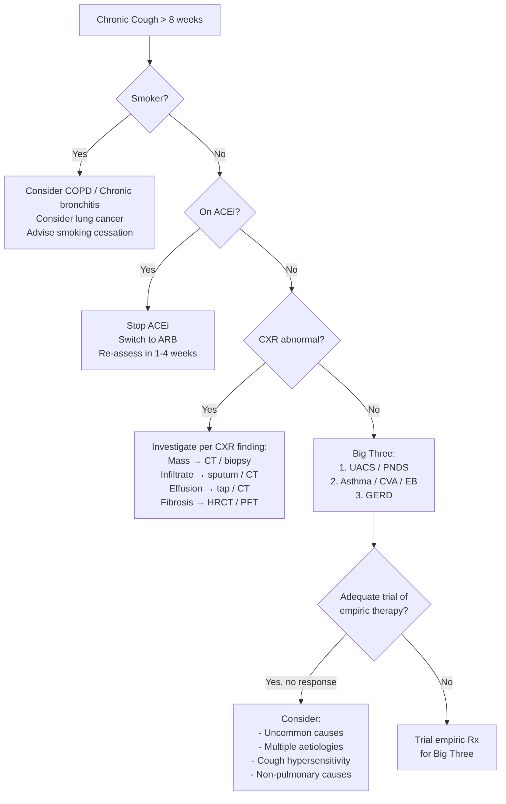

## Differential Diagnosis of Cough

The differential diagnosis of cough is vast — the key to navigating it efficiently is to **always anchor your thinking to duration first, then layer on the clinical context**. Think of cough as a signpost pointing to something deeper. Your job is to figure out what that something is.

---

### Framework for Approaching the Differential

The most practical clinical framework uses **Murtagh's Diagnostic Strategy** adapted for cough [1]:

1. **What is the probability diagnosis?** (the most common cause in this context)
2. **What serious disorders must not be missed?**
3. **What conditions are often missed (pitfalls)?**
4. **What is on the masquerades checklist?** (common conditions masquerading as something else)
5. **Is the patient trying to tell me something?** (psychogenic, secondary gain)

This framework prevents you from jumping to rare diagnoses while ensuring you don't miss dangerous ones.

---

### A. Differential by Duration

#### 1. Acute Cough ( < 3 weeks)

| Category | Differential | Key Distinguishing Features | Why It Causes Cough |
|:---|:---|:---|:---|
| ***Probability diagnosis*** | ***Viral URTI / common cold*** | Rhinorrhoea, sore throat, low-grade fever, self-limiting. Most common cause of acute cough worldwide | Airway epithelial inflammation + post-nasal drip stimulating pharyngeal RARs |
| | ***Acute bronchitis*** | Productive cough ± wheeze, NO CXR infiltrate, usually viral | Lower airway inflammation → mucus hypersecretion + exposed nerve endings |
| | ***Acute exacerbation of asthma*** | Wheeze + dyspnoea + cough; triggers identifiable; reversible on bronchodilator [4] | Bronchospasm + eosinophilic inflammation → airway narrowing + C-fibre stimulation |
| | ***Acute exacerbation of COPD*** | Known COPD + ↑ cough, ↑ sputum volume/purulence, ↑ dyspnoea [5] | Infective trigger → amplified chronic airway inflammation in already damaged airways |
| ***Serious not to miss*** | ***Pneumonia*** | Fever, productive cough (rusty/purulent sputum), dyspnoea, pleuritic pain, CXR consolidation | Alveolar exudate stimulates J-receptors; airway inflammation stimulates C-fibres and RARs |
| | ***Pulmonary embolism*** | Acute dyspnoea, pleuritic chest pain, haemoptysis, tachycardia; risk factors for VTE [9] | Pulmonary infarction → pleural inflammation → C-fibre stimulation; reflex bronchoconstriction |
| | ***Pneumothorax*** | Sudden pleuritic pain + dyspnoea; reduced breath sounds, hyperresonance on affected side | Pleural C-fibre irritation from air in pleural space |
| | ***Acute heart failure*** | Orthopnoea, PND, pink frothy sputum, bilateral basal crepitations, raised JVP, S3 | Pulmonary oedema stimulates juxtacapillary J-receptors and airway C-fibres |
| | ***Foreign body aspiration*** | Sudden onset, unilateral wheeze/stridor; children or elderly | Mechanical stimulation of laryngeal/bronchial RARs by foreign object |
| | ***Acute epiglottitis / croup*** | Stridor, drooling, tripod position (epiglottitis); barking cough (croup) | Upper airway oedema → stimulation of laryngeal cough receptors |
| ***Pitfalls*** | **Pertussis** | Paroxysmal cough with inspiratory whoop; post-tussive vomiting; unvaccinated/waning immunity | Bordetella pertussis toxin → ciliated epithelium destruction + sustained neuronal sensitisation ("100-day cough") |
| | **Inhaled irritant / toxic exposure** | Occupational or accidental; acute onset after exposure | Direct chemical injury to airway epithelium → inflammation → cough |
| | ***Allergic rhinitis with post-nasal drip*** | Sneezing, rhinorrhoea, nasal congestion; may present as acute cough [1] | Allergen → IgE-mediated nasal inflammation → post-nasal secretions stimulate pharyngeal RARs |

#### 2. Subacute Cough (3–8 weeks)

| Category | Differential | Key Distinguishing Features | Why It Causes Cough |
|:---|:---|:---|:---|
| ***Probability diagnosis*** | ***Post-infectious cough*** | Follows recent URTI; no new symptoms; gradually improving | Epithelial regeneration incomplete → bare nerve endings + transient bronchial hyperreactivity |
| ***Serious not to miss*** | ***Pertussis*** | Can persist for weeks to months; paroxysms | Sustained epithelial damage + neuronal sensitisation by pertussis toxin |
| | ***New-onset asthma / CVA*** | Cough ± wheeze, responds to bronchodilators/ICS | Eosinophilic inflammation → bronchial hyperresponsiveness |
| | ***TB (early presentation)*** | Chronic cough just reaching subacute timeframe; HK intermediate-burden area; contact history | Granulomatous airway inflammation → mucosal ulceration |
| ***Pitfalls*** | **Unrecognised GERD** | No heartburn ("silent reflux"); cough worse after meals or lying flat [3] | Oesophago-bronchial vagal reflex + micro-aspiration |
| | **Unrecognised ACEi use** | Newly started ACEi; dry tickly cough beginning weeks after initiation | Bradykinin/substance P accumulation → C-fibre stimulation |

#### 3. Chronic Cough ( > 8 weeks)

This is where the differential becomes most complex and clinically important. The approach should be **systematic and layered**.

| Category | Differential | Key Distinguishing Features | Why It Causes Cough |
|:---|:---|:---|:---|
| ***"Big Three" — account for > 90% with normal CXR, non-smoker, no ACEi*** | | | |
| **1** | ***Upper Airway Cough Syndrome / PNDS*** | Nasal congestion, post-nasal drip, cobblestone pharynx, throat clearing; responds to nasal steroids + antihistamines. ***Most common cause of chronic cough*** [1] | Post-nasal secretions mechanically stimulate pharyngeal/laryngeal RARs + chemical irritation of C-fibres |
| **2** | ***Asthma / Cough-variant asthma / Eosinophilic bronchitis*** | CVA: cough as sole symptom, positive methacholine challenge, responds to ICS + LABA. EB: sputum eosinophilia but NEGATIVE methacholine [4] | Eosinophilic inflammation → epithelial damage → exposed nerve endings + bronchial hyperresponsiveness (CVA) or pure cough reflex sensitisation (EB) |
| **3** | ***GERD*** | May have heartburn/regurgitation; may be "silent" — no GI symptoms. Cough worse post-prandial / supine. ***Asians present atypically — NCCP, acid feeling, extra-oesophageal symptoms*** [3] | Micro-aspiration + oesophago-bronchial vagal reflex + TRPV1 receptor sensitisation. Vicious cycle with cough ↑ intra-abdominal pressure ↑ reflux |
| ***Drug-induced*** | ***ACEi-induced cough*** | Dry, persistent, tickly cough. Onset days to months after starting ACEi. Class effect. 5–35% of users. Resolves 1–4 weeks after stopping | Bradykinin + substance P accumulation (ACE = kininase II normally degrades them) → C-fibre stimulation via TRPV1 |
| ***Smoking-related*** | ***COPD / Chronic bronchitis*** | ***Cough with sputum on most days for ≥ 3 months in 2 consecutive years***. Smoking history. Progressive dyspnoea. Obstructive spirometry [5] | Chronic airway inflammation → goblet cell hyperplasia → mucus hypersecretion + impaired mucociliary clearance |
| ***Infection*** | ***Tuberculosis*** | Chronic cough ± haemoptysis ± night sweats ± weight loss ± fever. Contact history. ***Must exclude in HK — intermediate-burden region*** | Granulomatous inflammation → caseous necrosis → cavitation → airway mucosal ulceration and irritation |
| | **Bronchiectasis** | Copious purulent sputum production; recurrent infections; clubbing possible. CT shows dilated thick-walled bronchi | Permanently dilated airways → mucus retention → chronic infection → productive cough ("vicious cycle") |
| | **Lung abscess** | Foul-smelling purulent sputum, fever, clubbing; air-fluid level on CXR | Necrotic cavity contents drain into airways → stimulate cough |
| | **Chronic sinusitis** | Facial pressure, nasal congestion, purulent nasal discharge → overlaps with UACS | Chronic post-nasal drip → pharyngeal/laryngeal RAR stimulation |
| ***Neoplasm*** | ***Lung cancer*** | New cough or change in chronic cough in smoker > 45y; haemoptysis, weight loss, hoarseness (recurrent laryngeal nerve invasion). ***Non-smoking adenocarcinoma rising in HK women*** | Endobronchial tumour → mechanical RAR stimulation; post-obstructive pneumonia; lymphangitis carcinomatosa → J-receptor stimulation; vagal nerve compression |
| | **Mediastinal tumour / lymphadenopathy** | Constitutional symptoms; CXR mediastinal widening | Compression of trachea/bronchi or vagus nerve → cough |
| ***Interstitial lung disease*** | **Idiopathic pulmonary fibrosis (IPF)** | Progressive dyspnoea, dry cough, bilateral "Velcro" crackles, clubbing; restrictive spirometry, ↓ DLCO | Fibrotic distortion of airway architecture → mechanical stimulation of RARs + J-receptors |
| | **Sarcoidosis** | Young adults, bilateral hilar lymphadenopathy on CXR, non-caseating granulomas; may have erythema nodosum | Airway granulomatous inflammation → RAR + C-fibre stimulation |
| | **Connective tissue disease-associated ILD** | Joint pains, skin rashes, Raynaud's; HRCT ground-glass or UIP pattern | Autoimmune-driven pulmonary fibrosis / alveolitis → same mechanism as IPF |
| ***Cardiac*** | ***Left heart failure*** | Exertional dyspnoea, orthopnoea, PND, bilateral crepitations, elevated JVP, S3 | ↑ Pulmonary venous pressure → interstitial oedema → J-receptor and C-fibre stimulation |
| | ***Mitral stenosis*** | Exertional dyspnoea, haemoptysis; opening snap + mid-diastolic rumble | ↑ LA pressure → pulmonary venous hypertension → bronchial mucosal congestion + haemoptysis from bronchial vein rupture |
| | ***Mitral regurgitation*** | Fatigue initially; dyspnoea late when LV fails; pansystolic murmur at apex to axilla [6] | Chronic MR → LV volume overload → eventual LV failure → pulmonary congestion → cough |
| ***Pleural*** | **Pleural effusion** | Dullness to percussion, reduced breath sounds, stony dull note | Diaphragmatic/phrenic nerve irritation by fluid → reflex cough |
| ***Other respiratory*** | **Obstructive sleep apnoea** | Snoring, daytime somnolence, morning headache; associated GERD | Chronic pharyngeal inflammation → ↑ cough reflex sensitivity; GERD from nocturnal reflux |
| | **Tracheobronchomalacia** | Expiratory wheeze, "barking" cough; may follow prolonged intubation | Dynamic airway collapse during expiration → stimulation of RARs |
| ***Non-pulmonary*** | **Ear pathology (Arnold's reflex)** | Cerumen impaction, foreign body, otitis externa; cough triggered by ear examination | Auricular branch of vagus (Arnold's nerve) stimulation → vagal cough reflex |
| | **Chronic tonsillar / adenoidal enlargement** | Snoring, mouth breathing, recurrent tonsillitis; children predominant | Pharyngeal irritation → mechanical stimulation of pharyngeal cough receptors |

<Callout title="Multiple Aetiologies Are Common!" type="error">
In up to **25–40%** of chronic cough patients, **more than one cause** coexists. For example, a patient may have UACS + GERD + CVA simultaneously. This is why empiric sequential therapy (treating one cause at a time) may fail, and why you should always consider combination aetiologies if single-cause treatment is insufficient.
</Callout>

---

### B. Differential by the Murtagh Diagnostic Strategy Applied to Cough [1]

***Murtagh's framework specifically for cough:***

| Murtagh Category | Differentials for Cough |
|:---|:---|
| ***Probability diagnosis*** | ***Viral URTI / common cold; Acute bronchitis; Post-infectious cough; UACS/PNDS; Asthma/CVA; GERD; Smoking/COPD*** |
| ***Serious disorders not to be missed*** | |
| — ***Vascular*** | ***Pulmonary embolism; Aortic aneurysm (compressing airway/recurrent laryngeal nerve)*** |
| — ***Infection*** | ***Pneumonia; Tuberculosis; Lung abscess; Empyema*** |
| — ***Cancer/tumour*** | ***Lung cancer; Mediastinal tumour/lymphoma; Laryngeal cancer*** |
| — ***Other*** | ***Heart failure; Foreign body aspiration*** |
| ***Pitfalls (often missed)*** | ***ACEi-induced cough; Silent GERD; Eosinophilic bronchitis; Pertussis; Bronchiectasis; Ear pathology (Arnold's reflex); Aspiration from dysphagia (e.g., neurological disease)*** |
| ***Masquerades checklist*** | ***Drugs (ACEi); Depression/anxiety (psychogenic cough); Thyroid (goitre compressing trachea); Anaemia (not a direct cause but contributes to dyspnoea misinterpreted as cough); Diabetes (gastroparesis → GERD)*** |
| ***Is the patient trying to tell me something?*** | ***Psychogenic / habit cough; Somatic cough syndrome / cough hypersensitivity; Factitious disorder*** |

<Callout title="Murtagh's Masquerade — Drugs" type="idea">
***Drugs are on the masquerades checklist for a reason.*** ACEi-induced cough is one of the most commonly overlooked causes of chronic cough. Always take a thorough drug history. Other drugs that can cause cough include: methotrexate (pulmonary toxicity), amiodarone (pulmonary fibrosis), nitrofurantoin (pneumonitis), beta-blockers (bronchospasm in asthmatics). [1]
</Callout>

---

### C. Specific Differentials Requiring Emphasis in Hong Kong

| Condition | Why Emphasised in HK |
|:---|:---|
| ***Tuberculosis*** | HK incidence ~55/100,000. Must be excluded in any chronic cough, especially with haemoptysis, night sweats, weight loss, or TB contact |
| ***Lung cancer (including non-smoking adenocarcinoma)*** | High incidence in HK; non-smoking-related adenocarcinoma is increasingly common in Asian women. Any new or changed cough in age > 40y warrants CXR |
| ***GERD*** | ***Rising incidence in HK (2.5% in 2002 → 3.7% in 2011); Asians present atypically with extra-oesophageal symptoms*** [3] |
| ***Asthma*** | 8.6% prevalence in HK; cough-variant asthma commonly presents to primary care [4] |
| ***COPD*** | ~10% of > 70y in HK; major contributor to public hospital bed-days [5] |
| **Nasopharyngeal carcinoma (NPC)** | Endemic in Southern Chinese. Chronic post-nasal drip, bloody nasal discharge, unilateral serous otitis media, cervical lymphadenopathy. May present with cough from post-nasal drip or direct airway involvement |

---

### D. Differential of Cough by Associated Features — A Quick-Reference Cross-Matching Table

This table helps you pattern-match from the clinical picture to the most likely diagnosis:

| Clinical Pattern | Most Likely Diagnosis |
|:---|:---|
| Acute cough + rhinorrhoea + sore throat + low-grade fever | Viral URTI |
| Acute productive cough + fever + CXR consolidation | Pneumonia |
| Chronic dry cough + nasal congestion + throat clearing + cobblestone pharynx | UACS / PNDS |
| Chronic cough (sole symptom) + normal CXR + positive methacholine | Cough-variant asthma |
| Chronic cough + sputum eosinophilia + negative methacholine + normal spirometry | Eosinophilic bronchitis |
| Chronic cough ± heartburn + worse post-prandial/supine | GERD |
| Chronic dry tickly cough + on ACEi + no other explanation | ACEi-induced cough |
| Chronic productive cough + smoking + progressive dyspnoea + obstructive PFT | COPD / chronic bronchitis |
| Chronic cough + haemoptysis + night sweats + weight loss + HK resident | TB (until proven otherwise) |
| Chronic cough + haemoptysis + weight loss + smoker > 45y + CXR mass | Lung cancer |
| Chronic cough + copious purulent sputum daily + recurrent infections + clubbing | Bronchiectasis |
| Chronic dry cough + progressive dyspnoea + bilateral Velcro crackles + clubbing | IPF / ILD |
| Chronic cough + orthopnoea + PND + bilateral crepitations + raised JVP + S3 | Left heart failure |
| Chronic cough + bovine quality (non-explosive) + hoarseness | Recurrent laryngeal nerve palsy → lung cancer, aortic aneurysm |
| Chronic cough + paroxysmal attacks + inspiratory whoop | Pertussis |
| Chronic cough absent during sleep + barking/honking quality + adolescent | Psychogenic / habit cough |
| Cough triggered by ear examination / cerumen removal | Arnold's reflex (auricular branch of vagus) |
| Chronic cough post-allogeneic HSCT + dry cough + progressive dyspnoea | ***Bronchiolitis obliterans (chronic GvHD)*** [10] |

---

### E. Differential of Haemoptysis (A Cough Sub-Presentation Requiring Specific Consideration)

When cough presents with **haemoptysis**, the differential narrows and the urgency increases:

| Category | Causes |
|:---|:---|
| **Infection** | TB, pneumonia, lung abscess, bronchiectasis, fungal infection (aspergilloma) |
| **Neoplasm** | Lung cancer (primary or metastatic) |
| **Vascular** | PE with pulmonary infarction, AV malformation, Goodpasture's syndrome |
| **Cardiac** | Mitral stenosis (pulmonary venous hypertension → bronchial vein rupture) |
| **Autoimmune** | Granulomatosis with polyangiitis (Wegener's), SLE (diffuse alveolar haemorrhage) |
| **Other** | Anticoagulant use, coagulopathy, iatrogenic (post-bronchoscopy/biopsy) |

> Always get a CXR as the first investigation in haemoptysis. If normal but clinical suspicion remains, proceed to CT chest. If massive haemoptysis, this is a medical emergency — secure the airway (lateral decubitus with bleeding side down) and consult interventional radiology (bronchial artery embolisation) or thoracic surgery.

---

### F. Differential of Cough in Special Populations

#### Children
| Differential | Key Features |
|:---|:---|
| Viral URTI / croup | Most common; barking cough in croup (parainfluenza) |
| Asthma | Recurrent wheeze + cough, atopic history |
| Foreign body aspiration | Sudden onset, unilateral signs; toddlers |
| ***Pertussis*** | Unvaccinated/incomplete vaccination; paroxysmal cough with whoop [1] |
| Cystic fibrosis | Chronic productive cough from infancy, failure to thrive, steatorrhoea |
| Primary ciliary dyskinesia | Chronic wet cough, recurrent otitis media, situs inversus (Kartagener's) |
| Protracted bacterial bronchitis | Wet cough > 4 weeks; responds to prolonged antibiotics |
| Psychogenic cough | School-age children; honking quality; absent during sleep |

#### Immunocompromised Patients
| Differential | Key Features |
|:---|:---|
| Pneumocystis jirovecii pneumonia (PCP) | HIV with CD4 < 200; dry cough, progressive dyspnoea, bilateral ground-glass on CT |
| TB (including extrapulmonary) | ↑ risk; atypical CXR presentations |
| Fungal infections (Aspergillus, Cryptococcus) | Nodules, cavities on imaging |
| CMV pneumonitis | Post-transplant; ground-glass opacities |
| ***Bronchiolitis obliterans*** | ***Post-allogeneic HSCT; dry cough → progressive dyspnoea; part of chronic GvHD*** [10] |

---

<Callout title="High Yield Summary — Differential Diagnosis of Cough">

1. **Use duration as your primary organiser**: Acute ( < 3 wk) → mostly infectious. Subacute (3–8 wk) → post-infectious, pertussis, early asthma. Chronic ( > 8 wk) → Big Three (UACS, asthma/CVA/EB, GERD) + ACEi + COPD + serious causes.

2. **Chronic cough with normal CXR, non-smoker, no ACEi**: > 90% due to UACS, asthma/CVA/EB, or GERD — often in combination.

3. **Always ask about ACEi** — most commonly missed iatrogenic cause.

4. **In HK**: TB and lung cancer must be excluded in every chronic cough. GERD is rising and often presents atypically. NPC is endemic in Southern Chinese.

5. **Red flags triggering urgent investigation**: Haemoptysis, weight loss, new cough in smoker > 45y, hoarseness, recurrent pneumonia.

6. **Bovine cough** = recurrent laryngeal nerve palsy → think lung cancer, aortic aneurysm.

7. **Cough absent during sleep** → psychogenic/habit cough.

8. **Multiple aetiologies coexist** in 25–40% of chronic cough cases.

9. **Post-infectious cough** is the most common cause of subacute cough — self-limiting but may take weeks.

10. **Haemoptysis differential**: TB, lung cancer, bronchiectasis, PE, mitral stenosis — CXR is the first investigation.

</Callout>

---

<ActiveRecallQuiz
  title="Active Recall - Differential Diagnosis of Cough"
  items={[
    {
      question: "A 55-year-old non-smoking Hong Kong woman presents with a 3-month dry cough and no other symptoms. CXR is normal. She is not on any medications. What are the three most likely diagnoses, and what proportion of chronic cough do they collectively account for?",
      markscheme: "1) Upper airway cough syndrome / PNDS, 2) Cough-variant asthma or eosinophilic bronchitis, 3) GERD. Together they account for more than 90% of chronic cough in non-smokers with a normal CXR not on ACEi."
    },
    {
      question: "Using Murtagh's diagnostic strategy, list the serious disorders not to be missed in a patient presenting with chronic cough.",
      markscheme: "Vascular: pulmonary embolism, aortic aneurysm. Infection: pneumonia, tuberculosis, lung abscess, empyema. Cancer: lung cancer, mediastinal tumour/lymphoma, laryngeal cancer. Other: heart failure, foreign body aspiration."
    },
    {
      question: "A patient on lisinopril for 6 weeks develops a persistent dry tickly cough. Explain the pathophysiology and the appropriate management.",
      markscheme: "ACE (kininase II) normally degrades bradykinin and substance P. ACEi inhibits this enzyme leading to accumulation of these pro-tussive mediators in airway mucosa, which stimulate C-fibre cough receptors via TRPV1. Management: stop ACEi, switch to ARB (which blocks angiotensin receptor without affecting bradykinin metabolism). Cough resolves in 1-4 weeks."
    },
    {
      question: "Distinguish cough-variant asthma from eosinophilic bronchitis. Why is this distinction clinically relevant?",
      markscheme: "Both present with chronic cough and sputum eosinophilia. CVA has bronchial hyperresponsiveness (positive methacholine challenge) and may progress to classic asthma. EB has normal methacholine challenge and normal spirometry. Both respond to inhaled corticosteroids. The distinction matters for prognosis (CVA may progress) and for diagnostic workup (negative methacholine does not exclude eosinophilic cause of cough)."
    },
    {
      question: "Why must tuberculosis be considered in every case of chronic cough in Hong Kong? What features in the history and examination would raise your suspicion?",
      markscheme: "HK is an intermediate TB burden area with incidence around 55/100,000. History: chronic cough especially with haemoptysis, night sweats, weight loss, fever, TB contact history. Examination: cachexia, lymphadenopathy, apical crackles/bronchial breathing. Investigation: CXR (upper lobe infiltrate/cavity), sputum AFB smear and culture."
    },
    {
      question: "A chronic cough patient has a non-explosive, flat-sounding (bovine) cough with hoarseness. What is the underlying mechanism, and what diagnoses must you consider?",
      markscheme: "Bovine cough indicates recurrent laryngeal nerve palsy causing vocal cord paralysis. The glottis cannot close properly during the compressive phase of coughing, so adequate pressure cannot build up. Causes: left hilar lung cancer (most important), aortic aneurysm, thyroid surgery, mediastinal lymphadenopathy."
    }
  ]}
/>

---

## References

[1] Lecture slides: murtagh merge.pdf
[3] Senior notes: Ryan Ho GI.pdf (Section 2.2.1 Gastroesophageal Reflux Disease)
[4] Senior notes: Ryan Ho Respiratory.pdf (Section 3.2.1 Asthma)
[5] Senior notes: Ryan Ho Respiratory.pdf (Section 3.2.2 Chronic Obstructive Pulmonary Disease)
[6] Senior notes: Ryan Ho Cardiology.pdf (p155, Mitral Regurgitation)
[9] Senior notes: Ryan Ho Haemtology.pdf (p131, Venous Thromboembolism — Pulmonary Embolism)
[10] Senior notes: Ryan Ho Haemtology.pdf (p158, Chronic GvHD — Bronchiolitis Obliterans)
