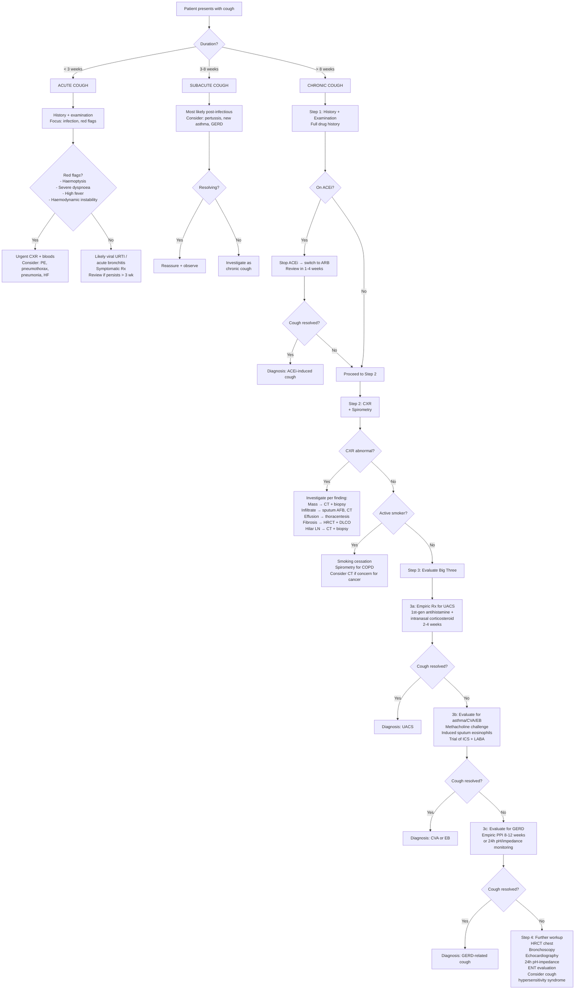

## Diagnostic Criteria, Algorithm and Investigations for Cough

### Why Is There No Single "Diagnostic Criterion" for Cough?

Cough is a **symptom**, not a disease. Unlike heart failure or diabetes, there is no set of diagnostic criteria that "diagnoses" cough itself. Instead, the diagnostic task is twofold:

1. **Classify** the cough (acute/subacute/chronic; productive/non-productive; presence of red flags)
2. **Identify the underlying cause** — this is where diagnostic criteria for specific aetiologies come in

The approach is therefore algorithmic: you progress step-by-step, ruling out serious causes first, then systematically evaluating the most common causes.

---

### Diagnostic Criteria for Key Underlying Conditions Causing Cough

While cough itself has no standalone diagnostic criteria, the **specific aetiologies** do. Here are the diagnostic criteria for the conditions you are most commonly evaluating in a chronic cough workup:

#### 1. Upper Airway Cough Syndrome (UACS) / Post-Nasal Drip Syndrome

There are **no universally validated diagnostic criteria** — diagnosis is clinical + therapeutic:

| Feature | Details |
|:---|:---|
| **Clinical features** | Nasal congestion, rhinorrhoea, post-nasal drip sensation, throat clearing, cobblestone pharynx on examination |
| **Diagnostic confirmation** | ***Response to empiric therapy*** (1st-generation antihistamine + intranasal corticosteroid) within 2–4 weeks confirms the diagnosis retrospectively |
| **Supporting investigation** | Sinus imaging (CT sinuses) if chronic sinusitis suspected — shows mucosal thickening, opacification, air-fluid levels |

> Why is UACS a diagnosis of therapeutic response? Because there is no gold-standard test that definitively proves post-nasal drip causes cough. The drip itself is a normal physiological event — it becomes pathological only when excessive enough to trigger cough. The best evidence of causality is resolution with targeted therapy.

#### 2. Asthma / Cough-Variant Asthma (CVA)

***Cough-variant asthma (CVA)*** is diagnosed when [4]:

| Criterion | Detail |
|:---|:---|
| **Cough** | Chronic cough as the predominant or sole symptom (no wheeze, minimal dyspnoea) |
| **Spirometry** | May be normal or show reversible airflow obstruction (FEV₁ ↑ ≥ 12% AND ≥ 200 mL post-bronchodilator) |
| ***Bronchoprovocation testing*** | ***Positive methacholine challenge (PC₂₀ < 16 mg/mL) — demonstrates bronchial hyperresponsiveness*** |
| **Therapeutic response** | Resolution or significant improvement with inhaled corticosteroids ± bronchodilator |
| **Exclusion** | Other causes of chronic cough excluded |

#### 3. Eosinophilic Bronchitis (EB)

| Criterion | Detail |
|:---|:---|
| **Cough** | Chronic cough, usually dry |
| ***Sputum eosinophilia*** | ***> 3% eosinophils on induced sputum cytology*** |
| ***Normal bronchoprovocation*** | ***Negative methacholine challenge (PC₂₀ ≥ 16 mg/mL) — distinguishes from CVA*** |
| **Normal spirometry** | No airflow obstruction |
| **Therapeutic response** | Responds to inhaled corticosteroids |

<Callout title="CVA vs EB — The Crucial Distinction">
Both have eosinophilic airway inflammation and respond to ICS. The defining difference is **bronchial hyperresponsiveness** — present in CVA (positive methacholine), absent in EB (negative methacholine). This matters because CVA can progress to classic asthma (up to 30% over years), while EB generally does not.
</Callout>

#### 4. GERD-Related Cough

There are **no universally accepted diagnostic criteria** for GERD-related cough — it remains one of the most challenging diagnoses. The Montreal Definition of GERD [3]:

> ***GERD is defined as a condition which develops when the reflux of stomach contents causes troublesome symptoms and/or complications.***

For cough specifically attributed to GERD:

| Approach | Detail |
|:---|:---|
| **Clinical suspicion** | Chronic cough ± heartburn/regurgitation; worse post-prandial or supine; ***may be "silent" — no GI symptoms*** [3] |
| **Empiric PPI trial** | Standard-dose PPI for 8–12 weeks. A positive response supports the diagnosis but is not definitive (30–40% sensitivity for reflux-cough) |
| ***Ambulatory pH monitoring (24h)*** | ***Gold standard for documenting pathological acid reflux. Positive if DeMeester score > 14.7 or symptom association probability (SAP) > 95%*** |
| **Impedance-pH monitoring** | Detects both acid and non-acid reflux; more sensitive than pH alone — captures weakly acidic reflux events that can also cause cough |
| **OGD** | May show oesophagitis (Los Angeles classification), Barrett's; but many GERD-cough patients have normal endoscopy (NERD — non-erosive reflux disease) |

#### 5. COPD / Chronic Bronchitis

***COPD is diagnosed by*** [5]:

| Criterion | Detail |
|:---|:---|
| **Symptoms** | Chronic dyspnoea, cough, sputum production |
| **Risk factor exposure** | Significant exposure to noxious particles/gases (esp. smoking) |
| ***Spirometry (mandatory)*** | ***Post-bronchodilator FEV₁/FVC < 0.70 confirms persistent airflow limitation*** |

***Chronic bronchitis is a clinical definition*** [5]:

> ***Cough with sputum production on most days for ≥ 3 months in 2 consecutive years*** (after exclusion of other causes)

#### 6. Tuberculosis

No single "diagnostic criterion" — diagnosis is composite:

| Component | Detail |
|:---|:---|
| **Clinical** | Chronic cough (often > 2–3 weeks) ± haemoptysis, night sweats, weight loss, fever |
| **CXR** | Upper lobe infiltrate, cavitation, miliary pattern, pleural effusion |
| **Microbiological** | Sputum AFB smear (Ziehl-Neelsen stain) × 3; mycobacterial culture (gold standard, takes 2–8 weeks); GeneXpert MTB/RIF (rapid molecular, detects rifampicin resistance within 2 hours) |
| **Supportive** | Tuberculin skin test (Mantoux) or IGRA (interferon-gamma release assay — QuantiFERON) — indicate exposure/latent infection, cannot distinguish latent from active TB |

#### 7. ACEi-Induced Cough

Diagnosis is **clinical + temporal + by exclusion**:

| Feature | Detail |
|:---|:---|
| **Temporal relationship** | Cough onset days to months after starting ACEi |
| **Character** | Dry, persistent, tickly cough |
| **Exclusion** | Other causes evaluated and excluded |
| ***Diagnostic confirmation*** | ***Resolution of cough within 1–4 weeks of stopping ACEi. If cough persists beyond 4 weeks after cessation, ACEi was NOT the cause*** |

---

### The Master Diagnostic Algorithm for Cough

This is the systematic stepwise approach used in clinical practice, based on current guidelines (ERS 2020, ACCP/CHEST 2024 updates, and local HK practice):

<Callout title="Key Principle of the Algorithm" type="idea">
The algorithm is designed to be **sequential and empiric**: you treat the most common cause first, observe the response, then move to the next most common cause. This is practical because many of these conditions lack a definitive single diagnostic test. **Therapeutic trials are both diagnostic AND therapeutic.** If the cough resolves, you have your diagnosis.
</Callout>

<Callout title="Common Pitfall — Premature Investigation" type="error">
Do not order expensive investigations (HRCT, bronchoscopy, 24h pH monitoring) before completing the basic stepwise evaluation. A thorough history, CXR, spirometry, and empiric trials for the Big Three will identify the cause in > 90% of chronic cough with a normal CXR. Over-investigation is costly, may cause iatrogenic anxiety, and rarely yields a diagnosis that the systematic approach would have missed.
</Callout>

---

### Investigations — Modality by Modality

#### A. Baseline Investigations (For All Patients with Cough Warranting Workup)

##### 1. Chest X-Ray (CXR)

***The single most important initial investigation in cough evaluation.*** [1]

| Aspect | Details |
|:---|:---|
| **Indication** | All patients with chronic cough; acute cough with red flags (haemoptysis, fever, dyspnoea, suspected pneumonia/PE/pneumothorax); subacute cough not resolving |
| **What you're looking for** | Mass/nodule (lung cancer), infiltrate/consolidation (pneumonia, TB), cavity (TB, abscess), effusion, fibrosis, hilar lymphadenopathy, hyperinflation (COPD), cardiomegaly + pulmonary congestion (HF), pneumothorax |
| **Why it matters** | A normal CXR dramatically narrows the differential — eliminates many serious causes and directs you towards the "Big Three." An abnormal CXR redirects you to cause-specific investigation |
| **Interpretation pearls** | |
| — ***Upper lobe infiltrate/cavity*** | ***TB until proven otherwise, especially in HK*** |
| — ***Hilar mass / mediastinal widening*** | ***Lung cancer, lymphoma, sarcoidosis*** |
| — ***Bilateral diffuse reticular/reticulonodular pattern*** | ***ILD (IPF, sarcoidosis, connective tissue disease-ILD)*** |
| — ***Cardiomegaly + upper lobe blood diversion + Kerley B lines*** | ***Left heart failure — pulmonary venous congestion*** |
| — ***Hyperinflation + flat diaphragms*** | ***COPD/emphysema*** |
| — ***Ring shadows / tramlines*** | ***Bronchiectasis (dilated thick-walled airways)*** |

##### 2. Spirometry (Pulmonary Function Tests)

| Aspect | Details |
|:---|:---|
| **Indication** | All patients with chronic cough (especially if dyspnoea or wheeze present); essential to diagnose or exclude asthma and COPD |
| **Key parameters** | FEV₁ (forced expiratory volume in 1 second), FVC (forced vital capacity), FEV₁/FVC ratio |
| **Interpretation** | |
| — ***FEV₁/FVC < 0.70 post-bronchodilator*** | ***Obstructive pattern → COPD*** [5] |
| — FEV₁/FVC < 0.70 with ≥ 12% AND ≥ 200 mL ↑ post-BD | Reversible obstruction → asthma [4] |
| — FEV₁/FVC normal or ↑ with ↓ FVC | Restrictive pattern → ILD, neuromuscular disease |
| — Normal spirometry | Does NOT exclude CVA or EB — proceed to bronchoprovocation |
| **Why spirometry first?** | It is cheap, non-invasive, reproducible, and immediately tells you whether there is an obstructive or restrictive process. This information fundamentally changes the differential |

##### 3. Basic Blood Tests

| Test | What It Tells You | Key Findings |
|:---|:---|:---|
| **CBC with differential** | Infection, eosinophilia, anaemia | ↑ WBC with neutrophilia → bacterial infection; ***eosinophilia → asthma, EB, parasitic infection, eosinophilic granulomatosis with polyangiitis***; anaemia → chronic disease |
| **CRP / ESR** | Systemic inflammation | ↑ in infection, autoimmune, malignancy |
| **Sputum microscopy + culture** | Identify pathogen | Gram stain, culture for bacteria; ZN stain for AFB → TB |
| ***Sputum AFB smear × 3 + culture*** | ***TB diagnosis*** | ***Three early-morning sputum samples; culture is gold standard but takes weeks; GeneXpert MTB/RIF for rapid molecular diagnosis*** |

---

#### B. Second-Line Investigations (Directed by Clinical Suspicion)

##### 4. Bronchoprovocation Testing (Methacholine Challenge)

| Aspect | Details |
|:---|:---|
| **Principle** | Methacholine is a cholinergic agonist that causes bronchoconstriction. In patients with bronchial hyperresponsiveness (asthma/CVA), even low doses trigger significant airway narrowing |
| **Procedure** | Inhaled methacholine in increasing concentrations; FEV₁ measured after each dose. The provocative concentration causing a 20% fall in FEV₁ (PC₂₀) is recorded |
| **Interpretation** | |
| — ***PC₂₀ < 4 mg/mL*** | ***High probability of asthma/CVA*** |
| — PC₂₀ 4–16 mg/mL | Borderline — possible asthma |
| — ***PC₂₀ ≥ 16 mg/mL*** | ***Negative — makes asthma/CVA very unlikely. If sputum eosinophilia present, consider EB*** |
| **Clinical utility** | A negative methacholine challenge has a very high **negative predictive value** for asthma — if negative, you can confidently move on to other diagnoses |
| **Contraindications** | Severe airflow obstruction (FEV₁ < 60% predicted), recent MI/stroke, uncontrolled hypertension, aortic aneurysm |

##### 5. Induced Sputum Cytology

| Aspect | Details |
|:---|:---|
| **Principle** | Hypertonic saline (3–5%) nebulisation induces sputum production, which is then processed for differential cell count |
| **Why it matters** | Identifies airway eosinophilia (EB, asthma) or neutrophilia (infection, COPD) |
| **Key threshold** | ***> 3% eosinophils = eosinophilic airway inflammation*** |
| **Clinical use** | Distinguishes EB from CVA (both eosinophilic, but EB has normal methacholine); guides ICS therapy |

##### 6. Fractional Exhaled Nitric Oxide (FeNO)

| Aspect | Details |
|:---|:---|
| **Principle** | Eosinophilic airway inflammation → ↑ inducible nitric oxide synthase (iNOS) in bronchial epithelium → ↑ NO in exhaled breath. FeNO is a surrogate marker for eosinophilic inflammation |
| **Procedure** | Patient exhales steadily into a device at a controlled flow rate. Result in parts per billion (ppb) |
| **Interpretation** | |
| — FeNO > 50 ppb (adults) | High probability of eosinophilic inflammation — likely asthma/CVA/EB |
| — FeNO 25–50 ppb | Intermediate — interpret in clinical context |
| — FeNO < 25 ppb | Low probability of eosinophilic inflammation |
| **Limitations** | ↑ by allergic rhinitis, viral infection; ↓ by smoking, corticosteroid use. Does not distinguish asthma from EB |

##### 7. Peak Expiratory Flow (PEF) Diary

| Aspect | Details |
|:---|:---|
| **Principle** | Asthma causes variable airflow obstruction that fluctuates over time. PEF monitoring captures this variability |
| **Procedure** | Patient records PEF twice daily (morning and evening) for 2–4 weeks |
| **Interpretation** | ***Diurnal PEF variability > 10% (mean amplitude as % of mean) suggests asthma*** |
| **Limitations** | Effort-dependent; compliance variable; less sensitive than methacholine challenge |

---

#### C. Third-Line Investigations (When Basic Workup Non-Diagnostic)

##### 8. High-Resolution CT (HRCT) of the Chest

| Aspect | Details |
|:---|:---|
| **Indication** | Chronic cough with abnormal CXR requiring further characterisation; suspicion of ILD, bronchiectasis, early lung cancer, or atypical infection when CXR is normal but clinical suspicion persists |
| **What it shows** | |
| — Ground-glass opacities | Active inflammation/early fibrosis (alveolitis, PCP, drug-induced lung disease) |
| — Honeycombing + traction bronchiectasis + basal predominance | UIP pattern → IPF |
| — ***Dilated, thick-walled airways ("signet ring" sign)*** | ***Bronchiectasis — internal airway diameter > accompanying pulmonary artery*** |
| — Tree-in-bud pattern | Small airway disease — infection (TB, NTM), aspiration |
| — Nodule/mass with spiculated margins | Lung cancer — requires biopsy [11] |
| — Bilateral hilar lymphadenopathy | Sarcoidosis, lymphoma |
| **Why HRCT over plain CT?** | Thin-slice (1–2 mm) acquisition with high spatial resolution → much better at detecting subtle parenchymal and airway abnormalities |

##### 9. CT Thorax with Contrast (CTPA)

| Aspect | Details |
|:---|:---|
| **Indication** | Suspected pulmonary embolism; staging of lung malignancy [11] |
| **Key finding in PE** | Filling defect within pulmonary arteries |
| **Key finding in malignancy** | Mass characterisation, lymph node involvement, mediastinal invasion |

##### 10. Bronchoscopy

| Aspect | Details |
|:---|:---|
| **Indication** | Suspected endobronchial lesion (tumour, foreign body); haemoptysis with normal or inconclusive CT; need for bronchoalveolar lavage (BAL) or biopsy |
| **Flexible vs rigid** | Flexible bronchoscopy is standard for diagnostic purposes; rigid bronchoscopy for therapeutic intervention (foreign body removal, massive haemoptysis, stenting) |
| **What it provides** | Direct visualisation of airways (tumour, inflammation, anatomical abnormality); BAL fluid for cytology, microbiology (TB, fungal, PCP), cell counts; endobronchial biopsy; transbronchial biopsy for parenchymal lesions |
| **BAL differential cell count** | |
| — ↑ Eosinophils | Eosinophilic lung disease |
| — ↑ Lymphocytes | Sarcoidosis, hypersensitivity pneumonitis |
| — ↑ Neutrophils | Infection, ARDS |
| — Haemosiderin-laden macrophages | Diffuse alveolar haemorrhage |

##### 11. 24-Hour Ambulatory pH and/or Impedance Monitoring

| Aspect | Details |
|:---|:---|
| **Indication** | Chronic cough suspected GERD-related, especially if empiric PPI fails; objective documentation of reflux-cough association |
| **Principle** | A thin catheter with pH sensor (± impedance electrodes) is placed transnasally into the oesophagus for 24 hours. Patient records cough episodes + meals + position. The system correlates reflux events with cough timing |
| **Key metrics** | |
| — ***DeMeester score > 14.7*** | ***Pathological acid reflux*** |
| — ***Symptom Association Probability (SAP) > 95%*** | ***Statistically significant temporal association between reflux events and cough episodes — supports GERD as cause of cough*** |
| — Symptom Index (SI) > 50% | > 50% of cough episodes preceded by reflux |
| **pH-impedance vs pH alone** | Impedance detects all reflux (acid, weakly acid, non-acid); pH alone only detects acid reflux. Important because **non-acid reflux can also cause cough** — missed by pH-only testing |
| **When to perform** | Ideally **OFF PPI** (to detect baseline acid exposure) for diagnostic purposes. If already on PPI and still symptomatic, test ON PPI to detect non-acid reflux |

<Callout title="Why Does Empiric PPI Often Fail for GERD-Cough?">
Several reasons: (1) Non-acid reflux (bile, pepsin, weakly acidic) can also cause cough — PPI only suppresses acid. (2) The oesophago-bronchial vagal reflex may be triggered by volume reflux regardless of acidity. (3) Central sensitisation of the cough reflex may persist even after the acid stimulus is removed. (4) GERD may not actually be the cause — it was a coincidental finding. This is why objective testing with impedance-pH monitoring is valuable when empiric therapy fails.
</Callout>

##### 12. Upper GI Endoscopy (OGD)

| Aspect | Details |
|:---|:---|
| **Indication** | GERD symptoms (heartburn, regurgitation, dysphagia) or to evaluate for complications (oesophagitis, stricture, Barrett's) [3] |
| **Findings** | Oesophagitis graded by Los Angeles classification (A–D); Barrett's oesophagus (salmon-coloured columnar epithelium); stricture |
| **Limitation for cough** | Many GERD-cough patients have non-erosive reflux disease (NERD) — normal OGD does NOT exclude GERD as the cause of cough |

##### 13. Echocardiography

| Aspect | Details |
|:---|:---|
| **Indication** | Suspected cardiac cause of cough (heart failure, valvular disease) |
| **Key findings** | ↓ LVEF (systolic HF); diastolic dysfunction (HFpEF); valvular lesions (mitral stenosis/regurgitation); elevated estimated pulmonary artery systolic pressure; pericardial effusion |

##### 14. Allergy Testing

| Aspect | Details |
|:---|:---|
| **Indication** | Suspected allergic rhinitis contributing to UACS, or atopic asthma |
| **Modalities** | Skin prick testing (SPT) for common aeroallergens; serum specific IgE (RAST) |
| **Interpretation** | Positive SPT or specific IgE indicates sensitisation — clinical relevance depends on correlation with symptoms |

##### 15. CT Sinuses

| Aspect | Details |
|:---|:---|
| **Indication** | Chronic cough with features of chronic rhinosinusitis not responding to empiric treatment for UACS |
| **Findings** | Mucosal thickening, opacification of sinuses, air-fluid levels, polyps, anatomical variants (deviated septum, concha bullosa) |

##### 16. Laryngoscopy (ENT Evaluation)

| Aspect | Details |
|:---|:---|
| **Indication** | Hoarseness, suspected laryngopharyngeal reflux, vocal cord dysfunction, recurrent laryngeal nerve palsy, upper airway pathology |
| **Findings** | Vocal cord paralysis (lung cancer, aortic aneurysm); posterior laryngeal erythema and oedema (LPR); paradoxical vocal fold motion (vocal cord dysfunction — a mimic of asthma) |

##### 17. GeneXpert MTB/RIF

| Aspect | Details |
|:---|:---|
| **Principle** | Automated molecular test that detects *M. tuberculosis* DNA AND rifampicin resistance mutations by PCR in < 2 hours |
| **Indication** | Suspected pulmonary TB — especially useful in HK for rapid diagnosis |
| **Sensitivity** | ~95% in smear-positive, ~70% in smear-negative TB |
| **Advantage** | Rapid (same-day result); simultaneously identifies rifampicin resistance (surrogate for MDR-TB) |

---

#### D. Summary Table of Investigations Matched to Suspected Aetiology

| Suspected Aetiology | First-Line Investigations | Second/Third-Line Investigations |
|:---|:---|:---|
| **UACS / PNDS** | History + examination; empiric therapy trial | CT sinuses; allergy testing; ENT evaluation |
| **Asthma / CVA** | Spirometry ± reversibility; PEF diary; FeNO | Methacholine challenge; induced sputum; trial of ICS |
| **Eosinophilic bronchitis** | Induced sputum (eosinophils > 3%); FeNO | Methacholine challenge (negative); trial of ICS |
| **GERD** | Empiric PPI trial (8–12 wk) | 24h pH-impedance monitoring; OGD; barium swallow |
| **ACEi-induced** | Stop ACEi → observe 1–4 wk | None needed if cough resolves |
| **COPD** | Spirometry (FEV₁/FVC < 0.70 post-BD); CXR | HRCT if atypical; α1-antitrypsin level if young/non-smoker |
| **TB** | CXR; sputum AFB smear × 3; GeneXpert MTB/RIF | Sputum mycobacterial culture; IGRA/Mantoux; CT chest |
| **Lung cancer** | CXR; CT thorax with contrast | PET-CT; bronchoscopy + biopsy; CT-guided biopsy; staging |
| **Bronchiectasis** | CXR (may be normal); HRCT (diagnostic) | Sputum culture; immunoglobulin levels; CF testing; PCD testing |
| **ILD / IPF** | CXR; spirometry (restrictive); DLCO (↓) | HRCT (UIP pattern); BAL; surgical lung biopsy if needed |
| **Heart failure** | CXR; ECG; BNP/NT-proBNP | Echocardiography |
| **PE** | D-dimer (if low probability); CTPA | Duplex USG of legs; V/Q scan if contrast contraindicated [9] |
| **Psychogenic / Habit** | Diagnosis of exclusion | Observe cough absent during sleep; psychiatric evaluation |

---

#### E. Key Diagnostic Pitfalls and Practical Pearls

<Callout title="Diagnostic Pitfalls to Avoid" type="error">

1. **Not asking about ACEi** — This is the most commonly missed iatrogenic cause of chronic cough. It is embarrassing to order a battery of tests when the answer was in the drug chart all along.

2. **Normal CXR does not exclude lung cancer** — Small peripheral nodules and early endobronchial lesions may be invisible on CXR. If clinical suspicion is high (smoker > 45y, haemoptysis, weight loss), proceed to CT chest.

3. **Normal spirometry does not exclude asthma** — Asthma has variable airflow obstruction. Spirometry may be normal between attacks. Bronchoprovocation testing is required to demonstrate hyperresponsiveness.

4. **Normal OGD does not exclude GERD-cough** — Most GERD-cough patients have non-erosive reflux disease (NERD). pH-impedance monitoring is needed for objective documentation.

5. **Failure to consider multiple co-existing aetiologies** — Up to 40% of chronic cough patients have more than one cause. If treating one cause gives partial improvement, look for a second cause.

6. **Inadequate duration of empiric trials** — UACS requires 2–4 weeks; GERD requires 8–12 weeks of PPI. Stopping too early leads to false-negative therapeutic trials.

7. ***In HK: not ordering sputum AFB in chronic cough*** — TB must always be excluded. Three early-morning sputum samples for AFB smear and culture should be standard in any undiagnosed chronic cough.

</Callout>

---

<Callout title="High Yield Summary — Diagnostic Criteria, Algorithm and Investigations">

1. **Cough has no standalone diagnostic criteria** — the task is to identify the underlying cause through a systematic algorithm.

2. **The algorithm is sequential**: Duration classification → ACEi check → CXR + spirometry → Evaluate Big Three (UACS → Asthma/CVA/EB → GERD) → Further workup if needed.

3. **CVA diagnostic triad**: Chronic cough as sole symptom + positive methacholine challenge + response to ICS/BD. **EB**: Same but negative methacholine + sputum eosinophilia > 3%.

4. **COPD**: Post-bronchodilator FEV₁/FVC < 0.70. **Chronic bronchitis**: Cough with sputum ≥ 3 months in 2 consecutive years.

5. **GERD-cough**: Empiric PPI 8–12 weeks; if fails → 24h pH-impedance monitoring (DeMeester > 14.7 or SAP > 95%).

6. **CXR is mandatory** for all chronic cough and acute cough with red flags. Normal CXR narrows the differential to the Big Three + ACEi + smoking.

7. **Methacholine challenge**: High negative predictive value for asthma. PC₂₀ < 4 mg/mL = asthma likely; ≥ 16 mg/mL = asthma very unlikely.

8. **FeNO > 50 ppb**: Suggests eosinophilic airway inflammation (asthma, CVA, EB).

9. **In HK**: Always send sputum AFB × 3 + GeneXpert in undiagnosed chronic cough. CXR upper lobe cavity = TB until proven otherwise.

10. **Therapeutic trials are diagnostic**: Resolution with specific therapy confirms the cause retrospectively — this is how UACS, CVA, and GERD-cough are often diagnosed.

</Callout>

---

<ActiveRecallQuiz
  title="Active Recall - Diagnostic Criteria, Algorithm and Investigations for Cough"
  items={[
    {
      question: "Describe the stepwise diagnostic algorithm for chronic cough. What are the first three steps before evaluating the Big Three?",
      markscheme: "Step 1: Thorough history and examination including full drug history. Step 2: If on ACEi, stop and switch to ARB, reassess in 1-4 weeks. Step 3: CXR and spirometry. If CXR abnormal, investigate per finding. If CXR normal, non-smoker, not on ACEi, proceed to evaluate Big Three (UACS, then asthma/CVA/EB, then GERD)."
    },
    {
      question: "How do you diagnostically distinguish cough-variant asthma from eosinophilic bronchitis? What investigation is the key differentiator?",
      markscheme: "Key differentiator is the methacholine challenge (bronchoprovocation test). CVA: positive methacholine challenge (PC20 < 16 mg/mL) demonstrating bronchial hyperresponsiveness. EB: negative methacholine challenge (PC20 >= 16 mg/mL) despite sputum eosinophilia > 3%. Both respond to ICS. Both may have normal spirometry."
    },
    {
      question: "What is the gold standard investigation for diagnosing GERD as the cause of chronic cough, and what metrics confirm the diagnosis?",
      markscheme: "24-hour ambulatory pH-impedance monitoring. Key metrics: DeMeester score > 14.7 (pathological acid reflux) and Symptom Association Probability (SAP) > 95% (statistically significant temporal correlation between reflux events and cough episodes). Impedance component detects non-acid reflux which pH alone would miss."
    },
    {
      question: "A patient with chronic cough has normal spirometry and a normal CXR. You suspect asthma but spirometry shows no obstruction. What is the next best investigation and why?",
      markscheme: "Methacholine challenge test. Normal spirometry does not exclude asthma because airflow obstruction in asthma is variable and may be normal between attacks. Methacholine challenge has a very high negative predictive value -- a negative result effectively rules out asthma/CVA. Consider also FeNO and PEF diary as supportive tests."
    },
    {
      question: "Why is it important to perform sputum AFB testing in all cases of undiagnosed chronic cough in Hong Kong?",
      markscheme: "Hong Kong is an intermediate TB burden area with incidence approximately 55/100,000. TB can present with chronic cough as the only symptom initially. Three early-morning sputum samples for AFB smear (ZN stain) plus mycobacterial culture (gold standard) should be sent. GeneXpert MTB/RIF provides rapid molecular diagnosis within 2 hours and simultaneously detects rifampicin resistance."
    }
  ]}
/>

---

## References

[1] Lecture slides: murtagh merge.pdf
[3] Senior notes: Ryan Ho GI.pdf (Section 2.2.1 Gastroesophageal Reflux Disease)
[4] Senior notes: Ryan Ho Respiratory.pdf (Section 3.2.1 Asthma)
[5] Senior notes: Ryan Ho Respiratory.pdf (Section 3.2.2 Chronic Obstructive Pulmonary Disease)
[9] Senior notes: Ryan Ho Haemtology.pdf (p131, Venous Thromboembolism)
[11] Senior notes: Ryan Ho Diagnostic Radiology.pdf (p36, p39–40, CT Applications)
