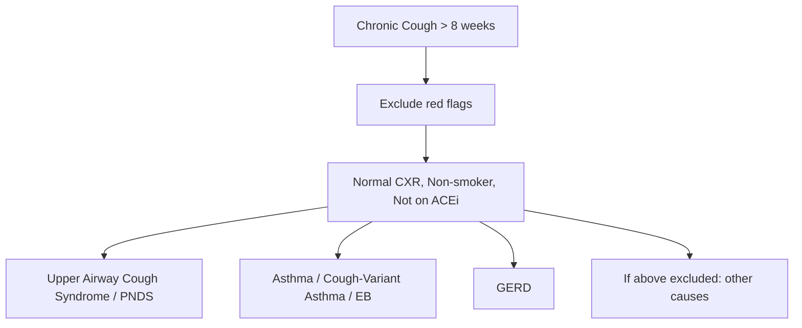

# Cough

## Definition

Let's start from first principles. **Cough** is a vital protective reflex mechanism that clears the airways of secretions, inhaled particles, and noxious substances. It becomes pathological when it is excessive, prolonged, or occurs without a clear protective purpose.

Breaking down the word: "Cough" derives from Old English *cohhian* — it's onomatopoeic, mimicking the sound itself.

**Clinically, cough is defined as a forced expulsive manoeuvre, usually against a closed glottis, which is associated with a characteristic sound.** It can be:
- **Voluntary** (consciously initiated)
- **Reflex** (involuntary, triggered by stimulation of cough receptors)

The cough reflex arc consists of five components:
1. **Cough receptors** (afferent limb) — located in the pharynx, larynx, trachea, major bronchi, and also in the ear canal (Arnold's nerve — auricular branch of vagus), diaphragm, pericardium, and oesophagus
2. **Afferent nerves** — primarily the vagus nerve (CN X), also the glossopharyngeal nerve (CN IX) and trigeminal nerve (CN V)
3. **Cough centre** — located in the medulla oblongata (nucleus tractus solitarius)
4. **Efferent nerves** — vagus, phrenic, and spinal motor nerves
5. **Effector muscles** — diaphragm, intercostal muscles, abdominal muscles, laryngeal muscles

The mechanics of a cough involve three phases:
1. **Inspiratory phase**: Deep inhalation to increase lung volume (provides the air column for expulsion)
2. **Compressive phase**: Glottis closes, expiratory muscles contract → intrathoracic pressure rises dramatically (up to 300 mmHg)
3. **Expulsive phase**: Glottis opens suddenly → high-velocity airflow (up to 500 mph) expels mucus and foreign material

> **Why does cough matter clinically?** Cough is one of the most common reasons for primary care consultation worldwide. It is often a symptom of an underlying condition — identifying the cause is the key clinical task, not merely suppressing the cough.

<Callout title="Classification by Duration — Must Know">

***Cough is classified by duration:*** [1]

- ***Acute cough: < 3 weeks*** — usually infectious (viral URTI most common)
- ***Subacute cough: 3–8 weeks*** — often post-infectious
- ***Chronic cough: > 8 weeks*** — requires systematic investigation

This classification is high-yield because the differential diagnosis, urgency of investigation, and management differ dramatically between these categories.

</Callout>

---

## Epidemiology

### Global Burden
- Cough is the **single most common symptom** for which patients seek medical attention in primary care [1]
- Prevalence of chronic cough in the general population: **~10–12%** globally
- **More common in females** than males (particularly chronic cough — ratio approximately 2:1), likely related to heightened cough reflex sensitivity in women (oestrogen may upregulate sensory nerve function)
- **More common in smokers**: prevalence of chronic cough in current smokers is 20–30% vs. 5–10% in non-smokers

### Hong Kong and Asia-Specific Epidemiology
- ***In Hong Kong, key aetiologies to consider include:*** [2]
  - **Tuberculosis (TB)** — Hong Kong remains an intermediate-burden TB region (~4,000 cases/year, incidence ~55 per 100,000). Any chronic cough in HK must have TB excluded
  - **GERD** — rising incidence in HK (2.5% in 2002 → 3.7% in 2011) and a significant cause of chronic cough [3]
  - **Asthma** — prevalence ~8.6% in HK [4]
  - **COPD** — ~10% of those > 70y in HK [5]
  - **Lung cancer** — HK has a high incidence of lung cancer (both smoking-related and non-smoking-related adenocarcinoma, particularly in women)
  - **Air pollution** — worsening urban air quality contributes to cough

<Callout title="Hong Kong Red Flags" type="error">
In Hong Kong, never forget to consider **tuberculosis** and **lung cancer** in any patient presenting with chronic cough, even if they are non-smokers. Non-smoking-related adenocarcinoma of the lung is increasingly prevalent in Asian women.
</Callout>

---

## Risk Factors

### Host Factors
| Risk Factor | Mechanism |
|:---|:---|
| **Female sex** | Enhanced cough reflex sensitivity (possibly oestrogen-mediated upregulation of TRPV1 receptors on sensory neurones) |
| **Advancing age** | Accumulated exposure to noxious stimuli; immunosenescence → ↑ infection susceptibility; ↑ prevalence of GERD, HF, and malignancy |
| **Atopy / Asthma** | Eosinophilic airway inflammation → bronchial hyperresponsiveness → cough (may be the sole manifestation — "cough-variant asthma") |
| **Obesity** | ↑ Intra-abdominal pressure → GERD → cough; restrictive lung physiology; association with obstructive sleep apnoea |
| **Immunosuppression** | Predisposition to opportunistic infections (TB, PCP, fungal) |

### Environmental/Lifestyle Factors
| Risk Factor | Mechanism |
|:---|:---|
| ***Cigarette smoking*** | Direct irritation of airways; chronic airway inflammation → chronic bronchitis/COPD; impaired mucociliary clearance; ↑ risk of lung cancer [5] |
| **Passive smoking / Environmental tobacco smoke** | Same mechanisms as above at lower intensity |
| **Occupational exposure** | Dusts, fumes, chemicals → occupational asthma, pneumoconiosis |
| **Air pollution** | Particulate matter (PM2.5, PM10) and NO₂ → airway inflammation |
| **Indoor biomass fuel combustion** | Relevant in rural areas → COPD, chronic bronchitis |

### Drug-Related Risk Factors
| Drug | Mechanism |
|:---|:---|
| ***ACE inhibitors (ACEi)*** | **Inhibition of bradykinin and substance P degradation** → accumulation of these pro-tussive mediators in the airway mucosa → stimulation of C-fibre cough receptors. Affects ~5–35% of patients on ACEi. Dry, persistent, tickly cough. **Class effect** — occurs with ALL ACEi. Resolves within 1–4 weeks of stopping. [1] |
| **ARBs** | Very rarely cause cough (< 3%), so are the standard switch from ACEi-induced cough |

<Callout title="ACEi Cough — Classic Exam Trap" type="error">
ACEi-induced cough is one of the most commonly tested causes of chronic cough. The mechanism is NOT related to angiotensin — it is due to **accumulation of bradykinin and substance P** because ACE (= kininase II) normally degrades these mediators. This is why ARBs do not cause cough (they block the angiotensin receptor without affecting bradykinin metabolism).
</Callout>

---

## Anatomy and Physiology of the Cough Reflex

Understanding cough requires understanding where cough receptors live and how the reflex arc works. This is the foundation for understanding every aetiology.

### Cough Receptors
Cough receptors are sensory nerve endings found in:

| Location | Key Point |
|:---|:---|
| **Larynx** | Most sensitive area — even minimal stimulation triggers violent cough (protective against aspiration) |
| **Trachea and carina** | Highly sensitive; carina is the "cough hot spot" — this is why bronchoscopy passing the carina induces intense coughing |
| **Major bronchi** | Decreasing sensitivity as you go distally |
| **Pharynx** | Contributes to cough from post-nasal drip |
| **External auditory canal** | Arnold's nerve (auricular branch of vagus) — stimulation by cerumen, foreign body, or even otoscopy can trigger cough ("Arnold's reflex" or "ear-cough reflex") |
| **Oesophagus** | Vagal afferents — explains cough in GERD even without aspiration (the "oesophago-bronchial reflex") |
| **Pericardium, diaphragm** | Explains cough in pericarditis, subdiaphragmatic irritation |
| **Nose and sinuses** | Trigeminal afferents → sneeze and cough from rhinosinusitis |

### Types of Cough Receptors
Two main types of sensory nerve fibres mediate cough:

1. **Rapidly adapting receptors (RARs)** — myelinated Aδ fibres
   - Respond to mechanical stimulation (inhaled particles, mucus, bronchospasm)
   - Mediate the "irritant" cough
   - Concentrated in larynx and large airways

2. **C-fibre receptors** — unmyelinated
   - Respond to chemical stimulation (capsaicin, bradykinin, prostaglandins, acid)
   - Mediate the "chemical" cough
   - Found throughout airways and oesophagus
   - Express **TRPV1** (transient receptor potential vanilloid 1) and **TRPA1** channels — these are the molecular sensors for capsaicin, acid, and inflammatory mediators
   - This is why **bradykinin accumulation in ACEi cough stimulates C-fibre TRPV1 receptors**

### Mucociliary Clearance — The First Line of Defence
Before cough is needed, the **mucociliary escalator** clears particles:
- **Goblet cells and submucosal glands** produce mucus (sol layer + gel layer)
- **Ciliated columnar epithelium** beats in coordinated waves to move the mucus carpet upwards towards the pharynx
- When this system fails (e.g., smoking destroys cilia; cystic fibrosis produces thick mucus; primary ciliary dyskinesia has dysmotile cilia), cough becomes the backup clearance mechanism

---

## Aetiology

### Organisational Framework

The aetiology of cough is best approached by **duration** and **anatomical compartment** (from nose to alveolus, plus extra-pulmonary causes).

### A. Acute Cough ( < 3 weeks)

| Category | Aetiology | Notes |
|:---|:---|:---|
| ***Infection (most common)*** | ***Viral URTI (common cold)*** | Rhinovirus, coronavirus, influenza, parainfluenza, RSV, adenovirus. Self-limiting. Post-nasal drip + airway inflammation → cough |
| | ***Acute bronchitis*** | Usually viral; productive cough ± wheeze. **No CXR infiltrate** (distinguishes from pneumonia) |
| | ***Pneumonia*** | Bacterial (Streptococcus pneumoniae, H. influenzae, atypicals), viral, fungal. Cough + fever + dyspnoea + CXR consolidation |
| | ***Acute exacerbation of COPD*** | Infection triggers ↑ airway inflammation in already damaged airways → ↑ cough and sputum [5] |
| | ***COVID-19*** | SARS-CoV-2 — dry cough is a cardinal symptom; can progress to pneumonia/ARDS |
| | **Pertussis** (whooping cough) | *Bordetella pertussis*. Paroxysmal cough with inspiratory "whoop". Consider in prolonged cough post-URTI, especially in unvaccinated |
| ***Acute asthma exacerbation*** | Triggered by allergen, infection, exercise, cold air | Cough + wheeze + dyspnoea; reversible airflow obstruction [4] |
| **Allergic rhinitis** | Allergen exposure → nasal congestion + post-nasal drip → cough | Seasonal or perennial |
| **Foreign body aspiration** | Sudden onset cough ± stridor/wheeze, especially in children or elderly | Acute upper or lower airway obstruction |
| **Pulmonary embolism** | Dry cough ± haemoptysis ± pleuritic chest pain ± dyspnoea | Reflex cough from pulmonary infarction/ischaemia stimulating C-fibres |
| **Pneumothorax** | Dry cough + sudden pleuritic pain + dyspnoea | Pleural irritation → cough |
| **Acute heart failure** | Pulmonary oedema → fluid stimulates airway receptors → cough (often worse lying flat) | Pink frothy sputum in severe cases |
| **Toxic inhalation** | Smoke, chlorine, ammonia, tear gas | Direct airway epithelial injury → inflammation → cough |

### B. Subacute Cough (3–8 weeks)

| Aetiology | Mechanism |
|:---|:---|
| ***Post-infectious cough*** (most common) | Following URTI/acute bronchitis. Airway epithelium damaged by infection → exposed sensory nerve endings + transient bronchial hyperreactivity → ↑ cough sensitivity. Self-limiting over weeks. |
| **Post-nasal drip / Upper airway cough syndrome** | Persistent rhinosinusitis → ongoing secretion dripping onto pharyngeal/laryngeal cough receptors |
| ***Pertussis*** | "100-day cough" — may persist into subacute and even chronic timeframes |
| **Undiagnosed new asthma** | May present with isolated cough for several weeks before diagnosis |

### C. Chronic Cough ( > 8 weeks)

This is where the systematic approach truly matters. The "Big Three" causes of chronic cough account for > 90% of cases in non-smokers with a normal CXR who are not on ACEi [1]:

#### The "Big Three" of Chronic Cough

**1. Upper Airway Cough Syndrome (UACS) / Post-Nasal Drip Syndrome (PNDS)**

- ***Most common cause of chronic cough*** [1]
- Mechanism: Secretions from the nose/sinuses drip posteriorly onto the pharynx and larynx → mechanical stimulation of cough receptors (RARs) + chemical irritation (inflammatory mediators stimulate C-fibres)
- Underlying causes:
  - Allergic rhinitis (most common)
  - Non-allergic rhinitis (vasomotor rhinitis)
  - Chronic sinusitis
  - Rhinitis medicamentosa (overuse of topical decongestants)

**2. Asthma and Related Conditions**

- ***Cough-variant asthma (CVA):*** Cough is the SOLE or predominant symptom — no wheeze, no dyspnoea. Airway inflammation and bronchial hyperresponsiveness are still present. Responds to bronchodilators and inhaled corticosteroids. [4]
- ***Eosinophilic bronchitis (EB):*** Sputum eosinophilia ( > 3%) WITHOUT bronchial hyperresponsiveness (i.e., negative methacholine challenge). Responds to inhaled corticosteroids. Distinguished from CVA by normal spirometry AND normal bronchoprovocation testing.
- Classic asthma: cough + wheeze + dyspnoea (but cough may dominate) [4]

**3. Gastro-Oesophageal Reflux Disease (GERD)**

- ***GERD is a significant cause of chronic cough, and may present WITHOUT typical heartburn or regurgitation*** ("silent reflux") [3]
- Mechanisms of GERD-related cough:
  1. **Micro-aspiration**: Small amounts of gastric acid reflux into the larynx/trachea → direct irritation of airway cough receptors → cough
  2. **Oesophago-bronchial reflex** (vagal reflex): Acid in the distal oesophagus stimulates vagal afferents → reflex bronchoconstriction and cough, even without aspiration reaching the airways
  3. **Heightened cough reflex sensitivity**: Chronic acid exposure sensitises airway C-fibre receptors (lowers the cough threshold)
- ***GERD is rising in incidence in HK (2.5% → 3.7%)*** [3]
- ***Asians tend to present atypically — with non-cardiac chest pain, acid feeling, and extra-oesophageal symptoms (chronic cough, hoarseness) rather than classic heartburn*** [3]

#### Other Important Causes of Chronic Cough

| Category | Aetiology | Mechanism / Key Points |
|:---|:---|:---|
| ***Drug-induced*** | ***ACEi*** | Bradykinin/substance P accumulation → C-fibre stimulation. 5–35% of users. Dry cough. Resolves 1–4 weeks after stopping. [1] |
| ***Smoking-related*** | ***Chronic bronchitis (COPD)*** | ***Defined clinically as cough with sputum on most days for ≥ 3 months in 2 consecutive years.*** Chronic airway inflammation → goblet cell hyperplasia → mucus hypersecretion → productive cough. [5] |
| **Infection** | ***Tuberculosis*** | **Must exclude in HK.** Chronic cough ± haemoptysis ± night sweats ± weight loss. Granulomatous inflammation destroying lung parenchyma. AFB smear/culture, CXR. |
| | **Bronchiectasis** | Permanently dilated bronchi → impaired mucociliary clearance → chronic sputum retention → recurrent infections → productive cough ("vicious cycle" hypothesis). |
| | **Lung abscess** | Necrotic lung tissue → foul-smelling purulent sputum + cough |
| **Neoplasm** | ***Lung cancer*** | Cough may be from endobronchial tumour irritating airway receptors, post-obstructive pneumonia, or lymphangitic spread. ***In HK, non-smoking adenocarcinoma in women is rising.*** |
| | **Mediastinal tumour** | Compression of airways or vagus nerve → cough |
| **Interstitial lung disease** | **Idiopathic pulmonary fibrosis (IPF)** | Dry cough — fibrotic distortion of airways stimulates mechanoreceptors; associated restrictive physiology |
| | **Sarcoidosis** | Granulomatous inflammation in airways and parenchyma → cough |
| **Cardiac** | ***Left heart failure*** | ↑ pulmonary venous pressure → pulmonary congestion/interstitial oedema → stimulation of juxtacapillary (J) receptors and airway C-fibres → cough, especially nocturnal/supine |
| **Pleural** | **Pleural effusion** | Cough from diaphragmatic/phrenic nerve irritation or compression of adjacent airways |
| **Other** | **Obstructive sleep apnoea (OSA)** | Chronic pharyngeal inflammation → ↑ cough reflex sensitivity; associated GERD |
| | **Post-nasal drip from chronic sinusitis** | Overlaps with UACS |
| | **Chronic tonsillar/adenoidal enlargement** | Pharyngeal irritation |
| | ***Psychogenic / Habit cough*** | Diagnosis of exclusion; "honking" or "barking" quality; absent during sleep; more common in adolescents |
| | **Ear pathology (Arnold's reflex)** | Cerumen impaction, foreign body, or otitis externa stimulating auricular branch of vagus |
| | ***Somatic cough syndrome / Cough hypersensitivity syndrome*** | Emerging concept: heightened sensitivity of the cough reflex arc at peripheral (receptor) or central (brainstem) level. May explain "unexplained chronic cough" after all causes excluded |

<Callout title="The Cough Hypersensitivity Syndrome" type="idea">
Modern understanding views many cases of "unexplained chronic cough" as a **cough hypersensitivity syndrome** — an upregulation of the cough reflex at peripheral (TRPV1/TRPA1 receptor sensitisation) or central (medullary) level. This is analogous to central sensitisation in chronic pain syndromes. Triggers that would not normally cause cough (talking, laughing, cold air, perfumes) become sufficient. This concept unifies UACS, CVA, and GERD-related cough as conditions that sensitise the reflex, with the cough threshold lowered.
</Callout>

---

## Pathophysiology — Mechanism-by-Mechanism

Let me walk through the pathophysiology of each major category so you understand *why* the cough occurs.

### 1. Infective / Inflammatory Cough
- Pathogen → airway epithelial injury → release of inflammatory mediators (prostaglandins, bradykinin, histamine, substance P)
- These mediators directly stimulate C-fibre receptors (TRPV1, TRPA1)
- Epithelial shedding exposes bare nerve endings → lowered cough threshold (even normal stimuli now trigger cough)
- Mucus hypersecretion (from goblet cell hyperplasia and submucosal gland stimulation) → mechanical stimulation of RARs → productive cough
- **Why does post-infectious cough persist?** Because epithelial regeneration takes weeks → nerve endings remain exposed, and transient bronchial hyperreactivity persists even after the infection has cleared

### 2. Asthma / Eosinophilic Airway Inflammation
- Allergen/trigger → Type 2 (Th2) immune response → IL-4, IL-5, IL-13 → eosinophil recruitment and activation → release of eosinophil granule proteins (major basic protein, eosinophil cationic protein) → epithelial damage
- Mast cell degranulation → histamine, leukotrienes → bronchospasm + mucus secretion + oedema
- All three → airway narrowing → wheezing
- Epithelial damage → exposed nerve endings → ↑ cough reflex sensitivity
- In **cough-variant asthma**, the predominant response is cough rather than bronchospasm — possibly due to the distribution of inflammation (more central vs. peripheral airways) or individual variation in cough reflex sensitivity

### 3. GERD-Related Cough
As detailed above, three pathways:
1. **Micro-aspiration** (acid reaching larynx/trachea)
2. **Oesophago-bronchial vagal reflex** (distal oesophageal acid → vagal-mediated bronchoconstriction)
3. **Cough reflex sensitisation** (chronic acid exposure upregulates TRPV1 receptors on airway C-fibres)

***Why does GERD worsen cough, and cough worsen GERD? A vicious cycle:*** [3]
- Coughing increases intra-abdominal pressure → promotes reflux → more acid exposure → more cough
- This is why GERD and chronic cough frequently coexist and are hard to treat

### 4. ACEi-Induced Cough
- ACE (angiotensin-converting enzyme) = kininase II
- Normally degrades **bradykinin** and **substance P** in the lungs
- ACEi blocks this enzyme → accumulation of bradykinin and substance P in airway mucosa
- Bradykinin stimulates C-fibre receptors (TRPV1) → cough
- Substance P is a neuropeptide that also stimulates C-fibres and promotes neurogenic inflammation
- **Genetic variation** in bradykinin receptor or ACE gene may explain why some patients develop cough and others don't

### 5. Smoking / COPD-Related Cough
- Cigarette smoke contains > 7,000 chemicals including acrolein, formaldehyde, hydrogen cyanide
- Acute: direct chemical irritation of C-fibres → cough
- Chronic: oxidative stress → chronic airway inflammation → goblet cell metaplasia + hyperplasia → mucus hypersecretion → productive "smoker's cough"
- ***Chronic bronchitis component of COPD: sputum-producing cough on most days for ≥ 3 months in 2 consecutive years*** [5]
- Ciliary dysfunction (smoking destroys cilia) → impaired mucociliary clearance → reliance on cough for clearance
- ***COPD is responsible for ~10% of public medical bed days in HK*** [5]

### 6. Tuberculosis-Related Cough
- *Mycobacterium tuberculosis* → granulomatous inflammation → caseous necrosis of lung parenchyma
- Airway involvement: endobronchial TB → ulceration → cough
- Cavitation: necrotic material irritates airways → productive cough ± haemoptysis
- Pleural involvement: pleuritis → cough from pleural C-fibre stimulation

### 7. Lung Cancer-Related Cough
- Central tumours: grow endobronchially → direct mechanical irritation of airway cough receptors
- Post-obstructive pneumonia/atelectasis: tumour obstructs bronchus → distal infection/collapse → cough
- Lymphangitis carcinomatosa: tumour cells in pulmonary lymphatics → interstitial oedema → stimulation of juxtacapillary receptors → dry cough
- Mediastinal lymphadenopathy: compression of vagus nerve or airways → cough
- Pleural involvement: malignant pleural effusion → diaphragmatic irritation → cough

### 8. Left Heart Failure-Related Cough
- ***LV failure → ↑ left atrial pressure → ↑ pulmonary venous pressure → pulmonary congestion and interstitial oedema***
- Fluid in the interstitium stimulates **juxtacapillary (J) receptors** (unmyelinated C-fibres in alveolar walls near capillaries) → reflex cough
- Bronchial mucosal oedema → mechanical stimulation of RARs → cough
- **Why worse at night / lying flat?** Supine position → redistribution of blood to pulmonary vasculature (↑ preload) → ↑ pulmonary congestion → ↑ cough (also explains PND and orthopnoea)
- Severe: frank pulmonary oedema → pink frothy sputum

---

## Classification

### By Duration (Most Clinically Useful)

| Category | Duration | Most Common Causes |
|:---|:---|:---|
| ***Acute*** | ***< 3 weeks*** | Viral URTI, acute bronchitis, pneumonia, acute asthma, PE, pneumothorax, HF |
| ***Subacute*** | ***3–8 weeks*** | Post-infectious, pertussis, undiagnosed asthma |
| ***Chronic*** | ***> 8 weeks*** | UACS/PNDS, asthma/CVA/EB, GERD, ACEi, COPD/smoking, TB, lung cancer, ILD, HF |

### By Character

| Character | Description | Common Associations |
|:---|:---|:---|
| **Dry (non-productive)** | No sputum | Viral URTI, CVA, ACEi, GERD, ILD (IPF), early lung cancer, psychogenic |
| **Productive (wet)** | Sputum present | Pneumonia, chronic bronchitis/COPD, bronchiectasis, TB, lung abscess |
| **Barking / Croupy** | Harsh, seal-like | Croup (laryngotracheobronchitis) in children; subglottic oedema |
| **Whooping** | Paroxysmal with inspiratory whoop | Pertussis |
| **Brassy / Bovine** | Non-explosive, flat quality | Recurrent laryngeal nerve palsy (vocal cord paralysis) — loss of glottic closure means cough cannot generate adequate pressure. Causes: lung cancer (left hilar), aortic aneurysm, thyroid surgery, mediastinal lymphadenopathy |
| **Staccato** | Short, choppy bursts | Chlamydia pneumonia in neonates |

### By Sputum Character

| Sputum | Association |
|:---|:---|
| **Mucoid (clear/white)** | Viral infection, asthma, COPD |
| **Mucopurulent (yellow)** | Bacterial infection, acute exacerbation of COPD |
| **Purulent (green)** | Bacterial pneumonia, bronchiectasis (myeloperoxidase from neutrophils gives green colour) |
| **Rusty** | Pneumococcal pneumonia (blood mixed with purulent sputum) |
| **Blood-streaked / Haemoptysis** | TB, lung cancer, bronchiectasis, PE, mitral stenosis |
| **Pink frothy** | Acute pulmonary oedema (LVF) |
| **Foul-smelling** | Anaerobic lung abscess, aspiration pneumonia |
| **Large volume (cupfuls)** | Bronchiectasis ("postural" — worse in morning and with position change), lung abscess |

---

## Clinical Features

### Symptoms (History-Taking Framework)

When a patient presents with cough, the history should systematically address:

#### A. Characteristics of the Cough
- **Onset**: Acute vs. gradual vs. insidious
  - *Sudden onset → foreign body, PE, pneumothorax*
  - *Gradual onset → infection, asthma, GERD*
  - *Insidious over months → malignancy, ILD, TB*
- **Duration**: Acute / subacute / chronic (as classified above)
- **Character**: Dry vs. productive; barking, whooping, bovine (as above)
- **Diurnal variation**:
  - *Nocturnal / lying flat → asthma, GERD, LVF (all worsen supine)*
    - Why? Asthma: circadian cortisol nadir at night → ↑ inflammation. GERD: supine → loss of gravity → ↑ reflux. LVF: supine → ↑ preload → ↑ pulmonary congestion
  - *Morning (on waking) → COPD/chronic bronchitis (accumulated overnight secretions), bronchiectasis*
  - *Throughout day, absent at sleep → psychogenic cough*
- **Triggers / Aggravating factors**:
  - Exercise/cold air → asthma
  - Meals / lying flat / bending → GERD
  - Dust/allergen exposure → allergic rhinitis/asthma
  - Talking/laughing/perfumes → cough hypersensitivity
  - Positional → bronchiectasis
- **Sputum**: Colour, consistency, volume, presence of blood (see sputum table above)

#### B. Associated Symptoms (Critical for Narrowing the Differential)

| Associated Symptom | Pathophysiological Link | Suggests |
|:---|:---|:---|
| **Nasal congestion, rhinorrhoea, post-nasal drip, facial pressure** | Sinusitis / rhinitis → secretions drip onto pharyngeal cough receptors | UACS / PNDS |
| **Sneezing, itchy eyes/nose** | IgE-mediated nasal inflammation → post-nasal drip | Allergic rhinitis |
| **Wheeze** | Bronchospasm → turbulent airflow through narrowed airways | Asthma, COPD |
| **Dyspnoea** | Airflow limitation (obstructive) or gas exchange impairment | Asthma, COPD, ILD, HF, PE |
| ***Heartburn, regurgitation, acid brash, epigastric discomfort*** | Acid reflux → oesophageal mucosal injury → oesophago-bronchial reflex or micro-aspiration [3] | GERD |
| **Hoarseness** | Laryngeal inflammation from acid reflux (laryngo-pharyngeal reflux) or vocal cord pathology | GERD/LPR, recurrent laryngeal nerve palsy |
| **Throat clearing** | Mucus on pharynx from UACS or LPR | UACS, GERD |
| ***Haemoptysis*** | Airway mucosal erosion, cavitary disease, tumour vasculature | TB, lung cancer, bronchiectasis, PE, mitral stenosis |
| **Fever, rigors, malaise** | Systemic inflammatory response to infection | Pneumonia, TB, lung abscess |
| ***Night sweats, weight loss*** | Chronic systemic inflammation / malignancy | TB, lung cancer, lymphoma |
| **Pleuritic chest pain** | Inflammation of parietal pleura (somatic pain) | Pneumonia, PE, pleurisy |
| **Orthopnoea, PND, peripheral oedema** | LV failure → pulmonary congestion worsened supine; RV failure → venous congestion | Heart failure |
| **Dysphagia** | Oesophageal stricture from chronic GERD or extrinsic compression | GERD complication, mediastinal mass |
| **Joint pains, skin rashes** | Systemic autoimmune disease → associated ILD | Sarcoidosis, connective tissue disease-ILD |

#### C. Red Flag Symptoms ("Alarm Features")

<Callout title="Red Flags in Cough — Do Not Miss" type="error">

The following should prompt urgent investigation:

- ***Haemoptysis*** — must exclude lung cancer, TB, PE
- ***Unexplained weight loss*** — malignancy, TB
- ***New onset in age > 45 years, especially smoker*** — lung cancer
- ***Voice change / hoarseness*** — recurrent laryngeal nerve involvement (lung cancer, aortic aneurysm)
- ***Persistent fever*** — underlying infection or malignancy
- ***Significant dyspnoea or worsening exercise tolerance***
- ***Systemic symptoms*** (night sweats, fatigue)
- ***Chest pain***
- ***Swallowing difficulty***
- ***Recurrent pneumonia*** — endobronchial obstruction (tumour, foreign body)

</Callout>

#### D. Relevant Past Medical and Drug History
- **ACEi use** — must always ask! This is one of the commonest iatrogenic causes of chronic cough
- Smoking history (pack-years)
- Atopy history (eczema, allergic rhinitis, asthma)
- TB contact history (especially important in HK)
- Occupational history (dusts, fumes, asbestos)
- Immunosuppression (HIV status, medications)
- Previous TB treatment
- GERD history
- Cardiac history (heart failure)

### Signs (Physical Examination Findings)

A systematic examination in a patient with cough should cover:

#### General Inspection
| Sign | Pathophysiological Basis | Suggests |
|:---|:---|:---|
| **Cachexia / weight loss** | Chronic catabolic state from malignancy or chronic infection | Lung cancer, TB, advanced COPD |
| **Finger clubbing** | Mechanism debated; likely VEGF/PDGF released by tumour or chronic hypoxia → nail bed vascular proliferation | Lung cancer, bronchiectasis, ILD (IPF), lung abscess, empyema. **NOT seen in COPD or asthma** |
| **Tar staining of fingers** | Nicotine/tar deposition from cigarettes | Smoker → COPD, lung cancer risk |
| **Cyanosis (central)** | Desaturated Hb > 5 g/dL — from V/Q mismatch or shunt | Severe pneumonia, COPD, ILD, massive PE |
| **Peripheral oedema** | ↑ hydrostatic pressure from RHF (back-pressure from LHF or cor pulmonale) OR hypoalbuminaemia | Heart failure, cor pulmonale in COPD |
| **Lymphadenopathy (cervical/supraclavicular)** | Metastatic spread or reactive lymphadenopathy | Lung cancer (esp. left supraclavicular = Virchow's node), TB, lymphoma |
| **Pallor** | Anaemia from chronic disease | Malignancy, chronic infection |

#### Examination of the Upper Airway
| Sign | Basis | Suggests |
|:---|:---|:---|
| **Nasal mucosal oedema, "boggy" turbinates, nasal polyps** | Chronic allergic inflammation | Allergic rhinitis → UACS |
| **Cobblestone pharynx** | Chronic post-nasal drip → pharyngeal lymphoid hyperplasia | UACS / PNDS |
| **Pharyngeal erythema / granularity** | Acid-induced inflammation of posterior pharynx | Laryngo-pharyngeal reflux (GERD) |
| **Tonsillar enlargement / exudate** | Infection or chronic inflammation | Tonsillitis, chronic pharyngitis |

#### Chest Examination
| Sign | Pathophysiological Basis | Suggests |
|:---|:---|:---|
| ***Wheeze (expiratory polyphonic)*** | Turbulent airflow through multiple narrowed small airways | Asthma, COPD |
| **Wheeze (fixed monophonic / localised)** | Single large airway narrowed by tumour or foreign body | Endobronchial lesion — lung cancer, foreign body |
| **Stridor (inspiratory)** | Turbulent airflow through narrowed extrathoracic upper airway | Upper airway obstruction — croup, epiglottitis, tumour, foreign body, anaphylaxis |
| ***Crackles / Crepitations (fine, bilateral basal inspiratory)*** | Opening of collapsed alveoli or fluid in alveoli | Pulmonary fibrosis (ILD): "Velcro" crackles; Pulmonary oedema (HF) |
| **Crackles (coarse, localised)** | Air bubbling through secretions in larger airways | Pneumonia, bronchiectasis |
| **Bronchial breathing** | Consolidation transmits breath sounds with characteristic tubular quality | Lobar pneumonia |
| **Dullness to percussion** | Fluid (effusion) or solid tissue (consolidation, tumour) replacing air | Pleural effusion, pneumonia, lung cancer |
| **Hyperresonance** | Excess air (emphysema) or free air (pneumothorax) | COPD/emphysema, pneumothorax |
| **Reduced breath sounds** | Airway obstruction (COPD) or barrier to sound transmission (effusion, pneumothorax) | COPD, effusion, pneumothorax |
| **Increased AP diameter ("barrel chest")** | Hyperinflation from air trapping | COPD/emphysema |

#### Cardiovascular Examination (Relevant to Cardiac Causes of Cough)
| Sign | Basis | Suggests |
|:---|:---|:---|
| **Elevated JVP** | ↑ right atrial pressure from RHF or biventricular failure | Heart failure |
| **Displaced apex beat** | LV dilatation | LV failure, dilated cardiomyopathy |
| **S3 gallop** | Rapid ventricular filling in a volume-overloaded ventricle | LV failure |
| **Pansystolic murmur at apex → axilla** | Mitral regurgitation → LV volume overload → pulmonary congestion → cough [6] | MR causing LHF |
| **Mid-diastolic rumble at apex** | Mitral stenosis → ↑ LA pressure → pulmonary hypertension → cough ± haemoptysis | Mitral stenosis |
| **Bilateral basal crepitations** | Transudative pulmonary oedema | LHF |

#### Abdominal Examination
| Sign | Basis | Suggests |
|:---|:---|:---|
| **Epigastric tenderness** | Gastric/oesophageal inflammation | GERD |
| **Hepatomegaly / ascites** | Hepatic congestion from RHF (↑ hydrostatic back-pressure in hepatic veins) | Right heart failure complicating chronic lung disease (cor pulmonale) or biventricular failure |

---

## Conditions Where Cough Causes Secondary Problems

Chronic cough itself can cause complications (which may bring patients to seek help):

| Complication | Mechanism |
|:---|:---|
| **Cough syncope (tussive syncope)** | Sustained coughing → markedly ↑ intrathoracic pressure → ↓ venous return → ↓ cardiac output → transient cerebral hypoperfusion → syncope |
| **Rib fractures** | Repetitive mechanical stress on ribs (especially in osteoporotic patients) → pathological or stress fractures |
| **Urinary stress incontinence** | ↑ intra-abdominal pressure from coughing overwhelms pelvic floor muscles → urine leakage (common in women) |
| **Cough headache** | ↑ intrathoracic and intracranial pressure → transient ↑ CSF pressure |
| **Subconjunctival haemorrhage** | ↑ venous pressure during Valsalva → rupture of conjunctival capillaries |
| **Abdominal wall hernia** | Chronic ↑ intra-abdominal pressure → weakening of fascial planes → inguinal/umbilical hernia [7] |
| **Pneumomediastinum / Pneumothorax** | Alveolar rupture from high airway pressure during violent coughing |
| **Quality of life impairment** | Sleep disturbance, social embarrassment, depression, exhaustion |
| ***Worsening GERD*** | ***Cough → ↑ intra-abdominal pressure → ↑ reflux → more cough (vicious cycle)*** [3] |
| ***Worsening haemorrhoids*** | ***Chronic cough → chronic ↑ intra-abdominal pressure → ↑ haemorrhoidal venous pressure*** [8] |

---

## Summary of Key Aetiological Connections to Pathophysiology

| Condition | Why It Causes Cough |
|:---|:---|
| Viral URTI | Airway epithelial inflammation + post-nasal drip → exposed nerve endings + mechanical stimulation |
| Post-infectious | Epithelial regeneration incomplete → persistent nerve ending exposure + transient hyperreactivity |
| Asthma / CVA | Eosinophilic inflammation → epithelial damage → nerve exposure + airway hyperresponsiveness |
| COPD | Chronic inflammation → goblet cell hyperplasia → mucus hypersecretion + impaired mucociliary clearance |
| GERD | Micro-aspiration + vagal reflex + receptor sensitisation |
| UACS / PNDS | Post-nasal secretions mechanically + chemically stimulate pharyngeal/laryngeal receptors |
| ACEi | Bradykinin + substance P accumulation → C-fibre stimulation |
| TB | Granulomatous destruction → cavitation, ulceration → airway irritation |
| Lung cancer | Endobronchial irritation + post-obstructive pneumonia + vagal compression + lymphangitic spread |
| LHF | Pulmonary oedema → J-receptor and C-fibre stimulation |
| ILD / IPF | Fibrotic distortion → mechanoreceptor stimulation; "Velcro" crackles |
| Bronchiectasis | Permanent airway dilatation → mucus pooling → chronic infection → productive cough |

---

<Callout title="High Yield Summary">

1. **Cough classification by duration**: Acute ( < 3 wk), Subacute (3–8 wk), Chronic ( > 8 wk) — this dictates the differential.

2. **Big Three causes of chronic cough** (normal CXR, non-smoker, no ACEi): **UACS/PNDS**, **Asthma/CVA/EB**, **GERD** — account for > 90%.

3. **ACEi cough**: Mechanism = bradykinin/substance P accumulation (NOT angiotensin-related). Class effect. Switch to ARB.

4. **GERD-related cough** may occur WITHOUT heartburn ("silent reflux"). Three mechanisms: micro-aspiration, oesophago-bronchial reflex, cough reflex sensitisation. Rising in HK.

5. **In Hong Kong**: Always exclude **TB** and **lung cancer** in chronic cough. Non-smoking lung adenocarcinoma in Asian women is increasingly common.

6. **Red flags**: Haemoptysis, weight loss, age > 45 + smoker, hoarseness, recurrent pneumonia — require urgent investigation.

7. **Cough-variant asthma**: Cough is SOLE symptom; responds to ICS + bronchodilator. Distinguished from eosinophilic bronchitis (normal methacholine challenge in EB).

8. **Bovine cough** (non-explosive, flat) → recurrent laryngeal nerve palsy → think lung cancer, aortic aneurysm.

9. **Chronic cough can worsen**: GERD (↑ intra-abdominal pressure), hernias, haemorrhoids — a vicious cycle.

10. **Cough hypersensitivity syndrome**: Emerging unifying concept for unexplained chronic cough — upregulated TRPV1/TRPA1 receptors.

</Callout>

---

<ActiveRecallQuiz
  title="Active Recall - Cough: Definition, Epidemiology, Risk Factors, Aetiology, Pathophysiology, Classification, and Clinical Features"
  items={[
    {
      question: "Name the 'Big Three' causes of chronic cough in a non-smoker with a normal CXR who is not on ACEi, and briefly explain the mechanism for each.",
      markscheme: "1) Upper airway cough syndrome (UACS)/post-nasal drip: nasal/sinus secretions stimulate pharyngeal/laryngeal cough receptors. 2) Asthma/cough-variant asthma/eosinophilic bronchitis: eosinophilic airway inflammation causes epithelial damage and bronchial hyperresponsiveness. 3) GERD: micro-aspiration, oesophago-bronchial vagal reflex, and cough reflex sensitisation from chronic acid exposure."
    },
    {
      question: "Explain the mechanism of ACEi-induced cough. Why do ARBs not cause cough?",
      markscheme: "ACE (= kininase II) normally degrades bradykinin and substance P. ACEi inhibits this, causing accumulation of bradykinin and substance P in airway mucosa, which stimulate C-fibre cough receptors (via TRPV1). ARBs block the angiotensin II receptor without affecting bradykinin metabolism, so bradykinin is still degraded normally."
    },
    {
      question: "A 60-year-old Hong Kong man presents with a 3-month history of cough with occasional haemoptysis, night sweats, and weight loss. What are the two most important diagnoses to exclude and why?",
      markscheme: "1) Pulmonary tuberculosis: HK is an intermediate-burden region; chronic cough with haemoptysis, night sweats, and weight loss are classic features. 2) Lung cancer: chronic cough with haemoptysis and constitutional symptoms in a 60-year-old; HK has high incidence including non-smoking adenocarcinoma."
    },
    {
      question: "What is a 'bovine cough' and what does it indicate?",
      markscheme: "A bovine cough is a non-explosive, flat, toneless cough that lacks the normal explosive quality. It indicates recurrent laryngeal nerve palsy (vocal cord paralysis) because the glottis cannot close properly, so intrathoracic pressure cannot build up during the compressive phase. Causes include left hilar lung cancer, aortic aneurysm, thyroid surgery, and mediastinal lymphadenopathy."
    },
    {
      question: "Explain three mechanisms by which GERD causes cough, including the vicious cycle.",
      markscheme: "1) Micro-aspiration: gastric acid refluxes into larynx/trachea and directly irritates airway cough receptors. 2) Oesophago-bronchial vagal reflex: acid in distal oesophagus stimulates vagal afferents causing reflex bronchoconstriction and cough. 3) Cough reflex sensitisation: chronic acid exposure upregulates TRPV1 receptors on C-fibres. Vicious cycle: cough increases intra-abdominal pressure, which promotes more reflux, which causes more cough."
    },
    {
      question: "Differentiate cough-variant asthma from eosinophilic bronchitis in terms of key diagnostic findings.",
      markscheme: "Both cause chronic cough and respond to inhaled corticosteroids. CVA has positive bronchoprovocation testing (e.g., methacholine challenge) demonstrating bronchial hyperresponsiveness, while EB has a negative methacholine challenge. EB has sputum eosinophilia (> 3%) but normal spirometry and no bronchial hyperresponsiveness. CVA may show reversible airflow obstruction on spirometry."
    }
  ]}
/>

---

## References

[1] Lecture slides: murtagh merge.pdf
[2] Clinical context: Hong Kong Centre for Health Protection — TB surveillance data; general HK epidemiology
[3] Senior notes: Ryan Ho GI.pdf (Section 2.2.1 Gastroesophageal Reflux Disease)
[4] Senior notes: Ryan Ho Respiratory.pdf (Section 3.2.1 Asthma)
[5] Senior notes: Ryan Ho Respiratory.pdf (Section 3.2.2 Chronic Obstructive Pulmonary Disease)
[6] Senior notes: Ryan Ho Cardiology.pdf (Section on Mitral Regurgitation, p155)
[7] Senior notes: felixlai.md (Section III: Etiology of Hernia — chronic cough as risk factor)
[8] Senior notes: felixlai.md (Section III: Etiology of Haemorrhoids — chronic cough increases intra-abdominal pressure)
