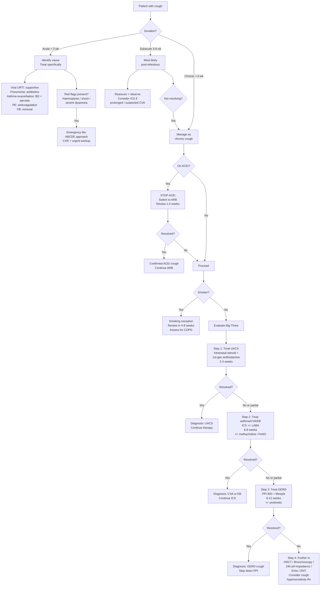

## Management of Cough

### Core Principles of Cough Management

Before diving into specifics, let's establish the fundamental principles — think of these as the "operating system" for managing any patient with cough:

1. **Treat the cause, not the symptom** — Cough is almost always a symptom of an underlying condition. Identifying and treating the cause is the primary goal. Cough suppressants alone are rarely the answer.
2. **Sequential, empiric, and cause-directed** — For chronic cough, management follows the diagnostic algorithm: treat the most likely cause first, assess response, then address the next most likely.
3. **Give adequate trial duration** — Each empiric therapy needs sufficient time to work before declaring failure. Premature switching is the most common management error.
4. **Consider multiple coexisting causes** — Up to 40% of chronic cough patients have more than one aetiology. Partial response to treatment should prompt evaluation for a second cause, not abandonment of the first.
5. **Address the cough itself when necessary** — While treating the underlying cause, symptomatic relief may be needed for severe complications (rib fractures, syncope, incontinence, sleep deprivation, quality of life).

---

### Master Management Algorithm

---

### A. Management of Acute Cough

#### 1. Viral URTI / Common Cold / Acute Bronchitis

| Component | Management | Rationale |
|:---|:---|:---|
| **General** | Rest, hydration, warm fluids | Supportive; there is no specific antiviral for most common cold viruses |
| **Analgesics / Antipyretics** | Paracetamol or ibuprofen | Symptom relief for sore throat, headache, fever |
| **Nasal congestion** | Intranasal decongestant (e.g., xylometazoline) for ≤ 5 days; saline nasal irrigation | Decongestant: α-adrenergic agonist → vasoconstriction of nasal mucosa → reduces oedema and rhinorrhoea. Limit to 5 days to avoid rhinitis medicamentosa (rebound vasodilatation from receptor downregulation) |
| **Cough** | Honey (evidence for symptomatic relief, especially in children > 1 year); simple linctus; dextromethorphan for severe dry cough | Honey has mild demulcent and possibly antimicrobial properties. Dextromethorphan is an NMDA receptor antagonist and sigma-1 agonist that acts centrally to raise the cough threshold |
| ***Antibiotics*** | ***NOT indicated for viral URTI or uncomplicated acute bronchitis*** | No benefit for viral illness; contributes to antimicrobial resistance. Only indicate if bacterial superinfection suspected (persistent high fever, purulent sputum, focal consolidation) |

<Callout title="Antibiotics in Acute Cough" type="error">
One of the most common clinical errors is prescribing antibiotics for acute bronchitis. Studies consistently show **no benefit** for uncomplicated acute bronchitis (which is predominantly viral). Antibiotic stewardship matters — explain to the patient that antibiotics will not help and may cause harm (C. difficile, allergy, resistance).
</Callout>

#### 2. Pneumonia

Management depends on severity (CURB-65 or equivalent) and setting (community vs. hospital):

| CURB-65 Score | Setting | Antibiotic Choice | Notes |
|:---|:---|:---|:---|
| 0–1 | Outpatient | Oral amoxicillin 500 mg TDS × 5 days (1st line); OR oral doxycycline/macrolide if penicillin-allergic | Covers S. pneumoniae (most common CAP pathogen) |
| 2 | Hospital ward | IV amoxicillin/co-amoxiclav + oral/IV macrolide (e.g., clarithromycin) | Macrolide covers atypical organisms (Mycoplasma, Legionella, Chlamydophila) |
| 3–5 | ITU consideration | IV co-amoxiclav (or piperacillin-tazobactam) + IV macrolide; consider anti-pseudomonal cover if risk factors | Severe CAP requires broad-spectrum + atypical cover |

> **Why add a macrolide?** Atypical pathogens (Mycoplasma pneumoniae, Legionella, Chlamydophila) lack a cell wall → β-lactams are ineffective. Macrolides bind the 50S ribosomal subunit → inhibit bacterial protein synthesis. In severe pneumonia, dual cover is standard because you cannot reliably distinguish typical from atypical on presentation.

#### 3. Acute Asthma Exacerbation [4] [12]

***Management of acute severe asthma*** [12]:

| Step | Treatment | Mechanism / Rationale |
|:---|:---|:---|
| **1** | ***High-flow O₂ to keep SpO₂ 94–98%*** | Correct hypoxaemia from V/Q mismatch |
| **2** | ***Nebulised salbutamol 5 mg, repeated as needed*** | β₂-agonist → bronchial smooth muscle relaxation → rapid bronchodilatation. "Salbutamol" = sal (saligenin) + but (butyl) + amol (amino alcohol) |
| **3** | ***IV hydrocortisone 100 mg or PO prednisolone 40–50 mg*** | Systemic corticosteroid → suppresses eosinophilic inflammation → reduces airway oedema and mucus production. Takes 4–6 hours to take effect (genomic mechanism — alters gene transcription) |
| **4 (if unresponsive)** | ***Nebulised ipratropium 0.5 mg*** | Anticholinergic (muscarinic antagonist) → blocks vagal bronchoconstriction → additive bronchodilatation with salbutamol |
| **5 (if unresponsive)** | ***IV MgSO₄ 2 g over 20 min*** | Mg²⁺ blocks calcium channels on bronchial smooth muscle → relaxation. Also inhibits acetylcholine release from motor nerve terminals |
| **Reassess** | ***Every 15 minutes*** | Monitor PEF, SpO₂, clinical status |
| **Consider discharge** | ***If PEF > 75% at 1 hour post-treatment*** | |

#### 4. Acute Exacerbation of COPD [5] [12]

***Management approach*** [5]:

| Component | Treatment | Rationale |
|:---|:---|:---|
| ***O₂*** | ***Controlled O₂: target SpO₂ 88–92%*** | COPD patients may have chronic CO₂ retention → hypoxic drive for ventilation. Excessive O₂ suppresses this drive → worsening hypercapnia and respiratory acidosis. Also, O₂ causes release of CO₂ from haemoglobin (Haldane effect) and reverses hypoxic pulmonary vasoconstriction → ↑ V/Q mismatch |
| **Bronchodilators** | ***SABA ± SAMA (salbutamol ± ipratropium)*** via MDI + spacer or nebuliser | Rapid bronchodilatation |
| **Steroids** | ***Prednisolone 30–40 mg × 5 days*** or ***IV hydrocortisone 100 mg Q6–8H*** | Shorten recovery, ↑ FEV₁, ↓ risk of early relapse and treatment failure [5] |
| ***Antibiotics*** | ***Only if evidence of infection: ↑ purulent sputum + ↑ dyspnoea or ↑ sputum volume*** | Need to cover S. pneumoniae, H. influenzae, M. catarrhalis ± P. aeruginosa. Choice: co-amoxiclav, macrolides, cephalosporins, doxycycline [5] |
| ***NIV (BiPAP)*** | ***If respiratory acidosis: pCO₂ ≥ 6 kPa, pH ≤ 7.35*** | Positive pressure splints airways open → ↓ work of breathing → improves gas exchange → allows respiratory muscle rest |
| **Intubation + IPPV** | If NIV fails, haemodynamic instability, impaired consciousness | Definitive airway control |

<Callout title="O₂ Target in COPD — Why 88–92%?">
This is one of the most tested concepts. In COPD with chronic CO₂ retention, the body adapts by relying on **hypoxic drive** (peripheral chemoreceptors in carotid bodies) rather than CO₂ drive (central chemoreceptors become desensitised to chronically elevated CO₂). Giving too much O₂ suppresses the hypoxic drive → hypoventilation → CO₂ narcosis → respiratory arrest. Additionally, excessive O₂ releases CO₂ from Hb (Haldane effect) and reverses hypoxic pulmonary vasoconstriction → worsening V/Q mismatch. **88–92% is the safe zone** — enough to prevent tissue hypoxia without eliminating the hypoxic drive.
</Callout>

---

### B. Management of Subacute Cough

#### Post-Infectious Cough (Most Common)

| Component | Management | Rationale |
|:---|:---|:---|
| **Reassurance** | Explain the mechanism — damaged epithelium takes weeks to heal; cough will self-resolve | Most patients are worried about a persistent cough; education reduces anxiety and unnecessary antibiotic use |
| **Simple measures** | Honey, warm fluids, simple linctus | Demulcent effect on irritated mucosa |
| **If prolonged (> 4 weeks) or distressing** | Short course of ICS (e.g., beclometasone 200 µg BD × 2–4 weeks) | Suppresses residual airway inflammation and bronchial hyperreactivity |
| **If pertussis suspected** | Macrolide (azithromycin 500 mg day 1, 250 mg days 2–5) | Erythromycin/azithromycin eradicates Bordetella pertussis → reduces transmission. Effect on cough itself is minimal if given after paroxysmal phase, but recommended for public health |

---

### C. Management of Chronic Cough — The Cause-Directed Approach

This is the core of chronic cough management. Each empiric step has specific drugs, durations, and criteria for success.

#### Step 0: Preliminary Measures

| Action | Details | Rationale |
|:---|:---|:---|
| ***If on ACEi → STOP*** | Switch to ARB (e.g., losartan, valsartan). Review in 1–4 weeks | ACEi cough caused by bradykinin/substance P accumulation. ARBs do not affect bradykinin metabolism → no cough. Cough should resolve within 1–4 weeks of cessation |
| ***If active smoker → smoking cessation*** | Counselling + pharmacotherapy [5] | Smoking directly causes chronic airway inflammation → cough. Cessation is the single most effective intervention. ***Cessation associated with improvement in lung function and deceleration in rate of FEV₁ decline*** [5] |

***Smoking cessation pharmacotherapy*** [5]:

| Drug | Mechanism | Efficacy | Key Adverse Effects / Notes |
|:---|:---|:---|:---|
| **Nicotine replacement therapy (NRT)** | Nicotine from patch/gum/inhaler → satisfies nicotinic receptor craving without the thousands of toxic combustion products in cigarettes | Moderate (doubles quit rate vs placebo) | Still delivers nicotine → CVS effects (tachycardia, vasoconstriction). Local irritation (gum → jaw pain; patch → skin irritation) |
| **Bupropion (Zyban)** | "Bu" = butyl + "propion" = propiophenone. Norepinephrine-dopamine reuptake inhibitor + weak nicotinic antagonist → ↓ withdrawal symptoms, ↓ craving | Moderate | ***C/I: seizure disorder, eating disorders, MAOi use***. SE: insomnia, dry mouth, seizure risk (0.1%) |
| ***Varenicline (Champix)*** | ***Nicotinic receptor partial agonist*** → provides partial receptor stimulation (↓ withdrawal symptoms) while blocking full agonist effect of nicotine (↓ reinforcing pleasure of smoking) [5] | ***Highest efficacy among smoking cessation drugs*** | Nausea (most common), vivid dreams, mood changes. Rare: CVS events (debated). C/I: caution in severe renal impairment. ***Efficacy: varenicline > bupropion > NRT*** [5] |

#### Step 1: Empiric Treatment for UACS / Post-Nasal Drip Syndrome

***UACS is the most common cause of chronic cough*** — treat first [1]:

| Drug | Dose | Duration | Mechanism |
|:---|:---|:---|:---|
| ***1st-generation antihistamine (e.g., chlorpheniramine 4 mg TDS or diphenhydramine)*** | As per drug | ***2–4 weeks*** | H₁-receptor antagonist → ↓ histamine-mediated nasal mucosal oedema, rhinorrhoea, and post-nasal drip. 1st-generation preferred over 2nd-generation (cetirizine, loratadine) for cough because the anticholinergic (drying) effect of 1st-gen agents contributes to reducing secretions. "Anti" = against + "histamine" = the mediator |
| ***Intranasal corticosteroid (e.g., fluticasone, mometasone, budesonide)*** | 1–2 sprays per nostril daily | ***2–4 weeks*** (continue long-term if allergic rhinitis confirmed) | Topical steroid → suppresses local nasal mucosal inflammation → ↓ oedema, ↓ secretions, ↓ post-nasal drip. Minimal systemic absorption → few systemic side effects |
| **Intranasal decongestant (oxymetazoline, xylometazoline)** | Short course (≤ 5 days) | Only for initial symptom relief | α-adrenergic agonist → nasal mucosal vasoconstriction → rapid decongestion. **Must limit to ≤ 5 days** to avoid rhinitis medicamentosa |
| **If chronic sinusitis suspected** | Add antibiotics (amoxicillin or co-amoxiclav × 10–14 days) | - | Bacterial sinusitis requires antimicrobial treatment in addition to anti-inflammatory therapy |

| Criterion for Success | |
|:---|:---|
| Resolution or significant improvement of cough within **2–4 weeks** confirms UACS as the cause |

<Callout title="Why 1st-Generation Antihistamines for Cough?">
This often confuses students. The newer 2nd-generation antihistamines (cetirizine, loratadine) are less sedating because they do not cross the blood-brain barrier easily. However, they also lack the **anticholinergic (drying) properties** of 1st-generation agents. In cough from UACS, the anticholinergic effect is therapeutically desired — it reduces nasal secretions and post-nasal drip. That's why guidelines specifically recommend 1st-generation antihistamines for UACS-related cough, despite their sedation side effect.
</Callout>

#### Step 2: Empiric Treatment for Asthma / CVA / Eosinophilic Bronchitis

If Step 1 fails or gives only partial response [4]:

| Drug | Dose | Duration | Mechanism |
|:---|:---|:---|:---|
| ***Inhaled corticosteroid (ICS) (e.g., budesonide 400 µg BD, fluticasone 250 µg BD)*** | Medium-dose ICS | ***6–8 weeks*** | Suppresses eosinophilic airway inflammation → ↓ epithelial damage → ↓ nerve ending exposure → ↓ cough reflex sensitivity. Takes 2–4 weeks for full anti-inflammatory effect |
| ***LABA (e.g., formoterol, salmeterol) — often as ICS/LABA combination*** | Standard dose | Same | Long-acting β₂-agonist → sustained bronchodilatation (12+ hours). Complementary to ICS: LABA has mild anti-inflammatory effect and helps ICS reach small airways via bronchodilatation |
| **Short-acting β₂-agonist (SABA, e.g., salbutamol)** | 200 µg PRN | As needed | Rapid bronchodilatation for acute symptom relief. "Rescue" inhaler |
| **LTRA (e.g., montelukast 10 mg nocte)** | Add-on if ICS alone insufficient | - | Leukotriene receptor antagonist → blocks leukotriene D₄ → ↓ bronchoconstriction, ↓ mucus secretion, ↓ eosinophil recruitment. Useful in exercise-induced and aspirin-sensitive asthma |

| Criterion for Success | |
|:---|:---|
| Resolution or significant improvement within **6–8 weeks** confirms CVA or EB |

***GINA 2023 stepped approach for asthma*** [4]:

**Track 1 (Preferred)**: ICS-formoterol as both controller AND reliever ("SMART" — Single Maintenance And Reliever Therapy)
- Why preferred? Using ICS-formoterol as the reliever means every time the patient uses their "rescue" inhaler, they also get a dose of ICS → reduces risk of exacerbations compared to SABA-only reliever
- Steps: As-needed low-dose ICS-formoterol → Low-dose ICS-formoterol maintenance + PRN → Medium-dose ICS-formoterol → High-dose ICS-formoterol + add LAMA → Refer for biologics

**Track 2 (Alternative)**: SABA reliever + separate ICS controller
- Steps: ICS whenever SABA taken → Low-dose ICS daily → Medium-dose ICS or add LTRA → Medium-dose ICS/LABA → High-dose ICS/LABA + add LAMA → Refer for biologics

<Callout title="Key GINA Change — Death of the SABA-Only Reliever">
***GINA no longer recommends SABA-only treatment (without ICS) for asthma at any step.*** Even in mild intermittent asthma (Step 1), the preferred reliever is ICS-formoterol PRN. The rationale: SABA alone provides symptom relief but does NOT address underlying inflammation → ↑ risk of exacerbations and death. Every puff should include ICS. [4]
</Callout>

#### Step 3: Empiric Treatment for GERD-Related Cough

If Steps 1 and 2 fail or give only partial response [3]:

| Drug | Dose | Duration | Mechanism |
|:---|:---|:---|:---|
| ***PPI (e.g., omeprazole 20 mg BD, esomeprazole 40 mg daily, lansoprazole 30 mg daily)*** | ***Twice daily dosing recommended for cough (more aggressive than standard GERD)*** | ***8–12 weeks (minimum)*** — some patients need 3–6 months | PPI = proton pump inhibitor. Irreversibly inhibits H⁺/K⁺-ATPase (the proton pump) on gastric parietal cells → ↓ gastric acid secretion by ~95%. By reducing acid, you reduce acid reflux → ↓ micro-aspiration and ↓ oesophageal C-fibre stimulation → ↓ cough |
| **H₂ receptor antagonist (e.g., ranitidine, famotidine)** | Standard dose BD | Alternative or add-on | H₂ blocker → competitively blocks histamine H₂ receptors on parietal cells → ↓ acid secretion (less potent than PPI). Useful for nocturnal acid breakthrough on PPI |
| **Prokinetic (e.g., domperidone 10 mg TDS, metoclopramide 10 mg TDS)** | Standard dose, before meals | Adjunct | Dopamine D₂ antagonist in the gut → ↑ gastric motility, ↑ LES tone, ↑ gastric emptying → ↓ reflux. "Prokinetic" = "pro" (forward) + "kinetic" (movement) — promotes forward movement of gut contents |
| **Lifestyle modifications** | Elevate head of bed 15–20 cm; avoid eating 2–3 hours before lying down; weight loss if obese; avoid trigger foods (fat, chocolate, caffeine, alcohol); avoid tight clothing; small frequent meals | Ongoing | ***Obesity → ↑ intra-abdominal pressure → ↑ reflux. Supine position → loss of gravity → ↑ reflux. Fatty food → ↓ LES tone. All modifiable.*** [3] |

| Criterion for Success | |
|:---|:---|
| ***Resolution may take 8–12 weeks or longer (up to 3–6 months).*** Cough may be the LAST GERD symptom to resolve. Premature discontinuation is a very common error. |

<Callout title="Why BID PPI for GERD-Cough?" type="idea">
Standard GERD treatment uses once-daily PPI. For GERD-related cough, **twice-daily dosing** is recommended because: (1) Cough may be driven by even minor residual acid reflux that once-daily PPI does not fully suppress. (2) PPI has a short plasma half-life (~1–2 hours) so a single dose may not provide 24-hour acid suppression. (3) Nocturnal acid breakthrough is common with once-daily dosing and nocturnal reflux is a key trigger for cough.
</Callout>

***PPI side effects (important for long-term use):***

| Side Effect | Mechanism |
|:---|:---|
| **↑ Risk of C. difficile infection** | Gastric acid is a barrier against ingested pathogens; acid suppression removes this barrier |
| **↓ Calcium/magnesium absorption** | Acid facilitates calcium and magnesium absorption; chronic suppression → ↑ risk of osteoporosis and fractures |
| **↓ Iron/B12 absorption** | Acid required for iron reduction (Fe³⁺ → Fe²⁺) and B12 release from food proteins |
| **Acute interstitial nephritis** | Idiosyncratic reaction (rare) |
| **Rebound acid hypersecretion** | Chronic PPI → compensatory ↑ gastrin → parietal cell hyperplasia → acid rebound on PPI discontinuation. Taper gradually rather than abrupt stop |

#### Step 4: If All Empiric Trials Fail — Further Investigation and Management

If adequate trials of UACS, asthma/CVA/EB, and GERD treatment all fail:

| Action | Details |
|:---|:---|
| **Revisit the history** | Were trials of adequate duration? Is compliance an issue? Are there multiple co-existing causes? Were red flags missed? |
| **HRCT chest** | Look for bronchiectasis, ILD, early lung cancer, sarcoidosis |
| **Bronchoscopy** | If endobronchial lesion suspected |
| **24h pH-impedance monitoring** | Objective assessment of reflux-cough association (if empiric PPI failed) |
| **Echocardiography** | If cardiac cause suspected |
| **ENT evaluation + laryngoscopy** | Vocal cord dysfunction, LPR, upper airway pathology |
| **Consider cough hypersensitivity syndrome** | If all causes excluded — see below |

---

### D. Management of Specific Chronic Cough Aetiologies

#### COPD — Stable Disease Management [5]

***Pharmacological treatment of stable COPD follows a stepped approach based on symptoms and exacerbation risk:***

| Step | Treatment | Indication |
|:---|:---|:---|
| **Initial** | ***LABA (e.g., salmeterol, indacaterol) or LAMA (e.g., tiotropium)*** | Dyspnoea or exacerbations |
| **Step up for dyspnoea** | ***LABA + LAMA*** | Persistent dyspnoea on monotherapy |
| **Step up for exacerbations** | ***LABA + LAMA if blood eosinophils < 0.3 × 10⁹/L; LABA + LAMA + ICS if eosinophils ≥ 0.3*** | ↑ Exacerbation frequency despite dual therapy |
| **Add-on** | ***Roflumilast (PDE4 inhibitor) or long-term macrolide (azithromycin)*** | Persistent exacerbations despite triple therapy |

***Non-pharmacological:***
- ***Smoking cessation*** — single most important intervention [5]
- ***Pulmonary rehabilitation*** — multidisciplinary (physiotherapy, exercise training, nutritional support, psychotherapy) [5]
- ***Vaccination*** — influenza annually, pneumococcal, COVID-19 [5]
- ***Long-term O₂ therapy (LTOT)*** — indicated for chronic respiratory failure with resting PaO₂ < 7.3 kPa (55 mmHg) or SaO₂ ≤ 88%; ≥ 15 hours/day [5]
- ***Long-term NIV*** — if severe chronic hypercapnia + history of hospitalisation for acute respiratory failure [5]

#### Tuberculosis

| Phase | Regimen | Duration | Rationale |
|:---|:---|:---|:---|
| ***Intensive phase*** | ***Rifampicin + Isoniazid + Pyrazinamide + Ethambutol (RIPE)*** | ***2 months*** | Four drugs to rapidly kill actively dividing bacilli + sterilise semi-dormant populations + prevent resistance emergence |
| ***Continuation phase*** | ***Rifampicin + Isoniazid*** | ***4 months*** | Two drugs to eliminate remaining semi-dormant bacilli |
| **Total** | | **6 months** | |

> **Why four drugs initially?** TB has a large bacillary load (~10⁸–10⁹ organisms in a cavity). Spontaneous resistance mutations occur at predictable rates (~10⁻⁶ for isoniazid, ~10⁻⁸ for rifampicin). Using a single drug → resistant mutants survive and proliferate. With four drugs, the probability of simultaneous resistance to all four is negligibly small (~10⁻²⁴).

Drug mnemonics: **RIPE** (Rifampicin, Isoniazid, Pyrazinamide, Ethambutol)

| Drug | Mechanism | Key Side Effects |
|:---|:---|:---|
| **Rifampicin** | Inhibits bacterial DNA-dependent RNA polymerase → blocks mRNA synthesis | Hepatotoxicity, orange discolouration of body fluids (warn patient), potent CYP450 inducer (↓ efficacy of OCP, warfarin, HIV protease inhibitors) |
| **Isoniazid (INH)** | Inhibits mycolic acid synthesis (component of mycobacterial cell wall) | Peripheral neuropathy (due to pyridoxine/B6 depletion → co-prescribe pyridoxine), hepatotoxicity |
| **Pyrazinamide** | Disrupts membrane energetics and fatty acid synthesis (active in acidic environment of macrophages) | Hepatotoxicity, hyperuricaemia (↓ renal uric acid excretion → gout) |
| **Ethambutol** | Inhibits arabinosyltransferase → blocks arabinogalactan synthesis (cell wall component) | **Optic neuritis** (dose-related → monitor visual acuity and colour vision) |

#### Bronchiectasis — Long-Term Management [13]

| Component | Treatment | Rationale |
|:---|:---|:---|
| ***Airway clearance*** | ***Postural drainage, active cycle of breathing, oscillating positive expiratory pressure devices*** | Physical removal of retained secretions → breaks the vicious cycle of mucus retention → infection → inflammation [13] |
| **Mucoactive agents** | Hypertonic saline nebulisation; consider carbocisteine | ↑ Mucus hydration → easier expectoration |
| ***Long-term antibiotics*** | ***Macrolide (azithromycin 500 mg 3×/week or 250 mg daily) for ≥ 3 months if ≥ 3 exacerbations/year*** | Immunomodulatory effect → ↓ airway inflammation → ↓ exacerbation frequency. ***Exclude NTM infection before initiation*** (macrolide is a key NTM drug — using it as monotherapy risks NTM resistance) [13] |
| **Inhaled antibiotics** | ***Inhaled colistin or gentamicin — 1st line for Pseudomonas aeruginosa colonisers*** [13] | Direct delivery to airways → high local concentration, minimal systemic absorption |
| **Treat underlying cause** | Immunoglobulin replacement (if antibody deficiency), CF-specific therapies, treat ABPA/NTM | Address the root cause of bronchiectasis if identifiable |

#### Lung Cancer — Cough Palliation [14]

| Treatment | Indication | Mechanism |
|:---|:---|:---|
| **Opioid antitussives (codeine, morphine)** | Distressing cough from endobronchial tumour or advanced disease | Central cough suppression (μ-opioid receptors in medulla → ↑ cough threshold) |
| ***Cough suppressants (see Section E below)*** | Symptomatic relief when cause cannot be treated | |
| ***Bronchoscopic intervention (laser, stenting)*** | ***Endobronchial obstruction causing cough, dyspnoea*** [14] | Relieve mechanical obstruction → ↓ stimulation of cough receptors |
| **Palliative radiotherapy** | Endobronchial tumour, haemoptysis | Tumour shrinkage → ↓ airway irritation |
| ***Pleurodesis*** | ***Malignant pleural effusion causing cough*** [14] | Chemical irritant (talc) instilled into pleural space → inflammatory adhesion between visceral and parietal pleura → obliterates pleural space → prevents effusion re-accumulation |

#### Heart Failure — Treating the Cause [6]

Cough from heart failure resolves when the heart failure is treated:

| Treatment | Mechanism of Cough Relief |
|:---|:---|
| **Diuretics (furosemide, spironolactone)** | ↓ Intravascular volume → ↓ pulmonary venous pressure → ↓ pulmonary congestion → ↓ J-receptor and C-fibre stimulation → ↓ cough |
| **ACEi / ARB / ARNI** | ↓ Afterload + ↓ preload → ↓ LV filling pressure → ↓ pulmonary congestion. ***Note: ACEi itself can cause cough — a clinical dilemma. If ACEi cough in a HF patient, switch to ARB or ARNI (sacubitril/valsartan)*** |
| **β-blocker (bisoprolol, carvedilol, metoprolol)** | ↓ HR → ↑ diastolic filling time → improved cardiac output long-term |
| **SGLT2i (dapagliflozin, empagliflozin)** | Osmotic diuresis + cardioprotective mechanisms → ↓ congestion |

---

### E. Symptomatic Cough Suppression — Antitussive Therapy

When the underlying cause cannot be quickly treated, or the cough itself is causing significant morbidity (syncope, rib fractures, incontinence, sleep deprivation), **antitussive therapy** may be needed:

| Drug | Mechanism | Indication | Key Concerns |
|:---|:---|:---|:---|
| **Codeine** | μ-Opioid receptor agonist in medulla → ↑ cough threshold centrally | Moderate to severe dry cough not responding to other measures | Sedation, constipation, respiratory depression, dependence. **Prodrug** — converted to morphine by CYP2D6 (poor metabolisers get no effect; ultra-rapid metabolisers get toxicity). C/I in children < 12y (FDA black box) |
| **Dextromethorphan** | NMDA receptor antagonist + sigma-1 receptor agonist → central cough suppression | Mild to moderate dry cough; OTC availability | Fewer side effects than codeine; no significant respiratory depression. Abuse potential at high doses ("robo-tripping"). C/I with MAOi (serotonin syndrome risk) |
| **Pholcodine** | Opioid derivative; central cough suppression | Dry cough | Fewer side effects than codeine. **Withdrawn in EU/Australia** (2023) due to risk of anaphylaxis to neuromuscular blocking agents if later exposed during anaesthesia (cross-sensitisation via IgE to quaternary ammonium groups) |
| **Simple linctus / honey** | Demulcent → coats pharyngeal mucosa → ↓ stimulation of pharyngeal RARs | Mild cough, children (honey > 1 year) | No significant side effects. Evidence for honey in children is modest but positive |
| **Gabapentin / pregabalin** | Binds α2δ subunit of voltage-gated calcium channels → ↓ excitatory neurotransmitter release → central cough reflex desensitisation | ***Refractory chronic cough / cough hypersensitivity syndrome*** | Sedation, dizziness, weight gain. Emerging evidence for use in unexplained chronic cough |
| **Low-dose morphine (5–10 mg BD)** | μ-Opioid receptor agonist → central cough suppression | Refractory chronic cough in adults (RCT evidence) | SE: constipation, nausea, sedation. Risk of dependence — use cautiously |

<Callout title="Cough Suppressants — When NOT to Suppress">

**Never suppress a productive cough in conditions where sputum clearance is critical:**
- Bronchiectasis
- COPD with sputum retention
- Pneumonia
- Post-operative patients

Suppressing cough in these conditions → sputum retention → atelectasis → secondary infection → clinical deterioration. Cough is the patient's defence mechanism — do not take it away when it is needed.

Only suppress **dry, non-productive** cough that is causing complications or significant distress.
</Callout>

---

### F. Emerging Therapy: Management of Cough Hypersensitivity Syndrome / Refractory Chronic Cough

When all identifiable causes have been treated and cough persists, the concept of **cough hypersensitivity syndrome** applies — an upregulation of the cough reflex arc:

| Treatment | Evidence | Mechanism |
|:---|:---|:---|
| **Speech and language therapy (SLT)** | RCT evidence supports efficacy | Teaches cough suppression techniques, breathing exercises, laryngeal hygiene, education about cough triggers → desensitises the hypersensitive reflex |
| **Gabapentin (300–1800 mg/day)** | RCT evidence; NNT ~4 for 50% improvement | Central desensitisation of cough reflex (α2δ calcium channel modulation) |
| **Pregabalin (75–300 mg/day)** | Limited RCT evidence | Same mechanism as gabapentin |
| **Low-dose morphine (5–10 mg BD)** | Positive RCTs | Central cough reflex suppression via μ-opioid receptors in NTS |
| ***Gefapixant (P2X3 receptor antagonist)*** | ***FDA-approved 2025 for refractory chronic cough*** | ***P2X3 receptors on vagal afferent C-fibres detect ATP released from damaged airway epithelium → trigger cough. Gefapixant selectively antagonises P2X3 → ↓ afferent cough signalling. "Gefa" = gefitinib-inspired naming; "pixant" = P2X antagonist*** |
| | | ***Main SE: taste disturbance (dysgeusia) — due to P2X2/3 blockade in taste buds. Highly selective P2X3 antagonists (e.g., camlipixant) in trials aim to minimise this*** |

<Callout title="Gefapixant — The First Mechanism-Based Antitussive" type="idea">
Traditional antitussives (codeine, dextromethorphan) suppress cough centrally and non-specifically. Gefapixant is the first drug designed to target the peripheral cough reflex mechanism specifically — it blocks the P2X3 receptor on vagal afferent nerve terminals, preventing ATP-mediated cough signalling. This represents a paradigm shift in cough pharmacology, moving from symptom suppression to mechanism-targeted therapy.
</Callout>

---

### G. Key Contraindications and Drug Interactions — Quick Reference

| Drug | Key Contraindications / Cautions |
|:---|:---|
| **1st-gen antihistamine (chlorpheniramine)** | Sedation → caution in elderly (falls), drivers. Anticholinergic → C/I in urinary retention, narrow-angle glaucoma, BPH |
| **Intranasal decongestant** | Max 5 days (rhinitis medicamentosa). C/I: severe hypertension, MAOi use |
| **ICS** | Local SE: oral candidiasis (rinse mouth after use), dysphonia. High-dose: adrenal suppression, osteoporosis, cataracts |
| **PPI** | Long-term: ↑ C. difficile, ↓ Ca/Mg/Fe/B12, AIN, rebound hypersecretion. Drug interactions: ↓ clopidogrel activation (CYP2C19 — omeprazole worst; use pantoprazole if on clopidogrel) |
| **Codeine** | C/I: children < 12y, post-tonsillectomy, breastfeeding (ultra-rapid CYP2D6 metabolisers → infant toxicity). C/I: respiratory depression, paralytic ileus |
| **Dextromethorphan** | C/I: concurrent MAOi (serotonin syndrome risk) |
| **Rifampicin** | Potent CYP450 inducer → ↓ efficacy of warfarin, OCP, HIV PIs, cyclosporine. Hepatotoxicity |
| **Isoniazid** | Hepatotoxicity; peripheral neuropathy (co-prescribe pyridoxine B6) |
| **Ethambutol** | Optic neuritis — visual acuity and colour vision monitoring mandatory |
| **β₂-agonists (salbutamol, salmeterol)** | Tremor, tachycardia, hypokalaemia (β₂-mediated K⁺ shift into cells). Caution: thyrotoxicosis, cardiac arrhythmia |
| **Varenicline** | Nausea (commonest). Caution: severe renal impairment. Previously flagged for neuropsychiatric events but large RCT (EAGLES) showed no significant increase |
| **Gabapentin/pregabalin** | Sedation, dizziness, weight gain, peripheral oedema. Dose adjustment in renal impairment. Abuse potential (schedule V in some jurisdictions) |

---

<Callout title="High Yield Summary — Management of Cough">

1. **Treat the cause, not just the symptom.** Cough suppressants alone are rarely sufficient and can be harmful if they suppress productive cough.

2. **Acute viral URTI / bronchitis**: Supportive only. ***No antibiotics.***

3. **Acute asthma**: O₂ → nebulised salbutamol → systemic steroid → add ipratropium → IV MgSO₄ if refractory. Reassess every 15 min.

4. **AECOPD**: ***Controlled O₂ 88–92%*** → SABA ± SAMA → prednisolone 5 days → antibiotics only if ↑ purulent sputum → BiPAP if acidotic.

5. **Chronic cough algorithm**: Stop ACEi → Smoking cessation → Treat UACS (intranasal steroid + 1st-gen antihistamine, 2–4 wk) → Treat CVA/EB (ICS ± LABA, 6–8 wk) → Treat GERD (PPI BID, 8–12 wk) → Further workup if all fail.

6. ***GINA 2023***: ICS-formoterol as preferred reliever at all steps. SABA-only treatment is no longer recommended.

7. ***Smoking cessation: Varenicline > Bupropion > NRT in efficacy.***

8. **PPI for GERD-cough**: BID dosing, minimum 8–12 weeks. Cough may be the last symptom to resolve. Do not stop prematurely.

9. **TB**: RIPE × 2 months → RI × 4 months. Co-prescribe pyridoxine with isoniazid. Monitor LFTs and vision.

10. **Cough hypersensitivity / refractory**: Gabapentin, low-dose morphine, SLT. Gefapixant (P2X3 antagonist) is the first mechanism-targeted antitussive.

11. **Never suppress productive cough** in bronchiectasis, COPD, or pneumonia — you need the clearance mechanism.

</Callout>

---

<ActiveRecallQuiz
  title="Active Recall - Management of Cough"
  items={[
    {
      question: "A patient with chronic cough has failed empiric treatment for UACS and has a negative methacholine challenge. Induced sputum shows 5% eosinophils. What is the most likely diagnosis and what is the first-line treatment?",
      markscheme: "Eosinophilic bronchitis (EB). Defined by sputum eosinophilia > 3% with negative methacholine challenge (distinguishes from CVA). First-line treatment: inhaled corticosteroids (e.g., budesonide 400 mcg BD) for 6-8 weeks."
    },
    {
      question: "Outline the management of an acute severe asthma attack. Include the escalation pathway if the patient does not respond.",
      markscheme: "High-flow O2 targeting SpO2 94-98%. Nebulised salbutamol 5mg repeated. IV hydrocortisone 100mg or PO prednisolone 40-50mg. If unresponsive: add nebulised ipratropium 0.5mg and slow IV MgSO4 2g over 20 min. Reassess every 15 min. ABG if SpO2 < 92%. Consider discharge if PEF > 75% at 1h."
    },
    {
      question: "Why is the oxygen saturation target in acute COPD exacerbation 88-92% rather than 94-98%? Explain the physiological basis.",
      markscheme: "COPD patients with chronic CO2 retention have desensitised central chemoreceptors. They rely on hypoxic drive from peripheral chemoreceptors (carotid bodies) for ventilatory stimulus. Excessive O2 suppresses this drive causing hypoventilation and CO2 narcosis. Also, high O2 releases CO2 from Hb (Haldane effect) and reverses hypoxic pulmonary vasoconstriction worsening V/Q mismatch."
    },
    {
      question: "Why do current GINA guidelines recommend ICS-formoterol as the preferred reliever rather than SABA alone at all steps of asthma management?",
      markscheme: "SABA alone provides symptomatic bronchodilation but does not address underlying airway inflammation, leading to increased exacerbation risk and mortality. ICS-formoterol as reliever ensures that every rescue dose also delivers anti-inflammatory corticosteroid. This reduces exacerbation risk and simplifies the regimen (SMART approach: single maintenance and reliever therapy)."
    },
    {
      question: "A patient has chronic cough attributed to GERD but has not responded to once-daily PPI for 4 weeks. What are three possible reasons for failure and what would you do next?",
      markscheme: "Reasons: 1) Inadequate dose or duration -- should use BID PPI for minimum 8-12 weeks. 2) Non-acid reflux (bile, weakly acidic) causing cough -- PPI only suppresses acid. 3) GERD is not the cause or there is a coexisting second aetiology. Next steps: optimise to BID PPI for full 8-12 weeks; add prokinetic and lifestyle measures; if still failing, perform 24h pH-impedance monitoring off PPI to objectively assess reflux-cough association."
    },
    {
      question: "Name three drugs used for smoking cessation, rank them by efficacy, and explain the mechanism of the most effective one.",
      markscheme: "Ranked by efficacy: Varenicline > Bupropion > NRT. Varenicline is a nicotinic acetylcholine receptor partial agonist: it provides partial receptor stimulation (reducing withdrawal symptoms and craving) while simultaneously blocking the full agonist effect of nicotine (reducing the reinforcing pleasure if the patient smokes again)."
    }
  ]}
/>

---

## References

[1] Lecture slides: murtagh merge.pdf
[3] Senior notes: Ryan Ho GI.pdf (Section 2.2.1 Gastroesophageal Reflux Disease)
[4] Senior notes: Ryan Ho Respiratory.pdf (Section 3.2.1 Asthma, GINA 2023)
[5] Senior notes: Ryan Ho Respiratory.pdf (Section 3.2.2 COPD, Management)
[6] Senior notes: Ryan Ho Cardiology.pdf (p155, Mitral Regurgitation; heart failure general)
[12] Senior notes: Ryan Ho Critical Care.pdf (p13, Management of Acute Severe Asthma and AECOPD)
[13] Senior notes: Ryan Ho Respiratory.pdf (p131, Bronchiectasis Long-Term Treatment)
[14] Senior notes: Ryan Ho Respiratory.pdf (p149, Lung Cancer Supportive Treatment)
