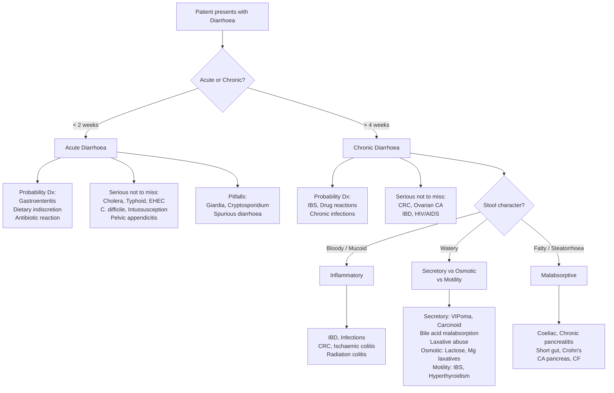

## Differential Diagnosis of Diarrhoea

The differential diagnosis of diarrhoea is one of the broadest in medicine. The key to navigating it efficiently is a **structured framework** that triages by acuity (acute vs. chronic), mechanism (osmotic / secretory / inflammatory / motility / fatty), and clinical context (age, travel, drugs, immunocompromise). Let's build this from first principles.

---

### 1. Organising Framework — Murtagh's Diagnostic Strategy

Murtagh's approach is a powerful clinical reasoning tool: start with the **probability diagnosis** (the common things), then systematically exclude the **serious disorders not to be missed**, check for **pitfalls (often missed)**, run through the **masquerades checklist**, and finally ask — ***"is the patient trying to tell me something?"*** [1]

---

### 2. Probability Diagnoses (Common Things Are Common)

These are what you will see day in, day out on the wards and in clinic.

#### Acute Diarrhoea

| Diagnosis | Why It's Common | Key Differentiating Feature |
|---|---|---|
| ***Gastroenteritis / infective enteritis*** [1] | By far the commonest cause worldwide. Viral (norovirus, rotavirus) > bacterial > parasitic. | Self-limiting (< 7 days), often preceded by N&V, contact/food history, no alarm features. |
| ***Dietary indiscretion*** [1] | Overeating, spicy foods, excessive alcohol, caffeine — these directly stimulate gut motility or secretion. | Temporal relationship to dietary intake; no systemic upset. |
| ***Antibiotic reaction*** [1] | Antibiotics disrupt normal colonic flora → osmotic diarrhoea from unfermented carbohydrates + loss of colonisation resistance. | Onset during or shortly after antibiotic course. Must always consider *C. difficile* as a more serious cause. |

#### Chronic Diarrhoea

| Diagnosis | Why It's Common | Key Differentiating Feature |
|---|---|---|
| ***Irritable bowel syndrome (IBS)*** [1] | Prevalence up to ***25% in East Asia, 3.7% in HK*** [5]. The single most common cause of chronic diarrhoea referred to gastroenterology. | ***IBS rarely causes nocturnal diarrhoea but causes recurrent pain in the right hypochondrium.*** [1] Pain related to defecation. No alarm features, no weight loss. Diagnosis of exclusion (Rome IV). |
| ***Drug reactions (e.g. laxatives)*** [1] | Polypharmacy is rampant. ***Drugs that can cause diarrhoea: alcohol, antibiotics, digoxin, colchicine, cytotoxic agents, H₂-receptor antagonists, iron compounds, laxatives, metformin, sildenafil, statins, thyroxine.*** [1] Also ***acid-suppressing agents (esp Mg-containing antacids), H₂RA, PPI, caffeine, β-blocker, NSAID/5-ASA, misoprostol, theophylline, vitamin and mineral supplements, herbal products*** [2][5] | Temporal relationship to drug initiation. Resolves on withdrawal (or dose reduction). |
| ***Chronic infections*** [1] | Particularly important in Hong Kong: parasites (*Giardia*, *Entamoeba*), *C. difficile*, TB. In immunocompromised: CMV, Cryptosporidium, MAC. | Persistent/relapsing course; travel history; antibiotic exposure for CDI; immunosuppression for opportunistic infections. |

<Callout title="IBS vs. Organic Disease — The Night-Time Rule" type="idea">
***IBS rarely causes nocturnal diarrhoea.*** [1] If a patient is woken from sleep by diarrhoea, think organic: IBD, microscopic colitis, secretory tumours, diabetic autonomic neuropathy. This single question — "Does the diarrhoea wake you at night?" — has tremendous discriminating power.
</Callout>

---

### 3. Serious Disorders Not to Be Missed

These are the diagnoses that will harm or kill the patient if you miss them. You must actively exclude these in every case.

#### ***Neoplasia / Cancer*** [1]

| Diagnosis | Why You Must Not Miss It | Key Differentiating Features |
|---|---|---|
| ***Colorectal cancer (CRC)*** [1] | HK has one of the highest CRC rates globally. Curable if caught early; lethal if missed. | ***Alternating diarrhoea and constipation, passage of mucus, tenesmus, pencil-thin stools*** [2]. Age > 50, male, FHx, Hx of IBD/polyps. Iron-deficiency anaemia (R-sided), fresh blood PR (L-sided). ***CRC can only be excluded with colonoscopy.*** [3] |
| ***Ovarian cancer*** [1] | Peritoneal carcinomatosis can cause diarrhoea through serosal inflammation of bowel loops, obstruction, or malabsorption. | Vague abdominal bloating, early satiety, pelvic pain. Insidious onset in postmenopausal women. CA-125, CT, pelvic exam. |
| ***Peritoneal cancer*** [1] | Primary peritoneal carcinoma or peritoneal carcinomatosis from any GI/gynae primary. | Ascites, abdominal distension, weight loss, altered bowel habit. |

#### ***Infections — Severe / Specific*** [1]

| Diagnosis | Why Serious | Key Features |
|---|---|---|
| ***Cholera*** [1] | Massive secretory diarrhoea → fatal dehydration within hours if untreated. | Rice-water stools, profound dehydration, endemic/epidemic setting. |
| ***Typhoid / paratyphoid*** [1] | Bacteraemia → systemic sepsis, intestinal perforation, haemorrhage. | Stepladder fever, relative bradycardia, rose spots, hepatosplenomegaly. Diarrhoea is actually a later feature; early disease may have constipation. |
| ***Amoebiasis*** [1] | *Entamoeba histolytica* → amoebic dysentery, liver abscess. | Bloody "anchovy sauce" stools, RUQ pain (liver abscess), travel to endemic areas. |
| ***Enterohaemorrhagic E. coli (EHEC)*** [1] | O157:H7 → HUS (haemolytic uraemic syndrome), especially in children. | Bloody diarrhoea WITHOUT fever (toxin-mediated, not invasive), ↑LDH, ↓platelets, fragmented RBCs, AKI. ***Do NOT give antibiotics*** — may increase toxin release and HUS risk. |
| ***Malaria*** [1] | Can present with diarrhoea especially in children; severe *P. falciparum* has high mortality. | Travel to endemic area, cyclical fevers/rigors, splenomegaly, pancytopenia. |
| ***HIV infection (AIDS)*** [1] | Chronic diarrhoea is extremely common in advanced HIV — multiple aetiologies including opportunistic infections, HIV enteropathy, medication side effects. | Risk factors for HIV, weight loss, oral candida, generalised lymphadenopathy, CD4 count guides differential. |

#### ***Inflammatory Bowel Disease*** [1]

| | Crohn's Disease | Ulcerative Colitis |
|---|---|---|
| **Inflammation** | ***Focal patchy, transmural*** [3] | ***Diffuse continuous, mucosal and submucosal*** [3] |
| **Distribution** | Mouth to anus; skip lesions | Starts at rectum, extends proximally; no skipping |
| **Key histology** | ***Granuloma (MUST exclude TB)*** [3] | ***Crypt abscesses, goblet cell depletion, pseudopolyps*** [3] |
| **Key DDx challenge** | vs. intestinal TB (both granulomatous, both ileocaecal) | vs. infectious colitis, radiation colitis, ischaemic colitis |
| **Unique complications** | ***Fistulae, abscesses, strictures*** [3] | ***Toxic megacolon*** (colon ≥ 6 cm + systemic toxicity) [3] |

> Both IBD conditions must be differentiated from: ***infectious colitis*** (*E. coli*, *Salmonella*, *Shigella*, *Campylobacter*, *Yersinia*, amebiasis — excluded with stool studies), ***C. difficile*** (particularly in patients treated with antibiotics), and ***irritable bowel syndrome*** (chronic abdominal pain and altered bowel habits in the absence of organic cause). [3]

#### ***Pseudomembranous Colitis (C. difficile)*** [1]

***Commonly associated with C. difficile; patients usually have a history of antibiotic use.*** [3] Can progress to ***toxic megacolon*** — defined as ***total or segmental non-obstructive dilatation of colon ≥ 6 cm or caecum > 9 cm with systemic toxicity*** [3]. This is a surgical emergency.

#### ***Intussusception*** [1]

***Most common cause of intestinal obstruction in infants between 6–36 months of age.*** [7] In adults, intussusception is uncommon and usually driven by a ***pathological lead point*** (polyp, lymphoma, Meckel's diverticulum). [7] Presents with colicky pain, "redcurrant jelly" stools (bloody mucus), and a sausage-shaped mass.

#### ***Pelvic Appendicitis / Pelvic Abscess*** [1]

A pelvic appendix (21% of cases [4]) can irritate the rectum/sigmoid → diarrhoea rather than the "classic" RIF pain. This is a classic pitfall — the diarrhoea misleads you away from the surgical diagnosis. Think of it when a patient has diarrhoea + low-grade fever + pelvic/suprapubic discomfort + DRE tenderness.

---

### 4. Pitfalls (Often Missed) — The Diagnoses You Forget

These are the ones that get missed on rounds. Examiners love them.

| Diagnosis | Why It's Missed | Key Clue |
|---|---|---|
| ***Coeliac disease*** [1] | Up to 50% asymptomatic; many present with mild IBS-like symptoms rather than classic steatorrhoea. Rare in Asians but increasingly recognised. | IgA anti-tTG antibody. Steatorrhoea, dermatitis herpetiformis, iron/B12/folate deficiency, osteoporosis. |
| ***Faecal impaction with spurious diarrhoea*** [1] | ***Remember spurious diarrhoea and the rectal examination in the elderly.*** [1] Carers/nurses report "diarrhoea" — it's actually overflow liquid stool around an impacted mass. | Elderly, immobile, on opioids/anticholinergics. DRE reveals loaded rectum. |
| ***Lactase deficiency*** [1] | Prevalence up to ***90% in adult Asians*** [5] — so common it's often not considered as a "diagnosis." | Symptoms after dairy intake (bloating, cramps, watery diarrhoea). Hydrogen breath test or empirical lactose-free trial. [3] |
| ***Giardia lamblia infection*** [1] | ***Giardiasis (profuse bubbly diarrhoea) is more common than realised.*** [1] Stool O&P has poor sensitivity (single sample ~50%); need 3 samples or stool antigen test. | Profuse bubbly/frothy diarrhoea, bloating, foul-smelling stool. Travel history or contaminated water. |
| ***Cryptosporidium infection*** [1] | Especially in immunocompromised (HIV CD4 < 100). Modified acid-fast stain on stool or PCR needed. | Profuse watery diarrhoea, often chronic in immunocompromised. |
| ***Malabsorption states*** [1] | Chronic pancreatitis, short gut, Crohn's → steatorrhoea may be subtle. Patients may present with nutritional deficiency (anaemia, osteoporosis) rather than frank diarrhoea. | Weight loss, nutritional deficiencies out of proportion to apparent disease. |
| ***Vitamin C and other oral drugs*** [1] | High-dose vitamin C is osmotically active → osmotic diarrhoea. Often self-prescribed, not volunteered in drug history. | Ask specifically about supplements and "natural" remedies. |
| ***Nematode infections: strongyloides (threadworm), whipworm, hookworm*** [1] | Chronic low-grade infections may persist for decades (strongyloides autoinfection cycle). Can reactivate catastrophically with immunosuppression (hyperinfection syndrome). | Eosinophilia, travel/endemic area, perianal itch (threadworm), iron-deficiency anaemia (hookworm). |
| ***Radiotherapy*** [1] | ***Radiation colitis: occurs in weeks to years after abdominal or pelvic irradiation.*** [3] Late radiation enteritis may present years after treatment. | History of RT for cervical/prostate/rectal/bladder cancer. Telangiectasiae on endoscopy. |
| ***Diverticulitis*** [1] | ***Diarrhea rather than abdominal pain may be the predominant symptom*** in some cases [3], particularly with colonic irritation or microperforation. | LIF pain (sigmoid) or RIF pain (Asian: right-sided diverticulosis more common [4]), fever, ↑WCC. CT is diagnostic. |
| ***Post-GIT surgery*** [1] | Cholecystectomy (bile acid diarrhoea), ileal resection, gastrectomy/vagotomy (dumping), Whipple (pancreatic insufficiency). | Surgical history! Mechanism varies — bile acid, rapid transit, malabsorption. |
| ***Ischaemic colitis (elderly)*** [1] | Watershed ischaemia presenting with crampy pain + bloody diarrhoea. Can be transient and self-resolving, so often missed if not scoped. | Elderly, CVS risk factors, sudden onset LIF pain, mild rectal bleeding within 24h. |

#### Rarities (but examinable) [1]

| Diagnosis | Key Features |
|---|---|
| ***Addison disease*** [1] | Cortisol deficiency → impaired Na⁺/water absorption, ↑GI motility. Hyperpigmentation, hypotension, hyperkalaemia, hyponatraemia. |
| ***Carcinoid tumours*** [1] | ***Episodic flushing (85%), diarrhoea (80%), bronchospasm (10–20%), carcinoid heart disease*** [6]. Signifies liver metastases. |
| ***Short bowel syndrome*** [1] | After massive small bowel resection (< 200 cm remaining). Malabsorptive diarrhoea, nutritional deficiency. |
| ***Amyloidosis*** [1] | Amyloid deposition in GI wall → dysmotility, malabsorption, autonomic neuropathy → diarrhoea. |
| ***Toxic shock*** [1] | *S. aureus* or *Strep* toxin-mediated multiorgan failure. Profuse watery diarrhoea, fever, rash, shock. |
| ***Zollinger–Ellison syndrome*** [1] | Gastrinoma → massive acid hypersecretion → inactivates pancreatic lipase → steatorrhoea; also direct mucosal damage → secretory diarrhoea. |

---

### 5. Masquerades Checklist [1]

These are systemic diseases that "masquerade" as GI disease. Think of them when the diarrhoea doesn't fit a typical GI pattern.

| Masquerade | Mechanism | Key Clue |
|---|---|---|
| ***Diabetes*** [1] | Autonomic neuropathy → disordered motility (alternating diarrhoea/constipation), SIBO. Also osmotic diarrhoea from metformin or sorbitol in "sugar-free" diabetic foods. | Long-standing poorly controlled DM, postural hypotension, gastroparesis, peripheral neuropathy. |
| ***Drugs*** [1] | Multiple mechanisms (see drug list above). | ***Always take a thorough drug history, including OTC and supplements.*** [1] |
| ***Hyperthyroidism*** [1] | Excess thyroid hormone → ↑intestinal motility → ↓transit time → diarrhoea. | Weight loss despite good appetite, heat intolerance, tremor, tachycardia/AF, goitre, thyroid eye disease. |

<Callout title="Is the Patient Trying to Tell Me Something?" type="idea">
***Yes, diarrhoea may be a manifestation of anxiety state or irritable bowel syndrome.*** [1] Functional GI disorders are driven by the brain-gut axis. Anxiety activates the autonomic nervous system → ↑colonic motility and secretion via vagal and sympathetic pathways. Serotonin (5-HT) is the key neurotransmitter — 95% of the body's serotonin is in the gut. This is why SSRIs (which increase serotonin) can worsen diarrhoea, and why 5-HT₃ antagonists (ondansetron, alosetron) help IBS-D.
</Callout>

---

### 6. Differential Diagnosis by Clinical Context

#### 6.1 Acute Diarrhoea — Infectious vs. Non-Infectious

| Feature | Non-Inflammatory (Watery) | Inflammatory (Dysentery) |
|---|---|---|
| **Organisms** | Norovirus, Rotavirus, ETEC, *V. cholerae*, *C. perfringens*, *S. aureus* (preformed toxin), *B. cereus* | *Shigella*, *Salmonella*, *Campylobacter*, EHEC, *C. difficile*, *E. histolytica*, *Yersinia* |
| **Site of action** | Proximal small bowel (toxin-mediated) | Colon / distal ileum (mucosal invasion or cytotoxin) |
| **Stool** | Watery, large volume, no blood | Bloody, mucoid, small volume, frequent |
| **Fever** | Low-grade or absent | High-grade (***≥ 38.5°C***) [2] |
| **Pain** | Periumbilical, crampy, mild | Lower abdominal, severe, with tenesmus |
| **WCC** | Normal | Elevated (leukocytosis with left shift) |
| **Stool WBC** | Absent | Present (PMN) |

#### 6.2 Chronic Diarrhoea — Systematic DDx by Mechanism

This table ties together aetiology, mechanism, and the distinguishing features:

| Mechanism | Conditions | Stool Character | Fasting Test | Stool Osmotic Gap |
|---|---|---|---|---|
| **Osmotic** | ***Lactase deficiency, osmotic laxatives, Mg antacids, sorbitol/mannitol, vitamin C*** [1][2] | Watery, improves with fasting | **Stops** | > 125 mOsm/kg |
| **Secretory** | ***VIPoma, carcinoid, ZES, bile acid malabsorption, laxative abuse (stimulant), microscopic colitis*** [2][5] | Watery, large volume, persists with fasting | **Persists** | < 50 mOsm/kg |
| **Inflammatory** | ***IBD (Crohn's/UC), C. difficile, M. tuberculosis, CRC, ischaemic colitis, radiation colitis*** [2][5] | Bloody, mucoid, PMN+ | Variable | Variable |
| **Malabsorptive** | ***Coeliac disease, chronic pancreatitis, CA pancreas, CF, short gut syndrome, Crohn's (ileal)*** [2][5] | Steatorrhoea (pale, bulky, oily, foul) | Variable | Variable |
| **Motility** | ***IBS, hyperthyroidism, diabetic autonomic neuropathy*** [2][5] | Watery, often alternating with constipation | **Stops or improves** | Variable |

#### 6.3 Special DDx Considerations in Hong Kong

| Condition | Why Particularly Relevant in HK |
|---|---|
| **Intestinal TB** | High prevalence of TB in HK. Ileocaecal involvement mimics Crohn's disease (both granulomatous). ***Granuloma in Crohn's — MUST exclude TB.*** [3] AFB smear/culture on biopsy specimens is mandatory. |
| **Right-sided diverticulitis** | ***Right-sided diverticulitis is more common in Asian population.*** [3] May mimic appendicitis (RIF pain + fever + ↑WCC). CT is diagnostic. |
| **Lactose intolerance** | Up to ***90% of adult Asians*** are lactase-deficient [5]. Consider in any chronic watery diarrhoea with dairy exposure. |
| ***Vibrio parahaemolyticus*** | Raw/undercooked seafood (very common in HK cuisine). Explosive watery diarrhoea 12–24h after ingestion. |
| **CRC** | HK has one of the highest global incidence rates. Screening colonoscopy recommended from age 45–50. |

---

### 7. Red Flags / Alarm Features That Shift the DDx Towards Serious Pathology

These are the features that should trigger urgent investigation rather than expectant management:

> **Alarm features** [5][2]:
> - ***Weight loss, constitutional symptoms***
> - ***PR bleeding***
> - ***Old age onset (> 50y)***
> - ***FHx of CA colon or IBD***
> - ***Nocturnal diarrhoea*** (organic until proven otherwise)
> - ***Anaemia, leukocytosis, ↑ESR/CRP***
> - ***+ve FOBT***
> - ***Abnormal biochemistry***
> - ***High fever ≥ 38.5°C***
> - ***Severe dehydration requiring hospitalisation***

<Callout title="High Yield — When NOT to Investigate" type="idea">
***In some instances such as acute self-limiting diarrhoea, nil investigation is required.*** [1] Most acute viral gastroenteritis resolves in 1–3 days. The indications for investigation of acute diarrhoea are: severe illness requiring hospitalisation, inflammatory features (bloody/mucoid, high fever), high-risk hosts (elderly, immunocompromised, pregnant, prior IBD), and persistent diarrhoea > 1 week. [2]
</Callout>

---

### 8. Quick-Reference Differential Diagnosis Summary

| | **Acute** | **Chronic** |
|---|---|---|
| **Probability** | ***Gastroenteritis, dietary indiscretion, antibiotic reaction*** [1] | ***IBS, drug reactions, chronic infections*** [1] |
| **Serious** | ***Cholera, typhoid, EHEC, amoebiasis, malaria, C. difficile, intussusception, pelvic appendicitis*** [1] | ***CRC, ovarian CA, IBD, HIV, pseudomembranous colitis*** [1] |
| **Pitfalls** | ***Giardia, Cryptosporidium, spurious diarrhoea*** [1] | ***Coeliac disease, lactose intolerance, radiation colitis, ischaemic colitis, post-GIT surgery, nematodes, drug/supplement-induced, diverticulitis*** [1] |
| **Masquerades** | Drugs, anaphylaxis (GI symptoms) [10] | ***Diabetes, drugs, hyperthyroidism*** [1] |
| **Rarities** | Toxic shock [1] | ***Addison's, carcinoid, ZES, amyloidosis, short bowel syndrome*** [1] |
| **Functional** | — | ***Anxiety state, IBS*** [1] |

---

<Callout title="High Yield Summary — DDx of Diarrhoea">

1. **Always clarify** what the patient means by "diarrhoea" — consistency matters more than frequency.

2. **Murtagh framework**: Probability → Serious not to miss → Pitfalls → Masquerades → Psychosocial.

3. **Acute**: Most common = viral gastroenteritis. Investigate only if severe, inflammatory, high-risk host, or persistent > 1 week.

4. **Chronic**: Categorise by stool type — inflammatory (bloody/mucoid), watery (osmotic vs secretory vs motility), fatty (malabsorptive).

5. **Nocturnal diarrhoea** = organic until proven otherwise (rules against IBS).

6. **Spurious diarrhoea** in the elderly = overflow around faecal impaction. DRE is diagnostic.

7. **Hong Kong-specific DDx**: Intestinal TB (vs Crohn's — must do AFB), right-sided diverticulitis, *V. parahaemolyticus*, lactose intolerance (90% Asians), CRC (very high incidence).

8. **Always check drug history** — drugs are one of the commonest treatable causes across all age groups.

9. **Masquerades**: Diabetes (autonomic neuropathy + metformin), hyperthyroidism, Addison's disease.

10. **Alarm features** mandate investigation: weight loss, PR bleeding, old onset, FHx CRC/IBD, nocturnal symptoms, anaemia, raised inflammatory markers.
</Callout>

---

<ActiveRecallQuiz
  title="Active Recall - Differential Diagnosis of Diarrhoea"
  items={[
    {
      question: "Using Murtagh's framework, list the 3 probability diagnoses for acute diarrhoea and the 3 probability diagnoses for chronic diarrhoea.",
      markscheme: "Acute: (1) Gastroenteritis/infective enteritis, (2) Dietary indiscretion, (3) Antibiotic reaction. Chronic: (1) IBS, (2) Drug reactions (e.g. laxatives), (3) Chronic infections."
    },
    {
      question: "A 75-year-old nursing home resident on regular opioids is reported to have 'diarrhoea' for 3 days. What diagnosis must you exclude and how?",
      markscheme: "Spurious (overflow) diarrhoea from faecal impaction. Diagnose by digital rectal examination (DRE) which reveals a loaded rectum with hard stool and liquid stool on the glove. Treat with disimpaction, not anti-diarrhoeals."
    },
    {
      question: "Name 5 pitfall (often missed) diagnoses of diarrhoea from the Murtagh list and for each give one key clinical clue.",
      markscheme: "Any 5 from: (1) Coeliac disease - IgA anti-tTG, dermatitis herpetiformis, iron deficiency; (2) Faecal impaction with spurious diarrhoea - elderly/immobile, DRE loaded rectum; (3) Lactase deficiency - symptoms after dairy, 90% Asian adults; (4) Giardia - profuse bubbly diarrhoea, travel, stool antigen; (5) Cryptosporidium - immunocompromised, modified AFB stain; (6) Nematode infections - eosinophilia, endemic area; (7) Radiation colitis - Hx of RT; (8) Ischaemic colitis - elderly with CVS risk factors, sudden LIF pain; (9) Post-GIT surgery - surgical history; (10) Diverticulitis."
    },
    {
      question: "A patient with chronic diarrhoea has large-volume watery stools that persist despite 48h fasting. What mechanism is this and what are the top 3 differential diagnoses?",
      markscheme: "Secretory diarrhoea (persists with fasting, large volume, stool osmotic gap less than 50 mOsm/kg). Top 3 DDx: (1) VIPoma (WDHA syndrome), (2) Carcinoid syndrome (5-HT-mediated), (3) Bile acid malabsorption (ileal disease/resection). Also consider: laxative abuse (stimulant type), microscopic colitis."
    },
    {
      question: "In a Hong Kong patient with chronic diarrhoea and ileocaecal granulomatous inflammation on biopsy, what two diagnoses must you distinguish and how?",
      markscheme: "Crohn's disease vs intestinal tuberculosis. Both cause granulomatous ileocaecal inflammation. Must do AFB smear and culture with sensitivity testing on biopsy specimens. TB features: caseating granulomas, larger granulomas, confluent granulomas, AFB positive. Crohn's features: non-caseating granulomas, skip lesions, transmural inflammation, fistulae, perianal disease. TB PCR (GeneXpert) on tissue can also help."
    },
    {
      question: "List the 3 conditions in the Masquerades checklist for diarrhoea and explain the mechanism for each.",
      markscheme: "(1) Diabetes - autonomic neuropathy causes disordered GI motility; also metformin causes osmotic diarrhoea, and SIBO from small bowel stasis. (2) Drugs - multiple mechanisms (osmotic, secretory, altered flora, motility changes); always take thorough drug history. (3) Hyperthyroidism - excess thyroid hormone increases GI motility, reducing transit time and contact time for absorption."
    }
  ]}
/>

## References

[1] Lecture slides: murtagh merge.pdf (Diarrhoea section, p32–34)
[2] Senior notes: Ryan Ho Fundamentals.pdf (Section 3.3.8 Chronic Diarrhoea p290; Acute Diarrhoea p289; Lower GI Bleeding evaluation p283)
[3] Senior notes: felixlai.md (IBD section: Crohn's DDx, UC DDx, Endoscopic/histological features, Diverticulitis DDx, Appendicitis DDx)
[4] Senior notes: maxim.md (Acute appendicitis anatomy, Diverticular disease)
[5] Senior notes: Ryan Ho GI.pdf (IBS p118–119; Chronic Diarrhoea p115; Lactose intolerance p130; Ischaemic colitis p146)
[6] Senior notes: Ryan Ho Endocrine.pdf (Carcinoid Syndrome p103)
[7] Senior notes: felixlai.md (Intussusception section)
[10] Senior notes: Ryan Ho Critical Care.pdf (Anaphylactic shock — GI symptoms p24)
