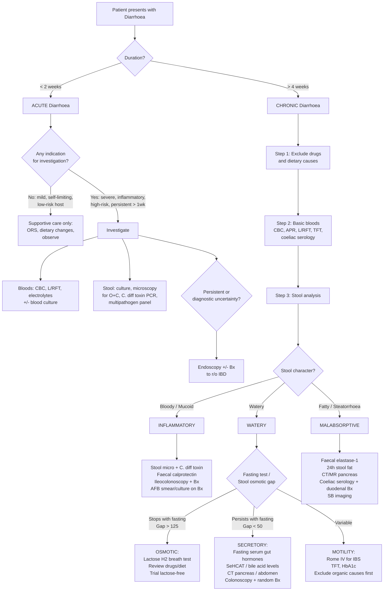

## Diagnostic Criteria, Algorithm and Investigations for Diarrhoea

---

### 1. Diagnostic Criteria — When Does "Loose Stool" Become "Diarrhoea"?

There is no single universally mandated "diagnostic criterion" for diarrhoea in the way there is for, say, rheumatoid arthritis. Instead, the diagnosis is clinical and operational:

| Parameter | Threshold | Explanation |
|---|---|---|
| **Stool frequency** | ***≥ 3 times/day*** [2] | Increased frequency compared to baseline |
| **Stool weight** | ***> 250 g/24h*** [2] | Objective quantification; rarely measured outside research |
| **Stool fluidity** | **Increased** (Bristol Stool Chart types 5–7) [2] | Patient-reported; always clarify what they mean by "diarrhoea" |

The real diagnostic challenge is not "does this patient have diarrhoea?" — that is usually obvious — but rather **"what is causing it?"** and **"does it need investigation at all?"**

### 1.1 When to Investigate Acute Diarrhoea

***In some instances such as acute self-limiting diarrhoea nil is required.*** [1] Most acute diarrhoea is viral gastroenteritis and resolves within 1–3 days with supportive care alone. Investigation is indicated when the clinical picture suggests something more serious:

> **Indications for laboratory evaluation in acute diarrhoea** [2]:
> - ***Severe illness*** (e.g., necessitating hospitalisation)
> - ***Inflammatory diarrhoea*** (bloody, mucoid, ***high fever ≥ 38.5°C***)
> - ***High-risk hosts*** (age ≥ 70y, comorbidities, immunocompromised, prior IBD, pregnant)
> - ***Persistent diarrhoea for > 1 week***

### 1.2 Diagnostic Criteria for Key Specific Causes

Some underlying causes of diarrhoea have their own formal diagnostic criteria. The important ones to know:

#### A. Irritable Bowel Syndrome — Rome IV Criteria [5]

IBS is a **diagnosis of exclusion** made when the Rome IV criteria are met AND alarm features are absent:

> ***Recurrent abdominal pain on average ≥ 1 day/week, associated with ≥ 2 of:*** [5]
> 1. ***Related to defecation***
> 2. ***Associated with change in frequency of stools***
> 3. ***Associated with change in form (appearance) of stools***
> 
> ***For the past 3 months, with symptom onset ≥ 6 months before diagnosis.*** [5]

**Why "related to defecation" rather than "relieved by defecation"?** Because Rome IV recognises that pain may worsen with defecation in some IBS patients (not just improve). The previous Rome III criterion of "relief" was too restrictive.

***Alarm features alerting to alternative diagnosis*** [5]:
- ***Hx: weight loss, constitutional symptoms, PR bleeding, old age onset, FHx of CA colon or IBD***
- ***Ix: +ve FOBT, anaemia, leukocytosis, ↑ESR, abnormal biochemistry***

#### B. Inflammatory Bowel Disease — No Single Diagnostic Criterion

IBD is diagnosed by the **combination** of clinical features, endoscopic findings, histology, and exclusion of infective/other causes. There is no single blood test or criterion. Key diagnostic elements:

- **Crohn's disease**: ***Focal patchy transmural inflammation + non-caseating granulomas*** on biopsy (***MUST exclude TB*** [3]); skip lesions on endoscopy; deep ulcers; fistulae
- **Ulcerative colitis**: ***Diffuse continuous mucosal and submucosal inflammation*** starting from the rectum [3]; ***crypt abscesses, goblet cell depletion, pseudopolyps***; classified by **Montreal phenotypic classification** [3]:

| ***Classification*** | ***Description*** |
|---|---|
| ***E1*** | ***Proctitis — involvement limited to rectum*** |
| ***E2*** | ***Left-sided (distal UC) — involvement extending up to splenic flexure*** |
| ***E3*** | ***Extensive (pancolitis) — involvement extending proximal to splenic flexure*** |

[3]

#### C. C. difficile Infection

Diagnosed by the combination of:
1. Clinical: diarrhoea (≥ 3 unformed stools in 24h) + history of antibiotic exposure
2. Laboratory: ***C. difficile toxin A (enterotoxin) and B (cytotoxin) by PCR*** [3] or toxin EIA + GDH screening algorithm

#### D. Coeliac Disease

1. **Serology**: ***IgA anti-tissue transglutaminase (anti-tTG) antibody*** positive (if IgA deficient → use IgG anti-tTG or anti-deamidated gliadin peptide)
2. **Small bowel biopsy** (duodenal D2/D3): ***villous atrophy, crypt hyperplasia, inflammatory infiltrates in lamina propria***
3. **Clinical response** to gluten-free diet confirms the diagnosis

#### E. Toxic Megacolon — Radiological Criterion

***Toxic megacolon is defined as total or segmental non-obstructive dilatation of colon ≥ 6 cm or caecum > 9 cm AND the presence of systemic toxicity.*** [3]

---

### 2. Diagnostic Algorithm

The algorithm is fundamentally about answering a series of questions in order: **Is this acute or chronic? → Is investigation needed? → What type of diarrhoea is it? → What specific tests are needed?**

<Callout title="Key Principle" type="idea">
***No firm rule — investigation is directed by Hx and P/E.*** [2][5] The algorithm above is a guide, not a rigid protocol. A young patient with watery diarrhoea after starting metformin needs only a drug history, not a colonoscopy. An elderly man with iron-deficiency anaemia and altered bowel habits needs an urgent colonoscopy regardless of stool character.
</Callout>

---

### 3. Investigation Modalities — Detailed Breakdown

#### 3.1 Blood Tests

***Minimum investigations include blood tests and stool examination, imaging, and endoscopy ± biopsy.*** [2][5]

| Test | What It Tells You | Key Findings and Interpretation |
|---|---|---|
| ***CBC*** [2][5] | ***Anaemia, leukocytosis, eosinophilia, thrombocytosis*** [2] | **Microcytic anaemia** (iron deficiency) → chronic blood loss (CRC, IBD), malabsorption (coeliac). **Macrocytic anaemia** → B12 deficiency (terminal ileum disease/resection), folate deficiency (proximal SB disease). **Leukocytosis** → infection, IBD flare. **Eosinophilia** → ***parasite infestation, allergy, collagen vascular diseases, eosinophilic gastroenteritis, neoplasm*** [5]. **Thrombocytosis** → reactive in IBD/infection (acute phase reactant). |
| ***APR: ESR, CRP*** [1][2][5] | Systemic inflammation | Elevated in IBD, infection, malignancy. ***CRP in Crohn's disease is typically higher than in UC; CRP monitoring under therapy is useful to document efficacy of anti-inflammatory treatment.*** [3] Normal ESR/CRP argues against active inflammatory or infectious cause (but does NOT exclude microscopic colitis, IBS, or osmotic causes). |
| ***LFT*** [2][5] | Albumin, liver function | ***Hypoalbuminaemia*** [3] → malabsorption and protein-losing enteropathy. Also think chronic liver disease, nephrotic syndrome. Low albumin is a marker of malnutrition severity. Deranged LFTs → think metastatic disease (CRC liver mets), PSC (associated with UC), amoebic liver abscess. |
| ***RFT and electrolytes (U&E)*** [1][2][5] | Hydration, renal function, electrolytes | **↑Creatinine/urea** → pre-renal AKI from dehydration. **Hypokalaemia** → stool K⁺ loss (see chemical path approach below). **Metabolic acidosis (↓HCO₃⁻)** → acute diarrhoea (HCO₃⁻-rich stool loss). **Metabolic alkalosis (↑HCO₃⁻)** → chronic diarrhoea, laxative abuse. **Hyponatraemia or hypernatraemia** → depends on relative water vs. Na loss and oral intake. |
| ***TFT*** [2][5] | Thyroid function | ***Hyperthyroidism*** → ↑GI motility → diarrhoea. Order in any chronic watery diarrhoea without obvious cause. |
| **Serology** [2][5] | Specific aetiologies | ***AutoAb for IBD: p-ANCA (UC), ASCA (Crohn's)*** [5] — supportive, not diagnostic alone. ***IgA anti-tTG*** → coeliac disease. ***Serum Ig levels*** → ***hypogammaglobulinaemia → recurrent GE*** [5]. ***± HIV Ab if noted lymphopenia*** [5]. |
| **Glucose / HbA1c** | Diabetes | Diabetic autonomic neuropathy causing diarrhoea; also DKA can present with diarrhoea. |
| ***Serum iron and vitamin B12 level*** [3] | Nutritional deficiency | ***Vitamin B12 deficiency*** [3] → terminal ileum disease (Crohn's, resection). Iron deficiency → chronic GI blood loss or malabsorption. |

#### 3.2 Chemical Pathology Approach to Hypokalaemia in Diarrhoea

This is a high-yield exam topic — the systematic approach to determining the cause of hypokalaemia [4][11]:

> **Step 1**: Check ***plasma HCO₃⁻*** — is there metabolic acidosis or alkalosis?
> **Step 2**: Check ***paired spot urine K⁺*** — is K loss renal ( > 20 mmol/L) or extrarenal ( < 20 mmol/L)?

| Plasma HCO₃⁻ | Urine K⁺ | Interpretation |
|---|---|---|
| ***↓ (acidosis)*** | ***< 20 mmol/L*** | ***Acute diarrhoea*** [4] — extrarenal K loss with HCO₃⁻ loss in stool |
| ***↑ (alkalosis)*** | ***< 20 mmol/L*** | ***Chronic diarrhoea, laxative abuse, previous diuretics, villous adenoma of colon*** [4] |
| ***↓ (acidosis)*** | ***> 20 mmol/L*** | ***Type 1 or 2 renal tubular acidosis*** [4] |
| ***↑ (alkalosis)*** | ***> 20 mmol/L*** | ***Vomiting, mineralocorticoid excess, current diuretics, gentamicin, Mg depletion*** [4] |

**Why does acute diarrhoea cause acidosis + low urine K?** Lower GI secretions are HCO₃⁻-rich → loss of alkali → metabolic acidosis. K⁺ is lost in the stool (extrarenal), so the kidney appropriately conserves K⁺ → low urine K⁺.

**Why does chronic diarrhoea sometimes cause alkalosis?** Chronic volume depletion → secondary hyperaldosteronism → increased H⁺ secretion in distal nephron + HCO₃⁻ reabsorption → contraction alkalosis.

A useful further tool in the chemical pathology workup of metabolic acidosis from diarrhoea is distinguishing it from RTA using the **urine anion gap** and **urine osmolal gap** [11]:

| | **Diarrhoea** | **Distal RTA** |
|---|---|---|
| **Urine pH** | ***Usually < 5.3*** | ***Always > 5.5*** |
| **Urine AG** | ***Negative (decreased)*** — kidneys are appropriately excreting NH₄⁺ | ***Positive (increased)*** — kidneys cannot acidify urine |
| **Urine OG** | ***Increased*** — unmeasured NH₄⁺ contributes to osmolality | ***Decreased*** |

[11]

#### 3.3 Stool Analysis

Stool analysis is the single most informative investigation class in diarrhoea. Think of it as "blood tests for the gut."

##### A. Macroscopic / Bedside

***Ideally the stool should be examined (note the presence of blood, mucus or steatorrhoea).*** [1]

| Observation | Interpretation |
|---|---|
| **Watery, no blood** | Osmotic, secretory, or motility-related |
| **Bloody / mucoid** | Inflammatory (invasive infection, IBD, ischaemia, CRC) |
| **Pale, bulky, oily, foul-smelling, floating** | Steatorrhoea → fat malabsorption |
| **Rice-water** | *V. cholerae* |
| **"Redcurrant jelly"** | Intussusception (blood + mucus) |

##### B. Spot Stool Analysis [2][5]

| Test | Principle | Key Findings |
|---|---|---|
| ***Stool for occult blood*** | Detects haemoglobin/haem in stool. ***Routinely ordered unless gross blood.*** [5] | Positive → occult GI bleeding (CRC, IBD, angiodysplasia). False positives with red meat, iron supplements, NSAIDs. |
| ***Stool for Na⁺, K⁺*** → ***Stool osmolal gap*** | ***Stool osmolal gap = stool osmolarity − 2 × [stool Na⁺ + stool K⁺]*** [5]. Stool osmolarity is assumed to be ~290 mOsm/kg (isotonic with plasma). | ***↑ gap ( > 125 mOsm/kg) = osmotic diarrhoea*** (unmeasured solutes like lactose, Mg²⁺ in lumen). ***↓ gap ( < 50 mOsm/kg) = secretory diarrhoea*** (electrolytes account for nearly all osmolality). [5] |
| ***Stool pH*** | Reflects colonic fermentation products. | ***pH < 5.6 → carbohydrate malabsorption*** [5] (e.g., lactose intolerance — unabsorbed lactose fermented by bacteria → lactic acid → acidifies stool). |
| ***Stool for leukocytes (WBC)*** | Presence of PMNs indicates mucosal inflammation. | ***Positive → inflammatory cause*** [5] (invasive infection, IBD). Absent in osmotic, secretory, motility causes. |
| ***Faecal calprotectin*** | ***24 kDa dimer of Ca-binding proteins*** [5] released by neutrophils. A surrogate marker for intestinal inflammation. ***Stable at room temperature*** [5] — practical advantage. | ***↑ in: (1) infectious diarrhoea; (2) Crohn's or UC; (3) cancer*** [5]. ***Usually used for triage → negative result makes serious inflammatory pathology unlikely.*** [5] Excellent for distinguishing IBS (calprotectin normal) from IBD (calprotectin elevated). Cut-off typically 50 μg/g (some centres use 100 or 150 μg/g). |

<Callout title="Faecal Calprotectin — The IBD vs IBS Gatekeeper">
Faecal calprotectin is one of the most useful non-invasive tests in chronic diarrhoea workup. It has **> 90% sensitivity and ~80% specificity** for distinguishing IBD from IBS. A normal calprotectin essentially rules out active IBD and avoids the need for colonoscopy in low-risk patients. Think of it as the "troponin of the gut" — it tells you there is inflammation, but not the specific cause.
</Callout>

##### C. Stool Microbiology [1][3]

| Test | What It Detects | When to Order |
|---|---|---|
| ***Stool culture*** [1] | Bacterial pathogens: *Salmonella*, *Shigella*, *Campylobacter*, *Yersinia*, ***E. coli O157:H7***, ***Aeromonas, Plesiomonas*** [5] | Inflammatory diarrhoea, severe watery diarrhoea, persistent > 1 week, high-risk host |
| ***Stool microscopy for ova and cysts*** [1] | Protozoa: ***Entamoeba***, ***Giardia***, ***Cryptosporidium*** [3]; helminths | Travel history, chronic diarrhoea, eosinophilia. Need **3 samples** to improve sensitivity (single sample sensitivity ~50% for *Giardia*). |
| ***Stool antigen detection*** [3] | ***E. coli O157:H7, Entamoeba, Cryptosporidium, Giardia*** [3] | More sensitive than microscopy for specific organisms. *Giardia* stool antigen is now first-line. |
| ***C. difficile toxin PCR*** [1][3] | ***C. difficile toxin A (enterotoxin) and B (cytotoxin)*** [3] | ***History of antibiotic use*** [3]; hospitalised patients; healthcare-associated diarrhoea. Many centres use a **two-step algorithm**: GDH screen (high sensitivity) → if positive, confirm with toxin EIA or PCR (high specificity). |
| ***Shiga toxin test*** [3] | Shiga toxin (EHEC) | Bloody diarrhoea without fever (especially children) → HUS risk |
| ***Multipathogen PCR panel*** | Simultaneous detection of bacterial, viral, and parasitic pathogens | Inflammatory diarrhoea or diagnostic uncertainty. Rapid turnaround but more expensive. |

##### D. Specialised Stool Tests

| Test | Principle | Key Findings |
|---|---|---|
| ***24-hour stool fat excretion*** [5] | Quantitative fat measurement on a standardised 100 g fat/day diet for 72 hours. ***NOT commonly performed*** [5] but gold standard for documenting steatorrhoea. | ***Normal: < 9% of intake. Malabsorption/maldigestion: > 18 g/day.*** ***Malabsorptive ( < 8 g/100 g stool) vs maldigestive ( > 8 g/100 g stool)*** — the latter suggests pancreatic insufficiency or biliary steatorrhoea [5]. |
| **Faecal elastase-1** | Pancreatic elastase is resistant to intestinal degradation. Measures pancreatic exocrine function. | ***< 200 μg/g = pancreatic exocrine insufficiency; < 100 μg/g = severe insufficiency***. False low in watery stool (dilution). |
| **Stool laxative screen** | Detects stimulant laxatives (phenolphthalein, bisacodyl, senna) or osmotic laxatives (Mg²⁺, PEG) | Important when factitious/laxative-abuse diarrhoea is suspected (often young women, healthcare workers). Check stool Mg²⁺ (normal < 45 mmol/L; elevated in Mg-containing laxative abuse). |

#### 3.4 Imaging

| Modality | Indications | Key Findings |
|---|---|---|
| ***CXR*** [3] | ***Indicated in patients presenting with fever or if perforation is suspected*** [3] | Free subdiaphragmatic air → perforation (e.g., toxic megacolon, perforated diverticulitis). Pulmonary TB (miliary pattern, upper lobe consolidation) → consider intestinal TB. |
| ***AXR (supine)*** [3] | ***Indicated to evaluate for colonic calibre*** [3]. Also: bowel gas pattern, calcifications. | ***Toxic megacolon: colon ≥ 6 cm or caecum > 9 cm*** [3]. Thumbprinting → mucosal oedema (ischaemic colitis, IBD). Pancreatic calcifications → chronic pancreatitis. Dilated SB loops → small bowel obstruction. |
| ***CT abdomen/pelvis with IV contrast*** [12] | Suspected complicated pathology: diverticulitis, abscess, perforation, obstruction, mesenteric ischaemia, staging of CRC | Bowel wall thickening (IBD, infection, ischaemia), pericolonic fat stranding (diverticulitis), abscess, free fluid, mesenteric vessel occlusion, lymphadenopathy, liver metastases. |
| ***CT/MR enterography*** [5] | ***For IBD and its complications*** [5]. Gold standard for small bowel Crohn's assessment. | Mural hyperenhancement, wall thickening, "comb sign" (engorged vasa recta), strictures, fistulae, abscesses. MR enterography preferred (no radiation) for young IBD patients needing serial imaging. |
| ***USG abdomen*** [5] | ***Pancreatic disease*** [5], gallstones, liver metastases, ascites | Pancreatic calcification/duct dilatation (chronic pancreatitis), gallstones (post-cholecystectomy bile acid diarrhoea), hepatomegaly/liver lesions. |
| ***Barium follow-through / SB enema*** [1][5] | ***Mucosal abnormalities*** [5] of small bowel. Largely replaced by CT/MR enterography but may still be used. | "String sign" (narrowed terminal ileum in Crohn's), cobblestoning, fistulae, diverticulae, strictures. ***Selective radiology (e.g. small bowel enema)*** [1]. |
| **SeHCAT scan** | ⁷⁵Se-homotaurocholic acid retention test. Gold standard for bile acid malabsorption. | 7-day retention < 15% → bile acid malabsorption (< 10% moderate, < 5% severe). Not widely available in HK; empirical trial of cholestyramine is often used instead. |

<Callout title="AVOID Endoscopy for Acute Abdomen" type="error">
***AVOID endoscopy for acute abdomen: sealed-off perforation may open by gas insufflation during endoscopy.*** [12] If you suspect perforation (free air on CXR/AXR, peritoneal signs on examination), endoscopy is contraindicated. Get a CT scan instead.
</Callout>

#### 3.5 Endoscopy

Endoscopy is the definitive investigation for many causes of chronic diarrhoea and is essential whenever inflammatory or neoplastic pathology is suspected.

##### A. Ileocolonoscopy ± Biopsy

***Colonoscopy + Biopsy is indicated for inflammatory diarrhoea workup.*** [3]

| Aspect | Details |
|---|---|
| **Indications** | Chronic diarrhoea (especially inflammatory), suspected IBD, suspected CRC, persistent infectious diarrhoea, evaluation after positive calprotectin or occult blood |
| **Key principle** | ***Biopsy should be taken from the left and right colon AND rectum even if normal in appearance*** [3] — this is critical because **microscopic colitis** (collagenous or lymphocytic colitis) has a **grossly normal mucosa** but diagnostic histological changes. Similarly, early or mild IBD may look subtle macroscopically. |
| **IBD-specific** | ***MUST do AFB smear and culture with sensitivity testing to rule out enteric TB*** [3] — absolutely mandatory in Hong Kong and Asia, where intestinal TB and Crohn's disease overlap significantly. |

**Endoscopic findings and their interpretation:**

| Finding | Condition | Why |
|---|---|---|
| ***Diffuse continuous inflammation starting from rectum*** | Ulcerative colitis | Immune-mediated mucosal inflammation that always involves rectum and extends proximally without gaps |
| ***Skip lesions, deep longitudinal ulcers, cobblestoning*** | Crohn's disease | Transmural inflammation in discontinuous patches; deep ulcers from full-thickness involvement |
| ***Pseudomembranes*** (yellowish adherent plaques) | *C. difficile* colitis | Fibrin + inflammatory debris + necrotic epithelium overlying inflamed mucosa |
| ***Pseudopolyps*** | Ulcerative colitis (chronic) | Islands of regenerating mucosa surrounded by denuded ulcerated mucosa create a polypoid appearance |
| ***Thumbprinting, segmental colitis at watershed areas*** | Ischaemic colitis | Submucosal oedema/haemorrhage in watershed zones (splenic flexure, rectosigmoid) |
| ***Grossly normal mucosa*** | Microscopic colitis | Inflammation is only at the histological level — **must biopsy even if normal** |
| ***Mass, stricture, ulcerated mass*** | Colorectal cancer | Neoplastic growth; always biopsy |
| ***Telangiectasiae, pallor, friability*** | Radiation proctitis/colitis | Vascular sclerosis and new vessel formation after radiation damage |
| ***Ileocaecal ulceration with surrounding inflammation*** | Crohn's disease **OR** intestinal TB | Both cause ileocaecal disease — TB has transverse ulcers, patulous ileocaecal valve, caseating granulomas on Bx; Crohn's has longitudinal ulcers, cobblestoning, non-caseating granulomas |

**Histological findings to know:**

| Histology | Condition |
|---|---|
| ***Non-caseating granulomas*** (must exclude TB) [3] | Crohn's disease |
| ***Caseating granulomas + AFB positive*** | Intestinal TB |
| ***Crypt abscesses, crypt distortion, goblet cell depletion*** | Ulcerative colitis |
| ***Villous atrophy + crypt hyperplasia + intraepithelial lymphocytes*** | Coeliac disease (duodenal biopsy) |
| ***Thickened subepithelial collagen band ( > 10 μm)*** | Collagenous colitis |
| ***Intraepithelial lymphocytosis ( > 20 per 100 epithelial cells)*** | Lymphocytic colitis |

##### B. Upper Endoscopy (OGD) with Duodenal Biopsy

| Indication | Key Finding |
|---|---|
| Suspected coeliac disease | Duodenal biopsy (D2/D3): villous atrophy, crypt hyperplasia, inflammatory infiltrate |
| Suspected Whipple's disease | PAS-positive macrophages in lamina propria |
| Suspected Giardia (stool negative) | Duodenal aspirate for trophozoites; mucosal biopsy |
| Suspected tropical sprue | Non-specific villous atrophy, crypt hyperplasia |
| Zollinger-Ellison syndrome | Multiple duodenal/jejunal ulcers; thick rugal folds in stomach |

##### C. Capsule Endoscopy and Device-Assisted Enteroscopy

- **Video capsule endoscopy (VCE)**: Non-invasive visualisation of entire small bowel. Used when CT/MR enterography is inconclusive and small bowel Crohn's, obscure GI bleeding, or small bowel tumours are suspected.
- **Double-balloon enteroscopy (DBE)**: Allows biopsy and therapy (e.g., dilatation of Crohn's strictures) in the small bowel.

#### 3.6 Specialised Functional Tests

| Test | What It Tests | Interpretation |
|---|---|---|
| **Lactose hydrogen breath test** | Lactase activity. Patient ingests 50 g lactose; breath H₂ measured at intervals. Undigested lactose fermented by colonic bacteria → H₂ absorbed → exhaled. | ***Rise in breath H₂ > 20 ppm above baseline*** confirms lactose malabsorption. Reproduction of symptoms during test confirms clinical intolerance. |
| **Glucose hydrogen breath test** | Small intestinal bacterial overgrowth (SIBO). Glucose is normally absorbed in proximal SB; if bacteria are present, they ferment it → early H₂ peak. | Early rise in breath H₂ ( < 90 min) suggests SIBO. |
| **D-xylose absorption test** | Small bowel mucosal absorptive function. D-xylose is absorbed in proximal SB without need for pancreatic enzymes. | Low urinary excretion / low serum level → mucosal malabsorption (coeliac, tropical sprue). Normal → pancreatic or biliary cause of malabsorption. |
| **Schilling test** | B12 absorption (now rarely performed, largely replaced by serum B12 + anti-IF antibody + MMA levels). | Helps localise cause of B12 deficiency (pernicious anaemia vs. terminal ileum disease vs. SIBO vs. pancreatic insufficiency). |
| **SeHCAT scan** | Bile acid retention (see imaging section above) | < 15% 7-day retention → bile acid malabsorption |
| **Fasting gut hormone panel** | Secretory causes: VIP, gastrin, serotonin (5-HIAA in 24h urine), chromogranin A, calcitonin | Elevated VIP → VIPoma. Elevated gastrin → Zollinger-Ellison. Elevated 5-HIAA → carcinoid. |

---

### 4. Putting It All Together — Investigation by Diarrhoea Type

| Type | First-Line Investigations | Second-Line / Targeted |
|---|---|---|
| **Acute — mild, self-limiting** | ***Nil required*** [1] | Only if persistent > 1 week or worsening |
| **Acute — severe / inflammatory / high-risk** | ***CBC, L/RFT, U&E; stool culture, microscopy for O+C, C. diff toxin PCR; ± blood cultures*** [1][2] | Endoscopy if persistent; CT if perforation/abscess suspected |
| **Chronic — Inflammatory** | ***CBC, APR, L/RFT; faecal calprotectin; stool microbiology; ileocolonoscopy + Bx (with AFB)*** [2][3][5] | CT/MR enterography for SB Crohn's; serology (ASCA, p-ANCA) |
| **Chronic — Watery (Osmotic)** | ***Stool Na/K → osmolal gap; stool pH; dietary review; lactose H₂ breath test*** [5] | Trial of lactose-free diet; stool laxative screen if suspected factitious |
| **Chronic — Watery (Secretory)** | ***Stool Na/K → osmolal gap; fasting gut hormone panel; CT abdomen; colonoscopy + random Bx*** [2][5] | SeHCAT for bile acid malabsorption; 24h urine 5-HIAA for carcinoid; octreotide scan for NET localisation |
| **Chronic — Watery (Motility)** | ***Rome IV criteria; TFT; HbA1c; exclude organic causes first*** [5] | Anorectal manometry, colonic transit study (rarely needed) |
| **Chronic — Fatty (Malabsorptive)** | ***Faecal elastase-1; coeliac serology (IgA anti-tTG); duodenal Bx; CT/MR pancreas*** [2][5] | 24h stool fat; SB biopsy/imaging; ERCP/MRCP for pancreatic duct disease |

---

<Callout title="High Yield Summary — Diagnosis of Diarrhoea">

1. **Most acute diarrhoea needs NO investigation** — only investigate if severe, inflammatory, high-risk host, or persistent > 1 week.

2. **Key investigations to remember** (Murtagh): ***microscopy and culture of stool, FBE, ESR/CRP, C. difficile tissue culture assay, U&E, specific tests for organisms, endoscopy, selective radiology.*** [1]

3. **Faecal calprotectin** is the gatekeeper between IBS and IBD — stable at room temperature, ↑ in infection, IBD, and cancer, negative result makes serious pathology unlikely.

4. **Stool osmolal gap** = 290 − 2(Na + K): > 125 = osmotic; < 50 = secretory. This single test distinguishes two fundamentally different mechanisms.

5. **Stool pH < 5.6** → carbohydrate malabsorption (fermentation produces acid).

6. **Colonoscopy with biopsy** — always biopsy even if mucosa looks normal (microscopic colitis!); always send for AFB in Hong Kong (TB vs Crohn's).

7. **Hypokalaemia workup**: Plasma HCO₃⁻ + paired spot urine K⁺ → acute diarrhoea = acidosis + low urine K; chronic/laxative = alkalosis + low urine K.

8. **Faecal elastase-1 < 200 μg/g** → pancreatic exocrine insufficiency (cause of fatty diarrhoea).

9. **Toxic megacolon** = colon ≥ 6 cm or caecum > 9 cm + systemic toxicity on AXR — a surgical emergency.

10. **IBS = Rome IV** (pain ≥ 1 day/wk for 3 months, related to defecation + change in frequency/form, onset ≥ 6 months ago) + NO alarm features.
</Callout>

---

<ActiveRecallQuiz
  title="Active Recall - Diagnosis and Investigations of Diarrhoea"
  items={[
    {
      question: "A patient has chronic watery diarrhoea. The stool osmolal gap is calculated as 180 mOsm/kg. What type of diarrhoea is this, what does the gap mean physiologically, and name 3 possible causes?",
      markscheme: "Osmotic diarrhoea (gap > 125 mOsm/kg). The high gap means there are unmeasured osmotically active solutes in the lumen that are NOT sodium or potassium (e.g. unabsorbed sugars, Mg2+). Causes: (1) Lactase deficiency, (2) Mg-containing antacids/laxatives, (3) Sorbitol/mannitol ingestion. Also: coeliac disease, any malabsorptive cause. Key feature: diarrhoea stops with fasting."
    },
    {
      question: "State the Rome IV diagnostic criteria for IBS and list 4 alarm features that should prompt further investigation.",
      markscheme: "Rome IV: Recurrent abdominal pain on average at least 1 day/week, associated with at least 2 of: (1) related to defecation, (2) associated with change in frequency of stools, (3) associated with change in form of stools. For the past 3 months, with symptom onset at least 6 months before diagnosis. Alarm features (any 4): weight loss, constitutional symptoms, PR bleeding, age at onset over 50, FHx CRC or IBD, positive FOBT, anaemia, leukocytosis, raised ESR/CRP, nocturnal symptoms."
    },
    {
      question: "Why must you biopsy normal-appearing colonic mucosa during colonoscopy for chronic diarrhoea, and why must you send biopsies for AFB in Hong Kong?",
      markscheme: "Normal-appearing mucosa: Microscopic colitis (collagenous and lymphocytic colitis) has grossly normal mucosa but diagnostic histological changes (thickened collagen band or intraepithelial lymphocytosis). Without biopsy, this diagnosis is missed. AFB in HK: Intestinal tuberculosis can mimic Crohn's disease (both cause ileocaecal granulomatous inflammation). TB is prevalent in HK/Asia and must be excluded before starting immunosuppression for Crohn's. AFB smear and culture with sensitivity testing on biopsy is mandatory."
    },
    {
      question: "Describe the chemical pathology approach to a patient with diarrhoea and hypokalaemia. How do plasma bicarbonate and urine potassium help differentiate causes?",
      markscheme: "Step 1: Check plasma HCO3-. Step 2: Check paired spot urine K+. Acute diarrhoea: low HCO3- (metabolic acidosis from GI bicarbonate loss) + urine K less than 20 mmol/L (extrarenal loss, kidney conserves K). Chronic diarrhoea or laxative abuse: high HCO3- (contraction alkalosis from volume depletion and secondary hyperaldosteronism) + urine K less than 20 mmol/L. RTA: low HCO3- + urine K greater than 20 mmol/L (renal K wasting). Distinguish diarrhoea from RTA by urine pH: diarrhoea has urine pH less than 5.3 (appropriate acidification), distal RTA always greater than 5.5."
    },
    {
      question: "What is faecal calprotectin, what does it measure, and how is it used clinically in the workup of chronic diarrhoea?",
      markscheme: "Faecal calprotectin is a 24 kDa calcium-binding protein released by neutrophils. It is a surrogate marker for intestinal inflammation. Stable at room temperature (practical for collection). Elevated in: infectious diarrhoea, IBD (Crohn's and UC), and colorectal cancer. Clinical use: Triage test to distinguish IBS (calprotectin normal) from IBD (calprotectin elevated). A negative result makes serious inflammatory pathology unlikely, potentially avoiding colonoscopy in low-risk patients. Sensitivity over 90% for IBD. Typical cut-off 50 micrograms per gram."
    },
    {
      question: "A patient with chronic diarrhoea has faecal elastase-1 of 80 micrograms per gram and 24-hour stool fat of 25 g/day with greater than 8 g fat per 100 g stool. What is the diagnosis and underlying mechanism? Name 3 causes.",
      markscheme: "Pancreatic exocrine insufficiency causing maldigestive steatorrhoea. Faecal elastase-1 less than 100 indicates severe pancreatic exocrine insufficiency. Fat greater than 8 g per 100 g stool indicates maldigestion (pancreatic or biliary) rather than mucosal malabsorption. Mechanism: Insufficient pancreatic lipase secretion means dietary triglycerides cannot be hydrolysed into absorbable monoglycerides and free fatty acids. Causes: (1) Chronic pancreatitis, (2) Pancreatic cancer, (3) Cystic fibrosis."
    }
  ]}
/>

## References

[1] Lecture slides: murtagh merge.pdf (Diarrhoea section, p32–34)
[2] Senior notes: Ryan Ho Fundamentals.pdf (Section 3.3.7 Acute Diarrhoea p286–287; Section 3.3.8 Chronic Diarrhoea p290–291)
[3] Senior notes: felixlai.md (IBD diagnosis: Crohn's section p960; UC section p978; Montreal classification; AFB requirement; toxic megacolon definition)
[4] Senior notes: Ryan Ho Chemical Path.pdf (Hypokalaemia approach p18)
[5] Senior notes: Ryan Ho GI.pdf (Chronic Diarrhoea workup p115–116; IBS Rome IV p119; Lactose intolerance p130)
[11] Senior notes: Ryan Ho Urogenital.pdf (RTA vs diarrhoea differentiation table p44; Hypokalaemia diagnostic evaluation p25)
[12] Senior notes: maxim.md (Acute abdomen investigations, imaging of choice, avoid endoscopy in acute abdomen p87)
