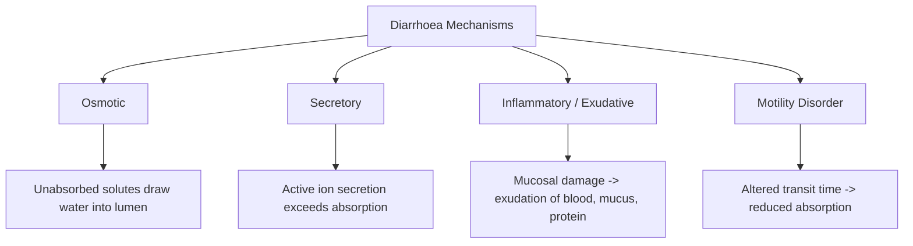

# Diarrhoea

## 1. Definition

Diarrhoea literally comes from the Greek *"diarrhoia"* — **"dia"** = through, **"rhein"** = to flow. It means **flowing through** — an apt description of the clinical problem.

***Diarrhoea is defined as the passage of abnormally liquid or unformed stools at an increased frequency (typically ≥ 3 times per day), OR a stool weight/volume exceeding 200 g/day.*** [1]

In clinical practice, what matters most is the **change from baseline** for that patient. Someone who normally opens their bowels once daily and now goes 4–5 times with loose stools — that is diarrhoea, even if total weight is under 200 g.

### Temporal Classification

| Category | Duration | Typical Implication |
|---|---|---|
| **Acute diarrhoea** | < 2 weeks | Usually infectious |
| **Persistent diarrhoea** | 2–4 weeks | May be infectious or early non-infectious cause |
| **Chronic diarrhoea** | > 4 weeks | Usually non-infectious (IBD, IBS, malabsorption, neoplasia, endocrine) |

<Callout title="Common Student Pitfall" type="error">
***Establish what the patient means by diarrhoea.*** [1] Patients often use "diarrhoea" to describe urgency, frequency, or even faecal incontinence — none of which necessarily mean loose stool. Always clarify stool consistency (Bristol Stool Chart types 5–7 = diarrhoea) and frequency.
</Callout>

### Important Subtypes to Recognise Early

- **Spurious (overflow) diarrhoea**: ***Remember spurious diarrhoea and the rectal examination in the elderly.*** [1] Liquid stool leaking around impacted faeces in the rectum — especially in elderly or immobile patients. The rectal exam is diagnostic.
- **Functional diarrhoea**: ***Yes, diarrhoea may be a manifestation of anxiety state or irritable bowel syndrome.*** [1] ***IBS rarely causes nocturnal diarrhoea but causes recurrent pain in the right hypochondrium.*** [1]

---

## 2. Epidemiology

### Global Burden
- Diarrhoeal diseases remain the **second leading cause of death in children under 5 worldwide** (~525,000 deaths/year, WHO 2024), predominantly in low-income countries.
- In adults, acute infectious diarrhoea is overwhelmingly self-limiting, but certain populations (elderly, immunocompromised, travellers) carry higher morbidity and mortality.

### Hong Kong Context
- **Infectious gastroenteritis** is a notifiable disease in HK. Norovirus is the leading cause of viral gastroenteritis outbreaks, particularly in residential care homes and schools.
- **Bacterial causes**: *Vibrio parahaemolyticus* (from raw/undercooked seafood — very common in HK), *Salmonella*, *Campylobacter*, and increasingly antibiotic-resistant organisms.
- **Parasitic**: *Giardia lamblia*, *Entamoeba histolytica* (especially in travellers returning from Southeast Asia / mainland China).
- **C. difficile infection (CDI)**: increasingly recognised in HK hospitals; associated with prior antibiotic use and PPI exposure.
- **Inflammatory bowel disease (IBD)**: incidence is rising in Hong Kong and East Asia. ***IBD occurs between 30–70s with NO gender predominance*** (for UC), while ***Crohn's disease has a female predominance.*** [3]
- **IBS**: prevalence ***3.7% in HK (Rome II criteria)***, up to ***25% in East Asia*** [5] — an important cause of chronic diarrhoea.
- **Colorectal cancer**: HK has one of the highest rates globally; can present with diarrhoea (especially alternating bowel habits).

### Risk Factors for Diarrhoeal Illness (General)

| Category | Risk Factors |
|---|---|
| **Host factors** | Extremes of age (< 5y, > 70y), immunocompromise (HIV, transplant, chemotherapy), achlorhydria (PPI use), prior GI surgery (gastrectomy, ileal resection) |
| **Infectious exposure** | Travel (travellers' diarrhoea), contaminated water/food, raw shellfish (HK!), institutional outbreaks, sexual practices (MSM — *Shigella*, *Entamoeba*) |
| **Medications** | ***Alcohol, antibiotics, digoxin, colchicine, cytotoxic agents, H₂-receptor antagonists, iron compounds, laxatives, metformin, sildenafil, statins, thyroxine*** [1] |
| **Medical Hx** | ***Infectious gastroenteritis in prior 1 year*** is a risk factor [3]; prior IBD; diabetes (autonomic neuropathy) |
| **Surgical Hx** | Cholecystectomy (bile acid diarrhoea), ileal resection, gastric surgery (dumping), ***prior appendicectomy is a risk factor for Crohn's disease*** [3] but ***protective for ulcerative colitis*** [3] |
| **Family Hx** | ***IBD***, coeliac disease, colorectal cancer [3] |
| **Social Hx** | ***Smoking is a risk factor for Crohn's disease (ONLY Crohn's, NOT UC)*** — conversely, ***smoking is protective for ulcerative colitis*** [3] |

<Callout title="High Yield — Smoking and IBD">
Smoking and IBD is a classic exam question. Remember: **Smoking is BAD for Crohn's** (worsens disease, increases relapse) but paradoxically **PROTECTIVE for UC**. The mechanism is not fully understood but may relate to effects of nicotine on colonic mucus production, cytokine profiles, and mucosal blood flow.
</Callout>

---

## 3. Anatomy and Physiology Relevant to Diarrhoea

Understanding diarrhoea requires understanding normal intestinal fluid handling. Think of the gut as a massive fluid-processing factory.

### 3.1 Normal Intestinal Fluid Balance

Every day, approximately **9 litres** of fluid enters the GI tract:
- ~2 L oral intake
- ~1 L saliva
- ~2 L gastric secretion
- ~1 L bile
- ~2 L pancreatic juice
- ~1 L small intestinal secretion

Of this 9 L, the **small intestine absorbs ~7–8 L**, and the **colon absorbs ~1–1.5 L**. Only **100–200 mL** appears in stool.

> The colon has a maximum absorptive capacity of ~4–5 L/day. Any process that delivers > 5 L of fluid to the colon, or impairs colonic absorption, will overwhelm the system and produce diarrhoea.

### 3.2 Mechanisms of Absorption and Secretion

| Segment | Key Absorptive Mechanisms | Key Secretory Mechanisms |
|---|---|---|
| **Duodenum/Jejunum** | Na⁺-glucose co-transport (SGLT1), Na⁺-amino acid co-transport, osmotic water absorption | Cl⁻ secretion via CFTR channels, HCO₃⁻ secretion |
| **Ileum** | Na⁺/H⁺ exchange, Cl⁻/HCO₃⁻ exchange (coupled electroneutral NaCl absorption), bile acid reabsorption (terminal ileum via ASBT transporter) | Cl⁻ secretion (CFTR) |
| **Colon** | Electroneutral NaCl absorption (ENaC channels in distal colon regulated by aldosterone), short-chain fatty acid (SCFA) absorption | Cl⁻ and K⁺ secretion, mucus secretion |

**Why is the Na⁺-glucose co-transporter (SGLT1) clinically important?** Because it is the basis for **oral rehydration solution (ORS)**: glucose in ORS drives sodium absorption, which in turn drives water absorption. This single mechanism saves millions of lives.

### 3.3 Motility

- The **small bowel** has segmenting contractions (mix chyme) and peristaltic contractions (propel contents aborally). Transit time is ~3–5 hours.
- The **colon** has haustra segmentation (slows transit, promotes absorption) and mass movements (propels faecal material distally). Transit time is ~12–36 hours.
- The **migrating motor complex (MMC)** is a cyclical "housekeeper" pattern during fasting that sweeps residual material through the small bowel.

Any process that accelerates transit (e.g., hyperthyroidism, IBS-D) reduces contact time for absorption → diarrhoea. Conversely, processes that slow transit (e.g., opioids, diabetic autonomic neuropathy with small bowel stasis) can allow bacterial overgrowth → diarrhoea.

### 3.4 Colonic Flora

The colon contains ~10¹³–10¹⁴ bacteria. Normal flora:
- **Ferment** undigested carbohydrates → short-chain fatty acids (butyrate, propionate, acetate) → colonic energy source + promotes water/Na⁺ absorption
- **Resist colonisation** by pathogens (colonisation resistance)
- Disruption by antibiotics → *C. difficile* overgrowth, osmotic diarrhoea from unfermented carbohydrates

### 3.5 Vascular Anatomy Relevant to Ischaemic Causes

From senior notes [5]:
- ***Watershed areas*** between SMA and IMA territories are vulnerable to ischaemia:
  - ***Griffiths' point (splenic flexure)*** — between ascending left colic artery and marginal artery of Drummond
  - ***Sudeck's point (rectosigmoid junction)*** — between left colic artery and superior rectal artery
- Ischaemic colitis can present with bloody diarrhoea and cramping abdominal pain, particularly in elderly patients with cardiovascular risk factors.

---

## 4. Aetiology and Pathophysiology

This is the core of understanding diarrhoea. Every cause of diarrhoea operates through one (or more) of **four fundamental pathophysiological mechanisms**:

### 4.1 The Four Mechanisms of Diarrhoea

#### 4.1.1 Osmotic Diarrhoea

**Mechanism**: Poorly absorbed, osmotically active solutes remain in the gut lumen, drawing water into the lumen by osmosis.

**Key feature**: Diarrhoea **stops with fasting** (because the offending solute is no longer being ingested).

**Stool osmotic gap** = 290 − 2 × (stool Na⁺ + stool K⁺). An osmotic gap **> 125 mOsm/kg** suggests osmotic diarrhoea (unmeasured solutes in the lumen).

| Cause | Mechanism |
|---|---|
| **Lactase deficiency** | Undigested lactose remains in the lumen → osmotic water retention + bacterial fermentation → gas, bloating, watery diarrhoea. Very common in East Asians (~90% lactase non-persistence). |
| **Osmotic laxatives** (lactulose, MgSO₄, polyethylene glycol) | Non-absorbable solutes in lumen. |
| ***Sorbitol/mannitol*** (dietetic foods, gums, mints) [2] | Sugar alcohols are poorly absorbed → osmotic diarrhoea. |
| **Malabsorption syndromes** (see below) | Unabsorbed nutrients remain in lumen. |

#### 4.1.2 Secretory Diarrhoea

**Mechanism**: Active secretion of ions (predominantly Cl⁻ via CFTR) exceeds absorption. Water follows ions into the lumen.

**Key feature**: Diarrhoea **persists despite fasting**. Usually **large volume** and **watery**. Stool osmotic gap is **< 50 mOsm/kg** (because the osmolality is accounted for by electrolytes).

| Cause | Mechanism |
|---|---|
| **Cholera toxin** (*V. cholerae*) | Toxin permanently activates Gs → ↑cAMP in enterocytes → opens CFTR Cl⁻ channels → massive Cl⁻ and water secretion (up to 20 L/day — "rice-water stools") |
| **Enterotoxigenic *E. coli*** (ETEC — travellers' diarrhoea) | Heat-labile toxin (LT) → ↑cAMP; heat-stable toxin (ST) → ↑cGMP → Cl⁻ secretion |
| ***Bile acid malabsorption*** [2] | ***Bile acid malabsorption occurs when terminal ileum fails to reabsorb bile acids. It may cause osmotic diarrhoea and induce secretory diarrhoea (at higher level).*** Unabsorbed bile acids stimulate colonic Cl⁻ secretion. Occurs after ileal resection, Crohn's disease, or idiopathic (primary bile acid diarrhoea). Post-cholecystectomy diarrhoea often has a bile acid component. |
| **Endocrine tumours**: ***VIPoma, carcinoid syndrome, Zollinger-Ellison syndrome*** [2] | VIPoma: VIP activates adenylate cyclase → ↑cAMP → secretory diarrhoea (WDHA syndrome: Watery Diarrhoea, Hypokalaemia, Achlorhydria). ***Carcinoid: 5-HT stimulates intestinal secretion/motility and inhibits intestinal absorption → watery, non-bloody diarrhoea*** [6]. Gastrinoma: excess gastric acid overwhelms duodenal buffering capacity → low pH inactivates pancreatic lipase → steatorrhoea + direct mucosal damage. |
| **Microscopic colitis** (collagenous/lymphocytic) | Chronic watery diarrhoea in elderly women, often drug-induced (PPIs, NSAIDs, SSRIs). Colonic mucosa looks grossly normal on colonoscopy — **must biopsy**. |
| ***Laxative abuse*** [2] | Stimulant laxatives (senna, bisacodyl) stimulate Cl⁻ secretion and inhibit absorption. |
| **Villous adenoma of colon** | Rarely, large villous adenomas secrete mucus rich in K⁺ and Cl⁻, causing secretory diarrhoea with ***hypokalaemia and alkalosis*** [4]. |

#### 4.1.3 Inflammatory (Exudative) Diarrhoea

**Mechanism**: Damage to the intestinal mucosa → exudation of blood, mucus, protein, and inflammatory cells into the lumen. This disrupts both absorption and barrier function.

**Key features**: ***Mucoid, bloody stools with PMN in stools.*** [2] Frequently associated with fever, abdominal pain, and systemic inflammatory response.

| Cause | Mechanism |
|---|---|
| **Inflammatory bowel disease (IBD)** | **Ulcerative colitis**: Immune-mediated ***diffuse continuous mucosal and submucosal inflammation*** [3], starting from the rectum and extending proximally. Crypt abscesses, goblet cell depletion, pseudopolyps. Bloody diarrhoea with mucus. **Crohn's disease**: Immune-mediated ***focal patchy transmural inflammation*** [3] anywhere mouth-to-anus (commonest: terminal ileum and colon). ***Granulomas (must exclude TB)***, skip lesions, deep ulcers, fistulae, abscesses. Diarrhoea may be bloody or non-bloody depending on location. |
| **Invasive bacterial infection** | *Shigella*, *Salmonella*, *Campylobacter*, *C. difficile*, invasive *E. coli* (EIEC, EHEC) — organisms invade mucosa or produce cytotoxins → mucosal necrosis, inflammation, bloody diarrhoea (dysentery). |
| ***C. difficile*** | ***Commonly associated with Clostridium difficile and patients usually has a history of antibiotic use.*** [3] Toxin A (enterotoxin) and toxin B (cytotoxin) → mucosal inflammation, pseudomembrane formation, watery-to-bloody diarrhoea. |
| **Intestinal tuberculosis** | Important DDx in HK. Usually ileocaecal involvement. Granulomatous inflammation (must distinguish from Crohn's). Diarrhoea, abdominal pain, weight loss, night sweats. |
| **Ischaemic colitis** | Hypoperfusion → mucosal ischaemia → ***sudden onset cramping abdominal pain with mild-to-moderate rectal bleeding developing ≤ 24h*** [5]. Usually affects watershed areas. |
| **Radiation colitis** | ***Hx of abdominal irradiation*** [2]. Acute or chronic mucosal damage → bloody diarrhoea. |
| **Colorectal carcinoma** | ***Worrying signs: alternating diarrhoea and constipation, passage of mucus, tenesmus, pencil-thin stools*** [2]. |

#### 4.1.4 Motility Disorders

**Mechanism**: Altered intestinal transit time → if too fast, there is insufficient contact time for absorption; if too slow, bacterial overgrowth may occur.

| Cause | Mechanism |
|---|---|
| **IBS-D** | ***Altered motility: ↑frequency, irregularity of luminal contractions*** [5]; ***visceral hypersensitivity*** [5]; ***serotoninergic imbalance: ↑5-HT release in IBS-D*** [5] |
| **Hyperthyroidism** | Excess thyroid hormone increases GI motility → reduced transit time → diarrhoea |
| **Diabetic autonomic neuropathy** | Paradoxically, can cause both diarrhoea (↑motility, SIBO) and constipation |
| **Post-vagotomy** | Disrupted vagal control of gastric emptying → rapid gastric emptying → dumping syndrome with diarrhoea |
| **Carcinoid syndrome** | ***5-HT stimulates intestinal secretion/motility*** [6] |

### 4.2 Aetiology by Clinical Setting

#### A. Acute Diarrhoea (< 2 weeks) — Predominantly Infectious

| Category | Organisms / Causes | Key Features |
|---|---|---|
| **Viral** | Norovirus (commonest cause of outbreaks in HK), Rotavirus (children), Adenovirus, Astrovirus | Watery, self-limiting 1–3 days, N&V prominent, low-grade fever. Norovirus: projectile vomiting, highly contagious, winter peaks. |
| **Bacterial — toxin-mediated (food poisoning)** | *Staphylococcus aureus* (preformed toxin), *Bacillus cereus* (emetic type) | Very short incubation (1–6 hours), prominent vomiting, self-limiting < 24h. No fever. |
| **Bacterial — enterotoxigenic** | ETEC, *V. cholerae*, *C. perfringens* | Watery, secretory. ETEC = commonest travellers' diarrhoea. |
| **Bacterial — invasive/inflammatory** | *Salmonella*, *Shigella*, *Campylobacter jejuni*, EHEC (O157:H7), *Yersinia* | Fever, bloody diarrhoea (dysentery), abdominal pain. *Campylobacter* is commonest bacterial cause in many countries. |
| **Parasitic** | *Giardia lamblia*, *Entamoeba histolytica*, *Cryptosporidium* | ***Giardiasis (profuse bubbly diarrhoea) is more common than realised.*** [1] Amoebic dysentery: bloody "anchovy sauce" stools. |
| ***C. difficile* infection** | Post-antibiotic exposure | ***History of antibiotic use*** [3]. Watery to bloody diarrhoea, cramping, fever, ↑WCC. Can cause ***toxic megacolon*** [3]. |
| **Drug-induced** | ***Alcohol, antibiotics, digoxin, colchicine, cytotoxic agents, H₂-receptor antagonists, iron compounds, laxatives, metformin, sildenafil, statins, thyroxine*** [1]; also ***Acid-suppressing agents: antacids (esp Mg-containing), H₂RA, PPI; β-blocker, NSAID/5-ASA, misoprostol, theophylline, vitamin and mineral supplements, herbal products*** [2] | Mechanism varies: osmotic (Mg antacids, metformin), secretory (misoprostol, colchicine), altered flora (antibiotics), motility changes (erythromycin acts as motilin agonist). |
| **Food allergy/intolerance** | Lactose intolerance, fructose malabsorption | Osmotic mechanism. Extremely common in Hong Kong (East Asian lactase non-persistence ~80–90%). |

#### B. Chronic Diarrhoea (> 4 weeks) — Summary Table

***Chronic diarrhoea is categorised into inflammatory, watery (secretory/osmotic/motility), and fatty (malabsorptive):*** [2]

| | ***Inflammatory*** | ***Watery*** | ***Fatty (Malabsorptive)*** |
|---|---|---|---|
| ***Causes*** | ***IBD (Crohn's, UC); Chronic infections (C. difficile, M. tuberculosis); CA colon; Chronic ischaemia*** | ***Secretory***: endocrine tumours (VIPoma, carcinoid, ZES), bile salt malabsorption, laxative abuse. ***Osmotic***: lactase deficiency, osmotic laxatives, (malabsorption). ***Motility***: IBS, hyperthyroidism | ***Enteropathy***: coeliac disease, short gut syndrome, Crohn's disease. ***Pancreatic insufficiency***: chronic pancreatitis, CA pancreas, CF |
| ***Clinical features*** | ***Mucoid, bloody stools; PMN in stools*** | ***Watery diarrhoea; Changes with fasting (↓ in osmotic, motility; persists in secretory — usually large volume)*** | ***Watery diarrhoea + steatorrhoea + weight loss + nutritional deficiency*** |
| ***Ix*** | ***CBC, L/RFT, APR; Stool microbiology; Appropriate imaging; Ileocolonoscopy ± Bx*** | ***CBC, L/RFT, APR; Spot stool for Na/K; Appropriate imaging; Endoscopy as indicated*** | ***CBC, L/RFT, APR; Spot ± timed stool; Appropriate imaging; Endoscopy as indicated*** |

[2]

<Callout title="Drug-Induced Diarrhoea — Don't Forget!" type="idea">
***Drug-induced diarrhoea*** [2] is one of the most commonly overlooked causes. Always take a thorough drug history. Key offenders:
- **Metformin**: osmotic mechanism (accumulation of unabsorbed substrates)
- **PPIs**: altered gut microbiome → ↑risk of CDI, SIBO
- **Antibiotics**: direct mucosal irritation + altered flora
- **Colchicine**: inhibits microtubule function in rapidly dividing enterocytes
- **Magnesium-containing antacids**: osmotic
- **SSRIs**: ↑serotonin in gut → ↑secretion and motility
</Callout>

---

## 5. Classification Systems

### 5.1 By Duration (as above)
- Acute (< 2 weeks), Persistent (2–4 weeks), Chronic (> 4 weeks)

### 5.2 By Pathophysiological Mechanism
- Osmotic, Secretory, Inflammatory, Motility-related (as detailed above)

### 5.3 By Stool Characteristics
- **Watery**: osmotic or secretory
- **Bloody/mucoid (dysentery)**: inflammatory
- **Fatty (steatorrhoea)**: malabsorptive — pale, bulky, foul-smelling, floating stools that are difficult to flush

### 5.4 By Anatomical Origin
- **Small bowel diarrhoea**: large-volume, watery, rarely bloody, may have steatorrhoea, periumbilical/RIF pain
- **Large bowel (colonic) diarrhoea**: small-volume, frequent, may be bloody/mucoid, urgency, tenesmus, lower abdominal/suprapubic pain

### 5.5 Fasting Test (Clinical Differentiation)

| | Osmotic | Secretory |
|---|---|---|
| **Fasting** | Diarrhoea **stops** | Diarrhoea **persists** |
| **Stool volume** | Usually < 1 L/day | Often > 1 L/day |
| **Stool osmotic gap** | > 125 mOsm/kg | < 50 mOsm/kg |

---

## 6. Clinical Features

### 6.1 Symptoms (with Pathophysiological Basis)

***Key history: Establish what the patient means by diarrhoea. Analyse the nature of the stools, frequency, associated symptoms (e.g. abdominal pain) and constitutional symptoms such as fever and weight loss. Drug history, travel history and family history.*** [1]

#### A. Stool Characteristics

| Symptom | Pathophysiological Basis |
|---|---|
| **Watery stools** | Secretory or osmotic mechanism — unabsorbed solutes or active ion secretion draw water into the lumen |
| **Bloody stools** | Mucosal inflammation/ulceration → damage to blood vessels in the lamina propria or submucosa (invasive infection, IBD, ischaemia, colorectal cancer) |
| **Mucus in stools** | Exudation from inflamed goblet cells and colonic mucosa; also seen in IBS (but without blood) and villous adenoma |
| ***Steatorrhoea*** (pale, bulky, oily, foul-smelling, floating, difficult to flush) | Fat malabsorption → undigested fat in stool. Causes: pancreatic insufficiency (no lipase), bile salt deficiency (no emulsification), small bowel mucosal disease (no absorptive surface). Floats because of gas from bacterial fermentation of undigested fat. |
| ***Profuse bubbly diarrhoea*** [1] | Characteristic of ***Giardia*** — the trophozoites coat the duodenal/jejunal mucosa, impairing fat and carbohydrate absorption. Fermentation of unabsorbed carbohydrates produces gas → bubbly/frothy stools. |
| **Rice-water stools** | *V. cholerae* — massive secretory diarrhoea. Stools contain mucus flecks in clear fluid. |

#### B. Associated GI Symptoms

| Symptom | Pathophysiological Basis |
|---|---|
| **Abdominal pain — cramping/colicky** | Increased peristalsis or bowel distension from luminal fluid/gas. IBS-D pain is ***characteristically associated with defecation*** [5] — relieved or worsened by defecation. |
| **Abdominal pain — constant, localised** | Transmural inflammation (Crohn's), ischaemia, perforation, abscess |
| **Tenesmus** (sensation of incomplete evacuation + constant urge) | Rectal/distal colonic inflammation — inflamed rectum sends persistent afferent signals to defecation centres even when empty. Classic in UC proctitis, rectal cancer. |
| **Urgency** | Rectal irritability from inflammation or rapid colonic transit |
| **Nausea and vomiting** | Common in viral gastroenteritis (vagal stimulation from upper GI inflammation); also in food poisoning (preformed toxins stimulate vagal afferents). In bowel obstruction: retrograde propulsion. |
| **Borborygmi** (audible bowel sounds) | Hyperperistalsis — increased contractions moving fluid and gas through narrowed or irritated bowel |
| **Bloating and flatulence** | Bacterial fermentation of unabsorbed carbohydrates (lactose intolerance, SIBO, IBS). Gas production (H₂, CO₂, CH₄). |
| ***Alternating diarrhoea and constipation*** [2] | ***Worrying sign of colorectal cancer*** — tumour intermittently obstructs then allows passage. Also seen in IBS-M. |
| ***Pencil-thin stools*** [2] | Suggest distal colonic or rectal narrowing (cancer, stricture). |

#### C. Systemic / Constitutional Symptoms

| Symptom | Pathophysiological Basis |
|---|---|
| **Fever** | Inflammatory response to invasive infection, or systemic inflammation in IBD/ischaemia. ***High fever ≥ 38.5°C*** suggests inflammatory diarrhoea requiring investigation [2]. |
| **Weight loss** | Malabsorption (coeliac, chronic pancreatitis), increased catabolism (malignancy, IBD flare), reduced intake (anorexia from illness). ***Constitutional symptoms: loss of appetite, loss of weight, malaise*** [2] — think malignancy. |
| **Dehydration** — thirst, dry mucous membranes, reduced skin turgor, tachycardia, hypotension, oliguria | Fluid and electrolyte loss exceeding intake. ***Dehydration and electrolyte imbalance from reduced oral intake, vomiting, defective intestinal absorption, transudation of fluid into peritoneal cavity*** [4]. |
| **Fatigue/weakness** | Hypokalaemia (from K⁺ loss in stool — especially secretory diarrhoea), anaemia (iron/B12/folate deficiency in malabsorption; chronic disease in IBD), dehydration. |
| **Night sweats** | TB, lymphoma, severe IBD, malignancy |

#### D. Extra-intestinal Features (Pointing to Specific Diagnoses)

| Feature | Associated Condition | Mechanism |
|---|---|---|
| ***Episcleritis / uveitis, oral ulcers, arthritis, skin rashes*** [2] | IBD | Immune-mediated extra-intestinal manifestations — circulating immune complexes, molecular mimicry, shared epitopes |
| ***Flushing (red/violaceous, face/neck/upper chest)*** [6] | Carcinoid syndrome | ***Overproduction of histamine, kallikrein → accounts for flushing*** [6] |
| ***Dermatitis herpetiformis*** (intensely pruritic papules/vesicles) | Coeliac disease | IgA deposition at dermal papillae → granular IgA on immunofluorescence |
| ***Necrolytic migratory erythema*** [6] | Glucagonoma | Hypoaminoacidaemia from glucagon excess → epidermal necrosis |
| Erythema nodosum / Pyoderma gangrenosum | IBD (esp. Crohn's) | Immune-mediated cutaneous manifestation |
| Aphthous ulcers | Crohn's disease, coeliac disease, Behçet's | Immune-mediated mucosal inflammation |
| **Hyperpigmentation, vitiligo** | Addison's disease (adrenal insufficiency) | ↑ACTH stimulates melanocytes (diarrhoea from cortisol deficiency → altered Na⁺/water handling) |
| **Goitre, tremor, exophthalmos** | Hyperthyroidism | Thyroid hormone excess → ↑GI motility |
| ***Wheezing and dyspnoea*** [6] | Carcinoid syndrome | ***Bronchospasm (10–20%): often during flushing episodes*** [6] — from histamine and serotonin |

### 6.2 Signs (with Pathophysiological Basis)

***Key examination: Focus on the general state (especially of severe gastroenteritis), the abdomen, rectum and skin. Ideally the stool should be examined (note the presence of blood, mucus or steatorrhoea).*** [1]

#### A. General Examination

| Sign | Significance | Pathophysiological Basis |
|---|---|---|
| **Dehydration signs**: dry mucous membranes, reduced skin turgor, sunken eyes, tachycardia, hypotension, CRT > 2s | Severity assessment | Fluid loss from GI tract > intake. Intravascular volume depletion → sympathetic compensation (↑HR) → if severe, hypotension. |
| **Cachexia / muscle wasting** | Chronic diarrhoea with malabsorption, malignancy | Protein-energy malnutrition. ***↑GI loss (e.g. intestinal fistula, diarrhoea) is a predisposing factor for malnutrition; muscle wasting causes respiratory muscle weakness → respiratory failure*** [8]. |
| **Pallor** | Anaemia | Iron deficiency (chronic blood loss in IBD/CRC; malabsorption in coeliac), B12/folate deficiency (terminal ileum disease/resection), anaemia of chronic disease |
| **Lymphadenopathy** | Infection, lymphoma, metastatic CRC | Reactive or neoplastic |
| **Peripheral oedema** | Hypoalbuminaemia | Protein-losing enteropathy (IBD, lymphangiectasia) or malabsorption → ↓albumin → ↓oncotic pressure → oedema |
| ***Thyrotoxic signs*** (goitre, tremor, lid lag, lid retraction, exophthalmos) [2] | Hyperthyroidism | Excess T₃/T₄ → ↑GI motility → diarrhoea |

#### B. Abdominal Examination

| Sign | Significance | Pathophysiological Basis |
|---|---|---|
| **Distension** | Bowel obstruction, toxic megacolon, ascites | Gas/fluid accumulation proximal to obstruction; paralytic ileus; peritoneal fluid |
| **Tenderness — localised** | Appendicitis, diverticulitis, Crohn's abscess, ischaemic colitis | Localised peritoneal inflammation → somatic pain |
| **Tenderness — diffuse with guarding/rigidity** | Perforation, generalised peritonitis | Transmural inflammation → parietal peritoneal irritation → reflex muscle contraction |
| ***Peritoneal signs suggestive of acute inflammation*** [2] | Surgical emergency | As above |
| **Palpable mass** — RIF | Crohn's (inflammatory mass/abscess), caecal tumour, appendiceal abscess, ileocaecal TB | Transmural inflammation with phlegmon/abscess formation in Crohn's; neoplastic mass in CRC |
| **Palpable mass** — LIF | Sigmoid cancer, diverticular abscess | Tumour or pericolic inflammatory mass |
| **Hepatomegaly** | Metastatic disease (CRC liver mets), carcinoid liver metastases, amoebic liver abscess | CRC commonly metastasises to liver via portal venous drainage. ***Carcinoid syndrome largely signifies liver mets as normal liver inactivates bioactive hormonal products*** [6]. |
| **Hyperactive bowel sounds** | Infectious diarrhoea, early obstruction, IBS | Increased peristaltic activity |
| **Absent bowel sounds** | Paralytic ileus, late obstruction, peritonitis | Loss of peristaltic activity from neuromuscular dysfunction or peritoneal irritation |

#### C. Digital Rectal Examination (DRE)

***The rectal examination is essential*** [1] — don't skip it!

| Finding | Significance |
|---|---|
| **Empty rectum with loose stool on glove** | Active diarrhoea |
| **Loaded rectum with liquid stool** | ***Spurious (overflow) diarrhoea*** — faecal impaction with overflow |
| **Rectal mass** | Rectal carcinoma |
| **Blood/mucus on glove** | Inflammatory/neoplastic colonic disease |
| **Tender, boggy prostate** | Prostatic abscess (can present with diarrhoea as a red herring in elderly) |
| ***Anal involvement*** (fissures, fistulae, skin tags, perianal abscess) [2] | Crohn's disease — ***anorectal exam: note anal involvement in Crohn's disease*** [2] |

#### D. Skin Examination

| Finding | Significance |
|---|---|
| **Erythema nodosum** (tender, red nodules on shins) | IBD, infections, sarcoidosis |
| **Pyoderma gangrenosum** (painful, rapidly enlarging ulcers with undermined violaceous borders) | IBD (especially UC) |
| ***Dermatitis herpetiformis*** (intensely pruritic grouped vesicles on extensor surfaces) | Coeliac disease |
| ***Necrolytic migratory erythema*** | Glucagonoma |
| ***Venous telangiectasiae*** (nose, upper lip, malar area) [6] | Carcinoid syndrome — ***appears late due to prolonged vasodilation*** [6] |
| **Angular cheilitis, glossitis** | Nutritional deficiency (iron, B12, folate) from malabsorption |

---

## 7. Metabolic and Electrolyte Consequences of Diarrhoea

This is extremely high-yield for chemical pathology questions.

### 7.1 Hypokalaemia

Stool is rich in K⁺ (typically 30–80 mmol/L). Diarrhoea → K⁺ loss → hypokalaemia.

***Approach to hypokalaemia with diarrhoea*** [4]:
- Check ***plasma HCO₃⁻*** to determine acid-base status
- Check ***paired spot urine K⁺*** to determine renal vs. extrarenal loss

| Scenario | Plasma HCO₃⁻ | Urine K⁺ | Interpretation |
|---|---|---|---|
| ***Acute diarrhoea*** | ↓ (metabolic acidosis) | ***< 20 mmol/L*** | Extrarenal K⁺ loss with metabolic acidosis from HCO₃⁻ loss in stool (lower GI secretions are rich in HCO₃⁻) |
| ***Chronic diarrhoea / laxative abuse*** | ↑ (metabolic alkalosis) | ***< 20 mmol/L*** | Extrarenal K⁺ loss; alkalosis develops from volume contraction → ↑aldosterone → HCO₃⁻ reabsorption |

**Why does acute diarrhoea cause metabolic acidosis?** Lower GI secretions (ileal and colonic) are rich in HCO₃⁻. Loss of this HCO₃⁻ → non-anion-gap metabolic acidosis (NAGMA, also called hyperchloraemic metabolic acidosis — the kidneys retain Cl⁻ to maintain electroneutrality).

**Why does chronic diarrhoea sometimes cause metabolic alkalosis?** Chronic volume depletion → secondary hyperaldosteronism → ↑H⁺ secretion in distal nephron + ↑HCO₃⁻ reabsorption → contraction alkalosis. Laxative abuse often presents this way.

### 7.2 Hyponatraemia / Hypernatraemia

- Acute watery diarrhoea: ***Hypotonic fluid depletion*** → ***water loss → ↑Na concentration*** AND ***Na loss → ↓ECF volume*** [4]. The net effect on [Na⁺] depends on the relative loss of water vs. sodium:
  - If the patient drinks plain water to compensate → dilutional **hyponatraemia**
  - If the patient is unable to drink (e.g., severe vomiting, altered consciousness) → **hypernatraemia**

### 7.3 Metabolic Acidosis (Normal Anion Gap)

- ***GI causes of hypotonic fluid depletion include vomiting and diarrhoea*** [4]
- Loss of HCO₃⁻-rich intestinal secretions → NAGMA
- The mnemonic for NAGMA causes: **HARDUPS** — Hyperalimentation, Acetazolamide/Addison's, Renal tubular acidosis, Diarrhoea, Uretero-sigmoidostomy, Pancreatic fistula, Saline (excessive NS infusion)

### 7.4 Dehydration and AKI

- Severe diarrhoea → ***hypovolaemia → pre-renal AKI*** [7]
- ***Pre-renal causes of AKI include dehydration from vomiting and diarrhoea*** [7]
- If prolonged, pre-renal AKI progresses to acute tubular necrosis (ATN) — intrinsic renal disease

### 7.5 Other Electrolyte Disturbances

| Disturbance | Mechanism |
|---|---|
| **Hypomagnesaemia** | Mg²⁺ lost in stool; coeliac/Crohn's impairs Mg absorption |
| **Hypocalcaemia** | ↓vitamin D absorption in fat malabsorption → ↓Ca²⁺; also hypoMg impairs PTH secretion |
| **Hypophosphataemia** | Malabsorption; refeeding syndrome risk in malnourished chronic diarrhoea patients |
| **Zinc deficiency** | Chronic diarrhoea depletes zinc → further impairs mucosal healing (vicious cycle). WHO recommends zinc supplementation for children with acute diarrhoea. |

---

## 8. Special Populations

### 8.1 Diarrhoea in Immunocompromised Patients (HIV/AIDS, Transplant, Chemotherapy)

Opportunistic infections become important:
- **CMV colitis** — especially in HIV with CD4 < 50; also post-transplant
- **Cryptosporidium** — chronic watery diarrhoea, no effective treatment (immune reconstitution is key)
- **Microsporidium** — chronic diarrhoea in AIDS
- **Mycobacterium avium complex (MAC)** — disseminated disease with diarrhoea, CD4 < 50
- **Isospora belli** — treatable with cotrimoxazole
- Drug side effects (antiretrovirals, immunosuppressants)

### 8.2 Diarrhoea in the Elderly

- ***Remember spurious diarrhoea and the rectal examination in the elderly*** [1]
- ***UTI in elderly: clinical presentation is notoriously non-specific — may present with poor appetite, nausea and vomiting, diarrhoea, fever without localising signs*** [9]
- Ischaemic colitis: elderly with CVS risk factors
- Medications: polypharmacy → drug-induced diarrhoea
- *C. difficile*: higher risk due to frequent antibiotic exposure and hospitalisation
- Colorectal cancer: age is the strongest risk factor

### 8.3 Travellers' Diarrhoea

- Most commonly ETEC (enterotoxigenic *E. coli*)
- Self-limiting in majority; empirical azithromycin or fluoroquinolone for severe/inflammatory cases
- Prevention: food and water hygiene; bismuth subsalicylate or rifaximin for prophylaxis in high-risk travellers

### 8.4 Post-Surgical Diarrhoea

| Surgery | Mechanism of Diarrhoea |
|---|---|
| **Cholecystectomy** | Loss of gallbladder reservoir → continuous bile acid delivery to gut → bile acid diarrhoea |
| **Ileal resection** | Loss of bile acid reabsorption site → bile acids in colon stimulate Cl⁻ secretion (secretory diarrhoea); if > 100 cm resected → also fat malabsorption (insufficient bile acids) |
| **Gastrectomy / vagotomy** | Dumping syndrome: rapid gastric emptying → osmotic diarrhoea in the small bowel |
| **Short bowel syndrome** | Insufficient absorptive surface → malabsorptive diarrhoea |
| **Whipple procedure** | Pancreatic insufficiency → fat malabsorption → steatorrhoea |

---

<Callout title="High Yield Summary">

**Definition**: ≥ 3 loose/liquid stools per day or stool weight > 200 g/day. Classify by duration: acute (< 2 wk), persistent (2–4 wk), chronic (> 4 wk).

**Four pathophysiological mechanisms**: Osmotic (stops with fasting, gap > 125), Secretory (persists with fasting, large volume, gap < 50), Inflammatory (bloody, mucoid, PMN+), Motility disorder (altered transit).

**Hong Kong relevance**: Norovirus outbreaks, *V. parahaemolyticus* (raw seafood), rising IBD incidence, high CRC rates, lactose intolerance (~80–90% East Asians), intestinal TB as Crohn's mimic.

**Critical history points**: *What does the patient mean by diarrhoea?* Stool consistency (Bristol chart), frequency, blood/mucus, associated pain, timing (nocturnal = organic), drug history, travel history, family history.

**Smoking & IBD**: Smoking is a risk factor for Crohn's but protective for UC.

**Appendicectomy & IBD**: Prior appendicectomy is a risk factor for Crohn's but protective for UC.

**Metabolic consequences**: Hypokalaemia (K⁺ loss in stool), NAGMA (HCO₃⁻ loss in stool in acute diarrhoea), dehydration → pre-renal AKI.

**Drug-induced**: Alcohol, antibiotics, metformin, colchicine, Mg-antacids, PPIs, SSRIs, laxatives, statins, iron — always check drug history.

**Don't forget**: Spurious diarrhoea in elderly (DRE!), overflow around impacted stool.

**IBS**: Very common, does NOT cause nocturnal diarrhoea, pain is associated with defecation.
</Callout>

---

<ActiveRecallQuiz
  title="Active Recall - Diarrhoea (Definition, Epidemiology, Etiology, Clinical Features)"
  items={[
    {
      question: "A patient has chronic watery diarrhoea that persists despite 48 hours of fasting, with stool volumes exceeding 1L/day and a stool osmotic gap of 30 mOsm/kg. What is the pathophysiological mechanism, and name 3 causes?",
      markscheme: "Secretory diarrhoea. Causes (any 3): VIPoma, carcinoid syndrome, bile acid malabsorption, microscopic colitis, laxative abuse (stimulant type), villous adenoma. Key point: persists with fasting and low osmotic gap (less than 50) because osmolality is accounted for by electrolytes being actively secreted."
    },
    {
      question: "Explain why acute diarrhoea causes non-anion-gap metabolic acidosis (NAGMA) and hypokalaemia. How would you confirm extrarenal potassium loss?",
      markscheme: "NAGMA: Lower GI secretions are rich in HCO3-; loss of HCO3- in stool causes metabolic acidosis. Kidneys retain Cl- to maintain electroneutrality (hyperchloraemic acidosis). Hypokalaemia: Stool K+ concentration is 30-80 mmol/L; large-volume diarrhoea causes significant K+ loss. Confirm extrarenal loss: Paired spot urine K+ less than 20 mmol/L indicates extrarenal (GI) loss."
    },
    {
      question: "A 70-year-old nursing home resident presents with what the nurses describe as diarrhoea. On DRE, the rectum is loaded with hard stool and there is liquid stool on the glove. What is the diagnosis and mechanism?",
      markscheme: "Spurious (overflow) diarrhoea. Mechanism: Faecal impaction in the rectum causes liquid stool proximal to the impaction to leak around the obstructing mass, mimicking diarrhoea. Key point: DRE is diagnostic. Management is disimpaction, not anti-diarrhoeals."
    },
    {
      question: "Describe the relationship between smoking, appendicectomy, and IBD (Crohn's disease vs ulcerative colitis).",
      markscheme: "Smoking: Risk factor for Crohn's disease (worsens disease, increases relapse), but PROTECTIVE for ulcerative colitis. Appendicectomy: Risk factor for Crohn's disease, but PROTECTIVE for ulcerative colitis. These are classic differentiating risk factors between the two forms of IBD."
    },
    {
      question: "A patient presents with chronic diarrhoea, episodic flushing of face and neck, and wheezing. What is the likely diagnosis, what hormone causes the diarrhoea, and why does the syndrome signify liver metastases?",
      markscheme: "Carcinoid syndrome. Diarrhoea is caused by serotonin (5-HT), which stimulates intestinal secretion and motility while inhibiting absorption. The syndrome signifies liver metastases because the normal liver inactivates bioactive hormonal products from GI neuroendocrine tumours via first-pass metabolism; symptoms only manifest when tumour products bypass hepatic clearance (liver mets draining into hepatic veins, or primary tumour outside portal drainage)."
    },
    {
      question: "List the 4 fundamental pathophysiological mechanisms of diarrhoea and for each, state one key distinguishing clinical or laboratory feature.",
      markscheme: "1. Osmotic: Stops with fasting; stool osmotic gap greater than 125. 2. Secretory: Persists with fasting; stool osmotic gap less than 50; large volume. 3. Inflammatory: Bloody/mucoid stool with PMN on stool microscopy. 4. Motility disorder: Associated with altered transit (e.g. IBS pain related to defecation); diagnosis of exclusion after ruling out organic causes."
    }
  ]}
/>

---

## References

[1] Lecture slides: murtagh merge.pdf (Diarrhoea section)
[2] Senior notes: Ryan Ho Fundamentals.pdf (Section 3.3.8 Chronic Diarrhoea, p289–290; Section on Lower GI Bleeding / Colorectal evaluation, p264, p283)
[3] Senior notes: felixlai.md (IBD section: Etiology, Epidemiology, Clinical Manifestation, Pathological/Endoscopic features; Volvulus/Toxic megacolon section)
[4] Senior notes: Ryan Ho Chemical Path.pdf (Hyponatraemia p13; Hypokalaemia p18)
[5] Senior notes: Ryan Ho GI.pdf (IBS section p118; Ischaemic Colitis p146; Malabsorption/Coeliac p126)
[6] Senior notes: Ryan Ho Endocrine.pdf (Carcinoid Syndrome p103; Glucagonoma p102)
[7] Senior notes: Ryan Ho Critical Care.pdf (AKI and Renal Support p25)
[8] Senior notes: Ryan Ho Fluids and Nutrition.pdf (Malnutrition predisposing factors p7)
[9] Senior notes: Ryan Ho Urogenital.pdf (UTI in elderly p128)
