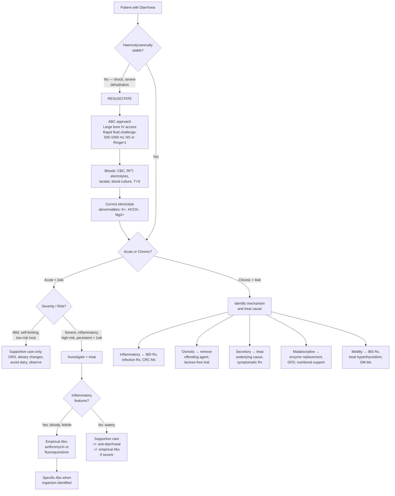
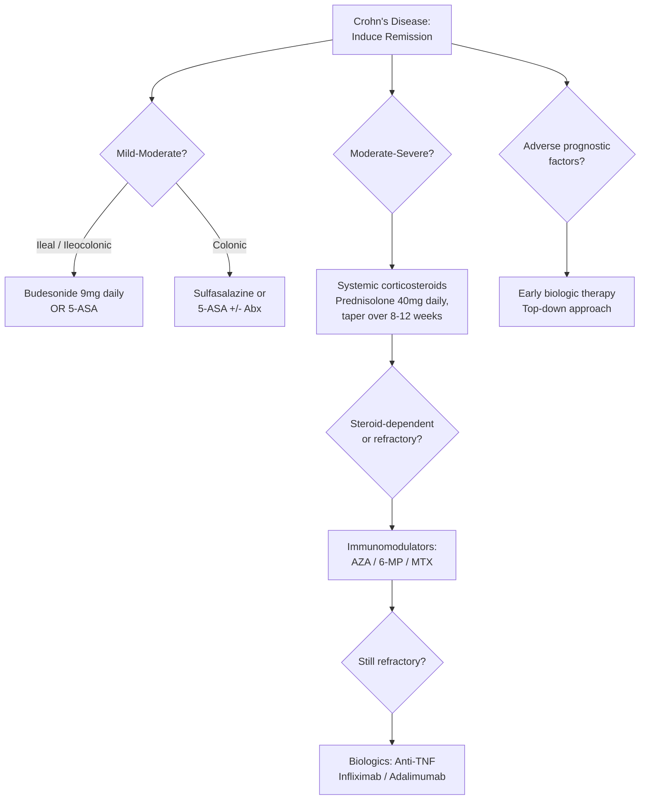

## Management of Diarrhoea

The management of diarrhoea is never a one-size-fits-all algorithm. The treatment depends entirely on **(1) acuity** (acute vs. chronic), **(2) severity** (mild self-limiting vs. life-threatening dehydration), **(3) mechanism** (osmotic / secretory / inflammatory / motility / malabsorptive), and **(4) the specific underlying cause**. Let's build this from first principles.

---

### 1. Overarching Principles

Think of diarrhoea management as three parallel tracks running simultaneously:

1. **Resuscitation and supportive care** — keep the patient alive and haemodynamically stable (fluids, electrolytes)
2. **Symptomatic treatment** — reduce stool frequency and discomfort (anti-diarrhoeals, dietary changes)
3. **Specific treatment** — treat the underlying cause (antibiotics for infection, biologics for IBD, surgery for CRC, etc.)

The balance between these tracks shifts depending on context. In a 25-year-old with 2 days of watery diarrhoea after a dodgy takeaway, track 1 (ORS) and waiting is sufficient. In a 70-year-old with bloody diarrhoea, fever, and hypotension, all three tracks fire simultaneously.

---

### 2. Management Algorithm — Master Overview

---

### 3. Track 1 — Resuscitation and Fluid/Electrolyte Management

This is the single most important intervention in acute diarrhoea. More lives are saved by ORS than by any antibiotic.

#### 3.1 Oral Rehydration

***ORS: replace established deficits in 4 hours + ongoing loss + normal daily requirement.*** [2]

**Why does ORS work?** The Na⁺-glucose co-transporter (SGLT1) on the enterocyte brush border remains functional even during secretory diarrhoea (cholera toxin targets Cl⁻ secretion, not glucose-coupled Na⁺ absorption). Glucose in ORS drives Na⁺ absorption, and water follows osmotically. This is why ORS contains both glucose AND sodium — neither alone works as well.

| Component | WHO-ORS (2006 reduced osmolarity) | Rationale |
|---|---|---|
| Na⁺ | 75 mmol/L | Replaces Na⁺ lost in stool |
| K⁺ | 20 mmol/L | Replaces K⁺ lost in stool |
| Glucose | 75 mmol/L | Drives SGLT1-mediated Na⁺/water absorption |
| Citrate | 10 mmol/L | Buffer to counteract metabolic acidosis |
| Osmolarity | 245 mOsm/L | Hypotonic → better water absorption than old formula |

**Practical point**: In mild cases, commercially available sports drinks or dilute fruit juice with added salt can serve as makeshift ORS, but the WHO formulation is preferred for moderate-to-severe dehydration.

#### 3.2 Intravenous Fluid Resuscitation

***IV fluid if shock, unconscious, paralytic ileus, or fail oral rehydration.*** [2]

| Indication | Fluid Choice | Rationale |
|---|---|---|
| **Hypovolaemic shock** | ***Rapid fluid challenge: 500–1000 mL NS or Ringer's lactate over 5–10 min*** [13] | Isotonic crystalloid expands intravascular volume. Ringer's lactate is preferred because it contains lactate (metabolised to HCO₃⁻, helps correct acidosis) and has a more physiological electrolyte composition than NS (which can worsen hyperchloraemic acidosis). |
| **Ongoing losses** | Guided by losses: replace volume-for-volume with appropriate fluid | ***GI losses (NG aspirates, vomiting, fistula, stoma, diarrhoea, intraluminal)*** [8] should be replaced. Diarrhoeal stool is roughly isotonic — NS or Ringer's with KCl supplementation is appropriate. |
| **Maintenance** | ***30–40 mL/kg/day*** [8] water + ***1–1.17 mmol/kg/day Na⁺*** + ***0.9–1.3 mmol/kg/day K⁺*** | Once deficits are replaced and the patient is stable, maintenance fluids cover insensible losses and baseline requirements. |

> ***Aim: restore tissue perfusion as evident by urine output > 0.5 mL/kg/h.*** [8]

#### 3.3 Electrolyte Correction

| Abnormality | Correction | Caution |
|---|---|---|
| **Hypokalaemia** | Oral KCl if mild (K⁺ 3.0–3.5); IV KCl if severe (K⁺ < 3.0 or symptomatic). Max rate: 10–20 mmol/h peripherally, 40 mmol/h centrally with cardiac monitoring. | Never give K⁺ bolus — risk of fatal arrhythmia. Always check Mg²⁺ — ***hypoMg impairs K⁺ repletion*** [4]. |
| **Metabolic acidosis** | Usually self-corrects with volume resuscitation + K⁺ replacement. ***NaHCO₃ only if pH < 7.1.*** [11] | Risks of NaHCO₃: ***hypokalaemia by transcellular shift, ↓ionic calcium, volume expansion, paradoxical cerebral acidosis*** [11]. |
| **Hypomagnesaemia** | IV MgSO₄ 2–4 g over 2–4 hours if severe; oral Mg supplement if mild. | ***GI causes of hypoMg: ↓intake, malabsorption, chronic diarrhoea, intestinal resection*** [4]. |
| **Hyponatraemia / Hypernatraemia** | Correct slowly (max 8–10 mmol/L per 24 hours for hypoNa). | Rapid correction of hypoNa → central pontine myelinolysis. Rapid correction of hyperNa → cerebral oedema. |

<Callout title="The AKI Trap" type="error">
Severe diarrhoea → pre-renal AKI is extremely common. ***Treat hypotension by aggressive fluid resuscitation. Do NOT give diuretics.*** [14] Stop nephrotoxic drugs (***NSAIDs, ACEI/ARB***) [14][15]. Monitor urine output. If oliguric despite adequate resuscitation, consider intrinsic renal disease (ATN) and involvement of renal team.
</Callout>

---

### 4. Track 2 — Symptomatic / Supportive Treatment

#### 4.1 Dietary Modifications

***Dietary changes: avoid dairy products*** [2] — ***dairy products may be difficult to digest in presence of diarrhoea due to secondary lactose malabsorption*** [2]. This occurs because inflammation or villous damage from any cause temporarily depletes brush-border lactase, even in patients who are normally lactose-tolerant.

| Recommendation | Rationale |
|---|---|
| Small frequent meals, bland diet (BRAT: bananas, rice, applesauce, toast) | Easy to digest, low fibre reduces mechanical stimulation of inflamed gut |
| Avoid dairy | Secondary lactose malabsorption |
| Avoid caffeine, alcohol | Both stimulate intestinal motility and secretion |
| Avoid high-osmolality foods (sorbitol/mannitol in "sugar-free" products) | Osmotic diarrhoea |
| ***Low FODMAP diet*** (for IBS) [5] | FODMAPs ("fermentable oligo-, di-, mono-saccharides and polyols") are poorly absorbed, osmotically active, and fermented by bacteria → gas, bloating, diarrhoea |

#### 4.2 Anti-Diarrhoeal Agents

| Agent | Mechanism | Indications | Contraindications / Cautions |
|---|---|---|---|
| ***Loperamide (Imodium)*** [2][5] | μ-opioid receptor agonist in the myenteric plexus → ↓peristalsis, ↑transit time, ↑water and electrolyte absorption, ↑anal sphincter tone. Does NOT cross BBB → no central opioid effects. "Loper" = Latin *loper* relates to running — it stops the "running." | Non-inflammatory acute diarrhoea in adults; chronic diarrhoea (IBS-D, short bowel syndrome, high stool output). ***Useful in managing chronic diarrhoea in patients with high stool output.*** [3] | ***To be used with caution in afebrile inflammatory diarrhoea. Antimotility agents may prolong/exacerbate illness in inflammatory diarrhoea*** [2] — by slowing transit, you keep invasive organisms and toxins in contact with mucosa longer → risk of toxic megacolon (especially in EHEC, *C. difficile*, *Shigella*). **Absolute CI**: bloody/febrile diarrhoea, suspected *C. difficile*, children < 2 years. |
| **Diphenoxylate-atropine (Lomotil)** [5] | μ-opioid agonist (diphenoxylate) + anticholinergic (atropine added to discourage abuse). Similar mechanism to loperamide. | Alternative to loperamide for symptomatic relief. | Same cautions as loperamide. Atropine component → anticholinergic side effects (dry mouth, urinary retention, tachycardia). |
| ***Bismuth subsalicylate*** [2] | Multiple mechanisms: antisecretory (blocks prostaglandin-mediated Cl⁻ secretion), antimicrobial (direct bactericidal), anti-inflammatory. ***Bismuth salicylate as alternative*** to antimotility agents [2]. | Travellers' diarrhoea (prophylaxis and treatment), mild acute diarrhoea. | Salicylate component → avoid in aspirin allergy, children (Reye's syndrome), patients on anticoagulants. Black stools (harmless but may mimic melaena). |
| ***Octreotide*** [5] | Somatostatin analogue → ***↓motility***, ↓intestinal secretion, ↓splanchnic blood flow. | ***Useful in neuroendocrine tumour*** [5] (carcinoid syndrome, VIPoma), high-output enterocutaneous fistula, dumping syndrome, refractory secretory diarrhoea. | Expensive, requires SC injection; can cause gallstones (↓gallbladder motility), hyperglycaemia. |
| ***Cholestyramine (bile acid sequestrant)*** [5] | ***Bile acid-binding resin*** → binds unabsorbed bile acids in the colonic lumen → prevents bile-acid-stimulated Cl⁻ secretion. "Cholestyramine" = cholesterol + styrene resin + amine. | ***Bile acid malabsorption*** [5] (post-ileal resection, Crohn's, post-cholecystectomy diarrhoea, IBS-D). ***Used with caution since it will impair fat-soluble vitamin absorption.*** [3] | ***Impairs absorption of fat-soluble vitamins (A, D, E, K)*** and many oral medications (take other drugs 1 hour before or 4 hours after). GI side effects (bloating, constipation). ***No effects on diarrhoea caused by carbohydrate malabsorption.*** [3] |
| ***Intraluminal adsorbents (charcoal)*** [5] | Adsorbs toxins, gases, and drugs in the GI lumen. | Limited evidence; sometimes used for toxin-related diarrhoea or excessive gas. | May adsorb medications → reduce efficacy. |
| ***Racecadotril (acetorphan)*** | Enkephalinase inhibitor → prevents breakdown of endogenous enkephalins → ↓intestinal Cl⁻/water secretion WITHOUT affecting motility. | Acute watery diarrhoea (especially in children); used in some European/Asian centres. | Advantage over loperamide: antisecretory without antimotility effect → theoretically safer in inflammatory diarrhoea. |

<Callout title="Golden Rule: Antimotility Agents in Inflammatory Diarrhoea" type="error">
***Antimotility agents (loperamide, diphenoxylate) may prolong or exacerbate illness in inflammatory diarrhoea.*** [2] In bloody/febrile diarrhoea, or suspected EHEC / C. difficile / Shigella, these agents can precipitate **toxic megacolon** or **HUS**. Use bismuth subsalicylate or racecadotril as alternatives if symptomatic relief is needed.
</Callout>

---

### 5. Track 3 — Specific Treatment by Clinical Setting

#### 5.1 Acute Infectious Diarrhoea

##### A. When to Give Antibiotics

***Antibiotics are NOT indicated unless inflammatory, severe watery diarrhoea, or high-risk patients.*** [2]

**Why not give antibiotics to everyone?** Most acute diarrhoea is viral (antibiotics useless), self-limiting (antibiotics unnecessary), and inappropriate antibiotic use drives resistance and increases *C. difficile* risk. For EHEC, antibiotics may paradoxically increase Shiga toxin release and HUS risk.

| Indication for Empirical Antibiotics | Rationale |
|---|---|
| ***Inflammatory diarrhoea*** (bloody, mucoid, high fever ≥ 38.5°C) | Likely invasive bacterial pathogen requiring treatment |
| ***Severe watery diarrhoea*** (e.g., cholera-like, profuse) | Risk of fatal dehydration; antibiotics shorten illness duration |
| ***High-risk hosts*** (elderly ≥ 70, immunocompromised, pregnant, prior IBD) | Higher morbidity/mortality from untreated infection |
| ***Travellers' diarrhoea*** (moderate-to-severe) | Shortens illness by 1–2 days |

##### B. Empirical Antibiotic Choices

***Empirical Tx: azithromycin (if inflammatory) or fluoroquinolones.*** [2]

| Agent | Dose | Indication | Notes |
|---|---|---|---|
| **Azithromycin** | 500 mg daily × 3 days (or single 1 g dose) | ***First-line empirical for inflammatory diarrhoea*** [2]. Travellers' diarrhoea. | Preferred over fluoroquinolones due to rising quinolone resistance in *Campylobacter* (especially in Asia). Effective against *Shigella*, *Salmonella*, *Campylobacter*. |
| **Fluoroquinolone** (ciprofloxacin, levofloxacin) | Ciprofloxacin 500 mg BD × 3–5 days | Alternative empirical therapy | Excellent GI penetration. Increasing resistance in Asia (especially *Campylobacter*). Avoid in children and pregnancy (cartilage damage). Risk of tendinopathy, QT prolongation, *C. difficile*. |
| **Rifaximin** | 200 mg TDS × 3 days | Non-invasive travellers' diarrhoea | Non-absorbable → acts locally in the gut with minimal systemic side effects. NOT for invasive/febrile diarrhoea. |

##### C. Specific Antibiotic Therapy (When Organism Identified)

| Organism | Specific Treatment | Key Points |
|---|---|---|
| ***C. difficile*** | ***Metronidazole*** (mild–moderate first episode: 500 mg TDS × 10–14 days) [2]. **Oral vancomycin** 125 mg QDS × 10 days (preferred first-line per 2021 IDSA/SHEA guidelines for all CDI). **Fidaxomicin** 200 mg BD × 10 days (lower recurrence rate). | Stop offending antibiotic if possible. For severe/fulminant CDI: oral vancomycin ± IV metronidazole. For recurrent CDI: fidaxomicin, vancomycin taper/pulse, or faecal microbiota transplant (FMT). |
| ***Salmonella*** (non-typhoidal) | Usually self-limiting — antibiotics only if severe, bacteraemic, immunocompromised, or extremes of age. If needed: ciprofloxacin or azithromycin. | Antibiotics may prolong carrier state in uncomplicated gastroenteritis. |
| ***Shigella*** | Azithromycin or ciprofloxacin × 3 days. | Always treat (highly contagious, can cause dysentery). |
| ***Campylobacter*** | Azithromycin 500 mg daily × 3 days (if within 3 days of onset; later treatment less effective). | Most common bacterial cause. High fluoroquinolone resistance in Asia → use azithromycin first-line. |
| **Cholera** | Doxycycline 300 mg single dose (adults) or azithromycin 1 g single dose. | Antibiotics shorten duration and stool volume by 50%. |
| **EHEC (O157:H7)** | ***NO antibiotics*** — supportive care only. | Antibiotics may ↑Shiga toxin release → ↑HUS risk. Avoid antimotility agents. Monitor for HUS (↓platelets, ↑LDH, ↓Hb, AKI). |
| ***Giardia*** | Metronidazole 250 mg TDS × 5–7 days or tinidazole 2 g single dose. | ***Giardiasis is more common than realised.*** [1] |
| ***Entamoeba histolytica*** | Metronidazole 750 mg TDS × 7–10 days → followed by luminal agent (diloxanide furoate or paromomycin) to eliminate cysts. | Two-phase treatment essential: metronidazole kills trophozoites but NOT cysts in gut lumen. |
| ***Listeria*** | ***Amoxicillin or cotrimoxazole*** [2] | Important in pregnancy, neonates, elderly, immunocompromised. |
| **Intestinal TB** | Standard anti-TB regimen: RIPE (rifampicin, isoniazid, pyrazinamide, ethambutol) × 2 months → RI × 4 months. | Critical DDx in HK. Must confirm diagnosis before starting — empirical anti-TB trial if highly suspicious and Crohn's excluded. |

<Callout title="C. difficile — Current Guidelines (2021 IDSA/SHEA Update)">
The management of CDI has evolved. **Oral vancomycin or fidaxomicin** is now preferred over metronidazole as first-line for ALL CDI episodes (including initial non-severe). Metronidazole is relegated to second-line when vancomycin/fidaxomicin are unavailable. For recurrent CDI, **faecal microbiota transplant (FMT)** is highly effective (85–90% cure rate after ≥ 2 recurrences) and now available as standardised preparations.
</Callout>

#### 5.2 Chronic Diarrhoea — Treatment by Mechanism and Cause

##### A. Inflammatory Bowel Disease (IBD)

IBD management is complex and centres on ***inducing and maintaining remission, taking into account disease activity, disease site, disease behaviour, and patient preference.*** [3]

**Crohn's Disease — Step-Up (or Accelerated Step-Up) Approach:**

| Drug Class | Examples | Mechanism | Indications | Key Points |
|---|---|---|---|---|
| ***5-Aminosalicylates (5-ASA)*** [3] | Mesalazine (Pentasa, Asacol), sulfasalazine | Topical anti-inflammatory — inhibits NF-κB, scavenges free radicals, inhibits prostaglandin/leukotriene synthesis in gut mucosa. "5-ASA" = 5-aminosalicylic acid (the active moiety of sulfasalazine). | Mild-to-moderate UC (first-line for induction and maintenance); mild Crohn's colitis (less effective). | Sulfasalazine = 5-ASA linked to sulfapyridine (carrier); sulfa component causes most side effects (rash, headache, oligospermia). Mesalazine avoids sulfa side effects. |
| ***Antibiotics*** [3] | Ciprofloxacin, metronidazole | ***Efficacy may be due to treatment of undetected pathogen, bacterial overgrowth, or unsuspected microperforation.*** [3] | ***Active luminal disease (colonic Crohn's but NOT isolated small intestine disease); perianal diseases (fistula); septic complications (abscess, wound infections).*** [3] | Metronidazole long-term → peripheral neuropathy. |
| **Corticosteroids** | Prednisolone (systemic), budesonide (topical/oral controlled-release) | Suppress multiple inflammatory pathways (NF-κB, cytokines, arachidonic acid cascade). Budesonide has high first-pass hepatic metabolism → fewer systemic side effects. | Moderate-to-severe flares (induction only — ***NOT for maintenance***). Budesonide for ileal/right-sided Crohn's. | Side effects: Cushingoid, osteoporosis, DM, infection, adrenal suppression. Always plan steroid taper. |
| ***Immunomodulators*** [3] | ***Azathioprine (AZA), 6-Mercaptopurine (6-MP), Methotrexate (MTX)*** | AZA/6-MP: purine analogues → inhibit DNA synthesis in rapidly dividing lymphocytes. MTX: folate antagonist → anti-inflammatory and immunosuppressive. | Steroid-dependent or steroid-refractory disease; maintenance of remission. ***MTX is indicated in active or relapsing disease refractory to or intolerant of AZA or 6-MP.*** [3] ***MTX is NOT effective in UC unlike in Crohn's.*** [3] | Check TPMT/NUDT15 before starting AZA/6-MP (risk of myelosuppression in deficient patients — especially important in East Asians who have higher NUDT15 variant prevalence). Monitor FBC regularly. |
| ***Biologic therapies (Anti-TNFα)*** [3] | ***Infliximab (Remicade), Adalimumab (Humira)*** | Monoclonal antibodies that bind TNFα → neutralise this key pro-inflammatory cytokine → ↓mucosal inflammation, ↓fistula formation. | ***Refractory disease or patients with extra-intestinal manifestations and fistulas.*** [3] Also: ***adverse prognostic factors (young age < 40, extensive SB disease, perianal involvement, strictures, deep ulcers, steroids required initially)*** → ***early introduction (top-down approach).*** [3] | ***MUST screen for TB (CXR + QuantiFERON-TB Gold) and HBV (HBsAg)*** [3]. ***TB prophylaxis with isoniazid or rifampicin; HBV prophylaxis with entecavir.*** [3] ***Contraindications: latent untreated/active TB, lymphoma, heart failure NYHA III–IV, demyelinating disease (MS), optic neuritis.*** [3] ***Adverse effects: reactivation of TB/HBV, lymphoma, non-melanoma skin cancer.*** [3] Dosing: ***Infliximab: induction IV 5 mg/kg at 0, 2, 6 weeks; maintenance IV 5 mg/kg Q8 weeks. Adalimumab: induction SC 160 mg at 0 week, 80 mg at 2 weeks; maintenance SC 40 mg Q2 weeks.*** [3] ***Do not stop anti-TNFα easily unless deep remission of at least 18 months with normal blood and endoscopic parameters.*** [3] |
| **Newer biologics** | Vedolizumab (anti-α4β7 integrin), ustekinumab (anti-IL-12/23) | Vedolizumab: gut-selective — blocks lymphocyte trafficking to GI mucosa. Ustekinumab: blocks IL-12 and IL-23 → ↓Th1/Th17 inflammation. | Anti-TNF failures or contraindications. UC and Crohn's. | Vedolizumab is gut-selective → lower systemic immunosuppression → lower infection risk. |
| **JAK inhibitors** | Tofacitinib, upadacitinib | Inhibit Janus kinases → block intracellular signalling of multiple cytokines. | Moderate-to-severe UC (tofacitinib); Crohn's (upadacitinib). | Oral administration (advantage over IV/SC biologics). Risks: VTE, herpes zoster, hyperlipidaemia. |

**Crohn's Disease — Surgical Treatment** [3]:

> ***Surgical treatment is NOT curative in Crohn's disease and is mainly used to treat complications only.*** [3] ***Bowel-preserving surgery should be performed — conservative and minimal resection as possible.*** [3] ***Extended resection does not decrease recurrence.*** [3]

| Indication | Procedure |
|---|---|
| ***Persistent symptoms refractory to medical treatment*** [3] | Resection of affected segment |
| ***Severe bleeding*** [3] | Segmental resection |
| ***Strictures (intestinal obstruction)*** [3] | ***Short ( < 10 cm): Heineke-Mikulicz strictureplasty. Long (10–20 cm): Finney strictureplasty. Distal ileal: balloon dilatation. Bypass is NOT recommended (7% malignancy risk in bypassed segment).*** [3] ***No role for strictureplasty in Crohn's colitis.*** [3] |
| ***Abscess*** [3] | Percutaneous CT-guided drainage → delayed resection |
| ***Fistula*** [3] | ***SNAP principle: Sepsis control (Abx + drainage), Nutrition (TPN aids fistula closure), Anatomical localisation (imaging), Procedure (infliximab or en-bloc resection with primary anastomosis + diverting stoma).*** [3] |
| ***Perforation/sepsis*** [3] | Emergency surgery |
| ***Perianal disease*** [3] | EUA + seton drainage; medical therapy (infliximab + AZA) |
| **Large bowel** | ***Right hemicolectomy (most commonly performed). Total colectomy + IRA if rectum spared. Total proctocolectomy + IPAA if limited perianal disease. Total proctocolectomy + end ileostomy if rectum affected.*** [3] |

**Ulcerative Colitis — Similar Step-Up Approach but Key Differences:**

- 5-ASA is **first-line** for both induction and maintenance (much more effective in UC than Crohn's)
- Topical therapy (rectal 5-ASA suppositories/enemas) is critical for proctitis (E1) and left-sided disease (E2)
- ***Methotrexate is NOT effective in UC*** [3]
- Cyclosporine (IV) can be used as rescue therapy in acute severe UC refractory to IV steroids
- **Surgery is curative in UC**: total proctocolectomy + IPAA ("J-pouch") is the definitive operation
- Indications for surgery in UC: failure of medical therapy, toxic megacolon, perforation, uncontrollable haemorrhage, dysplasia/cancer

##### B. Irritable Bowel Syndrome (IBS) [5]

***IBS management is a multifaceted approach:*** [5]

| Domain | IBS-D Specific | IBS-C Specific | All Subtypes |
|---|---|---|---|
| **Education** | ***Reassurance and education may already be sufficient*** [5] | Same | Same |
| **Diet** | ***Low FODMAP diet*** [5] | ***High dietary fibre diet*** [5] | Identify individual triggers |
| **Pharmacotherapy** | ***Opioid agonist (loperamide); Bile salt sequestrants (cholestyramine); Probiotics; Rifaximin*** [5] | ***Dietary fibre (psyllium); Laxative (PEG); Chloride channel activator (lubiprostone)*; Guanylate cyclase C agonist (linaclotide)**** [5] *(**Cause diarrhoea — only for IBS-C**) [5] | ***Peppermint oil; Antispasmodics (otilonium, mebeverine); TCA (amitriptyline, desipramine); SSRI (citalopram, paroxetine, sertraline)*** [5] |
| **Psychotherapy** | ***Psychological treatment if refractory to medications*** [5] | Same | CBT, hypnotherapy |

**Why TCAs for IBS pain?** Tricyclic antidepressants have visceral analgesic properties independent of their antidepressant effect — they modulate pain signalling in the brain-gut axis via noradrenergic and serotonergic pathways. Start at low dose (amitriptyline 10–25 mg nocte). Bonus: TCAs have anticholinergic effects that slow transit → helpful in IBS-D but may worsen IBS-C.

##### C. Malabsorptive Diarrhoea

***Management of malabsorption:*** [5]

| Cause | Specific Treatment |
|---|---|
| **Coeliac disease** | Strict lifelong gluten-free diet (GFD). ***Dietary supplements: Ca, Mg, Fe, folate, vitamin A, B12, D, K.*** [5] |
| **Pancreatic exocrine insufficiency** | ***Pancreatic enzyme supplement (pancreatin/CREON)*** [5] — take with meals. Dose adjusted to stool output. Low-fat diet if steatorrhoea persists despite enzymes. PPI may improve enzyme efficacy (prevents acid degradation of enzymes). |
| **Bile acid malabsorption** | ***Cholestyramine*** [5] (bile acid-binding resin). If intolerant → colesevelam (better tolerated). |
| **Short bowel syndrome** [3] | ***High fat + low carbohydrate + low oxalate diet. Antisecretory agents (PPIs/H₂ blockers). Antimotility agents (loperamide). Adaptive agents: Glucagon-like peptide 2 (GLP-2) analogue — teduglutide — promotes intestinal adaptation in PN-dependent adults.*** [3] ***Enteral nutrition should be initiated promptly to support intestinal adaptation.*** [3] |
| **SIBO** | Rifaximin (non-absorbable antibiotic). Treat underlying motility disorder. |
| **Lactose intolerance** | Lactose-free diet or lactase enzyme supplements with dairy meals. |

***Enteral and parenteral supplementation*** [5] may be needed for severe malabsorption:
- ***Enteral feeding is ALWAYS FIRST CHOICE if GI tract can be used safely*** [8] — ***luminal nutrients → ↓gut mucosal atrophy → ↓bacterial translocation into blood*** [8]
- ***C/I to enteral feeding: complete SB IO or ileus, inadequately treated shock, severe diarrhoea, proximal SB fistula, severe pancreatitis*** [8]
- Parenteral nutrition (TPN) reserved for when enteral route is not possible

##### D. Secretory Diarrhoea from Neuroendocrine Tumours

- ***Octreotide: ↓motility, useful in neuroendocrine tumour*** [5] — controls symptoms (flushing, diarrhoea) in carcinoid syndrome and VIPoma
- Definitive treatment: surgical resection if localised; peptide receptor radionuclide therapy (¹⁷⁷Lu-DOTATATE) for metastatic disease
- ***Somatostatin analogue for symptomatic control*** [5]

##### E. Drug-Induced Diarrhoea

The simplest and most effective management: **identify and stop (or substitute) the offending drug** [1]. Common culprits and alternatives:

| Offending Drug | Mechanism | Alternative |
|---|---|---|
| ***Metformin*** [1] | Osmotic (gut accumulation) + altered microbiome | Extended-release formulation (less GI upset), SGLT2 inhibitor, DPP-4 inhibitor |
| ***PPIs*** [1] | Altered gut microbiome, ↑CDI risk, microscopic colitis | Step down to H₂RA, or lowest effective PPI dose |
| ***Antibiotics*** [1] | Disrupted flora | Probiotics may help; if CDI → specific CDI treatment |
| ***NSAIDs*** [1] | Direct mucosal injury + altered prostaglandin-mediated absorption | Paracetamol, COX-2 selective (lower GI risk), topical NSAID |
| ***Colchicine*** [1] | Disrupts microtubule function in enterocytes → impaired absorption | Reduce dose; alternative gout prophylaxis (allopurinol, febuxostat) |

##### F. Spurious Diarrhoea

***Remember spurious diarrhoea and the rectal examination in the elderly.*** [1]

Management: **disimpaction** (manual if necessary, then osmotic laxatives such as polyethylene glycol/macrogol to clear residual stool), followed by a **bowel regimen** to prevent re-impaction (regular fibre + adequate hydration + stool softeners). **Do NOT give anti-diarrhoeals** — this will make the impaction worse!

---

### 6. Special Situations

#### 6.1 Toxic Megacolon

This is a medical/surgical emergency. ***Defined as total or segmental non-obstructive dilatation of colon ≥ 6 cm or caecum > 9 cm with systemic toxicity.*** [3]

| Step | Management |
|---|---|
| **Resuscitation** | IV fluids, electrolyte correction, blood transfusion if needed |
| **Medical therapy** | IV corticosteroids (hydrocortisone 100 mg QDS) for IBD-related; IV vancomycin + IV metronidazole for CDI-related; broad-spectrum antibiotics |
| **Decompress** | NGT suction; avoid opioids and anticholinergics (↓motility) |
| **Serial monitoring** | Daily AXR, frequent vitals, surgical consultation |
| **Surgery** | ***Indications: failure to improve in 48–72h, perforation, uncontrolled haemorrhage, progressive dilatation.*** Subtotal colectomy with end ileostomy. |

#### 6.2 Diarrhoea in the Immunocompromised (HIV/Transplant)

- Identify specific opportunistic pathogen (CMV → ganciclovir; Cryptosporidium → optimise ART for immune reconstitution; MAC → clarithromycin + ethambutol; Isospora → cotrimoxazole)
- Exclude drug-induced (antiretrovirals, immunosuppressants)
- Nutritional support is critical

#### 6.3 Acute Severe UC (Truelove and Witts Criteria)

Hospitalise. IV hydrocortisone 100 mg QDS. If no response in 72 hours → rescue therapy (IV ciclosporin or infliximab) or emergency colectomy.

---

<Callout title="High Yield Summary — Management of Diarrhoea">

1. **Resuscitation first**: ORS for mild-moderate; IV NS/Ringer's for severe/shock. Correct K⁺, HCO₃⁻, Mg²⁺.

2. **Most acute diarrhoea needs NO antibiotics** — only for inflammatory, severe, or high-risk patients. Empirical: azithromycin (first choice) or fluoroquinolone.

3. **C. difficile**: Oral vancomycin or fidaxomicin (first-line per 2021 guidelines). Metronidazole is second-line. FMT for recurrent CDI.

4. **EHEC**: NO antibiotics, NO antimotility agents — supportive care only. Monitor for HUS.

5. **Loperamide**: Excellent for non-inflammatory diarrhoea and IBS-D. CONTRAINDICATED in febrile/bloody diarrhoea (risk of toxic megacolon).

6. **IBD**: Step-up approach (5-ASA → steroids → immunomodulators → biologics). Anti-TNFα requires screening for TB + HBV before starting. Crohn's surgery is NOT curative; UC surgery (proctocolectomy) IS curative.

7. **Malabsorption**: Treat the cause (GFD for coeliac, CREON for pancreatic insufficiency, cholestyramine for bile acid malabsorption) + nutritional supplementation.

8. **IBS**: Reassurance, low FODMAP diet, loperamide for IBS-D, TCA for pain, psychological therapy if refractory.

9. **Drug-induced diarrhoea**: Stop or substitute the offending drug.

10. **Spurious diarrhoea**: Disimpaction, NOT anti-diarrhoeals.
</Callout>

---

<ActiveRecallQuiz
  title="Active Recall - Management of Diarrhoea"
  items={[
    {
      question: "A patient presents with acute bloody diarrhoea, fever 39 degrees, and signs of moderate dehydration. Outline your management approach in order of priority.",
      markscheme: "1. Resuscitation: IV access, fluid challenge with NS or Ringer's lactate 500-1000 mL, correct electrolytes (especially K+ and HCO3-). 2. Investigate: Bloods (CBC, RFT, electrolytes, blood culture), stool culture, C. diff toxin PCR, stool microscopy for O and C. 3. Empirical antibiotics: Azithromycin 500 mg daily for 3 days (first-line for inflammatory diarrhoea). 4. Dietary changes: NPO or clear fluids initially, avoid dairy. 5. Do NOT give loperamide (antimotility agents contraindicated in febrile bloody diarrhoea — risk of toxic megacolon). 6. Specific antibiotics when organism identified."
    },
    {
      question: "Why is loperamide contraindicated in inflammatory diarrhoea, and what is the alternative anti-diarrhoeal agent?",
      markscheme: "Loperamide is a mu-opioid agonist that slows peristalsis and increases transit time. In inflammatory diarrhoea (invasive organisms like Shigella, EHEC, C. difficile), slowing transit keeps organisms and toxins in contact with mucosa longer, risking toxic megacolon, perforation, or HUS. Alternative: Bismuth subsalicylate (antisecretory, antimicrobial, and anti-inflammatory without antimotility effect). Racecadotril is another option (enkephalinase inhibitor — antisecretory without affecting motility)."
    },
    {
      question: "Before starting anti-TNF therapy (infliximab or adalimumab) for Crohn's disease, what mandatory screening must be performed and what prophylaxis is needed?",
      markscheme: "Screening: (1) TB: CXR + QuantiFERON-TB Gold test; (2) HBV: HBsAg (plus anti-HBc and anti-HBs). Prophylaxis: (1) TB prophylaxis with isoniazid or rifampicin if latent TB detected; (2) HBV prophylaxis with entecavir if HBsAg positive. Rationale: Anti-TNF causes immunosuppression which can reactivate latent TB and HBV. Contraindications to anti-TNF: active/latent untreated TB, lymphoma, NYHA III-IV heart failure, demyelinating disease (MS), optic neuritis."
    },
    {
      question: "A patient with IBS-D asks about treatment options. Describe the multifaceted management approach, naming specific drug examples for diarrhoea, pain, and when to add psychological therapy.",
      markscheme: "1. Education and reassurance. 2. Diet: Low FODMAP diet. 3. Pharmacotherapy for diarrhoea: Loperamide (opioid agonist), cholestyramine (bile salt sequestrant), probiotics, rifaximin. 4. For pain: Peppermint oil, antispasmodics (otilonium, mebeverine), TCA (amitriptyline 10-25 mg nocte — visceral analgesic via brain-gut axis modulation), SSRI (citalopram, paroxetine). 5. Psychological therapy: CBT or hypnotherapy — indicated if refractory to medications. Note: Linaclotide and lubiprostone cause diarrhoea and are only for IBS-C."
    },
    {
      question: "Explain the ORS mechanism from first principles. Why does it contain both glucose and sodium?",
      markscheme: "ORS exploits the Na-glucose co-transporter (SGLT1) on the enterocyte brush border, which remains functional even during secretory diarrhoea (e.g. cholera — toxin targets CFTR Cl- secretion, not SGLT1). Glucose drives sodium absorption via SGLT1 in a 1:1 ratio. Water follows sodium osmotically into the enterocyte and then into the blood. Neither glucose nor sodium alone achieves the same degree of water absorption. WHO-ORS is hypotonic (245 mOsm/L) to optimise water absorption."
    },
    {
      question: "Compare the surgical approach in Crohn's disease versus ulcerative colitis. Is surgery curative in each?",
      markscheme: "Crohn's: Surgery is NOT curative. Used only for complications (strictures, abscesses, fistulae, perforation, refractory disease). Bowel-preserving approach — minimal resection, strictureplasty preferred over resection for short strictures. Extended resection does not decrease recurrence. UC: Surgery IS curative — total proctocolectomy removes all diseased tissue (disease is confined to colon and rectum). Standard procedure: total proctocolectomy with ileal pouch-anal anastomosis (IPAA / J-pouch). Indicated for: failure of medical therapy, toxic megacolon, perforation, dysplasia/cancer."
    }
  ]}
/>

## References

[1] Lecture slides: murtagh merge.pdf (Diarrhoea section, p32–34)
[2] Senior notes: Ryan Ho Fundamentals.pdf (Section 3.3.7 Acute Diarrhoea Mx p289; Section 3.3.8 Chronic Diarrhoea Mx p292)
[3] Senior notes: felixlai.md (Crohn's treatment p964–968; UC treatment p985; Diverticulitis treatment p948; Short bowel syndrome treatment p1588; Intussusception treatment p1552; Crohn's surgical treatment p968)
[4] Senior notes: Ryan Ho Chemical Path.pdf (Hypokalaemia p18; Hypomagnesaemia p28)
[5] Senior notes: Ryan Ho GI.pdf (IBS management p119; Chronic Diarrhoea management p117; Malabsorption management p117)
[8] Senior notes: Ryan Ho Fluids and Nutrition.pdf (Fluid therapy p5; Enteral feeding p9; Daily requirements p7)
[11] Senior notes: Ryan Ho Urogenital.pdf (Metabolic acidosis management p39; AKI management p98)
[13] Senior notes: Ryan Ho Critical Care.pdf (Hypovolaemic shock management p21)
[14] Senior notes: Ryan Ho Critical Care.pdf (AKI approach p26)
[15] Senior notes: Ryan Ho Urogenital.pdf (AKI management principles p98)
