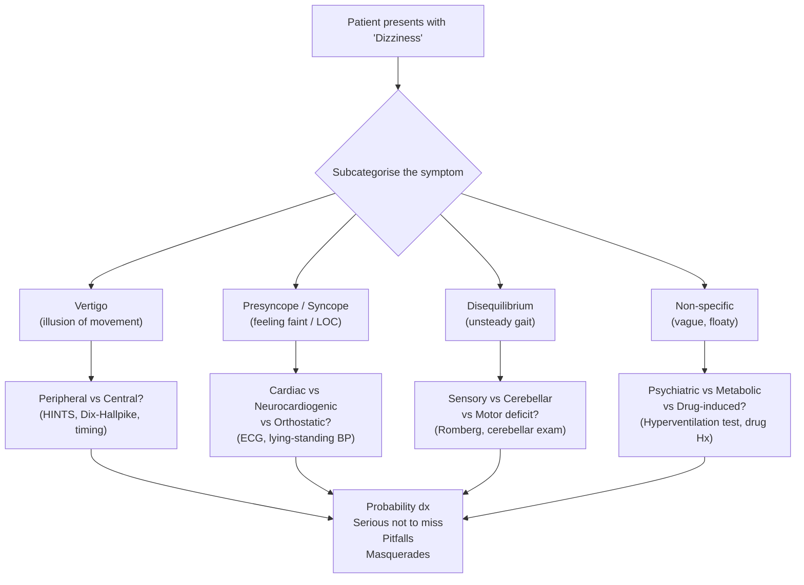
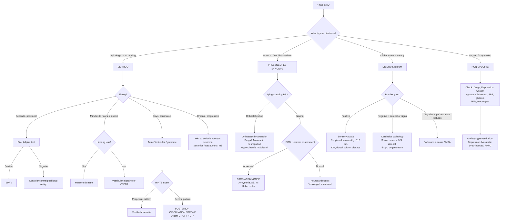

## Differential Diagnosis of Dizziness

The differential diagnosis of dizziness is one of the broadest in medicine because "dizziness" is a symptom, not a disease. Your job is to **narrow the field rapidly** by first sub-categorising the complaint (vertigo vs presyncope vs disequilibrium vs non-specific), then applying Murtagh's diagnostic framework to ensure nothing dangerous is missed.

Think of it this way: the differential is enormous *before* you talk to the patient, but after a careful history and a few bedside tests, it should shrink to 2–3 realistic possibilities. That's the power of the structured approach.

---

### 1. Organising Framework — Murtagh's Diagnostic Strategy

Murtagh's framework is designed for primary care and emergency presentations. It forces you to consider common things first, then systematically rule out the dangerous and the sneaky [1].

---

### 2. The Complete Differential — Murtagh's Categories

#### 2.1 Probability Diagnoses (Common Causes)

These account for the **vast majority** of presentations. When you hear hoofbeats, think horses first.

> ***Probability diagnosis:*** [1]
> - ***Anxiety–hyperventilation***
> - ***Postural hypotension***
> - ***Simple faint — vasovagal***
> - ***Acute vestibulopathy (V) — viral illness***
> - ***Benign paroxysmal positional vertigo (V)***
> - ***Motion sickness (V)***
> - ***Post head injury (V)***
> - ***Cervical dysfunction/spondylosis***

| Diagnosis | Type of dizziness | Why it's common | Key distinguishing feature |
|---|---|---|---|
| ***Anxiety–hyperventilation*** | Non-specific / lightheadedness | Prevalence of anxiety disorders (~5–10% population); hyperventilation → ↓PaCO₂ → cerebral vasoconstriction → dizziness | Chronic/episodic, a/w perioral paraesthesia, chest tightness, panic symptoms; reproduced by ***forced hyperventilation test*** [1] |
| ***Postural hypotension*** | Presyncope | Very common in elderly (polypharmacy, autonomic decline, dehydration); ***drugs are the most correctable cause*** [1] | Occurs on standing; documented by lying-standing BP (↓SBP ≥ 20 or ↓DBP ≥ 10) |
| ***Simple faint — vasovagal*** | Presyncope → syncope | ***Accounts for ~60% of all syncope*** [2][3]; exaggerated Bezold-Jarisch reflex | Prodrome of nausea, sweating, pallor; situational trigger; rapid recovery on recumbency |
| ***Acute vestibulopathy — viral illness*** | Vertigo (acute, persistent) | Post-viral vestibular neuritis is the most common cause of acute vestibular syndrome; ***"sudden vertigo in a young person after recent URTI"*** [1] | Acute onset severe vertigo lasting days, positive HIT (catch-up saccade), unidirectional nystagmus, no hearing loss |
| ***BPPV*** | Vertigo (episodic, seconds) | Most common cause of recurrent vertigo overall; incidence ↑ with age | Brief (< 60s), positional, fatigable; diagnostic ***Hallpike manoeuvre*** [1] with upbeating torsional nystagmus |
| ***Motion sickness*** | Vertigo + nausea | Sensory conflict (vestibular vs visual input); almost universal susceptibility to some degree | Clear relationship to motion; resolves when motion stops |
| ***Post head injury*** | Vertigo / mixed | Post-traumatic BPPV from otoconia displacement; labyrinthine concussion; post-concussion syndrome | Temporal relationship to head trauma |
| ***Cervical dysfunction/spondylosis*** | Disequilibrium / vague dizziness | Very common degenerative condition in middle-aged/elderly; cervical proprioceptors contribute to balance | A/w neck pain and stiffness; dizziness worsens with neck movement; no true vertigo |

<Callout title="Clinical Pearl — BPPV is the Most Common Vertigo" type="idea">
BPPV is the **single most common cause of vertigo** in both young and old. It's also the most satisfying to diagnose (Dix-Hallpike manoeuvre) and treat (Epley manoeuvre) at the bedside — a "one-stop" diagnosis and cure in many cases.
</Callout>

---

#### 2.2 Serious Disorders Not to Be Missed

These are the diagnoses that will **kill or permanently disable** your patient if you miss them. Always actively exclude these.

> ***Serious disorders not to be missed:*** [1]
> - ***Neoplasia/cancer: acoustic neuroma, posterior fossa tumour, other brain tumours (primary or secondary)***
> - ***Intracerebral infection (e.g. abscess)***
> - ***Cardiovascular: arrhythmias, myocardial infarction, aortic stenosis***
> - ***Cerebrovascular: vertebrobasilar insufficiency, brain stem infarct (e.g. PICA thrombosis)***
> - ***Multiple sclerosis***

| Diagnosis | Type of dizziness | Why it's serious | Key red flags |
|---|---|---|---|
| ***Acoustic neuroma*** | Progressive unsteadiness (rarely acute vertigo) | CPA mass → progressive CN VIII compression → sensorineural hearing loss; if large → brainstem/cerebellar compression | **Unilateral progressive SNHL + tinnitus** in a middle-aged patient; ***consider MRI*** [1]; a/w NF2 if bilateral [5] |
| ***Posterior fossa tumour / other brain tumours*** | Disequilibrium ± vertigo | Mass effect, ↑ICP, direct cerebellar/brainstem involvement; metastases common (lung, breast, melanoma) [5] | Progressive headache (worse AM, with Valsalva), N/V, papilloedema, cerebellar signs, focal neurological deficits |
| ***Intracerebral infection (abscess)*** | Disequilibrium ± vertigo | SOL with surrounding oedema → ↑ICP + focal deficits; posterior fossa abscess mimics cerebellar tumour | Fever + progressive neurological deficit + headache; risk factors (otitis media, sinusitis, immunosuppression, congenital heart disease) |
| ***Arrhythmias*** | Presyncope / syncope | ***Cardiac syncope carries ~30% mortality*** [2][3]; sudden ↓CO from tachy-/bradyarrhythmia → ↓cerebral perfusion | ***Sudden onset in any position, ± palpitations, brief (< 1 min), extreme pallor*** [2][3]; abnormal ECG; FHx of sudden death |
| ***Myocardial infarction*** | Presyncope / lightheadedness | ↓LV function → ↓CO; may also trigger arrhythmia; ***in elderly/DM, dizziness may be an "angina equivalent"*** [4] | Chest pain, diaphoresis, risk factors for IHD; ECG changes, elevated troponin |
| ***Aortic stenosis*** | Exertional presyncope / syncope | Fixed LVOT obstruction → cannot ↑CO with exercise → exertional cerebral hypoperfusion | Exertional dizziness/syncope, ejection systolic murmur radiating to carotids, narrow pulse pressure |
| ***Vertebrobasilar insufficiency*** | Vertigo (episodic, with brainstem symptoms) | Posterior circulation TIA; herald of brainstem stroke | Vertigo + the "5 D's" (Diplopia, Dysarthria, Dysphagia, Drop attacks, Dystaxia) + visual field defects; vascular risk factors |
| ***Brainstem infarct (e.g. PICA thrombosis)*** | Vertigo (acute, persistent, severe) | Lateral medullary syndrome (Wallenberg); a deadly mimicker of vestibular neuritis | ***Acute vertigo + brainstem signs*** (ipsilateral Horner's, facial numbness, contralateral body pain/temp loss, dysphagia); **negative HIT** (central pattern); direction-changing/vertical nystagmus |
| ***Multiple sclerosis*** | Vertigo / disequilibrium (episodic or progressive) | Demyelination of brainstem/cerebellar pathways; **vertigo is presenting symptom in ~5–10% of MS** | Young adult (20–40y), F > M; relapsing-remitting course; INO (MLF lesion); other demyelinating symptoms (optic neuritis, sensory symptoms, Lhermitte's sign) [7] |

<Callout title="Must Know — Posterior Circulation Stroke Mimics Vestibular Neuritis" type="error">
The single most dangerous diagnostic pitfall in dizziness is **misdiagnosing a posterior circulation stroke as vestibular neuritis**. Both present with acute vertigo + nausea + nystagmus. The **HINTS exam** distinguishes them:

- **Peripheral (safe)**: Positive HIT (catch-up saccade) + unidirectional nystagmus + no skew
- **Central (stroke!)**: Negative HIT (normal VOR) OR direction-changing nystagmus OR skew deviation

If **any one** of the three HINTS components is "central," treat as stroke until proven otherwise. HINTS is > 98% sensitive — **better than MRI within 48 hours** for posterior fossa strokes.
</Callout>

---

#### 2.3 Pitfalls (Often Missed)

These are diagnoses that are **frequently overlooked** — either because they're atypical presentations of common diseases, or because clinicians simply don't think of them.

> ***Pitfalls (often missed):*** [1]
> - ***Ear wax – otosclerosis***
> - ***Arrhythmias***
> - ***Hyperventilation***
> - ***Alcohol and other drugs (incl. illicit, e.g. cocaine)***
> - ***Cough or micturition syncope***
> - ***Vertiginous migraine / migrainous vertigo***
> - ***Parkinson disease***
> - ***Meniere syndrome (overdiagnosed)***
>
> ***Rarities:*** [1]
> - ***Addison disease***
> - ***Neurosyphilis***
> - ***Autonomic neuropathy***
> - ***Hypertension***
> - ***Subclavian steal***
> - ***Perilymphatic fistula***
> - ***Shy–Drager syndrome***

| Diagnosis | Why it's a pitfall | Mechanism of dizziness | How to catch it |
|---|---|---|---|
| ***Ear wax (cerumen impaction)*** | Easily overlooked; clinicians jump to complex diagnoses | Impacted cerumen against tympanic membrane → altered proprioceptive/pressure input ± conductive hearing loss → mild disequilibrium | **Otoscopy** — always look in the ears! Simple syringing may cure the "dizziness" |
| ***Otosclerosis*** | Gradual onset, may present as vague unsteadiness rather than classical hearing loss | Abnormal bone remodelling around stapes footplate → progressive conductive hearing loss; if involves cochlea (cochlear otosclerosis) → SNHL + vestibular symptoms | Progressive hearing loss in young adult; family history (AD inheritance); audiometry |
| ***Arrhythmias*** (repeated here because easily missed) | Paroxysmal arrhythmias may not be captured on a single ECG; patients may describe it only as "dizzy" | Intermittent ↓CO → transient cerebral hypoperfusion | ***ECG, Holter monitor*** [1]; ask about palpitations; consider loop recorder |
| ***Hyperventilation*** | Patients may not recognise they are hyperventilating; may present with "cardiac" symptoms (chest pain, palpitations) | ↓PaCO₂ → cerebral vasoconstriction + ↓ionised Ca²⁺ | ***Forced hyperventilation test*** [1] reproduces symptoms; look for perioral/digital paraesthesia, carpopedal spasm [4] |
| ***Alcohol and drugs (incl. illicit, e.g. cocaine)*** [1] | Patients may not volunteer substance use; clinicians may not ask | Alcohol: direct vestibulotoxicity + cerebellar toxicity; cocaine: vasospasm → cerebral ischaemia; many drugs → orthostatic hypotension/CNS depression | **Always ask about alcohol, illicit drugs, and OTC medications** |
| ***Cough or micturition syncope*** | Situational triggers may be embarrassing or not volunteered | Cough syncope: prolonged vigorous cough → ↑intrathoracic pressure → ↓venous return → ↓CO; micturition syncope: post-void vasovagal reflex (splanchnic blood pooling + vagal activation) | Careful history: "Do you feel dizzy when coughing / after urinating?" |
| ***Vertiginous migraine / migrainous vertigo*** (now called "vestibular migraine") | Vertigo without headache leads to misdiagnosis as Ménière's or anxiety; **one of the most commonly missed diagnoses in dizziness clinics** | Migraine pathophysiology modulates vestibular nuclei → episodic vertigo ± migrainous features | History of migraine; vertigo episodes (5 min–72h) with photophobia/phonophobia/visual aura; ***Meniere syndrome is overdiagnosed*** [1] — many "Ménière's" cases are actually vestibular migraine |
| ***Parkinson disease*** | Early PD may present with dizziness from ***orthostatic hypotension (autonomic dysfunction)*** before classical motor features are obvious [6] | Dopamine depletion in hypothalamus → autonomic dysfunction → postural hypotension → presyncope/dizziness; ***"worsened by levodopa/DA"*** [6] | Look for subtle tremor, bradykinesia, rigidity; lying-standing BP; ask about constipation, anosmia, REM sleep behaviour disorder |
| ***Meniere syndrome — overdiagnosed*** [1] | Clinicians overdiagnose Ménière's in any patient with episodic vertigo; true Ménière's requires the **full triad** (vertigo + hearing loss + tinnitus/aural fullness) | Endolymphatic hydrops | Insist on documented fluctuating low-frequency SNHL on audiometry before diagnosing; consider vestibular migraine as the more common alternative |

**Rarities explained:**

| Rarity | Mechanism of dizziness |
|---|---|
| ***Addison disease*** | Cortisol deficiency → ↓vascular tone + ↓mineralocorticoid → hypovolaemia and hypotension → presyncope; also hyponatraemia (↑ADH from hypocortisolaemia) [8] |
| ***Neurosyphilis*** | Treponema pallidum invades CNS → meningovascular syphilis (cerebrovascular ischaemia) or tabes dorsalis (posterior column degeneration → sensory ataxia) or otosyphilis (cochleo-vestibular damage) |
| ***Autonomic neuropathy*** | Damage to autonomic nerves (DM most common cause [9]) → impaired baroreceptor reflex → orthostatic hypotension → presyncope; ***"postural tachycardia with lightheadedness, dizziness, presyncope"*** [9] |
| ***Hypertension*** | Usually does NOT cause dizziness; however, ***severe/malignant HTN → hypertensive encephalopathy*** with headache, dizziness, visual disturbance; also antihypertensive overtreatment → orthostatic hypotension |
| ***Subclavian steal*** | Stenosis of subclavian artery proximal to vertebral artery origin → exercising ipsilateral arm "steals" blood from vertebrobasilar circulation via retrograde flow in vertebral artery → posterior circulation ischaemia → vertigo + arm claudication; BP discrepancy between arms |
| ***Perilymphatic fistula*** | Abnormal communication between middle ear and inner ear → perilymph leakage → vestibular dysfunction; triggered by Valsalva, straining, barotrauma, or surgery; ***Tullio phenomenon*** (vertigo induced by loud sounds) |
| ***Shy-Drager syndrome*** (now called **Multiple System Atrophy — MSA, cerebellar type**) | Progressive neurodegenerative disease with severe autonomic failure (orthostatic hypotension, urinary incontinence) + cerebellar/parkinsonian features → dizziness from both autonomic and cerebellar dysfunction |

---

#### 2.4 Masquerades Checklist

These are common medical conditions that can "masquerade" as dizziness — i.e., dizziness may be the presenting complaint but the underlying cause is something else entirely.

> ***Masquerades checklist:*** [1]
> - ***Depression***
> - ***Diabetes (hyper and hypoglycaemia)***
> - ***Drugs (several)***
> - ***Anaemia***
> - ***Thyroid disorder (possible)***
> - ***Spinal dysfunction***
> - ***UTI (possible)***

| Masquerade | Mechanism of dizziness | How to detect |
|---|---|---|
| ***Depression*** | Psychomotor retardation, poor concentration → subjective "dizziness"; somatisation; also a/w hyperventilation; commonly coexists with anxiety | Screen with PHQ-9; look for low mood, anhedonia, sleep disturbance, appetite change |
| ***Diabetes — hypoglycaemia*** | ***Neuroglycopenic symptoms: hunger, paraesthesia, seizures, focal weakness, clouding of vision, ↓consciousness*** [10]; adrenergic symptoms: palpitation, sweating, anxiety, tremor | ***Blood glucose*** [1]; Whipple's triad [10]; check drug history (insulin, sulfonylureas) |
| ***Diabetes — hyperglycaemia*** | Osmotic diuresis → dehydration → hypovolaemia → orthostatic hypotension; also diabetic autonomic neuropathy [9] | Blood glucose, HbA1c; lying-standing BP |
| ***Drugs (several)*** | Multiple mechanisms: orthostatic hypotension, CNS depression, vestibulotoxicity, cerebellar toxicity | ***"Commonly prescribed drugs, especially antihypertensives, antidepressants, aspirin and salicylates, glyceryl trinitrate, benzodiazepines, major tranquillisers, antiepileptics and antibiotics, can cause dizziness"*** [1] |
| ***Anaemia*** | ↓O₂ carrying capacity → ↓O₂ delivery to brain; ***"acute/severe: SOB, palpitation, dizziness/syncope (may be postural)"*** [11] | ***FBE*** [1]; look for pallor; ask about menorrhagia, melena, dietary history |
| ***Thyroid disorder*** | Hypothyroidism: ↓metabolic rate → ↓CO, ↓cerebral perfusion; hyperthyroidism: AF → irregular CO → dizziness; thyrotoxic crisis → cardiovascular collapse | TFTs; look for thyroid-related symptoms (weight changes, heat/cold intolerance, bowel habit changes) |
| ***Spinal dysfunction*** | Cervical spondylosis → abnormal proprioceptive input to vestibular nuclei → vague dizziness/disequilibrium (see probability diagnoses above) | Neck ROM, cervical spine tenderness, neurological exam of UL |
| ***UTI (possible)*** | In elderly: UTI → sepsis/systemic inflammation → delirium with dizziness/unsteadiness; also dehydration from fever | Urinalysis, urine culture; particularly relevant in elderly with new-onset confusion + dizziness |

> ***"Is the patient trying to tell me something? Very likely. Consider anxiety and/or depression."*** [1]

<Callout title="The Elderly Dizzy Patient — Almost Always Multifactorial" type="idea">
***"Dizziness is often multifactorial, especially in the elderly"*** [1]. In an 80-year-old on 8 medications with cataracts, peripheral neuropathy, cervical spondylosis, and mild depression — the "dizziness" isn't from one cause. It's the **cumulative effect** of degraded visual, vestibular, proprioceptive, cardiovascular, and central processing systems, compounded by polypharmacy. Your management must address **all contributing factors**, not just one.
</Callout>

---

### 3. Differential Organised by Dizziness Subtype

This is the clinically practical way to use the differential — once you've subcategorised the symptom, you apply the appropriate differential.

#### 3.1 Vertigo — Differential Diagnosis

| Category | Peripheral (inner ear / CN VIII) | Central (brainstem / cerebellum) |
|---|---|---|
| **Episodic, seconds** | ***BPPV*** | — |
| **Episodic, minutes–hours** | ***Ménière's disease*** | ***Vestibular migraine***, ***VBI/TIA*** |
| **Acute persistent (days)** | ***Vestibular neuritis***, ***labyrinthitis*** | ***Posterior circulation stroke (PICA)***, ***MS relapse***, cerebellar haemorrhage |
| **Chronic/progressive** | ***Acoustic neuroma*** [1], bilateral vestibulopathy (aminoglycosides), ***otosclerosis*** [1] | ***Posterior fossa tumour*** [1], cerebellar degeneration, ***MS*** [1] |
| **Positional** | ***BPPV*** | Central positional vertigo (rare — 4th ventricle tumour, Chiari malformation) |
| **Trauma-related** | ***Post-head injury BPPV*** [1], labyrinthine concussion, ***perilymphatic fistula*** [1] | Post-traumatic brainstem lesion |
| **Drug-related** | Aminoglycosides (bilateral vestibulopathy), ***alcohol*** [1] | Phenytoin/carbamazepine (cerebellar toxicity), ***alcohol*** [1] |

#### 3.2 Presyncope / Syncope — Differential Diagnosis

| Mechanism | Proportion | Causes | Key distinguishing features |
|---|---|---|---|
| ***Neurocardiogenic (60%)*** [2][3] | Most common | ***Vasovagal***, ***cough/micturition syncope*** [1], carotid sinus hypersensitivity | Prodrome (nausea, sweating, pallor); situational trigger; when standing; quick recovery |
| ***Cardiac (15%)*** [2][3] | Most dangerous | ***Arrhythmias*** [1], ***MI*** [1], ***aortic stenosis*** [1], PE, HCM, aortic dissection | ***Sudden onset, any position, ± palpitations/chest pain, brief, extreme pallor; ± exertional*** [2] |
| ***Orthostatic hypotension (15%)*** [2][3] | Very common in elderly | ***Drugs*** [1], ***autonomic neuropathy*** [9], hypovolaemia, ***Addison's*** [1], ***Shy-Drager/MSA*** [1], ***Parkinson's*** [1][6] | On standing; documented BP drop; identifiable cause |
| ***Metabolic*** | Variable | ***Hypoglycaemia*** [1][10], ***anaemia*** [1][11], hyperventilation | Context-dependent (diabetic medications, blood loss, anxiety) |

#### 3.3 Disequilibrium — Differential Diagnosis

| System | Causes | Why it causes imbalance |
|---|---|---|
| **Sensory (proprioceptive)** | Peripheral neuropathy (DM, B12 deficiency, alcohol), ***spinal dysfunction*** [1], dorsal column disease (tabes dorsalis) | Loss of joint position sense → Romberg positive; wide-based gait worsened by eye closure |
| **Vestibular** | Bilateral vestibulopathy (aminoglycosides, bilateral Ménière's), chronic unilateral vestibular loss | Impaired vestibular input → oscillopsia + unsteadiness |
| **Cerebellar** | ***Posterior fossa tumour*** [1], cerebellar stroke, ***MS*** [1], chronic alcohol, drugs (phenytoin) | Loss of motor coordination → truncal/limb ataxia; Romberg negative; wide-based gait NOT worsened by eye closure |
| **Motor** | ***Parkinson disease*** [1][6], normal pressure hydrocephalus | PD: rigidity + postural instability; NPH: triad of gait apraxia + dementia + urinary incontinence |
| **Visual** | Cataracts, macular degeneration, refractive error | Loss of visual spatial reference → instability, especially in low light |
| **Multifactorial** | ***Elderly with multiple contributing factors*** [1] | Cumulative degradation of all sensory and motor systems |

#### 3.4 Non-specific Dizziness — Differential Diagnosis

| Category | Causes | Mechanism |
|---|---|---|
| **Psychiatric** | ***Anxiety–hyperventilation*** [1], ***depression*** [1], panic disorder [12], PPPD, somatoform disorder [12] | Hyperventilation → ↓PaCO₂ → cerebral vasoconstriction; somatisation; maladaptive central vestibular processing |
| **Metabolic** | ***Hypoglycaemia*** [1][10], ***hyperglycaemia*** [1], hyponatraemia [13], hypercalcaemia, ***thyroid disorder*** [1] | Variable: neuroglycopenia, osmotic shifts, altered neuronal excitability |
| **Haematological** | ***Anaemia*** [1][11], ***polycythaemia vera*** [14] | Anaemia: ↓O₂ delivery; PV: hyperviscosity → ↓cerebral blood flow |
| **Drug-related** | ***Multiple drugs*** [1], ***alcohol*** [1] | Multiple mechanisms (see Section 2.3) |
| **Infective** | ***UTI in elderly*** [1], systemic sepsis | Delirium, dehydration, hypotension |

---

### 4. "Can't-Miss" Red Flags Summary

When evaluating any dizzy patient, actively look for these red flags that point towards serious pathology:

| Red flag | Suggests |
|---|---|
| **New headache** (especially progressive, worse AM, with Valsalva) | Posterior fossa tumour, ↑ICP [5] |
| **Brainstem symptoms** (diplopia, dysarthria, dysphagia, facial numbness, Horner's) | Posterior circulation stroke, brainstem lesion [1] |
| **Sudden onset at rest/during exertion + palpitations + chest pain** | ***Cardiac syncope*** — 30% mortality [2][3] |
| **Negative head impulse test** in acute vestibular syndrome | Central cause (stroke) — NOT peripheral |
| **Direction-changing or purely vertical nystagmus** | Central cause |
| **Progressive unilateral hearing loss** | ***Acoustic neuroma*** [1] |
| **New focal neurological deficit** | Stroke, MS, tumour, abscess |
| **Exertional syncope** | ***Aortic stenosis***, HCM, pulmonary hypertension [1] |
| **Family history of sudden cardiac death** | Inherited arrhythmia (Long QT, Brugada, HCM) |
| **Recent head trauma** with worsening symptoms | Expanding subdural haematoma, diffuse axonal injury |

---

### 5. Algorithmic Approach to Differential Diagnosis

Here is a practical bedside algorithm integrating the Murtagh framework with modern vestibular neurology:

---

### 6. Key Differentiating Features — Summary Table

| Feature | BPPV | Vestibular neuritis | Ménière's | Vestibular migraine | Posterior circulation stroke | Cardiac syncope | Vasovagal |
|---|---|---|---|---|---|---|---|
| **Type** | Vertigo | Vertigo | Vertigo | Vertigo | Vertigo ± brainstem Sx | Presyncope/syncope | Presyncope/syncope |
| **Duration** | Seconds | Days | 20 min–hours | 5 min–72h | Minutes–days | Seconds–minutes | Seconds–minutes |
| **Trigger** | Position change | None (post-URTI) | Spontaneous | Migraine triggers | Spontaneous | Any position, ± exertion | Standing, situational |
| **Hearing loss** | No | No | Yes (fluctuating, low-freq) | No (usually) | Rare (if AICA) | No | No |
| **Nystagmus** | Upbeating torsional | Unidirectional horiz-torsional | Horizontal | Variable | Direction-changing/vertical | None | None |
| **HIT** | Normal (if not acute) | Positive (catch-up saccade) | Normal between attacks | Normal | Negative (normal = bad!) | N/A | N/A |
| **Brainstem signs** | No | No | No | No | **Yes** | No | No |
| **Key test** | ***Dix-Hallpike*** [1] | HINTS | Audiometry | Clinical criteria | MRI/CTA | ***ECG, Holter*** [1] | Tilt table |

---

<Callout title="High Yield Summary — Differential Diagnosis of Dizziness">

1. **First step**: Subcategorise → Vertigo vs Presyncope vs Disequilibrium vs Non-specific

2. **Probability diagnoses** [1]: Anxiety–hyperventilation, postural hypotension, vasovagal, vestibular neuritis, BPPV, motion sickness, post-head injury, cervical spondylosis

3. **Serious not to miss** [1]: Acoustic neuroma, posterior fossa tumour, brain tumour, intracerebral abscess, arrhythmias (30% mortality!), MI, aortic stenosis, VBI, brainstem infarct (PICA), MS

4. **Pitfalls** [1]: Ear wax, arrhythmias, hyperventilation, alcohol/drugs, cough/micturition syncope, vestibular migraine (commonly missed), Parkinson's (autonomic features), Ménière's (overdiagnosed)

5. **Masquerades** [1]: Depression, diabetes (hypo/hyperglycaemia), drugs, anaemia, thyroid disorder, spinal dysfunction, UTI

6. **Acute vestibular syndrome**: The critical DDx is vestibular neuritis (peripheral) vs posterior circulation stroke (central) → use **HINTS exam** (more sensitive than early MRI)

7. **Syncope**: Cardiac (15%, most dangerous) vs Neurocardiogenic (60%, most common) vs Orthostatic (15%)

8. **In the elderly**: Always think multifactorial, check all medications, lying-standing BP, FBE, glucose
</Callout>

---

<ActiveRecallQuiz
  title="Active Recall - Differential Diagnosis of Dizziness"
  items={[
    {
      question: "A 75-year-old woman on amlodipine, furosemide, and amitriptyline presents with recurrent near-fainting on standing. What is the most likely diagnosis, and what is the single most important bedside test to confirm it?",
      markscheme: "Orthostatic (postural) hypotension, most likely drug-induced (all three drugs can cause it: amlodipine = vasodilator, furosemide = volume depletion, amitriptyline = anticholinergic/alpha-blocking). Confirm with lying-standing BP: drop of SBP 20 or more or DBP 10 or more within 3 minutes of standing."
    },
    {
      question: "Name three 'pitfall' diagnoses in dizziness according to Murtagh that are commonly missed, and explain why each is missed.",
      markscheme: "1) Vestibular migraine - missed because vertigo can occur without headache, leading to misdiagnosis as Meniere (which is overdiagnosed). 2) Arrhythmias - paroxysmal nature means ECG may be normal; need Holter. 3) Hyperventilation - patients may not realise they are over-breathing; symptoms mimic cardiac disease. Other acceptable: ear wax, Parkinson disease, cough/micturition syncope, alcohol/drugs."
    },
    {
      question: "List the Murtagh masquerades checklist for dizziness.",
      markscheme: "Depression, Diabetes (hyper and hypoglycaemia), Drugs (several), Anaemia, Thyroid disorder (possible), Spinal dysfunction, UTI (possible)."
    },
    {
      question: "A 60-year-old man with hypertension and diabetes presents with acute vertigo, nausea, and right-beating nystagmus. Head impulse test is normal (no catch-up saccade). What is the most likely diagnosis and why does a normal HIT point towards this?",
      markscheme: "Posterior circulation stroke (e.g. PICA territory / lateral medullary syndrome). A normal (negative) HIT means the peripheral VOR arc (labyrinth to vestibular nerve to vestibular nuclei to oculomotor nuclei) is intact. Since the patient has vertigo but the peripheral pathway works normally, the lesion must be central (brainstem or cerebellum), not at the labyrinth/vestibular nerve. This is the dangerous HINTS pattern."
    },
    {
      question: "Explain the mechanism of subclavian steal syndrome causing dizziness. What physical sign would you find on examination?",
      markscheme: "Stenosis of subclavian artery proximal to vertebral artery origin. When ipsilateral arm is exercised, increased demand causes blood to flow retrograde down the vertebral artery (stealing from the posterior circulation) to supply the arm. This causes transient posterior circulation ischaemia with vertigo, diplopia, and ataxia. Physical sign: blood pressure discrepancy between arms (lower on the affected side, typically more than 15 mmHg difference)."
    },
    {
      question: "Why does Murtagh warn that Meniere syndrome is overdiagnosed? What is the most commonly confused alternative diagnosis?",
      markscheme: "Meniere disease requires the full clinical triad of episodic vertigo (20 min to hours) plus fluctuating low-frequency sensorineural hearing loss plus tinnitus/aural fullness, ideally with documented hearing loss on audiometry. Many patients with episodic vertigo alone are misdiagnosed as Meniere when they actually have vestibular migraine, which is the most commonly confused alternative. Vestibular migraine is more common than Meniere and presents with episodic vertigo with or without headache, often in patients with a migraine history."
    }
  ]}
/>

## References

[1] Lecture slides: murtagh merge.pdf (Dizziness/vertigo section, pp. 35–37)
[2] Senior notes: Ryan Ho Cardiology.pdf (Section 2.4 Syncope, p. 63)
[3] Senior notes: Ryan Ho Fundamentals.pdf (Section 3.1.4 Syncope, p. 208)
[4] Senior notes: Ryan Ho Cardiology.pdf (Chest Pain approach, pp. 55–56)
[5] Senior notes: maxim.md (Brain tumours, section 771)
[6] Senior notes: Ryan Ho Neurology.pdf (Parkinson disease clinical features, p. 121)
[7] Senior notes: Ryan Ho Opthalmology.pdf (Optic neuritis, p. 92)
[8] Senior notes: Ryan Ho Endocrine.pdf (Adrenal insufficiency, p. 71)
[9] Senior notes: Ryan Ho Endocrine.pdf (Diabetic autonomic neuropathy, p. 98)
[10] Senior notes: Ryan Ho Endocrine.pdf (Hypoglycaemia, p. 94)
[11] Senior notes: Ryan Ho Haemtology.pdf (Approach to Anaemia, p. 10)
[12] Senior notes: Ryan Ho Psychiatry.pdf (Panic disorder / GAD, pp. 173, 179)
[13] Senior notes: Ryan Ho Chemical Path.pdf (SIADH / hyponatraemia, p. 10)
[14] Senior notes: Ryan Ho Haemtology.pdf (Polycythaemia Vera, p. 76)
